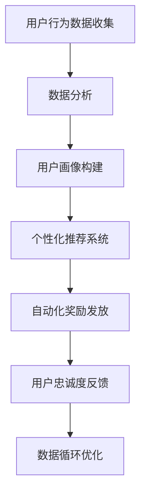

                 

## 1. 背景介绍

在自动化创业领域，用户忠诚度计划（User Loyalty Programs, ULPs）扮演着至关重要的角色。随着技术的发展和市场的竞争加剧，吸引和留住用户变得比以往任何时候都更加困难。为此，许多公司开始采用自动化系统来设计、实施和管理用户忠诚度计划，以促进用户参与、提升品牌忠诚度和增加收入。本文将深入探讨基于自动化技术的用户忠诚度计划的核心概念、原理及其实施步骤，并分析其在实际应用中的优缺点和未来趋势。

## 2. 核心概念与联系

### 2.1 核心概念概述

用户忠诚度计划通常旨在通过奖励机制（如积分、折扣、会员特权等）激励用户持续使用产品或服务，从而提高用户满意度和品牌忠诚度。自动化技术在这一过程中发挥了关键作用，它不仅简化了流程，提高了效率，还通过数据分析和个性化推荐，提升了用户体验。

以下是几个核心概念：

- **用户忠诚度计划**：通过奖励和激励机制，促进用户持续使用产品或服务，提升品牌忠诚度。
- **自动化技术**：利用软件和算法自动执行任务，优化用户体验和提升运营效率。
- **数据分析**：收集和分析用户数据，理解用户行为和偏好，提供个性化服务。
- **个性化推荐**：基于用户行为和偏好，推荐相关产品或服务，提升用户满意度。

这些概念之间的联系紧密，通过自动化技术和大数据分析，企业可以更好地理解用户需求，设计出更具吸引力的忠诚度计划，同时自动化系统可以快速实施和维护这些计划，确保其有效性和可持续性。

### 2.2 核心概念原理和架构的 Mermaid 流程图



这个流程图展示了自动化用户忠诚度计划的总体架构。用户行为数据首先被收集，通过数据分析构建用户画像，接着使用个性化推荐系统为用户推荐产品或服务，自动化系统根据推荐结果发放奖励，用户对奖励的反应又用于进一步优化数据和模型。

## 3. 核心算法原理 & 具体操作步骤

### 3.1 算法原理概述

基于自动化技术的用户忠诚度计划主要依赖于以下几个算法：

- **推荐算法**：根据用户历史行为和偏好，推荐个性化产品或服务，以提高用户参与度。
- **行为分析算法**：分析用户行为数据，识别关键行为模式，用于设计有效的奖励机制。
- **模型优化算法**：不断调整模型参数，优化用户画像和推荐系统，提高计划的有效性。

### 3.2 算法步骤详解

**Step 1: 用户行为数据收集**
- 通过应用程序、网站或物理交互等渠道，收集用户的行为数据。

**Step 2: 数据分析和用户画像构建**
- 使用数据分析工具（如Apache Spark、TensorFlow等）处理用户行为数据，构建用户画像，包括用户的兴趣、偏好、购买历史等。

**Step 3: 个性化推荐**
- 使用推荐算法（如协同过滤、内容推荐、混合推荐等）根据用户画像生成个性化推荐。

**Step 4: 自动化奖励发放**
- 根据推荐结果和用户行为，自动化系统发放奖励（如积分、折扣券等）。

**Step 5: 用户忠诚度反馈**
- 收集用户对奖励的反馈数据，用于优化推荐算法和奖励机制。

**Step 6: 数据循环优化**
- 定期分析用户反馈和行为数据，调整模型参数，优化用户画像和推荐系统。

### 3.3 算法优缺点

**优点：**
- **效率提升**：自动化系统可以24/7不间断运行，提高响应速度和处理能力。
- **个性化推荐**：基于数据分析，为用户提供更符合其需求的个性化推荐，提升用户满意度。
- **成本节约**：自动化流程减少了人工干预的需要，降低了运营成本。
- **实时优化**：通过实时分析用户反馈，快速调整模型和策略，提高计划的有效性。

**缺点：**
- **数据隐私**：收集和分析用户数据可能引发隐私问题，需严格遵守相关法律法规。
- **过度个性化**：过度个性化的推荐可能限制用户探索新事物的机会。
- **复杂度增加**：设计和维护自动化系统需要高水平的技术和专业知识。
- **技术依赖**：自动化系统依赖于技术基础设施，一旦出现故障，可能影响用户体验。

### 3.4 算法应用领域

用户忠诚度计划的应用领域广泛，以下是几个典型案例：

- **电商平台**：通过积分、折扣等奖励机制，鼓励用户购物，提升用户回购率。
- **旅游服务**：提供会员特权、积分兑换等，吸引用户频繁预订，提高客户保留率。
- **订阅服务**：如音乐、视频流媒体等，通过会员计划、定制推荐，提升用户订阅率和满意度。
- **金融服务**：通过奖励卡、优惠活动等，吸引用户进行金融交易，提高用户活跃度。
- **健康与健身**：提供积分、折扣、健身计划等，鼓励用户持续使用，提升客户忠诚度。

## 4. 数学模型和公式 & 详细讲解 & 举例说明

### 4.1 数学模型构建

假设有一个电商平台，用户通过购物获得积分，积分可用于兑换优惠券。我们设 $U$ 为所有用户的集合，$I$ 为所有积分的集合，$T$ 为所有交易的集合。令 $R_{ui}$ 表示用户 $u$ 在交易 $t$ 上获得的积分，$C_{ui}$ 表示用户 $u$ 在交易 $t$ 上花费的金额。目标是最大化以下模型：

$$
\max_{R} \sum_{u \in U} \sum_{t \in T} \log p_{R_{ui} \mid C_{ui}}
$$

其中 $p$ 是模型参数，用于预测用户获得积分的概率。

### 4.2 公式推导过程

利用最大似然估计（Maximum Likelihood Estimation,MLE），我们可以求解模型参数 $p$。将数据对数似然最大化，得到：

$$
\log p_{R_{ui} \mid C_{ui}} = \frac{R_{ui}}{C_{ui}} \cdot \log p_{R_{ui} \mid C_{ui}} + (1 - \frac{R_{ui}}{C_{ui}}) \cdot \log p_{0 \mid C_{ui}}
$$

其中 $p_{0 \mid C_{ui}}$ 是用户不获得积分的概率。

### 4.3 案例分析与讲解

假设我们有一个简单的电商平台，用户每次购物都会获得1%的积分。我们使用模型预测用户获得积分的概率。通过对历史数据的分析，我们可以得到用户获得积分的概率 $p$。然后，对于新交易，我们可以计算用户获得积分的概率，并据此调整奖励策略。

## 5. 项目实践：代码实例和详细解释说明

### 5.1 开发环境搭建

首先，我们需要搭建一个Python开发环境。可以使用Anaconda来创建一个虚拟环境，并安装所需的Python库，如Pandas、NumPy、Scikit-learn、TensorFlow等。

```bash
conda create -n loyalty-program python=3.8
conda activate loyalty-program
pip install pandas numpy scikit-learn tensorflow
```

### 5.2 源代码详细实现

下面是一个简单的Python代码实现，用于计算用户获得积分的概率。假设我们有一个简单的数据集，包含用户ID、交易金额和获得的积分。

```python
import pandas as pd
from sklearn.linear_model import LogisticRegression

# 加载数据
data = pd.read_csv('transactions.csv')

# 数据预处理
X = data[['C_{ui}']]
y = data['R_{ui}'] / data['C_{ui}']

# 构建模型
model = LogisticRegression()

# 训练模型
model.fit(X, y)

# 预测新交易的概率
new_transaction = {'C_{ui}': 100.0}
predicted_probability = model.predict_proba(new_transaction)
```

### 5.3 代码解读与分析

在这个示例中，我们使用Logistic回归模型来预测用户获得积分的概率。首先，我们加载数据集，并对其进行预处理，将交易金额作为特征，积分作为目标变量。然后，我们使用Logistic回归模型进行训练，并使用新交易的数据预测其获得积分的概率。

### 5.4 运行结果展示

假设我们训练了一个模型，预测新交易获得积分的概率为0.1。这意味着如果用户消费100元，那么该用户获得积分的概率为10%。

## 6. 实际应用场景

### 6.1 电商平台的忠诚度计划

电商平台可以通过积分和优惠券激励用户持续购物。自动化系统可以根据用户的购物历史和偏好，推荐个性化的优惠活动。例如，一个经常购买电子产品的用户，可能会收到特定品牌或类别的优惠券。

### 6.2 旅游服务的会员计划

旅游服务公司可以设计会员计划，提供积分、折扣等奖励，吸引用户频繁预订旅游服务。自动化系统可以基于用户的历史预订记录，推荐符合其偏好的旅游目的地和套餐。

### 6.3 订阅服务的个性化推荐

视频流媒体平台可以提供会员计划，鼓励用户订阅并观看更多内容。自动化系统可以根据用户的观看历史和偏好，推荐相关视频和频道。例如，一个喜欢科幻电影的用户可能会收到科幻类电影的推荐。

## 7. 工具和资源推荐

### 7.1 学习资源推荐

1. **《用户行为分析：从数据到洞察》**：这本书深入浅出地介绍了用户行为分析的基本概念和常用技术，适合初学者。
2. **Coursera《推荐系统》课程**：由斯坦福大学开设的在线课程，涵盖了推荐系统的基本原理和实现方法。
3. **Kaggle竞赛**：参加Kaggle的推荐系统竞赛，可以积累实战经验，提高分析能力。
4. **GitHub资源**：GitHub上有很多用户忠诚度计划的开源项目和代码示例，可以参考学习。

### 7.2 开发工具推荐

1. **Jupyter Notebook**：一个强大的交互式编程环境，适合数据分析和模型开发。
2. **TensorFlow**：一个强大的机器学习框架，支持深度学习和推荐系统。
3. **Pandas**：一个数据处理库，适合数据清洗和预处理。
4. **Scikit-learn**：一个机器学习库，提供了各种经典的算法实现。

### 7.3 相关论文推荐

1. **《基于用户行为分析的个性化推荐系统》**：介绍了一种基于用户行为数据的推荐算法，适用于电商和订阅服务等场景。
2. **《自动化推荐系统：原理与实践》**：详细介绍了推荐系统的构建和优化方法，适合了解最新的研究成果。
3. **《用户忠诚度计划的效果评估》**：分析了不同忠诚度计划对用户行为的影响，提供了评估方法和指标。

## 8. 总结：未来发展趋势与挑战

### 8.1 研究成果总结

自动化用户忠诚度计划结合了自动化技术和数据分析，通过个性化推荐和自动化奖励发放，显著提升了用户体验和品牌忠诚度。然而，数据隐私和技术复杂性仍是其面临的主要挑战。

### 8.2 未来发展趋势

未来的发展趋势包括：

1. **多渠道整合**：将自动化系统扩展到多个渠道，如社交媒体、邮件营销等，提供全面的用户体验。
2. **实时数据处理**：使用流式处理技术，实时分析用户行为，快速调整奖励策略。
3. **个性化模型优化**：通过机器学习和深度学习技术，提升个性化推荐的准确性。
4. **跨平台协同**：不同平台之间的数据和策略协同，提升整体的用户忠诚度。

### 8.3 面临的挑战

自动化用户忠诚度计划面临的挑战包括：

1. **数据隐私**：如何保护用户数据，避免隐私泄露。
2. **技术复杂性**：自动化系统的设计和维护需要高水平的技术和专业知识。
3. **过度个性化**：避免过度个性化推荐，限制用户探索新事物的机会。
4. **用户信任**：建立用户对自动化系统的信任，确保其可靠性。

### 8.4 研究展望

未来的研究将集中在以下几个方面：

1. **隐私保护技术**：开发更有效的隐私保护算法，保护用户数据安全。
2. **自动化系统的可解释性**：增强自动化系统的可解释性，提高用户信任。
3. **多模态数据融合**：结合文本、图像、语音等多种数据类型，提升推荐系统的效果。
4. **跨领域应用**：将自动化用户忠诚度计划应用于更多领域，如医疗、金融等。

## 9. 附录：常见问题与解答

**Q1: 什么是自动化用户忠诚度计划？**

A: 自动化用户忠诚度计划是指通过自动化技术和大数据分析，设计、实施和管理用户忠诚度计划，以促进用户持续使用产品或服务，提升品牌忠诚度和用户满意度。

**Q2: 如何设计有效的自动化用户忠诚度计划？**

A: 设计有效的自动化用户忠诚度计划需要以下几个步骤：
1. 收集和分析用户行为数据，构建用户画像。
2. 使用推荐算法生成个性化推荐。
3. 自动化系统根据推荐结果发放奖励。
4. 收集用户反馈，优化模型和策略。

**Q3: 自动化用户忠诚度计划面临的主要挑战是什么？**

A: 自动化用户忠诚度计划面临的主要挑战包括：
1. 数据隐私：如何保护用户数据，避免隐私泄露。
2. 技术复杂性：自动化系统的设计和维护需要高水平的技术和专业知识。
3. 过度个性化：避免过度个性化推荐，限制用户探索新事物的机会。
4. 用户信任：建立用户对自动化系统的信任，确保其可靠性。

**Q4: 自动化用户忠诚度计划的应用领域有哪些？**

A: 自动化用户忠诚度计划的应用领域包括但不限于：
1. 电商平台：通过积分和优惠券激励用户持续购物。
2. 旅游服务：提供会员特权、积分兑换等，吸引用户频繁预订。
3. 订阅服务：如音乐、视频流媒体等，通过会员计划、定制推荐，提升用户订阅率。
4. 金融服务：通过奖励卡、优惠活动等，吸引用户进行金融交易。
5. 健康与健身：提供积分、折扣、健身计划等，鼓励用户持续使用。

**Q5: 自动化用户忠诚度计划的优势和劣势是什么？**

A: 自动化用户忠诚度计划的优势包括：
1. 效率提升：自动化系统可以24/7不间断运行，提高响应速度和处理能力。
2. 个性化推荐：基于数据分析，为用户提供更符合其需求的个性化推荐，提升用户满意度。
3. 成本节约：自动化流程减少了人工干预的需要，降低了运营成本。
4. 实时优化：通过实时分析用户反馈，快速调整模型和策略，提高计划的有效性。

劣势包括：
1. 数据隐私：收集和分析用户数据可能引发隐私问题，需严格遵守相关法律法规。
2. 过度个性化：过度个性化的推荐可能限制用户探索新事物的机会。
3. 技术依赖：自动化系统依赖于技术基础设施，一旦出现故障，可能影响用户体验。

---
作者：禅与计算机程序设计艺术 / Zen and the Art of Computer Programming

