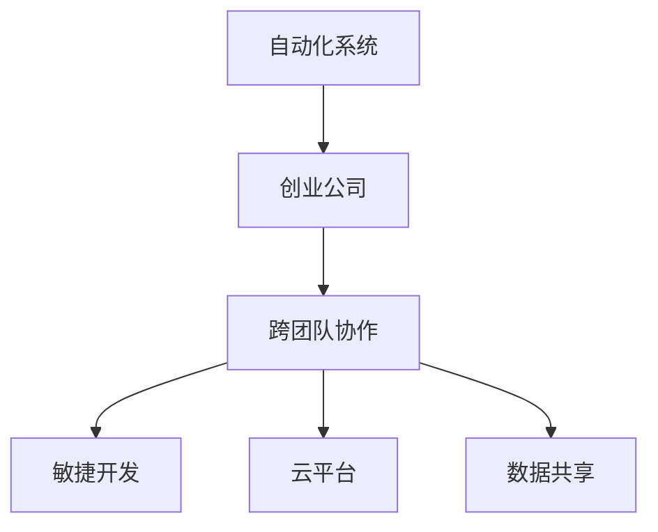

                 

# 自动化创业中的跨团队协作

> 关键词：自动化, 创业, 跨团队协作, 项目管理, 敏捷开发, 云平台, 数据共享

## 1. 背景介绍

### 1.1 问题由来
随着人工智能技术的迅猛发展，自动化系统在各行各业得到了广泛的应用，从制造业到金融服务，从医疗保健到零售电商，自动化的身影无处不在。在自动化创业公司中，技术研发团队面临的最大挑战之一是如何高效地跨团队协作，确保项目按时交付、质量达标，并实现持续创新。

### 1.2 问题核心关键点
在自动化创业项目中，跨团队协作的核心关键点包括：
- 需求管理：确保项目需求清晰、准确，并得到所有相关方的共识。
- 沟通协调：建立高效的信息沟通机制，减少误解和信息传递延迟。
- 资源配置：合理分配人力资源和物料资源，避免资源浪费和冲突。
- 任务分配：将项目分解成可管理的小任务，分配给不同的团队和成员。
- 进度监控：实时跟踪项目进度，及时发现和解决问题。
- 质量控制：确保交付的软件或产品符合预定的质量标准和性能指标。

这些关键点直接关系到自动化项目的成败，对公司的发展具有深远影响。本文将详细探讨这些关键点，并提供相应的解决方案和实践指南。

## 2. 核心概念与联系

### 2.1 核心概念概述

为了更好地理解自动化创业中的跨团队协作，本节将介绍几个密切相关的核心概念：

- **自动化系统**：指利用人工智能和机器学习技术，自动完成特定任务的系统。常见的自动化系统包括自动化生产线、自动驾驶、智能客服等。

- **创业公司**：指以技术创新为核心驱动力，旨在解决特定问题、创造新价值的公司。自动化创业公司通过自主研发和应用创新，为客户提供自动化解决方案，提升效率和效益。

- **跨团队协作**：指不同职能团队（如开发、测试、运维、市场、销售等）之间的合作，共同完成项目目标。良好的跨团队协作能够最大化资源利用效率，提升项目成功率。

- **敏捷开发**：一种迭代、增量的软件开发方法，强调快速响应市场变化和用户需求，持续交付高质量的软件产品。

- **云平台**：指基于互联网的计算和存储资源服务，提供弹性、按需使用的计算资源，支持自动化项目的快速部署和扩展。

- **数据共享**：指不同团队之间共享项目数据和信息，提高决策的准确性和效率。数据共享是跨团队协作的重要基础。

这些核心概念之间的逻辑关系可以通过以下Mermaid流程图来展示：



这个流程图展示了几大核心概念及其之间的关系：

1. 自动化系统作为创业公司的核心业务，需要跨团队协作来实现。
2. 敏捷开发是实现高效跨团队协作的重要方法论。
3. 云平台提供资源支持，是跨团队协作的基础设施。
4. 数据共享是跨团队协作的必要条件，有助于提升决策效率和协作质量。

## 3. 核心算法原理 & 具体操作步骤
### 3.1 算法原理概述

在自动化创业中，跨团队协作的主要目标是高效、准确地完成任务，确保项目按时交付。其算法原理可以归纳为以下几个方面：

- **需求管理**：通过需求分析工具（如JIRA、Trello等），明确项目需求和优先级，确保所有相关方达成共识。
- **沟通协调**：使用即时通讯工具（如Slack、Microsoft Teams等）和协作平台（如Confluence、Notion等），保持高效的信息沟通。
- **资源配置**：采用项目管理工具（如Asana、Trello等），合理分配人力资源和物料资源，避免资源浪费和冲突。
- **任务分配**：使用敏捷开发方法（如Scrum、Kanban等），将项目分解成可管理的小任务，分配给不同的团队和成员。
- **进度监控**：通过敏捷开发工具（如JIRA、Trello等），实时跟踪项目进度，及时发现和解决问题。
- **质量控制**：使用测试工具（如Selenium、JUnit等）和持续集成工具（如Jenkins、GitLab CI等），确保交付的软件或产品符合预定的质量标准和性能指标。

### 3.2 算法步骤详解

基于上述算法原理，自动化创业中的跨团队协作一般包括以下几个关键步骤：

**Step 1: 需求分析与管理**
- 收集和整理项目需求，包括功能需求、性能需求、质量需求等。
- 使用需求管理工具（如JIRA、Trello等），明确需求优先级和范围，确保所有相关方达成共识。
- 定期召开需求评审会议，与利益相关方沟通需求变更，确保需求文档始终准确反映项目目标。

**Step 2: 信息沟通与协作**
- 使用即时通讯工具（如Slack、Microsoft Teams等），建立高效的信息沟通机制。
- 在协作平台（如Confluence、Notion等）上创建项目文档，记录项目进展、决策记录和问题跟踪。
- 定期召开团队会议，讨论项目进展、问题和解决方案，确保信息透明和及时传递。

**Step 3: 资源配置与任务分配**
- 使用项目管理工具（如Asana、Trello等），合理分配人力资源和物料资源。
- 将项目分解成可管理的小任务，并分配给不同的团队和成员。
- 设置任务的截止日期和优先级，确保任务按时完成。

**Step 4: 进度监控与问题解决**
- 通过敏捷开发工具（如JIRA、Trello等），实时跟踪项目进度。
- 定期进行项目回顾和评审，分析项目进展和问题，及时调整计划和资源配置。
- 使用问题跟踪工具（如JIRA、Trello等），记录和跟踪项目问题，确保问题得到及时解决。

**Step 5: 质量控制与持续交付**
- 使用测试工具（如Selenium、JUnit等），确保交付的软件或产品符合预定的质量标准和性能指标。
- 通过持续集成工具（如Jenkins、GitLab CI等），实现自动化构建和部署，确保软件可靠性和一致性。
- 定期进行代码审查和功能验证，及时发现和修复代码和功能缺陷。

### 3.3 算法优缺点

自动化创业中的跨团队协作方法具有以下优点：
1. 提高项目效率：通过需求分析、任务分配和进度监控，确保项目按时交付。
2. 增强团队协作：通过信息沟通和协作平台，提升团队之间的协作效率和信息共享。
3. 优化资源配置：通过项目管理工具，合理分配人力资源和物料资源，避免资源浪费和冲突。
4. 提升产品质量：通过测试工具和持续集成，确保交付的软件或产品符合质量标准和性能指标。

同时，该方法也存在一定的局限性：
1. 对工具依赖度高：依赖于各种工具和平台，可能导致工具使用不当或工具切换困难。
2. 需要持续维护：工具和平台需要定期维护和更新，确保其稳定性和兼容性。
3. 团队文化差异：不同团队之间可能存在文化差异和工作习惯差异，需要时间适应和调整。
4. 信息透明性不足：信息沟通不畅可能导致误解和信息传递延迟，影响项目进展。

尽管存在这些局限性，但就目前而言，跨团队协作方法仍然是自动化创业项目中不可或缺的一部分。未来相关研究的重点在于如何进一步优化工具和流程，减少对工具的依赖，提升信息透明性和团队协作效率。

### 3.4 算法应用领域

自动化创业中的跨团队协作方法在多个领域得到了广泛应用，例如：

- 自动驾驶系统：涉及软件研发、硬件设计、测试验证等多个团队，通过高效协作，实现系统集成和性能优化。
- 智能客服系统：涵盖需求分析、系统开发、测试部署等多个团队，通过跨团队协作，提升系统响应速度和用户体验。
- 智能制造系统：涉及生产计划、设备维护、质量控制等多个团队，通过协同工作，实现生产过程自动化和智能化。
- 智慧医疗系统：涵盖临床应用、数据分析、算法优化等多个团队，通过团队协作，提升医疗服务的效率和质量。
- 电子商务平台：涉及前端开发、后端开发、测试验证等多个团队，通过高效协作，提升平台稳定性和用户体验。

除了上述这些经典应用外，跨团队协作方法还被创新性地应用于更多场景中，如智慧城市、智能家居、物联网等，为各行各业带来新的变革。

## 4. 数学模型和公式 & 详细讲解 & 举例说明

### 4.1 数学模型构建

在自动化创业中，跨团队协作的效果可以通过以下几个数学模型进行量化和评估：

- **项目完成率**：定义为项目已完成的任务数占总任务数的比例，即 $\text{完成率} = \frac{\text{已完成的任务数}}{\text{总任务数}}$。
- **任务延误率**：定义为任务延误的频率，即 $\text{延误率} = \frac{\text{延误的任务数}}{\text{总任务数}}$。
- **问题解决率**：定义为成功解决的问题数占总问题数的比例，即 $\text{解决率} = \frac{\text{成功解决的问题数}}{\text{总问题数}}$。
- **信息透明性**：定义为团队之间信息共享和沟通的效率，可以通过信息传递速度、会议频率和沟通工具使用频率等指标进行评估。

### 4.2 公式推导过程

以下我们以项目完成率和任务延误率的公式推导为例，展示如何量化跨团队协作的效果：

设总任务数为 $N$，已完成的任务数为 $C$，则项目完成率可以表示为：

$$
\text{完成率} = \frac{C}{N}
$$

对于任务延误率，假设共有 $D$ 个任务延误，则任务延误率可以表示为：

$$
\text{延误率} = \frac{D}{N}
$$

在实际计算时，通常会通过问卷调查、系统记录等方式收集数据，然后使用统计方法进行分析和评估。例如，可以使用如下公式计算信息透明性：

$$
\text{信息透明性} = \frac{\text{信息共享频率} + \text{会议频率} + \text{沟通工具使用频率}}{3}
$$

其中，信息共享频率、会议频率和沟通工具使用频率等指标可以通过问卷调查、系统日志等方式进行量化。

### 4.3 案例分析与讲解

以一家自动驾驶创业公司为例，分析其跨团队协作的效果：

假设该公司涉及软件研发、硬件设计、测试验证等多个团队，共需要完成100个任务。其中，已完成的任务数为80个，延误的任务数为5个。

根据上述公式，可以计算出：

- 项目完成率为 $80/100=80\%$
- 任务延误率为 $5/100=5\%$

通过问卷调查和系统记录，可以获取信息共享频率、会议频率和沟通工具使用频率等数据，进而评估信息透明性。假设信息共享频率为50%，会议频率为30%，沟通工具使用频率为80%，则信息透明性可以计算为：

$$
\text{信息透明性} = \frac{50\% + 30\% + 80\%}{3} = 60\%
$$

这些指标可以帮助企业评估跨团队协作的效果，并根据实际情况进行调整和优化。

## 5. 项目实践：代码实例和详细解释说明
### 5.1 开发环境搭建

在进行跨团队协作的实践前，我们需要准备好开发环境。以下是使用Python进行JIRA和Confluence开发的简单环境配置流程：

1. 安装JIRA和Confluence：从Atlassian官网下载并安装JIRA和Confluence，注册并配置环境。
2. 安装Python和Pip：确保Python 3.x及以上版本和Pip已经安装。
3. 安装相关插件：使用pip安装JIRA和Confluence的Python API插件，如JIRA Python API、Confluence REST API等。

完成上述步骤后，即可在JIRA和Confluence中进行跨团队协作实践。

### 5.2 源代码详细实现

下面我们以敏捷开发和项目管理为例，给出使用JIRA和Confluence进行跨团队协作的PyTorch代码实现。

首先，定义敏捷开发中的任务和任务板：

```python
from jira import Jira
from confluence import Confluence

# 连接JIRA和Confluence
jira = Jira('https://your-jira-url', username='your-username', password='your-password')
confluence = Confluence('https://your-confluence-url', username='your-username', password='your-password')

# 获取任务列表
tasks = jira.search_issues(jql='status="To Do"')

# 创建任务板
board = jira.get_board('your-board-id')

# 创建任务
for task in tasks:
    confluence.create_page(title=task.title, body=task.description)
```

然后，定义任务分配和进度跟踪函数：

```python
def assign_task(task_id, user_id):
    jira.update_issue(task_id, fields={'assignee': {'id': user_id}})

def track_progress(task_id):
    issue = jira.get_issue(task_id)
    return issue.fields['status']

# 分配任务
assign_task(task_id, user_id)

# 跟踪进度
progress = track_progress(task_id)
print(progress)
```

最后，定义信息共享和协作文档功能：

```python
def share_info(task_id, document_id):
    jira.add_attachment(task_id, attachment={'id': document_id})

def update_document(content):
    confluence.update_page(id='your-page-id', body=content)

# 共享信息
share_info(task_id, document_id)

# 更新文档
update_document('最新的项目进展和决策记录')
```

以上是使用JIRA和Confluence进行跨团队协作的完整代码实现。可以看到，JIRA和Confluence提供了丰富的API接口，能够实现高效的任务分配、进度跟踪、信息共享和协作文档等功能。

### 5.3 代码解读与分析

让我们再详细解读一下关键代码的实现细节：

**JIRA任务管理**：
- 通过JIRA API，获取待办任务列表。
- 创建任务板，将任务分配给指定的用户。
- 使用`update_issue`方法更新任务状态和负责人。

**进度跟踪**：
- 使用`get_issue`方法获取任务的当前状态。
- 通过状态字段的`id`属性获取状态名称。

**信息共享和协作文档**：
- 使用`create_page`方法创建新的协作文档页面。
- 使用`add_attachment`方法将文档附加到任务中。
- 使用`update_page`方法更新协作文档内容。

**JIRA和Confluence的Python API插件**：
- 安装JIRA Python API插件，提供JIRA的Python接口。
- 安装Confluence REST API插件，提供Confluence的REST API接口。
- 通过这些接口，开发者可以高效地与JIRA和Confluence进行交互，实现自动化和快速部署。

这些代码和插件提供了敏捷开发和项目管理的基础功能，可以进一步扩展和定制，满足不同项目的需求。

## 6. 实际应用场景
### 6.1 智能客服系统

基于JIRA和Confluence的跨团队协作方法，可以广泛应用于智能客服系统的构建。传统客服系统往往依赖大量人工，响应速度慢，无法24/7不间断服务。而使用JIRA和Confluence的跨团队协作方法，能够实现系统的高效构建和持续迭代。

在技术实现上，可以创建一个JIRA项目，涵盖客户问题、回复模板、知识库等多个任务。不同团队（如开发、测试、运维等）分别负责不同任务，通过JIRA进行任务分配和进度跟踪，通过Confluence共享知识库和文档，实现系统的高效构建和持续改进。

### 6.2 自动驾驶系统

在自动驾驶创业项目中，涉及软件研发、硬件设计、测试验证等多个团队，跨团队协作尤为重要。使用JIRA和Confluence，可以高效地分配任务、跟踪进度、共享信息，确保系统集成和性能优化。

例如，在软件开发阶段，JIRA可以用于任务分配、进度跟踪和问题解决。在硬件设计阶段，可以通过Confluence共享设计文档和实验报告。在测试验证阶段，JIRA可以用于测试任务分配和进度跟踪，确保系统性能稳定和可靠。

### 6.3 智慧医疗系统

智慧医疗系统的构建涉及临床应用、数据分析、算法优化等多个团队，跨团队协作能够提升系统的效率和质量。JIRA可以用于任务分配和进度跟踪，Confluence可以用于共享知识库和文档，确保不同团队之间的协作顺畅。

例如，在临床应用阶段，JIRA可以用于记录患者病例、跟踪诊疗过程，确保诊疗记录完整和及时。在数据分析阶段，可以通过Confluence共享数据集、分析报告和研究成果，促进不同团队之间的知识共享和协作。

### 6.4 未来应用展望

随着JIRA和Confluence等工具的不断优化和普及，跨团队协作方法将在更多领域得到应用，为传统行业带来变革性影响。

在智慧城市治理中，跨团队协作能够实现城市事件监测、舆情分析、应急指挥等环节的协同工作，提高城市管理的自动化和智能化水平。

在企业生产、社会治理、文娱传媒等众多领域，跨团队协作方法也将不断涌现，为各行各业带来新的发展机遇。

## 7. 工具和资源推荐
### 7.1 学习资源推荐

为了帮助开发者系统掌握跨团队协作的理论基础和实践技巧，这里推荐一些优质的学习资源：

1. 《敏捷开发：原则、实践与模式》（Eric Feinberg著）：详细介绍敏捷开发的原则、实践和模式，帮助你系统了解跨团队协作的基础理论。
2. JIRA官方文档：JIRA官方文档提供了丰富的API接口和使用指南，帮助你快速上手JIRA的使用。
3. Confluence官方文档：Confluence官方文档提供了详细的REST API接口和使用指南，帮助你高效使用Confluence。
4. Atlassian官方博客：Atlassian官方博客提供了大量关于JIRA和Confluence的最佳实践和案例分享，帮助你更好地进行跨团队协作。
5. Coursera和Udemy上的敏捷开发课程：通过在线课程学习敏捷开发的基础知识和实践方法，提升跨团队协作的能力。

通过对这些资源的学习实践，相信你一定能够快速掌握跨团队协作的精髓，并用于解决实际的自动化项目问题。

### 7.2 开发工具推荐

高效的开发离不开优秀的工具支持。以下是几款用于跨团队协作开发的常用工具：

1. JIRA：Atlassian提供的项目管理工具，支持任务分配、进度跟踪、问题解决等功能。
2. Confluence：Atlassian提供的协作平台，支持文档共享、知识库管理、信息透明性等功能。
3. Slack：即时通讯工具，支持跨团队高效沟通。
4. Microsoft Teams：企业级即时通讯和协作平台，支持视频会议、文件共享等功能。
5. Confluence REST API插件：用于扩展Confluence的功能，支持自动化和脚本化的协作文档管理。

合理利用这些工具，可以显著提升跨团队协作的效率，加快自动化项目的创新迭代的步伐。

### 7.3 相关论文推荐

跨团队协作技术的发展源于学界的持续研究。以下是几篇奠基性的相关论文，推荐阅读：

1. "The Practitioner's Guide to Agile Testing"（Jenkin Beal著）：详细介绍敏捷测试的最佳实践，提升跨团队协作的质量和效率。
2. "Collaborative Software Development"（Bill Wake著）：阐述跨团队协作的基本原则和最佳实践，提升团队协作的效率和效果。
3. "Leading Distributed Teams"（Jean Ryan著）：提供跨团队协作的领导力和管理方法，帮助团队克服协作难题。

这些论文代表了大规模协作技术的发展脉络。通过学习这些前沿成果，可以帮助研究者把握学科前进方向，激发更多的创新灵感。

## 8. 总结：未来发展趋势与挑战
### 8.1 总结

本文对自动化创业中的跨团队协作方法进行了全面系统的介绍。首先阐述了自动化创业的背景和意义，明确了跨团队协作在提升项目成功率方面的重要性。其次，从原理到实践，详细讲解了跨团队协作的数学模型和操作步骤，提供了JIRA和Confluence的代码实现和解释。同时，本文还广泛探讨了跨团队协作方法在智能客服、自动驾驶、智慧医疗等多个行业领域的应用前景，展示了跨团队协作方法的广阔前景。

通过本文的系统梳理，可以看到，跨团队协作方法在自动化创业项目中扮演着重要角色，能够显著提升项目的效率和质量。未来，伴随工具和流程的不断优化，跨团队协作方法必将更加高效、便捷，为自动化创业公司提供更坚实的技术基础。

### 8.2 未来发展趋势

展望未来，跨团队协作技术将呈现以下几个发展趋势：

1. 工具集成化：随着工具之间的接口和数据共享能力的提升，不同工具之间的集成将更加紧密，提升协作效率。
2. 自动化部署：使用持续集成和自动化工具，将项目部署和测试流程自动化，减少人为错误和提高部署效率。
3. 数据可视化：通过数据可视化工具，实时监控项目进展和团队协作效果，帮助团队及时发现和解决问题。
4. 智能化协作：引入人工智能和机器学习技术，提升跨团队协作的智能化水平，如使用AI预测任务延误和资源需求，自动调整任务分配和进度计划。
5. 零接触协作：通过自然语言处理和智能客服技术，实现跨团队协作的无接触化，提升协作效率和信息透明性。

这些趋势凸显了跨团队协作技术的不断演进和优化，将进一步提升自动化项目的成功率和创新速度。

### 8.3 面临的挑战

尽管跨团队协作方法已经取得了显著成效，但在迈向更加智能化、普适化应用的过程中，它仍面临着诸多挑战：

1. 文化差异：不同团队之间可能存在文化差异和工作习惯差异，需要时间适应和调整。
2. 信息孤岛：不同团队之间可能存在信息孤岛现象，导致信息传递不畅和误解。
3. 工具使用不当：工具使用不当可能导致协作效率下降，甚至引发冲突和问题。
4. 资源管理困难：不同团队之间可能存在资源管理困难，导致资源浪费和冲突。
5. 知识共享不足：不同团队之间可能存在知识共享不足，导致重复工作和低效协作。

这些挑战需要跨团队协作方法不断优化和改进，以确保团队的高效协作和项目成功。

### 8.4 研究展望

面对跨团队协作面临的挑战，未来的研究需要在以下几个方面寻求新的突破：

1. 引入多团队协作工具：开发更加集成化、智能化的跨团队协作工具，提升协作效率和信息透明性。
2. 优化知识共享机制：引入知识管理工具和数据可视化工具，促进不同团队之间的知识共享和协作。
3. 引入AI和ML技术：利用AI和ML技术，提升跨团队协作的智能化水平，减少人为错误和提高协作效率。
4. 引入零接触协作技术：使用自然语言处理和智能客服技术，实现跨团队协作的无接触化，提升协作效率和信息透明性。
5. 引入敏捷和DevOps文化：推广敏捷开发和DevOps文化，提升团队协作的灵活性和响应速度。

这些研究方向的探索，必将引领跨团队协作技术迈向更高的台阶，为自动化创业公司提供更高效、便捷的协作方法。

## 9. 附录：常见问题与解答

**Q1：跨团队协作中如何确保需求准确传达？**

A: 需求管理是跨团队协作的重要环节，需要采用系统化的需求管理工具，如JIRA，确保需求准确传达和一致性。定期召开需求评审会议，与所有相关方沟通确认需求变更，确保需求文档始终准确反映项目目标。

**Q2：如何提高跨团队协作的信息透明性？**

A: 信息透明性是跨团队协作的关键，需要使用即时通讯工具和协作平台，如Slack、Microsoft Teams、Confluence等，建立高效的信息沟通机制。定期召开团队会议，讨论项目进展、问题和解决方案，确保信息透明和及时传递。

**Q3：如何优化跨团队协作的工具和流程？**

A: 优化跨团队协作的工具和流程需要从多个方面入手。首先，选择合适的跨团队协作工具，如JIRA、Confluence、Slack等，确保工具高效、易用。其次，制定标准化的流程和规范，如需求管理流程、任务分配流程、进度跟踪流程等，确保流程规范化。最后，定期评估工具和流程的效果，根据反馈不断优化和改进。

**Q4：跨团队协作中如何处理资源管理问题？**

A: 资源管理是跨团队协作中的重要问题，需要采用项目管理工具，如Asana、Trello等，合理分配人力资源和物料资源。定期检查资源使用情况，根据项目进展调整资源分配，确保资源利用效率。

**Q5：如何应对跨团队协作中的文化差异？**

A: 文化差异是跨团队协作中的常见问题，需要尊重和理解不同团队的文化背景和工作习惯。定期进行团队文化交流和培训，提升团队之间的理解和协作效率。通过项目评审和回顾会议，及时发现和解决文化差异带来的问题。

通过对这些问题的回答，相信你能够更好地应对跨团队协作中的挑战，提升项目的成功率和团队协作效率。

