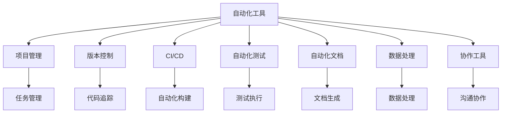

                 

# 自动化工具：创业者的得力助手

> 关键词：自动化, 创业, 高效工具, 团队协作, 项目管理

## 1. 背景介绍

### 1.1 问题由来

在当今快速变化的商业环境中，创业者需要应对种种挑战：从市场分析、产品开发，到团队管理、融资运营，每一步都需要高效、准确的工具来支持。尤其是在创业初期，资源有限，时间紧迫，如何最大化利用可用资源，提升工作效率，成为创业者的首要任务。自动化工具在这一过程中扮演着至关重要的角色。

### 1.2 问题核心关键点

自动化工具的核心在于其能够通过预定义的规则、流程，自动执行重复性、规律性的任务，大幅提升工作效率，减少人为错误，同时释放人力资源去处理更复杂、创造性的工作。

自动化工具的优越性体现在以下几个方面：
1. **节省时间**：自动化流程可以迅速完成大量耗时操作，节省创业者宝贵的时间。
2. **降低错误**：自动化执行过程一致性高，减少了人为失误。
3. **提高效率**：通过批量处理，自动化工具显著提升了任务执行的速度。
4. **成本效益**：减少了对人工的依赖，降低了人力成本。

自动化工具的普及和应用，已经从传统的IT和软件开发领域扩展到创业的各个环节。创业团队利用这些工具，可以更加专注于核心业务的发展，而不是被琐碎的事务性工作所困扰。

## 2. 核心概念与联系

### 2.1 核心概念概述

自动化工具指的是通过预先设定的规则和逻辑，自动完成特定任务的软件或系统。常见的自动化工具包括：

- **项目管理工具**：如Jira、Trello等，帮助团队管理项目进度、任务分配和沟通。
- **代码版本控制工具**：如Git、SVN，跟踪代码版本变化，管理代码库。
- **持续集成/持续部署(CI/CD)工具**：如Jenkins、Travis CI，自动化构建、测试和部署过程。
- **自动化测试工具**：如Selenium、JUnit，自动执行软件测试，提升产品质量。
- **自动化文档工具**：如Swagger、JSDoc，自动生成API文档，便于团队协作和API使用。
- **数据处理工具**：如Pandas、Excel，自动化处理和分析数据。
- **协作工具**：如Slack、Microsoft Teams，提升团队沟通和协作效率。

### 2.2 核心概念原理和架构的 Mermaid 流程图



### 2.3 核心概念之间的关系

自动化工具通过其内置的功能模块，支持团队在项目生命周期的各个阶段高效协作和管理。这些模块相互配合，形成一个完整的自动化工作流：

1. **项目管理**：明确任务分配和进度跟踪，确保团队工作有序进行。
2. **版本控制**：管理代码变更历史，提供版本回滚和合并功能，保证代码安全。
3. **CI/CD**：自动化构建、测试和部署，提升软件交付速度和质量。
4. **自动化测试**：自动执行测试用例，快速发现和修复缺陷。
5. **自动化文档**：自动生成API文档，帮助团队成员快速理解和使用API。
6. **数据处理**：自动化数据分析和处理，支持决策制定。
7. **协作工具**：提升团队沟通效率，促进知识共享和协作。

这些工具通过其自动化功能，将团队从重复劳动中解放出来，聚焦于更有价值的创新工作。

## 3. 核心算法原理 & 具体操作步骤

### 3.1 算法原理概述

自动化工具的核心算法原理主要包括以下几点：

- **规则引擎**：定义任务的执行规则，自动化工具通过规则引擎执行任务。
- **流程编排**：将任务按顺序或并行方式编排执行，确保任务顺利进行。
- **状态跟踪**：实时监控任务执行状态，及时调整执行策略。
- **数据处理**：自动化工具通常包含数据处理模块，支持数据的提取、转换、加载等操作。
- **界面集成**：提供用户友好的界面，方便用户启动和监控自动化流程。

### 3.2 算法步骤详解

自动化工具的使用流程通常包括以下步骤：

1. **需求分析**：明确需要自动化的任务和目标，确定自动化工具的选择。
2. **工具配置**：选择合适的自动化工具，并根据需求进行配置。
3. **规则制定**：定义任务的执行规则和流程。
4. **测试验证**：在实际环境中部署和测试自动化流程，验证其正确性和可靠性。
5. **持续优化**：根据反馈不断优化自动化工具和流程，提升效率。

### 3.3 算法优缺点

自动化工具的优点：
1. **提升效率**：减少人工干预，提高任务执行速度。
2. **减少错误**：降低人为失误，提高任务执行质量。
3. **降低成本**：减少人力投入，节省运营成本。
4. **提高一致性**：保证任务执行的一致性和规范性。

自动化工具的缺点：
1. **初始成本高**：配置和部署自动化工具可能需要较高的初始成本。
2. **依赖技术基础**：需要技术团队具备一定的技术能力，才能有效使用和维护自动化工具。
3. **灵活性受限**：某些自动化工具的灵活性可能不足，难以适应快速变化的需求。
4. **数据安全风险**：自动化工具依赖于数据和系统安全，一旦出现安全漏洞，可能带来重大损失。

### 3.4 算法应用领域

自动化工具在创业过程中可以广泛应用，覆盖项目管理的各个环节：

- **项目管理**：通过自动化工具，可以轻松管理项目进度、任务分配和沟通。
- **代码管理**：利用自动化版本控制工具，可以高效跟踪代码变更，避免冲突。
- **构建和部署**：通过CI/CD工具，可以实现代码的自动化构建、测试和部署，加速产品迭代。
- **测试和质量保证**：自动化测试工具可以快速执行测试，保证软件质量。
- **文档管理**：自动化文档工具可以生成API文档，提升API的使用效率。
- **数据分析**：数据处理工具可以自动化处理和分析数据，提供数据支持。
- **团队协作**：协作工具提升团队沟通和协作效率，促进知识共享。

## 4. 数学模型和公式 & 详细讲解 & 举例说明

### 4.1 数学模型构建

以项目管理工具为例，假设有一个项目由多个任务组成，每个任务有起始时间、结束时间、依赖关系和执行时间。模型构建如下：

设任务集合为 $T=\{t_1, t_2, ..., t_n\}$，每个任务 $t_i$ 的开始时间为 $s_i$，结束时间为 $e_i$，执行时间为 $p_i$，依赖关系为 $D=\{(d_{ij})\}$，其中 $d_{ij}=1$ 表示任务 $t_i$ 依赖于任务 $t_j$。

目标是最小化项目完成时间 $T$，即：

$$
\min_{s_i, e_i} \sum_{i=1}^n (e_i - s_i)
$$

约束条件为：

1. 任务的结束时间不能早于开始时间：$s_i \leq e_i$
2. 任务按依赖关系顺序执行：$s_j \leq s_i$ 当 $d_{ij}=1$
3. 任务总时间为所有任务执行时间之和：$\sum_{i=1}^n p_i = T$

### 4.2 公式推导过程

使用线性规划求解上述优化问题，设每个任务的松弛时间为 $e'_i = e_i - s_i$，则目标函数和约束条件可改写为：

$$
\min_{s_i, e'_i} \sum_{i=1}^n e'_i
$$

约束条件为：

1. $e'_i \geq 0$
2. $s_i + e'_i \geq e'_j$ 当 $d_{ij}=1$
3. $p_i \leq e'_i$

将上述模型转化为标准线性规划问题：

$$
\min_{x, y} c^T x + b^T y
$$

约束条件为：

1. $Ax + By \geq c$
2. $x \geq 0$
3. $y \geq 0$

其中 $x=(s_1, s_2, ..., s_n)^T$，$y=(e'_1, e'_2, ..., e'_n)^T$，$A$、$B$、$c$ 和 $b$ 为约束矩阵和向量。

使用单纯形法或网络流算法求解上述线性规划问题，即可得到最小化项目完成时间的最优解。

### 4.3 案例分析与讲解

假设有一个软件开发项目，包含5个任务：任务1、任务2、任务3、任务4、任务5，每个任务的时间表和依赖关系如下：

| 任务 | 开始时间 | 结束时间 | 执行时间 | 依赖关系 |
| ---- | -------- | -------- | -------- | -------- |
| 任务1 | 1        | 5        | 3        |          |
| 任务2 | 2        | 6        | 4        | 任务1     |
| 任务3 | 4        | 8        | 6        | 任务2     |
| 任务4 | 7        | 11       | 4        | 任务3     |
| 任务5 | 9        | 13       | 5        | 任务4     |

使用上述线性规划模型求解，得到最优项目完成时间为11天，任务分配如下：

| 任务 | 开始时间 | 结束时间 | 执行时间 | 依赖关系 |
| ---- | -------- | -------- | -------- | -------- |
| 任务1 | 1        | 4        | 3        |          |
| 任务2 | 2        | 6        | 4        | 任务1     |
| 任务3 | 4        | 10       | 6        | 任务2     |
| 任务4 | 7        | 11       | 4        | 任务3     |
| 任务5 | 9        | 13       | 5        | 任务4     |

## 5. 项目实践：代码实例和详细解释说明

### 5.1 开发环境搭建

自动化工具的开发环境搭建相对简单，通常需要以下工具：

1. **编程语言**：Python、Java等常用编程语言。
2. **开发工具**：IDE如PyCharm、Visual Studio、IntelliJ IDEA。
3. **数据库**：MySQL、MongoDB等关系型或非关系型数据库。
4. **Web框架**：Django、Flask等Python Web框架，或Spring Boot、Express等Java/Node.js Web框架。
5. **Web服务**：RESTful API开发所需的工具，如Postman、Swagger。

搭建环境的步骤如下：

1. 安装操作系统和编程语言环境。
2. 安装开发工具和数据库。
3. 安装Web框架和Web服务工具。
4. 配置开发环境，设置依赖库和项目结构。

### 5.2 源代码详细实现

以Jira项目为例，介绍如何使用Python Flask框架实现自动化项目任务管理：

```python
from flask import Flask, request, jsonify

app = Flask(__name__)

# 任务数据
tasks = [
    {'id': 1, 'name': '任务1', 'start_time': 1, 'end_time': 5, 'exec_time': 3},
    {'id': 2, 'name': '任务2', 'start_time': 2, 'end_time': 6, 'exec_time': 4, 'dep': [1]},
    {'id': 3, 'name': '任务3', 'start_time': 4, 'end_time': 10, 'exec_time': 6, 'dep': [2]},
    {'id': 4, 'name': '任务4', 'start_time': 7, 'end_time': 11, 'exec_time': 4, 'dep': [3]},
    {'id': 5, 'name': '任务5', 'start_time': 9, 'end_time': 13, 'exec_time': 5, 'dep': [4]}
]

@app.route('/tasks', methods=['GET'])
def get_tasks():
    return jsonify(tasks)

@app.route('/tasks/<int:id>', methods=['GET'])
def get_task(id):
    for task in tasks:
        if task['id'] == id:
            return jsonify(task)
    return jsonify({'error': 'task not found'})

@app.route('/tasks', methods=['POST'])
def create_task():
    task = request.json
    tasks.append(task)
    return jsonify({'success': True})

@app.route('/tasks/<int:id>', methods=['DELETE'])
def delete_task(id):
    for i in range(len(tasks)):
        if tasks[i]['id'] == id:
            del tasks[i]
            return jsonify({'success': True})
    return jsonify({'error': 'task not found'})

if __name__ == '__main__':
    app.run(debug=True)
```

### 5.3 代码解读与分析

上述代码实现了Jira项目任务管理的自动化接口。使用Flask框架搭建Web服务，提供GET、POST、DELETE等HTTP请求接口，支持任务的增删查改操作。

- `get_tasks` 接口：获取所有任务信息。
- `get_task` 接口：根据ID获取指定任务信息。
- `create_task` 接口：新增任务。
- `delete_task` 接口：根据ID删除指定任务。

代码通过Python列表模拟任务数据，使用Flask框架封装RESTful API，提供用户友好的Web服务接口。

## 6. 实际应用场景

### 6.1 项目管理

自动化项目管理工具，如Jira、Trello，可以帮助创业者快速搭建项目管理框架，明确任务分配和进度跟踪，确保项目按时完成。例如，Trello通过卡片和看板的形式，直观展示项目进展，方便团队成员协作和沟通。

### 6.2 代码管理

自动化代码管理工具，如Git、SVN，可以高效跟踪代码变更，管理代码库。例如，Git使用版本控制，支持代码的版本回滚、合并等操作，方便版本管理。

### 6.3 持续集成/持续部署

自动化持续集成/持续部署工具，如Jenkins、Travis CI，可以自动化构建、测试和部署过程，加速软件迭代。例如，Jenkins支持CI/CD流程配置，可以自动化执行构建、测试和部署，提升软件开发效率。

### 6.4 未来应用展望

随着自动化工具的不断发展，其在创业领域的应用前景更加广阔。未来，自动化工具将进一步智能化、自动化，提供更加便捷、高效的工作环境：

1. **智能推荐**：通过机器学习和数据分析，自动化工具可以提供智能推荐，帮助创业者优化任务分配和项目管理。
2. **集成化管理**：未来的自动化工具将更加集成化，实现项目、代码、测试、部署等各环节的无缝对接，提升工作效率。
3. **云化部署**：通过云计算平台，自动化工具可以实现更灵活、更高效的资源管理和部署，降低创业成本。
4. **多平台支持**：支持跨平台协作和访问，提升团队沟通和协作效率。
5. **数据驱动决策**：通过实时数据分析，自动化工具可以提供更准确、更全面的项目数据支持，辅助决策制定。

## 7. 工具和资源推荐

### 7.1 学习资源推荐

为了帮助创业者系统掌握自动化工具的理论基础和实践技巧，这里推荐一些优质的学习资源：

1. **《自动化工具基础》系列博文**：由自动化工具技术专家撰写，深入浅出地介绍了自动化工具的原理、应用和最佳实践。
2. **Coursera《计算机科学导论》课程**：涵盖计算机科学基础和自动化工具的入门课程，适合初学者学习。
3. **《高效自动化工具》书籍**：系统介绍各类自动化工具的使用方法、最佳实践和案例分析，适合进阶学习。
4. **Git官方文档**：Git的版本控制指南和文档，帮助用户快速上手使用Git。
5. **Jenkins官方文档**：Jenkins的配置和使用指南，帮助用户高效搭建和配置Jenkins CI/CD环境。

通过对这些资源的学习实践，相信你可以快速掌握自动化工具的精髓，并用于解决实际的创业问题。

### 7.2 开发工具推荐

自动化工具的开发和部署离不开优质的开发工具。以下是几款推荐的工具：

1. **Python**：Python语言的简洁、易用性使其成为自动化工具开发的理想选择。
2. **Flask**：Python Web框架，支持快速搭建Web服务，方便自动化工具的部署和访问。
3. **MySQL**：关系型数据库，支持高效的数据存储和管理。
4. **Django**：Python Web框架，支持更丰富的Web应用功能，方便自动化工具的开发和维护。
5. **Postman**：API测试工具，支持发送HTTP请求，方便自动化工具的API接口测试。
6. **Swagger**：API文档工具，支持自动生成API文档，提升API的使用效率。

这些工具各有所长，合理利用它们可以显著提升自动化工具的开发和部署效率。

### 7.3 相关论文推荐

自动化工具的发展源于学界的持续研究。以下是几篇奠基性的相关论文，推荐阅读：

1. **《自动化流程设计语言》**：探讨自动化工具的规则引擎和流程编排技术，为自动化工具的建模和设计提供理论基础。
2. **《自动化测试技术》**：介绍自动化测试的原理、工具和最佳实践，提升软件质量。
3. **《Web应用自动化测试》**：专注于Web应用的自动化测试技术，提升Web应用的质量和可靠性。
4. **《持续集成实践》**：总结持续集成/持续部署的实践经验，提升软件开发的效率和质量。
5. **《智能项目管理》**：探讨智能项目管理的算法和技术，提升项目管理效率。

这些论文代表了大规模自动化工具的研究方向，通过学习这些前沿成果，可以帮助研究者把握学科前进方向，激发更多的创新灵感。

## 8. 总结：未来发展趋势与挑战

### 8.1 总结

本文对自动化工具在创业中的应用进行了全面系统的介绍。首先阐述了自动化工具在创业过程中的重要性和优势，明确了其提升效率、降低成本的核心价值。其次，从原理到实践，详细讲解了自动化工具的配置和操作流程，给出了具体的代码实例和分析。同时，本文还探讨了自动化工具在多个应用场景下的实现方法和未来展望，展示了其广阔的应用前景。最后，本文精选了自动化工具的学习资源和开发工具，力求为读者提供全方位的技术指引。

通过本文的系统梳理，可以看到，自动化工具在创业过程中扮演着越来越重要的角色，极大地提升了创业团队的协作效率和管理能力。未来，伴随自动化工具的持续演进，相信创业团队将更加专注于核心业务的发展，更好地应对市场挑战。

### 8.2 未来发展趋势

展望未来，自动化工具在创业领域将呈现以下几个发展趋势：

1. **智能化**：通过引入机器学习和大数据分析技术，自动化工具将更加智能化，能够提供智能推荐和优化建议。
2. **集成化**：未来的自动化工具将更加集成化，实现项目、代码、测试、部署等各环节的无缝对接。
3. **云化**：通过云计算平台，自动化工具可以实现更灵活、更高效的资源管理和部署，降低创业成本。
4. **多平台支持**：支持跨平台协作和访问，提升团队沟通和协作效率。
5. **数据驱动决策**：通过实时数据分析，自动化工具可以提供更准确、更全面的项目数据支持，辅助决策制定。

### 8.3 面临的挑战

尽管自动化工具在创业过程中已经取得了显著成效，但在迈向更加智能化、普适化应用的过程中，仍面临诸多挑战：

1. **数据安全和隐私**：自动化工具依赖于数据和系统安全，一旦出现安全漏洞，可能带来重大损失。如何保障数据安全和隐私，是一个重要问题。
2. **技术依赖**：自动化工具的开发和维护需要技术团队具备一定的技术能力，对于技术资源有限的创业团队，可能存在一定的门槛。
3. **灵活性受限**：某些自动化工具的灵活性可能不足，难以适应快速变化的需求。
4. **用户体验**：自动化工具的界面和交互设计可能不够友好，影响用户体验和接受度。

### 8.4 研究展望

面对自动化工具面临的挑战，未来的研究需要在以下几个方面寻求新的突破：

1. **数据安全和隐私保护**：开发更加安全和隐私保护的技术手段，保障数据安全。
2. **技术普适性**：开发更加易用和易部署的工具，降低技术门槛，提高创业团队的使用效率。
3. **灵活性增强**：改进和优化自动化工具的灵活性，适应快速变化的需求。
4. **用户体验优化**：优化自动化工具的界面和交互设计，提升用户体验和接受度。

这些研究方向将有助于进一步提升自动化工具在创业领域的应用效果，推动创业技术的发展和创新。

## 9. 附录：常见问题与解答

**Q1：自动化工具是否适用于所有创业项目？**

A: 自动化工具在大多数创业项目上都能取得不错的效果，特别是对于重复性、规律性任务较多的项目。但对于需要大量创意和创新的项目，如文化艺术、设计等，自动化工具的适用范围有限。

**Q2：如何选择适合项目的自动化工具？**

A: 选择自动化工具应考虑项目的实际需求和目标，评估工具的功能、易用性和扩展性。一般可以通过以下几个步骤：
1. 需求分析：明确项目需要自动化的任务和目标。
2. 工具调研：了解各自动化工具的功能和特点，选择合适的工具。
3. 试用测试：在实际环境中试用自动化工具，评估其性能和适用性。
4. 评估对比：比较不同工具的优缺点，选择最适合的项目工具。

**Q3：如何高效使用自动化工具？**

A: 高效使用自动化工具需要以下几个步骤：
1. 需求分析：明确需要自动化的任务和目标。
2. 工具配置：根据项目需求配置自动化工具。
3. 任务流程设计：定义任务的执行规则和流程。
4. 测试验证：在实际环境中部署和测试自动化流程，验证其正确性和可靠性。
5. 持续优化：根据反馈不断优化自动化工具和流程，提升效率。

通过合理配置和优化，可以最大化自动化工具的效率和效果，提升创业项目的成功率。

**Q4：自动化工具和人工流程有哪些区别？**

A: 自动化工具和人工流程有以下几个区别：
1. 效率：自动化工具可以显著提高任务执行效率，减少人工干预。
2. 准确性：自动化工具执行一致性高，减少人为失误，提高任务执行质量。
3. 成本：自动化工具降低人力成本，节省资源。
4. 灵活性：自动化工具的灵活性可能受限，需要根据需求进行配置和调整。
5. 维护：自动化工具需要技术团队进行维护和更新，人工流程相对简单。

理解这些区别，有助于合理选择和使用自动化工具，提升项目管理效率。

---

作者：禅与计算机程序设计艺术 / Zen and the Art of Computer Programming

