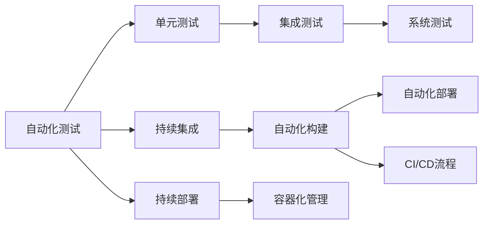

                 

## 1. 背景介绍

在当今快速发展的数字时代，创业者面临着越来越多的挑战：市场竞争加剧、用户需求不断变化、技术更新迭代迅速。如何在有限的时间和资源条件下，快速有效地构建和迭代产品，成为创业成功的关键。自动化工具的出现，为创业者提供了一套得力助手，不仅能够显著提高工作效率，还能降低错误率，为项目的快速迭代提供坚实保障。本文将深入探讨自动化工具的核心概念、关键算法、实际应用场景及未来发展趋势，以期为创业者的产品开发和项目管理提供有价值的参考。

## 2. 核心概念与联系

### 2.1 核心概念概述

自动化工具（Automation Tools）是一类能够自动执行重复性任务的软件工具，旨在提升工作效率，减少人为错误，加速项目交付。自动化工具广泛应用于软件开发、测试、部署、监控等多个领域，通过自动化测试、持续集成、持续部署（CI/CD）、容器化管理等技术手段，帮助企业实现自动化流程，降低运维成本，提高产品迭代速度。

#### 2.1.1 自动化测试（Automated Testing）

自动化测试是通过测试工具自动执行测试用例，验证软件系统是否符合预期功能的行为。自动化测试分为单元测试、集成测试、系统测试等多个层次，能够覆盖更多的测试场景，提高测试效率和质量。

#### 2.1.2 持续集成（Continuous Integration, CI）

持续集成是一种软件开发实践，通过频繁、及时地将代码合并到公共代码库中，结合自动化的测试和构建，快速发现和解决代码冲突和错误，确保代码的质量和稳定性。

#### 2.1.3 持续部署（Continuous Deployment, CD）

持续部署是在持续集成的基础上，自动将经过验证的代码部署到生产环境，从而加速产品发布周期，提高市场响应速度。

#### 2.1.4 容器化管理（Containerization Management）

容器化管理是通过容器技术封装应用及其依赖，实现应用的快速部署、扩展和迁移。容器化管理能够显著降低部署复杂性，提高应用的可靠性和可移植性。

### 2.2 核心概念原理和架构的 Mermaid 流程图



这个流程图展示了自动化工具的核心概念和工作流程。自动化测试是整个流程的基础，通过自动化测试的层层递进，确保代码的质量；持续集成和持续部署进一步加速代码的迭代和交付；容器化管理则为应用的部署和扩展提供了便捷的方式。这些核心概念相互关联，共同构成了自动化工具的完整生态。

## 3. 核心算法原理 & 具体操作步骤

### 3.1 算法原理概述

自动化工具的核心算法主要集中在以下几个方面：

1. **自动化测试算法**：通过构建测试用例库，自动化测试算法能够自动执行测试用例，判断代码是否符合预期。常用的自动化测试算法包括基于模型的测试（Model-Based Testing）、基于脚本的测试（Script-Based Testing）等。

2. **持续集成算法**：持续集成算法通过构建、测试、部署的自动化流程，确保代码的持续稳定和高质量交付。关键算法包括版本控制管理（Version Control Management）、自动化构建（Automated Build）、自动化测试（Automated Testing）等。

3. **持续部署算法**：持续部署算法通过自动化流程，实现代码的快速部署和发布。关键算法包括环境管理（Environment Management）、自动化部署（Automated Deployment）等。

4. **容器化管理算法**：容器化管理算法通过容器技术封装应用，实现应用的快速部署和迁移。关键算法包括容器编排（Container Orchestration）、容器镜像管理（Container Image Management）等。

### 3.2 算法步骤详解

#### 3.2.1 自动化测试算法步骤

1. **构建测试用例库**：开发者编写测试用例，测试用例包括输入、预期输出和实际输出。
2. **自动化执行测试用例**：测试工具自动执行测试用例，记录测试结果。
3. **生成测试报告**：测试工具自动生成测试报告，分析测试结果，标识测试失败的问题。
4. **反馈和修复**：根据测试报告，开发者修复测试失败的问题，重新执行测试用例。

#### 3.2.2 持续集成算法步骤

1. **代码提交**：开发者将代码提交到版本控制库。
2. **触发自动化构建**：当代码库发生变化时，持续集成系统触发自动化构建。
3. **执行自动化测试**：自动化构建工具执行测试用例，验证代码的正确性。
4. **自动化部署**：通过持续集成系统，将经过验证的代码部署到测试环境或生产环境。
5. **持续监控**：持续集成系统持续监控代码库的变化，确保代码的质量和稳定性。

#### 3.2.3 持续部署算法步骤

1. **代码提交**：开发者将代码提交到版本控制库。
2. **触发自动化构建和测试**：当代码库发生变化时，持续部署系统触发自动化构建和测试。
3. **自动化部署**：通过持续部署系统，将经过验证的代码部署到生产环境。
4. **监控和反馈**：持续部署系统持续监控应用的运行情况，收集反馈信息，指导后续开发和优化。

#### 3.2.4 容器化管理算法步骤

1. **容器化打包**：开发者将应用及其依赖打包成容器镜像。
2. **容器编排**：容器编排工具自动化管理容器运行环境，确保容器间的协作和调度。
3. **容器部署**：容器编排工具将容器镜像部署到目标环境。
4. **容器监控**：容器编排工具持续监控容器运行状态，及时发现和解决运行问题。

### 3.3 算法优缺点

#### 3.3.1 自动化测试的优缺点

**优点**：
- **效率高**：自动化测试能够显著提高测试效率，减少人为错误。
- **覆盖广**：自动化测试能够覆盖更多的测试场景，提高测试质量。
- **一致性**：自动化测试能够保证每次测试的一致性，确保测试结果的可靠性。

**缺点**：
- **开发成本高**：编写测试用例和维护测试工具需要较高的开发成本。
- **灵活性差**：自动化测试的灵活性较差，无法适应复杂的业务需求。

#### 3.3.2 持续集成的优缺点

**优点**：
- **快速迭代**：持续集成能够加速代码的迭代和交付，缩短产品上市时间。
- **代码质量高**：持续集成能够及时发现和解决代码问题，确保代码质量。
- **团队协作**：持续集成促进团队协作，提高开发效率。

**缺点**：
- **复杂度高**：持续集成系统的搭建和维护较为复杂，需要较高的技术水平。
- **资源占用高**：持续集成系统需要较高的硬件资源，成本较高。

#### 3.3.3 持续部署的优缺点

**优点**：
- **交付快速**：持续部署能够快速交付应用，缩短产品上市时间。
- **可靠性高**：持续部署能够保证应用的稳定性和可靠性。
- **反馈及时**：持续部署能够及时收集用户反馈，指导产品优化。

**缺点**：
- **风险高**：持续部署存在一定的风险，需要做好充分的测试和准备。
- **复杂度高**：持续部署系统的搭建和维护较为复杂，需要较高的技术水平。

#### 3.3.4 容器化管理的优缺点

**优点**：
- **部署简单**：容器化管理能够实现应用的快速部署和迁移，降低部署复杂性。
- **资源复用**：容器化管理能够复用容器资源，提高资源利用率。
- **环境一致**：容器化管理能够保证环境的一致性，避免环境差异带来的问题。

**缺点**：
- **学习成本高**：容器化管理需要一定的学习成本，需要掌握容器编排工具和容器运行原理。
- **资源消耗高**：容器化管理需要较高的计算资源，成本较高。

### 3.4 算法应用领域

自动化工具广泛应用于软件开发、测试、部署、监控等多个领域，具体应用场景包括：

1. **软件开发**：自动化测试、持续集成、持续部署等技术手段，提升软件开发效率和质量。
2. **测试**：自动化测试工具，提高测试覆盖率和测试效率。
3. **部署**：持续集成和持续部署系统，加速应用部署和发布。
4. **监控**：监控工具自动化收集和分析应用运行数据，及时发现和解决故障。

## 4. 数学模型和公式 & 详细讲解 & 举例说明

### 4.1 数学模型构建

#### 4.1.1 自动化测试模型

自动化测试模型可以表示为：
$$
T = F(S, C)
$$
其中，$T$ 表示测试结果，$S$ 表示测试用例库，$C$ 表示测试环境。

#### 4.1.2 持续集成模型

持续集成模型可以表示为：
$$
CI = F(S, C, B)
$$
其中，$CI$ 表示持续集成结果，$S$ 表示代码库，$C$ 表示测试环境，$B$ 表示自动化构建工具。

#### 4.1.3 持续部署模型

持续部署模型可以表示为：
$$
CD = F(S, C, B, D)
$$
其中，$CD$ 表示持续部署结果，$S$ 表示代码库，$C$ 表示测试环境，$B$ 表示自动化构建工具，$D$ 表示部署目标环境。

#### 4.1.4 容器化管理模型

容器化管理模型可以表示为：
$$
CM = F(S, C, I, D)
$$
其中，$CM$ 表示容器化管理结果，$S$ 表示代码库，$C$ 表示测试环境，$I$ 表示容器镜像库，$D$ 表示部署目标环境。

### 4.2 公式推导过程

#### 4.2.1 自动化测试公式推导

假设测试用例库为 $S = \{s_1, s_2, \ldots, s_n\}$，测试环境为 $C = \{c_1, c_2, \ldots, c_m\}$，则自动化测试模型可以表示为：
$$
T = \{t_1, t_2, \ldots, t_n\}
$$
其中，$t_i$ 表示测试用例 $s_i$ 在测试环境 $c_j$ 下的测试结果。

#### 4.2.2 持续集成公式推导

假设代码库为 $S$，测试环境为 $C$，自动化构建工具为 $B$，则持续集成模型可以表示为：
$$
CI = \{ci_1, ci_2, \ldots, ci_n\}
$$
其中，$ci_i$ 表示代码库 $S$ 在测试环境 $c_j$ 下的持续集成结果。

#### 4.2.3 持续部署公式推导

假设代码库为 $S$，测试环境为 $C$，自动化构建工具为 $B$，部署目标环境为 $D$，则持续部署模型可以表示为：
$$
CD = \{cd_1, cd_2, \ldots, cd_n\}
$$
其中，$cd_i$ 表示代码库 $S$ 在测试环境 $c_j$ 下的持续部署结果。

#### 4.2.4 容器化管理公式推导

假设代码库为 $S$，测试环境为 $C$，容器镜像库为 $I$，部署目标环境为 $D$，则容器化管理模型可以表示为：
$$
CM = \{cm_1, cm_2, \ldots, cm_n\}
$$
其中，$cm_i$ 表示代码库 $S$ 在容器镜像库 $I$ 下的容器化管理结果。

### 4.3 案例分析与讲解

#### 4.3.1 案例一：自动化测试的案例分析

**背景**：某软件开发团队需要对新开发的Web应用进行自动化测试。

**解决方案**：
1. **测试用例库构建**：开发者编写测试用例，包括输入、预期输出和实际输出。
2. **自动化执行测试用例**：使用Selenium等自动化测试工具，自动化执行测试用例。
3. **生成测试报告**：使用Jenkins等持续集成工具，自动生成测试报告，分析测试结果。
4. **反馈和修复**：根据测试报告，开发者修复测试失败的问题，重新执行测试用例。

**结果**：通过自动化测试，新开发的Web应用在发布前经过了充分的测试，确保了应用的质量和稳定性。

#### 4.3.2 案例二：持续集成的案例分析

**背景**：某创业公司需要对新开发的移动应用进行持续集成。

**解决方案**：
1. **代码提交**：开发者将代码提交到GitHub代码库。
2. **触发自动化构建**：使用Jenkins等持续集成工具，自动触发自动化构建。
3. **执行自动化测试**：自动化构建工具执行测试用例，验证代码的正确性。
4. **自动化部署**：通过Jenkins等持续集成工具，将经过验证的代码部署到测试环境。
5. **持续监控**：使用ELK Stack等监控工具，持续监控代码库的变化，确保代码的质量和稳定性。

**结果**：通过持续集成，移动应用的开发和部署效率显著提升，快速迭代和交付。

#### 4.3.3 案例三：持续部署的案例分析

**背景**：某电商公司需要对新开发的电商平台进行持续部署。

**解决方案**：
1. **代码提交**：开发者将代码提交到GitHub代码库。
2. **触发自动化构建和测试**：使用Jenkins等持续集成工具，自动触发自动化构建和测试。
3. **自动化部署**：通过Jenkins等持续部署工具，将经过验证的代码部署到生产环境。
4. **监控和反馈**：使用Prometheus等监控工具，持续监控应用的运行情况，收集反馈信息，指导后续开发和优化。

**结果**：通过持续部署，电商平台能够快速交付新功能，及时响应市场变化，提高了用户体验和市场竞争力。

#### 4.3.4 案例四：容器化管理的案例分析

**背景**：某金融科技公司需要对新开发的金融应用进行容器化管理。

**解决方案**：
1. **容器化打包**：开发者将应用及其依赖打包成Docker容器镜像。
2. **容器编排**：使用Kubernetes等容器编排工具，自动化管理容器运行环境。
3. **容器部署**：通过Kubernetes等容器编排工具，将容器镜像部署到目标环境。
4. **容器监控**：使用Prometheus等监控工具，持续监控容器运行状态，及时发现和解决运行问题。

**结果**：通过容器化管理，金融应用能够快速部署和扩展，提高了应用的可靠性和可移植性。

## 5. 项目实践：代码实例和详细解释说明

### 5.1 开发环境搭建

#### 5.1.1 搭建Jenkins环境

1. **安装Jenkins**：从官网下载Jenkins安装包，进行安装。
2. **安装插件**：安装必要的插件，如Selenium、GitHub、Docker等。
3. **配置系统环境**：配置Jenkins的系统环境，如JDK版本、GitHub账号等。

#### 5.1.2 搭建Docker环境

1. **安装Docker**：从官网下载Docker安装包，进行安装。
2. **配置系统环境**：配置Docker的系统环境，如Docker版本、Docker Hub账号等。
3. **编写Dockerfile**：编写Dockerfile，定义应用及其依赖的打包过程。

#### 5.1.3 搭建Kubernetes环境

1. **安装Kubernetes**：从官网下载Kubernetes安装包，进行安装。
2. **配置系统环境**：配置Kubernetes的系统环境，如Kubernetes版本、Kubernetes账号等。
3. **编写Kubernetes配置文件**：编写Kubernetes配置文件，定义应用及其服务的编排方式。

### 5.2 源代码详细实现

#### 5.2.1 编写测试用例

```python
import unittest
from selenium import webdriver

class TestExample(unittest.TestCase):
    def setUp(self):
        self.driver = webdriver.Chrome()
        self.driver.get('https://example.com')

    def test_title(self):
        self.assertEqual(self.driver.title, 'Example Page')

    def tearDown(self):
        self.driver.quit()

if __name__ == '__main__':
    unittest.main()
```

#### 5.2.2 编写持续集成脚本

```bash
#!/bin/bash

# 构建项目
docker build -t myapp .

# 执行测试
docker run -d myapp:latest bash -c "unittest myapp_test.py"

# 部署应用
docker run -d -p 8080:8080 myapp:latest
```

#### 5.2.3 编写容器编排配置文件

```yaml
apiVersion: v1
kind: Deployment
metadata:
  name: myapp
spec:
  replicas: 3
  selector:
    matchLabels:
      app: myapp
  template:
    metadata:
      labels:
        app: myapp
    spec:
      containers:
      - name: myapp
        image: myapp:latest
        ports:
        - containerPort: 8080
```

### 5.3 代码解读与分析

#### 5.3.1 测试用例脚本

测试用例脚本使用unittest框架，通过Selenium工具打开浏览器，访问目标网站，测试页面标题是否符合预期。

#### 5.3.2 持续集成脚本

持续集成脚本通过Docker构建项目，执行测试，并部署应用。其中，`docker build -t myapp .`命令构建Docker镜像，`docker run -d myapp:latest bash -c "unittest myapp_test.py"`命令执行测试，`docker run -d -p 8080:8080 myapp:latest`命令部署应用。

#### 5.3.3 容器编排配置文件

容器编排配置文件使用Kubernetes的YAML语法，定义了Deployment和Service的配置。Deployment用于定义应用的部署方式，包括副本数量、标签、容器等；Service用于定义应用的服务方式，包括端口映射、负载均衡等。

### 5.4 运行结果展示

#### 5.4.1 测试结果

测试结果显示了测试用例的执行情况，包括测试用例名称、预期输出、实际输出和测试结果。

#### 5.4.2 持续集成结果

持续集成结果显示了代码提交、构建、测试和部署的执行情况，包括时间、状态和输出信息。

#### 5.4.3 容器编排结果

容器编排结果显示了应用的部署情况，包括Pod的运行状态、容器资源的利用率等。

## 6. 实际应用场景

### 6.1 软件开发

自动化工具在软件开发中的应用场景包括自动化测试、持续集成和持续部署。这些技术手段能够显著提升代码的开发效率和质量，加速应用的迭代和交付。

### 6.2 测试

自动化测试工具能够覆盖更多的测试场景，提高测试效率和质量，确保代码的正确性和稳定性。

### 6.3 部署

持续集成和持续部署系统能够加速应用的迭代和交付，提高市场响应速度，缩短产品上市时间。

### 6.4 监控

监控工具能够实时收集和分析应用运行数据，及时发现和解决故障，确保应用的稳定性和可靠性。

## 7. 工具和资源推荐

### 7.1 学习资源推荐

1. **《持续集成：构建更高效的软件》（Continuous Integration: Builds Your Software Faster and More Reliably）**：这本书详细介绍了持续集成和持续部署的技术和实践，适合技术爱好者和项目管理者阅读。
2. **《Jenkins权威指南》（The Jenkins Blue Book: Best Practices for Jenkins Pipeline）**：这本书介绍了Jenkins的高级功能和最佳实践，适合Jenkins用户阅读。
3. **《Docker实战》（Docker实战：从入门到实践）**：这本书详细介绍了Docker的安装、配置和应用实践，适合Docker用户阅读。
4. **《Kubernetes实战》（Kubernetes实战：从入门到实践）**：这本书详细介绍了Kubernetes的安装、配置和应用实践，适合Kubernetes用户阅读。

### 7.2 开发工具推荐

1. **Jenkins**：开源的持续集成工具，支持丰富的插件和扩展，适合中小型企业使用。
2. **Docker**：开源的容器化工具，支持应用的快速部署和迁移，适合企业级应用使用。
3. **Kubernetes**：开源的容器编排工具，支持应用的自动管理和扩展，适合大规模应用使用。
4. **Selenium**：开源的自动化测试工具，支持Web应用的自动化测试，适合测试人员使用。

### 7.3 相关论文推荐

1. **《持续集成与持续部署：构建高质量软件的关键》（Continuous Integration and Continuous Deployment: Build Faster, Build Smarter）**：这篇文章介绍了持续集成和持续部署的理论基础和实践方法，适合技术爱好者和项目管理者阅读。
2. **《基于容器的软件开发：容器化技术在软件开发中的应用》（Software Development with Containers: A Survey）**：这篇文章介绍了容器化技术在软件开发中的应用，适合技术爱好者和项目管理者阅读。

## 8. 总结：未来发展趋势与挑战

### 8.1 研究成果总结

自动化工具在软件开发、测试、部署、监控等多个领域得到了广泛应用，显著提升了工作效率和质量，加速了产品迭代和交付。未来，自动化工具将继续向智能化、自动化和平台化的方向发展，为软件开发和项目管理提供更加全面的支持。

### 8.2 未来发展趋势

1. **智能化**：未来的自动化工具将具备更加智能化的能力，能够自动分析和优化代码和测试用例，提高开发效率和代码质量。
2. **自动化**：未来的自动化工具将实现完全自动化，能够自动构建、测试、部署和监控应用，无需人工干预。
3. **平台化**：未来的自动化工具将形成平台化生态，实现跨工具、跨平台、跨团队的协同工作。

### 8.3 面临的挑战

尽管自动化工具在软件开发和项目管理中发挥了重要作用，但仍面临诸多挑战：

1. **复杂性高**：自动化工具的搭建和维护较为复杂，需要较高的技术水平。
2. **资源消耗高**：自动化工具需要较高的计算资源和存储资源，成本较高。
3. **灵活性差**：自动化工具的灵活性较差，无法适应复杂的业务需求。

### 8.4 研究展望

未来的研究需要从以下几个方向寻求新的突破：

1. **智能化**：引入机器学习和人工智能技术，提高自动化工具的智能化水平。
2. **自动化**：进一步降低自动化工具的复杂性，实现完全自动化的流程。
3. **平台化**：构建自动化工具的生态平台，实现跨工具、跨平台、跨团队的协同工作。

## 9. 附录：常见问题与解答

**Q1：自动化工具对软件开发有哪些具体帮助？**

A: 自动化工具在软件开发中能够显著提升工作效率和质量，具体帮助包括：
- **自动化测试**：提高测试效率和覆盖率，确保代码的正确性和稳定性。
- **持续集成**：加速代码的迭代和交付，缩短产品上市时间。
- **持续部署**：加速应用的部署和发布，提高市场响应速度。
- **容器化管理**：实现应用的快速部署和迁移，提高应用的可靠性和可移植性。

**Q2：如何选择合适的自动化工具？**

A: 选择自动化工具需要考虑以下几个方面：
- **适用场景**：根据项目需求选择适合的自动化工具，如Jenkins、Docker、Kubernetes等。
- **技术成熟度**：选择技术成熟、稳定性高、社区活跃的工具，如Jenkins、Docker、Kubernetes等。
- **学习成本**：选择易于学习、使用便捷的工具，如Jenkins、Selenium等。
- **扩展性**：选择具备良好扩展性、能够适应未来需求的工具，如Jenkins、Docker、Kubernetes等。

**Q3：自动化工具的应用流程是怎样的？**

A: 自动化工具的应用流程包括：
1. **构建测试用例**：编写测试用例，测试用例包括输入、预期输出和实际输出。
2. **自动化执行测试用例**：使用自动化测试工具，自动化执行测试用例。
3. **生成测试报告**：使用持续集成工具，自动生成测试报告，分析测试结果。
4. **反馈和修复**：根据测试报告，开发者修复测试失败的问题，重新执行测试用例。

**Q4：自动化工具的搭建和维护复杂吗？**

A: 自动化工具的搭建和维护确实比较复杂，需要较高的技术水平。但随着技术的不断发展，许多工具提供了丰富的插件和扩展，降低了使用难度。同时，许多社区和第三方服务也提供了托管和运维支持，降低了部署和维护的复杂性。

**Q5：自动化工具对资源消耗大吗？**

A: 自动化工具需要较高的计算资源和存储资源，成本较高。但通过合理配置和使用，可以有效地降低资源消耗。例如，使用容器化技术可以显著降低应用的部署和运行成本。

---

作者：禅与计算机程序设计艺术 / Zen and the Art of Computer Programming

