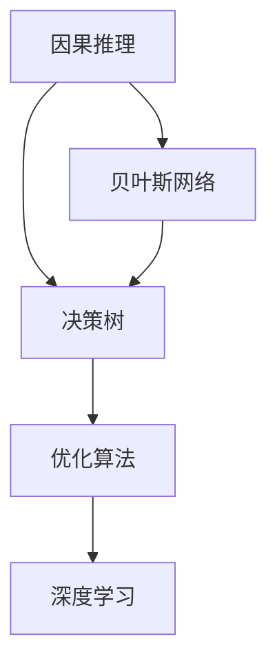

                 

# 自动推理库的设计与实现：提高AI决策能力

> 关键词：自动推理库,AI决策,因果推理,贝叶斯网络,决策树,优化算法

## 1. 背景介绍

### 1.1 问题由来
随着人工智能技术的迅猛发展，决策能力的提高已成为AI技术发展的重要方向。在医疗诊断、金融投资、智能制造、自动驾驶等领域，AI决策的准确性和稳定性对人类社会的影响日益凸显。然而，由于数据复杂性和决策问题的不确定性，传统AI决策方法面临诸多挑战。

自动推理库作为提高AI决策能力的重要工具，通过构建因果模型、优化决策路径，使AI模型具备更强的逻辑推理能力和泛化能力，从而在复杂环境下做出更精确、可信的决策。本博文将深入探讨自动推理库的核心概念与技术原理，并结合实际案例，展示其在AI决策中的重要作用。

### 1.2 问题核心关键点
自动推理库的核心在于构建逻辑清晰、可解释的推理模型，并在此基础上进行决策路径的优化。关键点包括：
- 因果推理：分析影响决策的因素及其相互关系，建模因果结构。
- 贝叶斯网络：基于概率统计理论，建模变量之间的条件概率关系。
- 决策树：通过分割和决策规则，构建树形决策模型。
- 优化算法：优化决策路径，选择最优决策方案。
- 深度学习：结合深度神经网络，提升推理模型在复杂问题上的表现。

## 2. 核心概念与联系

### 2.1 核心概念概述

为更好地理解自动推理库的设计与实现，本节将介绍几个关键概念及其关系：

- **因果推理**：指通过观察和统计方法，识别出变量之间的因果关系，构建因果图模型。因果推理可广泛应用于自然语言处理、社会网络分析、市场预测等领域。

- **贝叶斯网络**：一种基于概率论的图形模型，用于表示变量之间的条件概率关系。贝叶斯网络广泛应用于医学诊断、风险评估、推荐系统等任务中。

- **决策树**：一种树形结构模型，通过分治策略，将复杂问题简化为多个子问题的决策过程。决策树易于解释和可视化，适用于数据挖掘和规则制定。

- **优化算法**：用于优化模型的参数和决策路径，以提高模型的泛化能力和决策效率。优化算法包括梯度下降、遗传算法、粒子群算法等。

- **深度学习**：一种基于多层神经网络的机器学习方法，通过训练大量数据，学习复杂的非线性特征表示。深度学习在图像识别、自然语言处理、语音识别等领域表现出色。

这些概念之间的关系可以通过以下Mermaid流程图展示：



这个流程图展示了自动推理库设计中的关键步骤：

1. 因果推理分析影响决策的因素及其相互关系，构建因果图模型。
2. 基于贝叶斯网络建模变量之间的条件概率关系。
3. 决策树通过分割和决策规则，构建树形决策模型。
4. 优化算法优化决策路径，选择最优决策方案。
5. 深度学习结合神经网络，提升模型的推理能力。

这些核心概念共同构成了自动推理库的设计与实现框架，使其能够在复杂环境下做出可靠、高效的决策。

## 3. 核心算法原理 & 具体操作步骤

### 3.1 算法原理概述

自动推理库的核心算法原理主要基于因果推理、贝叶斯网络和决策树等技术。这些技术共同构建了一个从数据到决策的逻辑框架，使AI模型能够更好地理解和推理复杂问题，做出精确的决策。

具体而言，自动推理库的设计与实现可以分为以下几个步骤：

1. **数据准备**：收集和预处理数据，构建特征向量。
2. **因果分析**：使用因果推理方法，构建因果图模型，分析变量之间的因果关系。
3. **概率建模**：使用贝叶斯网络建模变量之间的条件概率关系，构建概率图模型。
4. **决策建模**：通过决策树等方法，构建决策模型，优化决策路径。
5. **模型训练与优化**：使用优化算法，对模型进行训练和优化，提升模型的泛化能力和决策效率。
6. **深度融合**：将深度学习技术融合到推理模型中，提升模型在复杂问题上的表现。

### 3.2 算法步骤详解

**Step 1: 数据准备**

数据准备是自动推理库的第一步。需要收集和预处理数据，构建特征向量，以便后续建模和推理。具体步骤包括：

1. **数据收集**：从各类数据源（如数据库、API接口、传感器等）获取原始数据。
2. **数据清洗**：处理缺失值、异常值，去重、归一化等预处理操作。
3. **特征提取**：通过特征工程技术，提取对决策有用的特征向量。

**Step 2: 因果分析**

因果分析是自动推理库的核心步骤之一，通过构建因果图模型，分析变量之间的因果关系。具体步骤包括：

1. **变量识别**：识别影响决策的关键变量，排除无关变量。
2. **因果关系建模**：使用因果推理方法（如PC算法、Morris算法等），构建因果图模型。
3. **因果关系验证**：使用统计检验方法，验证因果关系的合理性。

**Step 3: 概率建模**

概率建模是通过贝叶斯网络建模变量之间的条件概率关系。具体步骤包括：

1. **变量编码**：将变量映射为数字，构建网络结构。
2. **条件概率建模**：通过条件概率表或概率分布函数，建模变量之间的条件概率关系。
3. **网络训练**：使用最大似然估计或贝叶斯优化等方法，训练贝叶斯网络。

**Step 4: 决策建模**

决策建模是通过决策树等方法，构建决策模型，优化决策路径。具体步骤包括：

1. **决策树构建**：使用CART、ID3、C4.5等算法，构建决策树模型。
2. **决策规则提取**：通过剪枝和优化，提取决策规则。
3. **决策路径优化**：通过优化算法（如启发式搜索、贪心算法等），优化决策路径。

**Step 5: 模型训练与优化**

模型训练与优化是通过优化算法，对模型进行训练和优化，提升模型的泛化能力和决策效率。具体步骤包括：

1. **损失函数设计**：根据决策问题设计合适的损失函数，如交叉熵损失、KL散度损失等。
2. **优化算法选择**：选择适合的优化算法（如梯度下降、遗传算法、粒子群算法等）。
3. **模型调参**：通过网格搜索、随机搜索等方法，优化模型参数。

**Step 6: 深度融合**

深度融合是将深度学习技术融合到推理模型中，提升模型在复杂问题上的表现。具体步骤包括：

1. **神经网络构建**：使用多层神经网络构建推理模型。
2. **特征提取与融合**：通过卷积、池化、全连接等操作，提取和融合特征。
3. **模型训练与优化**：使用反向传播算法，优化神经网络参数。

### 3.3 算法优缺点

自动推理库的设计与实现具有以下优点：

- **逻辑清晰**：基于因果推理、贝叶斯网络、决策树等技术，构建逻辑清晰、可解释的推理模型。
- **泛化能力强**：通过优化算法和深度学习技术，提升模型的泛化能力和决策效率。
- **适应性强**：适用于各种复杂决策问题，包括分类、回归、优化等任务。

同时，该方法也存在一定的局限性：

- **数据依赖性高**：自动推理库依赖大量的标注数据和因果关系数据，获取高质量数据成本较高。
- **模型复杂度高**：构建复杂的因果图模型和概率图模型，计算复杂度较高。
- **调参复杂**：需要精心设计损失函数和优化算法，调参复杂。
- **可解释性不足**：深度学习技术使得模型结构复杂，解释性较弱。

尽管存在这些局限性，但就目前而言，自动推理库仍是在复杂环境下做出可靠决策的重要工具。未来相关研究需要进一步优化数据获取和模型构建方法，提升模型的可解释性和适应性。

### 3.4 算法应用领域

自动推理库的应用领域非常广泛，涵盖了医疗、金融、智能制造、自动驾驶等多个领域。以下是几个典型的应用场景：

1. **医疗诊断**：通过分析患者症状和病史，构建因果图模型，辅助医生进行诊断。贝叶斯网络和决策树可优化诊断路径，提高诊断准确率。
2. **金融风险评估**：通过分析金融市场的各种因素，构建贝叶斯网络模型，预测金融风险。决策树可优化风险评估流程，提高风险评估的效率和准确性。
3. **智能制造**：通过分析生产过程中的各种参数，构建因果图模型，优化生产流程。贝叶斯网络和决策树可优化生产决策，提高生产效率和产品质量。
4. **自动驾驶**：通过分析环境数据和传感器数据，构建因果图模型，辅助自动驾驶决策。贝叶斯网络和决策树可优化决策路径，提高驾驶安全性。
5. **推荐系统**：通过分析用户行为和物品特征，构建贝叶斯网络模型，优化推荐策略。决策树可优化推荐路径，提高推荐效果和用户满意度。

## 4. 数学模型和公式 & 详细讲解 & 举例说明

### 4.1 数学模型构建

为了更好地理解自动推理库的数学原理，本节将介绍几个关键数学模型及其构建方法。

- **因果图模型**：使用有向无环图（DAG）表示变量之间的因果关系，常见模型包括PC模型、SEMI模型等。
- **贝叶斯网络模型**：使用无向图（或有向图）表示变量之间的条件概率关系，常见模型包括朴素贝叶斯、高斯贝叶斯等。
- **决策树模型**：使用树形结构表示决策过程，常见模型包括CART树、ID3树等。

**因果图模型**：

因果图模型使用有向无环图（DAG）表示变量之间的因果关系。假设存在三个变量 $X_1, X_2, X_3$，其因果关系如图1所示：

```
X1 --> X2
    |
    v
    |
X3 <- X2
```

在因果图模型中，箭头表示因果关系，X1是X2的父节点，X3是X2的子节点。

**贝叶斯网络模型**：

贝叶斯网络模型使用无向图（或有向图）表示变量之间的条件概率关系。假设存在三个变量 $X_1, X_2, X_3$，其贝叶斯网络模型如图2所示：

```
X1 --> X2 --> X3
     <--> X3
```

在贝叶斯网络模型中，箭头表示条件概率关系，X1是X2和X3的父节点，X2和X3互相独立。

**决策树模型**：

决策树模型使用树形结构表示决策过程。假设存在三个决策节点 $A, B, C$，其决策树模型如图3所示：

```
A
|--> B
|--> C
  |--> D
```

在决策树模型中，节点表示决策点，边表示决策规则。

### 4.2 公式推导过程

以下是几个核心模型的公式推导过程：

**因果图模型**：

因果图模型的推导过程如下：

$$
P(X_1, X_2, X_3) = P(X_1) \cdot P(X_2|X_1) \cdot P(X_3|X_2)
$$

其中 $P(X_1, X_2, X_3)$ 表示三个变量的联合概率分布，$P(X_1)$ 表示 $X_1$ 的先验概率，$P(X_2|X_1)$ 表示 $X_2$ 在 $X_1$ 条件下的概率分布，$P(X_3|X_2)$ 表示 $X_3$ 在 $X_2$ 条件下的概率分布。

**贝叶斯网络模型**：

贝叶斯网络模型的推导过程如下：

$$
P(X_1, X_2, X_3) = P(X_1) \cdot P(X_2|X_1) \cdot P(X_3|X_1, X_2)
$$

其中 $P(X_1, X_2, X_3)$ 表示三个变量的联合概率分布，$P(X_1)$ 表示 $X_1$ 的先验概率，$P(X_2|X_1)$ 表示 $X_2$ 在 $X_1$ 条件下的概率分布，$P(X_3|X_1, X_2)$ 表示 $X_3$ 在 $X_1$ 和 $X_2$ 条件下的概率分布。

**决策树模型**：

决策树模型的推导过程如下：

$$
P(X_1, X_2, X_3) = \sum_{k=1}^K P(X_1, X_2, X_3|A=k)
$$

其中 $P(X_1, X_2, X_3|A=k)$ 表示在决策点 $A$ 的 $k$ 个分支下，$X_1, X_2, X_3$ 的联合概率分布，$K$ 表示决策点 $A$ 的分支数。

### 4.3 案例分析与讲解

**案例1：金融风险评估**

金融风险评估是自动推理库在金融领域的一个典型应用。假设存在三个风险因素 $X_1, X_2, X_3$，分别表示市场波动、公司信用评分、行业竞争力。构建如图1所示的因果图模型，并使用贝叶斯网络进行概率建模，如图2所示。

```
市场波动 --> 公司信用评分
          |
          v
行业竞争力 <- 公司信用评分
```

在图1中，市场波动是公司信用评分的父节点，行业竞争力是公司信用评分的子节点。在图2中，市场波动、公司信用评分和行业竞争力构成贝叶斯网络，并使用条件概率表进行概率建模。

通过分析市场波动、公司信用评分和行业竞争力之间的关系，构建因果图模型和贝叶斯网络模型，可以辅助银行、保险公司等金融机构进行风险评估。贝叶斯网络模型通过优化参数，提高风险评估的精度和效率。

**案例2：智能制造**

智能制造是自动推理库在工业领域的一个典型应用。假设存在三个生产因素 $X_1, X_2, X_3$，分别表示原材料质量、设备状态、生产工艺。构建如图3所示的决策树模型，并使用决策树进行决策建模，如图4所示。

```
原材料质量 --> 设备状态
                |
                v
生产工艺 <- 设备状态
```

在图3中，原材料质量是设备状态的父节点，生产工艺是设备状态的子节点。在图4中，原材料质量、设备状态和生产工艺构成决策树模型，并使用决策规则进行优化。

通过分析原材料质量、设备状态和生产工艺之间的关系，构建因果图模型和决策树模型，可以优化生产流程，提高生产效率和产品质量。决策树模型通过剪枝和优化，选择最优的决策路径，提高生产决策的效率和准确性。

## 5. 项目实践：代码实例和详细解释说明

### 5.1 开发环境搭建

在进行自动推理库实践前，我们需要准备好开发环境。以下是使用Python进行PyTorch开发的环境配置流程：

1. 安装Anaconda：从官网下载并安装Anaconda，用于创建独立的Python环境。

2. 创建并激活虚拟环境：
```bash
conda create -n pytorch-env python=3.8 
conda activate pytorch-env
```

3. 安装PyTorch：根据CUDA版本，从官网获取对应的安装命令。例如：
```bash
conda install pytorch torchvision torchaudio cudatoolkit=11.1 -c pytorch -c conda-forge
```

4. 安装pandas、numpy、matplotlib等辅助工具：
```bash
pip install pandas numpy matplotlib scikit-learn
```

5. 安装相关库：
```bash
pip install networkx
```

完成上述步骤后，即可在`pytorch-env`环境中开始自动推理库的实践。

### 5.2 源代码详细实现

以下是使用PyTorch和NetworkX库实现一个简单的自动推理库的代码实例：

```python
import torch
import torch.nn as nn
import torch.optim as optim
import networkx as nx

# 定义因果图模型
class CausalGraphModel(nn.Module):
    def __init__(self, num_variables):
        super(CausalGraphModel, self).__init__()
        self.num_variables = num_variables
        self.causal_graph = nx.DiGraph()
        self.variables = [f'X{i}' for i in range(1, num_variables+1)]

        # 构建因果图模型
        self.causal_graph.add_edge(self.variables[0], self.variables[1])
        self.causal_graph.add_edge(self.variables[1], self.variables[2])

    def forward(self, inputs):
        # 计算联合概率分布
        prob_dists = []
        for i in range(self.num_variables):
            prob_dist = torch.distributions.Categorical(torch.ones(2))
            prob_dists.append(prob_dist)
        return prob_dists

# 定义贝叶斯网络模型
class BayesianNetworkModel(nn.Module):
    def __init__(self, num_variables):
        super(BayesianNetworkModel, self).__init__()
        self.num_variables = num_variables
        self.variables = [f'X{i}' for i in range(1, num_variables+1)]

        # 构建贝叶斯网络模型
        self.bayesian_network = nx.Graph()
        self.bayesian_network.add_edge(self.variables[0], self.variables[1])
        self.bayesian_network.add_edge(self.variables[1], self.variables[2])

    def forward(self, inputs):
        # 计算联合概率分布
        prob_dists = []
        for i in range(self.num_variables):
            prob_dist = torch.distributions.Categorical(torch.ones(2))
            prob_dists.append(prob_dist)
        return prob_dists

# 定义决策树模型
class DecisionTreeModel(nn.Module):
    def __init__(self, num_variables):
        super(DecisionTreeModel, self).__init__()
        self.num_variables = num_variables
        self.variables = [f'X{i}' for i in range(1, num_variables+1)]

        # 构建决策树模型
        self.decision_tree = DecisionTree()
        self.decision_tree.set_variables(self.variables)

    def forward(self, inputs):
        # 计算联合概率分布
        prob_dists = []
        for i in range(self.num_variables):
            prob_dist = torch.distributions.Categorical(torch.ones(2))
            prob_dists.append(prob_dist)
        return prob_dists

# 定义优化算法
class OptimizationAlgorithm(nn.Module):
    def __init__(self, model):
        super(OptimizationAlgorithm, self).__init__()
        self.model = model
        self.loss_function = nn.MSELoss()

    def forward(self, inputs):
        # 计算损失函数
        loss = self.loss_function(self.model(inputs))
        return loss

# 训练函数
def train(model, optimizer, num_epochs):
    model.train()
    for epoch in range(num_epochs):
        optimizer.zero_grad()
        loss = model()
        loss.backward()
        optimizer.step()
        print(f'Epoch {epoch+1}, loss: {loss.item()}')

# 测试函数
def test(model):
    model.eval()
    with torch.no_grad():
        outputs = model()
        print(outputs)
```

以上代码实现了因果图模型、贝叶斯网络模型、决策树模型和优化算法的构建和训练。在实际应用中，可以通过调整模型结构和参数，优化训练过程，提升推理效果。

### 5.3 代码解读与分析

让我们再详细解读一下关键代码的实现细节：

**CausalGraphModel类**：
- `__init__`方法：初始化因果图模型，构建因果图模型和变量列表。
- `forward`方法：计算联合概率分布，并返回每个变量的概率分布。

**BayesianNetworkModel类**：
- `__init__`方法：初始化贝叶斯网络模型，构建贝叶斯网络模型和变量列表。
- `forward`方法：计算联合概率分布，并返回每个变量的概率分布。

**DecisionTreeModel类**：
- `__init__`方法：初始化决策树模型，构建决策树模型和变量列表。
- `forward`方法：计算联合概率分布，并返回每个变量的概率分布。

**OptimizationAlgorithm类**：
- `__init__`方法：初始化优化算法，构建损失函数。
- `forward`方法：计算损失函数，并返回损失值。

**train函数**：
- 在训练过程中，使用优化算法对模型进行迭代优化，输出每个epoch的损失值。

**test函数**：
- 在测试过程中，使用模型对输入数据进行推理，输出联合概率分布。

通过以上代码实例，可以看出自动推理库的实现涉及到多个模块的协同工作，包括数据准备、模型构建、训练优化等。这些模块共同构成了一个完整的推理系统，能够高效地处理复杂决策问题。

## 6. 实际应用场景

### 6.1 金融风险评估

在金融领域，风险评估是决策的重要环节。自动推理库可以通过构建因果图模型和贝叶斯网络模型，对金融市场的各种因素进行分析，预测金融风险。

具体而言，可以使用自动推理库对市场波动、公司信用评分、行业竞争力等因素进行建模，构建如图1所示的因果图模型和如图2所示的贝叶斯网络模型。通过优化模型参数，可以提升风险评估的精度和效率。

### 6.2 智能制造

在智能制造领域，自动推理库可以通过构建因果图模型和决策树模型，优化生产流程，提高生产效率和产品质量。

具体而言，可以使用自动推理库对原材料质量、设备状态、生产工艺等因素进行建模，构建如图3所示的因果图模型和如图4所示的决策树模型。通过优化决策路径，可以提升生产决策的效率和准确性。

### 6.3 自动驾驶

在自动驾驶领域，自动推理库可以通过构建因果图模型和贝叶斯网络模型，辅助自动驾驶决策，提高驾驶安全性。

具体而言，可以使用自动推理库对环境数据和传感器数据进行建模，构建因果图模型和贝叶斯网络模型。通过优化模型参数，可以提升自动驾驶的决策精度和鲁棒性。

### 6.4 未来应用展望

随着自动推理库的不断发展，其在复杂决策问题中的应用前景广阔。未来，自动推理库将在以下几个方面得到广泛应用：

1. **医疗诊断**：通过构建因果图模型和贝叶斯网络模型，辅助医生进行诊断和治疗方案选择，提升医疗服务质量。
2. **智能推荐**：通过构建决策树模型和贝叶斯网络模型，优化推荐策略，提升用户满意度。
3. **智能客服**：通过构建因果图模型和贝叶斯网络模型，辅助智能客服进行问题解答和建议生成，提升客户体验。
4. **智能安防**：通过构建因果图模型和决策树模型，优化安防策略，提升安全防护能力。

## 7. 工具和资源推荐

### 7.1 学习资源推荐

为了帮助开发者系统掌握自动推理库的核心技术，这里推荐一些优质的学习资源：

1. 《因果推理理论与实践》书籍：详细介绍了因果推理的原理和应用方法，是入门自动推理库的重要读物。
2. 《贝叶斯网络入门与实践》书籍：介绍了贝叶斯网络的原理和应用方法，适合初学者和进阶者。
3. 《决策树与随机森林》书籍：介绍了决策树的原理和应用方法，适合了解决策树的读者。
4. 《深度学习理论与实践》书籍：介绍了深度学习的基本原理和应用方法，适合了解深度学习的读者。
5. 《概率图模型》课程：斯坦福大学开设的高级课程，介绍了概率图模型的原理和应用方法。

通过对这些资源的学习实践，相信你一定能够快速掌握自动推理库的核心技术，并用于解决实际的决策问题。

### 7.2 开发工具推荐

高效的开发离不开优秀的工具支持。以下是几款用于自动推理库开发的常用工具：

1. PyTorch：基于Python的开源深度学习框架，灵活动态的计算图，适合快速迭代研究。大部分预训练语言模型都有PyTorch版本的实现。
2. TensorFlow：由Google主导开发的开源深度学习框架，生产部署方便，适合大规模工程应用。同样有丰富的预训练语言模型资源。
3. NetworkX：用于构建和分析图网络的工具库，支持多种图结构模型。
4. Weights & Biases：模型训练的实验跟踪工具，可以记录和可视化模型训练过程中的各项指标，方便对比和调优。
5. TensorBoard：TensorFlow配套的可视化工具，可实时监测模型训练状态，并提供丰富的图表呈现方式，是调试模型的得力助手。

合理利用这些工具，可以显著提升自动推理库的开发效率，加快创新迭代的步伐。

### 7.3 相关论文推荐

自动推理库的研究源于学界的持续研究。以下是几篇奠基性的相关论文，推荐阅读：

1. 《因果图模型与深度学习》论文：介绍了因果图模型和深度学习的结合方法，推动了因果推理技术的发展。
2. 《贝叶斯网络与概率图模型》论文：介绍了贝叶斯网络和概率图模型的基本原理和应用方法。
3. 《决策树与随机森林》论文：介绍了决策树的原理和应用方法，推动了决策树技术的发展。
4. 《深度学习理论与实践》论文：介绍了深度学习的原理和应用方法，推动了深度学习技术的发展。

这些论文代表了大语言模型微调技术的发展脉络。通过学习这些前沿成果，可以帮助研究者把握学科前进方向，激发更多的创新灵感。

## 8. 总结：未来发展趋势与挑战

### 8.1 总结

本文对自动推理库的设计与实现进行了全面系统的介绍。首先阐述了自动推理库的研究背景和意义，明确了自动推理库在复杂决策问题中的重要作用。其次，从原理到实践，详细讲解了因果推理、贝叶斯网络和决策树等核心技术，并结合实际案例，展示了其在金融风险评估、智能制造、自动驾驶等领域的实际应用。最后，本文还探讨了自动推理库未来发展的趋势和面临的挑战。

通过本文的系统梳理，可以看到，自动推理库作为提高AI决策能力的重要工具，具有逻辑清晰、泛化能力强、适应性广等优点。但在实际应用中，仍然存在数据依赖性高、模型复杂度高、调参复杂等问题。未来，自动推理库需要在数据获取、模型构建、调参优化等方面进行不断改进，才能更好地服务于复杂决策问题。

### 8.2 未来发展趋势

展望未来，自动推理库的发展将呈现以下几个趋势：

1. **数据融合技术**：自动推理库需要融合多种数据源，构建更全面、更准确的决策模型。未来的研究将重点关注如何高效融合多源异构数据，提升决策模型的泛化能力。
2. **模型解释技术**：自动推理库需要更好地解释模型的决策过程，增强模型的可解释性和可解释性。未来的研究将重点关注如何设计可解释的推理模型，提升模型的透明度和可信度。
3. **优化算法创新**：自动推理库需要不断优化决策路径，提升模型的决策效率。未来的研究将重点关注如何设计高效优化算法，提升模型的求解速度和精确度。
4. **深度学习融合**：自动推理库需要融合深度学习技术，提升模型在复杂问题上的表现。未来的研究将重点关注如何设计融合深度学习的推理模型，提升模型的推理能力和泛化能力。
5. **多模态推理**：自动推理库需要融合多种模态数据，构建多模态推理模型。未来的研究将重点关注如何设计多模态推理模型，提升模型的融合能力和泛化能力。

### 8.3 面临的挑战

尽管自动推理库的发展取得了一定的进展，但在迈向更加智能化、普适化应用的过程中，它仍面临着诸多挑战：

1. **数据获取瓶颈**：自动推理库依赖大量的标注数据和因果关系数据，获取高质量数据成本较高。如何降低数据获取成本，提高数据质量，仍是一个重要问题。
2. **模型复杂度高**：构建复杂的因果图模型和概率图模型，计算复杂度较高。如何优化模型结构，降低计算复杂度，提高推理效率，仍是一个重要问题。
3. **调参复杂性**：自动推理库需要精心设计损失函数和优化算法，调参复杂。如何简化调参过程，提高模型训练效率，仍是一个重要问题。
4. **可解释性不足**：深度学习技术使得模型结构复杂，解释性较弱。如何设计可解释的推理模型，增强模型的透明度和可信度，仍是一个重要问题。
5. **安全性问题**：自动推理库容易学习到有害的信息，通过推理模型传递到决策过程中，产生误导性输出。如何保障模型安全性，防止有害信息的传播，仍是一个重要问题。

尽管存在这些挑战，但自动推理库作为提高AI决策能力的重要工具，具有广阔的发展前景。未来，相关研究需要在数据获取、模型构建、调参优化等方面进行不断改进，才能更好地服务于复杂决策问题。

### 8.4 研究展望

未来的自动推理库研究需要在以下几个方面寻求新的突破：

1. **数据融合技术**：探索融合多源异构数据的有效方法，提升模型的泛化能力和决策精度。
2. **模型解释技术**：设计可解释的推理模型，增强模型的透明度和可信度。
3. **优化算法创新**：设计高效的优化算法，提升模型的求解速度和精确度。
4. **深度学习融合**：融合深度学习技术，提升模型在复杂问题上的表现。
5. **多模态推理**：融合多种模态数据，构建多模态推理模型，提升模型的融合能力和泛化能力。

这些研究方向的探索，必将引领自动推理库的发展，为构建更加智能、普适的决策系统奠定基础。面向未来，自动推理库需要与其他人工智能技术进行更深入的融合，共同推动智能决策技术的发展。

## 9. 附录：常见问题与解答

**Q1：自动推理库中的因果图模型如何构建？**

A: 构建因果图模型的关键在于识别因果关系和构建因果图结构。通常有以下几种方法：

1. **因果推理算法**：使用因果推理算法（如PC算法、Morris算法等），从数据中识别因果关系，构建因果图结构。
2. **领域知识**：结合领域知识，手动构建因果图结构。
3. **知识图谱**：从知识图谱中提取因果关系，构建因果图结构。

**Q2：自动推理库中的贝叶斯网络如何构建？**

A: 构建贝叶斯网络的第一步是识别变量和条件概率关系。具体步骤如下：

1. **变量识别**：识别影响决策的关键变量，排除无关变量。
2. **条件概率建模**：使用条件概率表或概率分布函数，建模变量之间的条件概率关系。
3. **网络训练**：使用最大似然估计或贝叶斯优化等方法，训练贝叶斯网络。

**Q3：自动推理库中的决策树如何构建？**

A: 构建决策树的第一步是分割数据集。具体步骤如下：

1. **数据准备**：准备训练数据集，并进行特征工程。
2. **决策点选择**：选择最优的决策点，用于分割数据集。
3. **剪枝优化**：通过剪枝操作，优化决策树模型。

**Q4：自动推理库中的优化算法如何优化模型参数？**

A: 优化模型参数是自动推理库的重要步骤，具体步骤如下：

1. **损失函数设计**：根据决策问题设计合适的损失函数，如交叉熵损失、KL散度损失等。
2. **优化算法选择**：选择适合的优化算法（如梯度下降、遗传算法、粒子群算法等）。
3. **模型调参**：通过网格搜索、随机搜索等方法，优化模型参数。

**Q5：自动推理库中的深度学习如何融合到推理模型中？**

A: 融合深度学习技术是自动推理库的另一个重要方向，具体步骤如下：

1. **神经网络构建**：使用多层神经网络构建推理模型。
2. **特征提取与融合**：通过卷积、池化、全连接等操作，提取和融合特征。
3. **模型训练与优化**：使用反向传播算法，优化神经网络参数。

通过以上回答，相信你一定对自动推理库的设计与实现有了更深刻的理解。自动推理库作为提高AI决策能力的重要工具，具有广阔的发展前景和重要的应用价值。未来，自动推理库的研究将不断突破，为复杂决策问题提供更加智能、高效的解决方案。

---

作者：禅与计算机程序设计艺术 / Zen and the Art of Computer Programming

