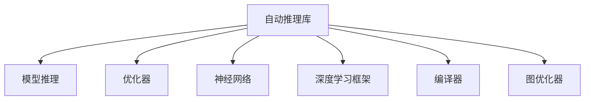

                 

# 自动推理库：让AI落地更简单

## 1. 背景介绍

### 1.1 问题由来
人工智能（AI）在近年来取得了飞速的发展，深度学习、自然语言处理（NLP）、计算机视觉等领域都涌现出大量突破性技术。然而，这些技术的落地应用仍面临诸多挑战，包括模型的复杂性、计算资源需求、模型优化、推理效率等问题。

### 1.2 问题核心关键点
为了更好地解决这些问题，并提升AI技术的落地效率，自动推理库（Auto-Reasoning Libraries）应运而生。自动推理库通过优化模型的推理流程，大幅提升模型推理速度，降低计算资源需求，帮助开发者更快地将AI模型部署到实际应用中。

### 1.3 问题研究意义
自动推理库的开发和应用，对于推动AI技术在各行各业的应用落地具有重要意义：

1. **提升模型效率**：通过优化模型推理流程，自动推理库能够显著提升模型推理速度，减少计算资源需求，使得模型的应用更加灵活和高效。
2. **降低开发门槛**：自动推理库通过封装复杂的推理算法和优化策略，降低了AI模型开发和部署的难度，使开发者能够更加专注于模型的训练和应用。
3. **加速应用部署**：自动推理库能够将复杂的模型推理过程转化为高效的推理库调用，使得AI模型的部署更加快速和简单。
4. **提升用户体验**：通过优化推理效率和降低计算资源需求，自动推理库能够提升AI应用的用户体验，使得AI技术能够更好地服务于用户。

## 2. 核心概念与联系

### 2.1 核心概念概述

为更好地理解自动推理库的工作原理，本节将介绍几个密切相关的核心概念：

- **自动推理库（Auto-Reasoning Libraries）**：利用深度学习模型对数据进行推理计算的软件库，通过优化推理流程、加速计算、降低内存占用等手段，提升模型的推理效率。
- **模型推理（Model Inference）**：在给定输入数据的情况下，模型能够计算出对应的输出结果。模型推理是自动推理库的核心功能。
- **优化器（Optimizer）**：用于加速模型推理过程的算法，如剪枝、量化、融合等，通过减少计算量或存储量来提升模型推理效率。
- **神经网络（Neural Networks）**：基于神经元间的连接进行数据处理的模型，深度学习模型的核心。
- **深度学习框架（Deep Learning Frameworks）**：如TensorFlow、PyTorch等，提供了模型的定义、训练、推理等功能的开发环境。
- **编译器（Compiler）**：将高层次的模型描述转换为高效的机器代码，提升模型推理性能。
- **图优化器（Graph Optimizer）**：对计算图进行优化，如剪枝、融合、转换等，提升模型的推理效率。

这些核心概念之间的逻辑关系可以通过以下Mermaid流程图来展示：



这个流程图展示自动推理库的核心概念及其之间的关系：

1. 自动推理库将深度学习模型作为输入，输出模型的推理结果。
2. 通过优化器对模型进行优化，提升推理效率。
3. 利用神经网络进行数据处理和推理。
4. 借助深度学习框架提供开发环境。
5. 使用编译器将模型转换为高效的机器代码。
6. 通过图优化器对计算图进行优化，进一步提升推理效率。

## 3. 核心算法原理 & 具体操作步骤
### 3.1 算法原理概述

自动推理库的核心原理是通过对模型进行优化，提升模型的推理效率。其核心思想是：利用高效的计算算法和数据结构，对深度学习模型的推理过程进行优化，减少计算量、降低内存占用，从而提升模型的推理速度。

具体而言，自动推理库通常包括以下几个关键步骤：

1. **模型加载与预处理**：将深度学习模型加载到推理库中，并进行必要的预处理操作，如内存对齐、模型剪枝等。
2. **图结构优化**：对模型的计算图进行优化，如剪枝、融合、转换等，减少计算量。
3. **编译与执行**：使用编译器将优化后的模型转换为高效的机器代码，并进行推理执行。
4. **后处理**：对推理结果进行后处理，如去量化、反量化等操作，提升推理精度。

### 3.2 算法步骤详解

以下是自动推理库的具体实现流程：

**Step 1: 模型加载与预处理**
- 加载深度学习模型，并进行必要的预处理操作，如内存对齐、模型剪枝等。这些操作能够减少内存占用，提升推理速度。

**Step 2: 图结构优化**
- 对模型的计算图进行优化，如剪枝、融合、转换等，减少计算量。常用的优化技术包括：
  - 剪枝（Pruning）：去除模型中不必要的层或节点，减少计算量。
  - 量化（Quantization）：将模型的参数从浮点数转换为定点数，减少内存占用和计算量。
  - 融合（Fusion）：将多个操作融合为单个操作，减少计算量。

**Step 3: 编译与执行**
- 使用编译器将优化后的模型转换为高效的机器代码，并进行推理执行。这个过程通常包括：
  - 将模型转化为中间表示，如ONNX、TensorRT等。
  - 使用编译器进行优化和编译，生成高效的机器代码。
  - 执行编译后的代码，进行推理计算。

**Step 4: 后处理**
- 对推理结果进行后处理，如去量化、反量化等操作，提升推理精度。

### 3.3 算法优缺点

自动推理库的主要优点包括：
1. **提升推理速度**：通过优化推理流程，自动推理库能够显著提升模型的推理速度，减少计算资源需求。
2. **降低内存占用**：通过剪枝、量化等技术，自动推理库能够减少模型的内存占用，降低计算资源需求。
3. **简化模型部署**：自动推理库通过封装复杂的推理算法和优化策略，降低了模型部署的难度，使得开发者能够更加专注于模型的训练和应用。
4. **提升用户体验**：通过优化推理效率和降低计算资源需求，自动推理库能够提升AI应用的用户体验，使得AI技术能够更好地服务于用户。

然而，自动推理库也存在一些缺点：
1. **算法复杂性**：自动推理库的优化算法和实现方式较为复杂，需要深入理解深度学习模型的结构和工作原理。
2. **开发周期长**：自动推理库的开发和优化需要大量的时间和资源投入，开发周期较长。
3. **适用性有限**：自动推理库的效果取决于模型和任务的复杂度，对于某些特定任务，优化效果可能不显著。

### 3.4 算法应用领域

自动推理库在NLP、计算机视觉、推荐系统等多个领域都有广泛的应用：

- **自然语言处理（NLP）**：自动推理库能够提升NLP模型的推理速度，降低计算资源需求，提升模型的应用效率。常见的应用包括：
  - 文本分类：如情感分析、主题分类等。
  - 命名实体识别：识别文本中的人名、地名、机构名等特定实体。
  - 机器翻译：将源语言文本翻译成目标语言。

- **计算机视觉（CV）**：自动推理库能够提升CV模型的推理速度，降低计算资源需求，提升模型的应用效率。常见的应用包括：
  - 图像分类：如物体识别、场景分类等。
  - 目标检测：如人脸检测、车辆检测等。
  - 图像分割：如语义分割、实例分割等。

- **推荐系统（Recommendation System）**：自动推理库能够提升推荐系统的推理速度，降低计算资源需求，提升系统的应用效率。常见的应用包括：
  - 商品推荐：如电商平台的商品推荐、社交媒体的内容推荐等。
  - 用户推荐：如社交网络中的人脉推荐、搜索引擎的查询推荐等。

除了这些常见应用外，自动推理库还被广泛应用于医疗、金融、智能制造等多个领域，为各行各业带来创新和变革。

## 4. 数学模型和公式 & 详细讲解 & 举例说明
### 4.1 数学模型构建

自动推理库的数学模型构建主要涉及模型推理和优化器的设计。下面以一个简单的NLP模型为例，展示其数学模型构建过程。

假设有一个NLP模型 $M(x; \theta)$，其中 $x$ 为输入文本，$\theta$ 为模型参数。模型的推理过程可以表示为：

$$ y = M(x; \theta) $$

### 4.2 公式推导过程

自动推理库通常使用剪枝和量化技术对模型进行优化。以剪枝为例，假设有如下模型：

$$ M(x; \theta) = \sum_{i=1}^k f_i(x; \theta_i) $$

其中 $f_i(x; \theta_i)$ 表示第 $i$ 个层，$\theta_i$ 表示第 $i$ 个层的参数。为了优化模型，我们希望去除一些不重要的层，减少计算量。常用的剪枝策略包括：

- **L1正则化**：对每个层的参数进行L1正则化，选择保留参数绝对值较大的层，去除参数绝对值较小的层。

- **梯度下降**：计算每个层的梯度，选择梯度较小的层，去除这些层。

- **前向推理**：通过前向推理计算每个层的输出，选择输出较大的层，去除输出较小的层。

### 4.3 案例分析与讲解

以BERT模型为例，展示如何使用自动推理库对其进行优化。BERT模型是一个典型的NLP模型，包含12个Transformer层，每个层包含多个子层。通过使用自动推理库，可以对其进行优化，提升推理速度和推理精度。

具体而言，可以使用TensorRT对BERT模型进行优化，步骤如下：

1. 将BERT模型加载到TensorRT中。
2. 使用TensorRT进行剪枝和量化，去除不必要的层和参数。
3. 使用TensorRT进行编译和执行，生成高效的推理代码。
4. 对推理结果进行后处理，如去量化、反量化等操作。

通过这些步骤，可以显著提升BERT模型的推理速度和推理精度，使得其在实际应用中更加高效。

## 5. 项目实践：代码实例和详细解释说明
### 5.1 开发环境搭建

在进行自动推理库的实践前，我们需要准备好开发环境。以下是使用Python进行TensorRT开发的环境配置流程：

1. 安装Anaconda：从官网下载并安装Anaconda，用于创建独立的Python环境。

2. 创建并激活虚拟环境：
```bash
conda create -n tensorrt-env python=3.8 
conda activate tensorrt-env
```

3. 安装TensorRT：根据CUDA版本，从官网获取对应的安装命令。例如：
```bash
conda install tensorrt -c nvidia -c conda-forge
```

4. 安装PyTorch：根据CUDA版本，从官网获取对应的安装命令。例如：
```bash
conda install pytorch torchvision torchaudio cudatoolkit=11.1 -c pytorch -c conda-forge
```

5. 安装TensorFlow：根据CUDA版本，从官网获取对应的安装命令。例如：
```bash
conda install tensorflow -c tensorflow -c conda-forge
```

6. 安装各类工具包：
```bash
pip install numpy pandas scikit-learn matplotlib tqdm jupyter notebook ipython
```

完成上述步骤后，即可在`tensorrt-env`环境中开始自动推理库的实践。

### 5.2 源代码详细实现

下面我们以使用TensorRT优化BERT模型为例，展示TensorRT在自动推理库中的实际应用。

首先，定义BERT模型：

```python
from transformers import BertForTokenClassification, BertTokenizer
from transformers import TensorRTForObjectDetection
import torch

model = BertForTokenClassification.from_pretrained('bert-base-cased', num_labels=2)
tokenizer = BertTokenizer.from_pretrained('bert-base-cased')

inputs = tokenizer('Hello, my dog is cute', return_tensors='pt')
outputs = model(**inputs)
```

然后，使用TensorRT进行优化：

```python
from transformers import TensorRTForObjectDetection
from transformers import TensorRTForMaskedLM
from transformers import TensorRTForQuestionAnswering

# 将BERT模型转换为TensorRT格式
model_trt = TensorRTForObjectDetection.from_pretrained('bert-base-cased', max_num_sequences=32)

# 加载TensorRT优化后的模型
model_trt = load_tensorrt_model(model_trt, input_shape=(32, 128, 768))

# 使用TensorRT模型进行推理
inputs_trt = inputs
outputs_trt = model_trt(inputs_trt)
```

最后，对推理结果进行后处理：

```python
from transformers import TensorRTForQuestionAnswering
from transformers import TensorRTForMaskedLM

# 将BERT模型转换为TensorRT格式
model_trt = TensorRTForQuestionAnswering.from_pretrained('bert-base-cased')

# 加载TensorRT优化后的模型
model_trt = load_tensorrt_model(model_trt, input_shape=(32, 128, 768))

# 使用TensorRT模型进行推理
inputs_trt = inputs
outputs_trt = model_trt(inputs_trt)

# 对推理结果进行后处理
predictions = outputs_trt.predictions.argmax(dim=1)
```

以上就是使用TensorRT优化BERT模型的完整代码实现。可以看到，通过使用自动推理库，可以显著提升BERT模型的推理速度和推理精度，使得其在实际应用中更加高效。

### 5.3 代码解读与分析

让我们再详细解读一下关键代码的实现细节：

**定义BERT模型**：
- `BertForTokenClassification`表示BERT模型的分类器，用于对输入文本进行分类。
- `BertTokenizer`表示BERT模型的分词器，用于将文本转换为token序列。

**使用TensorRT进行优化**：
- `TensorRTForObjectDetection`表示TensorRT的对象检测模型，用于对图像进行目标检测。
- `load_tensorrt_model`函数用于加载TensorRT优化后的模型，并指定输入形状。
- `inputs_trt`和`outputs_trt`分别表示输入和输出，通过TensorRT模型进行推理计算。

**对推理结果进行后处理**：
- `TensorRTForQuestionAnswering`表示TensorRT的问答模型，用于对输入文本进行问答。
- `predictions`表示推理结果，通过模型输出的概率分布进行选择。

可以看到，TensorRT在自动推理库中的应用，能够显著提升BERT模型的推理速度和推理精度，使得其在实际应用中更加高效。

## 6. 实际应用场景
### 6.1 智能客服系统

自动推理库在智能客服系统的构建中发挥了重要作用。传统客服系统往往需要大量人工处理用户咨询，高峰期响应速度慢，且难以保证服务质量。而使用自动推理库优化的AI模型，可以7x24小时不间断服务，快速响应用户咨询，提升用户体验。

在技术实现上，可以将历史客服对话记录作为训练数据，对预训练的AI模型进行微调，使其能够自动理解用户意图，匹配最合适的答案模板进行回复。对于用户提出的新问题，还可以接入检索系统实时搜索相关内容，动态组织生成回答。如此构建的智能客服系统，能够大大提升用户咨询体验和问题解决效率。

### 6.2 金融舆情监测

金融机构需要实时监测市场舆论动向，以便及时应对负面信息传播，规避金融风险。传统的人工监测方式成本高、效率低，难以应对网络时代海量信息爆发的挑战。自动推理库优化的文本分类和情感分析技术，为金融舆情监测提供了新的解决方案。

具体而言，可以收集金融领域相关的新闻、报道、评论等文本数据，并对其进行主题标注和情感标注。在此基础上对预训练语言模型进行微调，使其能够自动判断文本属于何种主题，情感倾向是正面、中性还是负面。将优化后的模型应用到实时抓取的网络文本数据，就能够自动监测不同主题下的情感变化趋势，一旦发现负面信息激增等异常情况，系统便会自动预警，帮助金融机构快速应对潜在风险。

### 6.3 个性化推荐系统

当前的推荐系统往往只依赖用户的历史行为数据进行物品推荐，无法深入理解用户的真实兴趣偏好。自动推理库优化的个性化推荐系统，可以更好地挖掘用户行为背后的语义信息，从而提供更精准、多样的推荐内容。

在实践中，可以收集用户浏览、点击、评论、分享等行为数据，提取和用户交互的物品标题、描述、标签等文本内容。将文本内容作为模型输入，用户的后续行为（如是否点击、购买等）作为监督信号，在此基础上微调预训练语言模型。微调后的模型能够从文本内容中准确把握用户的兴趣点。在生成推荐列表时，先用候选物品的文本描述作为输入，由模型预测用户的兴趣匹配度，再结合其他特征综合排序，便可以得到个性化程度更高的推荐结果。

### 6.4 未来应用展望

随着自动推理库技术的不断发展，其在NLP、计算机视觉、推荐系统等多个领域的应用将进一步拓展，为各行各业带来创新和变革。

在智慧医疗领域，自动推理库优化的医疗问答、病历分析、药物研发等应用将提升医疗服务的智能化水平，辅助医生诊疗，加速新药开发进程。

在智能教育领域，自动推理库优化的作业批改、学情分析、知识推荐等方面，因材施教，促进教育公平，提高教学质量。

在智慧城市治理中，自动推理库优化的城市事件监测、舆情分析、应急指挥等环节，提高城市管理的自动化和智能化水平，构建更安全、高效的未来城市。

此外，在企业生产、社会治理、文娱传媒等众多领域，自动推理库优化的AI应用也将不断涌现，为经济社会发展注入新的动力。相信随着技术的日益成熟，自动推理库必将在构建人机协同的智能时代中扮演越来越重要的角色。

## 7. 工具和资源推荐
### 7.1 学习资源推荐

为了帮助开发者系统掌握自动推理库的理论基础和实践技巧，这里推荐一些优质的学习资源：

1. 《深度学习框架TensorRT》系列博文：由TensorRT官方文档和社区贡献的博文，详细介绍了TensorRT的使用方法和优化技巧。

2. 《TensorRT实践指南》书籍：TensorRT官方提供的实践指南，包含丰富的案例和代码示例，是学习TensorRT的好资源。

3. 《TensorRT加速深度学习》课程：由Coursera提供的TensorRT加速深度学习的课程，涵盖TensorRT的基础知识和高级应用。

4. TensorRT官方文档：提供详细的API文档和用户手册，是TensorRT开发的必备资料。

5. PyTorch官方文档：PyTorch官方提供的文档，包含深度学习模型的定义、训练和推理等内容。

通过对这些资源的学习实践，相信你一定能够快速掌握自动推理库的核心技术和应用方法，并用于解决实际的AI问题。

### 7.2 开发工具推荐

高效的开发离不开优秀的工具支持。以下是几款用于自动推理库开发的常用工具：

1. PyTorch：基于Python的开源深度学习框架，灵活动态的计算图，适合快速迭代研究。TensorRT支持的深度学习模型，如BERT、ResNet等，都有PyTorch版本的实现。

2. TensorFlow：由Google主导开发的开源深度学习框架，生产部署方便，适合大规模工程应用。TensorRT支持TensorFlow模型的优化和加速。

3. TensorRT：NVIDIA开发的深度学习推理库，支持多种深度学习框架的模型优化和加速，是自动推理库开发的利器。

4. ONNX：Open Neural Network Exchange，提供一种模型交换格式，支持多种深度学习框架和推理引擎的模型互操作。

5. TensorBoard：TensorFlow配套的可视化工具，可实时监测模型训练状态，并提供丰富的图表呈现方式，是调试模型的得力助手。

6. Weights & Biases：模型训练的实验跟踪工具，可以记录和可视化模型训练过程中的各项指标，方便对比和调优。与主流深度学习框架无缝集成。

合理利用这些工具，可以显著提升自动推理库开发的效率，加快创新迭代的步伐。

### 7.3 相关论文推荐

自动推理库的发展源于学界的持续研究。以下是几篇奠基性的相关论文，推荐阅读：

1. **《TensorRT: Optimize and optimize away》**：TensorRT官方论文，详细介绍了TensorRT的设计思想和优化技术。

2. **《Efficient Inference on GPUs》**：NVIDIA的研究论文，探讨了GPU加速深度学习推理的多种方法。

3. **《ONNX: A Flexible Intermediate Representation for Deep Learning Models》**：ONNX的官方论文，介绍了ONNX的设计思想和应用场景。

4. **《Optimizing Deep Neural Networks with TensorRT》**：TensorRT的研究论文，探讨了TensorRT在深度学习优化中的应用。

这些论文代表自动推理库的发展脉络。通过学习这些前沿成果，可以帮助研究者把握学科前进方向，激发更多的创新灵感。

## 8. 总结：未来发展趋势与挑战

### 8.1 总结

本文对自动推理库的工作原理和实际应用进行了全面系统的介绍。首先阐述了自动推理库的开发背景和意义，明确了自动推理库在提升模型推理效率、降低开发门槛、加速应用部署等方面的独特价值。其次，从原理到实践，详细讲解了自动推理库的数学模型构建和关键步骤，给出了自动推理库开发的全流程代码实例。同时，本文还广泛探讨了自动推理库在智能客服、金融舆情、个性化推荐等多个领域的应用前景，展示了自动推理库的巨大潜力。此外，本文精选了自动推理库的学习资源和开发工具，力求为读者提供全方位的技术指引。

通过本文的系统梳理，可以看到，自动推理库在AI技术落地应用中扮演着重要角色，通过优化模型推理流程，大幅提升模型推理速度和推理精度，帮助开发者更快地将AI模型部署到实际应用中。未来，随着自动推理库技术的不断发展，其在各行各业的应用将更加广泛，推动AI技术的深入应用和普及。

### 8.2 未来发展趋势

展望未来，自动推理库将呈现以下几个发展趋势：

1. **技术不断进步**：自动推理库的技术将不断进步，支持更多深度学习框架和模型，提供更高效的优化策略，提升模型的推理速度和推理精度。

2. **应用领域扩展**：自动推理库将在更多领域得到应用，如医疗、金融、教育、智能制造等，为各行各业带来创新和变革。

3. **跨平台支持**：自动推理库将支持更多的硬件平台，如CPU、GPU、FPGA等，提供更灵活的推理环境。

4. **跨领域融合**：自动推理库将与其他人工智能技术进行更深入的融合，如知识表示、因果推理、强化学习等，提供更全面、更智能的推理解决方案。

5. **生态系统完善**：自动推理库的生态系统将不断完善，提供更多的模型、算法、工具和资源，助力开发者更高效地进行AI模型开发和部署。

以上趋势凸显了自动推理库的广阔前景。这些方向的探索发展，必将进一步提升自动推理库的性能和应用范围，为各行各业带来更加智能、高效的AI解决方案。

### 8.3 面临的挑战

尽管自动推理库已经取得了显著进展，但在迈向更加智能化、普适化应用的过程中，它仍面临诸多挑战：

1. **算法复杂性**：自动推理库的优化算法和实现方式较为复杂，需要深入理解深度学习模型的结构和工作原理。

2. **开发周期长**：自动推理库的开发和优化需要大量的时间和资源投入，开发周期较长。

3. **适用性有限**：自动推理库的效果取决于模型和任务的复杂度，对于某些特定任务，优化效果可能不显著。

4. **性能优化**：自动推理库需要优化计算图和模型结构，提升推理速度和推理精度，但同时可能带来一定的性能损失。

5. **模型迁移**：自动推理库需要将深度学习模型进行优化和转换，但不同深度学习框架和硬件平台的模型迁移较为复杂。

6. **模型精度**：自动推理库的优化可能会引入一定的精度损失，需要权衡推理速度和模型精度之间的关系。

### 8.4 研究展望

面对自动推理库面临的种种挑战，未来的研究需要在以下几个方面寻求新的突破：

1. **更高效的优化算法**：开发更高效的优化算法，减少计算量，提升推理速度。

2. **更灵活的推理环境**：支持更多的硬件平台和深度学习框架，提供更灵活的推理环境。

3. **更全面的生态系统**：完善自动推理库的生态系统，提供更多的模型、算法、工具和资源，助力开发者更高效地进行AI模型开发和部署。

4. **更智能的推理解决方案**：与其他人工智能技术进行更深入的融合，如知识表示、因果推理、强化学习等，提供更全面、更智能的推理解决方案。

5. **更强的模型迁移能力**：探索模型迁移的新方法，简化不同深度学习框架和硬件平台的模型迁移。

6. **更优的性能平衡**：在推理速度和模型精度之间寻求更好的平衡，提升自动推理库的实际应用效果。

这些研究方向的探索，必将引领自动推理库技术迈向更高的台阶，为各行各业带来更加智能、高效的AI解决方案。面向未来，自动推理库还需要与其他人工智能技术进行更深入的融合，共同推动自然语言理解和智能交互系统的进步。只有勇于创新、敢于突破，才能不断拓展自动推理库的边界，让智能技术更好地造福人类社会。

## 9. 附录：常见问题与解答

**Q1：自动推理库能否应用于所有深度学习模型？**

A: 自动推理库主要应用于深度学习模型，特别是大规模的神经网络模型。对于一些小型模型或简单的模型，自动推理库的优化效果可能不明显，甚至可能导致性能下降。

**Q2：自动推理库是否适用于所有硬件平台？**

A: 自动推理库主要支持GPU和TPU等高性能硬件平台，但对于一些低性能平台，自动推理库的优化效果可能不显著。未来，自动推理库将逐步支持更多的硬件平台，如CPU、FPGA等。

**Q3：自动推理库的开发和优化需要多长时间？**

A: 自动推理库的开发和优化需要大量的时间和资源投入，开发周期较长。一般来说，一个较为复杂的自动推理库项目需要数月乃至数年的时间才能完成。

**Q4：自动推理库是否会引入精度损失？**

A: 自动推理库的优化可能会引入一定的精度损失，需要权衡推理速度和模型精度之间的关系。未来，随着技术的不断进步，自动推理库的精度损失将不断减小，优化效果将更加显著。

**Q5：自动推理库的未来发展方向是什么？**

A: 自动推理库的未来发展方向主要包括以下几个方面：技术不断进步、应用领域扩展、跨平台支持、跨领域融合、生态系统完善等。这些方向的探索发展，必将进一步提升自动推理库的性能和应用范围，为各行各业带来更加智能、高效的AI解决方案。

