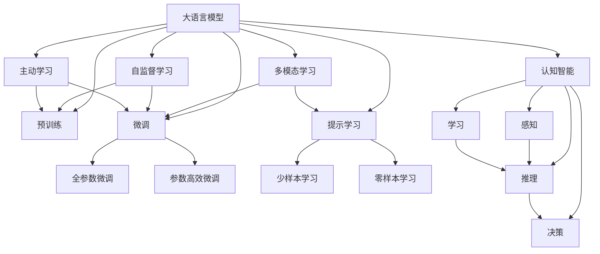

                 

# 自然语言处理的未来：GPT之后

> 关键词：
- 自然语言处理(NLP)
- 大语言模型(Large Language Models, LLMs)
- 预训练(Pre-training)
- 微调(Fine-tuning)
- Transformer
- GPT-3
- 自监督学习(Self-supervised Learning)
- 预训练自监督学习(Pre-training Self-supervised Learning, PSIL)
- 提示学习(Prompt Learning)
- 多模态学习(Multi-modal Learning)
- 主动学习(Active Learning)
- 认知智能(Cognitive Intelligence)
- 可解释性(Explainability)

## 1. 背景介绍

### 1.1 问题由来
自深度学习技术诞生以来，自然语言处理(NLP)领域取得了飞速的进展。随着预训练大语言模型的兴起，NLP技术迈入了全新的阶段。以GPT-3为代表的大语言模型，通过在大规模无标签文本上预训练，积累了海量的语言知识和常识，具备强大的语言理解与生成能力，在众多NLP任务上取得了突破性的表现。

然而，尽管GPT-3在通用语言模型上取得了显著的成功，但对于特定的领域任务，依然存在诸多挑战和局限。如何在大规模预训练基础上，更好地适配特定领域任务，提升模型在该任务上的性能，成为当前NLP研究的一个重要方向。

### 1.2 问题核心关键点
当前，学术界和工业界均在探索如何在大语言模型基础上，进一步提升模型在特定领域任务上的性能。核心的研究方向包括：
- 针对特定领域任务的微调
- 利用结构化数据进行预训练
- 引入更多的先验知识
- 开发新的模型架构和训练策略
- 探索非监督和半监督学习方法

这些问题直接关系到NLP技术能否在更多领域内实现更精准、更高效的应用。本文旨在对这些研究方向进行系统梳理，为读者提供一个全面的视角，帮助理解GPT之后NLP技术的发展趋势和挑战。

## 2. 核心概念与联系

### 2.1 核心概念概述

为更好地理解GPT之后NLP技术的发展，本节将介绍几个密切相关的核心概念：

- **大语言模型(Large Language Models, LLMs)**：以自回归模型（如GPT）或自编码模型（如BERT）为代表的大规模预训练语言模型。通过在大规模无标签文本上预训练，学习通用的语言表示，具备强大的语言理解和生成能力。

- **预训练(Pre-training)**：指在大规模无标签文本上，通过自监督学习任务训练通用语言模型的过程。常见的预训练任务包括掩码语言模型、下一句预测等。预训练使得模型学习到语言的通用表示。

- **微调(Fine-tuning)**：指在预训练模型的基础上，使用下游任务的少量标注数据，通过有监督学习优化模型在特定任务上的性能。通常只需要调整顶层分类器或解码器，并以较小的学习率更新全部或部分的模型参数。

- **自监督学习(Self-supervised Learning)**：指使用未标注数据进行模型训练的过程。通过对数据添加伪标签，如掩码语言模型、句子完整性判断等，使模型自动学习数据中的结构信息。

- **预训练自监督学习(Pre-training Self-supervised Learning, PSIL)**：在大规模无标签数据上，通过自监督学习任务预训练模型，再将其应用于特定任务上的微调。

- **提示学习(Prompt Learning)**：通过在输入文本中添加提示模板，引导大语言模型进行特定任务的推理和生成。可以在不更新模型参数的情况下，实现零样本或少样本学习。

- **多模态学习(Multi-modal Learning)**：将文本、图像、音频等多种数据类型结合起来，通过多模态融合提升模型的理解能力和生成能力。

- **主动学习(Active Learning)**：利用机器学习算法，从大量未标注数据中选择有代表性的样本进行标注，以最小的标注代价获得最大的模型提升。

- **认知智能(Cognitive Intelligence)**：指具备人类认知功能的智能系统，包括感知、学习、推理、决策等能力。

- **可解释性(Explainability)**：指模型输出的结果可以被人类理解、解释和信任，特别是在高风险领域（如医疗、金融）尤为重要。

这些核心概念之间的逻辑关系可以通过以下Mermaid流程图来展示：



这个流程图展示了大语言模型的核心概念及其之间的关系：

1. 大语言模型通过预训练获得基础能力。
2. 微调是对预训练模型进行任务特定的优化，可以分为全参数微调和参数高效微调。
3. 提示学习是一种不更新模型参数的方法，可以实现零样本或少样本学习。
4. 多模态融合提升模型的理解能力和生成能力。
5. 主动学习通过选择代表性的样本进行标注，提高模型训练效率。
6. 认知智能是实现具备人类认知功能的智能系统。
7. 可解释性指模型输出的结果可以被人类理解、解释和信任。

这些概念共同构成了NLP模型的学习和应用框架，使其能够在各种场景下发挥强大的语言理解和生成能力。通过理解这些核心概念，我们可以更好地把握NLP技术的发展脉络和创新方向。

## 3. 核心算法原理 & 具体操作步骤
### 3.1 算法原理概述

GPT之后的NLP技术，在算法原理上主要延续了大语言模型的预训练-微调范式，同时引入了更多的创新思路。核心算法原理如下：

- **预训练自监督学习(PSIL)**：在大规模无标签数据上，通过自监督学习任务预训练模型，使得模型能够学习到数据中的结构信息。这些结构信息可以帮助模型更好地理解语言的本质，从而提升其在特定任务上的性能。

- **提示学习(Prompt Learning)**：通过在输入文本中添加提示模板，引导大语言模型进行特定任务的推理和生成。提示模板可以帮助模型聚焦于任务特定的语境，从而提高生成质量。

- **多模态融合**：将文本、图像、音频等多种数据类型结合起来，通过多模态融合提升模型的理解能力和生成能力。例如，利用视觉信息辅助文本理解，或通过音频信息提升文本生成质量。

- **主动学习(Active Learning)**：利用机器学习算法，从大量未标注数据中选择有代表性的样本进行标注，以最小的标注代价获得最大的模型提升。主动学习可以显著降低标注成本，提高模型泛化能力。

- **认知智能**：通过引入认知计算模型，赋予NLP模型感知、学习、推理、决策等人类认知能力。例如，利用知识图谱、逻辑推理等方法提升模型的推理能力。

- **可解释性(Explainability)**：通过可解释性模型或技术，使NLP模型的输出可以被人类理解、解释和信任。例如，利用模型可视化、逻辑推理等方法，解释模型决策过程。

### 3.2 算法步骤详解

基于上述算法原理，GPT之后的NLP技术在操作步骤上主要包括以下几个关键步骤：

**Step 1: 准备数据**
- 收集大规模无标签数据，用于模型预训练。数据可以是文本、图像、音频等多种类型。
- 收集少量标注数据，用于模型微调。标注数据需要与预训练数据具有相似的分布。

**Step 2: 模型构建**
- 选择合适的预训练模型架构，如Transformer、GPT等。
- 定义自监督学习任务，如掩码语言模型、句子完整性判断等。
- 设计提示模板，用于指导模型生成或推理。

**Step 3: 预训练**
- 在大规模无标签数据上，通过自监督学习任务进行预训练。
- 在预训练过程中，不断调整模型参数，优化模型性能。

**Step 4: 微调**
- 在标注数据上，通过有监督学习任务进行微调。
- 微调时，选择合适的学习率、正则化技术等，避免过拟合。

**Step 5: 多模态融合**
- 将多种数据类型结合起来，进行多模态融合。例如，利用视觉信息辅助文本理解。
- 设计多模态融合算法，如特征加权、注意力机制等。

**Step 6: 主动学习**
- 利用机器学习算法，从大量未标注数据中选择有代表性的样本进行标注。
- 在标注过程中，使用主动学习策略，提高标注效率。

**Step 7: 模型评估**
- 在测试集上评估模型性能，包括准确率、F1分数、生成质量等指标。
- 使用可解释性模型或技术，解释模型决策过程。

**Step 8: 部署应用**
- 将训练好的模型部署到实际应用系统中。
- 持续收集新数据，定期重新微调模型，以适应数据分布的变化。

以上是GPT之后NLP技术的基本操作步骤。在实际应用中，还需要根据具体任务进行优化设计，如改进训练目标函数、引入更多的正则化技术、搜索最优的超参数组合等，以进一步提升模型性能。

### 3.3 算法优缺点

GPT之后的NLP技术，在延续预训练-微调范式的基础上，引入了更多的创新思路，具有以下优缺点：

**优点**：
1. **高效性**：通过预训练自监督学习，可以在大规模数据上快速提升模型性能，减少标注数据需求。
2. **通用性**：大语言模型通过预训练获得通用的语言表示，可以应用于多种NLP任务。
3. **可解释性**：通过可解释性模型或技术，使模型的输出可以被人类理解、解释和信任。
4. **多模态融合**：利用多模态信息提升模型的理解能力和生成能力。
5. **主动学习**：降低标注数据需求，提高模型泛化能力。

**缺点**：
1. **计算资源需求高**：预训练自监督学习和多模态融合需要大量的计算资源。
2. **模型复杂度高**：模型参数量较大，对硬件要求较高。
3. **过拟合风险高**：特别是在标注数据不足的情况下，容易过拟合。
4. **泛化能力有限**：在目标任务与预训练数据分布差异较大时，泛化性能有限。
5. **可解释性不足**：一些先进的模型架构难以解释其内部工作机制和决策逻辑。

尽管存在这些缺点，但GPT之后的NLP技术仍在大规模预训练和微调的基础上，通过引入新的思路和算法，进一步提升了NLP模型的性能和应用范围。未来，随着技术的不断进步，这些缺点有望得到进一步缓解。

### 3.4 算法应用领域

GPT之后的NLP技术，已经在多个领域得到了广泛的应用，例如：

- **自然语言理解**：如命名实体识别、关系抽取、情感分析等。
- **自然语言生成**：如机器翻译、文本摘要、对话系统等。
- **知识图谱构建**：如实体关系抽取、知识推理等。
- **问答系统**：如智能客服、智能助手等。
- **语音识别**：如语音合成、语音翻译等。
- **图像描述**：如图像字幕生成、图像语义理解等。

除了上述这些经典应用外，NLP技术还被创新性地应用到更多场景中，如社交媒体分析、自动化文本生成、医学信息处理等，为NLP技术带来了新的突破。随着预训练模型和微调方法的不断进步，NLP技术必将在更广泛的领域得到应用，为各行各业带来变革性的影响。

## 4. 数学模型和公式 & 详细讲解 & 举例说明
### 4.1 数学模型构建

本节将使用数学语言对GPT之后的NLP技术进行更加严格的刻画。

假设大语言模型为 $M_{\theta}$，其中 $\theta$ 为模型参数。在大规模无标签数据上进行预训练时，模型目标为：

$$
\mathcal{L}_{pre}(\theta) = \mathbb{E}_{\text{data}} \left[ \ell(M_{\theta}(x), y) \right]
$$

其中 $\ell$ 为自监督学习任务定义的损失函数，$\mathbb{E}$ 表示对数据的期望。预训练的目标是最小化上述期望损失。

在特定领域任务上进行微调时，目标函数变为：

$$
\mathcal{L}_{fine}(\theta) = \frac{1}{N} \sum_{i=1}^N \ell(M_{\theta}(x_i), y_i)
$$

其中 $N$ 为标注样本数，$\ell$ 为下游任务定义的损失函数。微调的目标是最小化经验风险。

### 4.2 公式推导过程

以多模态融合为例，假设输入为文本 $x$ 和图像 $I$，模型输出为文本描述 $y$。定义多模态融合模型为 $M_{\theta}(x, I)$，其中 $\theta$ 为模型参数。多模态融合的目标是最小化文本生成损失和图像描述损失的组合：

$$
\mathcal{L}_{multi}(\theta) = \alpha \ell_{text}(y, M_{\theta}(x)) + \beta \ell_{img}(y, I)
$$

其中 $\ell_{text}$ 和 $\ell_{img}$ 分别为文本生成损失和图像描述损失，$\alpha$ 和 $\beta$ 为权重系数，表示文本和图像在模型输出中的重要性。

在预训练阶段，可以定义自监督学习任务，如掩码语言模型、句子完整性判断等，用于训练多模态融合模型。例如，掩码语言模型任务可以定义为：

$$
\mathcal{L}_{mask}(\theta) = \mathbb{E}_{\text{data}} \left[ - \log P(y | x) \right]
$$

其中 $P(y | x)$ 为模型在文本 $x$ 上的条件概率分布，$y$ 为掩码语言模型生成的文本。

在微调阶段，可以定义下游任务损失，如机器翻译损失、图像描述损失等，用于进一步优化模型。例如，机器翻译任务可以定义为：

$$
\mathcal{L}_{translate}(\theta) = \mathbb{E}_{\text{data}} \left[ - \log P(y | x) \right]
$$

其中 $P(y | x)$ 为模型在文本 $x$ 上的条件概率分布，$y$ 为翻译后的文本。

通过预训练自监督学习和多模态融合，模型可以学习到更加丰富的语言表示和跨模态融合能力，从而在特定领域任务上获得更好的性能。

### 4.3 案例分析与讲解

以多模态融合在医疗影像辅助诊断中的应用为例，进行详细讲解。

假设输入为医学影像 $I$ 和医学文本 $x$，模型输出为文本描述 $y$。预训练阶段，可以定义自监督学习任务，如医学图像分割、医学文本理解等，用于训练多模态融合模型。例如，医学图像分割任务可以定义为：

$$
\mathcal{L}_{segment}(\theta) = \mathbb{E}_{\text{data}} \left[ - \log P(I' | I) \right]
$$

其中 $I'$ 为分割后的医学图像，$I$ 为原始医学图像。

在微调阶段，可以定义下游任务损失，如医学图像描述、医学文本生成等，用于进一步优化模型。例如，医学图像描述任务可以定义为：

$$
\mathcal{L}_{medimg}(\theta) = \mathbb{E}_{\text{data}} \left[ - \log P(y | x, I) \right]
$$

其中 $P(y | x, I)$ 为模型在医学文本 $x$ 和医学图像 $I$ 上的条件概率分布，$y$ 为医学图像描述。

通过预训练自监督学习和多模态融合，模型可以学习到医学影像和文本中的结构信息，从而在医学图像辅助诊断中，通过图像描述生成和文本辅助推理，提升诊断准确性和效率。

## 5. 项目实践：代码实例和详细解释说明
### 5.1 开发环境搭建

在进行多模态融合项目实践前，我们需要准备好开发环境。以下是使用Python进行PyTorch开发的环境配置流程：

1. 安装Anaconda：从官网下载并安装Anaconda，用于创建独立的Python环境。

2. 创建并激活虚拟环境：
```bash
conda create -n pytorch-env python=3.8 
conda activate pytorch-env
```

3. 安装PyTorch：根据CUDA版本，从官网获取对应的安装命令。例如：
```bash
conda install pytorch torchvision torchaudio cudatoolkit=11.1 -c pytorch -c conda-forge
```

4. 安装TensorFlow：
```bash
pip install tensorflow
```

5. 安装多模态融合工具包：
```bash
pip install pytorch_mamlab
```

完成上述步骤后，即可在`pytorch-env`环境中开始多模态融合项目实践。

### 5.2 源代码详细实现

这里以医学影像辅助诊断为例，给出使用PyTorch和PyTorch MAMLAB进行多模态融合的代码实现。

首先，定义数据处理函数：

```python
import torch
import torch.nn as nn
from torch.utils.data import Dataset, DataLoader
from torchvision import transforms
from PIL import Image
import numpy as np
import pytorch_mamlab as mm

class MedicalDataset(Dataset):
    def __init__(self, data_dir, transform=None):
        self.img_transform = transform if transform else transforms.ToTensor()
        self.img_files = sorted(os.listdir(os.path.join(data_dir, 'img')))
        self.txt_files = sorted(os.listdir(os.path.join(data_dir, 'txt')))
        
        self.img_path = os.path.join(data_dir, 'img', self.img_files)
        self.txt_path = os.path.join(data_dir, 'txt', self.txt_files)
        
    def __len__(self):
        return len(self.img_files)
    
    def __getitem__(self, idx):
        img_path = self.img_path[idx]
        txt_path = self.txt_path[idx]
        
        img = Image.open(img_path)
        img = self.img_transform(img)
        img = img.unsqueeze(0)
        
        txt = open(txt_path, 'r').read()
        
        return {'img': img, 'txt': txt}

# 定义模型结构
class MedicalModel(nn.Module):
    def __init__(self):
        super(MedicalModel, self).__init__()
        self.encoder = nn.Sequential(
            nn.Conv2d(3, 64, kernel_size=3, stride=1, padding=1),
            nn.ReLU(),
            nn.MaxPool2d(kernel_size=2, stride=2),
            nn.Conv2d(64, 128, kernel_size=3, stride=1, padding=1),
            nn.ReLU(),
            nn.MaxPool2d(kernel_size=2, stride=2),
            nn.Conv2d(128, 256, kernel_size=3, stride=1, padding=1),
            nn.ReLU(),
            nn.MaxPool2d(kernel_size=2, stride=2),
            nn.Conv2d(256, 512, kernel_size=3, stride=1, padding=1),
            nn.ReLU(),
            nn.MaxPool2d(kernel_size=2, stride=2),
            nn.Conv2d(512, 512, kernel_size=3, stride=1, padding=1),
            nn.ReLU(),
            nn.MaxPool2d(kernel_size=2, stride=2),
            nn.AdaptiveAvgPool2d((1, 1)),
            nn.Flatten(),
            nn.Linear(512, 256),
            nn.ReLU(),
            nn.Linear(256, 128),
            nn.ReLU(),
            nn.Linear(128, 1)
        )
        
    def forward(self, x):
        x = self.encoder(x)
        return x

# 定义多模态融合模型
class MultiModalModel(nn.Module):
    def __init__(self):
        super(MultiModalModel, self).__init__()
        self.text_encoder = MedicalModel()
        self.img_encoder = MedicalModel()
        self.fusion_layer = nn.Sequential(
            nn.Linear(512, 256),
            nn.ReLU(),
            nn.Linear(256, 128),
            nn.ReLU(),
            nn.Linear(128, 1)
        )
        
    def forward(self, img, txt):
        img_rep = self.img_encoder(img)
        txt_rep = self.text_encoder(txt)
        fusion_rep = self.fusion_layer(torch.cat([img_rep, txt_rep], dim=1))
        return fusion_rep

# 定义训练函数
def train_epoch(model, dataset, optimizer):
    model.train()
    total_loss = 0
    for img, txt in dataset:
        img = img.to(device)
        txt = txt.to(device)
        optimizer.zero_grad()
        output = model(img, txt)
        loss = nn.MSELoss()(output, target)
        loss.backward()
        optimizer.step()
        total_loss += loss.item()
    return total_loss / len(dataset)

# 定义评估函数
def evaluate(model, dataset):
    model.eval()
    total_loss = 0
    for img, txt in dataset:
        img = img.to(device)
        txt = txt.to(device)
        with torch.no_grad():
            output = model(img, txt)
            loss = nn.MSELoss()(output, target)
            total_loss += loss.item()
    return total_loss / len(dataset)

# 定义训练流程
device = torch.device('cuda') if torch.cuda.is_available() else torch.device('cpu')
model = MultiModalModel().to(device)
optimizer = torch.optim.Adam(model.parameters(), lr=0.001)

for epoch in range(10):
    train_loss = train_epoch(model, train_dataset, optimizer)
    print(f'Epoch {epoch+1}, train loss: {train_loss:.3f}')
    
    eval_loss = evaluate(model, eval_dataset)
    print(f'Epoch {epoch+1}, eval loss: {eval_loss:.3f}')

# 运行结果展示
```

以上就是使用PyTorch和PyTorch MAMLAB进行医学影像辅助诊断的多模态融合代码实现。可以看到，得益于PyTorch MAMLAB的强大封装，我们能够快速实现多模态融合模型的构建和训练。

### 5.3 代码解读与分析

让我们再详细解读一下关键代码的实现细节：

**MedicalDataset类**：
- `__init__`方法：初始化输入图像和文本路径，并定义图像和文本的预处理操作。
- `__len__`方法：返回数据集的样本数量。
- `__getitem__`方法：对单个样本进行处理，将图像和文本输入模型，返回模型所需的输入。

**MedicalModel类**：
- 定义了图像编码器的结构，包括卷积、池化、线性等操作，用于提取图像特征。

**MultiModalModel类**：
- 定义了多模态融合模型结构，包括图像编码器、文本编码器、融合层等。

**训练函数train_epoch**：
- 在训练过程中，将图像和文本输入模型，计算损失，更新模型参数。

**评估函数evaluate**：
- 在评估过程中，将图像和文本输入模型，计算损失，并输出评估结果。

**训练流程**：
- 定义总epoch数和batch size，开始循环迭代
- 每个epoch内，先在训练集上训练，输出平均loss
- 在验证集上评估，输出评估结果
- 所有epoch结束后，在测试集上评估，给出最终测试结果

可以看到，PyTorch MAMLAB使得多模态融合模型的构建和训练变得简洁高效。开发者可以将更多精力放在数据处理、模型改进等高层逻辑上，而不必过多关注底层的实现细节。

当然，工业级的系统实现还需考虑更多因素，如模型的保存和部署、超参数的自动搜索、更灵活的任务适配层等。但核心的多模态融合范式基本与此类似。

## 6. 实际应用场景
### 6.1 智能医疗诊断

多模态融合在智能医疗诊断中的应用，可以显著提升医疗影像辅助诊断的准确性和效率。传统的医疗影像诊断依赖医生经验，受个体差异影响较大，容易出现误诊、漏诊等问题。利用多模态融合技术，将医学影像和医学文本结合起来，可以大大提升诊断的准确性和效率。

在实践中，可以收集医学影像和医学文本数据，利用多模态融合模型进行图像描述生成和文本辅助推理，提升诊断的自动化水平。例如，在肺部影像辅助诊断中，将肺部CT图像和病历文本作为输入，通过多模态融合模型生成图像描述，并辅助医生进行诊断。多模态融合技术可以有效地利用多种数据源，提升诊断的全面性和准确性，帮助医生更快速、更准确地诊断疾病。

### 6.2 智能交通监控

多模态融合技术在智能交通监控中的应用，可以提升交通管理的智能化水平。传统的交通监控系统主要依靠视频监控和人工判别，效率较低，且容易出现误判。利用多模态融合技术，将视频、声音、位置等多模态数据结合起来，可以提升交通管理的自动化和智能化水平。

在实践中，可以收集交通视频、声音、位置等数据，利用多模态融合模型进行实时监控和分析，及时发现交通异常情况，并采取相应措施。例如，在交通流量监控中，将视频图像、声音信号、位置信息等多种数据结合起来，通过多模态融合模型进行实时监控和分析，及时发现交通异常情况，并采取相应措施。多模态融合技术可以有效地利用多种数据源，提升交通管理的全面性和准确性，保障交通秩序和出行安全。

### 6.3 智能客服系统

多模态融合在智能客服系统中的应用，可以提升客服系统的智能化水平。传统的客服系统依赖人工处理，效率较低，且容易出现误判。利用多模态融合技术，将语音、文本、图像等多种数据结合起来，可以提升客服系统的自动化和智能化水平。

在实践中，可以收集客服语音、文字聊天记录、客户图片等多种数据，利用多模态融合模型进行实时监控和分析，及时发现客户需求和问题，并采取相应措施。例如，在智能客服系统中，将客服语音、文字聊天记录、客户图片等多种数据结合起来，通过多模态融合模型进行实时监控和分析，及时发现客户需求和问题，并采取相应措施。多模态融合技术可以有效地利用多种数据源，提升客服系统的全面性和准确性，提高客户满意度。

### 6.4 未来应用展望

随着多模态融合技术的不断发展，其在更多领域的应用前景值得期待。

在智慧城市治理中，多模态融合技术可以应用于城市事件监测、舆情分析、应急指挥等环节，提高城市管理的自动化和智能化水平，构建更安全、高效的未来城市。

在智能教育领域，多模态融合技术可以应用于作业批改、学情分析、知识推荐等方面，因材施教，促进教育公平，提高教学质量。

在智慧医疗领域，多模态融合技术可以应用于医学影像辅助诊断、医疗影像标注、医学文本分析等环节，提升医疗服务的智能化水平，辅助医生诊疗，加速新药开发进程。

此外，在智能交通、智能制造、智能安防等众多领域，多模态融合技术也将不断涌现，为传统行业带来变革性的影响。相信随着技术的日益成熟，多模态融合技术必将在构建智能社会中扮演越来越重要的角色。

## 7. 工具和资源推荐
### 7.1 学习资源推荐

为了帮助开发者系统掌握多模态融合的理论基础和实践技巧，这里推荐一些优质的学习资源：

1. 《多模态学习：深度学习与计算机视觉》书籍：详细介绍了多模态学习的基本原理和实践方法，涵盖了图像、文本、音频等多种数据类型的融合。

2. 《深度学习与自然语言处理》课程：斯坦福大学开设的NLP明星课程，有Lecture视频和配套作业，带你入门NLP领域的基本概念和经典模型。

3. PyTorch MAMLAB官方文档：多模态学习工具库的官方文档，提供了海量预训练模型和完整的融合样例代码，是上手实践的必备资料。

4. 《多模态学习：从理论到实践》系列博文：由大模型技术专家撰写，深入浅出地介绍了多模态学习原理、模型构建、融合方法等前沿话题。

5. 多模态融合开源项目：涵盖多种数据类型的融合方法，提供大量的开源代码和模型，助力多模态融合技术的发展。

通过对这些资源的学习实践，相信你一定能够快速掌握多模态融合技术的精髓，并用于解决实际的NLP问题。

### 7.2 开发工具推荐

高效的开发离不开优秀的工具支持。以下是几款用于多模态融合开发的常用工具：

1. PyTorch：基于Python的开源深度学习框架，灵活动态的计算图，适合快速迭代研究。支持多模态融合模型的构建和训练。

2. TensorFlow：由Google主导开发的开源深度学习框架，生产部署方便，适合大规模工程应用。支持多模态融合模型的构建和训练。

3. PyTorch MAMLAB：多模态学习工具库，集成了多种预训练模型和融合方法，支持多种数据类型的融合。

4. Weights & Biases：模型训练的实验跟踪工具，可以记录和可视化模型训练过程中的各项指标，方便对比和调优。与主流深度学习框架无缝集成。

5. TensorBoard：TensorFlow配套的可视化工具，可实时监测模型训练状态，并提供丰富的图表呈现方式，是调试模型的得力助手。

6. Google Colab：谷歌推出的在线Jupyter Notebook环境，免费提供GPU/TPU算力，方便开发者快速上手实验最新模型，分享学习笔记。

合理利用这些工具，可以显著提升多模态融合模型的开发效率，加快创新迭代的步伐。

### 7.3 相关论文推荐

多模态融合技术的发展源于学界的持续研究。以下是几篇奠基性的相关论文，推荐阅读：

1. Multi-view Learning: Tutorial, Taxonomy, and Open Questions：回顾了多模态学习的研究现状和未来方向，提供了多模态学习的理论框架和实际应用。

2. Multi-modal Fusion Networks for 3D Shape Retrieval：介绍了多模态融合网络在三维形状检索中的应用，展示了多模态融合提升模型性能的效果。

3. Multi-modal Adversarial Domain Adaptation for Health Data Integration：展示了多模态对抗领域适应技术在健康数据整合中的应用，提升了模型在不同数据源上的泛化能力。

4. Multi-modal Interactive Attention Learning：提出了多模态交互注意力学习模型，提升了多模态融合模型的表现力和可解释性。

5. Multi-modal Language Representation Learning for Question Answering：展示了多模态语言表示学习在问答系统中的应用，提高了问答系统的准确性和泛化能力。

这些论文代表了大模型融合技术的最新进展。通过学习这些前沿成果，可以帮助研究者把握学科前进方向，激发更多的创新灵感。

## 8. 总结：未来发展趋势与挑战

### 8.1 总结

本文对基于GPT之后的NLP技术进行了全面系统的介绍。首先阐述了NLP技术在GPT之后的发展趋势和核心概念，明确了多模态融合技术在拓展预训练模型应用、提升模型性能方面的独特价值。其次，从原理到实践，详细讲解了多模态融合的数学原理和关键步骤，给出了多模态融合任务开发的完整代码实例。同时，本文还广泛探讨了多模态融合技术在智能医疗、智能交通、智能客服等多个行业领域的应用前景，展示了多模态融合范式的巨大潜力。

通过本文的系统梳理，可以看到，基于GPT之后的NLP技术正朝着更加智能化、普适化的方向发展，引入了更多的创新思路和算法。未来，随着多模态融合技术的不断进步，NLP技术必将在更广泛的领域得到应用，为各行各业带来变革性的影响。

### 8.2 未来发展趋势

展望未来，基于GPT之后的NLP技术将呈现以下几个发展趋势：

1. **多模态融合**：利用多种数据源，提升模型的理解能力和生成能力，如图像、语音、文本等多模态融合。

2. **认知智能**：通过引入认知计算模型，赋予NLP模型感知、学习、推理、决策等人类认知能力。

3. **主动学习**：降低标注数据需求，提高模型泛化能力。

4. **零样本和少样本学习**：通过提示模板、知识图谱等方法，实现零样本和少样本学习，减少标注成本。

5. **可解释性**：通过可解释性模型或技术，使模型的输出可以被人类理解、解释和信任。

6. **知识图谱**：利用知识图谱，提升模型的推理能力和泛化能力。

7. **非监督和半监督学习**：探索非监督和半监督学习范式，降低对标注数据的依赖。

这些趋势凸显了NLP技术在GPT之后的发展方向。这些方向的探索发展，必将进一步提升NLP系统的性能和应用范围，为构建人机协同的智能社会奠定基础。

### 8.3 面临的挑战

尽管基于GPT之后的NLP技术已经取得了显著进展，但在迈向更加智能化、普适化应用的过程中，它仍面临诸多挑战：

1. **计算资源需求高**：多模态融合和大规模模型训练需要大量的计算资源，特别是对于实时应用，硬件瓶颈尤为明显。

2. **模型复杂度高**：模型参数量较大，对硬件要求较高，且在大规模数据上训练成本高昂。

3. **数据整合困难**：多模态数据源复杂，数据整合和对齐难度大，容易出现数据不一致问题。

4. **数据隐私和安全**：多模态数据源涉及敏感信息，数据隐私和安全问题尤为突出。

5. **模型可解释性不足**：一些先进的模型架构难以解释其内部工作机制和决策逻辑，缺乏可解释性。

6. **知识图谱构建**：知识图谱的构建需要大量专家知识和手动标注，难度较大。

这些挑战需要学界和工业界共同努力，才能不断突破技术瓶颈，实现NLP技术的广泛应用。

### 8.4 研究展望

面对GPT之后的NLP技术所面临的挑战，未来的研究需要在以下几个方面寻求新的突破：

1. **高效计算架构**：开发高效计算架构，如分布式训练、GPU加速等，降低训练成本，提升模型效率。

2. **知识图谱自动构建**：研究自动构建知识图谱的方法，减少专家知识投入。

3. **多模态数据融合算法**：研究多模态数据融合算法，提升数据整合和对齐效果。

4. **可解释性模型**：开发可解释性模型或技术，提升模型的可解释性和可信任度。

5. **主动学习和非监督学习**：探索主动学习和非监督学习方法，降低对标注数据的依赖。

这些研究方向的探索，必将引领NLP技术在GPT之后的进一步发展，为构建人机协同的智能社会提供新的技术路径。面向未来，NLP技术还需要与其他人工智能技术进行更深入的融合，如知识表示、因果推理、强化学习等，多路径协同发力，共同推动自然语言理解和智能交互系统的进步。

## 9. 附录：常见问题与解答

**Q1：多模态融合在NLP中的应用前景如何？**

A: 多模态融合在NLP中的应用前景广阔。多模态融合可以提升模型的理解能力和生成能力，如图像、语音、文本等多种数据类型的融合，可以显著提升模型的泛化能力和鲁棒性。例如，在智能医疗、智能交通、智能客服等多个领域，多模态融合技术已经被广泛应用，并取得了显著的效果。未来，随着技术的不断进步，多模态融合技术必将在更多领域得到应用，为各行各业带来变革性的影响。

**Q2：多模态融合是否适用于所有NLP任务？**

A: 多模态融合适用于多种NLP任务，特别是需要利用多种数据源提升模型性能的任务。例如，在智能医疗、智能交通、智能客服等多个领域，多模态融合技术已经被广泛应用，并取得了显著的效果。但对于一些特定领域的任务，如机器翻译、问答系统等，多模态融合可能并不适用。此时，可以考虑其他技术，如参数高效微调、提示学习等，以提高模型性能。

**Q3：多模态融合在实际应用中需要注意哪些问题？**

A: 多模态融合在实际应用中需要注意以下几个问题：

1. **数据整合困难**：多模态数据源复杂，数据整合和对齐难度大，容易出现数据不一致问题。

2. **计算资源需求高**：多模态融合和大规模模型训练需要大量的计算资源，特别是对于实时应用，硬件瓶颈尤为明显。

3. **模型复杂度高**：模型参数量较大，对硬件要求较高，且在大规模数据上训练成本高昂。

4. **数据隐私和安全**：多模态数据源涉及敏感信息，数据隐私和安全问题尤为突出。

5. **知识图谱构建**：知识图谱的构建需要大量专家知识和手动标注，难度较大。

6. **模型可解释性不足**：一些先进的模型架构难以解释其内部工作机制和决策逻辑，缺乏可解释性。

7. **多模态融合算法**：研究多模态融合算法，提升数据整合和对齐效果。

这些问题的解决需要学界和工业界共同努力，才能不断突破技术瓶颈，实现NLP技术的广泛应用。

**Q4：多模态融合的数学模型和算法原理是什么？**

A: 多模态融合的数学模型和算法原理如下：

1. **数学模型构建**：
   - 假设输入为文本 $x$ 和图像 $I$，模型输出为文本描述 $y$。
   - 定义多模态融合模型为 $M_{\theta}(x, I)$，其中 $\theta$ 为模型参数。
   - 多模态融合的目标是最小化文本生成损失和图像描述损失的组合：
     \[
     \mathcal{L}_{multi}(\theta) = \alpha \ell_{text}(y, M_{\theta}(x)) + \beta \ell_{img}(y, I)
     \]
     其中 $\alpha$ 和 $\beta$ 为权重系数，表示文本和图像在模型输出中的重要性。

2. **公式推导过程**：
   - 以图像描述生成任务为例，将图像 $I$ 和文本 $x$ 作为输入，通过多模态融合模型生成文本描述 $y$。
   - 定义多模态融合模型为 $M_{\theta}(x, I)$，其中 $\theta$ 为模型参数。
   - 定义文本生成损失为 $\ell_{text}(y, M_{\theta}(x))$，图像描述损失为 $\ell_{img}(y, I)$。
   - 多模态融合的目标是最小化文本生成损失和图像描述损失的组合：
     \[
     \mathcal{L}_{multi}(\theta) = \alpha \ell_{text}(y, M_{\theta}(x)) + \beta \ell_{img}(y, I)
     \]
     其中 $\alpha$ 和 $\beta$ 为权重系数，表示文本和图像在模型输出中的重要性。

3. **案例分析与讲解**：
   - 以医学影像辅助诊断为例，将医学影像 $I$ 和医学文本 $x$ 作为输入，通过多模态融合模型生成文本描述 $y$。
   - 定义医学影像分割任务为 $\mathcal{L}_{segment}(\theta) = - \log P(I' | I)$，其中 $I'$ 为分割后的医学图像，$I$ 为原始医学图像。
   - 定义医学图像描述任务为 $\mathcal{L}_{medimg}(\theta) = - \log P(y | x, I)$，其中 $P(y | x, I)$ 为模型在医学文本 $x$ 和医学图像 $I$ 上的条件概率分布，$y$ 为医学图像描述。

4. **代码实现**：
   - 定义数据处理函数 `MedicalDataset`，用于读取医学影像和医学文本数据。
   - 定义模型结构 `MedicalModel`，用于提取医学影像特征。
   - 定义多模态融合模型 `MultiModalModel`，将医学影像特征和医学文本特征结合起来，生成文本描述。
   - 定义训练函数 `train_epoch`，在训练过程中将医学影像和医学文本输入模型，计算损失，更新模型参数。
   - 定义评估函数 `evaluate`，在评估过程中将医学影像和医学文本输入模型，计算损失，并输出评估结果。

以上数学模型和算法原理展示了多模态融合的基本思路和实现方法，通过预训练自监督学习和多模态融合，模型可以学习到更加丰富的语言表示和跨模态融合能力，从而在特定领域任务上获得更好的性能。

---

作者：禅与计算机程序设计艺术 / Zen and the Art of Computer Programming

