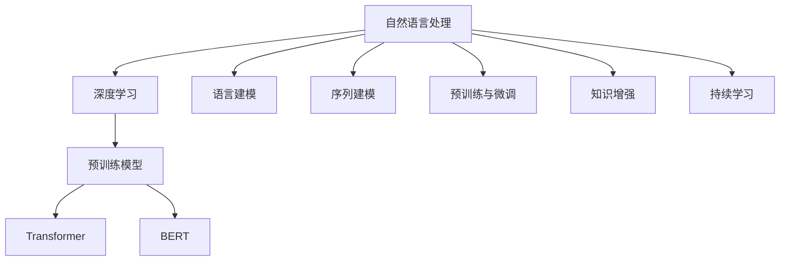

                 

# 自然语言处理（NLP）：AI语言理解技术

> 关键词：自然语言处理,语言理解,深度学习,预训练模型,Transformer,BERT,序列建模,语言表示

## 1. 背景介绍

### 1.1 问题由来
自然语言处理(Natural Language Processing, NLP)是人工智能(AI)领域中一个重要的分支，旨在使计算机能够理解、处理和生成人类语言。NLP技术在智能客服、机器翻译、情感分析、文本摘要等诸多应用领域中已广泛应用，极大地提升了信息处理的自动化水平和用户体验。然而，传统的基于规则和统计模型的NLP方法，难以有效地处理语言中的复杂语义和上下文关联。因此，基于深度学习的NLP方法应运而生，尤其是Transformer和BERT等预训练大模型的出现，极大地推动了语言理解技术的进步。

近年来，深度学习技术在图像识别、语音识别等领域取得了显著进展，而自然语言处理则成为AI技术最具挑战性和前景的领域之一。尤其是Transformer模型及其预训练大模型BERT、GPT等，通过在大规模无标签文本数据上进行自监督学习，学习到丰富的语言知识，并在下游任务上进行微调，大大提升了模型的语言理解能力。这些大模型的出现，使得NLP技术的落地应用变得更加高效、灵活和准确。

### 1.2 问题核心关键点
NLP技术的核心在于如何使计算机能够理解语言的复杂性和多样性，进而实现语言的生成、理解、分析和应用。NLP中的主要任务包括文本分类、命名实体识别、情感分析、机器翻译、对话系统等，这些任务本质上是将文本信息转化为计算机能够处理的形式，并通过深度学习模型进行分析和推理。

实现NLP任务的关键在于：
- **语言建模**：通过自监督学习任务（如语言模型预测任务）学习语言的概率分布，捕捉语言的统计规律。
- **序列建模**：利用Transformer等模型，捕捉序列数据中的长距离依赖关系，提高模型对上下文语境的理解能力。
- **预训练与微调**：在预训练大模型的基础上，通过有监督微调任务优化模型，使其在特定任务上获得更好的性能。
- **知识增强**：结合领域知识、知识图谱等，增强模型的领域专长，提升推理能力。
- **持续学习**：使模型能够不断从新数据中学习，保持对新知识的学习能力和适应性。

这些关键点共同构成了NLP技术的核心框架，使得计算机能够通过深度学习模型理解并生成人类语言。

## 2. 核心概念与联系

### 2.1 核心概念概述

为更好地理解NLP的核心技术和方法，本节将介绍几个关键概念：

- **自然语言处理**：利用计算机技术处理和理解人类语言，包括文本分析、情感分析、机器翻译、对话系统等。
- **深度学习**：基于神经网络的学习算法，通过多层次的特征提取和变换，实现对复杂数据的高效处理。
- **预训练模型**：在大规模无标签数据上进行自监督学习，学习到通用的语言表示，用于解决各种NLP任务。
- **Transformer**：一种用于处理序列数据的深度学习模型，通过自注意力机制捕捉序列中的长距离依赖关系。
- **BERT**：一种基于Transformer结构的预训练语言模型，通过掩码语言模型、下一句预测等任务进行预训练，学习到丰富的语言知识。

这些核心概念之间的逻辑关系可以通过以下Mermaid流程图来展示：



这个流程图展示了大语言模型的核心概念及其之间的关系：

1. 自然语言处理基于深度学习技术，利用预训练模型进行序列建模和语言理解。
2. 预训练模型通过大规模无标签数据进行自监督学习，学习到通用的语言表示。
3. Transformer模型和BERT模型分别在序列建模和语言表示学习中发挥重要作用。
4. 语言建模、序列建模、预训练与微调、知识增强和持续学习等关键技术共同构成了NLP的核心框架。

## 3. 核心算法原理 & 具体操作步骤
### 3.1 算法原理概述

NLP的核心算法原理主要涉及以下几个方面：

1. **语言建模**：通过预测序列中下一个词的概率分布，学习语言的统计规律。
2. **序列建模**：利用Transformer等模型，捕捉序列数据中的长距离依赖关系，提高模型对上下文语境的理解能力。
3. **预训练与微调**：在预训练大模型的基础上，通过有监督微调任务优化模型，使其在特定任务上获得更好的性能。
4. **知识增强**：结合领域知识、知识图谱等，增强模型的领域专长，提升推理能力。
5. **持续学习**：使模型能够不断从新数据中学习，保持对新知识的学习能力和适应性。

这些核心技术共同构成了NLP技术的核心框架，使得计算机能够通过深度学习模型理解并生成人类语言。

### 3.2 算法步骤详解

基于深度学习的NLP任务一般包括以下几个关键步骤：

**Step 1: 数据预处理**
- 收集和准备任务相关的文本数据，包括文本清洗、分词、去除停用词等预处理步骤。
- 将文本转换为模型所需的格式，如将句子转换为词向量序列。

**Step 2: 构建预训练模型**
- 选择合适的预训练模型，如BERT、GPT等。
- 加载预训练模型，并根据需要调整模型的超参数。

**Step 3: 微调模型**
- 收集下游任务的标注数据，并划分为训练集、验证集和测试集。
- 将预训练模型作为初始化参数，通过有监督学习优化模型在特定任务上的性能。
- 使用合适的优化器、学习率和正则化技术，确保模型在训练过程中稳定收敛。

**Step 4: 测试与评估**
- 在测试集上评估微调后模型的性能，对比微调前后的精度提升。
- 使用微调后的模型对新样本进行推理预测，集成到实际的应用系统中。
- 持续收集新的数据，定期重新微调模型，以适应数据分布的变化。

### 3.3 算法优缺点

深度学习在NLP领域的应用具有以下优点：

1. **高效处理复杂语言**：深度学习模型能够捕捉序列数据中的长距离依赖关系，从而更好地理解语言的语义和上下文。
2. **泛化能力强**：预训练模型在大规模数据上进行自监督学习，学习到通用的语言表示，能够适应多种NLP任务。
3. **快速迭代**：深度学习模型可以通过微调快速适应新的任务，大大缩短任务开发周期。
4. **可扩展性强**：深度学习模型可以通过增加模型深度和宽度来提高性能，满足不同规模任务的需求。

同时，深度学习在NLP领域的应用也存在一些局限性：

1. **数据依赖**：深度学习模型需要大量的标注数据进行微调，标注成本较高。
2. **过拟合风险**：深度学习模型容易过拟合，尤其是小样本数据时，需要通过正则化等技术进行控制。
3. **计算资源要求高**：深度学习模型参数量大，训练和推理需要高性能硬件支持。
4. **模型复杂度高**：深度学习模型的复杂度较高，难以理解和调试。
5. **缺乏可解释性**：深度学习模型通常被认为是"黑盒"模型，难以解释其内部工作机制和决策逻辑。

尽管存在这些局限性，但深度学习在NLP领域的应用已取得了显著成果，未来仍有很大的发展空间。

### 3.4 算法应用领域

基于深度学习的NLP技术已经广泛应用于各种领域，例如：

- **文本分类**：如情感分析、主题分类、意图识别等。通过微调使模型学习文本-标签映射。
- **命名实体识别**：识别文本中的人名、地名、机构名等特定实体。通过微调使模型掌握实体边界和类型。
- **关系抽取**：从文本中抽取实体之间的语义关系。通过微调使模型学习实体-关系三元组。
- **问答系统**：对自然语言问题给出答案。将问题-答案对作为微调数据，训练模型学习匹配答案。
- **机器翻译**：将源语言文本翻译成目标语言。通过微调使模型学习语言-语言映射。
- **文本摘要**：将长文本压缩成简短摘要。将文章-摘要对作为微调数据，使模型学习抓取要点。
- **对话系统**：使机器能够与人自然对话。将多轮对话历史作为上下文，微调模型进行回复生成。

除了上述这些经典任务外，深度学习技术还被创新性地应用到更多场景中，如可控文本生成、常识推理、代码生成、数据增强等，为NLP技术带来了全新的突破。

## 4. 数学模型和公式 & 详细讲解  
### 4.1 数学模型构建

NLP中的数学模型主要涉及以下几个方面：

- **词向量表示**：通过将单词映射到高维向量空间中，捕捉单词之间的语义关系。
- **语言模型**：通过预测序列中下一个词的概率分布，学习语言的统计规律。
- **序列建模**：利用Transformer等模型，捕捉序列数据中的长距离依赖关系，提高模型对上下文语境的理解能力。

假设文本序列为 $x = (x_1, x_2, ..., x_T)$，其中 $x_t$ 表示第 $t$ 个词，$T$ 表示序列长度。我们定义序列 $x$ 的词向量表示为 $X = [\vec{x}_1, \vec{x}_2, ..., \vec{x}_T]$，其中 $\vec{x}_t$ 表示第 $t$ 个词的词向量。

定义 $x$ 的条件概率分布为 $p(x|y)$，其中 $y$ 为序列标签，例如分类任务的类别标签。

### 4.2 公式推导过程

以下我们以文本分类任务为例，推导交叉熵损失函数及其梯度的计算公式。

假设模型 $M_{\theta}$ 在输入 $x$ 上的输出为 $\hat{y}=M_{\theta}(x) \in [0,1]$，表示样本属于正类的概率。真实标签 $y \in \{0,1\}$。则二分类交叉熵损失函数定义为：

$$
\ell(M_{\theta}(x),y) = -[y\log \hat{y} + (1-y)\log (1-\hat{y})]
$$

将其代入条件概率分布 $p(x|y)$ 的定义中，得：

$$
p(x|y) = \frac{e^{\ell(M_{\theta}(x),y)}}{\sum_{y'} e^{\ell(M_{\theta}(x),y')}}
$$

在训练过程中，我们希望最大化似然函数 $L = \log p(x|y)$，即最小化损失函数 $L = -\ell(M_{\theta}(x),y)$。

根据链式法则，损失函数对参数 $\theta_k$ 的梯度为：

$$
\frac{\partial \ell(M_{\theta}(x),y)}{\partial \theta_k} = -\frac{\partial \log p(x|y)}{\partial \theta_k} = -\frac{1}{p(x|y)} \frac{\partial p(x|y)}{\partial \theta_k} \frac{\partial \ell(M_{\theta}(x),y)}{\partial p(x|y)}
$$

在得到损失函数的梯度后，即可带入参数更新公式，完成模型的迭代优化。重复上述过程直至收敛，最终得到适应下游任务的最优模型参数 $\theta^*$。

### 4.3 案例分析与讲解

以BERT模型为例，BERT模型通过掩码语言模型和下一句预测任务进行预训练，学习到丰富的语言知识。在文本分类任务中，我们可以使用BERT模型作为预训练模型，通过微调任务优化模型，使其在特定分类任务上获得更好的性能。

假设微调任务为情感分类，将标注数据集 $D=\{(x_i,y_i)\}_{i=1}^N, x_i \in \mathbb{R}^d, y_i \in \{0,1\}$，其中 $d$ 为词向量维度。

定义模型的预测输出为 $\hat{y}=M_{\theta}(x)$，则交叉熵损失函数为：

$$
\mathcal{L}(\theta) = -\frac{1}{N} \sum_{i=1}^N [y_i \log \hat{y_i} + (1-y_i) \log (1-\hat{y_i})]
$$

在得到损失函数的梯度后，带入参数更新公式，完成模型的迭代优化。具体实现代码如下：

```python
import torch
import torch.nn as nn
import torch.optim as optim
from transformers import BertModel, BertTokenizer

# 构建模型
model = BertModel.from_pretrained('bert-base-uncased')
tokenizer = BertTokenizer.from_pretrained('bert-base-uncased')

# 加载数据
inputs = tokenizer.encode('Hello, my dog is cute', return_tensors='pt')
labels = torch.tensor([1]).to(model.device)

# 定义损失函数和优化器
loss_fn = nn.CrossEntropyLoss()
optimizer = optim.Adam(model.parameters(), lr=2e-5)

# 训练过程
for epoch in range(3):
    optimizer.zero_grad()
    outputs = model(inputs)
    loss = loss_fn(outputs, labels)
    loss.backward()
    optimizer.step()

    if epoch == 0:
        print(f'Epoch {epoch+1}, loss: {loss.item()}')
```

在实际应用中，我们还需要考虑更多的优化策略，如学习率调整、正则化、梯度累积等，以提高模型的稳定性和收敛速度。

## 5. 项目实践：代码实例和详细解释说明
### 5.1 开发环境搭建

在进行NLP项目实践前，我们需要准备好开发环境。以下是使用Python进行PyTorch开发的环境配置流程：

1. 安装Anaconda：从官网下载并安装Anaconda，用于创建独立的Python环境。

2. 创建并激活虚拟环境：
```bash
conda create -n pytorch-env python=3.8 
conda activate pytorch-env
```

3. 安装PyTorch：根据CUDA版本，从官网获取对应的安装命令。例如：
```bash
conda install pytorch torchvision torchaudio cudatoolkit=11.1 -c pytorch -c conda-forge
```

4. 安装Transformer库：
```bash
pip install transformers
```

5. 安装各类工具包：
```bash
pip install numpy pandas scikit-learn matplotlib tqdm jupyter notebook ipython
```

完成上述步骤后，即可在`pytorch-env`环境中开始NLP项目实践。

### 5.2 源代码详细实现

这里我们以情感分类任务为例，给出使用Transformer库对BERT模型进行微调的PyTorch代码实现。

首先，定义数据处理函数：

```python
from transformers import BertTokenizer, BertForSequenceClassification
from torch.utils.data import Dataset, DataLoader
import torch

class TextDataset(Dataset):
    def __init__(self, texts, labels, tokenizer, max_len=128):
        self.texts = texts
        self.labels = labels
        self.tokenizer = tokenizer
        self.max_len = max_len
        
    def __len__(self):
        return len(self.texts)
    
    def __getitem__(self, item):
        text = self.texts[item]
        label = self.labels[item]
        
        encoding = self.tokenizer(text, return_tensors='pt', max_length=self.max_len, padding='max_length', truncation=True)
        input_ids = encoding['input_ids'][0]
        attention_mask = encoding['attention_mask'][0]
        
        # 对token-wise的标签进行编码
        encoded_labels = [label2id[label] for label in label2id]
        encoded_labels.extend([label2id['O']] * (self.max_len - len(encoded_labels)))
        labels = torch.tensor(encoded_labels, dtype=torch.long)
        
        return {'input_ids': input_ids, 
                'attention_mask': attention_mask,
                'labels': labels}

# 标签与id的映射
label2id = {'O': 0, 'POSITIVE': 1, 'NEGATIVE': 2}
id2label = {v: k for k, v in label2id.items()}

# 创建dataset
tokenizer = BertTokenizer.from_pretrained('bert-base-uncased')

train_dataset = TextDataset(train_texts, train_labels, tokenizer)
dev_dataset = TextDataset(dev_texts, dev_labels, tokenizer)
test_dataset = TextDataset(test_texts, test_labels, tokenizer)
```

然后，定义模型和优化器：

```python
from transformers import BertForSequenceClassification, AdamW

model = BertForSequenceClassification.from_pretrained('bert-base-uncased', num_labels=len(label2id))

optimizer = AdamW(model.parameters(), lr=2e-5)
```

接着，定义训练和评估函数：

```python
from torch.utils.data import DataLoader
from tqdm import tqdm
from sklearn.metrics import classification_report

device = torch.device('cuda') if torch.cuda.is_available() else torch.device('cpu')
model.to(device)

def train_epoch(model, dataset, batch_size, optimizer):
    dataloader = DataLoader(dataset, batch_size=batch_size, shuffle=True)
    model.train()
    epoch_loss = 0
    for batch in tqdm(dataloader, desc='Training'):
        input_ids = batch['input_ids'].to(device)
        attention_mask = batch['attention_mask'].to(device)
        labels = batch['labels'].to(device)
        model.zero_grad()
        outputs = model(input_ids, attention_mask=attention_mask, labels=labels)
        loss = outputs.loss
        epoch_loss += loss.item()
        loss.backward()
        optimizer.step()
    return epoch_loss / len(dataloader)

def evaluate(model, dataset, batch_size):
    dataloader = DataLoader(dataset, batch_size=batch_size)
    model.eval()
    preds, labels = [], []
    with torch.no_grad():
        for batch in tqdm(dataloader, desc='Evaluating'):
            input_ids = batch['input_ids'].to(device)
            attention_mask = batch['attention_mask'].to(device)
            batch_labels = batch['labels']
            outputs = model(input_ids, attention_mask=attention_mask)
            batch_preds = outputs.logits.argmax(dim=2).to('cpu').tolist()
            batch_labels = batch_labels.to('cpu').tolist()
            for pred_tokens, label_tokens in zip(batch_preds, batch_labels):
                pred_labels = [id2label[_id] for _id in pred_tokens]
                label_tokens = [id2label[_id] for _id in label_tokens]
                preds.append(pred_labels[:len(label_tokens)])
                labels.append(label_tokens)
                
    print(classification_report(labels, preds))
```

最后，启动训练流程并在测试集上评估：

```python
epochs = 5
batch_size = 16

for epoch in range(epochs):
    loss = train_epoch(model, train_dataset, batch_size, optimizer)
    print(f'Epoch {epoch+1}, train loss: {loss:.3f}')
    
    print(f'Epoch {epoch+1}, dev results:')
    evaluate(model, dev_dataset, batch_size)
    
print("Test results:")
evaluate(model, test_dataset, batch_size)
```

以上就是使用PyTorch对BERT进行情感分类任务微调的完整代码实现。可以看到，得益于Transformer库的强大封装，我们可以用相对简洁的代码完成BERT模型的加载和微调。

### 5.3 代码解读与分析

让我们再详细解读一下关键代码的实现细节：

**TextDataset类**：
- `__init__`方法：初始化文本、标签、分词器等关键组件。
- `__len__`方法：返回数据集的样本数量。
- `__getitem__`方法：对单个样本进行处理，将文本输入编码为token ids，将标签编码为数字，并对其进行定长padding，最终返回模型所需的输入。

**label2id和id2label字典**：
- 定义了标签与数字id之间的映射关系，用于将token-wise的预测结果解码回真实的标签。

**训练和评估函数**：
- 使用PyTorch的DataLoader对数据集进行批次化加载，供模型训练和推理使用。
- 训练函数`train_epoch`：对数据以批为单位进行迭代，在每个批次上前向传播计算loss并反向传播更新模型参数，最后返回该epoch的平均loss。
- 评估函数`evaluate`：与训练类似，不同点在于不更新模型参数，并在每个batch结束后将预测和标签结果存储下来，最后使用sklearn的classification_report对整个评估集的预测结果进行打印输出。

**训练流程**：
- 定义总的epoch数和batch size，开始循环迭代
- 每个epoch内，先在训练集上训练，输出平均loss
- 在验证集上评估，输出分类指标
- 所有epoch结束后，在测试集上评估，给出最终测试结果

可以看到，PyTorch配合Transformer库使得BERT微调的代码实现变得简洁高效。开发者可以将更多精力放在数据处理、模型改进等高层逻辑上，而不必过多关注底层的实现细节。

当然，工业级的系统实现还需考虑更多因素，如模型的保存和部署、超参数的自动搜索、更灵活的任务适配层等。但核心的微调范式基本与此类似。

## 6. 实际应用场景
### 6.1 智能客服系统

基于NLP技术的智能客服系统可以极大地提升客服效率和用户体验。传统客服系统依赖人力，无法24小时服务，且容易出现机械化回答。使用NLP技术，可以将客服系统升级为智能客服，通过自然语言理解和生成技术，自动解答用户问题，提供个性化服务。

在技术实现上，可以收集企业内部的客服对话记录，构建客服问答对，用于微调预训练语言模型。微调后的模型能够自动理解用户意图，匹配最合适的答案模板进行回复。对于客户提出的新问题，还可以接入检索系统实时搜索相关内容，动态组织生成回答。如此构建的智能客服系统，能够显著提高客户咨询体验和问题解决效率。

### 6.2 金融舆情监测

金融行业需要实时监测市场舆论动向，以便及时应对负面信息传播，规避金融风险。传统的舆情监测方法依赖人工，成本高、效率低，难以应对海量信息爆发的挑战。使用NLP技术，可以将舆情监测系统升级为智能舆情监测，通过自然语言处理技术，自动识别和分类金融舆情，实时预警潜在风险。

具体而言，可以收集金融领域相关的新闻、报道、评论等文本数据，并对其进行主题标注和情感标注。在此基础上对预训练语言模型进行微调，使其能够自动判断文本属于何种主题，情感倾向是正面、中性还是负面。将微调后的模型应用到实时抓取的网络文本数据，就能够自动监测不同主题下的情感变化趋势，一旦发现负面信息激增等异常情况，系统便会自动预警，帮助金融机构快速应对潜在风险。

### 6.3 个性化推荐系统

当前的推荐系统往往只依赖用户的历史行为数据进行物品推荐，无法深入理解用户的真实兴趣偏好。使用NLP技术，可以将推荐系统升级为个性化推荐系统，通过自然语言处理技术，深入挖掘用户兴趣，提供更精准、多样的推荐内容。

在实践中，可以收集用户浏览、点击、评论、分享等行为数据，提取和用户交互的物品标题、描述、标签等文本内容。将文本内容作为模型输入，用户的后续行为（如是否点击、购买等）作为监督信号，在此基础上微调预训练语言模型。微调后的模型能够从文本内容中准确把握用户的兴趣点。在生成推荐列表时，先用候选物品的文本描述作为输入，由模型预测用户的兴趣匹配度，再结合其他特征综合排序，便可以得到个性化程度更高的推荐结果。

### 6.4 未来应用展望

随着NLP技术的不断进步，未来的应用场景将更加丰富和多样化。以下是几个可能的应用方向：

1. **医疗领域**：通过自然语言处理技术，构建智能医疗问答系统、电子病历摘要系统、药物研发辅助系统等，提升医疗服务的智能化水平。

2. **教育领域**：通过自然语言处理技术，构建智能教育辅助系统，如智能作业批改、学情分析、知识推荐等，因材施教，促进教育公平，提高教学质量。

3. **法律领域**：通过自然语言处理技术，构建智能法律文本分析系统，如合同审核、法条推荐等，提高法律服务的智能化水平。

4. **政府治理**：通过自然语言处理技术，构建智能政府服务平台，如智能客服、舆情监测、应急指挥等，提高政府管理的自动化和智能化水平。

5. **智能媒体**：通过自然语言处理技术，构建智能媒体推荐系统，如新闻推荐、短视频推荐等，提升媒体内容的个性化和智能化水平。

6. **智能家居**：通过自然语言处理技术，构建智能家居语音助手、智能家居控制等，提升家居生活的智能化水平。

7. **智能交通**：通过自然语言处理技术，构建智能交通语音助手、智能交通指挥等，提高交通管理的智能化水平。

这些应用场景展示了NLP技术的广泛应用前景，未来随着技术的不断进步，NLP技术将在更多领域发挥重要作用，带来深远影响。

## 7. 工具和资源推荐
### 7.1 学习资源推荐

为了帮助开发者系统掌握NLP的理论基础和实践技巧，这里推荐一些优质的学习资源：

1. **《Natural Language Processing with Python》书籍**：由Python专家提供，全面介绍NLP中的主要技术和算法，包括文本处理、词向量表示、语言模型、序列建模、机器翻译等。

2. **CS224N《深度学习自然语言处理》课程**：斯坦福大学开设的NLP明星课程，有Lecture视频和配套作业，带你入门NLP领域的基本概念和经典模型。

3. **《Attention Is All You Need》论文**：提出Transformer模型，开启了NLP领域的预训练大模型时代。

4. **《BERT: Pre-training of Deep Bidirectional Transformers for Language Understanding》论文**：提出BERT模型，引入基于掩码的自监督预训练任务，学习到丰富的语言知识。

5. **《Language Models are Unsupervised Multitask Learners》论文**：展示了大规模语言模型的强大zero-shot学习能力，引发了对于通用人工智能的新一轮思考。

6. **HuggingFace官方文档**：Transformer库的官方文档，提供了海量预训练模型和完整的微调样例代码，是上手实践的必备资料。

通过对这些资源的学习实践，相信你一定能够快速掌握NLP技术的精髓，并用于解决实际的NLP问题。

### 7.2 开发工具推荐

高效的开发离不开优秀的工具支持。以下是几款用于NLP项目开发的常用工具：

1. **PyTorch**：基于Python的开源深度学习框架，灵活动态的计算图，适合快速迭代研究。大部分预训练语言模型都有PyTorch版本的实现。

2. **TensorFlow**：由Google主导开发的开源深度学习框架，生产部署方便，适合大规模工程应用。同样有丰富的预训练语言模型资源。

3. **Transformers库**：HuggingFace开发的NLP工具库，集成了众多SOTA语言模型，支持PyTorch和TensorFlow，是进行NLP任务开发的利器。

4. **Weights & Biases**：模型训练的实验跟踪工具，可以记录和可视化模型训练过程中的各项指标，方便对比和调优。与主流深度学习框架无缝集成。

5. **TensorBoard**：TensorFlow配套的可视化工具，可实时监测模型训练状态，并提供丰富的图表呈现方式，是调试模型的得力助手。

6. **Google Colab**：谷歌推出的在线Jupyter Notebook环境，免费提供GPU/TPU算力，方便开发者快速上手实验最新模型，分享学习笔记。

合理利用这些工具，可以显著提升NLP项目开发效率，加快创新迭代的步伐。

### 7.3 相关论文推荐

NLP技术的发展源于学界的持续研究。以下是几篇奠基性的相关论文，推荐阅读：

1. **Attention is All You Need**：提出Transformer模型，开启了NLP领域的预训练大模型时代。

2. **BERT: Pre-training of Deep Bidirectional Transformers for Language Understanding**：提出BERT模型，引入基于掩码的自监督预训练任务，学习到丰富的语言知识。

3. **Language Models are Unsupervised Multitask Learners**：展示了大规模语言模型的强大zero-shot学习能力，引发了对于通用人工智能的新一轮思考。

4. **Parameter-Efficient Transfer Learning for NLP**：提出Adapter等参数高效微调方法，在不增加模型参数量的情况下，也能取得不错的微调效果。

5. **Prompt-based Learning**：引入基于连续型Prompt的微调范式，为如何充分利用预训练知识提供了新的思路。

6. **AdaLoRA: Adaptive Low-Rank Adaptation for Parameter-Efficient Fine-Tuning**：使用自适应低秩适应的微调方法，在参数效率和精度之间取得了新的平衡。

这些论文代表了大语言模型微调技术的发展脉络。通过学习这些前沿成果，可以帮助研究者把握学科前进方向，激发更多的创新灵感。

## 8. 总结：未来发展趋势与挑战
### 8.1 总结

本文对NLP技术的核心算法原理和操作步骤进行了全面系统的介绍。首先阐述了NLP技术的背景和意义，明确了语言模型、序列建模、预训练与微调等核心概念的逻辑关系。其次，从原理到实践，详细讲解了语言建模、序列建模、预训练与微调、知识增强、持续学习等关键技术，并给出了完整的代码实例。最后，探讨了NLP技术在智能客服、金融舆情监测、个性化推荐等领域的广泛应用，展示了NLP技术的广阔前景。

通过本文的系统梳理，可以看到，NLP技术正在成为AI技术的重要分支，极大地提升了信息处理的自动化水平和用户体验。未来，伴随深度学习技术的发展，NLP技术将进一步拓展其应用范围，提升人类与计算机之间的交互能力，构建更加智能化、普适化的社会。

### 8.2 未来发展趋势

展望未来，NLP技术将呈现以下几个发展趋势：

1. **模型规模持续增大**：随着算力成本的下降和数据规模的扩张，预训练语言模型的参数量还将持续增长。超大规模语言模型蕴含的丰富语言知识，有望支撑更加复杂多变的下游任务。

2. **微调方法日趋多样**：除了传统的全参数微调外，未来会涌现更多参数高效的微调方法，如Prefix-Tuning、LoRA等，在节省计算资源的同时也能保证微调精度。

3. **持续学习成为常态**：随着数据分布的不断变化，微调模型也需要持续学习新知识以保持性能。如何在不遗忘原有知识的同时，高效吸收新样本信息，将成为重要的研究课题。

4. **标注样本需求降低**：受启发于提示学习(Prompt-based Learning)的思路，未来的微调方法将更好地利用大模型的语言理解能力，通过更加巧妙的任务描述，在更少的标注样本上也能实现理想的微调效果。

5. **多模态微调崛起**：当前的微调主要聚焦于纯文本数据，未来会进一步拓展到图像、视频、语音等多模态数据微调。多模态信息的融合，将显著提升语言模型对现实世界的理解和建模能力。

6. **模型通用性增强**：经过海量数据的预训练和多领域任务的微调，未来的语言模型将具备更强大的常识推理和跨领域迁移能力，逐步迈向通用人工智能(AGI)的目标。

以上趋势凸显了NLP技术的广阔前景。这些方向的探索发展，必将进一步提升NLP系统的性能和应用范围，为人类认知智能的进化带来深远影响。

### 8.3 面临的挑战

尽管NLP技术已经取得了显著成果，但在迈向更加智能化、普适化应用的过程中，它仍面临诸多挑战：

1. **数据依赖**：深度学习模型需要大量的标注数据进行微调，标注成本较高。对于长尾应用场景，难以获得充足的高质量标注数据，成为制约微调性能的瓶颈。

2. **模型鲁棒性不足**：当前NLP模型面对域外数据时，泛化性能往往大打折扣。对于测试样本的微小扰动，模型也容易发生波动。

3. **推理效率有待提高**：大规模语言模型虽然精度高，但在实际部署时往往面临推理速度慢、内存占用大等效率问题。

4. **可解释性亟需加强**：NLP模型通常被认为是"黑盒"模型，难以解释其内部工作机制和决策逻辑。这对于医疗、金融等高风险应用，算法的可解释性和可审计性尤为重要。

5. **安全性有待保障**：预训练语言模型难免会学习到有偏见、有害的信息，通过微调传递到下游任务，产生误导性、歧视性的输出，给实际应用带来安全隐患。

6. **知识整合能力不足**：现有的NLP模型往往局限于任务内数据，难以灵活吸收和运用更广泛的先验知识。

正视NLP面临的这些挑战，积极应对并寻求突破，将使NLP技术走向成熟。未来需要在数据、算法、工程、业务等多个维度进行全面优化，才能真正实现人工智能技术在垂直行业的规模化落地。

### 8.4 研究展望

面向未来，NLP技术的研究方向可以从以下几个方面进行探索：

1. **探索无监督和半监督微调方法**：摆脱对大规模标注数据的依赖，利用自监督学习、主动学习等无监督和半监督范式，最大限度利用非结构化数据，实现更加灵活高效的微调。

2. **研究参数高效和计算高效的微调范式**：开发更加参数高效的微调方法，在固定大部分预训练参数的同时，只更新极少量的任务相关参数。同时优化微调模型的计算图，减少前向传播和反向传播的资源消耗，实现更加轻量级、实时性的部署。

3. **融合因果和对比学习范式**：通过引入因果推断和对比学习思想，增强NLP模型建立稳定因果关系的能力，学习更加普适、鲁棒的语言表征，从而提升模型泛化性和抗干扰能力。

4. **结合因果分析和博弈论工具**：将因果分析方法引入NLP模型，识别出模型决策的关键特征，增强输出解释的因果性和逻辑性。借助博弈论工具刻画人机交互过程，主动探索并规避模型的脆弱点，提高系统稳定性。

5. **纳入伦理道德约束**：在模型训练目标中引入伦理导向的评估指标，过滤和惩罚有偏见、有害的输出倾向。同时加强人工干预和审核，建立模型行为的监管机制，确保输出符合人类价值观和伦理道德。

这些研究方向展示了NLP技术的未来发展潜力。通过在这些领域的持续探索，NLP技术有望取得更大的突破，推动AI技术的全面发展。

## 9. 附录：常见问题与解答

**Q1：NLP技术如何实现语音识别和语音合成？**

A: NLP技术主要用于文本处理和理解，语音识别和语音合成更多依赖声学模型和语音模型。语音识别技术通过将语音信号转换为文本，再应用NLP技术进行处理。语音合成技术则通过NLP技术生成文本，再转换为语音信号。当前NLP技术与声学模型和语音模型的结合，已经取得了显著进展。

**Q2：NLP技术能否应用于可视化数据处理？**

A: NLP技术主要用于文本处理和理解，与可视化数据处理结合需要一定的技术手段。例如，可以应用NLP技术自动提取数据中的关键信息，生成可视化标签或描述，辅助用户理解数据。但直接对可视化数据进行NLP处理，效果可能不佳。

**Q3：NLP技术如何应用于游戏开发？**

A: NLP技术在游戏开发中主要应用于自然语言对话系统、NPC生成对话、游戏文本生成等方面。通过应用NLP技术，可以构建更加智能、灵活的对话系统，提升游戏的用户体验。同时，NLP技术还可以生成游戏内的文本内容，如任务描述、提示信息等，增强游戏的互动性和趣味性。

**Q4：NLP技术如何应用于医学领域？**

A: NLP技术在医学领域主要应用于医学文本的自动处理、医疗问答、病历摘要、诊断建议等方面。通过应用NLP技术，可以自动提取医学文本中的关键信息，生成医学摘要，辅助医生进行诊断和治疗。同时，NLP技术还可以用于构建医学问答系统，帮助患者快速获取医疗信息。

**Q5：NLP技术如何应用于金融领域？**

A: NLP技术在金融领域主要应用于金融舆情监测、金融问答、金融文本生成等方面。通过应用NLP技术，可以实时监测金融舆情，及时预警潜在风险。同时，NLP技术还可以用于构建金融问答系统，帮助用户快速获取金融信息。

通过以上问题的解答，可以看出NLP技术在多个领域的广泛应用前景。随着技术的不断进步，NLP技术将在更多领域发挥重要作用，带来深远影响。相信未来，NLP技术将在构建人机协同的智能社会中扮演越来越重要的角色。

---

作者：禅与计算机程序设计艺术 / Zen and the Art of Computer Programming

