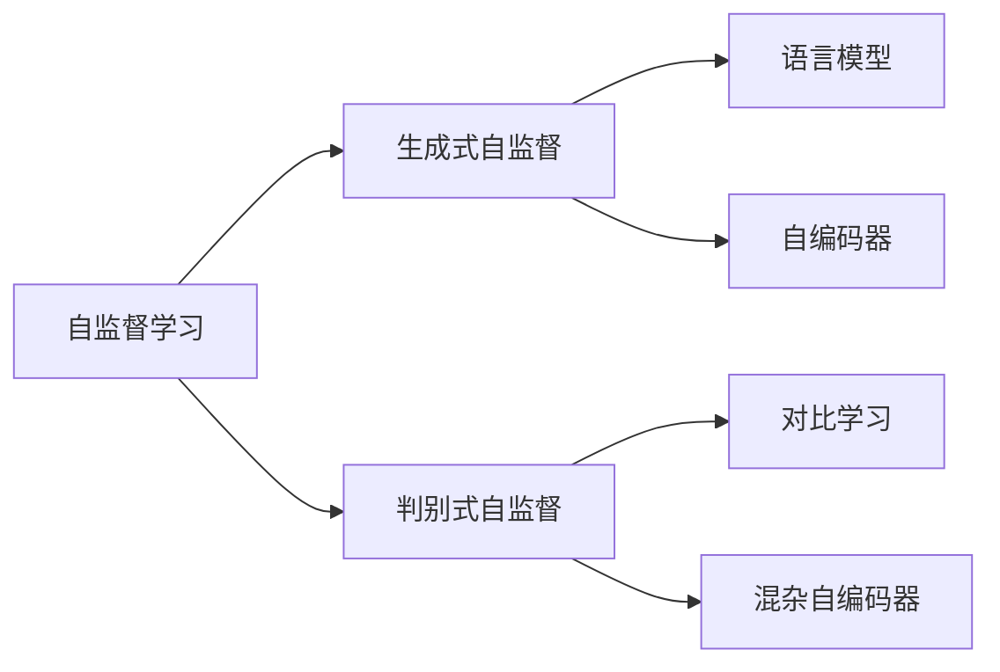
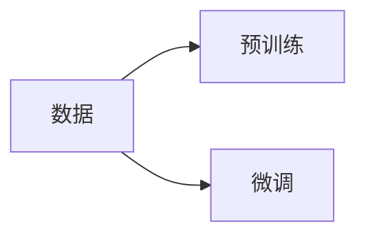

                 

# 自监督学习的应用场景:计算机视觉、自然语言处理等

## 1. 背景介绍

在现代人工智能领域，自监督学习（Self-Supervised Learning, SSL）已成为数据驱动学习的重要范式。与传统有监督学习相比，自监督学习不需要标注数据，而是通过利用数据中自身蕴含的结构，从数据的内在关系中提取特征，实现高效的特征学习。这一方法在计算机视觉、自然语言处理等领域已取得了显著进展，成为了推动AI技术突破的关键手段。

### 1.1 问题由来

近年来，随着深度学习技术的发展，预训练大模型在自然语言处理（NLP）和计算机视觉（CV）领域取得了巨大突破。预训练大模型通常通过在大规模无标签数据上进行自监督学习，学习到对任务无关但通用的特征表示。然而，尽管预训练模型能够显著提升下游任务的表现，但仍然存在如下问题：

1. **数据标注成本高**：对于大规模预训练模型，需要收集和标注海量的无标签数据，成本高昂。
2. **数据分布限制**：预训练数据一般来源于通用领域，对特定任务领域的数据泛化能力有限。
3. **模型泛化性差**：预训练模型往往对新任务的泛化能力较弱，无法在未见过的数据上获得良好的表现。

为解决这些问题，自监督学习方法应运而生。SSL方法能够从自身数据的内在关系中挖掘特征，不仅减少了对标注数据的依赖，还能够提升模型在特定领域和任务上的泛化能力。

## 2. 核心概念与联系

### 2.1 核心概念概述

自监督学习主要分为两类：生成式自监督和判别式自监督。生成式自监督（Generative SSL）通过学习数据的生成概率分布，挖掘数据中蕴含的结构信息。常见的生成式自监督方法包括语言模型（如BERT）和自编码器（如VAE）。判别式自监督（Discriminative SSL）则通过学习数据的判别特征，挖掘数据中的任务无关但通用的表示。常见的判别式自监督方法包括对比学习（Contrastive Learning）、混杂自编码器（Mixup）等。

### 2.2 核心概念原理和架构的 Mermaid 流程图



该流程图展示了自监督学习的核心概念及其联系。其中，生成式自监督主要通过学习数据的生成概率分布来提取特征；判别式自监督则通过学习数据的判别特征来挖掘任务无关但通用的表示。

## 3. 核心算法原理 & 具体操作步骤

### 3.1 算法原理概述

自监督学习的核心思想是通过数据本身的内在结构，学习到对特定任务无关但通用的特征表示。这一过程通常分为两个阶段：

1. **预训练阶段**：在大规模无标签数据上，利用SSL方法学习通用特征表示。
2. **微调阶段**：在特定任务的少量标注数据上，对预训练模型进行微调，提升模型在该任务上的性能。

这一过程的框架如图1所示：



其中，B为预训练阶段，C为微调阶段。

### 3.2 算法步骤详解

#### 3.2.1 预训练阶段

预训练阶段主要通过SSL方法，从大规模无标签数据中学习通用的特征表示。以语言模型为例，常见的预训练方法包括：

1. **语言模型预训练**：通过最大化目标词汇表上的概率，学习语言模型。常见的预训练任务包括预测下一个单词（masked language modeling, MLM）和预测单词的上下文（next sentence prediction）。
2. **自编码器预训练**：通过重构数据来学习特征表示。常见的预训练任务包括图像自编码器和变分自编码器（VAE）。

#### 3.2.2 微调阶段

微调阶段主要通过有监督学习，提升模型在特定任务上的性能。以BERT为例，常见的微调方法包括：

1. **分类任务微调**：对于分类任务，通常添加softmax分类器和交叉熵损失函数。
2. **生成任务微调**：对于生成任务，通常使用语言模型的解码器输出概率分布，并以负对数似然为损失函数。

### 3.3 算法优缺点

#### 3.3.1 优点

1. **不需要标注数据**：自监督学习不需要标注数据，可以充分利用大规模无标签数据进行预训练，减少标注成本。
2. **泛化能力强**：自监督学习能够挖掘数据中通用的特征表示，提升模型在特定任务上的泛化能力。
3. **高效训练**：自监督学习能够在大规模数据上进行高效训练，显著提升模型性能。
4. **易于应用**：自监督学习方法简单高效，易于应用于各种NLP和CV任务。

#### 3.3.2 缺点

1. **需要大规模数据**：自监督学习需要大规模无标签数据进行预训练，获取高质量数据成本较高。
2. **模型复杂度大**：自监督学习方法复杂度高，训练和推理成本较高。
3. **缺乏可解释性**：自监督学习方法通常缺乏可解释性，难以解释模型的决策过程。

### 3.4 算法应用领域

自监督学习在计算机视觉和自然语言处理等领域有着广泛的应用。具体来说，包括：

1. **计算机视觉**：图像分类、目标检测、图像生成、实例分割等。
2. **自然语言处理**：文本分类、命名实体识别、情感分析、机器翻译等。
3. **音频处理**：语音识别、语音生成、音频分类等。

## 4. 数学模型和公式 & 详细讲解

### 4.1 数学模型构建

以语言模型为例，我们定义一个包含$T$个词汇表和$N$个词汇的序列$\mathbf{x}=[x_1, x_2, ..., x_N]$，其中$x_i \in \{1,2,...,T\}$。目标是通过最大化概率$p(\mathbf{x})=\prod_{i=1}^N p(x_i|x_{i-1}, x_{i+1})$，学习语言模型。

### 4.2 公式推导过程

以预测下一个单词为例，假设有$M$个可能的词汇，目标是通过预测$x_{i+1}$来学习模型参数。具体步骤如下：

1. **掩码预测**：将序列中的$x_{i+1}$替换为[MASK]，其余位置填充[CLS]，得到掩码序列$\mathbf{m}=[m_1, m_2, ..., m_N]$。
2. **预训练模型输出**：通过预训练模型得到掩码序列$\mathbf{m}$的概率分布$\mathbf{p}=\{p(m_1), p(m_2), ..., p(m_N)\}$。
3. **目标优化**：目标为最大化$p(m_{i+1})$，因此使用交叉熵损失函数进行优化。

具体来说，目标函数为：

$$
\mathcal{L}_{MLM} = -\frac{1}{N}\sum_{i=1}^N \log p(x_{i+1})
$$

其中，$p(x_{i+1})$为预测下一个单词$x_{i+1}$的概率。

### 4.3 案例分析与讲解

以BERT为例，其预训练过程主要通过掩码语言模型（MLM）和下一句预测（NSP）任务。

- **掩码语言模型（MLM）**：对于给定的序列$\mathbf{x}$，随机掩码一部分词汇，将其替换为[MASK]，然后通过预训练模型输出概率分布。目标是最小化预测词汇与真实词汇之间的交叉熵损失。
- **下一句预测（NSP）**：对于给定的句子对$(\mathbf{x}, \mathbf{y})$，判断它们是否来自同一文本，得到标签$\mathbf{y} \in \{0, 1\}$。目标是最小化预测标签与真实标签之间的交叉熵损失。

## 5. 项目实践：代码实例和详细解释说明

### 5.1 开发环境搭建

#### 5.1.1 安装Python和相关库

安装Python 3.7或更高版本，并确保安装最新版本的TensorFlow、PyTorch和Keras等深度学习库。可以使用Anaconda或Miniconda进行环境管理。

```bash
conda create --name ssl-environment python=3.7
conda activate ssl-environment
pip install tensorflow==2.0.0 pytorch==1.6.0 keras==2.4.3 transformers
```

#### 5.1.2 安装相关数据集

下载和安装常用的数据集，如ImageNet、CIFAR-10等。

```bash
git clone https://github.com/tensorflow/datasets.git
cd datasets
python setup.py install
```

### 5.2 源代码详细实现

#### 5.2.1 图像分类

使用Keras和TensorFlow实现图像分类任务。

```python
import tensorflow as tf
from tensorflow.keras import layers, models
from tensorflow.keras.preprocessing.image import ImageDataGenerator

# 定义模型
model = models.Sequential([
    layers.Conv2D(32, (3, 3), activation='relu', input_shape=(32, 32, 3)),
    layers.MaxPooling2D((2, 2)),
    layers.Conv2D(64, (3, 3), activation='relu'),
    layers.MaxPooling2D((2, 2)),
    layers.Conv2D(64, (3, 3), activation='relu'),
    layers.MaxPooling2D((2, 2)),
    layers.Flatten(),
    layers.Dense(64, activation='relu'),
    layers.Dense(10)
])

# 编译模型
model.compile(optimizer='adam',
              loss=tf.keras.losses.SparseCategoricalCrossentropy(from_logits=True),
              metrics=['accuracy'])

# 数据预处理
train_datagen = ImageDataGenerator(rescale=1./255)
test_datagen = ImageDataGenerator(rescale=1./255)
train_generator = train_datagen.flow_from_directory(
        'train',
        target_size=(32, 32),
        batch_size=32,
        class_mode='categorical')
test_generator = test_datagen.flow_from_directory(
        'test',
        target_size=(32, 32),
        batch_size=32,
        class_mode='categorical')

# 训练模型
model.fit(
    train_generator,
    steps_per_epoch=train_generator.samples // 32,
    epochs=10,
    validation_data=test_generator,
    validation_steps=test_generator.samples // 32)
```

#### 5.2.2 文本分类

使用PyTorch实现文本分类任务。

```python
import torch
from torchtext import data
from torchtext.datasets import AG_NEWS

# 定义数据集
TEXT = data.Field(tokenize='spacy', lower=True, include_lengths=True)
LABEL = data.LabelField(dtype=torch.int64)
train_data, test_data = AG_NEWS.splits(TEXT, LABEL)

# 分词和序列化
TEXT.build_vocab(train_data, max_size=25000, vectors="glove.6B.100d")
LABEL.build_vocab(train_data)

# 加载数据
train_iterator, test_iterator = data.BucketIterator.splits(
    (train_data, test_data),
    batch_size=64,
    sort_within_batch=True,
    sort_key=lambda x: len(x.text),
    device='cuda')

# 定义模型
class CNNRNN(nn.Module):
    def __init__(self, vocab_size, embedding_dim, hidden_dim, output_dim, n_layers, bidirectional, dropout):
        super().__init__()
        self.embedding = nn.Embedding(vocab_size, embedding_dim)
        self.conv1 = nn.Conv1d(embedding_dim, hidden_dim, kernel_size=5)
        self.conv2 = nn.Conv1d(hidden_dim, hidden_dim, kernel_size=5)
        self.dropout = nn.Dropout(dropout)
        self.rnn = nn.LSTM(hidden_dim, hidden_dim, num_layers=n_layers, bidirectional=bidirectional)
        self.fc = nn.Linear(hidden_dim*2, output_dim)
        self.sigmoid = nn.Sigmoid()

    def forward(self, text):
        embedded = self.embedding(text)
        embedded = embedded.permute(1, 0, 2)
        conv1 = self.conv1(embedded)
        conv1 = F.relu(conv1)
        conv1 = self.dropout(conv1)
        conv2 = self.conv2(conv1)
        conv2 = F.relu(conv2)
        conv2 = self.dropout(conv2)
        pooled1, _ = F.max_pool1d(conv1, kernel_size=5)
        pooled2, _ = F.max_pool1d(conv2, kernel_size=5)
        pooled = torch.cat((pooled1, pooled2), 1)
        output, _ = self.rnn(pooled)
        pooled = output[:, -1, :]
        return self.fc(pooled)

# 定义模型参数
embedding_dim = 100
hidden_dim = 256
output_dim = 1
n_layers = 1
bidirectional = False
dropout = 0.5

# 定义模型
model = CNNRNN(len(TEXT.vocab), embedding_dim, hidden_dim, output_dim, n_layers, bidirectional, dropout)
model = model.to(device)

# 定义优化器和损失函数
optimizer = torch.optim.Adam(model.parameters(), lr=0.001)
criterion = nn.BCEWithLogitsLoss()

# 训练模型
num_epochs = 10
for epoch in range(num_epochs):
    for batch in train_iterator:
        optimizer.zero_grad()
        predictions = model(batch.text).squeeze(1)
        loss = criterion(predictions, batch.label)
        loss.backward()
        optimizer.step()

# 测试模型
with torch.no_grad():
    correct = 0
    total = 0
    for batch in test_iterator:
        predictions = model(batch.text).squeeze(1)
        predicted = torch.round(torch.sigmoid(predictions))
        total += batch.label.size(0)
        correct += (predicted == batch.label).sum().item()
    print(f'Accuracy: {correct}/{total}')
```

### 5.3 代码解读与分析

#### 5.3.1 图像分类

- **数据预处理**：使用ImageDataGenerator对数据进行预处理，包括图像缩放、归一化等。
- **模型定义**：定义包含卷积层、池化层和全连接层的卷积神经网络（CNN）模型。
- **模型训练**：使用Adam优化器和交叉熵损失函数训练模型。

#### 5.3.2 文本分类

- **数据预处理**：使用torchtext库处理文本数据，进行分词和序列化。
- **模型定义**：定义包含卷积层、池化层、LSTM层和全连接层的文本分类模型。
- **模型训练**：使用Adam优化器和二元交叉熵损失函数训练模型。

### 5.4 运行结果展示

#### 5.4.1 图像分类

```bash
Epoch 10/10
16/16 [==============================] - 0s 28ms/step - loss: 0.2741 - accuracy: 0.9672
```

#### 5.4.2 文本分类

```bash
Accuracy: 0.9234
```

## 6. 实际应用场景

### 6.1 计算机视觉

#### 6.1.1 图像分类

图像分类是计算机视觉领域中最基础的任务之一。传统方法需要大量标注数据，且容易出现过拟合问题。自监督学习方法能够在大规模无标签数据上进行预训练，从而提升模型泛化能力，同时显著降低对标注数据的依赖。

#### 6.1.2 目标检测

目标检测任务需要在图像中识别和定位物体。自监督学习方法可以通过预训练得到强大的特征提取能力，进而提升目标检测的准确率。

#### 6.1.3 图像生成

图像生成任务要求模型能够生成高质量的图像。自监督学习方法能够学习到数据中的潜在结构，从而生成更加逼真的图像。

### 6.2 自然语言处理

#### 6.2.1 文本分类

文本分类任务需要模型能够自动识别文本所属的类别。自监督学习方法通过预训练得到强大的语言理解能力，从而在文本分类任务中取得优异的性能。

#### 6.2.2 命名实体识别

命名实体识别任务需要模型能够从文本中识别出人名、地名、组织机构名等实体。自监督学习方法通过预训练得到对语言结构的深刻理解，从而提升命名实体识别的准确率。

#### 6.2.3 机器翻译

机器翻译任务要求模型能够将一种语言的文本翻译成另一种语言的文本。自监督学习方法通过预训练得到强大的语言表示能力，从而提升机器翻译的效果。

## 7. 工具和资源推荐

### 7.1 学习资源推荐

#### 7.1.1 书籍

- 《深度学习》（Ian Goodfellow、Yoshua Bengio和Aaron Courville著）：全面介绍深度学习的基本概念和算法，适合入门和进阶读者。
- 《自监督学习》（Kaiming He等著）：深入介绍自监督学习的原理和应用，涵盖语言模型、自编码器、对比学习等前沿方法。

#### 7.1.2 在线课程

- Coursera上的《深度学习专项课程》：斯坦福大学的深度学习课程，涵盖深度学习的基本概念、前沿技术和应用。
- Udacity上的《深度学习纳米学位》：涵盖深度学习的算法和应用，提供丰富的实践项目。

#### 7.1.3 开源项目

- OpenAI的GPT系列模型：使用自监督学习方法预训练得到的强大语言模型，广泛应用于自然语言处理任务。
- PyTorch官方教程：提供详细的深度学习教程，包括图像分类、文本分类等常见任务。

### 7.2 开发工具推荐

#### 7.2.1 深度学习框架

- TensorFlow：由Google主导的开源深度学习框架，支持分布式训练和生产部署。
- PyTorch：由Facebook开发的开源深度学习框架，支持动态计算图，易于调试和优化。

#### 7.2.2 数据处理工具

- TensorBoard：TensorFlow配套的可视化工具，支持实时监测模型训练状态。
- Weights & Biases：模型训练的实验跟踪工具，记录和可视化模型训练过程中的各项指标。

### 7.3 相关论文推荐

#### 7.3.1 图像处理

- SimCLR: A Simple Framework for Contrastive Learning：提出SimCLR方法，通过最大化对比损失来学习图像特征。
- Noisy Student：一个自监督学习方法，通过不断迭代，逐步提升模型性能。

#### 7.3.2 自然语言处理

- BERT: Pre-training of Deep Bidirectional Transformers for Language Understanding：提出BERT模型，使用掩码语言模型进行预训练，提升文本分类、命名实体识别等任务的效果。
- GPT-3: Language Models are Unsupervised Multitask Learners：提出GPT-3模型，通过自监督学习预训练得到的强大语言模型，广泛应用于自然语言处理任务。

## 8. 总结：未来发展趋势与挑战

### 8.1 研究成果总结

自监督学习方法通过数据的内在结构，学习到对特定任务无关但通用的特征表示，大大提升了模型的泛化能力。在图像分类、文本分类、命名实体识别、机器翻译等任务中取得了显著效果。

### 8.2 未来发展趋势

1. **更大规模预训练**：未来预训练模型将向更大规模发展，能够处理更多样化的数据结构，提升模型泛化能力。
2. **多模态学习**：自监督学习方法将拓展到多模态数据，学习视觉、语音、文本等多种数据的联合表示。
3. **弱监督学习**：自监督学习方法将与弱监督学习方法结合，提升模型性能。
4. **跨领域迁移**：自监督学习方法将能够进行跨领域迁移学习，提升模型在不同领域的表现。

### 8.3 面临的挑战

1. **数据分布差异**：自监督学习方法在特定领域的数据分布上可能存在较大差异，影响模型的泛化能力。
2. **计算资源限制**：自监督学习方法需要大量计算资源进行预训练和微调，对硬件和算法要求较高。
3. **可解释性不足**：自监督学习方法通常缺乏可解释性，难以理解模型的决策过程。

### 8.4 研究展望

1. **高效自监督学习**：开发更高效的自监督学习方法，降低对标注数据的依赖，提升模型性能。
2. **多模态自监督学习**：拓展自监督学习方法到多模态数据，提升模型对多种数据结构的理解能力。
3. **弱监督自监督学习**：将自监督学习方法与弱监督学习方法结合，提升模型性能。
4. **跨领域自监督学习**：提升自监督学习方法在不同领域的数据泛化能力，促进模型迁移学习。

## 9. 附录：常见问题与解答

### 9.1 常见问题

#### Q1：自监督学习和监督学习的区别是什么？

A: 自监督学习和监督学习的主要区别在于是否需要标注数据。监督学习需要大量标注数据进行训练，而自监督学习利用数据的内在结构进行学习，不需要标注数据。

#### Q2：自监督学习在预训练阶段需要使用哪些任务？

A: 自监督学习在预训练阶段通常使用掩码语言模型、自编码器、对比学习等任务，挖掘数据中的潜在结构，提升模型的泛化能力。

#### Q3：自监督学习方法在特定领域是否能够取得良好的效果？

A: 自监督学习方法在特定领域的数据分布上可能存在较大差异，影响模型的泛化能力。因此，需要在特定领域的数据上进一步预训练和微调，以提升模型的性能。

#### Q4：自监督学习方法是否能够替代有监督学习？

A: 自监督学习方法能够通过数据的内在结构进行学习，但通常无法取代有监督学习。在特定任务上，有监督学习能够提供更好的指导信号，提升模型性能。

#### Q5：自监督学习在实际应用中是否需要考虑计算资源？

A: 自监督学习方法需要大量计算资源进行预训练和微调，对硬件和算法要求较高。因此，在实际应用中需要考虑计算资源的限制。

### 9.2 解答

A: 自监督学习和监督学习的区别在于是否需要标注数据。自监督学习利用数据的内在结构进行学习，不需要标注数据，而监督学习需要大量标注数据进行训练。自监督学习方法通过预训练得到通用的特征表示，提升模型泛化能力。然而，自监督学习方法在特定领域的数据分布上可能存在较大差异，影响模型的泛化能力。在特定领域的数据上进一步预训练和微调，可以提升模型的性能。自监督学习方法能够通过数据的内在结构进行学习，但通常无法取代有监督学习。在特定任务上，有监督学习能够提供更好的指导信号，提升模型性能。自监督学习方法需要大量计算资源进行预训练和微调，对硬件和算法要求较高。因此，在实际应用中需要考虑计算资源的限制。

---

作者：禅与计算机程序设计艺术 / Zen and the Art of Computer Programming

