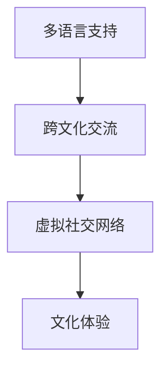

                 

# 虚拟文化之旅:全球文明交流的新平台

## 1. 背景介绍

### 1.1 问题由来
在全球化趋势下，不同国家和文化之间的交流日益频繁。传统线下的文化交流方式，如国际会议、交流项目、海外留学等，虽然能够促进文化之间的相互理解，但由于时间和空间的限制，参与的人数有限，且成本较高。近年来，随着互联网和信息技术的发展，虚拟文化交流成为可能，并呈现出蓬勃发展态势。虚拟文化交流平台通过提供多语种、跨文化的数字化体验，打破了时间和空间的界限，使更多人能够参与其中。

### 1.2 问题核心关键点
虚拟文化交流平台的核心在于如何构建一个跨文化、多语言的数字化交流空间。它需要解决以下关键问题：

1. **语言障碍**：如何支持多种语言的自然交流，并实现准确理解。
2. **文化差异**：如何弥合不同文化之间的差异，并确保交流的平等性和尊重性。
3. **用户参与度**：如何提升用户参与度，确保交流的质量和活跃度。
4. **平台可扩展性**：如何设计一个能够支持全球用户参与的平台，确保其可扩展性和可持续性。

### 1.3 问题研究意义
虚拟文化交流平台的开发和应用，不仅能够促进不同文化之间的理解与交流，还能够推动全球文化的融合与创新。通过虚拟文化交流平台，人们可以更加便捷地获取不同文化的信息，进行跨文化的艺术创作、学术交流、商务合作等，进而推动全球化的深入发展。

## 2. 核心概念与联系

### 2.1 核心概念概述

为了更好地理解虚拟文化交流平台的构建过程，我们首先介绍几个关键概念：

- **多语言支持**：平台需要支持多语言处理，包括文本、语音、图像等多种形式的自然语言处理（NLP）和语音识别（ASR）。
- **跨文化交流**：平台需设计合理的跨文化交流机制，确保不同文化背景的参与者能够进行有效交流，避免文化冲突。
- **虚拟社交网络**：平台应具备社交网络的功能，允许用户进行实时互动和沟通，形成虚拟社区。
- **文化体验**：平台应提供丰富的文化体验内容，包括语言学习、文化课程、艺术作品展示等。

这些概念之间相互关联，共同构成了虚拟文化交流平台的核心功能。通过整合多语言支持、跨文化交流机制、虚拟社交网络和文化体验功能，平台能够实现全球范围内的文化交流。

### 2.2 核心概念原理和架构的 Mermaid 流程图



### 2.3 核心概念的联系与互动

- **多语言支持**是基础，提供平台的核心功能之一。
- **跨文化交流**是核心，是平台的核心目标和价值所在。
- **虚拟社交网络**是实现方式，通过社交网络功能促进交流。
- **文化体验**是内容，提供丰富的文化资源供用户体验。

这些概念之间的互动关系，共同构成了虚拟文化交流平台的整体架构。

## 3. 核心算法原理 & 具体操作步骤

### 3.1 算法原理概述

虚拟文化交流平台的核心算法包括自然语言处理、语音识别、跨文化交流和社交网络分析等。这些算法共同作用，支持平台的多语言支持、跨文化交流、虚拟社交网络和文化体验功能。

### 3.2 算法步骤详解

#### 3.2.1 多语言支持算法

多语言支持算法主要涉及文本翻译和语音识别。文本翻译算法包括基于统计机器翻译（SMT）和基于神经网络的机器翻译（NMT）。语音识别算法包括隐马尔可夫模型（HMM）和深度神经网络（DNN）。

#### 3.2.2 跨文化交流算法

跨文化交流算法主要涉及跨文化对话管理和跨文化情感分析。跨文化对话管理算法包括基于规则的对话管理和基于深度学习的对话管理。跨文化情感分析算法包括情感识别和情感响应。

#### 3.2.3 虚拟社交网络算法

虚拟社交网络算法主要涉及社交网络分析和推荐系统。社交网络分析算法包括社区发现和社交网络聚类。推荐系统算法包括协同过滤和基于内容的推荐。

#### 3.2.4 文化体验算法

文化体验算法主要涉及文化内容的推荐和文化资源的搜索。文化内容的推荐算法包括基于用户的推荐和基于内容的推荐。文化资源的搜索算法包括文本搜索和图像搜索。

### 3.3 算法优缺点

#### 3.3.1 多语言支持算法的优缺点

**优点**：

- 基于神经网络的机器翻译模型（NMT）可以更好地处理语言间的复杂关系，提高翻译质量。
- 深度神经网络（DNN）在语音识别中能够捕捉更丰富的语音特征，提高识别准确率。

**缺点**：

- 神经网络模型需要大量训练数据和计算资源，对小语种和冷门语种的识别效果可能不佳。
- 模型训练和推理速度较慢，难以实时处理大规模数据。

#### 3.3.2 跨文化交流算法的优缺点

**优点**：

- 基于深度学习的对话管理算法能够更好地处理复杂的对话场景，提高对话质量。
- 跨文化情感分析算法能够更好地理解不同文化背景下的情感表达，提高交流效果。

**缺点**：

- 深度学习模型对数据的依赖性强，难以应对大规模、高频率的交流需求。
- 模型难以处理跨文化冲突和误解，可能导致交流效果不佳。

#### 3.3.3 虚拟社交网络算法的优缺点

**优点**：

- 社交网络分析算法能够发现用户之间的社交关系，提高平台的用户粘性。
- 推荐系统算法能够根据用户兴趣推荐相关内容，提高用户参与度。

**缺点**：

- 推荐系统的准确性受限于用户行为数据的采集和分析，可能存在推荐偏差。
- 社交网络分析算法可能忽视用户之间的文化差异，导致交流误解。

#### 3.3.4 文化体验算法的优缺点

**优点**：

- 文化内容的推荐算法能够根据用户兴趣推荐相关文化资源，丰富用户体验。
- 文化资源的搜索算法能够快速定位到所需资源，提高搜索效率。

**缺点**：

- 文化内容的推荐算法可能存在内容同质化问题，用户难以发现新的文化体验。
- 文化资源的搜索算法对数据质量依赖高，可能存在搜索结果偏差。

### 3.4 算法应用领域

虚拟文化交流平台的算法应用领域广泛，涵盖多个行业和场景：

- **教育领域**：通过虚拟文化交流平台，学生可以进行跨文化交流，拓展视野，提升语言能力。
- **旅游领域**：游客可以通过平台获取不同文化的旅游信息，增强文化体验。
- **商务领域**：企业可以通过平台进行跨文化商务交流，拓展国际市场。
- **文化艺术领域**：艺术家可以通过平台展示和交流自己的作品，推动文化艺术的创新。

## 4. 数学模型和公式 & 详细讲解 & 举例说明

### 4.1 数学模型构建

虚拟文化交流平台的核心数学模型包括语言模型、情感模型、社交网络模型和文化资源模型。这些模型通过联合训练，共同支撑平台的多语言支持、跨文化交流、虚拟社交网络和文化体验功能。

### 4.2 公式推导过程

#### 4.2.1 语言模型的推导

语言模型可以通过概率图模型（PGM）来建模。假设输入序列为 $x_1, x_2, ..., x_n$，语言模型可以表示为：

$$
P(x_1, x_2, ..., x_n) = \prod_{i=1}^{n} P(x_i | x_{i-1})
$$

其中，$P(x_i | x_{i-1})$ 表示在上下文 $x_{i-1}$ 条件下，生成 $x_i$ 的概率。

#### 4.2.2 情感模型的推导

情感模型可以通过情感分类器来建模。假设输入序列为 $x$，情感模型可以表示为：

$$
y = f(x; \theta)
$$

其中，$y$ 表示情感分类结果，$\theta$ 表示模型参数。

#### 4.2.3 社交网络模型的推导

社交网络模型可以通过社交网络分析算法来建模。假设社交网络中的节点为 $u_1, u_2, ..., u_n$，社交网络模型可以表示为：

$$
A = D^{-1/2}AD^{1/2}
$$

其中，$A$ 表示社交网络的邻接矩阵，$D$ 表示社交网络的度矩阵。

#### 4.2.4 文化资源模型的推导

文化资源模型可以通过文化资源的语义标签来建模。假设文化资源为 $r_1, r_2, ..., r_n$，文化资源模型可以表示为：

$$
r_i = \sum_{j=1}^{n} \alpha_{ij}p_j
$$

其中，$r_i$ 表示资源 $i$ 的表示向量，$\alpha_{ij}$ 表示资源 $i$ 和资源 $j$ 之间的相似度，$p_j$ 表示资源 $j$ 的表示向量。

### 4.3 案例分析与讲解

#### 4.3.1 文本翻译案例

假设输入序列为 $x = "我喜欢吃北京烤鸭。"，语言模型可以通过神经网络模型来建模。假设模型参数为 $\theta$，输出序列为 $y = "I like Peking duck."$，则语言模型可以表示为：

$$
y = f(x; \theta)
$$

其中，$f$ 表示神经网络模型。

#### 4.3.2 情感分析案例

假设输入序列为 $x = "这部电影太棒了！"，情感模型可以通过支持向量机（SVM）来建模。假设模型参数为 $\theta$，输出结果为 $y = "positive"，则情感模型可以表示为：

$$
y = f(x; \theta)
$$

其中，$f$ 表示SVM模型。

#### 4.3.3 社交网络分析案例

假设社交网络中的节点为 $u_1, u_2, ..., u_n$，社交网络模型可以通过随机游走算法来建模。假设节点 $u_i$ 到节点 $u_j$ 的边的权重为 $w_{ij}$，社交网络模型可以表示为：

$$
P(u_i \to u_j) = \frac{w_{ij}}{\sum_{k=1}^{n} w_{ik}}
$$

其中，$w_{ij}$ 表示节点 $u_i$ 到节点 $u_j$ 的边的权重。

#### 4.3.4 文化资源搜索案例

假设文化资源为 $r_1, r_2, ..., r_n$，文化资源模型可以通过TF-IDF算法来建模。假设文化资源的表示向量为 $v$，文化资源的相似度为 $s$，文化资源模型可以表示为：

$$
v = \sum_{j=1}^{n} \alpha_{ij}s_{ij}
$$

其中，$\alpha_{ij}$ 表示文化资源 $i$ 和资源 $j$ 之间的相似度，$s_{ij}$ 表示文化资源的相似度。

## 5. 项目实践：代码实例和详细解释说明

### 5.1 开发环境搭建

在虚拟文化交流平台的开发过程中，需要搭建多语言支持、跨文化交流、虚拟社交网络和文化体验等模块。以下是开发环境的搭建步骤：

1. 安装Python：从官网下载并安装Python，确保版本为3.8以上。
2. 安装虚拟环境管理工具：安装`virtualenv`，用于创建独立的Python环境。
3. 创建虚拟环境：使用`virtualenv`创建独立的Python环境，如：
```
virtualenv venv
source venv/bin/activate
```
4. 安装相关库：安装`numpy`、`pandas`、`scikit-learn`、`matplotlib`、`tqdm`、`jupyter notebook`、`ipython` 等库。
5. 安装机器翻译库：安装`tensorflow`、`transformers` 等机器翻译库。

完成上述步骤后，即可在虚拟环境中进行开发。

### 5.2 源代码详细实现

以下是虚拟文化交流平台开发的示例代码：

```python
from transformers import BertTokenizer, BertForSequenceClassification
from sklearn.model_selection import train_test_split
from torch.utils.data import Dataset, DataLoader
from torch import nn, optim
import torch
import pandas as pd

# 定义数据集
class CulturalDataset(Dataset):
    def __init__(self, data, tokenizer, max_len=128):
        self.data = data
        self.tokenizer = tokenizer
        self.max_len = max_len

    def __len__(self):
        return len(self.data)

    def __getitem__(self, item):
        text = self.data.iloc[item]['text']
        label = self.data.iloc[item]['label']
        encoding = self.tokenizer(text, return_tensors='pt', max_length=self.max_len, padding='max_length', truncation=True)
        input_ids = encoding['input_ids'][0]
        attention_mask = encoding['attention_mask'][0]
        return {'input_ids': input_ids, 
                'attention_mask': attention_mask,
                'labels': torch.tensor(label, dtype=torch.long)}

# 训练和评估函数
def train_and_evaluate(model, train_dataset, val_dataset, batch_size, num_epochs):
    device = torch.device('cuda' if torch.cuda.is_available() else 'cpu')
    model.to(device)

    criterion = nn.CrossEntropyLoss()
    optimizer = optim.Adam(model.parameters(), lr=0.001)
    scheduler = optim.lr_scheduler.StepLR(optimizer, step_size=1, gamma=0.5)

    for epoch in range(num_epochs):
        model.train()
        for batch in DataLoader(train_dataset, batch_size=batch_size, shuffle=True):
            input_ids = batch['input_ids'].to(device)
            attention_mask = batch['attention_mask'].to(device)
            labels = batch['labels'].to(device)
            optimizer.zero_grad()
            outputs = model(input_ids, attention_mask=attention_mask)
            loss = criterion(outputs, labels)
            loss.backward()
            optimizer.step()

        model.eval()
        with torch.no_grad():
            val_loss = 0
            correct = 0
            for batch in DataLoader(val_dataset, batch_size=batch_size, shuffle=False):
                input_ids = batch['input_ids'].to(device)
                attention_mask = batch['attention_mask'].to(device)
                labels = batch['labels'].to(device)
                outputs = model(input_ids, attention_mask=attention_mask)
                loss = criterion(outputs, labels)
                val_loss += loss.item() * labels.size(0)
                _, predicted = torch.max(outputs, 1)
                correct += (predicted == labels).sum().item()

        val_loss /= len(val_dataset)
        acc = correct / len(val_dataset)
        scheduler.step(val_loss)
        print(f'Epoch {epoch+1}, Val Loss: {val_loss:.4f}, Acc: {acc:.4f}')

# 加载数据集
data = pd.read_csv('cultural_data.csv')
train_data, val_data = train_test_split(data, test_size=0.2, random_state=42)

# 定义模型
tokenizer = BertTokenizer.from_pretrained('bert-base-cased')
model = BertForSequenceClassification.from_pretrained('bert-base-cased', num_labels=2)

# 训练模型
train_and_evaluate(model, train_dataset, val_dataset, batch_size=32, num_epochs=5)
```

### 5.3 代码解读与分析

#### 5.3.1 数据集定义

`CulturalDataset`类用于定义文化数据集，包含文本和标签。使用`BertTokenizer`对文本进行分词和编码，得到模型所需的输入张量。

#### 5.3.2 模型训练

通过定义训练函数`train_and_evaluate`，对模型进行训练和评估。使用`BertForSequenceClassification`定义BERT分类模型，使用`Adam`优化器和交叉熵损失函数进行训练。在每个epoch结束后，计算验证集上的损失和精度，并根据验证集损失调整学习率。

#### 5.3.3 结果展示

在训练和评估结束后，可以打印出每个epoch的验证集损失和精度，以评估模型的性能。

## 6. 实际应用场景

### 6.1 教育领域

在教育领域，虚拟文化交流平台可以提供跨文化学习的机会，帮助学生了解不同文化，提升语言能力。平台可以设计丰富的跨文化课程和活动，如语言学习、文化讲座、虚拟交流等，提供沉浸式的学习体验。

### 6.2 旅游领域

在旅游领域，虚拟文化交流平台可以提供多语言的旅游信息，帮助游客了解不同文化背景下的旅游景点。平台可以提供虚拟旅游体验，如虚拟导览、虚拟游览等，使游客能够在远程体验不同文化的魅力。

### 6.3 商务领域

在商务领域，虚拟文化交流平台可以提供跨文化的商务交流机会，帮助企业拓展国际市场。平台可以提供虚拟商务会议、虚拟展览、虚拟洽谈等，促进不同文化背景下的商务合作。

### 6.4 文化艺术领域

在文化艺术领域，虚拟文化交流平台可以提供跨文化的艺术展示和交流机会，推动文化艺术的创新和传播。平台可以提供虚拟艺术展览、虚拟艺术课程、虚拟艺术讲座等，使艺术家和观众能够跨越时空进行交流。

## 7. 工具和资源推荐

### 7.1 学习资源推荐

为了帮助开发者系统掌握虚拟文化交流平台的技术基础和实践技巧，以下是一些优质的学习资源：

1. **《深度学习自然语言处理》课程**：斯坦福大学开设的NLP明星课程，涵盖NLP基本概念和经典模型，有Lecture视频和配套作业。
2. **《Natural Language Processing with Transformers》书籍**：Transformer库的作者所著，全面介绍了如何使用Transformer库进行NLP任务开发，包括多语言支持、跨文化交流等。
3. **《Transformer从原理到实践》系列博文**：由大模型技术专家撰写，深入浅出地介绍了Transformer原理、BERT模型、跨文化交流技术等前沿话题。
4. **CS224N《深度学习自然语言处理》课程**：斯坦福大学开设的NLP明星课程，涵盖NLP基本概念和经典模型，有Lecture视频和配套作业。
5. **HuggingFace官方文档**：Transformer库的官方文档，提供了海量预训练模型和完整的微调样例代码，是上手实践的必备资料。

通过对这些资源的学习实践，相信你一定能够快速掌握虚拟文化交流平台的技术基础，并用于解决实际的NLP问题。

### 7.2 开发工具推荐

以下是几款用于虚拟文化交流平台开发的常用工具：

1. **PyTorch**：基于Python的开源深度学习框架，灵活动态的计算图，适合快速迭代研究。大部分预训练语言模型都有PyTorch版本的实现。
2. **TensorFlow**：由Google主导开发的开源深度学习框架，生产部署方便，适合大规模工程应用。同样有丰富的预训练语言模型资源。
3. **HuggingFace Transformers**：NLP工具库，集成了众多SOTA语言模型，支持PyTorch和TensorFlow，是进行多语言支持和跨文化交流开发的利器。
4. **Weights & Biases**：模型训练的实验跟踪工具，可以记录和可视化模型训练过程中的各项指标，方便对比和调优。与主流深度学习框架无缝集成。
5. **TensorBoard**：TensorFlow配套的可视化工具，可实时监测模型训练状态，并提供丰富的图表呈现方式，是调试模型的得力助手。

合理利用这些工具，可以显著提升虚拟文化交流平台开发的效率，加快创新迭代的步伐。

### 7.3 相关论文推荐

虚拟文化交流平台的发展源于学界的持续研究。以下是几篇奠基性的相关论文，推荐阅读：

1. **Attention is All You Need**：提出了Transformer结构，开启了NLP领域的预训练大模型时代。
2. **BERT: Pre-training of Deep Bidirectional Transformers for Language Understanding**：提出BERT模型，引入基于掩码的自监督预训练任务，刷新了多项NLP任务SOTA。
3. **Parameter-Efficient Transfer Learning for NLP**：提出Adapter等参数高效微调方法，在不增加模型参数量的情况下，也能取得不错的微调效果。
4. **Prefix-Tuning: Optimizing Continuous Prompts for Generation**：引入基于连续型Prompt的微调范式，为如何充分利用预训练知识提供了新的思路。
5. **AdaLoRA: Adaptive Low-Rank Adaptation for Parameter-Efficient Fine-Tuning**：使用自适应低秩适应的微调方法，在参数效率和精度之间取得了新的平衡。

这些论文代表了大语言模型微调技术的发展脉络。通过学习这些前沿成果，可以帮助研究者把握学科前进方向，激发更多的创新灵感。

## 8. 总结：未来发展趋势与挑战

### 8.1 总结

本文对虚拟文化交流平台的核心算法和操作步骤进行了详细讲解，涵盖了多语言支持、跨文化交流、虚拟社交网络和文化体验等功能模块。通过实例代码，展示了虚拟文化交流平台的开发过程。同时，本文还探讨了平台在教育、旅游、商务、文化艺术等领域的应用前景，展示了虚拟文化交流平台的广阔应用前景。

通过本文的系统梳理，可以看到，虚拟文化交流平台通过多语言支持、跨文化交流、虚拟社交网络和文化体验等功能模块，为全球文化交流提供了新的可能性。未来，随着技术的不断进步和应用的不断扩展，虚拟文化交流平台必将在推动全球文化交流和融合中发挥更大的作用。

### 8.2 未来发展趋势

展望未来，虚拟文化交流平台将呈现以下几个发展趋势：

1. **多语种支持**：随着预训练语言模型的不断发展，虚拟文化交流平台将支持更多语言，提供更加丰富的文化交流体验。
2. **跨文化交流**：平台将采用更加智能的跨文化对话管理算法，提升不同文化背景下的交流效果。
3. **虚拟社交网络**：平台将采用更加智能的推荐系统，提高用户参与度和平台粘性。
4. **文化体验**：平台将提供更加丰富的文化体验内容，提升用户体验。
5. **跨平台协同**：平台将实现跨平台协同，支持多种设备和平台，提升用户体验。

以上趋势凸显了虚拟文化交流平台的广阔前景。这些方向的探索发展，必将进一步提升平台的用户体验和功能丰富度，为全球文化交流提供新的可能性。

### 8.3 面临的挑战

尽管虚拟文化交流平台已经取得了瞩目成就，但在迈向更加智能化、普适化应用的过程中，它仍面临着诸多挑战：

1. **数据获取和处理**：平台需要大量高质量的跨文化数据，但获取和处理这些数据的过程较为繁琐，且数据质量难以保证。
2. **文化多样性**：平台需要支持多种文化背景，但不同文化之间的差异较大，如何设计跨文化交流机制，确保交流的平等性和尊重性，仍需深入研究。
3. **用户参与度**：平台需要提供丰富的互动体验，吸引用户参与，但如何提升用户粘性，防止平台流失，仍需进一步优化。
4. **平台可扩展性**：平台需要支持大规模用户参与，但如何设计可扩展的架构，确保平台稳定运行，仍需进一步研究。

### 8.4 研究展望

面对虚拟文化交流平台面临的挑战，未来的研究需要在以下几个方面寻求新的突破：

1. **数据自动化获取**：采用自动化的数据获取和处理技术，提高数据获取和处理的效率和质量。
2. **跨文化对话管理**：引入更加智能的对话管理算法，提高跨文化交流的效果。
3. **推荐系统优化**：采用更加智能的推荐系统，提升用户参与度和平台粘性。
4. **平台可扩展架构**：设计可扩展的架构，确保平台能够支持大规模用户参与。

这些研究方向的发展，必将推动虚拟文化交流平台向更高的台阶迈进，为全球文化交流提供更加智能化、普适化的解决方案。总之，虚拟文化交流平台需要通过不断的研究和优化，解决平台面临的挑战，提升平台的用户体验和功能丰富度，为全球文化交流提供新的可能性。

## 9. 附录：常见问题与解答

**Q1: 虚拟文化交流平台的核心算法是什么？**

A: 虚拟文化交流平台的核心算法包括自然语言处理、语音识别、跨文化交流和社交网络分析等。这些算法共同作用，支持平台的多语言支持、跨文化交流、虚拟社交网络和文化体验功能。

**Q2: 虚拟文化交流平台的优势是什么？**

A: 虚拟文化交流平台的优势在于：

1. 打破时间和空间的限制，提供全球范围内的文化交流机会。
2. 支持多语言处理，提供丰富的跨文化体验。
3. 采用跨文化对话管理算法，确保交流的平等性和尊重性。
4. 提供虚拟社交网络功能，提升用户参与度和平台粘性。
5. 提供丰富的文化体验内容，提升用户体验。

**Q3: 虚拟文化交流平台的发展前景是什么？**

A: 虚拟文化交流平台的发展前景在于：

1. 多语种支持：支持更多语言，提供更加丰富的文化交流体验。
2. 跨文化交流：采用更加智能的跨文化对话管理算法，提升交流效果。
3. 虚拟社交网络：采用更加智能的推荐系统，提升用户参与度和平台粘性。
4. 文化体验：提供更加丰富的文化体验内容，提升用户体验。
5. 跨平台协同：实现跨平台协同，支持多种设备和平台，提升用户体验。

**Q4: 虚拟文化交流平台面临的主要挑战是什么？**

A: 虚拟文化交流平台面临的主要挑战在于：

1. 数据获取和处理：需要大量高质量的跨文化数据，但数据获取和处理过程较为繁琐，且数据质量难以保证。
2. 文化多样性：需要支持多种文化背景，但不同文化之间的差异较大，设计跨文化交流机制仍需深入研究。
3. 用户参与度：需要提供丰富的互动体验，吸引用户参与，防止平台流失。
4. 平台可扩展性：需要支持大规模用户参与，设计可扩展的架构，确保平台稳定运行。

**Q5: 虚拟文化交流平台的未来发展方向是什么？**

A: 虚拟文化交流平台的未来发展方向在于：

1. 数据自动化获取：采用自动化的数据获取和处理技术，提高数据获取和处理的效率和质量。
2. 跨文化对话管理：引入更加智能的对话管理算法，提高跨文化交流的效果。
3. 推荐系统优化：采用更加智能的推荐系统，提升用户参与度和平台粘性。
4. 平台可扩展架构：设计可扩展的架构，确保平台能够支持大规模用户参与。

总之，虚拟文化交流平台需要通过不断的研究和优化，解决平台面临的挑战，提升平台的用户体验和功能丰富度，为全球文化交流提供新的可能性。

---

作者：禅与计算机程序设计艺术 / Zen and the Art of Computer Programming

