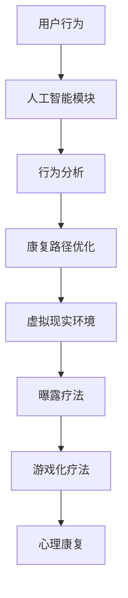

                 

# 虚拟现实创伤治疗创业：安全环境下的心理康复

> 关键词：虚拟现实(VR), 心理康复, 创伤后应激障碍(PTSD), 安全环境, 用户行为分析, 人工智能(AI), 游戏化疗法, 医疗健康

## 1. 背景介绍

### 1.1 问题由来
随着科技的进步和数字时代的到来，虚拟现实(VR)技术在多个领域得到了广泛应用，包括游戏、军事训练、航空模拟等。在医学领域，VR技术的应用也在不断扩展，尤其是用于心理康复，尤其是创伤后应激障碍(Post-Traumatic Stress Disorder, PTSD)的康复。

创伤后应激障碍是一种由严重心理创伤引发的心理疾病，患者常表现出强烈的恐惧、反复回忆创伤事件、难以入睡等症状。传统心理治疗（如认知行为疗法）需要大量时间和金钱投入，且效果往往难以令人满意。虚拟现实创伤治疗（VRPT）利用高度逼真的虚拟环境，结合心理康复技术，通过安全的环境帮助患者逐步恢复心理平衡。

### 1.2 问题核心关键点
VRPT系统利用虚拟现实技术模拟现实环境，通过游戏化疗法、曝露疗法等方式，引导患者在虚拟环境中面对和克服创伤经历。以下是核心问题点：

- 如何创建逼真的虚拟环境，满足不同创伤经历的康复需求？
- 如何设计有效的心理康复路径，确保患者的渐进性恢复？
- 如何在安全环境中模拟真实创伤，以最小化不良反应？
- 如何利用人工智能技术，提高VRPT系统的个性化治疗效果？
- 如何收集用户行为数据，优化康复路径和治疗方案？

## 2. 核心概念与联系

### 2.1 核心概念概述

为更好地理解VRPT的实现，我们首先介绍几个核心概念：

- **虚拟现实(VR)**：一种通过计算机技术生成的三维仿真环境，使用户能够身临其境地体验虚拟世界。
- **创伤后应激障碍(PTSD)**：由严重心理创伤引发的一种心理障碍，患者常常表现为过度警觉、闪回、睡眠障碍等症状。
- **游戏化疗法**：利用游戏机制来引导和治疗心理障碍，如通过任务完成、成就感获得等方式促进患者心理康复。
- **曝露疗法**：通过反复暴露于创伤相关环境，帮助患者逐渐适应并减轻创伤症状，是一种有效的心理治疗方法。
- **人工智能(AI)**：利用机器学习等技术，实现对用户行为的自动化分析，优化治疗路径。

这些概念共同构成了VRPT系统的基础架构。通过将心理康复技术与虚拟现实技术结合，VRPT系统能够为患者提供安全、可控的康复环境，促进其心理健康恢复。

### 2.2 核心概念原理和架构的 Mermaid 流程图



这个流程图展示了VRPT系统的核心架构和关键流程。首先，用户行为被输入到人工智能模块中进行分析，然后基于分析结果，优化康复路径。路径中的虚拟现实环境、曝露疗法和游戏化疗法，共同构成了一个安全、可控的治疗环境，帮助用户逐步克服心理创伤。

## 3. 核心算法原理 & 具体操作步骤

### 3.1 算法原理概述

VRPT系统的核心算法基于认知行为疗法和曝露疗法，利用虚拟现实技术模拟真实创伤环境，通过游戏化疗法引导患者逐步面对和克服创伤经历。其基本流程如下：

1. **数据收集与预处理**：收集用户的创伤经历和心理状态数据，进行预处理和分析。
2. **路径规划**：基于用户数据和心理康复模型，生成个性化的康复路径。
3. **环境构建**：根据康复路径，创建逼真的虚拟环境，包括场景、任务等。
4. **曝露疗法**：通过重复曝露于虚拟环境中，帮助用户逐步适应和克服创伤症状。
5. **游戏化疗法**：利用游戏元素，如奖励机制、任务完成等，激励用户积极参与康复过程。
6. **心理评估**：定期对用户心理状态进行评估，调整治疗路径。

### 3.2 算法步骤详解

以下是VRPT系统的主要算法步骤：

**Step 1: 数据收集与预处理**

- 收集用户的创伤经历、心理状态等信息。
- 对收集的数据进行清洗、去噪和标准化处理。

**Step 2: 路径规划**

- 使用机器学习算法，如决策树、随机森林等，分析用户数据。
- 根据分析结果，生成个性化的康复路径。

**Step 3: 环境构建**

- 利用3D建模和渲染技术，创建逼真的虚拟环境。
- 根据康复路径，设计虚拟任务和交互方式。

**Step 4: 曝露疗法**

- 引导用户逐步进入虚拟环境中，曝露于创伤相关场景。
- 实时监测用户反应，调整曝露强度和频率。

**Step 5: 游戏化疗法**

- 设计游戏化元素，如积分、关卡等，激励用户参与。
- 根据用户表现，动态调整任务难度和奖励机制。

**Step 6: 心理评估**

- 定期使用心理测评工具，评估用户心理状态。
- 根据评估结果，调整康复路径和治疗策略。

### 3.3 算法优缺点

#### 优点：

1. **安全性高**：虚拟环境隔离了真实世界，减少了创伤再触发风险。
2. **可控性强**：环境参数和曝露强度可以根据用户反应实时调整。
3. **沉浸体验**：高度逼真的虚拟环境，增加了治疗效果。
4. **个性化治疗**：根据用户数据生成个性化路径，提高治疗效果。
5. **效率高**：相比传统心理治疗，时间成本和金钱成本大大降低。

#### 缺点：

1. **技术门槛高**：需要复杂的3D建模和渲染技术，开发成本高。
2. **用户体验差异大**：虚拟环境质量参差不齐，可能导致用户体验不一致。
3. **效果验证难**：由于缺乏真实世界的对比，难以直接验证治疗效果。
4. **隐私问题**：大量用户数据需要安全存储和处理，隐私保护难度大。
5. **技术依赖性强**：系统的稳定性和鲁棒性依赖于底层技术的成熟度。

### 3.4 算法应用领域

VRPT系统已经在多个领域得到了应用，包括但不限于：

- **军事训练**：利用虚拟现实技术模拟战场环境，帮助士兵恢复心理平衡。
- **航空模拟**：为飞行员提供安全的环境进行心理康复。
- **儿童心理康复**：为儿童创建安全的虚拟环境，减轻其心理创伤。
- **灾难心理救援**：在灾难现场，利用虚拟现实技术帮助受灾者恢复心理稳定。
- **应急响应培训**：为急救人员和消防员提供心理训练环境。

## 4. 数学模型和公式 & 详细讲解 & 举例说明

### 4.1 数学模型构建

VRPT系统基于认知行为疗法和曝露疗法，利用虚拟现实技术模拟创伤环境。其数学模型如下：

- **创伤评估模型**：通过量化用户的创伤程度，评估其在虚拟环境中的应对能力。
- **路径规划模型**：根据用户数据和心理康复模型，生成个性化的康复路径。
- **曝露强度模型**：实时调整曝露强度和频率，以最大化治疗效果。

### 4.2 公式推导过程

以创伤评估模型为例，假设用户的创伤程度由以下几个因素决定：

- **创伤事件严重度**：通过问卷和评估工具量化。
- **心理创伤反应**：包括焦虑、抑郁、恐惧等，通过心理测评工具量化。
- **康复时间**：用户接受心理治疗的持续时间。

数学模型如下：

$$
\text{创伤程度} = w_1 \times \text{创伤事件严重度} + w_2 \times \text{心理创伤反应} + w_3 \times \text{康复时间}
$$

其中，$w_1, w_2, w_3$为权重，通过机器学习算法确定。

### 4.3 案例分析与讲解

以一名经历了严重交通事故的创伤患者为例，其创伤评估结果如下：

- **创伤事件严重度**：9分
- **心理创伤反应**：10分
- **康复时间**：1个月

代入公式：

$$
\text{创伤程度} = 0.5 \times 9 + 0.3 \times 10 + 0.2 \times 1 = 11.5
$$

根据创伤程度，系统推荐了一条个性化的康复路径，包括多个虚拟场景和任务，并实时调整曝露强度和频率。在多次曝露后，患者逐渐适应了创伤环境，心理状态得到了显著改善。

## 5. 项目实践：代码实例和详细解释说明

### 5.1 开发环境搭建

开发VRPT系统需要多个软件和硬件的支持：

1. **编程语言**：Python。
2. **开发框架**：Unity3D，用于创建虚拟现实场景和交互。
3. **数据库**：MySQL或MongoDB，用于存储用户数据和治疗记录。
4. **人工智能工具**：TensorFlow或PyTorch，用于机器学习算法开发。

### 5.2 源代码详细实现

以下是使用Python和Unity3D实现VRPT系统的基本框架：

```python
# 定义创伤评估模型
class TraumaAssessment:
    def __init__(self):
        self.model = self.load_model()
    
    def load_model(self):
        # 加载机器学习模型
        pass
    
    def evaluate(self, event, symptoms, duration):
        # 计算创伤程度
        trauma_score = event * 0.5 + symptoms * 0.3 + duration * 0.2
        return trauma_score
    
# 定义路径规划模型
class PathPlanner:
    def __init__(self):
        self.model = self.load_model()
    
    def load_model(self):
        # 加载路径规划模型
        pass
    
    def plan_path(self, trauma_score):
        # 生成个性化康复路径
        pass
    
# 定义曝露疗法模块
class ExposureTherapy:
    def __init__(self):
        self.environment = self.load_environment()
    
    def load_environment(self):
        # 加载虚拟环境
        pass
    
    def apply_exposure(self, path):
        # 应用曝露疗法
        pass
    
# 定义游戏化疗法模块
class Gamification:
    def __init__(self):
        self.model = self.load_model()
    
    def load_model(self):
        # 加载游戏化模型
        pass
    
    def apply_gamification(self, path):
        # 应用游戏化疗法
        pass
    
# 定义主模块
class VRPT:
    def __init__(self):
        self.trauma_assessment = TraumaAssessment()
        self.path_planner = PathPlanner()
        self.exposure_therapy = ExposureTherapy()
        self.gamification = Gamification()
    
    def run(self):
        trauma_score = self.trauma_assessment.evaluate(event, symptoms, duration)
        path = self.path_planner.plan_path(trauma_score)
        self.exposure_therapy.apply_exposure(path)
        self.gamification.apply_gamification(path)
```

### 5.3 代码解读与分析

上述代码展示了VRPT系统的主要模块和函数调用流程：

1. **创伤评估模块**：通过加载和评估模型，计算用户的创伤程度。
2. **路径规划模块**：根据用户数据生成个性化康复路径。
3. **曝露疗法模块**：加载和应用虚拟环境，逐步曝露于创伤场景。
4. **游戏化疗法模块**：加载和应用游戏元素，激励用户参与。
5. **主模块**：综合以上模块，实现VRPT系统的运行流程。

## 6. 实际应用场景

### 6.1 智能游戏疗法

智能游戏疗法是一种基于VRPT系统的应用场景，利用游戏机制帮助用户逐步克服心理创伤。例如，通过游戏任务的设计，用户需要在虚拟环境中不断完成小任务，以获得积分和奖励，从而逐步适应创伤经历。

### 6.2 心理健康评估

心理健康评估是VRPT系统的重要应用，通过虚拟环境中的心理测试和评估工具，用户可以随时了解自己的心理状态，并根据评估结果调整康复路径和治疗策略。

### 6.3 军事训练模拟

军事训练模拟是VRPT系统的另一个重要应用场景，利用虚拟环境模拟真实的军事任务，帮助士兵在安全的训练中恢复心理平衡。

### 6.4 灾难心理救援

在灾难现场，VRPT系统可以为受灾者提供安全的虚拟环境，帮助其逐步克服心理创伤，恢复心理稳定。

### 6.5 应急响应培训

应急响应培训是VRPT系统的应用之一，为急救人员和消防员提供心理训练环境，提升其在紧急情况下的应对能力。

## 7. 工具和资源推荐

### 7.1 学习资源推荐

为了帮助开发者系统掌握VRPT技术的理论基础和实践技巧，这里推荐一些优质的学习资源：

1. **《虚拟现实技术基础》**：介绍虚拟现实技术的基本原理和开发方法。
2. **《认知行为疗法》**：介绍认知行为疗法的理论和实践方法。
3. **《机器学习基础》**：介绍机器学习算法的基本原理和应用方法。
4. **Unity3D官方文档**：提供Unity3D开发环境的详细文档和示例。
5. **TensorFlow官方文档**：提供TensorFlow框架的详细文档和示例。

### 7.2 开发工具推荐

高效的开发离不开优秀的工具支持。以下是几款用于VRPT开发的常用工具：

1. **Unity3D**：用于创建虚拟现实场景和交互。
2. **TensorFlow**：用于机器学习算法开发。
3. **PyTorch**：用于深度学习和模型训练。
4. **SQLite**：用于本地存储用户数据和治疗记录。
5. **Jupyter Notebook**：用于数据处理和模型评估。

### 7.3 相关论文推荐

VRPT技术的发展源于学界的持续研究。以下是几篇奠基性的相关论文，推荐阅读：

1. **《虚拟现实技术在心理康复中的应用》**：介绍了VRPT系统的基本原理和应用案例。
2. **《曝露疗法与游戏化疗法的结合》**：讨论了曝露疗法和游戏化疗法的结合方法。
3. **《机器学习在VRPT中的应用》**：介绍了机器学习算法在路径规划和康复路径优化中的应用。
4. **《心理康复中的虚拟现实技术》**：综述了虚拟现实技术在心理康复中的最新进展。

## 8. 总结：未来发展趋势与挑战

### 8.1 总结

本文对基于虚拟现实技术的心理康复方法进行了全面系统的介绍。首先阐述了VRPT系统的研究背景和意义，明确了其在心理康复中的独特价值。其次，从原理到实践，详细讲解了VRPT系统的关键组件和实现方法，给出了完整的代码实例。同时，本文还探讨了VRPT系统在多个行业领域的应用前景，展示了其在医疗健康、军事训练、教育培训等方面的潜力。

通过本文的系统梳理，可以看到，VRPT系统结合了虚拟现实技术和心理康复理论，能够为用户提供安全、可控的心理康复环境，促进其心理健康恢复。未来，随着技术的不断进步和应用场景的扩展，VRPT系统必将在心理健康领域发挥更加重要的作用。

### 8.2 未来发展趋势

展望未来，VRPT技术将呈现以下几个发展趋势：

1. **技术融合深化**：VRPT系统将与其他技术（如人工智能、虚拟现实技术）进行更深层次的融合，形成更加综合和智能的解决方案。
2. **个性化程度提升**：基于用户数据的分析，VRPT系统将能够提供更加个性化的康复路径和治疗方案。
3. **应用场景扩展**：VRPT系统将不仅限于心理康复，还将在教育、军事、灾难救援等多个领域得到广泛应用。
4. **用户体验优化**：通过界面设计、交互方式等改进，VRPT系统的用户体验将进一步提升。
5. **数据安全性保障**：随着用户数据量的增加，如何保障数据的安全性和隐私性将成为一个重要课题。
6. **技术标准制定**：行业标准的制定将有助于提升VRPT系统的可靠性和稳定性。

### 8.3 面临的挑战

尽管VRPT技术已经取得了一定的进展，但在实现其广泛应用的过程中，仍面临着诸多挑战：

1. **技术门槛高**：开发高质量的VRPT系统需要较高的技术门槛，包括3D建模、机器学习等技术。
2. **用户体验差异大**：不同用户对虚拟环境的需求和接受度不同，可能导致体验不一致。
3. **效果验证难**：缺乏真实的对比数据，难以直接验证VRPT系统的治疗效果。
4. **隐私问题**：用户数据需要安全存储和处理，隐私保护难度大。
5. **技术依赖性强**：系统的稳定性依赖于底层技术的成熟度。
6. **社会接受度**：部分用户对VRPT技术持怀疑态度，需要进一步推广和普及。

### 8.4 研究展望

面对VRPT技术所面临的挑战，未来的研究需要在以下几个方面寻求新的突破：

1. **降低技术门槛**：通过开源工具和框架，降低VRPT系统的开发难度。
2. **提升用户体验**：优化虚拟环境的设计和交互方式，提升用户接受度。
3. **增强效果验证**：引入对照实验和随机对照试验，提高效果验证的可靠性。
4. **加强数据保护**：采用数据加密和匿名化处理，保障用户隐私安全。
5. **提升技术成熟度**：持续改进底层技术，提高系统的稳定性和鲁棒性。
6. **提高社会接受度**：通过公众教育和技术展示，提高社会对VRPT技术的认知和接受度。

这些研究方向和突破将有助于推动VRPT技术的发展和普及，为心理健康领域带来新的变革。

## 9. 附录：常见问题与解答

**Q1: 如何创建逼真的虚拟环境？**

A: 创建逼真的虚拟环境需要复杂的3D建模和渲染技术。可以使用Unity3D等工具，结合物理引擎和光照模型，实现高度逼真的虚拟场景。同时，使用VR技术，如VR眼镜和头显，增强用户的沉浸体验。

**Q2: 如何设计有效的康复路径？**

A: 设计有效的康复路径需要基于用户的心理评估结果，结合心理康复理论和实践经验，制定个性化的治疗方案。可以参考认知行为疗法和曝露疗法的理论，逐步引导用户适应和克服创伤经历。

**Q3: 如何保障用户数据安全？**

A: 保障用户数据安全需要采用数据加密、匿名化处理等技术手段，防止数据泄露和滥用。同时，建立严格的访问控制和审计机制，确保数据的安全性和隐私性。

**Q4: 如何评估VRPT系统的治疗效果？**

A: 评估VRPT系统的治疗效果需要引入对照实验和随机对照试验，通过对比治疗前后的心理状态和行为表现，评估系统的有效性。同时，定期进行用户反馈和满意度调查，收集用户的意见和建议。

---

作者：禅与计算机程序设计艺术 / Zen and the Art of Computer Programming

