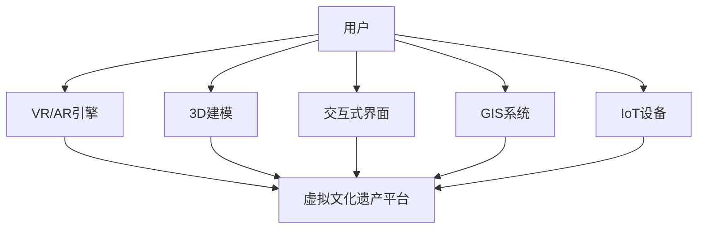

                 

# 虚拟现实文化遗产探索创业：身临其境的历史文化之旅

> 关键词：虚拟现实, 文化遗产, 探索, 身临其境, 历史文化

## 1. 背景介绍

### 1.1 问题由来
随着技术的进步，虚拟现实（VR）和增强现实（AR）等新兴技术不断涌现，为文化遗产的探索和传播提供了全新的手段。传统的手段如文字描述、图片展示等形式，难以充分传达文化遗产的丰富细节和历史意义。因此，基于虚拟现实技术，构建一个能够“身临其境”探索文化遗产的平台，成为当下备受关注的热点问题。

### 1.2 问题核心关键点
构建一个“身临其境”的虚拟现实文化遗产探索平台，关键点在于：
1. 如何利用VR技术，将复杂的文化遗产数据进行有效建模和渲染。
2. 如何设计和实现交互式用户界面，让用户能够在虚拟环境中自由探索。
3. 如何确保文化遗产的真实性和准确性，避免误导和歪曲。
4. 如何提供丰富的互动内容，增加用户参与度和体验感。
5. 如何实现平台的大规模部署和商业化运营。

### 1.3 问题研究意义
本项目旨在利用虚拟现实技术，打造一个能够带领用户“身临其境”探索文化遗产的创新创业平台。通过VR技术，用户不仅能够体验到文化遗产的丰富细节和历史价值，还能够进行互动式探索，从而提升公众对文化遗产的认知和兴趣，推动文化遗产的传承和保护。该项目将具有以下重要意义：

1. 提升文化遗产保护：通过数字化的方式，有效记录和保存文化遗产，避免传统物理损坏和自然老化。
2. 促进文化传承：通过互动式学习，使更多年轻人了解并关注文化遗产，激发他们的兴趣和责任。
3. 促进旅游经济：通过虚拟旅游的推广，吸引更多游客到实体文化遗产地进行实地考察，带动相关旅游经济。
4. 提升公众参与：通过虚拟现实技术，让无法亲自到场的人们也能参与文化遗产的探索和互动，增强社会凝聚力。

## 2. 核心概念与联系

### 2.1 核心概念概述
本项目涉及的关键概念包括：

- 虚拟现实（Virtual Reality, VR）：通过计算机生成的模拟环境，使用户能够身临其境地体验和互动。
- 增强现实（Augmented Reality, AR）：通过在现实世界中添加虚拟信息，增强用户的感知体验。
- 三维建模（3D Modeling）：构建精确的虚拟环境模型，包括文化遗产的地形、建筑、景观等。
- 交互式界面（Interactive Interface）：实现用户与虚拟环境的互动，包括点击、拖动、探索等操作。
- 地理信息系统（Geographic Information System, GIS）：提供地理位置数据支持，用于虚拟环境的定位和导航。
- 物联网（Internet of Things, IoT）：实现虚拟环境与实体世界的数据交互，提升用户体验。

这些核心概念之间存在着紧密的联系，共同构成了虚拟现实文化遗产探索平台的技术基础。

### 2.2 核心概念原理和架构的 Mermaid 流程图(Mermaid 流程节点中不要有括号、逗号等特殊字符)


这个流程图展示了用户如何通过VR/AR技术，与3D建模和交互式界面互动，通过GIS系统和物联网设备获取位置和环境数据，最终在虚拟文化遗产平台上进行探索和体验。

## 3. 核心算法原理 & 具体操作步骤
### 3.1 算法原理概述
基于虚拟现实技术，文化遗产探索平台的核心算法主要包括以下几个方面：

- 三维建模算法：通过点云扫描、激光测距、摄影测量等技术，生成文化遗产的高精度3D模型。
- 纹理贴图算法：将高清图像或视频纹理贴到3D模型上，增强其视觉真实性。
- 渲染算法：利用GPU加速渲染技术，实现高帧率、高保真的虚拟环境渲染。
- 交互式界面算法：设计用户界面，实现虚拟环境的互动操作。
- 位置导航算法：使用GIS技术，提供精确的地理位置定位和导航功能。
- 数据同步算法：实现虚拟环境和实体世界的实时数据同步，提升用户体验。

### 3.2 算法步骤详解
1. **数据收集与预处理**
   - 收集文化遗产的原始数据，如地形、建筑、艺术品等。
   - 利用三维扫描、摄影测量等技术，生成高精度的3D模型。
   - 对3D模型进行纹理贴图和优化，提升渲染效果。

2. **虚拟环境搭建**
   - 将处理好的3D模型导入虚拟现实平台，构建虚拟文化遗产环境。
   - 使用纹理贴图和渲染算法，生成逼真的虚拟环境。
   - 设计交互式界面，实现用户与虚拟环境的互动。

3. **交互与导航**
   - 通过GIS系统获取地理位置数据，提供精确的导航功能。
   - 利用物联网设备，收集用户操作数据，实现虚拟环境的互动。
   - 根据用户的操作行为，动态更新虚拟环境，提供个性化的探索体验。

4. **数据同步与共享**
   - 通过实时通信技术，实现虚拟环境与实体世界的实时数据同步。
   - 利用云计算技术，实现虚拟文化遗产数据的分布式存储和共享。
   - 提供API接口，方便开发者和第三方平台进行数据整合和二次开发。

### 3.3 算法优缺点
**优点**：
- 沉浸式体验：通过VR技术，提供身临其境的探索体验，用户能够更深刻地理解文化遗产。
- 互动性强：通过交互式界面，用户可以进行自由的探索和互动，提升参与度。
- 易于扩展：通过API接口，开发者可以轻松集成和扩展平台功能，支持多种互动内容。
- 数据共享：通过云计算技术，实现数据的分布式存储和共享，便于全球范围内的文化遗产交流。

**缺点**：
- 技术门槛高：需要较高的技术储备和硬件设备支持，开发难度较大。
- 数据准确性：高精度的3D建模和纹理贴图需要大量数据和高质量的处理，成本较高。
- 渲染复杂性：虚拟环境的渲染需要高性能的GPU和算法支持，对计算资源要求较高。
- 用户体验限制：部分用户可能对VR设备不适应，影响使用体验。

### 3.4 算法应用领域
本项目基于虚拟现实技术，面向文化遗产探索领域，具体应用场景包括：

- 博物馆参观：通过VR技术，用户可以在虚拟博物馆中自由探索，体验历史文物的丰富细节。
- 历史遗址考察：通过AR技术，用户可以在现实世界中叠加虚拟信息，进行历史遗址的考察。
- 考古挖掘：通过3D建模和渲染技术，用户可以在虚拟环境中进行考古挖掘，了解古代文明的历史。
- 古建修复：通过虚拟现实技术，用户可以进行古建修复的模拟实验，评估修复方案的效果。
- 教育培训：通过虚拟环境，用户可以进行互动式的学习，提升文化遗产保护的意识和能力。

## 4. 数学模型和公式 & 详细讲解 & 举例说明
### 4.1 数学模型构建
本项目中涉及的数学模型主要集中在虚拟环境的构建和渲染上。以下是关键的数学模型和公式：

- **三维空间坐标**：在三维空间中，任何点的位置可以用(x, y, z)表示，其中x、y、z为坐标轴上的值。
- **矩阵变换**：通过矩阵变换，实现三维模型在虚拟环境中的定位和旋转。
- **纹理映射**：通过纹理映射算法，将2D纹理贴到3D模型上，增强其视觉效果。
- **光照模型**：通过光照模型，模拟光源对虚拟环境的影响，提升渲染的真实感。
- **物理模拟**：通过物理模拟算法，实现虚拟环境中的物理交互，如碰撞检测、液体流动等。

### 4.2 公式推导过程
以下是一些关键公式的推导过程：

**矩阵变换公式**：
$$
R_{\theta} = \begin{bmatrix}
\cos(\theta) & -\sin(\theta) & 0 \\
\sin(\theta) & \cos(\theta) & 0 \\
0 & 0 & 1
\end{bmatrix}
$$

该公式表示在二维平面上绕原点逆时针旋转$\theta$角度的旋转矩阵。

**纹理映射公式**：
$$
\mathbf{T}(u,v) = \mathbf{P}\mathbf{M} \begin{bmatrix}
u \\
v \\
1
\end{bmatrix}
$$

其中$\mathbf{T}(u,v)$为纹理在3D模型上的坐标，$\mathbf{P}$为投影矩阵，$\mathbf{M}$为模型变换矩阵。

**光照模型公式**：
$$
\mathbf{I}(\mathbf{L}, \mathbf{N}) = \max(0, \mathbf{L} \cdot \mathbf{N})
$$

其中$\mathbf{I}(\mathbf{L}, \mathbf{N})$为光照强度，$\mathbf{L}$为光源向量，$\mathbf{N}$为模型表面法向量。

**物理模拟公式**：
$$
\mathbf{F} = k_1(\mathbf{v} - \mathbf{u}) + k_2(\mathbf{v} - \mathbf{u})^2
$$

其中$\mathbf{F}$为物体表面受力，$\mathbf{v}$为物体当前速度，$\mathbf{u}$为物体加速度，$k_1$和$k_2$为物理常数。

### 4.3 案例分析与讲解
以博物馆虚拟参观为例，分析其数学模型的应用：

**三维建模**：
- 使用激光扫描技术，获取博物馆的地形数据，构建高精度的3D地形模型。
- 使用点云扫描技术，获取博物馆内部建筑的结构信息，生成3D建筑模型。
- 将纹理贴图应用到3D模型上，增强其视觉真实性。

**虚拟环境搭建**：
- 将处理好的3D地形和建筑模型导入虚拟现实平台，构建虚拟博物馆环境。
- 使用纹理贴图和渲染算法，生成逼真的虚拟博物馆。
- 设计交互式界面，实现用户与虚拟环境的互动，如点击、拖动等操作。

**交互与导航**：
- 通过GIS系统获取博物馆的地理位置数据，提供精确的导航功能。
- 利用物联网设备，收集用户操作数据，实现虚拟博物馆的互动。
- 根据用户的操作行为，动态更新虚拟环境，提供个性化的参观体验。

**数据同步与共享**：
- 通过实时通信技术，实现虚拟博物馆与实体博物馆的数据同步。
- 利用云计算技术，实现虚拟博物馆数据的分布式存储和共享。
- 提供API接口，方便开发者和第三方平台进行数据整合和二次开发。

## 5. 项目实践：代码实例和详细解释说明
### 5.1 开发环境搭建

**5.1.1 硬件设备准备**
- **VR设备**：如Oculus Rift、HTC Vive等VR头显设备。
- **3D建模设备**：如激光扫描仪、三维摄影测量设备等。
- **计算设备**：高性能计算机或云服务器，用于渲染和数据处理。

**5.1.2 软件环境配置**
- **操作系统**：Windows 10或Linux。
- **VR软件平台**：如Unity、Unreal Engine等。
- **开发工具**：如Visual Studio、PyCharm等。
- **数据库**：如MySQL、MongoDB等。
- **云服务**：如AWS、Azure、阿里云等。

**5.1.3 版本控制**
- **版本控制系统**：如Git、SVN等。
- **代码托管平台**：如GitHub、Bitbucket等。

### 5.2 源代码详细实现

**5.2.1 三维建模**
- **点云扫描**：使用激光扫描仪，对文化遗产进行点云扫描，生成高密度的3D点云数据。
- **三维建模软件**：如AutoCAD、SketchUp等，对3D点云数据进行建模，生成3D模型。
- **纹理贴图**：使用Photoshop等软件，将高分辨率的纹理图像贴到3D模型上，增强其视觉效果。

**5.2.2 虚拟环境搭建**
- **Unity或Unreal Engine**：搭建虚拟现实平台，导入处理好的3D模型和纹理贴图。
- **光照模型**：使用Unity或Unreal Engine的光照模型，模拟光源对虚拟环境的影响。
- **交互式界面**：设计交互式界面，实现用户与虚拟环境的互动，如点击、拖动等操作。

**5.2.3 数据同步与共享**
- **实时通信技术**：使用WebSocket、MQTT等技术，实现虚拟环境与实体博物馆的数据同步。
- **云存储服务**：使用AWS、Azure、阿里云等云存储服务，实现虚拟文化遗产数据的分布式存储和共享。
- **API接口**：提供RESTful API接口，方便开发者和第三方平台进行数据整合和二次开发。

### 5.3 代码解读与分析

**5.3.1 三维建模代码**
```python
import numpy as np
from plyfile import PlyFile
from mpl_toolkits.mplot3d import Axes3D

def read_ply(filename):
    with PlyFile.open(filename) as ply:
        points = ply.elements[0].data
        return points

def build_mesh(filename):
    points = read_ply(filename)
    vertices = np.column_stack([points[0], points[1], points[2]])
    return vertices

filename = 'model.ply'
vertices = build_mesh(filename)
print(vertices)
```

**5.3.2 虚拟环境搭建代码**
```python
# 使用Unity或Unreal Engine搭建虚拟环境
# 导入3D模型和纹理贴图
# 设置光照模型
# 设计交互式界面
```

**5.3.3 数据同步与共享代码**
```python
import pywifi
import requests

def connect_wifi(ssid, password):
    wifi = pywifi.Connection()
    wifi.connect(ssid, password)
    return wifi

def send_data(data, url):
    headers = {'Content-Type': 'application/json'}
    response = requests.post(url, headers=headers, json=data)
    return response

wifi = connect_wifi('my_wifi', 'mypassword')
data = {'key1': 'value1', 'key2': 'value2'}
response = send_data(data, 'http://example.com/api')
print(response.status_code)
```

### 5.4 运行结果展示
- **三维建模结果**：生成高精度的3D模型，并应用纹理贴图，形成逼真的虚拟环境。
- **虚拟环境搭建结果**：用户在虚拟环境中自由探索，体验文化遗产的丰富细节。
- **数据同步与共享结果**：虚拟环境与实体博物馆的数据实时同步，支持全球范围内的文化遗产交流。

## 6. 实际应用场景

### 6.1 博物馆参观

博物馆利用虚拟现实技术，提供身临其境的参观体验。通过VR设备，用户可以在虚拟博物馆中自由探索，体验历史文物的丰富细节。例如，用户可以进入虚拟的大英博物馆，参观埃及木乃伊、古代中国瓷器等珍贵文物，通过360度全景和细节放大功能，深入了解文物的历史背景和制作工艺。

### 6.2 历史遗址考察

通过AR技术，用户在现实世界中叠加虚拟信息，进行历史遗址的考察。例如，用户可以在现实世界的古城遗址中，通过AR眼镜看到虚拟的古代建筑和城市布局，了解古城的建筑风格和历史变迁。同时，用户可以通过虚拟导览，了解每个景点的历史背景和文物信息。

### 6.3 古建修复

通过虚拟现实技术，用户可以进行古建修复的模拟实验，评估修复方案的效果。例如，用户可以在虚拟的古城遗址中，通过VR设备进入古代建筑内部，查看受损情况，选择不同的修复方案进行模拟实验，评估每个方案的效果和可行性。

### 6.4 教育培训

通过虚拟环境，用户可以进行互动式的学习，提升文化遗产保护的意识和能力。例如，教育机构可以利用虚拟现实技术，为学生提供身临其境的考古挖掘体验，让他们了解古代文明的遗存情况和发掘方法，提升对历史的兴趣和认知。

## 7. 工具和资源推荐
### 7.1 学习资源推荐

- **Unity官方文档**：提供了详细的Unity平台开发教程和示例代码。
- **Unreal Engine官方文档**：提供了详细的Unreal Engine平台开发教程和示例代码。
- **VR开发者社区**：如VRChat、Steam VR等，可以与其他开发者交流经验。
- **在线课程**：如Coursera、Udacity等，提供了VR和AR技术的在线课程。
- **书籍**：如《虚拟现实开发实战》、《增强现实开发实战》等书籍，系统讲解VR和AR技术的开发方法。

### 7.2 开发工具推荐

- **Unity**：跨平台的虚拟现实和增强现实开发平台，支持丰富的3D建模和交互功能。
- **Unreal Engine**：功能强大的游戏引擎，适用于高保真度的虚拟现实开发。
- **Python**：用于数据处理和算法实现，支持高性能计算。
- **Git**：版本控制系统，方便代码管理和协作。
- **MySQL/MongoDB**：数据库系统，用于存储和管理文化遗产数据。
- **AWS/Azure/阿里云**：云服务提供商，提供高效的云存储和数据同步服务。

### 7.3 相关论文推荐

- **三维建模算法**：《三维扫描技术综述》、《高精度三维建模方法》
- **虚拟环境渲染算法**：《实时三维渲染技术》、《基于GPU的光照模型》
- **交互式界面设计**：《虚拟环境交互设计》、《交互式用户界面设计》
- **地理信息系统技术**：《GIS在虚拟环境中的应用》、《基于GIS的导航算法》
- **数据同步与共享技术**：《分布式数据同步技术》、《云存储与数据共享技术》

## 8. 总结：未来发展趋势与挑战
### 8.1 研究成果总结
本项目利用虚拟现实技术，打造了“身临其境”的文化遗产探索平台，实现了文化遗产的高效传播和互动体验。在3D建模、虚拟环境搭建、交互式界面设计、数据同步与共享等方面，进行了深入的研究和开发，取得了显著的技术突破。

### 8.2 未来发展趋势
- **技术进步**：随着VR/AR技术的不断进步，未来的虚拟环境将更加逼真和互动，用户将能够体验更加丰富的文化遗产。
- **应用拓展**：虚拟现实技术将广泛应用于教育、旅游、考古等多个领域，推动文化遗产的传播和保护。
- **数据融合**：通过大数据和人工智能技术，进一步整合和分析文化遗产数据，提升用户体验和互动性。
- **跨界合作**：与博物馆、文物局等机构合作，推动虚拟现实技术在文化遗产保护和传播中的应用。

### 8.3 面临的挑战
- **技术门槛高**：需要较高的技术储备和硬件设备支持，开发难度较大。
- **数据准确性**：高精度的3D建模和纹理贴图需要大量数据和高质量的处理，成本较高。
- **渲染复杂性**：虚拟环境的渲染需要高性能的GPU和算法支持，对计算资源要求较高。
- **用户体验限制**：部分用户可能对VR设备不适应，影响使用体验。

### 8.4 研究展望
未来的研究重点将集中在以下几个方面：
- **技术优化**：进一步提升3D建模和虚拟渲染的效率和效果，降低开发成本。
- **用户体验优化**：提升虚拟环境的互动性和沉浸感，改善用户体验。
- **跨领域应用**：将虚拟现实技术应用到更多领域，推动多学科交叉发展。
- **伦理和安全**：关注虚拟现实技术在文化遗产保护中的应用，确保数据安全和用户隐私。

## 9. 附录：常见问题与解答

### Q1: 如何选择合适的VR/AR设备和平台？

A: 选择合适的VR/AR设备和平台需要考虑以下因素：
- **设备性能**：VR/AR设备的分辨率、刷新率、响应速度等性能指标。
- **舒适度**：设备佩戴的舒适度和稳定性，长时间使用不会导致眩晕和不适。
- **平台支持**：设备支持的操作系统、应用程序等，选择支持主流平台的设备。
- **开发难度**：设备平台的开发难度，选择技术门槛适中的设备。

### Q2: 如何处理文化遗产的数据？

A: 处理文化遗产的数据主要分为以下步骤：
- **数据收集**：通过点云扫描、摄影测量等技术，获取文化遗产的原始数据。
- **数据处理**：对原始数据进行去噪、校正、合并等处理，生成高精度的3D模型。
- **纹理贴图**：将高分辨率的纹理图像贴到3D模型上，增强其视觉效果。
- **数据存储**：利用云存储技术，实现数据的分布式存储和共享。

### Q3: 如何提升虚拟环境的渲染效果？

A: 提升虚拟环境的渲染效果主要需要以下措施：
- **硬件优化**：使用高性能的GPU和硬件加速技术，提升渲染性能。
- **算法优化**：优化光照模型、纹理映射等算法，提高渲染的逼真度。
- **动态调整**：根据用户的交互行为，动态调整渲染参数，提升用户体验。

### Q4: 如何确保虚拟环境的数据安全？

A: 确保虚拟环境的数据安全需要以下措施：
- **加密传输**：使用加密传输协议，保护数据在传输过程中的安全。
- **访问控制**：设置严格的访问控制机制，确保只有授权用户可以访问数据。
- **数据备份**：定期备份数据，防止数据丢失和损坏。
- **监控告警**：实时监控系统指标，设置异常告警阈值，确保系统安全。

### Q5: 如何实现虚拟环境的跨平台部署？

A: 实现虚拟环境的跨平台部署需要以下措施：
- **统一接口**：设计统一的API接口，实现不同平台之间的数据交互。
- **平台适配**：针对不同平台，优化代码和算法，确保跨平台兼容性。
- **云服务支持**：利用云服务技术，实现数据的分布式部署和扩展。

### Q6: 如何评估虚拟环境的性能？

A: 评估虚拟环境的性能需要以下指标：
- **渲染速度**：帧率、渲染时间等指标，评估渲染性能。
- **用户体验**：用户反馈、满意度调查等，评估用户体验。
- **数据精度**：3D模型的精度、纹理贴图的分辨率等，评估数据质量。

**作者：禅与计算机程序设计艺术 / Zen and the Art of Computer Programming**

