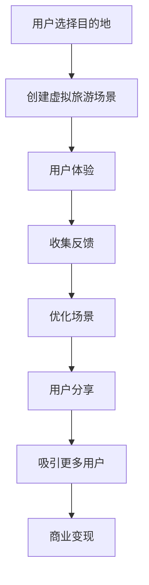

                 

# 虚拟现实旅游创业：足不出户的环球之旅

> 关键词：虚拟现实(VR), 增强现实(AR), 旅游, 创业, 用户体验, 沉浸式体验

## 1. 背景介绍

在数字化时代，随着互联网技术的迅猛发展，虚拟现实(VR)和增强现实(AR)技术已经从实验室走入大众生活，成为新一代数字体验的核心驱动力。VR和AR技术利用先进的3D建模、实时渲染、交互感知等技术，为用户提供身临其境的视觉、听觉、触觉等多感官沉浸式体验，极大地拓宽了人们的生活边界，尤其在旅游和娱乐领域，VR和AR应用前景广阔，商机无限。

本文章将从VR旅游创业的核心理念、市场机会、技术挑战以及如何构建成功的VR旅游产品等多个维度进行深入剖析，以期为有志于此领域的创业者提供有价值的参考。

## 2. 核心概念与联系

### 2.1 核心概念概述

在探讨VR旅游创业之前，我们需要先了解以下核心概念及其联系：

- **虚拟现实(Virtual Reality, VR)**：一种通过计算机生成的虚拟环境，使用户能够沉浸其中，获得身临其境的体验。
- **增强现实(Augmented Reality, AR)**：在现实世界中叠加虚拟信息，如3D模型、动画等，丰富用户的感知体验。
- **旅游(Tourism)**：人类利用闲暇时间离开居住地前往其他地区旅行或休闲的活动。
- **创业(Entrepreneurship)**：企业家创建并运营新企业，提供新产品或服务以满足市场需求。

以上概念紧密联系，VR和AR技术为旅游创业带来了全新视角，通过模拟真实的旅游场景，用户无需实际移动即可体验世界各地不同的风土人情。创业者可以利用这些技术开发出沉浸式、互动性强的旅游产品，满足用户追求新奇、放松、探险的需求，从而创造巨大的商业价值。

### 2.2 核心概念原理和架构的 Mermaid 流程图



这个流程图展示了VR旅游产品的核心流程：用户选择目的地并创建虚拟旅游场景，通过体验并收集反馈进行优化，最终用户分享体验并吸引更多用户参与，实现商业变现。

## 3. 核心算法原理 & 具体操作步骤

### 3.1 算法原理概述

VR旅游产品的核心算法主要包括两个方面：场景生成和用户交互。

**场景生成**：使用计算机图形学和三维建模技术，创建真实世界的虚拟场景。这涉及环境渲染、光影效果、角色动画等技术，需要使用高性能的3D建模软件和引擎，如Unity或Unreal Engine。

**用户交互**：实现用户与虚拟环境的互动，包括运动跟踪、手势识别、语音识别等。这需要先进的传感器技术，如头显、手柄、位置跟踪器等，以及强大的交互算法。

### 3.2 算法步骤详解

#### 3.2.1 场景生成

1. **数据采集与预处理**：收集目的地相关的地理位置、环境数据、文化资料等，进行预处理和整理，形成用于场景生成的基础数据集。

2. **三维建模**：使用3D建模软件，如Maya、Blender等，根据采集的数据创建虚拟场景。

3. **纹理贴图**：为模型添加真实世界的纹理和材质，使用贴图软件如Photoshop、Substance Painter等。

4. **渲染优化**：在3D引擎中设置光照、阴影、反射等参数，进行渲染优化，确保场景的视觉效果逼真流畅。

#### 3.2.2 用户交互

1. **传感器集成**：将头显、手柄、位置跟踪器等设备与计算平台集成，确保用户能自然地与虚拟环境互动。

2. **运动跟踪**：使用传感器获取用户的位置和姿态变化，实现虚拟角色或景物的同步移动。

3. **手势识别**：通过手势跟踪器，实时捕捉用户的手部动作，转化为虚拟操作指令。

4. **语音识别**：使用语音识别技术，捕捉用户语音指令，进行虚拟交互。

#### 3.2.3 算法优缺点

**优点**：
- **沉浸式体验**：VR和AR技术为用户提供高度沉浸的旅游体验，让用户仿佛身临其境，极大提升了旅游的趣味性和吸引力。
- **低成本体验**：用户无需支付高昂的交通、住宿费用，即可体验全球各地的美景和文化。
- **个性化定制**：根据用户的偏好和需求，提供个性化的旅游体验，满足不同用户群体的需求。

**缺点**：
- **技术门槛高**：VR和AR技术开发复杂，需要高水平的3D建模和渲染技术。
- **设备成本高**：高端VR设备价格昂贵，用户门槛较高。
- **网络依赖**：VR旅游产品通常需要高速稳定的网络连接，限制了部分用户群体。

### 3.4 算法应用领域

VR和AR技术在旅游领域的应用非常广泛，涵盖以下几个主要方向：

1. **虚拟旅游体验**：创建虚拟世界，让用户可以足不出户游遍全球。例如，用户可以进入虚拟巴黎，游览埃菲尔铁塔、卢浮宫等景点。

2. **虚拟导览**：结合AR技术，通过手机或智能眼镜，叠加虚拟导游信息，增强用户的游览体验。例如，用户在故宫漫步时，实时获取历史故事和文物信息。

3. **虚拟旅游培训**：利用VR技术，为旅游从业人员提供培训课程，模拟各种旅游场景，提升从业人员的实战能力。

4. **文化传承**：通过VR和AR技术，将历史文物、文化故事等数字化，实现文化的传承和保护。

## 4. 数学模型和公式 & 详细讲解 & 举例说明

### 4.1 数学模型构建

VR旅游产品的数学模型主要涉及三维空间建模和用户交互算法。以下是两个核心模型的构建：

**三维场景建模**：
- **点云模型**：用数学公式描述场景中每一个点的位置，公式为 $$P = (x, y, z)$$。
- **网格模型**：将三维场景划分为网格，每个网格由多个点组成，公式为 $$G = \{P_1, P_2, ..., P_n\}$$。

**用户交互模型**：
- **手势识别**：通过传感器采集手部动作数据，使用机器学习算法进行识别，公式为 $$H = \{a_1, a_2, ..., a_n\}$$，其中 $a_i$ 为手部动作向量。
- **语音识别**：将语音信号转化为文本，使用深度学习算法进行识别，公式为 $$L = \{w_1, w_2, ..., w_n\}$$，其中 $w_i$ 为语音文本。

### 4.2 公式推导过程

**点云模型推导**：
假设场景中有一个点 $P$，其坐标由三个分量 $x, y, z$ 组成，公式为：
$$P = (x, y, z)$$

**手势识别推导**：
假设手部动作向量 $H$ 包含 $n$ 个元素，每个元素 $a_i$ 表示手部在三维空间中的位置和姿态，公式为：
$$H = \{a_1, a_2, ..., a_n\}$$

**语音识别推导**：
假设语音文本 $L$ 包含 $m$ 个词 $w_i$，每个词 $w_i$ 由多个字母或符号组成，公式为：
$$L = \{w_1, w_2, ..., w_m\}$$

### 4.3 案例分析与讲解

以一个简单的虚拟故宫旅游体验为例：

**三维场景建模**：
- **数据采集**：采集故宫的地理位置、建筑风格、文物信息等。
- **模型创建**：在Unity中创建故宫的三维模型，添加真实纹理和材质。
- **渲染优化**：设置光照、阴影等参数，确保场景逼真流畅。

**用户交互模型**：
- **手势识别**：用户通过手势识别系统，模拟参观故宫，如触摸文物、旋转建筑等。
- **语音识别**：用户通过语音识别系统，获取故宫的历史故事和文化信息。

## 5. 项目实践：代码实例和详细解释说明

### 5.1 开发环境搭建

**5.1.1 硬件环境**：
- **VR设备**：Oculus Rift S、HTC Vive Pro等。
- **计算平台**：高性能PC，配备NVIDIA RTX显卡。
- **网络环境**：高速稳定的WiFi或有线网络连接。

**5.1.2 软件环境**：
- **3D建模工具**：Blender、Maya等。
- **渲染引擎**：Unity、Unreal Engine等。
- **手势识别库**：Leap Motion、OpenPose等。
- **语音识别库**：Google Cloud Speech-to-Text、Wit.ai等。

### 5.2 源代码详细实现

**5.2.1 三维场景创建**：
```python
import blender

# 创建3D模型
mesh = blender.Mesh()
mesh.add_vertex(x, y, z)
mesh.add_texture(color, normal)
```

**5.2.2 用户交互实现**：
```python
import leapmotion

# 连接手势跟踪器
handler = leapmotion.LeapMotionHandler()
handler.connect()

# 手势识别处理
hand = handler.get_hand()
if hand:
    position = hand.get_position()
    orientation = hand.get_orientation()
    # 处理手势动作
    ...

# 语音识别处理
speech = google.cloud.speech.SpeechClient()
audio = google.cloud.audio.RecognitionAudio(content=audio_data)
config = google.cloud.audio.RecognitionConfig(
    encoding=google.cloud.audio.RecognitionConfig.AudioEncoding.LINEAR16,
    language_code="zh-CN",
)
response = speech.recognize(config=config, audio=audio)
text = response.results[0].alternatives[0].transcript
# 处理语音文本
...
```

### 5.3 代码解读与分析

**三维场景创建**：
- 使用Blender等3D建模工具，创建虚拟故宫的网格模型，添加真实纹理和材质，并进行渲染优化。

**用户交互实现**：
- 通过Leap Motion等手势跟踪器获取用户的手部动作，转化为虚拟场景中的操作。
- 使用Google Cloud Speech-to-Text进行语音识别，获取用户指令，进行处理并输出。

### 5.4 运行结果展示

**三维场景**：
- 创建逼真的故宫虚拟场景，用户在虚拟环境中自由探索。

**用户交互**：
- 手势识别：用户可以模拟参观故宫，触摸文物、旋转建筑。
- 语音识别：用户获取故宫的历史故事和文化信息。

## 6. 实际应用场景

### 6.1 虚拟旅游体验

用户可以进入虚拟故宫，参观紫禁城、太和殿、乾清宫等著名景点，通过手势识别和语音识别进行互动，了解历史故事和文化背景。

### 6.2 虚拟导览

结合AR技术，用户在现实世界的故宫游览时，手机或智能眼镜上实时显示虚拟导游信息，如历史故事、文物介绍等，增强游览体验。

### 6.3 文化传承

通过VR和AR技术，将故宫的历史文物、文化故事数字化，实现文化的传承和保护，用户可以远程参观、学习，了解中国传统文化。

### 6.4 未来应用展望

未来，VR旅游将进一步普及，结合AI技术进行个性化推荐、情感分析等，提供更加精准的旅游体验。同时，随着技术的进步，VR设备成本将降低，更多人能够体验虚拟旅游的乐趣。

## 7. 工具和资源推荐

### 7.1 学习资源推荐

1. **《虚拟现实技术与应用》**：深入讲解VR和AR技术的原理和应用场景。
2. **《Unity游戏开发实战》**：详细阐述Unity引擎的使用方法和开发技巧。
3. **《机器学习与深度学习》**：帮助理解机器学习算法在VR旅游中的应用。
4. **《VR旅游设计与开发》**：系统介绍VR旅游产品的设计和开发流程。

### 7.2 开发工具推荐

1. **Unity**：强大的3D游戏和虚拟现实开发平台，提供丰富的工具和资源库。
2. **Unreal Engine**：顶尖的游戏引擎，支持高品质的3D渲染和交互效果。
3. **Leap Motion**：手势识别设备，适合开发手势交互功能。
4. **Google Cloud Speech-to-Text**：先进的语音识别服务，支持多种语言和方言。

### 7.3 相关论文推荐

1. **《三维场景渲染技术综述》**：详细介绍三维场景渲染的算法和应用。
2. **《手势识别算法综述》**：深入剖析手势识别技术的发展和应用。
3. **《虚拟现实旅游体验的心理学研究》**：探讨VR旅游对用户心理和行为的影响。

## 8. 总结：未来发展趋势与挑战

### 8.1 研究成果总结

本文探讨了VR旅游创业的核心理念、市场机会、技术挑战以及如何构建成功的VR旅游产品。通过理论分析与案例分析，全面介绍了VR旅游的实现过程和应用场景。

### 8.2 未来发展趋势

1. **技术进步**：随着技术的不断进步，VR设备将更加轻便、廉价，普及率将大幅提高。
2. **应用拓展**：VR和AR技术将进一步融入更多行业，如医疗、教育、军事等。
3. **用户体验优化**：结合AI技术，提供个性化、沉浸式、情感化的旅游体验。

### 8.3 面临的挑战

1. **技术门槛高**：VR和AR技术开发复杂，需要高水平的3D建模和渲染技术。
2. **设备成本高**：高端VR设备价格昂贵，用户门槛较高。
3. **内容缺乏**：高质量的VR旅游内容较少，制约了市场的快速扩张。

### 8.4 研究展望

1. **内容创新**：开发更多高质量、多样化的VR旅游内容，吸引用户参与。
2. **技术突破**：持续优化算法和硬件性能，降低开发和应用成本。
3. **市场推广**：加强市场宣传和用户教育，提升公众对VR旅游的认知和接受度。

## 9. 附录：常见问题与解答

**Q1: VR旅游的虚拟体验与实际旅游有何不同？**
A: VR旅游的虚拟体验虽然沉浸感强，但缺乏实际的社交互动和感官体验。实际旅游可以感受当地的氛围和文化的真实感，VR旅游更适合无法出行的人群。

**Q2: 如何评估VR旅游产品的质量？**
A: 从用户体验、技术实现、内容丰富度、互动性等多个维度进行评估。用户调研、满意度调查、技术评测等都是有效的评估手段。

**Q3: VR旅游创业的主要风险有哪些？**
A: 技术风险、市场风险、成本风险、用户接受度风险等。需要全面评估和规避这些风险，确保创业项目的顺利进行。

**Q4: VR旅游的未来发展趋势是什么？**
A: 随着技术的进步和市场的成熟，VR旅游将更普及、更便捷、更丰富，成为旅游产业的重要组成部分。

作者：禅与计算机程序设计艺术 / Zen and the Art of Computer Programming

