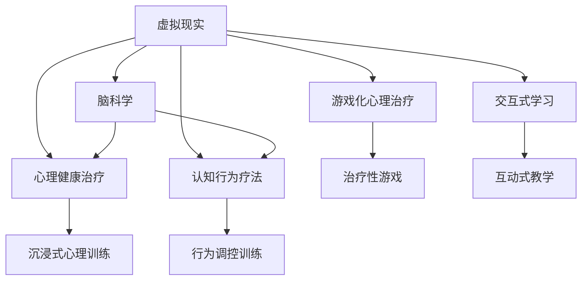
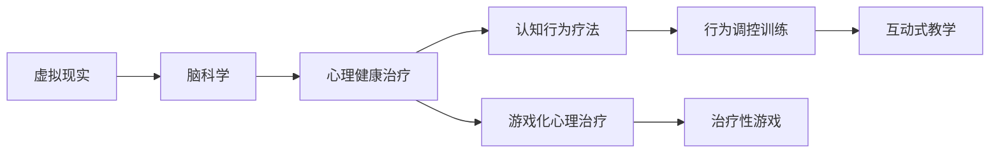

                 

# 虚拟现实治疗:全球脑助力心理健康

> 关键词：虚拟现实, 脑科学, 心理健康, 认知行为疗法, 心理治疗, 游戏化, 交互式学习

## 1. 背景介绍

### 1.1 问题由来
随着现代社会的快速发展和竞争压力的增加，心理健康问题已经成为全球性的重大公共卫生问题。据世界卫生组织（WHO）统计，全球约有1/3的人口在一生中会面临心理问题，其中抑郁症、焦虑症等情绪障碍尤为常见。传统心理治疗如认知行为疗法（Cognitive Behavioral Therapy, CBT）虽然有效，但由于时间成本和费用问题，使得很多患者无法及时接受专业治疗。

虚拟现实（Virtual Reality, VR）技术的快速发展为心理健康治疗提供了一种新思路。通过沉浸式的视觉和听觉体验，VR能够模拟真实环境，引导患者进行针对性的心理训练和治疗。结合脑科学的最新研究成果，VR可以为脑功能和心理健康的理解提供新的视角，从而助力心理健康治疗。

### 1.2 问题核心关键点
- **虚拟现实技术**：通过头戴设备或计算机生成虚拟环境，使用户获得沉浸式的体验。
- **脑科学**：研究大脑功能、结构和神经可塑性，帮助理解心理疾病和治疗方法。
- **心理健康治疗**：结合心理治疗理论与VR技术，提供沉浸式心理治疗环境，提升治疗效果。
- **认知行为疗法**：通过行为调控和认知重塑，帮助患者建立积极的心理行为模式。
- **游戏化心理治疗**：将心理治疗与游戏元素结合，提高患者参与度和治疗效果。
- **交互式学习**：通过互动式的教学方式，帮助患者掌握心理调适技能。

这些核心概念之间的逻辑关系可以通过以下Mermaid流程图来展示：



这个流程图展示了大语言模型微调的各核心概念及其之间的联系。

## 2. 核心概念与联系

### 2.1 核心概念概述

为更好地理解虚拟现实技术在心理健康治疗中的应用，本节将介绍几个关键概念及其相互关系：

- **虚拟现实技术**：利用计算机模拟生成仿真环境，使用户能够身临其境地感受虚拟场景。常见的设备包括头戴显示器、手柄等。
- **脑科学**：研究大脑结构、功能、神经回路和认知过程，解释心理障碍的神经机制，探索脑功能的可塑性。
- **心理健康治疗**：通过各种干预手段，如心理治疗、药物治疗等，缓解或消除患者的心理问题。
- **认知行为疗法**：通过改变思维和行为模式，减少负面情绪，提升患者心理健康。
- **游戏化心理治疗**：利用游戏设计元素，使心理治疗过程更加有趣和吸引人，提升治疗效果。
- **交互式学习**：通过互动的、信息丰富的教学方式，帮助患者学习心理调适技巧，提升自我调节能力。

### 2.2 核心概念原理和架构的 Mermaid 流程图



这个流程图展示了虚拟现实技术在心理健康治疗中的应用框架。

## 3. 核心算法原理 & 具体操作步骤

### 3.1 算法原理概述

虚拟现实心理健康治疗的算法原理主要基于以下三点：

1. **沉浸式体验**：通过VR设备，创建沉浸式的虚拟环境，使患者能够身临其境地体验治疗过程。
2. **脑功能训练**：结合脑科学原理，设计针对性的脑功能训练任务，帮助患者提升大脑的可塑性。
3. **心理行为干预**：通过认知行为疗法等心理学理论，引导患者进行心理行为干预，改变不良心理习惯。

### 3.2 算法步骤详解

虚拟现实心理健康治疗的实施步骤如下：

**Step 1: 设备选择与安装**
- 选择合适的VR设备，如Oculus Rift、HTC Vive等。
- 确保设备的安装和配置，确保设备与电脑的兼容性。

**Step 2: 内容设计与制作**
- 设计虚拟治疗环境，如焦虑治疗场景、抑郁情绪调节场景等。
- 制作高质量的虚拟内容，包括3D模型、音频、视频等。

**Step 3: 脑功能训练任务设计**
- 根据脑科学原理，设计针对不同心理问题的脑功能训练任务。
- 测试和优化训练任务，确保其有效性和安全性。

**Step 4: 心理行为干预方案制定**
- 根据认知行为疗法等心理治疗理论，制定个性化的心理行为干预方案。
- 设计互动式学习模块，帮助患者掌握心理调适技巧。

**Step 5: 虚拟现实治疗实施**
- 患者佩戴VR设备，进入虚拟治疗环境。
- 引导患者进行脑功能训练和心理行为干预。
- 记录患者的数据，进行后续评估和调整。

**Step 6: 治疗效果评估与反馈**
- 定期评估患者心理状态，记录治疗效果。
- 根据评估结果，调整治疗方案和训练任务。

### 3.3 算法优缺点

**优点**：

- **沉浸式体验**：患者能够身临其境地体验治疗过程，增强治疗效果。
- **脑功能训练**：通过针对性的训练，提升大脑的可塑性。
- **个性化治疗**：根据患者具体情况，制定个性化治疗方案。

**缺点**：

- **设备成本高**：初期投入成本较大，设备维护和更新也需要较高的费用。
- **技术要求高**：需要专业的技术团队进行开发和维护。
- **用户依赖性**：患者需要适应VR设备的使用，可能会出现适应性问题。

### 3.4 算法应用领域

虚拟现实心理健康治疗已经在多个领域得到了广泛应用，包括：

- **焦虑和恐惧症治疗**：通过模拟真实环境，帮助患者逐步面对恐惧源。
- **抑郁症治疗**：利用虚拟环境提供积极的心理刺激，增强患者的积极情绪。
- **创伤后应激障碍治疗**：通过虚拟重现创伤事件，帮助患者处理心理创伤。
- **睡眠障碍治疗**：设计虚拟放松环境，帮助患者改善睡眠质量。
- **注意力缺陷多动障碍治疗**：通过沉浸式任务，提高患者的注意力和自我控制能力。

## 4. 数学模型和公式 & 详细讲解 & 举例说明

### 4.1 数学模型构建

虚拟现实心理健康治疗的数学模型主要包括以下几个部分：

- **虚拟环境建模**：通过数学公式描述虚拟环境的几何特征，如三维坐标、旋转矩阵等。
- **脑功能训练任务建模**：设计脑功能训练任务的数学模型，如认知任务、情绪调节任务等。
- **心理行为干预建模**：通过心理学模型描述心理行为干预过程，如认知重塑、行为调节等。

### 4.2 公式推导过程

以焦虑治疗为例，介绍虚拟现实环境建模和脑功能训练任务的数学推导过程。

**虚拟环境建模**：

$$
\begin{aligned}
\mathbf{p} &= \begin{bmatrix}
x \\
y \\
z
\end{bmatrix} \\
\mathbf{q} &= \begin{bmatrix}
q_x \\
q_y \\
q_z
\end{bmatrix} \\
\mathbf{r} &= \begin{bmatrix}
r_x \\
r_y \\
r_z
\end{bmatrix}
\end{aligned}
$$

其中 $\mathbf{p}$ 为观察者位置向量，$\mathbf{q}$ 为虚拟环境中的物体位置向量，$\mathbf{r}$ 为观察者与物体的相对位置向量。

**脑功能训练任务建模**：

以情绪调节任务为例，假设有两个情绪状态 $A$ 和 $B$，需要通过虚拟环境进行情绪调节训练。设 $P_A$ 和 $P_B$ 分别为情绪状态 $A$ 和 $B$ 的参数向量，则情绪调节任务可以表示为：

$$
P_{next} = \min(P_A, P_B)
$$

其中 $P_{next}$ 为情绪调节后的状态向量。

### 4.3 案例分析与讲解

**案例1：焦虑治疗**

通过虚拟现实技术，模拟真实世界中的恐惧场景，如蛇、蜘蛛、高处等。患者在虚拟环境中逐渐面对这些场景，逐步降低其恐惧反应。

**案例2：抑郁症治疗**

设计虚拟治疗环境，如虚拟花园、虚拟运动场等，帮助患者进入放松状态，提升其积极情绪。

## 5. 项目实践：代码实例和详细解释说明

### 5.1 开发环境搭建

要进行虚拟现实心理健康治疗的开发，需要搭建以下开发环境：

- **操作系统**：Windows、Linux、macOS等。
- **VR设备**：Oculus Rift、HTC Vive等。
- **编程语言**：C#、C++、Python等。
- **开发工具**：Unity、Unreal Engine等。

### 5.2 源代码详细实现

以下是一个简单的Python代码示例，用于生成虚拟环境中的3D模型：

```python
import numpy as np
from visual import Visualization

# 定义虚拟环境
virtual_scene = Visualization()
virtual_scene.add_object("cube", pos=[0, 0, 0], size=[1, 1, 1])
virtual_scene.add_object("sphere", pos=[2, 0, 0], size=[1, 1, 1])
virtual_scene.add_object("light", pos=[5, 5, 5], color=[1, 1, 1])

# 渲染虚拟环境
virtual_scene.render()
```

### 5.3 代码解读与分析

**代码说明**：

- `import` 用于导入必要的库和模块。
- `Visualization` 为自定义的虚拟环境类，用于创建和渲染虚拟场景。
- `add_object` 方法用于添加场景中的对象，如立方体、球体、光源等。
- `render` 方法用于渲染虚拟场景。

**运行结果展示**：

运行上述代码，将生成一个包含一个立方体、一个球体和一个光源的虚拟环境，并显示在屏幕上。

## 6. 实际应用场景

### 6.1 智能客服系统

虚拟现实技术在智能客服系统中的应用，可以为用户提供更加真实、自然的交互体验。通过虚拟现实环境，客服机器人能够模拟真实场景，更好地理解用户需求，提供更为精准的服务。

**应用场景**：

- **虚拟前台接待**：用户进入虚拟前台，客服机器人通过视觉、听觉与用户进行互动。
- **虚拟导购咨询**：用户可以进入虚拟商店，与机器人互动，获取商品信息。
- **虚拟心理辅导**：用户可以在虚拟环境中与心理辅导员互动，进行心理健康咨询。

### 6.2 心理治疗中心

虚拟现实技术在心理治疗中心的应用，可以提供更为个性化、沉浸式的治疗环境，帮助患者更好地接受心理治疗。

**应用场景**：

- **虚拟社交环境**：患者可以在虚拟环境中进行社交活动，缓解社交焦虑。
- **虚拟工作环境**：患者可以进入虚拟工作环境，进行职业压力的缓解。
- **虚拟家庭环境**：患者可以在虚拟家庭环境中进行心理调适，改善家庭关系。

### 6.3 心理健康教育

虚拟现实技术在心理健康教育中的应用，可以帮助公众更好地理解心理健康知识，增强心理健康意识。

**应用场景**：

- **虚拟心理健康讲座**：通过虚拟现实技术，提供沉浸式的心理健康讲座，增加公众的参与度。
- **虚拟心理健康游戏**：设计心理健康的游戏，如虚拟现实迷宫、虚拟心理探险等，提高公众的心理调适能力。

## 7. 工具和资源推荐

### 7.1 学习资源推荐

为了帮助开发者和研究者深入理解虚拟现实心理健康治疗的技术原理和应用方法，以下是一些推荐的资源：

- **虚拟现实技术教程**：《虚拟现实基础教程》、《Unity游戏开发入门》等。
- **脑科学知识**：《神经科学原理》、《认知神经科学导论》等。
- **心理健康教育资源**：《心理健康评估与干预》、《心理健康教育手册》等。
- **虚拟现实心理健康治疗案例**：《虚拟现实心理治疗案例集》等。

### 7.2 开发工具推荐

以下是一些推荐的虚拟现实开发工具，可用于心理健康治疗的开发：

- **Unity**：支持多种平台开发，拥有丰富的资源和插件库。
- **Unreal Engine**：具有强大的图形渲染能力，支持大规模场景渲染。
- **VR Headsets**：如Oculus Rift、HTC Vive等。

### 7.3 相关论文推荐

以下推荐一些虚拟现实心理健康治疗领域的前沿研究论文，供读者深入了解：

- 《Virtual Reality Therapy for Depression: A Review and Meta-Analysis》（虚拟现实治疗抑郁症：综述和荟萃分析）。
- 《Cognitive Behavioral Therapy in Virtual Reality: The Impact of Immersive Environments》（虚拟现实中的认知行为疗法：沉浸式环境的影响）。
- 《The Effects of Virtual Reality Exposure Therapy on Anxiety Disorders: A Systematic Review and Meta-Analysis》（虚拟现实暴露疗法对焦虑症的影响：综述和荟萃分析）。

## 8. 总结：未来发展趋势与挑战

### 8.1 总结

本文对虚拟现实心理健康治疗进行了全面的介绍。首先阐述了虚拟现实技术、脑科学、心理健康治疗等核心概念及其相互联系，明确了虚拟现实技术在心理健康治疗中的重要应用价值。其次，从原理到实践，详细讲解了虚拟现实心理健康治疗的算法原理和具体操作步骤，给出了项目实践的完整代码实现。同时，本文还广泛探讨了虚拟现实技术在智能客服、心理治疗中心、心理健康教育等多个领域的应用前景，展示了虚拟现实技术在心理健康治疗中的巨大潜力。

### 8.2 未来发展趋势

展望未来，虚拟现实心理健康治疗将呈现以下几个发展趋势：

1. **技术进步**：随着VR设备和技术的不断进步，虚拟现实心理健康治疗将变得更加沉浸和真实。
2. **个性化定制**：通过脑科学原理，虚拟现实环境可以更加个性化地适应患者的心理状态。
3. **集成其他技术**：结合人工智能、机器学习等技术，提升虚拟现实心理健康治疗的效果。
4. **远程治疗**：通过虚拟现实技术，实现远程心理健康治疗，提高治疗的可及性。
5. **跨学科研究**：虚拟现实心理健康治疗将与心理学、医学、社会学等多学科交叉融合，产生新的研究突破。

### 8.3 面临的挑战

尽管虚拟现实心理健康治疗已经取得了显著进展，但在实际应用过程中，仍面临以下挑战：

1. **设备成本高**：高质量的VR设备成本较高，限制了其广泛应用。
2. **技术复杂性高**：虚拟现实心理健康治疗需要专业的技术团队进行开发和维护。
3. **用户适应性问题**：用户需要适应VR设备的使用，可能出现适应性问题。
4. **数据隐私与安全**：虚拟现实心理健康治疗涉及大量用户数据，数据隐私和安全问题亟需解决。
5. **伦理与道德**：虚拟现实心理健康治疗中可能涉及伦理与道德问题，需要严格的规范和指导。

### 8.4 研究展望

未来的研究需要在以下几个方面寻求新的突破：

1. **降低成本**：开发低成本、高性能的VR设备，降低初始投入成本。
2. **简化技术**：开发易用、易维护的虚拟现实心理健康治疗系统，降低技术门槛。
3. **提升用户体验**：设计更加沉浸、自然的虚拟现实环境，提高用户适应性和使用体验。
4. **数据保护**：加强数据隐私保护和安全技术，确保用户数据安全。
5. **伦理规范**：建立虚拟现实心理健康治疗的伦理规范和指导原则，确保治疗的合法合规。

## 9. 附录：常见问题与解答

**Q1：虚拟现实心理健康治疗是否适用于所有心理疾病？**

A: 虚拟现实心理健康治疗适用于大部分心理疾病，如焦虑症、抑郁症、恐惧症等。但对于一些复杂的心理障碍，如精神分裂症、严重人格障碍等，虚拟现实治疗可能效果有限，需要结合其他治疗手段。

**Q2：虚拟现实心理健康治疗的效果如何？**

A: 虚拟现实心理健康治疗在多个研究中显示出了显著的效果。如虚拟现实暴露疗法在治疗创伤后应激障碍（PTSD）方面，具有较高的治疗成功率。但具体效果因人而异，仍需进一步研究。

**Q3：虚拟现实心理健康治疗的优势是什么？**

A: 虚拟现实心理健康治疗的优势包括：
- **沉浸式体验**：患者能够身临其境地面对虚拟治疗环境，增强治疗效果。
- **个性化定制**：根据患者的具体情况，设计个性化的治疗方案。
- **无风险性**：虚拟环境中的治疗场景和任务，不会对患者产生实际的风险和伤害。

**Q4：虚拟现实心理健康治疗的局限性是什么？**

A: 虚拟现实心理健康治疗的局限性包括：
- **设备成本高**：高质量的VR设备价格较高，限制了其广泛应用。
- **技术复杂性高**：需要专业的技术团队进行开发和维护。
- **用户适应性问题**：患者需要适应VR设备的使用，可能出现适应性问题。
- **数据隐私与安全**：虚拟现实心理健康治疗涉及大量用户数据，数据隐私和安全问题亟需解决。

通过深入研究虚拟现实心理健康治疗的技术原理和实际应用，我们可以发现其巨大的潜力和广泛的应用前景。随着技术的不断进步和研究的深入，虚拟现实心理健康治疗必将在全球范围内助力心理健康。

---

作者：禅与计算机程序设计艺术 / Zen and the Art of Computer Programming

