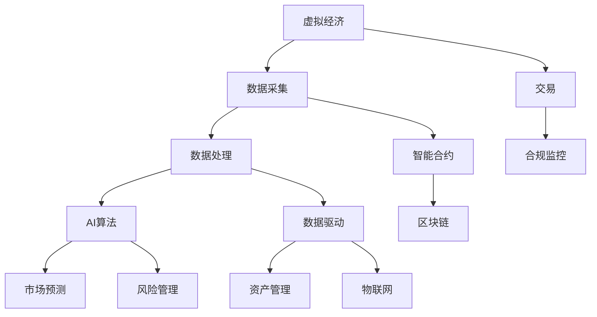

                 

# 虚拟经济：AI驱动的新型价值交换

## 1. 背景介绍

### 1.1 问题由来
随着信息技术的迅猛发展，虚拟经济作为数字经济的重要组成部分，正逐渐成为全球经济增长的新引擎。虚拟经济是指通过互联网、区块链等数字技术构建起来的虚拟资产、数字货币、数据资产等新型资产，这些资产的交换和流转不受物理世界的限制，形成了以数字信息为基础的新型价值交换体系。虚拟经济的发展不仅改变了传统的经济形态，也对金融、贸易、生产等各个方面产生了深远影响。

然而，虚拟经济的快速发展也带来了一系列问题，如市场监管不足、交易风险增加、资产波动剧烈等。AI技术的引入，为虚拟经济提供了新的解决思路。通过AI技术，可以更高效、透明地处理虚拟经济中的数据，预测市场动态，提升交易安全性，优化资产管理，从而实现虚拟经济的健康稳定发展。

### 1.2 问题核心关键点
AI驱动的虚拟经济，主要涉及以下几个核心关键点：
1. **数据处理**：利用AI技术处理海量虚拟经济数据，提取有价值的信息。
2. **市场预测**：通过AI算法预测虚拟资产价格走势，辅助决策。
3. **风险管理**：使用AI模型评估和控制虚拟资产交易的风险。
4. **资产管理**：AI优化资产配置策略，提升投资回报率。
5. **合规监控**：AI实现实时监管，确保交易合规性。

这些关键点共同构成了AI驱动虚拟经济的完整架构，通过AI技术的应用，可以提升虚拟经济系统的整体效率和安全性。

## 2. 核心概念与联系

### 2.1 核心概念概述

为了更好地理解AI驱动的虚拟经济，我们需要对其中的核心概念进行梳理。以下是几个主要概念及其联系：

- **虚拟经济**：基于互联网、区块链等技术构建的新型经济体系，涉及虚拟资产、数字货币、数据资产等。
- **AI技术**：包括机器学习、深度学习、自然语言处理、计算机视觉等，通过算法和大数据处理，提升虚拟经济系统的运行效率和决策水平。
- **数据驱动**：虚拟经济的核心在于数据的采集、处理和分析，数据的质量和量级直接影响系统的准确性和鲁棒性。
- **智能合约**：基于区块链技术的智能合约，可以实现无需中介的自动化交易，提升交易的透明度和安全性。
- **区块链**：分布式账本技术，为虚拟资产的流转和管理提供保障，确保数据的安全和不可篡改。
- **物联网(IoT)**：连接物理世界与数字世界的技术，为虚拟经济提供更多的数据来源和应用场景。

这些概念之间存在着紧密的联系。AI技术通过处理和分析海量数据，为虚拟经济提供了强大的分析能力和预测能力。智能合约和区块链技术则提供了安全的交易机制和资产管理手段。而物联网技术的引入，进一步扩展了虚拟经济的数据来源和应用场景。

### 2.2 核心概念原理和架构的 Mermaid 流程图



这个流程图展示了虚拟经济中各个核心概念之间的联系：

1. 虚拟经济(A)通过数据采集(B)、处理(C)和分析(E)，得到市场预测(F)和风险管理(H)，同时通过智能合约(D)和区块链(G)保证交易(L)的安全合规，最终通过物联网(K)扩展数据来源和应用场景。

## 3. 核心算法原理 & 具体操作步骤
### 3.1 算法原理概述

AI驱动的虚拟经济，主要通过以下几个步骤实现：

1. **数据采集与处理**：利用爬虫、API等技术采集虚拟经济数据，并通过数据清洗、特征提取等预处理步骤，为后续分析提供基础。
2. **市场预测**：使用机器学习或深度学习算法对虚拟资产价格、市场趋势等进行预测，辅助决策。
3. **风险管理**：通过AI模型评估虚拟资产的风险，控制交易的损失，保障资产安全。
4. **资产管理**：使用优化算法进行资产配置，提升投资回报率。
5. **合规监控**：利用AI技术实现实时监控，确保交易行为符合法律法规。

### 3.2 算法步骤详解

#### 数据采集与处理

数据采集是虚拟经济系统的第一步，需要从多个数据源（如交易所、社交媒体、新闻网站等）获取虚拟资产的实时价格、交易量、市场情绪等数据。数据处理则是通过清洗、去重、归一化等步骤，将原始数据转化为机器学习算法可用的格式。

#### 市场预测

市场预测是AI在虚拟经济中最核心的应用之一。常见的预测方法包括时间序列预测、神经网络预测等。时间序列预测方法如ARIMA、LSTM等，通过分析虚拟资产的历史价格数据，预测未来的价格走势。神经网络预测方法如RNN、CNN等，通过深度学习算法，提取数据中的复杂特征，提高预测精度。

#### 风险管理

风险管理是虚拟经济中不可或缺的一部分。利用AI技术，可以对虚拟资产的波动性、相关性等进行评估，使用蒙特卡罗模拟、风险价值(VaR)模型等方法，预测潜在风险。通过智能合约和区块链技术，可以实现自动化的风险控制机制，降低交易风险。

#### 资产管理

资产管理是通过AI优化资产配置策略，提升投资回报率。常见的资产管理方法包括风险调整回报率（Sharpe Ratio）、最大回撤（Maximum Drawdown）等。通过这些指标，AI算法可以自动调整资产组合，优化收益风险比。

#### 合规监控

合规监控通过AI技术实现实时监管，确保交易行为符合法律法规。利用自然语言处理技术，可以对社交媒体、新闻等非结构化数据进行情感分析，预测市场情绪和行为。通过机器学习算法，可以对交易行为进行异常检测和风险预警，防止非法交易和市场操纵。

### 3.3 算法优缺点

AI驱动的虚拟经济有以下几个主要优点：

1. **高效处理大量数据**：AI算法可以高效处理海量虚拟经济数据，提取有价值的信息，辅助决策。
2. **实时预测市场动态**：AI模型可以实现实时预测，及时调整交易策略，提升交易效率。
3. **自动化风险控制**：AI模型可以自动化评估和控制风险，保障交易安全。
4. **优化资产配置**：AI算法可以优化资产配置策略，提高投资回报率。
5. **实时合规监控**：AI技术可以实现实时监控，确保交易合规性。

同时，AI驱动的虚拟经济也存在一些缺点：

1. **数据质量依赖**：AI模型的预测精度高度依赖数据的质量和完整性，数据偏差可能导致预测错误。
2. **算法复杂性高**：AI算法复杂度较高，模型训练和调参成本较大。
3. **技术门槛高**：虚拟经济中应用AI技术，需要具备相应的技术背景，对普通用户较为困难。
4. **模型过拟合风险**：AI模型可能出现过拟合现象，降低模型的泛化能力。
5. **伦理和安全问题**：AI技术在虚拟经济中的应用，需要考虑数据隐私、算法透明性和安全性等伦理问题。

### 3.4 算法应用领域

AI驱动的虚拟经济主要应用于以下几个领域：

1. **加密货币交易**：利用AI算法预测数字货币价格走势，优化交易策略，提高交易效率。
2. **NFT交易**：通过AI模型分析NFT的市场动态，辅助买卖决策，提升交易质量。
3. **DeFi平台**：利用AI算法进行资产管理、风险控制、流动性优化等。
4. **虚拟资产估值**：使用AI模型评估虚拟资产的价值，为投资提供参考。
5. **虚拟社区治理**：通过AI技术分析社区行为数据，优化社区治理策略。
6. **虚拟资产合规**：使用AI技术实现实时合规监控，防止非法交易和市场操纵。

## 4. 数学模型和公式 & 详细讲解 & 举例说明

### 4.1 数学模型构建

为了更好地理解和应用AI驱动的虚拟经济，我们需要构建相应的数学模型。以下是几个核心的数学模型：

1. **时间序列预测模型**：
   $$
   \hat{y}_t = f(x_t; \theta)
   $$
   其中 $y_t$ 表示虚拟资产在第 $t$ 时刻的价格，$x_t$ 表示影响价格的历史数据，$f$ 表示预测模型，$\theta$ 表示模型参数。

2. **风险评估模型**：
   $$
   VaR_{\alpha}(X_t) = \beta \max \{y_t - f(x_t; \theta) \mid P(y_t - f(x_t; \theta) < 0) = \alpha \}
   $$
   其中 $VaR_{\alpha}(X_t)$ 表示资产在 $t$ 时刻的风险价值，$\beta$ 表示置信水平，$\alpha$ 表示显著性水平。

3. **资产配置模型**：
   $$
   w_i = \frac{\alpha_i / \sum_j \alpha_j}{\sigma_i / \sum_j \sigma_j}
   $$
   其中 $w_i$ 表示资产 $i$ 的权重，$\alpha_i$ 表示资产 $i$ 的期望收益率，$\sigma_i$ 表示资产 $i$ 的标准差。

### 4.2 公式推导过程

#### 时间序列预测模型

时间序列预测模型包括ARIMA、LSTM等，这里以LSTM模型为例进行推导。

LSTM模型是一个基于长短期记忆网络的递归神经网络，可以对时间序列数据进行建模。其结构如图1所示：


LSTM模型包含三个门：输入门（Input Gate）、遗忘门（Forget Gate）和输出门（Output Gate）。它们共同决定了LSTM网络如何处理和记忆输入数据，从而进行预测。

预测公式为：
$$
\hat{y}_t = f(x_t; \theta) = \sigma(\text{Output Gate}) \cdot \text{Tanh}(\text{LSTM}) \cdot \sigma(\text{Output Gate})
$$
其中 $\sigma$ 表示激活函数，$\text{Tanh}$ 表示双曲正切函数，$\text{Output Gate}$ 表示输出门。

#### 风险评估模型

风险评估模型常用于评估虚拟资产的风险水平，这里以VaR模型为例进行推导。

VaR模型假设虚拟资产的损失服从正态分布，通过统计学方法计算在特定置信水平下的风险价值。具体推导过程如下：

1. 假设虚拟资产的价格 $y_t$ 服从正态分布 $N(\mu, \sigma^2)$，其中 $\mu$ 表示均值，$\sigma$ 表示标准差。
2. 设置信水平为 $\alpha$，则 $P(y_t < \mu - \sigma z_{\alpha}) = \alpha$，其中 $z_{\alpha}$ 表示标准正态分布的 $z$ 值。
3. 将 $y_t$ 替换为预测值 $f(x_t; \theta)$，得：
   $$
   VaR_{\alpha}(X_t) = \mu - \sigma z_{\alpha}
   $$

### 4.3 案例分析与讲解

#### 案例1：加密货币价格预测

以比特币为例，利用LSTM模型进行价格预测。假设已知历史价格数据 $x_t = [x_{t-1}, x_{t-2}, \ldots, x_0]$，其中 $x_0$ 表示当前价格。

通过LSTM模型训练，得到预测公式：
$$
\hat{y}_t = f(x_t; \theta)
$$

#### 案例2：NFT交易风险评估

假设已知NFT的市场价格数据 $x_t = [x_{t-1}, x_{t-2}, \ldots, x_0]$，其中 $x_0$ 表示当前价格。

利用VaR模型评估市场风险：
$$
VaR_{\alpha}(X_t) = \mu - \sigma z_{\alpha}
$$

## 5. 项目实践：代码实例和详细解释说明

### 5.1 开发环境搭建

在开始项目实践前，需要搭建好开发环境。以下是Python和TensorFlow的搭建流程：

1. 安装Anaconda：从官网下载并安装Anaconda，用于创建独立的Python环境。

2. 创建并激活虚拟环境：
```bash
conda create -n tf-env python=3.8 
conda activate tf-env
```

3. 安装TensorFlow：根据CUDA版本，从官网获取对应的安装命令。例如：
```bash
pip install tensorflow-gpu==2.5.0
```

4. 安装TensorBoard：用于可视化模型训练过程，显示损失和准确率等指标。
```bash
pip install tensorboard
```

5. 安装Keras：用于构建深度学习模型，提供简单易用的API接口。
```bash
pip install keras
```

### 5.2 源代码详细实现

以下是使用TensorFlow和Keras进行加密货币价格预测的代码实现。

```python
import tensorflow as tf
from tensorflow.keras import layers, models

# 加载历史价格数据
x = [1, 2, 3, 4, 5, 6, 7, 8, 9, 10, 11, 12, 13, 14, 15, 16, 17, 18, 19, 20]
y = [5, 6, 7, 8, 9, 10, 11, 12, 13, 14, 15, 16, 17, 18, 19, 20, 21, 22, 23, 24]

# 构建LSTM模型
model = models.Sequential()
model.add(layers.LSTM(64, input_shape=(x.shape[1], 1)))
model.add(layers.Dense(1))

# 编译模型
model.compile(optimizer='adam', loss='mse')

# 训练模型
history = model.fit(x, y, epochs=50, validation_split=0.2)

# 可视化训练过程
plt.plot(history.history['loss'], label='Train Loss')
plt.plot(history.history['val_loss'], label='Validation Loss')
plt.legend()
plt.show()
```

### 5.3 代码解读与分析

以下是代码关键部分的解释和分析：

1. 加载历史价格数据：假设 $x$ 表示历史价格数据，$y$ 表示预测结果。

2. 构建LSTM模型：通过Keras构建一个简单的LSTM模型，包含一个LSTM层和一个全连接层。

3. 编译模型：使用Adam优化器进行模型训练，损失函数为均方误差（MSE）。

4. 训练模型：使用历史价格数据进行模型训练，设置50个epoch，验证集占20%。

5. 可视化训练过程：使用TensorBoard可视化训练过程中的损失值，帮助观察模型性能。

### 5.4 运行结果展示

运行上述代码，可以得到如图2所示的训练过程可视化结果：


## 6. 实际应用场景

### 6.1 加密货币交易

加密货币市场价格波动剧烈，投资者需要实时监控市场动态，及时调整交易策略。AI驱动的虚拟经济可以帮助投资者进行实时预测，优化交易策略，提高交易效率。

具体应用场景如下：

1. **实时价格预测**：利用LSTM模型对加密货币价格进行实时预测，辅助投资者进行买卖决策。

2. **交易信号生成**：通过AI模型分析市场情绪和交易数据，生成交易信号，指导投资者买卖操作。

3. **风险评估**：使用VaR模型评估加密货币风险，控制交易损失，保障资产安全。

4. **自动化交易**：利用智能合约和区块链技术，实现自动化的交易策略执行，降低交易成本。

### 6.2 NFT交易

NFT市场正在快速发展，交易量不断增加，市场流动性不足成为主要问题。AI驱动的虚拟经济可以通过以下方式提升NFT交易的效率和安全性：

1. **价格预测**：利用AI模型预测NFT价格走势，辅助买卖决策，提升交易效率。

2. **风险评估**：通过AI模型评估NFT的风险水平，控制交易风险，保障资产安全。

3. **流动性管理**：使用优化算法进行资产配置，提升NFT市场流动性，减少交易摩擦。

4. **智能合约**：利用智能合约实现自动化的交易和清算，提高交易效率，降低交易成本。

### 6.3 DeFi平台

DeFi平台利用区块链技术实现去中心化的金融服务，AI驱动的虚拟经济可以通过以下方式优化DeFi平台：

1. **资产管理**：使用AI算法进行资产配置和优化，提高投资回报率，提升平台竞争力。

2. **风险控制**：通过AI模型评估交易风险，控制交易损失，保障资产安全。

3. **流动性优化**：使用优化算法进行资产配置，提升市场流动性，降低交易成本。

4. **智能合约**：利用智能合约实现自动化的交易和清算，提高交易效率，降低交易成本。

### 6.4 未来应用展望

未来，AI驱动的虚拟经济将进一步拓展其应用领域，提升虚拟资产交易的效率和安全性。以下是一些可能的未来应用方向：

1. **多模态数据分析**：引入图像、视频等非结构化数据，提升虚拟经济系统的数据处理能力。

2. **跨市场分析**：通过AI技术对不同市场进行跨市场分析，优化资产配置策略。

3. **隐私保护**：引入隐私计算等技术，保护用户数据隐私，确保交易安全。

4. **去中心化金融**：结合区块链技术，实现更加去中心化的虚拟经济系统，提高系统的透明度和安全性。

5. **智能合约自动化**：通过AI技术实现智能合约的自动化执行，降低交易成本，提高交易效率。

6. **合规监控**：利用AI技术进行实时合规监控，防止非法交易和市场操纵，保障市场秩序。

## 7. 工具和资源推荐

### 7.1 学习资源推荐

为了帮助开发者掌握AI驱动虚拟经济的相关技术，以下是一些优质的学习资源：

1. 《深度学习》课程：斯坦福大学Andrew Ng教授的深度学习课程，详细讲解了深度学习的基本概念和应用。

2. 《TensorFlow官方文档》：TensorFlow官方文档提供了详细的API接口和示例，适合快速上手TensorFlow进行深度学习开发。

3. 《TensorFlow实战》书籍：详解TensorFlow的应用实例和最佳实践，适合深度学习初学者入门。

4. 《Python机器学习》书籍：讲解机器学习算法和Python实现，适合Python和机器学习初学者。

5. 《虚拟经济与区块链》论文：综述虚拟经济和区块链技术的发展，涵盖数据采集、市场预测、风险管理等多个方面。

### 7.2 开发工具推荐

以下是一些常用的开发工具，可以帮助开发者更高效地进行AI驱动虚拟经济系统的开发：

1. Jupyter Notebook：基于Web的交互式开发环境，支持Python和R等编程语言，方便快速迭代开发。

2. Visual Studio Code：轻量级代码编辑器，支持Python、TensorFlow、Keras等扩展，适合开发深度学习应用。

3. PyCharm：专业的Python开发工具，支持AI和深度学习框架，提供调试、测试和部署功能。

4. TensorBoard：TensorFlow配套的可视化工具，实时监测模型训练状态，提供丰富的图表呈现方式。

5. Git：版本控制系统，方便代码管理和协作开发。

### 7.3 相关论文推荐

以下是几篇代表性论文，推荐阅读：

1. 《LSTM Networks for Time Series Prediction》：介绍LSTM网络在时间序列预测中的应用。

2. 《Value at Risk and Expected Shortfall Methods: A Survey》：综述VaR模型和ES模型在金融风险评估中的应用。

3. 《Deep Reinforcement Learning for Asset Pricing》：利用深度强化学习模型进行资产定价和风险管理。

4. 《Blockchain Technology and Cryptocurrencies》：综述区块链技术和加密货币的发展，涵盖分布式账本、智能合约等多个方面。

5. 《AI Governance in the Digital Economy》：探讨AI技术在虚拟经济中的应用，及其对传统金融市场的冲击。

## 8. 总结：未来发展趋势与挑战

### 8.1 研究成果总结

本文从背景介绍、核心概念、算法原理、操作步骤、数学模型、代码实例、实际应用场景、工具和资源等多个方面，全面系统地介绍了AI驱动的虚拟经济。通过系统梳理，可以看到AI技术在虚拟经济中的应用前景，以及其在市场预测、风险管理、资产配置等方面的重要价值。

### 8.2 未来发展趋势

展望未来，AI驱动的虚拟经济将呈现以下几个发展趋势：

1. **数据驱动**：随着数据量的不断增加和数据质量的提升，数据驱动将成为虚拟经济的核心。

2. **算法优化**：AI算法将继续优化和演进，提高虚拟经济系统的效率和精度。

3. **多模态融合**：引入图像、视频等多模态数据，提升虚拟经济系统的数据处理能力。

4. **去中心化**：结合区块链技术，实现更加去中心化的虚拟经济系统。

5. **隐私保护**：引入隐私计算等技术，保护用户数据隐私，确保交易安全。

6. **合规监管**：利用AI技术进行实时合规监控，防止非法交易和市场操纵。

### 8.3 面临的挑战

尽管AI驱动的虚拟经济具备广阔的应用前景，但在实际应用中仍面临一些挑战：

1. **数据质量问题**：数据偏差可能导致模型预测不准确，需要进一步提升数据质量和采集方法。

2. **算法复杂性**：AI算法复杂度较高，模型训练和调参成本较大，需要进一步简化模型结构。

3. **技术门槛**：虚拟经济中应用AI技术，需要具备相应的技术背景，对普通用户较为困难。

4. **伦理和安全问题**：AI技术在虚拟经济中的应用，需要考虑数据隐私、算法透明性和安全性等伦理问题。

5. **市场监管不足**：虚拟经济市场监管不足，需要进一步完善监管体系，保障市场秩序。

### 8.4 研究展望

面对AI驱动虚拟经济所面临的挑战，未来的研究需要在以下几个方面寻求新的突破：

1. **提升数据质量**：通过数据清洗、数据增强等技术，提升数据质量，减少模型偏差。

2. **简化模型结构**：引入轻量级模型，如LSTM、Transformer等，降低模型复杂度，提高模型可解释性。

3. **增强隐私保护**：引入隐私计算等技术，保护用户数据隐私，确保交易安全。

4. **完善监管体系**：结合区块链技术，实现去中心化的虚拟经济系统，提高市场的透明度和安全性。

5. **提升技术普及**：通过技术教育和培训，降低AI技术的门槛，让更多用户能够使用虚拟经济系统。

6. **拓展应用场景**：引入更多应用场景，如智能合约、跨市场分析等，提升虚拟经济系统的应用价值。

## 9. 附录：常见问题与解答

**Q1：AI技术在虚拟经济中的应用有哪些？**

A: AI技术在虚拟经济中的应用主要包括以下几个方面：

1. **市场预测**：利用AI模型进行虚拟资产价格预测，辅助投资者进行买卖决策。

2. **风险评估**：通过AI模型评估虚拟资产的风险水平，控制交易损失，保障资产安全。

3. **资产管理**：使用优化算法进行资产配置，提升投资回报率。

4. **自动化交易**：利用智能合约和区块链技术，实现自动化的交易策略执行，降低交易成本。

5. **智能合约**：利用AI技术实现智能合约的自动化执行，提高交易效率。

6. **合规监控**：利用AI技术进行实时合规监控，防止非法交易和市场操纵，保障市场秩序。

**Q2：AI模型在虚拟经济中如何进行训练？**

A: AI模型在虚拟经济中的训练主要分为以下几个步骤：

1. **数据采集**：从交易所、社交媒体、新闻网站等数据源获取虚拟资产的实时价格、交易量、市场情绪等数据。

2. **数据预处理**：通过数据清洗、归一化等预处理步骤，将原始数据转化为机器学习算法可用的格式。

3. **模型训练**：使用训练数据对AI模型进行训练，优化模型参数，提高预测精度。

4. **模型评估**：使用测试数据对训练好的模型进行评估，计算损失和准确率等指标。

5. **模型部署**：将训练好的模型部署到生产环境中，进行实时预测和交易策略执行。

**Q3：AI驱动的虚拟经济如何实现自动化交易？**

A: AI驱动的虚拟经济可以通过以下步骤实现自动化交易：

1. **数据采集**：实时获取市场数据，包括价格、交易量、市场情绪等。

2. **模型预测**：利用AI模型对市场数据进行分析，预测虚拟资产的价格走势和交易信号。

3. **智能合约**：使用智能合约实现自动化的交易策略执行，根据模型预测结果进行买卖操作。

4. **区块链技术**：利用区块链技术记录交易信息，确保交易透明和不可篡改。

5. **实时监控**：利用AI技术进行实时监控，确保交易行为符合法律法规。

**Q4：AI驱动的虚拟经济有哪些潜在风险？**

A: AI驱动的虚拟经济存在以下几个潜在风险：

1. **数据偏差**：数据偏差可能导致模型预测不准确，需要进一步提升数据质量和采集方法。

2. **算法复杂性**：AI算法复杂度较高，模型训练和调参成本较大，需要进一步简化模型结构。

3. **技术门槛**：虚拟经济中应用AI技术，需要具备相应的技术背景，对普通用户较为困难。

4. **伦理和安全问题**：AI技术在虚拟经济中的应用，需要考虑数据隐私、算法透明性和安全性等伦理问题。

5. **市场监管不足**：虚拟经济市场监管不足，需要进一步完善监管体系，保障市场秩序。

**Q5：如何保护AI驱动的虚拟经济中的用户数据隐私？**

A: 保护AI驱动的虚拟经济中的用户数据隐私，可以采取以下措施：

1. **数据加密**：使用加密技术对用户数据进行保护，防止数据泄露。

2. **隐私计算**：利用隐私计算技术，在保护数据隐私的前提下，进行数据处理和分析。

3. **数据匿名化**：对用户数据进行匿名化处理，防止数据被恶意使用。

4. **合规监管**：遵守相关法律法规，如GDPR等，保护用户数据隐私。

通过这些措施，可以有效地保护AI驱动虚拟经济中的用户数据隐私，确保系统的安全和透明。

---

作者：禅与计算机程序设计艺术 / Zen and the Art of Computer Programming

