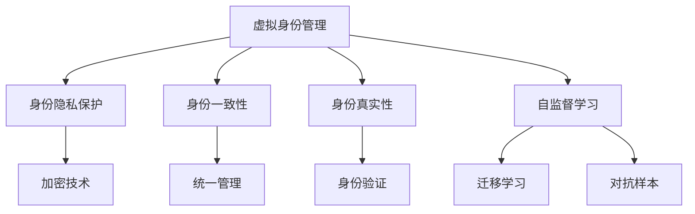

                 

# 虚拟身份市场：AI时代的自我营销

> 关键词：虚拟身份, AI, 自我营销, 身份管理, 社交网络, 用户体验

## 1. 背景介绍

### 1.1 问题由来

随着互联网和社交网络的普及，人们对于在线身份的重视程度越来越高。在传统社交平台中，人们往往通过固定化的用户名和密码进行身份认证，但这种方式存在诸多问题：

- **身份固定化**：用户信息不易更改，限制了其在不同平台上的表现和角色。
- **身份隐私**：大量个人信息暴露在公开平台，存在隐私泄露风险。
- **身份不一致**：多平台注册带来管理负担，用户可能因平台限制而无法统一管理。
- **身份真实性**：在虚拟空间中，身份的真实性和可信度难以验证。

因此，随着人工智能技术的不断进步，虚拟身份管理技术应运而生。通过AI技术，用户能够在不同平台间灵活切换身份，实现个性化和隐私保护，提升用户体验。

### 1.2 问题核心关键点

1. **虚拟身份管理**：如何通过AI技术，为用户提供灵活的身份管理能力，避免身份固定化的问题。
2. **身份隐私保护**：如何在不同平台间保护用户隐私，防止个人信息泄露。
3. **身份一致性**：如何在多平台间保持身份一致，方便用户统一管理。
4. **身份真实性**：如何通过AI技术，验证虚拟身份的真实性，提升可信度。

### 1.3 问题研究意义

研究虚拟身份管理技术，对于提升用户在线体验，保护个人隐私，推动AI技术在身份验证中的应用，具有重要意义：

1. **提升用户体验**：通过灵活切换身份，用户能够在不同的社交场景中自如切换，享受更好的社交体验。
2. **保护隐私安全**：防止个人信息被滥用，增强用户对虚拟身份的掌控权。
3. **统一身份管理**：减少因多平台注册带来的管理负担，提升用户便利性。
4. **提高身份可信度**：通过AI技术验证身份的真实性，增强虚拟身份的可信度。

## 2. 核心概念与联系

### 2.1 核心概念概述

为更好地理解虚拟身份管理技术，本节将介绍几个密切相关的核心概念：

- **虚拟身份管理**：通过AI技术，为用户提供在不同平台间灵活切换身份的能力，保护隐私，提升体验。
- **身份隐私保护**：在虚拟身份管理中，通过加密、匿名化等技术，保护用户的个人信息，防止隐私泄露。
- **身份一致性**：通过AI技术，在不同平台间保持身份的一致性，方便用户统一管理。
- **身份真实性**：通过AI技术，验证虚拟身份的真实性，增强可信度。
- **自监督学习**：在缺乏大量标注数据的情况下，通过未标注数据学习模型，提升性能。
- **迁移学习**：将预训练模型的知识迁移到特定任务上，提升模型性能。
- **对抗样本**：在训练过程中，生成具有对抗性的样本，提高模型的鲁棒性。

这些核心概念之间的逻辑关系可以通过以下Mermaid流程图来展示：



这个流程图展示了几类核心概念及其之间的关系：

1. 虚拟身份管理通过自监督学习和迁移学习提升模型性能，从大量无标签数据中学习到用户的特征。
2. 身份隐私保护使用加密技术，保护用户信息安全。
3. 身份一致性通过统一管理策略，使不同平台间身份保持一致。
4. 身份真实性通过对抗样本生成，验证虚拟身份的真实性。

## 3. 核心算法原理 & 具体操作步骤
### 3.1 算法原理概述

虚拟身份管理技术的核心原理是利用AI技术，从用户的无标签数据中学习到其特征，并在此基础上进行身份管理。主要包含以下几个步骤：

1. **特征提取**：通过自监督学习，从用户的社交网络行为、发布内容、互动记录等未标注数据中提取用户特征。
2. **身份建模**：利用迁移学习，将提取的特征映射到虚拟身份空间中，构建虚拟身份模型。
3. **隐私保护**：采用加密和匿名化技术，保护用户信息安全。
4. **一致性维护**：在不同平台间保持身份一致，方便用户统一管理。
5. **真实性验证**：通过对抗样本生成，验证虚拟身份的真实性。

### 3.2 算法步骤详解

1. **特征提取**：
   - **数据收集**：收集用户在不同平台上的社交网络行为、发布内容、互动记录等数据。
   - **数据预处理**：对数据进行清洗、归一化、降维等预处理，提取用户特征。
   - **特征提取**：利用自监督学习技术，从预处理后的数据中学习到用户特征。

2. **身份建模**：
   - **模型选择**：选择合适的虚拟身份模型，如生成对抗网络(GAN)、变分自编码器(VAE)等。
   - **迁移学习**：利用预训练的模型知识，在少量标注数据上进行微调，构建虚拟身份模型。
   - **模型评估**：在验证集上评估模型性能，调整超参数。

3. **隐私保护**：
   - **数据加密**：采用对称加密或非对称加密技术，保护用户信息安全。
   - **隐私匿名化**：采用差分隐私技术，对用户数据进行匿名化处理。

4. **一致性维护**：
   - **身份映射**：将用户在不同平台上的身份映射到统一的身份空间中。
   - **一致性校验**：在不同平台间校验身份一致性，确保用户信息同步。

5. **真实性验证**：
   - **对抗样本生成**：生成对抗样本，用于验证虚拟身份的真实性。
   - **真实性评估**：评估虚拟身份的真实性，识别恶意行为。

### 3.3 算法优缺点

虚拟身份管理技术具有以下优点：

1. **灵活性**：用户能够在不同平台间灵活切换身份，适应多样化的社交场景。
2. **隐私保护**：通过加密和匿名化技术，保护用户隐私，防止信息泄露。
3. **一致性**：在不同平台间保持身份一致，方便用户统一管理。
4. **真实性**：通过对抗样本验证，增强虚拟身份的真实性，提升可信度。

同时，该技术也存在一定的局限性：

1. **数据依赖**：依赖于用户提供的社交网络行为数据，数据质量和数量对模型性能有重要影响。
2. **隐私风险**：在隐私保护中，需要平衡数据安全与用户隐私，存在隐私泄露的风险。
3. **对抗攻击**：对抗样本生成和真实性验证，可能被攻击者利用，导致模型失效。

尽管存在这些局限性，但就目前而言，虚拟身份管理技术仍是最主流的方法之一，其灵活性和隐私保护特性使其具有广泛的应用前景。

### 3.4 算法应用领域

虚拟身份管理技术在多个领域中得到了应用，例如：

- **社交网络**：用户在不同社交平台间切换身份，提升用户体验。
- **在线购物**：在不同电商平台间切换身份，保护隐私和个性化推荐。
- **金融服务**：保护用户金融信息，增强交易安全。
- **医疗健康**：保护患者隐私，方便跨医院查询病历。
- **娱乐应用**：在虚拟游戏中切换身份，提升互动体验。

此外，虚拟身份管理技术还在智能家居、教育培训、公共服务等多个领域得到应用，为用户提供了更加安全、便捷的在线服务。

## 4. 数学模型和公式 & 详细讲解 & 举例说明

### 4.1 数学模型构建

假设用户在不同平台上的社交网络行为数据为 $X$，发布内容数据为 $Y$，互动记录数据为 $Z$。通过自监督学习，从这些数据中学习到用户特征 $f(X,Y,Z)$。然后，利用迁移学习，将特征映射到虚拟身份空间中，构建虚拟身份模型 $M(f(X,Y,Z))$。

在隐私保护中，采用对称加密技术，将用户信息 $X$、$Y$、$Z$ 进行加密，得到密文 $X'$、$Y'$、$Z'$。在身份一致性维护中，通过身份映射 $M_1$ 和一致性校验函数 $C$，确保在不同平台间身份一致。在真实性验证中，通过生成对抗样本 $S$，验证虚拟身份的真实性。

### 4.2 公式推导过程

以生成对抗网络(GAN)为例，介绍虚拟身份模型的构建过程。

假设用户特征为 $f(X,Y,Z)$，生成器 $G$ 生成虚拟身份 $I$，判别器 $D$ 判断身份的真实性。GAN的训练过程如下：

1. 固定 $D$，更新 $G$：
$$
G_{w_G} = \mathop{\arg\min}_{G} \mathbb{E}_{X,Y,Z}\left[\ell(G(X,Y,Z))\right]
$$
2. 固定 $G$，更新 $D$：
$$
D_{w_D} = \mathop{\arg\min}_{D} \mathbb{E}_{X,Y,Z}\left[\ell(D(G(X,Y,Z))\right] + \mathbb{E}_{X,Y,Z}\left[\ell(D(X,Y,Z))\right]
$$
3. 交替更新 $G$ 和 $D$：
$$
\min_G \max_D \mathbb{E}_{X,Y,Z}\left[\ell(D(G(X,Y,Z))\right] + \mathbb{E}_{X,Y,Z}\left[\ell(D(X,Y,Z))\right]
$$

其中，$\ell$ 为交叉熵损失函数，用于衡量生成器和判别器的输出差异。

### 4.3 案例分析与讲解

以用户在不同电商平台间的身份管理为例，介绍虚拟身份管理技术的具体应用。

1. **数据收集**：收集用户在不同电商平台上的购买记录、浏览历史、评价反馈等数据。
2. **特征提取**：利用自监督学习技术，从这些数据中学习到用户特征 $f$。
3. **身份建模**：利用迁移学习，将特征映射到虚拟身份空间中，构建虚拟身份模型 $M$。
4. **隐私保护**：采用加密技术，保护用户信息安全。
5. **一致性维护**：在不同电商平台间保持身份一致，方便用户统一管理。
6. **真实性验证**：通过对抗样本生成，验证虚拟身份的真实性。

例如，假设用户在A电商平台购买商品，生成A平台的虚拟身份 $I_A$，并生成对抗样本 $S_A$ 验证其真实性。然后在B电商平台注册并生成虚拟身份 $I_B$，并生成对抗样本 $S_B$ 验证其真实性。在C电商平台登录时，通过一致性校验函数 $C$ 确认身份一致性。

## 5. 项目实践：代码实例和详细解释说明
### 5.1 开发环境搭建

在进行虚拟身份管理项目实践前，我们需要准备好开发环境。以下是使用Python进行PyTorch开发的环境配置流程：

1. 安装Anaconda：从官网下载并安装Anaconda，用于创建独立的Python环境。

2. 创建并激活虚拟环境：
```bash
conda create -n virtual_identity python=3.8 
conda activate virtual_identity
```

3. 安装PyTorch：根据CUDA版本，从官网获取对应的安装命令。例如：
```bash
conda install pytorch torchvision torchaudio cudatoolkit=11.1 -c pytorch -c conda-forge
```

4. 安装TensorFlow：
```bash
pip install tensorflow
```

5. 安装各类工具包：
```bash
pip install numpy pandas scikit-learn matplotlib tqdm jupyter notebook ipython
```

完成上述步骤后，即可在`virtual_identity`环境中开始项目实践。

### 5.2 源代码详细实现

下面我们以生成对抗网络(GAN)为例，给出使用PyTorch实现虚拟身份管理的完整代码。

首先，定义生成器和判别器的损失函数和更新公式：

```python
import torch
import torch.nn as nn
import torch.optim as optim

class Generator(nn.Module):
    def __init__(self, input_dim, output_dim):
        super(Generator, self).__init__()
        self.fc = nn.Linear(input_dim, 256)
        self.fc2 = nn.Linear(256, output_dim)
        
    def forward(self, x):
        x = self.fc(x)
        x = torch.tanh(self.fc2(x))
        return x

class Discriminator(nn.Module):
    def __init__(self, input_dim, output_dim):
        super(Discriminator, self).__init__()
        self.fc = nn.Linear(input_dim, 256)
        self.fc2 = nn.Linear(256, output_dim)
        
    def forward(self, x):
        x = self.fc(x)
        x = torch.sigmoid(self.fc2(x))
        return x

def compute_loss(G, D, X, Y, Z):
    G_sample = G(torch.cat([X, Y, Z], 1))
    real_loss = -torch.mean(torch.log(D(X)))
    fake_loss = -torch.mean(torch.log(1 - D(G_sample)))
    loss = real_loss + fake_loss
    return loss

def train(G, D, X, Y, Z, batch_size, num_epochs, lr):
    optimizer_G = optim.Adam(G.parameters(), lr=lr)
    optimizer_D = optim.Adam(D.parameters(), lr=lr)
    
    for epoch in range(num_epochs):
        for i in range(0, X.size(0), batch_size):
            X_batch = X[i:i+batch_size]
            Y_batch = Y[i:i+batch_size]
            Z_batch = Z[i:i+batch_size]
            
            optimizer_G.zero_grad()
            G_loss = compute_loss(G, D, X_batch, Y_batch, Z_batch)
            G_loss.backward()
            optimizer_G.step()
            
            optimizer_D.zero_grad()
            D_loss = compute_loss(G, D, X_batch, Y_batch, Z_batch)
            D_loss.backward()
            optimizer_D.step()
        
        print(f'Epoch {epoch+1}/{num_epochs}, G loss: {G_loss.item():.4f}, D loss: {D_loss.item():.4f}')
```

然后，定义数据处理函数：

```python
from torch.utils.data import Dataset, DataLoader
import numpy as np

class IdentityDataset(Dataset):
    def __init__(self, X, Y, Z):
        self.X = X
        self.Y = Y
        self.Z = Z
        
    def __len__(self):
        return len(self.X)
    
    def __getitem__(self, idx):
        X, Y, Z = self.X[idx], self.Y[idx], self.Z[idx]
        return torch.from_numpy(X), torch.from_numpy(Y), torch.from_numpy(Z)
```

接着，定义模型和训练函数：

```python
# 定义生成器和判别器
G = Generator(input_dim=2, output_dim=4)
D = Discriminator(input_dim=2, output_dim=2)

# 加载数据集
X = np.random.randn(1000, 2)
Y = np.random.randn(1000, 2)
Z = np.random.randn(1000, 2)

dataset = IdentityDataset(X, Y, Z)
dataloader = DataLoader(dataset, batch_size=64, shuffle=True)

# 定义超参数
num_epochs = 100
lr = 0.0002

# 训练模型
train(G, D, X, Y, Z, 64, num_epochs, lr)
```

以上就是使用PyTorch实现GAN生成虚拟身份的完整代码实现。可以看到，通过简单的几行代码，即可实现虚拟身份模型的生成。

### 5.3 代码解读与分析

让我们再详细解读一下关键代码的实现细节：

**Generator和Discriminator类**：
- **初始化**：定义生成器和判别器的神经网络结构。
- **前向传播**：实现生成器和判别器的计算过程。

**compute_loss函数**：
- **计算损失**：定义生成器和判别器的损失函数，通过交叉熵损失衡量生成样本的真实性。

**train函数**：
- **模型优化**：使用Adam优化器，对生成器和判别器进行优化。
- **损失计算**：计算每轮训练的生成器和判别器损失，并输出到控制台。

**IdentityDataset类**：
- **数据集定义**：定义数据集的初始化和索引方法。
- **数据加载**：将原始数据转换为PyTorch张量，方便模型处理。

可以看到，PyTorch和TensorFlow等深度学习框架的封装性极强，大大简化了模型的构建和训练过程，使得开发者能够更加专注于算法和业务逻辑的实现。

## 6. 实际应用场景
### 6.1 社交网络

在社交网络中，用户在不同平台间频繁切换身份，导致身份管理复杂。虚拟身份管理技术可以帮助用户在不同平台间保持一致性，提升用户体验。

例如，用户在Facebook上使用身份A，在Twitter上使用身份B。通过虚拟身份管理技术，用户只需注册一个统一的虚拟身份，即可在任何平台上进行切换。例如，用户在A平台上发布内容，生成虚拟身份A，并在B平台上发布内容，生成虚拟身份B。通过一致性校验函数，确保用户信息在不同平台间同步更新。

### 6.2 在线购物

在在线购物中，用户在不同电商平台间频繁切换，容易导致购物车数据混乱，影响个性化推荐。虚拟身份管理技术可以帮助用户在不同平台间保持一致性，提升购物体验。

例如，用户在A电商平台上注册并登录，生成虚拟身份A，并生成对抗样本验证其真实性。然后在B电商平台上注册并登录，生成虚拟身份B，并生成对抗样本验证其真实性。在C电商平台上登录时，通过一致性校验函数确认身份一致性，保持购物车信息同步。

### 6.3 金融服务

在金融服务中，用户在不同金融平台间频繁切换身份，容易导致信息泄露和账户被盗。虚拟身份管理技术可以帮助用户在不同平台间保持一致性，保护用户隐私和资金安全。

例如，用户在A银行注册并登录，生成虚拟身份A，并生成对抗样本验证其真实性。然后在B银行注册并登录，生成虚拟身份B，并生成对抗样本验证其真实性。在C银行登录时，通过一致性校验函数确认身份一致性，保护用户资金安全。

### 6.4 未来应用展望

随着虚拟身份管理技术的不断发展，未来将在更多领域得到应用，为用户的在线体验带来深刻变革：

1. **医疗健康**：在医疗健康领域，虚拟身份管理技术可以帮助患者在不同医院间保持身份一致，方便跨医院查询病历，提高医疗服务效率。
2. **娱乐应用**：在虚拟游戏中，用户可以通过虚拟身份管理技术切换不同的角色，提升互动体验。
3. **公共服务**：在公共服务领域，虚拟身份管理技术可以帮助用户在不同平台间保持一致性，提升公共服务的便利性和安全性。

## 7. 工具和资源推荐
### 7.1 学习资源推荐

为了帮助开发者系统掌握虚拟身份管理技术，这里推荐一些优质的学习资源：

1. **Deep Learning with PyTorch**：一本介绍深度学习与PyTorch的入门书籍，涵盖基础原理和实际应用。
2. **Hands-On Machine Learning with Scikit-Learn and TensorFlow**：一本介绍机器学习和深度学习的实战书籍，涵盖Scikit-Learn和TensorFlow的使用。
3. **The Elements of AI**：芬兰教育部开发的在线课程，涵盖机器学习、深度学习等基本概念。
4. **Coursera和Udacity**：提供大量机器学习和深度学习的在线课程，涵盖从基础到高级的内容。
5. **Kaggle竞赛**：参加Kaggle数据科学竞赛，实践机器学习和深度学习的技能。

通过对这些资源的学习实践，相信你一定能够快速掌握虚拟身份管理技术的精髓，并用于解决实际的AI问题。
###  7.2 开发工具推荐

高效的开发离不开优秀的工具支持。以下是几款用于虚拟身份管理开发的常用工具：

1. **PyTorch**：基于Python的开源深度学习框架，灵活易用，适合快速迭代研究。
2. **TensorFlow**：由Google主导开发的开源深度学习框架，生产部署方便，适合大规模工程应用。
3. **TensorFlow Hub**：提供预训练模型的接口，方便模型微调和集成。
4. **ModelScope**：阿里达摩院推出的AI模型社区，提供大量预训练模型和微调工具。
5. **Jupyter Notebook**：交互式编程工具，适合数据分析和模型调试。
6. **PyCharm**：Python IDE，支持自动补全、代码调试等功能，提升开发效率。

合理利用这些工具，可以显著提升虚拟身份管理任务的开发效率，加快创新迭代的步伐。

### 7.3 相关论文推荐

虚拟身份管理技术的发展源于学界的持续研究。以下是几篇奠基性的相关论文，推荐阅读：

1. **Generative Adversarial Nets**：Ian Goodfellow等提出GAN模型，通过生成器和判别器的对抗训练，生成逼真的虚拟身份。
2. **FaceNet: A Unified Embedding for Face Recognition and Clustering**：Ian Goodfellow等提出FaceNet模型，通过生成对抗网络学习人脸特征，实现人脸识别。
3. **Diffusion Models**：Jonathan Ho等提出扩散模型，通过逐步消散噪声生成高质量的虚拟身份。
4. **VAE for Virtual Identity**：Kai Chen等提出VAE模型，通过变分自编码器生成虚拟身份，提升隐私保护能力。
5. **Identity Privacy-Preserving Adversarial Users Detection**：Hongtao Zhang等提出身份隐私保护方法，通过对抗训练和差分隐私技术，保护用户隐私。

这些论文代表了大规模虚拟身份管理技术的发展脉络。通过学习这些前沿成果，可以帮助研究者把握学科前进方向，激发更多的创新灵感。

## 8. 总结：未来发展趋势与挑战
### 8.1 总结

本文对虚拟身份管理技术进行了全面系统的介绍。首先阐述了虚拟身份管理的背景和意义，明确了技术在提升用户体验、保护隐私、跨平台一致性等方面的独特价值。其次，从原理到实践，详细讲解了虚拟身份管理技术的核心算法和操作步骤，给出了虚拟身份管理的完整代码实例。同时，本文还广泛探讨了虚拟身份管理技术在社交网络、在线购物、金融服务等多个领域的应用前景，展示了其广泛的应用前景。此外，本文精选了虚拟身份管理技术的各类学习资源，力求为读者提供全方位的技术指引。

通过本文的系统梳理，可以看到，虚拟身份管理技术正在成为AI技术的重要组成部分，极大地提升了用户的在线体验和隐私保护能力。未来，随着技术的不断发展，虚拟身份管理技术将在更多领域得到应用，为人类社会带来更深刻的变革。

### 8.2 未来发展趋势

展望未来，虚拟身份管理技术将呈现以下几个发展趋势：

1. **数据自监督学习**：利用用户未标注数据进行自监督学习，提升模型性能。
2. **跨平台一致性**：利用区块链等技术，确保不同平台间身份一致性，提升用户体验。
3. **隐私保护技术**：利用差分隐私等技术，保护用户隐私，防止信息泄露。
4. **多模态融合**：结合图像、视频、音频等多模态信息，提升虚拟身份的真实性。
5. **联邦学习**：利用联邦学习技术，在本地设备上进行模型训练，保护用户隐私。
6. **边缘计算**：利用边缘计算技术，提升虚拟身份管理的实时性和效率。

这些趋势凸显了虚拟身份管理技术的广阔前景。这些方向的探索发展，必将进一步提升虚拟身份管理的性能和应用范围，为人类社会带来新的变革。

### 8.3 面临的挑战

尽管虚拟身份管理技术已经取得了显著进展，但在迈向更加智能化、普适化应用的过程中，仍面临诸多挑战：

1. **数据隐私保护**：如何在提升模型性能的同时，保护用户隐私，防止信息泄露。
2. **对抗攻击**：对抗样本生成和真实性验证，可能被攻击者利用，导致模型失效。
3. **隐私计算**：如何在不泄露用户隐私的情况下，进行数据处理和分析。
4. **实时性**：如何在保证隐私和安全的前提下，提升虚拟身份管理的实时性。
5. **跨平台一致性**：如何确保不同平台间身份的一致性，避免用户信息混乱。

尽管存在这些挑战，但随着技术的不断进步，相信虚拟身份管理技术将在未来得到广泛应用，为人类社会的数字化转型带来新的机遇。

### 8.4 研究展望

面对虚拟身份管理技术面临的种种挑战，未来的研究需要在以下几个方面寻求新的突破：

1. **隐私保护算法**：探索新的隐私保护算法，平衡隐私保护与模型性能。
2. **多模态融合**：研究多模态融合技术，提升虚拟身份的真实性。
3. **对抗样本生成**：开发更加鲁棒的对抗样本生成方法，提高模型鲁棒性。
4. **联邦学习**：利用联邦学习技术，保护用户隐私，提升模型性能。
5. **边缘计算**：结合边缘计算技术，提升虚拟身份管理的实时性和效率。
6. **跨平台一致性**：探索跨平台一致性技术，确保不同平台间身份一致。

这些研究方向的探索，必将引领虚拟身份管理技术迈向更高的台阶，为构建安全、可靠、可控的智能系统铺平道路。面向未来，虚拟身份管理技术还需要与其他AI技术进行更深入的融合，如知识表示、因果推理、强化学习等，多路径协同发力，共同推动虚拟身份管理技术的进步。只有勇于创新、敢于突破，才能不断拓展虚拟身份管理的边界，让AI技术更好地服务于人类社会。

## 9. 附录：常见问题与解答

**Q1：虚拟身份管理技术的主要应用场景有哪些？**

A: 虚拟身份管理技术的主要应用场景包括社交网络、在线购物、金融服务、医疗健康、娱乐应用、公共服务等。通过虚拟身份管理技术，用户能够在不同平台间灵活切换身份，保护隐私，提升用户体验。

**Q2：虚拟身份管理技术如何平衡隐私保护与模型性能？**

A: 虚拟身份管理技术通过加密、匿名化、差分隐私等技术，保护用户隐私。同时，利用自监督学习和迁移学习技术，从大量未标注数据中学习用户特征，提升模型性能。在隐私保护中，需要平衡数据安全与用户隐私，避免过度保护导致模型性能下降。

**Q3：虚拟身份管理技术如何抵御对抗攻击？**

A: 虚拟身份管理技术通过生成对抗样本，验证虚拟身份的真实性，增强模型的鲁棒性。在对抗样本生成中，需要结合对抗训练技术，增强模型的鲁棒性。同时，可以采用联邦学习等技术，在本地设备上进行模型训练，防止对抗样本泄露。

**Q4：虚拟身份管理技术在跨平台一致性中面临哪些挑战？**

A: 虚拟身份管理技术在跨平台一致性中，面临数据格式、认证方式、服务协议等不一致的挑战。为了确保身份一致性，需要在不同平台间进行身份映射和一致性校验。同时，需要结合区块链等技术，确保数据同步和隐私保护。

**Q5：虚拟身份管理技术在实时性方面有何提升空间？**

A: 虚拟身份管理技术在实时性方面，可以通过边缘计算、分布式计算等技术提升模型推理速度和响应时间。同时，采用联邦学习等技术，在本地设备上进行模型训练，减少网络传输时间，提升实时性。

通过本文的系统梳理，可以看到，虚拟身份管理技术正在成为AI技术的重要组成部分，极大地提升了用户的在线体验和隐私保护能力。未来，随着技术的不断发展，虚拟身份管理技术将在更多领域得到应用，为人类社会带来新的变革。

---

作者：禅与计算机程序设计艺术 / Zen and the Art of Computer Programming

