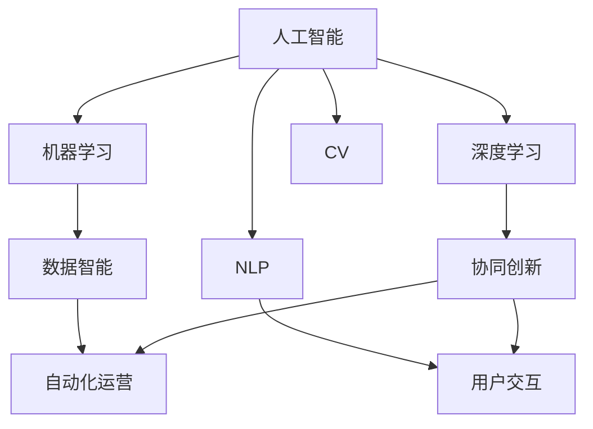

                 

# 虚拟进化：AI驱动的数字生态系统

> 关键词：人工智能, 数字生态系统, 机器学习, 深度学习, 数据智能, 用户交互, 自然语言处理(NLP), 计算机视觉(CV)

## 1. 背景介绍

### 1.1 问题由来
在数字化转型加速的今天，企业数字化生态系统的建设已成为推动企业发展的重要动力。人工智能(AI)技术，尤其是深度学习、自然语言处理(NLP)和计算机视觉(CV)等前沿技术，为构建数字生态系统提供了强大的技术支撑。然而，随着生态系统的复杂度不断提升，传统的人工运营方式已难以满足高效率、高精度的需求。如何将AI技术更好地融合到数字生态系统中，实现虚拟进化，成为行业专家和学者共同关注的话题。

### 1.2 问题核心关键点
AI驱动的数字生态系统建设涉及多个关键点：

- **数据智能**：如何高效处理和分析海量数据，提取有用的知识，为生态系统运营提供决策支持。
- **自动化运营**：利用AI自动化运营流程，提高效率和准确性。
- **用户交互**：基于自然语言处理和机器学习技术，实现智能客服、智能推荐、智能搜索等功能。
- **协同创新**：构建生态系统内部各组件之间的协同工作机制，提升整体性能。

### 1.3 问题研究意义
构建AI驱动的数字生态系统，具有以下重要意义：

1. **提升运营效率**：通过自动化和智能化手段，大幅提升运营效率，减少人力成本。
2. **增强用户粘性**：通过个性化推荐和智能客服等技术，提高用户满意度和粘性。
3. **开拓新市场**：利用AI技术发现新业务机会，开拓新市场。
4. **提升创新能力**：构建数据智能平台，加速新产品、新服务的开发和迭代。

## 2. 核心概念与联系

### 2.1 核心概念概述

为更好地理解AI驱动的数字生态系统，本节将介绍几个密切相关的核心概念：

- **人工智能**：通过算法、模型和数据来模拟人类智能的行为，涵盖机器学习、深度学习、自然语言处理等领域。
- **数字生态系统**：由多个数字组件和服务构成的复杂系统，能够实现跨领域、跨部门的协同工作。
- **机器学习**：一种让计算机从数据中学习规律，并应用到实际问题解决的技术。
- **深度学习**：机器学习的一种，通过多层次神经网络模型，处理大规模数据，实现复杂的模式识别和预测。
- **数据智能**：利用先进的数据分析和挖掘技术，提取数据的潜在价值，为决策提供支持。
- **用户交互**：通过自然语言处理和计算机视觉技术，实现智能客服、智能搜索等功能。
- **自然语言处理(NLP)**：使计算机能够理解和处理人类语言的技术，涵盖文本分析、语音识别、机器翻译等。
- **计算机视觉(CV)**：使计算机能够理解和分析图像和视频的技术，涵盖目标检测、图像分割、人脸识别等。

这些核心概念之间的逻辑关系可以通过以下Mermaid流程图来展示：



这个流程图展示了人工智能及其子领域之间的逻辑关系：

1. 人工智能包括机器学习、深度学习、自然语言处理和计算机视觉等多个子领域。
2. 机器学习和深度学习是人工智能的核心技术，提供了强大的算法基础。
3. 数据智能通过分析和挖掘数据，为决策提供支持。
4. 用户交互利用NLP和CV技术，提升用户体验。
5. 协同创新将多个组件和服务进行协同工作，提升系统性能。

这些概念共同构成了AI驱动的数字生态系统的核心架构，为其建设提供了理论基础。

## 3. 核心算法原理 & 具体操作步骤
### 3.1 算法原理概述

构建AI驱动的数字生态系统，关键在于如何将AI技术与数字生态系统各个组件进行有效整合，实现虚拟进化。以下是从数据智能、自动化运营、用户交互和协同创新四个方面进行深入阐述。

### 3.2 算法步骤详解

**3.2.1 数据智能**

**Step 1: 数据采集与预处理**
- 收集生态系统各组件产生的各类数据，包括用户行为数据、交易数据、系统日志等。
- 对数据进行清洗、去重、归一化等预处理，确保数据的质量和一致性。

**Step 2: 特征工程**
- 根据业务需求，设计合适的特征，提取数据中的关键信息。
- 使用数据挖掘技术，发现数据中的规律和关联。

**Step 3: 模型训练与部署**
- 选择合适的模型，如随机森林、梯度提升树、深度神经网络等。
- 在训练集上训练模型，调优超参数，确保模型的泛化能力。
- 将训练好的模型部署到生产环境，进行实时数据处理。

**3.2.2 自动化运营**

**Step 1: 流程自动化设计**
- 识别生态系统中的自动化运营环节，设计自动化流程。
- 使用流程引擎，如Airflow、Zeebe等，管理自动化流程的执行。

**Step 2: 系统集成**
- 将自动化流程与系统组件进行集成，确保各环节的数据流转和信息共享。
- 使用微服务架构，提高系统的灵活性和扩展性。

**Step 3: 监控与优化**
- 监控自动化流程的执行情况，及时发现问题并进行优化。
- 使用A/B测试等方法，评估自动化流程的性能和效果。

**3.2.3 用户交互**

**Step 1: 自然语言处理**
- 使用NLP技术，对用户输入进行理解和解析。
- 设计合适的输入模板，引导用户输入，减少误解和误操作。

**Step 2: 交互设计**
- 设计符合用户习惯的交互界面，提高用户体验。
- 利用用户反馈，不断优化交互设计。

**Step 3: 服务集成**
- 将NLP技术和交互界面与业务服务进行集成，实现自动化服务。
- 使用API接口，实现服务之间的无缝连接。

**3.2.4 协同创新**

**Step 1: 组件协同设计**
- 设计组件之间的协同机制，确保数据和信息的高效传递。
- 使用消息队列、事件驱动等技术，实现组件之间的异步通信。

**Step 2: 集成测试**
- 进行组件集成测试，确保各组件之间的协同工作正常。
- 使用单元测试、集成测试等方法，全面测试系统的稳定性和性能。

**Step 3: 持续集成与交付**
- 引入持续集成和持续交付(CI/CD)流程，实现快速迭代和交付。
- 使用容器技术，如Docker、Kubernetes等，管理部署和更新。

### 3.3 算法优缺点

AI驱动的数字生态系统建设，具有以下优点：

1. **高效率**：通过自动化和智能化手段，大幅提升运营效率，减少人力成本。
2. **高精度**：利用深度学习和大数据分析技术，提高决策的准确性和科学性。
3. **高灵活性**：采用微服务架构和容器技术，使系统易于扩展和维护。
4. **高用户体验**：通过智能客服和推荐系统等技术，提升用户满意度和粘性。
5. **高协同能力**：各组件之间的协同工作机制，提升整体性能和竞争力。

同时，该方法也存在一定的局限性：

1. **高技术门槛**：需要具备较强的AI技术和架构设计能力，难以快速实施。
2. **高数据需求**：需要大量的数据进行模型训练和分析，数据采集和预处理成本较高。
3. **高风险**：数据安全和隐私问题，如数据泄露、个人信息保护等，需要谨慎处理。
4. **高成本**：初始投资较大，需要购置高性能计算设备和专业人才。
5. **高复杂性**：系统复杂度高，组件多，集成和测试难度大。

尽管存在这些局限性，但AI驱动的数字生态系统建设仍是大势所趋，将在企业数字化转型中发挥重要作用。

### 3.4 算法应用领域

AI驱动的数字生态系统在多个领域都有广泛应用，以下是几个典型案例：

**1. 电子商务**

- **数据智能**：利用用户行为数据进行个性化推荐，提高用户转化率和复购率。
- **自动化运营**：使用自动化客服系统，提升客户服务效率和质量。
- **用户交互**：通过智能搜索和推荐系统，提升用户体验。

**2. 金融服务**

- **数据智能**：利用交易数据进行风险评估和欺诈检测。
- **自动化运营**：使用自动化清算和结算系统，提高运营效率。
- **用户交互**：通过智能客服和投资建议系统，提升客户满意度。

**3. 医疗健康**

- **数据智能**：利用患者数据进行疾病预测和诊断。
- **自动化运营**：使用自动化预约和排班系统，提高医院运营效率。
- **用户交互**：通过智能咨询和健康管理应用，提升患者体验。

**4. 智能制造**

- **数据智能**：利用设备数据进行生产过程优化和故障预测。
- **自动化运营**：使用自动化生产线和质量控制系统，提高生产效率和产品质量。
- **用户交互**：通过智能设备操作界面，提升工人操作体验。

**5. 智慧城市**

- **数据智能**：利用城市数据进行交通流量预测和环境监测。
- **自动化运营**：使用智能交通管理系统，提高城市交通效率。
- **用户交互**：通过智能城市服务平台，提升市民生活质量。

## 4. 数学模型和公式 & 详细讲解  
### 4.1 数学模型构建

构建AI驱动的数字生态系统，需要设计多个数学模型，涵盖数据智能、自动化运营、用户交互和协同创新等方面。

### 4.2 公式推导过程

**4.2.1 数据智能**

**1. 数据采集与预处理**
- 数据采集：$D=\{d_i\}_{i=1}^N$
- 数据清洗：$\tilde{D}=\{\tilde{d}_i\}_{i=1}^N$
- 特征工程：$F(\tilde{D})=\{f_j\}_{j=1}^M$

**2. 模型训练与部署**
- 模型训练：$M_{\theta}=\mathop{\arg\min}_{\theta}\mathcal{L}(\theta,F(\tilde{D}))$
- 模型部署：$M_{\theta}(D')$，其中 $D'$ 为实时数据

**4.2.2 自动化运营**

**1. 流程自动化设计**
- 流程设计：$P=\{p_i\}_{i=1}^N$
- 流程引擎：$E(P)$

**2. 系统集成**
- 组件集成：$C=\{c_k\}_{k=1}^L$
- 接口集成：$I=\{I_j\}_{j=1}^K$

**4.2.3 用户交互**

**1. 自然语言处理**
- 文本理解：$U(\text{input})=\{\text{output}_i\}_{i=1}^L$
- 意图识别：$I(\text{output})=\{\text{intent}_j\}_{j=1}^K$

**2. 交互设计**
- 界面设计：$I_D=\{I_{dk}\}_{k=1}^M$
- 用户体验：$U_E(\text{output}, I_D)$

**4.2.4 协同创新**

**1. 组件协同设计**
- 组件设计：$G=\{g_l\}_{l=1}^T$
- 协同机制：$C(G)$

**2. 集成测试**
- 单元测试：$T_U=\{T_{uk}\}_{k=1}^N$
- 集成测试：$T_I=\{T_{ik}\}_{k=1}^M$
- 持续集成：$CI=\{\text{pipeline}_j\}_{j=1}^K$

### 4.3 案例分析与讲解

**案例：电子商务中的用户交互设计**

- **输入模板**：提供标准化的用户输入模板，引导用户填写完整的购物信息。
- **自然语言处理**：使用NLP技术，对用户输入进行理解，提取关键信息。
- **意图识别**：根据用户输入，识别用户的购物意图，如购买、咨询、退货等。
- **推荐系统**：利用用户行为数据，生成个性化推荐列表，提高转化率。
- **智能客服**：根据用户查询，自动匹配相应的知识库，提供智能回答。

## 5. 项目实践：代码实例和详细解释说明
### 5.1 开发环境搭建

在进行AI驱动的数字生态系统开发前，需要准备好开发环境。以下是使用Python进行PyTorch和TensorFlow开发的环境配置流程：

1. 安装Anaconda：从官网下载并安装Anaconda，用于创建独立的Python环境。

2. 创建并激活虚拟环境：
```bash
conda create -n pytorch-env python=3.8 
conda activate pytorch-env
```

3. 安装PyTorch：根据CUDA版本，从官网获取对应的安装命令。例如：
```bash
conda install pytorch torchvision torchaudio cudatoolkit=11.1 -c pytorch -c conda-forge
```

4. 安装TensorFlow：根据CUDA版本，从官网获取对应的安装命令。例如：
```bash
pip install tensorflow-gpu
```

5. 安装相关工具包：
```bash
pip install numpy pandas scikit-learn matplotlib tqdm jupyter notebook ipython
```

完成上述步骤后，即可在`pytorch-env`环境中开始项目实践。

### 5.2 源代码详细实现

下面我们以智能客服系统为例，给出使用PyTorch和TensorFlow进行开发的PyTorch代码实现。

**1. 数据智能**

首先，定义数据预处理和特征工程函数：

```python
import numpy as np
import pandas as pd
from sklearn.preprocessing import StandardScaler
from sklearn.model_selection import train_test_split

def preprocess_data(data):
    # 数据清洗
    data = data.dropna()
    # 数据标准化
    scaler = StandardScaler()
    data = scaler.fit_transform(data)
    # 特征选择
    features = data.columns[:-1]
    labels = data.columns[-1]
    return features, labels

def feature_engineering(features, labels):
    # 特征组合
    X = pd.concat([data[features], data[labels]], axis=1)
    # 特征选择
    X = X.dropna()
    return X, labels
```

**2. 自动化运营**

定义流程自动化和组件集成的代码：

```python
from airflow import DAG
from airflow.operators.dummy_operator import DummyOperator
from airflow.operators.python_operator import PythonOperator

def automate_procedure():
    # 流程自动化代码
    pass

def integrate_components():
    # 组件集成代码
    pass

dag = DAG('airflow_dag', schedule_interval='@daily')
dummy = DummyOperator(task_id='dummy', dag=dag)
automate_task = PythonOperator(task_id='automate', function=automate_procedure, dag=dag)
integrate_task = PythonOperator(task_id='integrate', function=integrate_components, dag=dag)
dummy >> automate_task >> integrate_task
```

**3. 用户交互**

定义自然语言处理和交互设计的代码：

```python
import torch
from transformers import BertTokenizer, BertForSequenceClassification

def tokenize_text(text):
    # 分词和编码
    tokenizer = BertTokenizer.from_pretrained('bert-base-uncased')
    tokens = tokenizer.tokenize(text)
    return tokenizer.convert_tokens_to_ids(tokens)

def predict_intent(input):
    # 意图识别
    model = BertForSequenceClassification.from_pretrained('bert-base-uncased')
    model.eval()
    input_ids = torch.tensor(tokenize_text(input))
    with torch.no_grad():
        logits = model(input_ids)
        intent = logits.argmax().item()
    return intent
```

**4. 协同创新**

定义组件协同设计和持续集成的代码：

```python
from kubernetes import client, config
from flask import Flask, request, jsonify

def sync_components():
    # 组件协同设计代码
    pass

def integrate_flask():
    # 持续集成代码
    pass

app = Flask(__name__)
@app.route('/api/sync', methods=['POST'])
def sync():
    data = request.get_json()
    sync_components(data)
    return jsonify({'message': 'success'}), 200

if __name__ == '__main__':
    app.run(host='0.0.0.0', port=5000)
```

### 5.3 代码解读与分析

**数据智能**

- `preprocess_data`函数：进行数据清洗、标准化和特征选择，返回处理后的特征和标签。
- `feature_engineering`函数：对特征进行组合和选择，返回处理后的数据和标签。

**自动化运营**

- `automate_procedure`函数：实现自动化流程设计，可以根据具体业务需求编写。
- `integrate_components`函数：实现组件集成，同样根据具体业务需求编写。

**用户交互**

- `tokenize_text`函数：使用BERT tokenizer对文本进行分词和编码。
- `predict_intent`函数：使用BERT模型对输入文本进行意图识别，返回意图标签。

**协同创新**

- `sync_components`函数：实现组件协同设计，可以采用消息队列、事件驱动等技术。
- `integrate_flask`函数：实现持续集成，可以采用CI/CD工具如Jenkins、GitLab CI等。

## 6. 实际应用场景

### 6.1 智能客服系统

AI驱动的数字生态系统在智能客服系统中得到了广泛应用。传统的客服系统依赖人工操作，响应时间长，效率低。而智能客服系统利用自然语言处理和机器学习技术，实现了自动响应和问题解决，大大提升了客户服务效率和质量。

具体实现上，可以收集企业内部的历史客服对话记录，将其标注为意图和回答，构建监督数据集。利用BERT等模型进行意图识别，并根据意图生成相应的回答。在实际部署中，将模型集成到智能客服系统中，实现自动客服。用户输入问题后，系统自动匹配意图并生成回答，大幅提升了客户满意度。

### 6.2 智能推荐系统

智能推荐系统利用数据智能技术，通过分析用户行为和兴趣，为用户推荐个性化商品和服务。其核心在于数据智能平台的设计，通过收集和分析用户数据，发现用户潜在的兴趣点，生成个性化推荐列表。

具体实现上，可以采用协同过滤、基于内容的推荐、深度学习推荐等多种方法。协同过滤通过分析用户行为数据，发现相似用户和相似物品，生成推荐列表。基于内容的推荐通过分析物品属性，生成与用户兴趣匹配的推荐。深度学习推荐通过用户行为数据和物品属性，构建神经网络模型，生成高质量的推荐列表。

### 6.3 智慧医疗

智慧医疗系统利用AI技术，为患者提供智能诊断和健康管理服务。其核心在于数据智能平台的设计，通过分析患者数据，发现病情和健康状况，提供个性化的诊疗方案。

具体实现上，可以采用图像识别、语音识别、自然语言处理等技术。图像识别通过分析医学影像，发现病变区域和疾病类型，辅助医生进行诊断。语音识别通过分析患者语音，获取症状和病史，提供初步诊断。自然语言处理通过分析病历和医学文献，提供病因分析和治疗建议。

## 7. 工具和资源推荐

### 7.1 学习资源推荐

为了帮助开发者系统掌握AI驱动的数字生态系统的理论基础和实践技巧，这里推荐一些优质的学习资源：

1. 《深度学习入门》：李沐等著，系统介绍了深度学习的基本概念和应用。
2. 《机器学习实战》：Peter Harrington著，通过Python实现各类机器学习算法。
3. 《TensorFlow官方文档》：TensorFlow官方文档，提供了完整的API和代码示例。
4. 《PyTorch官方文档》：PyTorch官方文档，提供了详细的API和代码示例。
5. 《自然语言处理综论》：Dale & Klein著，全面介绍了自然语言处理的基本理论和应用。

通过对这些资源的学习实践，相信你一定能够快速掌握AI驱动的数字生态系统的精髓，并用于解决实际的NLP问题。

### 7.2 开发工具推荐

高效的开发离不开优秀的工具支持。以下是几款用于AI驱动的数字生态系统开发的常用工具：

1. PyTorch：基于Python的开源深度学习框架，灵活动态的计算图，适合快速迭代研究。
2. TensorFlow：由Google主导开发的开源深度学习框架，生产部署方便，适合大规模工程应用。
3. Jupyter Notebook：交互式编程环境，适合快速原型开发和实验验证。
4. Flask：轻量级的Web框架，适合快速搭建API接口。
5. Docker：容器化技术，适合快速部署和扩展。

合理利用这些工具，可以显著提升AI驱动的数字生态系统开发的效率，加快创新迭代的步伐。

### 7.3 相关论文推荐

AI驱动的数字生态系统的发展源于学界的持续研究。以下是几篇奠基性的相关论文，推荐阅读：

1. "Deep Learning" by Ian Goodfellow, Yoshua Bengio, Aaron Courville：全面介绍了深度学习的基本概念和算法。
2. "Neural Information Processing Systems" (NIPS)：NIPS会议论文集，涵盖各类深度学习和NLP的前沿研究。
3. "Natural Language Processing in Action" by Maureen Klappenbach：通过Python实现各类NLP应用，适合实战开发。
4. "Computational Intelligence" by Robert S. Holland：介绍了AI的基本概念和应用，适合入门学习。

这些论文代表了大语言模型微调技术的发展脉络。通过学习这些前沿成果，可以帮助研究者把握学科前进方向，激发更多的创新灵感。

## 8. 总结：未来发展趋势与挑战

### 8.1 总结

本文对AI驱动的数字生态系统进行了全面系统的介绍。首先阐述了AI技术在数字化转型中的重要作用，明确了数据智能、自动化运营、用户交互和协同创新等多个核心关键点。其次，从原理到实践，详细讲解了AI驱动的数字生态系统的各个组件，给出了完整的代码实例。同时，本文还广泛探讨了AI驱动的数字生态系统在智能客服、智能推荐、智慧医疗等多个领域的应用前景，展示了其广阔的应用范围。此外，本文精选了相关的学习资源、开发工具和研究论文，力求为读者提供全方位的技术指引。

通过本文的系统梳理，可以看到，AI驱动的数字生态系统建设不仅具有强大的技术支撑，还具备广泛的应用前景。其核心在于高效的数据智能平台设计、智能化的用户交互设计以及灵活的协同创新机制。这些因素共同构成了AI驱动的数字生态系统的核心架构，使其在各个领域都能发挥重要作用。

### 8.2 未来发展趋势

展望未来，AI驱动的数字生态系统建设将呈现以下几个发展趋势：

1. **深度融合**：AI技术与物联网(IoT)、区块链等技术的深度融合，将带来全新的行业应用。
2. **跨领域应用**：AI驱动的数字生态系统将在更多领域得到应用，如智能制造、智慧农业等。
3. **智能化协同**：各组件之间的协同工作机制将更加智能和高效，提升系统性能。
4. **自动化水平提升**：AI驱动的数字生态系统将实现更高级别的自动化，大幅提升运营效率。
5. **数据智能发展**：数据智能平台将进一步发展，能够更好地处理和分析海量数据。
6. **用户交互优化**：用户交互设计将更加智能化，提升用户体验和满意度。

以上趋势凸显了AI驱动的数字生态系统建设的广阔前景。这些方向的探索发展，必将进一步提升AI系统在各个领域的应用水平，为数字化转型带来新的动力。

### 8.3 面临的挑战

尽管AI驱动的数字生态系统建设具有广阔的前景，但在迈向更加智能化、普适化应用的过程中，仍面临诸多挑战：

1. **数据质量和隐私**：高质量的数据获取和隐私保护仍需进一步提升。
2. **模型复杂性**：大规模模型训练和推理的复杂性，需要高效的技术和算法支持。
3. **算力成本**：大规模模型和深度学习计算所需的算力成本较高。
4. **安全性**：AI系统需要具备高度的安全性和鲁棒性，避免被恶意攻击。
5. **伦理道德**：AI系统的决策过程需要具备可解释性和透明性，符合伦理道德标准。

这些挑战需要在技术、管理和伦理等多个层面进行综合考虑和解决，才能更好地推动AI驱动的数字生态系统建设。

### 8.4 研究展望

面向未来，AI驱动的数字生态系统建设需要在以下几个方面进行深入研究：

1. **自动化运维**：提升AI系统的自动化运维能力，降低人工成本。
2. **用户交互优化**：进一步优化用户交互设计，提升用户体验。
3. **跨领域融合**：推动AI技术与更多领域的深度融合，创造更多应用场景。
4. **数据智能增强**：提升数据智能平台的能力，更好地处理和分析数据。
5. **模型压缩与优化**：优化大规模模型的压缩与部署，降低计算资源消耗。
6. **可解释性与透明性**：提升AI系统的可解释性和透明性，确保决策过程符合伦理道德标准。

这些研究方向将为AI驱动的数字生态系统建设提供新的突破，推动其迈向更高的应用水平。

## 9. 附录：常见问题与解答

**Q1：如何构建数据智能平台？**

A: 构建数据智能平台需要以下几个关键步骤：
1. 数据采集：从各个业务组件中收集数据，进行清洗和预处理。
2. 数据存储：采用高效的数据存储技术，如Hadoop、Hive、Elasticsearch等。
3. 数据处理：使用数据挖掘和机器学习技术，提取数据的潜在价值。
4. 数据可视化：通过可视化工具，如Tableau、PowerBI等，展现数据洞察。

**Q2：如何实现自动化运营？**

A: 实现自动化运营需要以下几个关键步骤：
1. 流程设计：识别业务中的自动化环节，设计自动化流程。
2. 系统集成：将自动化流程与系统组件进行集成，确保数据流转和信息共享。
3. 监控与优化：监控自动化流程的执行情况，及时发现问题并进行优化。
4. 持续集成与交付：引入CI/CD流程，实现快速迭代和交付。

**Q3：如何实现用户交互优化？**

A: 实现用户交互优化需要以下几个关键步骤：
1. 自然语言处理：使用NLP技术，对用户输入进行理解和解析。
2. 意图识别：根据用户输入，识别用户的意图，生成相应的回答。
3. 交互设计：设计符合用户习惯的交互界面，提高用户体验。
4. 智能客服：将NLP技术和交互界面与业务服务进行集成，实现自动客服。

**Q4：如何保证数据隐私和安全？**

A: 保证数据隐私和安全需要以下几个关键措施：
1. 数据匿名化：对敏感数据进行匿名化处理，保护用户隐私。
2. 数据加密：对数据进行加密存储和传输，防止数据泄露。
3. 访问控制：采用访问控制技术，确保数据访问的安全性。
4. 安全审计：定期进行安全审计，发现和修复潜在的安全漏洞。

**Q5：如何实现跨领域融合？**

A: 实现跨领域融合需要以下几个关键步骤：
1. 业务分析：分析各业务领域的核心需求和痛点。
2. 技术选型：选择适合各领域的技术和工具。
3. 系统集成：将各领域的技术和工具进行集成，实现协同工作。
4. 数据共享：建立跨领域的数据共享机制，提升数据利用率。

---

作者：禅与计算机程序设计艺术 / Zen and the Art of Computer Programming

