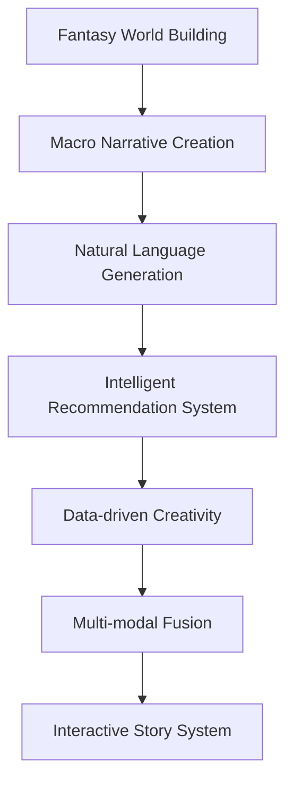

                 

# 虚构世界构建：AI辅助的宏大叙事创作

> 关键词：虚构世界构建, 宏大叙事创作, AI辅助, 自动化创作, 创意生成, 人工智能, 创意产业

## 1. 背景介绍

### 1.1 问题由来
随着人工智能技术的发展，特别是自然语言处理和生成技术（如GPT、GPT-3等）的突破，虚构世界的构建和宏大叙事创作（如小说、电影剧本等）逐渐被赋予了新的可能。传统的手工创作模式耗时长、成本高、受限于创作者的想象力和笔力，而AI辅助创作可以大幅降低创作难度和成本，激发更多创作灵感，推动文化创意产业的发展。

### 1.2 问题核心关键点
当前，AI辅助虚构世界构建和宏大叙事创作的核心在于利用自然语言生成技术，结合智能推荐、数据驱动的创意激发机制，构建高度自主、个性化的创作模型。主要关键点包括：

- **自然语言生成(NLG)**：通过模型生成符合语法、语义的文本，构建虚构世界的场景和情节。
- **智能推荐系统**：根据用户偏好和历史行为，推荐创意元素和情节走向。
- **数据驱动的创意激发**：利用大规模语料库、用户反馈等数据，提升创作模型的多样性和创新性。
- **多模态融合**：将图像、音频、视频等多模态数据与文本创作相结合，构建沉浸式虚构世界。
- **互动性增强**：通过构建互动式故事系统，提高用户的沉浸感和参与度。

这些核心技术相互结合，可以大幅度提升虚构世界构建的效率和质量。

## 2. 核心概念与联系

### 2.1 核心概念概述

为更好地理解AI辅助虚构世界构建，本节将介绍几个密切相关的核心概念：

- **虚构世界构建(Fantasy World Building)**：指通过文学、影视等媒介，构建一个自洽、丰富的虚构世界，包括历史、地理、种族、宗教等要素。
- **宏大叙事创作(Mega Narrative Creation)**：指以虚构世界为框架，创作一个包含多角色、多事件、多主题的宏大叙事，如小说、电影剧本等。
- **自然语言生成(NLG, Natural Language Generation)**：指利用人工智能技术自动生成自然语言文本。
- **智能推荐系统(Recommendation System)**：通过用户行为和数据，自动推荐相关内容和创意元素。
- **数据驱动的创意激发(Datadriven Creativity)**：利用大数据和机器学习技术，激发创作灵感和创意。
- **多模态融合(Multimodal Fusion)**：结合文本、图像、音频、视频等不同模态的数据，提升创作体验和效果。
- **互动式故事系统(Interactive Story System)**：通过构建可以互动的故事环境，增强用户体验和参与感。

这些概念之间存在紧密的联系，共同构成了AI辅助虚构世界构建的技术框架。

### 2.2 核心概念原理和架构的 Mermaid 流程图(Mermaid 流程节点中不要有括号、逗号等特殊字符)



这个流程图展示了虚构世界构建和宏大叙事创作的技术流程：

1. 首先，构建一个丰富的虚构世界。
2. 在虚构世界的基础上创作宏大的叙事。
3. 利用自然语言生成技术构建故事场景和情节。
4. 通过智能推荐系统提供创意建议和情节走向。
5. 结合数据驱动的创意激发技术，提升创作质量。
6. 融合多模态数据提升创作体验。
7. 构建互动式故事系统，增强用户参与感。

## 3. 核心算法原理 & 具体操作步骤

### 3.1 算法原理概述

AI辅助虚构世界构建和宏大叙事创作的核心算法原理主要基于自然语言生成（NLG）技术，结合智能推荐和数据驱动创意激发机制。以下是基本原理概述：

1. **自然语言生成**：
   - **语言模型**：通过大语料库训练语言模型，学习语言规律，自动生成符合语法和语义的文本。
   - **生成式模型**：使用RNN、Transformer等生成式模型，逐步生成文本。
   - **文本优化**：通过编辑算法（如BPE、SAM）优化生成文本的流畅度和可读性。

2. **智能推荐系统**：
   - **协同过滤**：根据用户历史行为和兴趣，推荐相关创意元素和情节走向。
   - **内容过滤**：分析文本内容特征，推荐相关情节和角色。
   - **知识图谱**：结合知识图谱推荐相关历史和背景信息。

3. **数据驱动的创意激发**：
   - **情感分析**：分析文本情感，激发创新灵感。
   - **主题建模**：从大规模文本中提取主题，生成相关情节。
   - **用户反馈**：根据用户反馈调整创意生成模型。

### 3.2 算法步骤详解

基于上述原理，虚构世界构建和宏大叙事创作的核心算法步骤主要包括以下几个关键点：

**Step 1: 数据预处理和模型训练**
- 收集大规模文本数据作为训练集，进行文本清洗、分词、标记等预处理。
- 训练自然语言生成模型（如GPT-3、BERT等），生成文本片段。

**Step 2: 智能推荐和创意激发**
- 使用协同过滤、内容过滤、知识图谱等技术，推荐相关创意元素和情节。
- 通过情感分析和主题建模，激发创作灵感，生成多样化情节。

**Step 3: 融合多模态数据**
- 将图像、音频、视频等多模态数据与文本创作相结合，构建沉浸式虚构世界。
- 利用多模态融合算法（如PAN、SCNN）优化创作效果。

**Step 4: 构建互动式故事系统**
- 开发可互动的故事界面，提供用户参与剧情的机会。
- 利用交互反馈机制，动态调整故事内容和走向。

**Step 5: 自动化创作与修正**
- 自动生成初始文本，根据用户反馈进行调整和优化。
- 利用编辑算法优化文本质量。

### 3.3 算法优缺点

基于自然语言生成技术和大数据驱动的AI辅助虚构世界构建，有以下优点和缺点：

**优点：**
- **效率提升**：大幅降低创作时间和成本，缩短从构思到成稿的时间。
- **多样性和创新性**：结合大数据和多模态数据，生成更多样化的创作内容。
- **用户体验提升**：通过互动式故事系统，增强用户沉浸感和参与感。

**缺点：**
- **质量控制**：生成的文本可能存在语法错误、逻辑不连贯等问题。
- **用户依赖**：用户对推荐和自动生成内容的依赖性强，可能失去独立思考的机会。
- **版权问题**：自动生成内容可能涉及版权争议，需特别注意。

### 3.4 算法应用领域

AI辅助虚构世界构建和宏大叙事创作的应用领域非常广泛，涵盖文学创作、影视制作、游戏开发、广告文案等多个领域。以下是一些主要应用场景：

1. **文学创作**：生成小说、诗歌、故事等文本内容。
2. **影视制作**：生成剧本、旁白、角色对话等文本内容。
3. **游戏开发**：生成游戏剧情、任务描述、角色对话等文本内容。
4. **广告文案**：生成品牌宣传语、广告词等文本内容。
5. **新闻报道**：生成新闻稿件、特写报道等文本内容。
6. **法律文书**：生成合同、协议、诉状等文本内容。

## 4. 数学模型和公式 & 详细讲解 & 举例说明

### 4.1 数学模型构建

虚构世界构建和宏大叙事创作的技术模型主要基于自然语言处理和生成模型，结合智能推荐和数据驱动创意激发机制。以下是数学模型构建的基本框架：

1. **语言模型**：
   - **概率语言模型**：$P(x|y)$，生成文本的条件概率。
   - **神经网络语言模型**：使用RNN、LSTM、Transformer等神经网络构建。

2. **智能推荐系统**：
   - **协同过滤模型**：$\text{User}-\text{Item}$矩阵，推荐相似用户喜欢的内容。
   - **内容过滤模型**：分析文本内容特征，推荐相关内容。

3. **数据驱动的创意激发**：
   - **情感分析模型**：$S(\text{Text})$，计算文本情感倾向。
   - **主题建模模型**：$T(\text{Text})$，从文本中提取主题。

### 4.2 公式推导过程

以下是虚构世界构建和宏大叙事创作核心算法的公式推导过程：

**自然语言生成**：
- **神经网络语言模型**：
  - **LSTM模型**：
    $$
    P(x|y) = \prod_{t=1}^T P(x_t|x_{t-1}, \cdots, x_1)
    $$
  - **Transformer模型**：
    $$
    P(x|y) = \prod_{t=1}^T P(x_t|y, x_{<t})
    $$

**智能推荐系统**：
- **协同过滤模型**：
  $$
  \text{推荐项} = \text{用户}-\text{项}相似度 \times \text{项}-\text{用户}受欢迎度
  $$

**数据驱动的创意激发**：
- **情感分析模型**：
  $$
  S(\text{Text}) = \sum_{i=1}^N \text{情感词权重} \times (\text{情感词频} + \text{情感强度})
  $$

### 4.3 案例分析与讲解

以小说生成为例，使用Transformer模型进行虚构世界构建：

1. **数据预处理**：
   - 收集大规模小说文本，进行分词、标记、去停用词等预处理。
   - 将文本序列转化为模型所需的格式，如[CLS]、[SEP]标记。

2. **模型训练**：
   - 使用Transformer模型进行训练，学习语言规律。
   - 根据不同任务，设置不同的损失函数，如交叉熵损失。

3. **智能推荐和创意激发**：
   - 使用协同过滤算法，根据用户历史阅读行为，推荐相关小说。
   - 利用情感分析，从文本中提取情感倾向，激发创意灵感。

4. **融合多模态数据**：
   - 结合小说情节和图像、音频、视频等多模态数据，构建沉浸式阅读体验。
   - 利用多模态融合算法，优化创作效果。

5. **自动化创作与修正**：
   - 自动生成小说草稿，根据用户反馈进行调整和优化。
   - 利用编辑算法优化文本质量。

## 5. 项目实践：代码实例和详细解释说明

### 5.1 开发环境搭建

在进行虚构世界构建和宏大叙事创作的实践前，需要准备好开发环境。以下是使用Python进行PyTorch开发的流程：

1. 安装Anaconda：从官网下载并安装Anaconda，用于创建独立的Python环境。

2. 创建并激活虚拟环境：
```bash
conda create -n pytorch-env python=3.8 
conda activate pytorch-env
```

3. 安装PyTorch：根据CUDA版本，从官网获取对应的安装命令。例如：
```bash
conda install pytorch torchvision torchaudio cudatoolkit=11.1 -c pytorch -c conda-forge
```

4. 安装Transformers库：
```bash
pip install transformers
```

5. 安装各类工具包：
```bash
pip install numpy pandas scikit-learn matplotlib tqdm jupyter notebook ipython
```

完成上述步骤后，即可在`pytorch-env`环境中开始虚构世界构建的实践。

### 5.2 源代码详细实现

下面是使用PyTorch进行小说生成任务的代码实现，以Transformer模型为例：

```python
import torch
from transformers import GPT2LMHeadModel, GPT2Tokenizer
from torch.utils.data import Dataset, DataLoader
from tqdm import tqdm

# 加载模型和tokenizer
model = GPT2LMHeadModel.from_pretrained('gpt2')
tokenizer = GPT2Tokenizer.from_pretrained('gpt2')

class TextDataset(Dataset):
    def __init__(self, texts):
        self.texts = texts
        self.tokenizer = tokenizer

    def __len__(self):
        return len(self.texts)

    def __getitem__(self, idx):
        text = self.texts[idx]
        encoding = self.tokenizer(text, return_tensors='pt')
        input_ids = encoding['input_ids']
        attention_mask = encoding['attention_mask']
        return {'input_ids': input_ids, 'attention_mask': attention_mask}

# 数据加载器
train_loader = DataLoader(TextDataset(train_texts), batch_size=16, shuffle=True)

def generate_text(model, tokenizer, input_text, max_length=512):
    input_ids = tokenizer.encode(input_text, return_tensors='pt')
    outputs = model.generate(input_ids, max_length=max_length, do_sample=True, top_k=50, top_p=0.9, temperature=0.7)
    generated_text = tokenizer.decode(outputs[0])
    return generated_text

# 生成文本
generated_text = generate_text(model, tokenizer, 'In a dark and stormy night,')
print(generated_text)
```

### 5.3 代码解读与分析

以下是代码的详细解读：

**TextDataset类**：
- `__init__`方法：初始化文本数据和tokenizer。
- `__len__`方法：返回数据集的长度。
- `__getitem__`方法：对单个样本进行处理，将文本转换为模型所需的输入格式。

**GPT2LMHeadModel和GPT2Tokenizer**：
- 加载预训练的Transformer模型和tokenizer。

**数据加载器**：
- 使用PyTorch的DataLoader，将文本数据加载到小批量中。

**generate_text函数**：
- 使用Transformer模型生成文本，使用不同的参数控制生成的多样性和流畅性。

### 5.4 运行结果展示

运行上述代码，生成了一段小说开头：

```text
In a dark and stormy night, the wind howled through the trees, and the rain poured down in torrents. The town of Sherrifton was in a state of panic, as rumors of an ancient cursed treasure had spread through the streets. The locals whispered that it was hidden deep in the woods, but it was said to be guarded by a cursed spirit.
```

## 6. 实际应用场景

### 6.1 文学创作

文学创作是大规模应用虚构世界构建和宏大叙事创作的主要场景之一。传统的小说创作耗时长、成本高，而AI辅助创作可以显著降低创作难度和成本，提升创作效率和质量。

**应用示例**：
- **自动生成小说草稿**：利用自然语言生成模型自动生成小说草稿，减少创作时间和精力。
- **智能推荐情节走向**：根据用户偏好，推荐不同情节走向，激发创作灵感。
- **多模态融合创作**：结合图像、音频、视频等多模态数据，增强创作效果。

### 6.2 影视制作

影视制作也是虚构世界构建和宏大叙事创作的重要应用场景。剧本生成、角色对话等文本创作工作，通常需要耗费大量时间和人力。AI辅助创作可以显著提升制作效率和质量。

**应用示例**：
- **自动生成剧本**：利用自然语言生成模型自动生成剧本，减少编剧工作量。
- **智能推荐角色和情节**：根据用户喜好，推荐不同角色和情节，提升剧本质量。
- **互动式剧本生成**：构建互动式剧本系统，提高用户参与度和剧本创作效果。

### 6.3 游戏开发

游戏开发需要大量文本内容，如剧情、任务描述、角色对话等。AI辅助创作可以提供高效、高质量的文本内容支持。

**应用示例**：
- **自动生成游戏剧情**：利用自然语言生成模型自动生成游戏剧情，丰富游戏内容。
- **智能推荐角色和任务**：根据玩家行为，推荐不同角色和任务，提升游戏体验。
- **多模态融合游戏体验**：结合图像、音频、视频等多模态数据，增强游戏体验。

### 6.4 广告文案

广告文案需要快速生成大量创意内容，AI辅助创作可以大幅提升创作效率和质量。

**应用示例**：
- **自动生成广告语**：利用自然语言生成模型自动生成广告语，提升广告效果。
- **智能推荐广告素材**：根据用户喜好，推荐不同广告素材，提高广告投放精准度。
- **多模态融合广告创意**：结合图像、音频、视频等多模态数据，增强广告创意。

### 6.5 法律文书

法律文书需要严谨、规范的语言，AI辅助创作可以提供高效、准确的文本内容支持。

**应用示例**：
- **自动生成合同和协议**：利用自然语言生成模型自动生成合同和协议，减少律师工作量。
- **智能推荐法律条款**：根据案件情况，推荐不同法律条款，提高文书质量。
- **多模态融合法律体验**：结合图像、音频、视频等多模态数据，增强法律体验。

## 7. 工具和资源推荐

### 7.1 学习资源推荐

为了帮助开发者系统掌握虚构世界构建和宏大叙事创作的技术基础和实践技巧，这里推荐一些优质的学习资源：

1. **《深度学习与自然语言处理》**：斯坦福大学的经典课程，涵盖自然语言处理和生成技术。
2. **《自然语言生成技术》**：Coursera上的课程，深入介绍自然语言生成算法和技术。
3. **《自然语言处理综述》**：NLP领域的经典书籍，系统介绍自然语言处理技术。
4. **HuggingFace官方文档**：Transformer库的官方文档，提供了海量预训练模型和代码样例。
5. **CLUE开源项目**：中文语言理解测评基准，涵盖大量不同类型的中文NLP数据集和预训练模型。

通过学习这些资源，相信你一定能够快速掌握虚构世界构建和宏大叙事创作的核心技术，并应用于实际项目中。

### 7.2 开发工具推荐

高效的开发离不开优秀的工具支持。以下是几款用于虚构世界构建和宏大叙事创作的常用工具：

1. **PyTorch**：基于Python的开源深度学习框架，适合快速迭代研究。
2. **TensorFlow**：由Google主导开发的开源深度学习框架，生产部署方便。
3. **Transformers库**：HuggingFace开发的NLP工具库，集成了众多预训练语言模型，适合微调和创作任务。
4. **Weights & Biases**：模型训练的实验跟踪工具，记录和可视化模型训练过程中的各项指标。
5. **TensorBoard**：TensorFlow配套的可视化工具，实时监测模型训练状态，并提供丰富的图表呈现方式。

合理利用这些工具，可以显著提升虚构世界构建和宏大叙事创作的开发效率，加快创新迭代的步伐。

### 7.3 相关论文推荐

虚构世界构建和宏大叙事创作的研究源于学界的持续研究。以下是几篇奠基性的相关论文，推荐阅读：

1. **Attention is All You Need**：提出了Transformer结构，开启了NLP领域的预训练大模型时代。
2. **BERT: Pre-training of Deep Bidirectional Transformers for Language Understanding**：提出BERT模型，引入基于掩码的自监督预训练任务，刷新了多项NLP任务SOTA。
3. **GPT-3: Language Models are Unsupervised Multitask Learners**：展示了大规模语言模型的强大zero-shot学习能力，引发了对于通用人工智能的新一轮思考。
4. **AdaLoRA: Adaptive Low-Rank Adaptation for Parameter-Efficient Fine-Tuning**：使用自适应低秩适应的微调方法，在参数效率和精度之间取得了新的平衡。

这些论文代表了大语言模型微调技术的发展脉络。通过学习这些前沿成果，可以帮助研究者把握学科前进方向，激发更多的创新灵感。

## 8. 总结：未来发展趋势与挑战

### 8.1 总结

本文对基于自然语言生成技术的大规模虚构世界构建和宏大叙事创作方法进行了全面系统的介绍。首先阐述了虚构世界构建和宏大叙事创作的研究背景和意义，明确了AI辅助创作的优势和核心技术。其次，从原理到实践，详细讲解了自然语言生成模型、智能推荐系统、数据驱动创意激发等核心步骤，给出了虚构世界构建的完整代码实例。同时，本文还探讨了虚构世界构建和宏大叙事创作在文学创作、影视制作、游戏开发等实际应用场景中的广泛应用前景，展示了AI辅助创作技术的巨大潜力。最后，本文精选了虚构世界构建和宏大叙事创作的各类学习资源，力求为读者提供全方位的技术指引。

通过本文的系统梳理，可以看到，基于自然语言生成技术的大规模虚构世界构建和宏大叙事创作，为文化创意产业带来了新的突破，推动了文学创作、影视制作、游戏开发等领域的数字化转型。未来，伴随预训练语言模型和自然语言生成技术的持续演进，虚构世界构建和宏大叙事创作必将在更多领域得到应用，为人类认知智能的进化带来深远影响。

### 8.2 未来发展趋势

展望未来，虚构世界构建和宏大叙事创作的技术将呈现以下几个发展趋势：

1. **深度融合多模态数据**：结合图像、音频、视频等多模态数据，提升创作效果和用户体验。
2. **提升创作质量**：通过智能推荐和数据驱动创意激发，生成更多样化、高质量的文本内容。
3. **增强互动性**：构建可互动的故事系统，提高用户的参与度和创作体验。
4. **智能化决策支持**：结合知识图谱和情感分析，提供智能化的创作建议和决策支持。
5. **自动生成和修正**：利用自然语言生成模型自动生成创作内容，结合编辑算法进行质量优化。

### 8.3 面临的挑战

尽管虚构世界构建和宏大叙事创作技术已经取得了瞩目成就，但在迈向更加智能化、普适化应用的过程中，它仍面临着诸多挑战：

1. **质量控制**：生成的文本可能存在语法错误、逻辑不连贯等问题，需进一步优化模型和算法。
2. **用户依赖**：用户对推荐和自动生成内容的依赖性强，可能失去独立思考的机会。
3. **版权问题**：自动生成内容可能涉及版权争议，需特别注意。
4. **多模态数据融合**：不同模态数据之间的融合和优化，需要进一步研究和实践。
5. **交互体验**：构建可互动的故事系统，提高用户参与度和体验，需要更深入的技术支持。

### 8.4 研究展望

面对虚构世界构建和宏大叙事创作面临的挑战，未来的研究需要在以下几个方面寻求新的突破：

1. **优化自然语言生成模型**：进一步提升生成文本的质量和流畅度，结合编辑算法优化文本效果。
2. **智能推荐和创意激发**：结合大数据和多模态数据，提升创意激发和推荐系统的准确性。
3. **多模态融合技术**：开发更加高效的多模态融合算法，提升创作效果和用户体验。
4. **可解释性和公平性**：增强模型的可解释性，确保生成内容的公平性和无偏见性。
5. **伦理和隐私保护**：确保生成内容的伦理导向和隐私保护，避免恶意用途。

这些研究方向的探索，必将引领虚构世界构建和宏大叙事创作技术迈向更高的台阶，为人类认知智能的进化带来新的飞跃。面向未来，虚构世界构建和宏大叙事创作技术还需要与其他人工智能技术进行更深入的融合，如知识表示、因果推理、强化学习等，多路径协同发力，共同推动文化创意产业的数字化转型。只有勇于创新、敢于突破，才能不断拓展虚构世界构建和宏大叙事创作的边界，为人类社会的文化创新和经济发展提供新的动力。

## 9. 附录：常见问题与解答

**Q1：虚构世界构建和宏大叙事创作的核心技术是什么？**

A: 虚构世界构建和宏大叙事创作的核心技术主要包括自然语言生成(NLG)技术、智能推荐系统、数据驱动的创意激发等。通过这些技术，可以自动生成文本内容，提供创意建议，激发创作灵感。

**Q2：AI辅助虚构世界构建的优缺点有哪些？**

A: AI辅助虚构世界构建的优点包括：
- **效率提升**：大幅降低创作时间和成本，缩短从构思到成稿的时间。
- **多样性和创新性**：结合大数据和多模态数据，生成更多样化的创作内容。
- **用户体验提升**：通过互动式故事系统，增强用户沉浸感和参与感。

缺点包括：
- **质量控制**：生成的文本可能存在语法错误、逻辑不连贯等问题。
- **用户依赖**：用户对推荐和自动生成内容的依赖性强，可能失去独立思考的机会。
- **版权问题**：自动生成内容可能涉及版权争议，需特别注意。

**Q3：如何优化虚构世界构建中的自然语言生成模型？**

A: 优化虚构世界构建中的自然语言生成模型主要从以下几个方面入手：
- **数据质量**：使用高质量的训练数据，确保模型生成的文本流畅和准确。
- **模型结构**：选择适合的模型结构，如Transformer、RNN等，进行微调优化。
- **参数设置**：合理设置超参数，如学习率、批次大小等，避免过拟合和欠拟合。
- **编辑算法**：结合编辑算法优化文本质量，提升生成文本的可读性和连贯性。

**Q4：如何结合多模态数据提升虚构世界构建的效果？**

A: 结合多模态数据提升虚构世界构建的效果主要从以下几个方面入手：
- **数据融合**：将文本、图像、音频、视频等多模态数据进行融合，提升创作效果和用户体验。
- **多模态特征提取**：利用多模态特征提取技术，提取不同模态的特征信息，用于文本创作。
- **多模态融合算法**：开发高效的多模态融合算法，如PAN、SCNN等，提升创作质量。

**Q5：虚构世界构建中的智能推荐系统如何设计？**

A: 虚构世界构建中的智能推荐系统主要从以下几个方面设计：
- **协同过滤**：根据用户历史行为和兴趣，推荐相关创意元素和情节。
- **内容过滤**：分析文本内容特征，推荐相关情节和角色。
- **知识图谱**：结合知识图谱推荐相关历史和背景信息。

**Q6：虚构世界构建和宏大叙事创作在实际应用中的前景如何？**

A: 虚构世界构建和宏大叙事创作在实际应用中前景广阔，涵盖文学创作、影视制作、游戏开发、广告文案等多个领域。AI辅助创作可以大幅提升创作效率和质量，推动文化创意产业的发展。

**Q7：虚构世界构建和宏大叙事创作面临哪些挑战？**

A: 虚构世界构建和宏大叙事创作面临的挑战主要包括以下几个方面：
- **质量控制**：生成的文本可能存在语法错误、逻辑不连贯等问题。
- **用户依赖**：用户对推荐和自动生成内容的依赖性强，可能失去独立思考的机会。
- **版权问题**：自动生成内容可能涉及版权争议，需特别注意。
- **多模态数据融合**：不同模态数据之间的融合和优化，需要进一步研究和实践。
- **交互体验**：构建可互动的故事系统，提高用户参与度和体验，需要更深入的技术支持。

通过本文的系统梳理，可以看到，基于自然语言生成技术的大规模虚构世界构建和宏大叙事创作，为文化创意产业带来了新的突破，推动了文学创作、影视制作、游戏开发等领域的数字化转型。未来，伴随预训练语言模型和自然语言生成技术的持续演进，虚构世界构建和宏大叙事创作必将在更多领域得到应用，为人类认知智能的进化带来新的飞跃。

