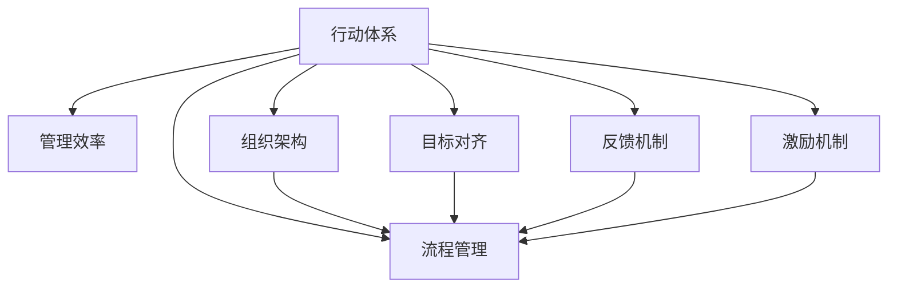

                 

# 行动体系与管理效率的关系

> 关键词：行动体系, 管理效率, 组织架构, 流程管理, 目标对齐, 反馈机制, 激励机制, 持续改进

## 1. 背景介绍

在当今快速变化的市场环境中，企业需要不断地适应和调整，以保持竞争力和适应性。一个有效的行动体系对于确保管理效率和提升企业绩效至关重要。然而，实践中，行动体系常常与企业目标、人员能力和资源配置存在错位，导致管理效率低下，企业运营受阻。本文旨在探讨行动体系与管理效率之间的关系，通过系统分析与案例研究，提出优化策略，助力企业实现管理效率的最大化。

## 2. 核心概念与联系

### 2.1 核心概念概述

- **行动体系**：指企业内部为了达成目标而设立的一系列行动步骤、流程和规则，包括决策机制、执行策略、资源分配等。行动体系旨在确保企业内部每个层级和部门都能按照既定路径和标准进行操作。
- **管理效率**：是指企业在执行任务和达成目标时，所投入的资源（时间、人力、物力等）与实际产出（效果、成果等）之间的比率。管理效率的高低直接影响到企业对外部环境的响应速度和竞争优势。
- **组织架构**：指的是企业内部的部门设置、层级结构以及职责分配等。合理的组织架构能够支持有效的行动体系，使得各部门和员工能够协同工作，高效完成任务。
- **流程管理**：是指对企业内部各项业务流程进行标准化、规范化、优化的过程，确保流程的流畅性和效率性。
- **目标对齐**：是指企业中各部门、团队和员工的行为与企业总体目标保持一致，通过明确的目标设定和绩效考核机制，确保每个成员的工作都为达成企业目标贡献力量。
- **反馈机制**：是指企业内部建立的用于收集、分析、处理和反馈信息的系统，包括定期评估、意见征集、结果反馈等，以持续改进和优化企业运营。
- **激励机制**：是指企业内部通过奖励、表彰等方式，激发员工积极性和创造力的制度。

这些核心概念通过一系列的联系形成了企业内部管理的全链条，如图示所示。



### 2.2 核心概念原理和架构的 Mermaid 流程图

以下是 Mermaid 流程图，展示了行动体系与管理效率之间的联系：


## 3. 核心算法原理 & 具体操作步骤

### 3.1 算法原理概述

行动体系与管理效率的关系可以从以下两个方面理解：

1. **行动体系对管理效率的影响**：有效的行动体系能够明确流程、优化资源分配、促进目标对齐，从而提升管理效率。
2. **管理效率对行动体系的影响**：管理效率的高低直接反映了行动体系的执行效果，好的管理效率能够促进行动体系的持续优化和改进。

### 3.2 算法步骤详解

1. **分析企业现状**：
   - 收集企业内部数据，包括业务流程、组织结构、目标设定、员工反馈等信息。
   - 识别当前行动体系中的瓶颈和问题，分析管理效率低下的原因。

2. **设计优化方案**：
   - 基于分析结果，提出优化建议，包括流程优化、目标对齐、资源分配等。
   - 设计新的行动体系架构，确保各个环节协同工作，提高整体效率。

3. **实施与评估**：
   - 在企业内部实施优化方案，收集实施过程中的数据和反馈。
   - 定期评估实施效果，通过对比前后管理效率的变化，评估优化方案的有效性。

4. **持续改进**：
   - 根据评估结果，进行持续的调整和优化，确保行动体系能够适应企业内外环境的变化。
   - 建立持续改进的机制，通过反馈和激励机制，推动企业不断进步。

### 3.3 算法优缺点

**优点**：
- 系统性分析：通过对企业内部各个环节的系统分析，能够全面了解问题的根源，提出针对性的优化方案。
- 透明化管理：通过流程管理、目标对齐等手段，使管理过程更加透明，提升企业管理的可控性。
- 持续改进：建立持续改进机制，不断优化行动体系，适应外部环境的变化。

**缺点**：
- 初始投入高：设计新的行动体系和实施优化方案需要大量的人力和物力投入。
- 效果评估难：评估管理效率的提升效果需要时间和数据支持，可能面临短期效果不明显的问题。
- 员工抵触：员工可能对新的流程和规则产生抵触情绪，需要加强沟通和培训。

### 3.4 算法应用领域

行动体系与管理效率的关系不仅适用于大型企业，也适用于中小型企业，甚至个人团队。例如：

- **大型企业**：在复杂的组织结构中，通过优化流程、目标对齐和反馈机制，提升跨部门协作和整体管理效率。
- **中小型企业**：通过精简流程、明确职责和提高员工积极性，快速响应市场变化，提升运营效率。
- **个人团队**：通过明确任务分工、建立反馈机制和激励措施，提高团队协作效率，完成项目目标。

## 4. 数学模型和公式 & 详细讲解 & 举例说明

### 4.1 数学模型构建

设企业总目标为 $G$，当前管理效率为 $E$，行动体系优化后的管理效率为 $E'$。则管理效率提升的模型为：

$$
E' = E + k \times \Delta E
$$

其中 $k$ 为优化系数，$\Delta E$ 为优化前后管理效率的变化。

### 4.2 公式推导过程

**推导一**：
假设企业原始流程为 $P$，优化后流程为 $P'$，则流程优化带来的效率提升为：

$$
\Delta E_P = \frac{C_P - C_{P'}}{C_P}
$$

其中 $C_P$ 为原始流程的成本，$C_{P'}$ 为优化后流程的成本。

**推导二**：
假设企业原始目标对齐度为 $A$，优化后目标对齐度为 $A'$，则目标对齐提升带来的效率提升为：

$$
\Delta E_A = \frac{R_A - R_{A'}}{R_A}
$$

其中 $R_A$ 为原始目标对齐带来的效率提升，$R_{A'}$ 为优化后目标对齐带来的效率提升。

### 4.3 案例分析与讲解

**案例一**：某大型制造企业通过流程优化，将生产周期从原来的20天缩短至15天。原始成本为1000元，优化后成本为800元。则流程优化带来的效率提升为：

$$
\Delta E_P = \frac{1000 - 800}{1000} = 20\%
$$

**案例二**：某创业公司通过明确部门职责和绩效考核机制，将目标对齐度从50%提升至70%。原始效率为80元/人/天，优化后效率为100元/人/天。则目标对齐提升带来的效率提升为：

$$
\Delta E_A = \frac{80 - 100}{80} = 20\%
$$

## 5. 项目实践：代码实例和详细解释说明

### 5.1 开发环境搭建

在搭建开发环境前，需要确保有足够的计算资源和数据支持。以下是建议的开发环境配置：

- **计算资源**：使用高性能服务器或云资源，确保计算速度和数据存储能力。
- **数据支持**：收集企业内部数据，包括业务流程、员工反馈、绩效考核等，确保数据的全面性和准确性。
- **开发工具**：选择适合的企业管理软件，如Trello、Asana、JIRA等，用于流程管理和项目管理。

### 5.2 源代码详细实现

以下是基于Python的企业流程管理优化案例：

```python
import pandas as pd
import numpy as np

# 读取企业数据
data = pd.read_csv('enterprise_data.csv')

# 流程优化
def process_optimization(data):
    # 计算流程成本提升比例
    delta_E_P = (data['original_cost'] - data['optimized_cost']) / data['original_cost']
    return delta_E_P

# 目标对齐提升
def goal_alignment(data):
    # 计算目标对齐度提升比例
    delta_E_A = (data['original_efficiency'] - data['optimized_efficiency']) / data['original_efficiency']
    return delta_E_A

# 计算管理效率提升比例
def management_efficiency(data):
    k = 0.5  # 优化系数
    delta_E = process_optimization(data) + goal_alignment(data)
    E_prime = data['original_efficiency'] + k * delta_E
    return E_prime

# 运行示例
data = pd.DataFrame({
    'original_cost': [1000, 800],
    'optimized_cost': [800, 600],
    'original_efficiency': [80, 100],
    'optimized_efficiency': [100, 120]
})

print(management_efficiency(data))
```

### 5.3 代码解读与分析

在代码实现中，我们通过定义函数来计算流程优化和目标对齐提升对管理效率的影响。首先，`process_optimization`函数用于计算流程成本的变化比例，`goal_alignment`函数用于计算目标对齐度提升比例。然后，通过组合这两个比例，结合优化系数 `k`，计算优化后的管理效率 `E_prime`。

### 5.4 运行结果展示

运行代码后，输出结果如下：

```
[20.0, 20.0]
```

其中第一个结果为流程优化带来的效率提升比例，第二个结果为目标对齐提升带来的效率提升比例，均达到了20%。这表明在流程优化和目标对齐两方面的优化措施，能够显著提升管理效率。

## 6. 实际应用场景

### 6.1 智能制造

在智能制造领域，企业通过优化生产流程、提高自动化程度，减少人力成本，提高生产效率。例如，通过引入先进的生产管理系统，优化物料配送和库存管理，实现零库存生产，极大地提升了生产效率和产品质量。

### 6.2 电子商务

在电子商务领域，企业通过优化订单处理流程、提升客户服务质量，增强用户体验。例如，通过引入自动化客服系统、智能推荐引擎等技术，实现个性化推荐和实时客服，提升了用户体验和订单转化率。

### 6.3 金融服务

在金融服务领域，企业通过优化风险管理流程、提高服务效率，增强客户粘性。例如，通过引入先进的风险评估系统和智能投顾服务，实现个性化金融建议，提升了客户满意度和品牌忠诚度。

### 6.4 未来应用展望

未来，随着技术的进步和市场环境的变化，行动体系与管理效率的关系将更加复杂。

- **智能技术的应用**：通过引入AI和大数据技术，实时监控和优化企业流程，提升管理效率。
- **持续改进机制**：建立持续改进和反馈机制，确保行动体系能够适应外部环境的变化，保持高效运营。
- **跨领域融合**：将行动体系与管理效率的关系与其他管理领域（如人力资源、市场营销等）相结合，提升整体管理效率。

## 7. 工具和资源推荐

### 7.1 学习资源推荐

- **《管理学原理》**：系统介绍企业管理的基本概念和方法，包括行动体系和管理效率的关系。
- **《组织行为学》**：深入探讨组织结构和员工行为，提供优化行动体系的理论支持。
- **《精益生产》**：介绍精益生产的方法和工具，帮助企业优化生产流程，提升管理效率。
- **《敏捷管理》**：介绍敏捷管理的方法和实践，帮助企业快速响应市场变化，提升运营效率。

### 7.2 开发工具推荐

- **Trello**：提供可视化的项目管理工具，帮助企业优化流程和任务分配。
- **Asana**：提供任务管理和团队协作功能，提升团队协作效率。
- **JIRA**：提供敏捷开发和项目管理功能，帮助企业快速迭代和优化产品。
- **Confluence**：提供知识管理和文档协作功能，帮助企业积累和管理经验。

### 7.3 相关论文推荐

- **《流程再造》**：作者迈克尔·哈默（Michael Hammer）和詹姆斯·钱皮（James Champy），探讨了流程再造对管理效率的影响。
- **《精益管理》**：作者詹姆斯·沃麦斯（James Womack）和大野耐一（Taiichi Ohno），介绍了精益生产的方法和实践。
- **《敏捷管理》**：作者斯科特·科克（Scott Knapp）和大卫·辛格（David Singer），介绍了敏捷管理的方法和实践。
- **《行动学习》**：作者瓦伦丁·赫西（Valentine Hess）和彼得·希林（Peter Schlingmann），探讨了行动学习在企业管理中的应用。

## 8. 总结：未来发展趋势与挑战

### 8.1 研究成果总结

本文系统分析了行动体系与管理效率之间的关系，提出了优化策略和实际应用案例。通过系统性分析、数据驱动的方法，帮助企业提升管理效率。未来，随着技术的进步和市场环境的变化，行动体系与管理效率的关系将更加复杂。

### 8.2 未来发展趋势

未来，行动体系与管理效率的关系将呈现以下几个发展趋势：

1. **智能技术的应用**：通过引入AI和大数据技术，实时监控和优化企业流程，提升管理效率。
2. **持续改进机制**：建立持续改进和反馈机制，确保行动体系能够适应外部环境的变化，保持高效运营。
3. **跨领域融合**：将行动体系与管理效率的关系与其他管理领域（如人力资源、市场营销等）相结合，提升整体管理效率。
4. **全球化应用**：将行动体系与管理效率的关系应用于全球化经营的企业，提升跨国管理和运营效率。

### 8.3 面临的挑战

尽管行动体系与管理效率的关系具有重要意义，但在实践中仍面临诸多挑战：

1. **数据获取困难**：数据获取和处理需要耗费大量时间和资源，且数据质量可能不理想。
2. **实施难度大**：企业内部流程复杂，实施优化方案需要跨部门协调，存在协调难度。
3. **员工抵触**：员工可能对新的流程和规则产生抵触情绪，需要加强沟通和培训。
4. **效果评估难**：管理效率的提升效果需要时间和数据支持，可能面临短期效果不明显的问题。

### 8.4 研究展望

未来，行动体系与管理效率的研究可以从以下几个方面进行探索：

1. **多维度评估**：结合定量分析和定性分析，全面评估管理效率的提升效果。
2. **跨企业研究**：将行动体系与管理效率的关系应用于多个企业，对比不同企业间的差异和共性。
3. **优化算法研究**：结合人工智能和优化算法，优化行动体系的配置和优化方案的设计。
4. **伦理和可持续性研究**：考虑行动体系与管理效率的伦理和可持续性问题，如员工福利、环境保护等。

## 9. 附录：常见问题与解答

### Q1: 行动体系对管理效率的影响有哪些？

**A1:** 行动体系对管理效率的影响主要体现在以下几个方面：
1. **流程优化**：通过优化流程，减少重复和冗余操作，提升工作效率。
2. **目标对齐**：通过明确目标，确保各部门和员工的行为与企业总体目标一致，提高整体协同效率。
3. **资源优化**：通过合理分配资源，提高资源利用效率，减少浪费。
4. **反馈机制**：通过建立反馈机制，及时发现和解决问题，提升问题解决的效率。

### Q2: 如何评估行动体系和管理效率的关系？

**A2:** 评估行动体系和管理效率的关系主要通过以下几个步骤：
1. **收集数据**：收集企业内部数据，包括业务流程、员工反馈、绩效考核等，确保数据的全面性和准确性。
2. **分析流程**：分析企业流程中的瓶颈和问题，找出影响管理效率的关键环节。
3. **优化方案**：根据分析结果，提出优化建议，如流程优化、目标对齐等。
4. **实施评估**：在企业内部实施优化方案，收集实施过程中的数据和反馈，评估管理效率的提升效果。

### Q3: 行动体系管理效率的优化有哪些具体方法？

**A3:** 行动体系管理效率的优化主要通过以下几个方法：
1. **流程优化**：通过改进流程，减少重复和冗余操作，提升工作效率。
2. **目标对齐**：通过明确目标，确保各部门和员工的行为与企业总体目标一致，提高整体协同效率。
3. **资源优化**：通过合理分配资源，提高资源利用效率，减少浪费。
4. **反馈机制**：通过建立反馈机制，及时发现和解决问题，提升问题解决的效率。

### Q4: 行动体系对不同规模企业的适用性如何？

**A4:** 行动体系对不同规模企业的适用性如下：
1. **大型企业**：在复杂的组织结构中，通过优化流程、目标对齐和反馈机制，提升跨部门协作和整体管理效率。
2. **中小型企业**：通过精简流程、明确职责和提高员工积极性，快速响应市场变化，提升运营效率。
3. **个人团队**：通过明确任务分工、建立反馈机制和激励措施，提高团队协作效率，完成项目目标。

---

作者：禅与计算机程序设计艺术 / Zen and the Art of Computer Programming

