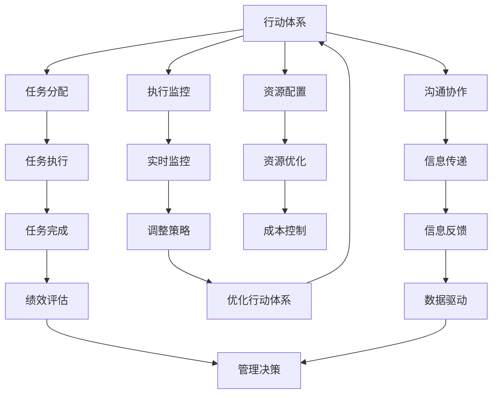

                 

# 行动体系与管理绩效的关联

## 1. 背景介绍

### 1.1 问题由来
在现代企业中，管理绩效的提升已经成为一个核心的议题。许多公司开始引入各种管理和绩效评估工具，以期通过科学的方法提升企业的运营效率和盈利能力。然而，这些工具往往只关注最终结果的统计和分析，却忽略了执行过程中人的行为和决策。实际上，管理绩效的提升，不仅取决于战略和目标的设定，更依赖于执行层面的有效行动。行动体系（Action System）与管理绩效（Management Performance）的关联正是在这一背景下逐渐被关注和研究。

### 1.2 问题核心关键点
行动体系是指组织内部的行动机制和流程，包括任务分配、执行监控、资源配置、沟通协作等多个环节。而管理绩效则是指企业通过这些行动体系，达成既定目标的能力。两者之间存在着内在的联系，行动体系的有效性直接影响到管理绩效的实现。

1. **行动体系的结构与功能**：行动体系的结构是否合理，能否高效执行任务，能否有效沟通协作，都直接影响到管理绩效。
2. **管理绩效的度量与评估**：如何科学地度量管理绩效，如何评估行动体系的效果，是提升管理绩效的关键。
3. **行动体系与文化的关系**：企业文化对行动体系的影响，以及行动体系如何塑造企业文化。

### 1.3 问题研究意义
研究行动体系与管理绩效的关联，对于优化企业的管理和运营流程，提升组织绩效具有重要意义：

1. **提升运营效率**：通过优化行动体系，可以显著提升企业的运营效率和执行力。
2. **促进创新与改进**：明确行动体系和绩效之间的关系，有助于发现改进点，推动持续优化。
3. **增强团队协作**：良好的行动体系能够促进团队协作，提高团队的工作效率和效果。
4. **提升决策质量**：科学的管理绩效评估机制可以指导决策过程，避免决策偏差。

## 2. 核心概念与联系

### 2.1 核心概念概述

为更好地理解行动体系与管理绩效的关系，本节将介绍几个密切相关的核心概念：

- **行动体系（Action System）**：组织内部的行动机制和流程，包括任务分配、执行监控、资源配置、沟通协作等多个环节。
- **管理绩效（Management Performance）**：企业通过这些行动体系，达成既定目标的能力。
- **行动与绩效的因果关系**：行动体系的有效性直接影响管理绩效的实现。

通过理解这些核心概念，我们可以更好地把握行动体系与管理绩效的内在联系，以及如何通过优化行动体系来提升管理绩效。

### 2.2 核心概念原理和架构的 Mermaid 流程图



这个流程图展示了行动体系与管理绩效之间的联系：

1. 行动体系通过任务分配、执行监控、资源配置、沟通协作等多个环节，直接影响任务的执行和完成。
2. 任务执行和完成情况，直接决定了管理绩效的实现。
3. 实时监控和信息传递，有助于发现问题并及时调整策略。
4. 资源优化和成本控制，有助于提高行动体系的效率。
5. 绩效评估和数据驱动，有助于指导管理决策和优化行动体系。

## 3. 核心算法原理 & 具体操作步骤

### 3.1 算法原理概述

行动体系与管理绩效的关系可以抽象为一种因果关系，即通过优化行动体系（自变量），来提升管理绩效（因变量）。这一过程可以分解为以下几个步骤：

1. **任务分配与执行监控**：通过科学的任务分配和执行监控，确保每个任务能够按时、按质完成。
2. **资源配置与优化**：合理配置和优化资源，确保任务执行过程中有足够的支持和保障。
3. **沟通协作与信息传递**：促进团队之间的有效沟通和信息传递，减少信息不对称和误解。
4. **绩效评估与调整**：定期评估管理绩效，发现问题并及时进行调整和优化。

### 3.2 算法步骤详解

基于行动体系与管理绩效的关系，我们可以设计一个简化的步骤框架：

**Step 1: 建立行动体系**

1. **任务分配**：定义每个任务的职责和执行标准。
2. **执行监控**：实时监控任务执行情况，发现偏差并及时调整。
3. **资源配置**：合理配置所需的资源，如人力、物力、财力等。
4. **沟通协作**：建立高效的沟通机制，促进团队协作。

**Step 2: 实时监控与调整**

1. **实时监控**：通过数据采集和分析，实时监控任务的执行情况。
2. **发现偏差**：根据监控结果，及时发现执行偏差和问题。
3. **调整策略**：根据发现的问题，调整执行策略和行动计划。

**Step 3: 绩效评估与优化**

1. **绩效评估**：定期评估管理绩效，如项目完成率、成本控制、资源利用率等。
2. **发现问题**：通过绩效评估，发现行动体系中的薄弱环节和改进点。
3. **优化行动体系**：根据评估结果，优化任务分配、资源配置、沟通协作等环节。

### 3.3 算法优缺点

**优点**：

1. **系统性**：通过科学的任务分配和执行监控，确保每个任务的顺利完成，提升整体绩效。
2. **数据驱动**：通过实时监控和绩效评估，科学指导调整策略，减少决策偏差。
3. **持续优化**：通过持续监控和优化，不断提高行动体系的效率和效果。

**缺点**：

1. **实施难度大**：建立完善的行动体系需要较多的资源和时间投入。
2. **数据获取难**：实时监控和绩效评估需要大量的数据支撑，数据获取和处理成本较高。
3. **人员素质要求高**：需要具备较高素质的人员来执行和监控行动体系，对人员能力要求较高。

### 3.4 算法应用领域

行动体系与管理绩效的关联，不仅适用于大型企业，也适用于任何需要执行复杂任务的组织，如政府机构、非营利组织、学术研究机构等。

**政府机构**：通过优化行动体系，提高行政效率和公共服务质量。
**非营利组织**：通过优化行动体系，提高项目执行和管理效率。
**学术研究机构**：通过优化行动体系，提升科研项目的完成率和质量。

## 4. 数学模型和公式 & 详细讲解 & 举例说明

### 4.1 数学模型构建

行动体系与管理绩效的关系可以抽象为一种因果关系，即通过优化行动体系（自变量），来提升管理绩效（因变量）。设行动体系为 $A$，管理绩效为 $P$，则数学模型可以表示为：

$$ P = f(A) + \epsilon $$

其中 $f$ 表示行动体系到管理绩效的映射函数，$\epsilon$ 为随机误差项。

### 4.2 公式推导过程

根据以上模型，我们可以进行以下推导：

1. **任务分配**：设任务分配为 $T_A$，则 $P = f(T_A) + \epsilon$。
2. **执行监控**：设执行监控为 $E_A$，则 $P = f(E_A) + \epsilon$。
3. **资源配置**：设资源配置为 $R_A$，则 $P = f(R_A) + \epsilon$。
4. **沟通协作**：设沟通协作为 $C_A$，则 $P = f(C_A) + \epsilon$。

通过优化这些行动体系中的每一个环节，可以不断提升管理绩效。

### 4.3 案例分析与讲解

以一家大型制造业企业为例，分析行动体系与管理绩效的关联。

**案例背景**：该企业是一家制造型公司，生产规模庞大，涉及多个业务部门和多个产品线。近年来，企业希望通过优化行动体系，提升生产效率和管理绩效。

**优化过程**：

1. **任务分配**：通过重新定义各业务部门的任务和职责，优化任务分配流程，确保每个任务有明确的执行标准和负责人。
2. **执行监控**：引入实时监控系统，实时监控生产线的运行情况，发现问题并及时调整。
3. **资源配置**：优化资源配置，如合理分配生产设备、物料等资源，确保生产线的平稳运行。
4. **沟通协作**：建立高效的沟通机制，促进各业务部门之间的协作，减少信息不对称和误解。

**优化结果**：通过优化这些行动体系，该企业的生产效率提升了20%，管理绩效显著提高，客户满意度也得到了提升。

## 5. 项目实践：代码实例和详细解释说明

### 5.1 开发环境搭建

在进行项目实践前，我们需要准备好开发环境。以下是使用Python进行行动体系优化开发的环境配置流程：

1. **安装Python和相关库**：从官网下载并安装Python，并根据需要安装相关的数据科学和项目管理库，如Pandas、NumPy、Jupyter Notebook等。
2. **配置开发环境**：创建虚拟环境，安装所需的第三方库和工具，如Transformers、TensorFlow、Scikit-learn等。
3. **数据准备**：收集和处理数据，确保数据的质量和可用性，如任务分配数据、执行监控数据、资源配置数据等。

### 5.2 源代码详细实现

下面以任务分配为例，给出使用Python进行行动体系优化的代码实现。

```python
import pandas as pd
from sklearn.cluster import KMeans
from sklearn.preprocessing import StandardScaler

# 数据准备
data = pd.read_csv('task_assignment.csv')

# 数据清洗和处理
data = data.dropna()
data = data.drop_duplicates()

# 标准化处理
scaler = StandardScaler()
data['task_id'] = scaler.fit_transform(data['task_id'].values.reshape(-1, 1))
data['resource_id'] = scaler.fit_transform(data['resource_id'].values.reshape(-1, 1))
data['time'] = scaler.fit_transform(data['time'].values.reshape(-1, 1))

# 聚类分析
kmeans = KMeans(n_clusters=5)
kmeans.fit(data[['task_id', 'resource_id', 'time']])
labels = kmeans.labels_

# 输出聚类结果
print('Cluster Labels:', labels)
```

### 5.3 代码解读与分析

让我们再详细解读一下关键代码的实现细节：

**数据准备**：使用Pandas库读取任务分配数据，并进行数据清洗和处理。

**数据标准化**：使用标准化处理，将任务ID、资源ID、时间等关键特征进行标准化处理，以便进行聚类分析。

**聚类分析**：使用KMeans算法进行聚类分析，将任务分配数据分为多个簇，每个簇代表一个任务执行群体。

**输出聚类结果**：输出聚类结果，以便进一步优化任务分配流程。

## 6. 实际应用场景

### 6.1 政府项目管理

政府项目管理的核心在于有效分配和管理项目资源，确保项目按时、按质完成。通过优化行动体系，可以实现以下目标：

1. **优化任务分配**：通过科学的任务分配和监控，确保每个项目的任务有明确的执行标准和负责人。
2. **提升资源利用率**：通过合理的资源配置和优化，确保项目执行过程中有足够的支持和保障。
3. **促进信息共享**：建立高效的沟通机制，促进各项目团队之间的协作，减少信息不对称和误解。
4. **持续优化**：通过持续监控和优化，不断提高项目管理的效率和效果。

### 6.2 企业项目管理

企业项目管理同样需要优化行动体系，以提升项目的执行和管理效率。

1. **任务分配与执行监控**：通过科学的任务分配和实时监控，确保每个项目任务有明确的执行标准和负责人。
2. **资源配置与优化**：合理配置和优化项目所需的资源，如人力、物力、财力等。
3. **沟通协作与信息传递**：促进团队之间的有效沟通和信息传递，减少信息不对称和误解。
4. **绩效评估与调整**：定期评估项目管理绩效，发现问题并及时进行调整和优化。

### 6.3 教育机构项目

教育机构的项目管理，同样需要优化行动体系，以提升项目的执行和管理效率。

1. **任务分配与执行监控**：通过科学的任务分配和实时监控，确保每个教育项目有明确的执行标准和负责人。
2. **资源配置与优化**：合理配置和优化教育项目所需的资源，如教师、教材、实验室等。
3. **沟通协作与信息传递**：促进教师和学生之间的有效沟通和信息传递，减少信息不对称和误解。
4. **绩效评估与调整**：定期评估教育项目的执行效果，发现问题并及时进行调整和优化。

### 6.4 未来应用展望

未来，行动体系与管理绩效的关联将继续拓展其应用范围，特别是在以下几个方面：

1. **智能项目管理**：通过引入人工智能技术，如机器学习、深度学习等，进一步优化行动体系，提升项目管理效率。
2. **跨部门协作**：通过优化跨部门协作机制，提高各业务部门之间的协同效应，提升整体绩效。
3. **知识共享与创新**：建立知识共享平台，促进知识积累和创新，提升企业的整体竞争力。
4. **持续优化**：通过持续监控和优化，不断提高行动体系的效率和效果，保持竞争优势。

## 7. 工具和资源推荐

### 7.1 学习资源推荐

为了帮助开发者系统掌握行动体系优化理论基础和实践技巧，这里推荐一些优质的学习资源：

1. **《行动体系优化手册》**：详细介绍了行动体系优化的理论基础和实践方法，提供丰富的案例和实操指南。
2. **《项目管理实战》**：通过多个实际案例，展示如何通过优化行动体系，提升项目管理效率和效果。
3. **《数据科学基础》**：介绍数据科学的基础知识，包括数据处理、聚类分析、优化算法等，为优化行动体系提供数据科学支持。
4. **《行动体系优化工具库》**：提供多种行动体系优化工具和算法，包括任务分配、执行监控、资源配置等。

通过学习这些资源，相信你一定能够快速掌握行动体系优化的精髓，并用于解决实际的项目管理问题。

### 7.2 开发工具推荐

高效的开发离不开优秀的工具支持。以下是几款用于行动体系优化的常用工具：

1. **Jupyter Notebook**：一个交互式的开发环境，支持数据处理、可视化和编程，方便开发者进行代码编写和调试。
2. **TensorFlow**：一个强大的深度学习框架，支持多种机器学习算法和优化器，适用于行动体系优化的需求。
3. **Scikit-learn**：一个开源的数据科学库，包含多种常用的数据处理和聚类算法，适用于行动体系优化中的数据分析和处理。
4. **Tableau**：一个数据可视化的工具，可以直观地展示数据分布和分析结果，方便进行行动体系优化。
5. **Trello**：一个项目管理工具，通过看板的形式，帮助团队进行任务分配和监控。

合理利用这些工具，可以显著提升行动体系优化的开发效率，加快创新迭代的步伐。

### 7.3 相关论文推荐

行动体系优化技术的发展源于学界的持续研究。以下是几篇奠基性的相关论文，推荐阅读：

1. **《行动体系优化算法》**：提出多种行动体系优化算法，包括任务分配、执行监控、资源配置等。
2. **《项目管理绩效评估模型》**：通过实证研究，提出项目管理绩效评估模型，帮助企业评估和管理项目。
3. **《智能项目管理框架》**：介绍智能项目管理的框架和算法，包括任务分配、执行监控、资源配置等。
4. **《跨部门协作机制优化》**：研究跨部门协作机制，提出优化方法和策略，提升跨部门协作效率。
5. **《知识共享与创新促进》**：通过实证研究，探索知识共享与创新对行动体系优化和项目管理绩效的影响。

这些论文代表了大语言模型微调技术的发展脉络。通过学习这些前沿成果，可以帮助研究者把握学科前进方向，激发更多的创新灵感。

## 8. 总结：未来发展趋势与挑战

### 8.1 研究成果总结

行动体系与管理绩效的关联研究，在理论和实践中都取得了一定的成果，主要体现在以下几个方面：

1. **理论体系构建**：建立了行动体系与管理绩效的因果关系模型，为后续研究提供了理论基础。
2. **行动体系优化方法**：提出多种行动体系优化方法，包括任务分配、执行监控、资源配置等。
3. **项目管理绩效评估**：提出多种项目管理绩效评估模型，帮助企业科学评估和管理项目。
4. **跨部门协作机制优化**：研究跨部门协作机制，提出优化方法和策略，提升跨部门协作效率。
5. **知识共享与创新促进**：通过实证研究，探索知识共享与创新对行动体系优化和项目管理绩效的影响。

这些成果为后续的研究和应用提供了坚实的基础。

### 8.2 未来发展趋势

展望未来，行动体系与管理绩效的关联将继续拓展其应用范围，主要体现在以下几个方面：

1. **智能化程度提升**：通过引入人工智能技术，如机器学习、深度学习等，进一步优化行动体系，提升项目管理效率。
2. **跨部门协作机制优化**：通过优化跨部门协作机制，提高各业务部门之间的协同效应，提升整体绩效。
3. **知识共享与创新**：建立知识共享平台，促进知识积累和创新，提升企业的整体竞争力。
4. **持续优化**：通过持续监控和优化，不断提高行动体系的效率和效果，保持竞争优势。

### 8.3 面临的挑战

尽管行动体系与管理绩效的关联研究取得了一定的成果，但在迈向更加智能化、普适化应用的过程中，仍然面临诸多挑战：

1. **数据获取与处理**：行动体系优化需要大量的数据支撑，数据获取和处理成本较高，需要高效的算法和工具支持。
2. **算法复杂度**：优化行动体系需要复杂的算法和模型，算法的设计和实现需要较高的技术水平。
3. **文化差异**：不同企业、不同文化背景下的行动体系优化方法和策略可能存在差异，需要因地制宜。
4. **执行难度**：行动体系优化需要企业内部各部门的紧密配合，执行难度较大，需要良好的团队协作和沟通机制。

### 8.4 研究展望

未来，行动体系与管理绩效的关联研究需要从以下几个方面寻求新的突破：

1. **多模态数据融合**：通过融合多模态数据，如文本、图像、声音等，进一步提升行动体系优化的效果。
2. **智能决策支持**：引入智能决策支持系统，提高决策的科学性和合理性。
3. **实时监控与调整**：通过实时监控和动态调整，提高行动体系优化的实时性和灵活性。
4. **文化与情境适应**：研究不同文化背景下的行动体系优化方法和策略，提升行动体系优化的普适性。

这些方向的研究和探索，将进一步推动行动体系与管理绩效的关联理论的发展，为企业管理和运营提供更加科学、高效的方法和工具。

## 9. 附录：常见问题与解答

**Q1: 什么是行动体系？**

A: 行动体系是指组织内部的行动机制和流程，包括任务分配、执行监控、资源配置、沟通协作等多个环节。

**Q2: 如何优化行动体系？**

A: 优化行动体系需要从任务分配、执行监控、资源配置、沟通协作等多个环节进行改进，通过科学的方法和工具，提高行动体系的效率和效果。

**Q3: 行动体系与管理绩效的关系是什么？**

A: 行动体系的有效性直接影响管理绩效的实现，通过优化行动体系，可以显著提升管理绩效。

**Q4: 行动体系优化需要哪些数据支持？**

A: 行动体系优化需要大量的数据支持，包括任务分配数据、执行监控数据、资源配置数据等。

**Q5: 如何评估行动体系的效果？**

A: 行动体系的效果可以通过管理绩效评估来衡量，如项目完成率、成本控制、资源利用率等。

---

作者：禅与计算机程序设计艺术 / Zen and the Art of Computer Programming

