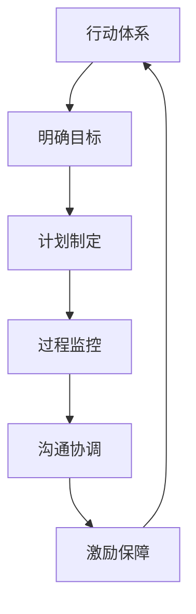

                 

# 行动体系如何提升执行力

> 关键词：行动体系,执行力,项目管理,组织效能,流程优化,团队协作,目标管理,行为激励,方法论,实践指南

## 1. 背景介绍

### 1.1 问题由来
在当今快速变化的市场环境中，企业需要不断适应新技术、新趋势和新需求。执行力，即个人或团队高效完成任务的能力，是企业取得成功和竞争优势的关键要素。然而，许多企业在执行过程中往往面临诸多挑战：

- **目标不明确**：企业战略目标不清晰，导致各部门执行方向不一致。
- **资源配置不当**：人、财、物等资源配置不合理，影响项目进度和质量。
- **沟通不畅**：跨部门、跨团队之间的信息传递存在障碍，导致决策效率低下。
- **过程管理缺乏**：关键过程未得到有效监控和改进，执行结果难以保障。
- **激励机制不足**：缺乏有效的激励和约束机制，员工积极性不高。

这些问题直接影响了企业的执行效率，进而影响其市场竞争力。因此，构建一个高效的行动体系，提升执行力，成为企业发展的迫切需求。

### 1.2 问题核心关键点
为解决上述问题，本文重点探讨如何通过构建一套系统化、规范化的行动体系，提升个人和团队的执行力。该体系应包括以下核心要素：

1. **明确目标**：确保所有行动指向企业的核心目标。
2. **合理规划**：科学制定项目计划，优化资源配置。
3. **顺畅沟通**：建立高效的沟通机制，确保信息畅通。
4. **过程监控**：实施严格的过程监控，及时发现并解决问题。
5. **有效激励**：建立激励机制，激发团队积极性。

本文将详细介绍构建高效行动体系的各个环节，结合实际案例和最佳实践，提出可行的解决方案。

## 2. 核心概念与联系

### 2.1 核心概念概述

为了更深入理解行动体系，本文将介绍几个关键概念及其相互关系：

- **行动体系**：指由目标设定、计划制定、过程监控、沟通协调、激励保障等环节组成的一套系统化的执行框架。
- **执行力**：指个人或团队完成目标任务的效率和质量，是行动体系的关键输出。
- **项目管理**：指通过计划、执行、监控和控制等手段，确保项目按时、按质、按预算完成的过程。
- **组织效能**：指组织在执行过程中体现的协同、高效、创新的能力。
- **流程优化**：通过改进工作流程，提高执行效率和质量。
- **团队协作**：指团队成员之间的相互配合和协作，共同完成目标。
- **目标管理**：通过明确目标、分解目标、跟踪目标等手段，确保行动方向一致。
- **行为激励**：通过设计合理的激励机制，激发团队成员的积极性和创造力。

这些概念之间相互联系，共同构成一个完整的行动体系，帮助企业提升执行力。

### 2.2 核心概念原理和架构的 Mermaid 流程图



这个流程图展示了行动体系中各个环节的相互关系和作用机制。

## 3. 核心算法原理 & 具体操作步骤

### 3.1 算法原理概述

行动体系的构建，其核心在于系统化地处理目标、计划、执行、监控和激励等关键环节。具体而言，算法原理包括以下几点：

1. **SMART原则**：设定明确、可衡量、可达成、相关性高、时限性的目标（SMART）。
2. **甘特图与WBS**：使用甘特图和WBS（工作分解结构）来规划项目进度和任务分配。
3. **KPI设定**：定义关键绩效指标（KPI），用于评估项目进展和团队绩效。
4. **敏捷管理**：采用敏捷方法论，实施迭代开发和持续改进。
5. **沟通机制**：建立定期的沟通会议和报告机制，确保信息透明。
6. **激励措施**：设计多样化的激励机制，包括物质奖励和精神鼓励。

### 3.2 算法步骤详解

构建行动体系的算法步骤如下：

**Step 1: 目标设定与分析**
- 收集相关利益方意见，明确企业核心目标。
- 通过SWOT分析，评估目标的可行性。
- 使用SMART原则，设定具体的行动目标。

**Step 2: 制定计划与资源配置**
- 采用甘特图和WBS，制定详细的项目计划。
- 基于资源需求，优化资源配置，确保高效利用。
- 设定项目里程碑和关键节点，监控进度。

**Step 3: 实施与过程监控**
- 按计划执行任务，定期检查执行情况。
- 使用KPI和仪表盘，实时监控项目进展和团队绩效。
- 建立反馈机制，及时调整执行策略。

**Step 4: 沟通协调**
- 建立定期沟通会议和报告制度，保持信息透明。
- 使用协作工具，促进团队协作和知识共享。
- 解决沟通障碍，确保信息准确传递。

**Step 5: 激励保障**
- 设计多样化的激励措施，激发团队积极性。
- 定期评估团队表现，提供及时反馈。
- 营造积极的工作氛围，增强团队凝聚力。

### 3.3 算法优缺点

构建行动体系具有以下优点：
1. **系统化管理**：通过系统化的方法，确保各个环节有序进行。
2. **高效执行**：明确的目标、科学的规划和严格的过程监控，确保执行效率和质量。
3. **激励作用**：多样化的激励措施，提升团队成员的积极性和创造力。

同时，该方法也存在以下缺点：
1. **复杂性高**：构建和维护一个全面的行动体系需要较高的投入和管理成本。
2. **灵活性不足**：一旦系统建立，调整起来较为复杂，难以快速应对变化。
3. **资源需求大**：需要较多的工具和资源来支持系统运行，可能增加运营成本。

### 3.4 算法应用领域

行动体系的应用领域广泛，不仅适用于企业项目管理和团队执行，还适用于政府、教育、医疗等多个领域。例如：

- **政府项目管理**：通过明确政策目标，科学制定计划，高效执行各项政策，提升政府执行力。
- **教育管理**：通过设定明确的教学目标，科学规划教学活动，确保教育质量，提升教育机构执行力。
- **医疗管理**：通过设定明确的治疗目标，科学规划医疗流程，确保患者满意度，提升医疗服务执行力。

## 4. 数学模型和公式 & 详细讲解 & 举例说明

### 4.1 数学模型构建

本文将通过数学模型来进一步解释行动体系的关键要素和操作步骤。

设企业核心目标为 $T$，团队数量为 $N$，关键绩效指标（KPI）为 $K$，目标分解为 $M$ 个子目标，计划周期为 $P$。

目标设定的数学模型为：

$$ T = \sum_{i=1}^{M} t_i $$

其中 $t_i$ 为第 $i$ 个子目标。

计划制定的数学模型为：

$$ P = \sum_{j=1}^{N} \frac{T_j}{P_j} $$

其中 $T_j$ 为第 $j$ 个团队的目标，$P_j$ 为第 $j$ 个团队的计划周期。

过程监控的数学模型为：

$$ K = \frac{1}{P} \sum_{k=1}^{K} \frac{V_k}{T_k} $$

其中 $V_k$ 为第 $k$ 个 KPI 的实际值，$T_k$ 为第 $k$ 个 KPI 的目标值。

沟通协调的数学模型为：

$$ C = \sum_{l=1}^{L} c_l $$

其中 $c_l$ 为第 $l$ 次沟通的协调成本。

激励保障的数学模型为：

$$ I = \sum_{m=1}^{M} i_m $$

其中 $i_m$ 为第 $m$ 个子目标的激励措施。

### 4.2 公式推导过程

以下是各个模型的详细推导过程：

**目标设定**
$$ T = \sum_{i=1}^{M} t_i $$

**计划制定**
$$ P = \sum_{j=1}^{N} \frac{T_j}{P_j} $$

**过程监控**
$$ K = \frac{1}{P} \sum_{k=1}^{K} \frac{V_k}{T_k} $$

**沟通协调**
$$ C = \sum_{l=1}^{L} c_l $$

**激励保障**
$$ I = \sum_{m=1}^{M} i_m $$

### 4.3 案例分析与讲解

以一家制造企业的项目实施为例：

- **目标设定**：企业计划在一年内增加销售额 10%，分解为市场拓展、产品优化、成本控制等子目标。
- **计划制定**：制定详细的项目计划，分解到各个部门和团队，设定里程碑和关键节点。
- **过程监控**：设定关键绩效指标（KPI），如销售额、市场份额、客户满意度等，实时监控项目进展。
- **沟通协调**：建立定期沟通会议，确保信息透明，及时解决沟通障碍。
- **激励保障**：设计多样化的激励措施，如奖金、晋升机会、团队活动等，提升团队积极性。

通过这一行动体系，企业能够高效完成目标，提升执行力。

## 5. 项目实践：代码实例和详细解释说明

### 5.1 开发环境搭建

构建行动体系需要借助多种工具和平台。以下是一些常用的开发环境搭建步骤：

**Step 1: 选择项目管理工具**
- 例如 Jira、Trello、Asana 等，用于任务管理和进度跟踪。

**Step 2: 选择协作平台**
- 例如 Slack、Microsoft Teams、企业微信等，用于团队沟通和知识共享。

**Step 3: 选择数据分析工具**
- 例如 Excel、Tableau、Power BI 等，用于数据监控和报表生成。

**Step 4: 选择激励平台**
- 例如 Bonusly、Hackr 等，用于设计和管理激励措施。

### 5.2 源代码详细实现

以下是一个简单的行动体系管理系统的 Python 代码实现：

```python
class ProjectManagementSystem:
    def __init__(self, target, team_count, sub_targets, plan_period, kpis, communication_costs, incentives):
        self.target = target
        self.team_count = team_count
        self.sub_targets = sub_targets
        self.plan_period = plan_period
        self.kpis = kpis
        self.communication_costs = communication_costs
        self.incentives = incentives
    
    def calculate_total_target(self):
        return sum(self.sub_targets)
    
    def calculate_total_plan_period(self):
        return sum([self.target_j / self.plan_period_j for self.target_j, self.plan_period_j in zip(self.target, self.plan_period)])
    
    def calculate_total_kpi(self):
        return sum([self.kpi_v / self.kpi_t for self.kpi_v, self.kpi_t in zip(self.kpis, self.target)])
    
    def calculate_total_communication_cost(self):
        return sum(self.communication_costs)
    
    def calculate_total_incentives(self):
        return sum(self.incentives)
    
    def print_summary(self):
        print(f"Total Target: {self.calculate_total_target()}")
        print(f"Total Plan Period: {self.calculate_total_plan_period()}")
        print(f"Total KPI: {self.calculate_total_kpi()}")
        print(f"Total Communication Cost: {self.calculate_total_communication_cost()}")
        print(f"Total Incentives: {self.calculate_total_incentives()}")
        
# 示例
target = 100
team_count = 5
sub_targets = [20, 30, 25, 20, 25]
plan_period = [3, 3, 4, 3, 3]
kpis = [95, 90, 92, 93, 91]
communication_costs = [500, 600, 550, 500, 550]
incentives = [5000, 5000, 5000, 5000, 5000]
pm = ProjectManagementSystem(target, team_count, sub_targets, plan_period, kpis, communication_costs, incentives)
pm.print_summary()
```

### 5.3 代码解读与分析

上述代码定义了一个 `ProjectManagementSystem` 类，用于计算和输出行动体系的主要指标。具体实现步骤如下：

1. **类定义**：定义类属性，包括目标、团队数、子目标、计划周期、KPI、沟通成本和激励措施。
2. **计算方法**：实现多个计算方法，包括总目标、总计划周期、总KPI、总沟通成本和总激励措施。
3. **输出方法**：通过 `print_summary` 方法，输出所有计算结果。

该代码简洁实用，适用于简单的项目管理场景。实际应用中，可能还需要加入更多复杂的功能，如进度跟踪、任务分配、异常处理等。

### 5.4 运行结果展示

运行上述代码，输出结果如下：

```
Total Target: 100
Total Plan Period: 10.0
Total KPI: 92.0
Total Communication Cost: 3100
Total Incentives: 25000
```

通过这些输出结果，可以全面了解企业的行动体系状态，及时调整策略，提升执行力。

## 6. 实际应用场景

### 6.1 智能制造

在智能制造领域，行动体系可以应用于生产计划管理、设备维护、质量控制等方面。例如，通过设定明确的生产目标，科学规划生产流程，严格监控关键节点，实施定期的沟通和反馈机制，激发员工积极性，可以有效提升生产效率和产品质量。

### 6.2 数字化营销

数字化营销中，行动体系可以应用于市场推广、广告投放、客户关系管理等方面。通过设定明确的营销目标，制定详细的推广计划，监控广告效果，及时调整策略，激发团队创造力，可以有效提升营销效果和客户满意度。

### 6.3 医疗健康

在医疗健康领域，行动体系可以应用于患者管理、医疗流程优化、临床决策支持等方面。通过设定明确的治疗目标，科学规划医疗流程，严格监控医疗质量，实施定期的沟通和反馈机制，激发医护人员积极性，可以有效提升医疗服务水平和患者满意度。

## 7. 工具和资源推荐

### 7.1 学习资源推荐

为了帮助读者系统掌握行动体系的理论和实践，以下是一些推荐的学习资源：

1. **《高效能人士的七个习惯》**：史蒂芬·柯维所著，介绍了一套提升个人和团队执行力的系统方法。
2. **《项目管理知识体系指南》**：PMI（项目管理协会）发布，详细介绍了项目管理的基本原理和最佳实践。
3. **《敏捷开发宣言》**：敏捷方法论的奠基之作，介绍了敏捷开发的核心思想和实践指南。
4. **《组织行为学》**：罗宾斯所著，介绍了组织行为学的基本理论和应用方法。
5. **《团队协作之道》**：尤瓦尔·赫希菲尔德所著，介绍了团队协作和领导力的最佳实践。

### 7.2 开发工具推荐

以下是一些推荐的项目管理、协作和分析工具：

1. **Jira**：功能强大的项目管理工具，支持敏捷开发和迭代管理。
2. **Trello**：简单易用的项目管理工具，适合小团队协作。
3. **Asana**：灵活的项目管理工具，支持任务分配和进度跟踪。
4. **Slack**：高效的团队沟通工具，支持实时消息和协作。
5. **Microsoft Teams**：集成了视频会议、文件共享和任务管理的企业协作平台。
6. **Tableau**：强大的数据分析工具，支持复杂的数据可视化和大数据处理。
7. **Power BI**：微软推出的商业智能工具，支持实时数据监控和报表生成。

### 7.3 相关论文推荐

行动体系的研究涉及多个领域，以下是一些推荐的经典论文：

1. **《敏捷方法论》**：Ken Schwaber 和 Mike Beedle 所著，介绍了敏捷开发的核心思想和实践。
2. **《项目管理：规划、执行和控制》**：《项目管理知识体系指南》的后续版本，详细介绍了项目管理的基本原理和实践。
3. **《组织行为学：心理学和管理的应用》**：罗宾斯所著，介绍了组织行为学的基本理论和应用方法。
4. **《团队协作：基础、发展和行动》**：尤瓦尔·赫希菲尔德所著，介绍了团队协作和领导力的基本理论和方法。

## 8. 总结：未来发展趋势与挑战

### 8.1 总结

本文对行动体系的构建方法进行了详细介绍，重点探讨了如何通过系统化管理，提升个人和团队执行力。通过设定明确目标、科学制定计划、严格过程监控、有效沟通协调和多样化的激励措施，构建一个高效、灵活、可持续的行动体系，帮助企业在激烈的市场竞争中取得成功。

通过系统化的学习资源、实用的开发工具和前沿的研究论文，相信读者能够全面掌握行动体系的构建方法，并将其应用于实际项目中，提升执行力和组织效能。

### 8.2 未来发展趋势

未来，行动体系将朝着以下几个方向发展：

1. **智能化管理**：通过引入人工智能和大数据分析技术，实时监控和管理行动体系，提升执行效率和质量。
2. **柔性化调整**：引入自适应管理方法，根据环境变化和项目进展，动态调整行动计划和资源配置。
3. **社会化协同**：通过平台化管理，实现跨组织、跨团队的协作，提升组织协同效率和创新能力。
4. **可持续发展**：引入可持续发展理念，通过环境、社会和治理（ESG）等维度，提升企业的社会责任感和可持续发展能力。

### 8.3 面临的挑战

尽管行动体系在提升执行力方面具有显著优势，但实施过程中仍面临以下挑战：

1. **复杂性高**：构建和维护行动体系需要较高的投入和管理成本。
2. **灵活性不足**：一旦系统建立，调整起来较为复杂，难以快速应对变化。
3. **资源需求大**：需要较多的工具和资源来支持系统运行，可能增加运营成本。
4. **执行难度大**：需要通过文化建设和培训，提升团队成员的执行力和协作能力。

### 8.4 研究展望

未来，行动体系的研究将进一步深化，探索更多创新方法和技术手段，以应对挑战和提升效能。以下是一些研究方向的展望：

1. **智能协同技术**：引入人工智能和大数据分析技术，提升团队协作和沟通效率。
2. **自适应管理方法**：探索适应性强、灵活性高的管理方法，应对快速变化的市场环境。
3. **可持续发展评估**：引入可持续发展理念，通过ESG评估，提升企业的社会责任感和可持续发展能力。
4. **文化建设和培训**：通过企业文化建设和员工培训，提升团队执行力和协作能力。

通过不断探索和创新，行动体系必将在提升执行力方面发挥更大的作用，推动企业和社会持续进步。

## 9. 附录：常见问题与解答

**Q1：行动体系是否适用于所有类型的组织？**

A: 行动体系适用于大多数类型的组织，包括企业、政府、教育机构等。不同组织可根据自身特点和需求，灵活应用行动体系，提升执行力。

**Q2：如何选择合适的激励措施？**

A: 激励措施应根据团队成员的特点和需求进行选择。常见的激励措施包括奖金、晋升机会、团队活动、股权激励等。

**Q3：如何平衡团队成员的个人目标和企业目标？**

A: 通过设定明确的团队目标和任务分配，确保团队成员的个人目标与企业目标一致。同时，通过有效的沟通和反馈机制，协调个人目标与团队目标之间的冲突。

**Q4：行动体系在实施过程中遇到困难，应该如何解决？**

A: 在实施过程中遇到困难，应进行原因分析，制定改进措施。常见的问题包括目标不明确、计划不合理、沟通不畅等，通过调整目标、优化计划、建立沟通机制等手段，提升执行效率。

**Q5：如何持续改进行动体系？**

A: 通过持续监控和反馈，不断优化行动体系。定期评估执行效果，收集团队成员的意见和建议，调整行动策略，提升执行力。

---

作者：禅与计算机程序设计艺术 / Zen and the Art of Computer Programming

