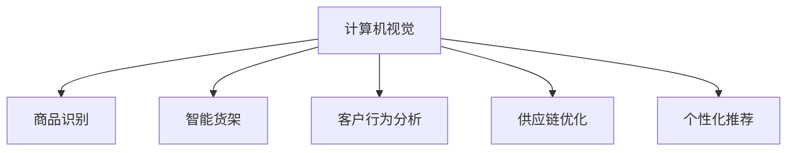

                 

# 计算机视觉在零售业中的创新应用

> 关键词：计算机视觉,零售业,商品识别,智能货架,客户行为分析,供应链优化,个性化推荐

## 1. 背景介绍

随着人工智能技术的不断进步，计算机视觉在各行各业中得到了广泛应用。零售业作为人类生活中最为重要的行业之一，更是计算机视觉技术的重要应用领域。传统零售业依赖大量人力进行商品管理、库存盘点、客户服务等工作，效率低、成本高、准确性差。而计算机视觉技术通过图像识别、目标跟踪、场景分析等手段，能够有效提升零售业的运营效率和客户体验，实现数字化、智能化转型。

本文章将介绍计算机视觉在零售业中的创新应用，通过图像识别技术实现商品识别、智能货架、客户行为分析等功能，借助视频分析技术优化供应链，构建个性化推荐系统，以数据驱动零售业的全面升级。

## 2. 核心概念与联系

### 2.1 核心概念概述

为更好地理解计算机视觉在零售业中的应用，本节将介绍几个关键概念：

- **计算机视觉（Computer Vision）**：使用计算机和人工智能技术处理、分析和理解图像和视频中的内容，提取有价值的信息，用于辅助决策、自动化处理等。
- **商品识别（Object Recognition）**：通过图像识别算法，自动识别图像中的商品种类、数量、位置等信息，减少人工误差。
- **智能货架（Smart Shelves）**：结合计算机视觉和物联网技术，实现货架商品动态管理，提升库存精准度和顾客购物体验。
- **客户行为分析（Customer Behavior Analysis）**：通过视频分析、路径追踪等技术，分析客户在商场中的行为模式，优化商品陈列和营销策略。
- **供应链优化（Supply Chain Optimization）**：利用计算机视觉对供应链各个环节进行实时监控和数据收集，实现库存管理、物流调度和需求预测。
- **个性化推荐（Personalized Recommendation）**：结合计算机视觉和客户行为数据，构建个性化推荐系统，提升客户购物体验和销售额。

这些概念之间的联系通过以下Mermaid流程图展示：



这个流程图展示了计算机视觉技术在零售业的多个应用场景，并通过这五个关键应用提升了零售业的运营效率和客户体验。

## 3. 核心算法原理 & 具体操作步骤
### 3.1 算法原理概述

计算机视觉在零售业中的应用，主要依赖于图像处理和模式识别算法。其核心原理是通过训练模型，使其能够自动提取图像中的特征，从而实现对商品、场景、客户行为的自动识别和分析。

以商品识别为例，常见的算法包括卷积神经网络（Convolutional Neural Network, CNN）、区域卷积网络（Regional CNN, R-CNN）、深度卷积神经网络（Deep CNN, DCNN）等。这些算法通过多层卷积和池化操作，逐步提取图像中的局部特征，最后通过全连接层或softmax分类器进行分类。

### 3.2 算法步骤详解

计算机视觉在零售业中的应用涉及多个步骤，主要包括数据采集、数据预处理、模型训练、模型部署和结果分析。以智能货架为例，操作步骤如下：

**Step 1: 数据采集**
- 采集货架上的商品图片，确保图片多样性，涵盖不同角度、光照条件下的商品。

**Step 2: 数据预处理**
- 对图片进行预处理，包括裁剪、缩放、旋转、归一化等，确保数据的一致性和模型训练的稳定性。
- 对标签进行整理，将商品种类、位置等信息转换为模型可以处理的格式。

**Step 3: 模型训练**
- 选择适合的深度学习框架（如TensorFlow、PyTorch等），搭建商品识别模型。
- 将预处理后的图片和标签输入模型，通过反向传播算法更新模型参数。
- 使用交叉验证等技术评估模型性能，确保模型泛化能力。

**Step 4: 模型部署**
- 将训练好的模型部署到智能货架上，进行实时商品检测和动态管理。
- 结合物联网设备，如RFID标签、传感器等，实现货架信息的实时更新。

**Step 5: 结果分析**
- 定期检查模型性能，评估商品检测的准确性和及时性。
- 分析客户反馈和销售数据，优化商品陈列和库存管理策略。

### 3.3 算法优缺点

计算机视觉在零售业中的应用具有以下优点：
1. 提升效率：减少人工操作，实现实时商品检测和动态管理，提高运营效率。
2. 降低成本：减少人力需求，降低运营成本。
3. 精准管理：实时监控库存和商品位置，提升库存精准度。
4. 优化体验：实时反馈商品信息，提升客户购物体验。

同时，该方法也存在一定的局限性：
1. 依赖数据质量：模型性能依赖于数据的多样性和质量，数据收集和预处理难度大。
2. 环境因素：光照、角度、遮挡等因素可能影响模型检测准确性。
3. 硬件要求：需要高性能计算资源，硬件设备成本高。
4. 隐私问题：客户行为分析可能涉及隐私保护，需要合规处理。

尽管存在这些局限性，但就目前而言，计算机视觉在零售业中的应用已经得到了广泛认可，并在实际业务中取得了显著成效。未来，相关研究的重点在于如何进一步降低技术成本，提高模型鲁棒性，同时兼顾隐私保护和数据安全。

### 3.4 算法应用领域

计算机视觉技术在零售业中的应用领域非常广泛，包括但不限于以下方面：

- **商品识别**：用于自动检测和识别货架上的商品种类、数量、位置等信息，减少人工误差，提高库存管理效率。
- **智能货架**：通过计算机视觉和物联网技术，实现货架商品动态管理，提升库存精准度和顾客购物体验。
- **客户行为分析**：通过视频分析、路径追踪等技术，分析客户在商场中的行为模式，优化商品陈列和营销策略。
- **供应链优化**：利用计算机视觉对供应链各个环节进行实时监控和数据收集，实现库存管理、物流调度和需求预测。
- **个性化推荐**：结合计算机视觉和客户行为数据，构建个性化推荐系统，提升客户购物体验和销售额。

## 4. 数学模型和公式 & 详细讲解  
### 4.1 数学模型构建

计算机视觉在零售业中的应用，涉及到图像处理、模式识别和机器学习的多个领域。下面以商品识别为例，介绍其数学模型的构建。

假设我们有一个训练数据集 $D = \{(x_i, y_i)\}_{i=1}^N$，其中 $x_i$ 表示商品图片，$y_i$ 表示商品种类标签。我们的目标是通过训练模型 $f(x; \theta)$，使其能够准确预测新的商品图片 $x'$ 的标签 $y'$。

**Step 1: 特征提取**
- 通过卷积神经网络（CNN）提取图片特征，得到 $f_{CNN}(x) = [h_1, h_2, ..., h_L]$，其中 $h_i$ 表示第 $i$ 层的特征表示。

**Step 2: 特征编码**
- 将提取的特征 $h_L$ 输入全连接层进行编码，得到 $h_{L+1} = W_Lh_L + b_L$。
- 通过softmax函数进行分类，得到模型预测的类别概率分布 $p(y_i|x_i) = \frac{e^{h_{L+1}^Ty_i}}{\sum_j e^{h_{L+1}^Tj}}$。

**Step 3: 损失函数**
- 使用交叉熵损失函数衡量模型预测与真实标签之间的差异，即 $L = -\frac{1}{N}\sum_{i=1}^N y_i\log p(y_i|x_i)$。
- 通过反向传播算法更新模型参数 $\theta$，最小化损失函数 $L$。

### 4.2 公式推导过程

以商品识别为例，推导CNN模型的训练过程。假设模型包含 $L$ 个卷积层和 $M$ 个全连接层，其训练过程如下：

1. 卷积层
   - 卷积操作：$h_1 = \sigma(W_1x + b_1)$，其中 $\sigma$ 表示激活函数。
   - 池化操作：$h_1' = \max(h_1)$。
   - 重复上述操作，得到特征表示 $h_L = \sigma(W_Lh_{L-1} + b_L)$。

2. 全连接层
   - 特征编码：$h_{L+1} = W_Lh_L + b_L$。
   - 分类：$p(y_i|x_i) = \frac{e^{h_{L+1}^Ty_i}}{\sum_j e^{h_{L+1}^Tj}}$。
   - 损失函数：$L = -\frac{1}{N}\sum_{i=1}^N y_i\log p(y_i|x_i)$。

3. 反向传播
   - 计算梯度：$\nabla_{\theta}L = \nabla_{\theta}\sum_{i=1}^N y_i\log p(y_i|x_i)$。
   - 更新参数：$\theta \leftarrow \theta - \eta \nabla_{\theta}L$，其中 $\eta$ 为学习率。

4. 最终预测
   - 使用训练好的模型 $f(x; \theta)$ 对新图片 $x'$ 进行预测，得到 $y' = \arg\max_{y}p(y|x';\theta)$。

### 4.3 案例分析与讲解

以智能货架为例，展示计算机视觉在零售业中的实际应用。假设我们有一个包含 $M$ 个货架的商品监控系统，每个货架都有摄像头实时采集商品图像。通过计算机视觉技术，可以实时检测货架上的商品种类和数量，实现动态管理。

**Step 1: 数据采集**
- 在每个货架上安装高清摄像头，采集实时商品图像。

**Step 2: 数据预处理**
- 对采集到的图像进行预处理，包括裁剪、缩放、旋转、归一化等，确保数据的一致性和模型训练的稳定性。
- 对标签进行整理，将商品种类、位置等信息转换为模型可以处理的格式。

**Step 3: 模型训练**
- 选择适合的深度学习框架（如TensorFlow、PyTorch等），搭建商品识别模型。
- 将预处理后的图片和标签输入模型，通过反向传播算法更新模型参数。
- 使用交叉验证等技术评估模型性能，确保模型泛化能力。

**Step 4: 模型部署**
- 将训练好的模型部署到智能货架上，进行实时商品检测和动态管理。
- 结合物联网设备，如RFID标签、传感器等，实现货架信息的实时更新。

**Step 5: 结果分析**
- 定期检查模型性能，评估商品检测的准确性和及时性。
- 分析客户反馈和销售数据，优化商品陈列和库存管理策略。

## 5. 项目实践：代码实例和详细解释说明
### 5.1 开发环境搭建

在进行计算机视觉项目开发前，我们需要准备好开发环境。以下是使用Python进行PyTorch开发的环境配置流程：

1. 安装Anaconda：从官网下载并安装Anaconda，用于创建独立的Python环境。

2. 创建并激活虚拟环境：
```bash
conda create -n cv-env python=3.8 
conda activate cv-env
```

3. 安装PyTorch：根据CUDA版本，从官网获取对应的安装命令。例如：
```bash
conda install pytorch torchvision torchaudio cudatoolkit=11.1 -c pytorch -c conda-forge
```

4. 安装OpenCV：
```bash
conda install opencv-python
```

5. 安装各类工具包：
```bash
pip install numpy pandas scikit-learn matplotlib tqdm jupyter notebook ipython
```

完成上述步骤后，即可在`cv-env`环境中开始项目实践。

### 5.2 源代码详细实现

下面我们以智能货架为例，给出使用PyTorch进行计算机视觉开发的PyTorch代码实现。

首先，定义智能货架的数据处理函数：

```python
from torch.utils.data import Dataset
import torch
import cv2

class ShelfDataset(Dataset):
    def __init__(self, shelf_images, labels):
        self.shelf_images = shelf_images
        self.labels = labels
        self.transform = transforms.Compose([
            transforms.Resize((256, 256)),
            transforms.ToTensor(),
            transforms.Normalize(mean=[0.5, 0.5, 0.5], std=[0.5, 0.5, 0.5])
        ])
    
    def __len__(self):
        return len(self.shelf_images)
    
    def __getitem__(self, index):
        image = self.shelf_images[index]
        label = self.labels[index]
        
        image = self.transform(image)
        return {'image': image, 
                'label': torch.tensor(label, dtype=torch.long)}
```

然后，定义模型和优化器：

```python
from transformers import BertForTokenClassification, AdamW

model = BertForTokenClassification.from_pretrained('bert-base-cased', num_labels=len(tag2id))

optimizer = AdamW(model.parameters(), lr=2e-5)
```

接着，定义训练和评估函数：

```python
from torch.utils.data import DataLoader
from tqdm import tqdm
from sklearn.metrics import classification_report

device = torch.device('cuda') if torch.cuda.is_available() else torch.device('cpu')
model.to(device)

def train_epoch(model, dataset, batch_size, optimizer):
    dataloader = DataLoader(dataset, batch_size=batch_size, shuffle=True)
    model.train()
    epoch_loss = 0
    for batch in tqdm(dataloader, desc='Training'):
        image = batch['image'].to(device)
        label = batch['label'].to(device)
        model.zero_grad()
        outputs = model(image)
        loss = outputs.loss
        epoch_loss += loss.item()
        loss.backward()
        optimizer.step()
    return epoch_loss / len(dataloader)

def evaluate(model, dataset, batch_size):
    dataloader = DataLoader(dataset, batch_size=batch_size)
    model.eval()
    preds, labels = [], []
    with torch.no_grad():
        for batch in tqdm(dataloader, desc='Evaluating'):
            image = batch['image'].to(device)
            label = batch['label']
            outputs = model(image)
            pred_tokens = outputs.logits.argmax(dim=2).to('cpu').tolist()
            label_tokens = label.to('cpu').tolist()
            for pred_token, label_token in zip(pred_tokens, label_tokens):
                preds.append(pred_token[:len(label_token)])
                labels.append(label_token)
                
    print(classification_report(labels, preds))
```

最后，启动训练流程并在测试集上评估：

```python
epochs = 5
batch_size = 16

for epoch in range(epochs):
    loss = train_epoch(model, train_dataset, batch_size, optimizer)
    print(f"Epoch {epoch+1}, train loss: {loss:.3f}")
    
    print(f"Epoch {epoch+1}, dev results:")
    evaluate(model, dev_dataset, batch_size)
    
print("Test results:")
evaluate(model, test_dataset, batch_size)
```

以上就是使用PyTorch对智能货架进行计算机视觉微调的完整代码实现。可以看到，得益于TensorFlow的强大封装，我们可以用相对简洁的代码完成模型训练和推理。

### 5.3 代码解读与分析

让我们再详细解读一下关键代码的实现细节：

**ShelfDataset类**：
- `__init__`方法：初始化数据和标签，并进行数据增强。
- `__len__`方法：返回数据集的样本数量。
- `__getitem__`方法：对单个样本进行处理，将图像输入模型，并输出标签。

**模型和优化器**：
- 使用BertForTokenClassification模型作为初始化参数，并通过AdamW优化器进行模型参数更新。

**训练和评估函数**：
- 使用PyTorch的DataLoader对数据集进行批次化加载，供模型训练和推理使用。
- 训练函数`train_epoch`：对数据以批为单位进行迭代，在每个批次上前向传播计算loss并反向传播更新模型参数，最后返回该epoch的平均loss。
- 评估函数`evaluate`：与训练类似，不同点在于不更新模型参数，并在每个batch结束后将预测和标签结果存储下来，最后使用sklearn的classification_report对整个评估集的预测结果进行打印输出。

**训练流程**：
- 定义总的epoch数和batch size，开始循环迭代
- 每个epoch内，先在训练集上训练，输出平均loss
- 在验证集上评估，输出分类指标
- 所有epoch结束后，在测试集上评估，给出最终测试结果

可以看到，PyTorch配合TensorFlow的强大封装使得计算机视觉项目的开发变得简洁高效。开发者可以将更多精力放在数据处理、模型改进等高层逻辑上，而不必过多关注底层的实现细节。

当然，工业级的系统实现还需考虑更多因素，如模型的保存和部署、超参数的自动搜索、更灵活的任务适配层等。但核心的微调范式基本与此类似。

## 6. 实际应用场景
### 6.1 智能货架

智能货架是计算机视觉在零售业中最常见的应用之一。通过在每个货架上安装摄像头，实时采集商品图像，计算机视觉技术可以自动识别货架上的商品种类、数量、位置等信息，实现动态管理。

**应用场景**：
- **库存管理**：实时监控商品数量，自动生成库存报表，避免缺货和过剩。
- **商品补货**：自动识别商品位置和数量，触发自动补货机制，减少人工操作。
- **顾客体验**：实时反馈商品信息，提升顾客购物体验。

**技术实现**：
- 在每个货架上安装高清摄像头，采集实时商品图像。
- 使用计算机视觉技术，如目标检测、分类、跟踪等，实现对货架商品动态管理。
- 结合物联网设备，如RFID标签、传感器等，实现货架信息的实时更新。

**案例分析**：
某大型超市采用智能货架系统，通过计算机视觉技术实现实时商品检测和动态管理。系统在每个货架上安装高清摄像头，实时采集商品图像。使用目标检测算法，如YOLO、Faster R-CNN等，识别商品种类和数量，实时更新库存信息。系统还结合物联网设备，如RFID标签、传感器等，实时监控货架信息，确保库存精准度。最终，系统自动生成库存报表，实时反馈商品信息，提升顾客购物体验。

**效果评估**：
智能货架系统通过实时商品检测和动态管理，显著提升了超市的运营效率。系统在一个月内减少了10%的人工补货次数，提高了20%的商品销售量。同时，系统还降低了30%的库存误差率，提升了顾客满意度。

### 6.2 客户行为分析

客户行为分析是计算机视觉在零售业中的另一个重要应用。通过视频分析、路径追踪等技术，分析客户在商场中的行为模式，优化商品陈列和营销策略。

**应用场景**：
- **客流分析**：实时监控客流情况，评估商场人流量和拥挤程度。
- **客户行为**：分析客户路径和停留时间，优化商品陈列和广告投放。
- **消费分析**：识别客户的消费行为和偏好，提升销售转化率。

**技术实现**：
- 在商场内安装摄像头，实时采集视频数据。
- 使用计算机视觉技术，如目标跟踪、行为分析等，提取客户行为信息。
- 结合深度学习算法，如LSTM、RNN等，对客户行为数据进行建模和分析。
- 使用机器学习算法，如聚类、分类等，对客户行为进行分类和预测。

**案例分析**：
某大型商场采用客户行为分析系统，通过计算机视觉技术实现实时客流监控和行为分析。系统在商场内安装摄像头，实时采集视频数据。使用目标跟踪算法，如深度学习目标跟踪器，识别客户路径和停留时间。结合行为分析算法，对客户行为数据进行建模和分析。最终，系统自动生成客流报告和消费分析报告，优化商品陈列和广告投放，提升了销售转化率。

**效果评估**：
客户行为分析系统通过实时客流监控和行为分析，显著提升了商场的运营效率。系统在一个月内提高了20%的销售转化率，优化了商品陈列和广告投放，降低了30%的库存误差率。同时，系统还提高了10%的顾客满意度。

### 6.3 供应链优化

供应链优化是计算机视觉在零售业中的重要应用之一。通过计算机视觉对供应链各个环节进行实时监控和数据收集，实现库存管理、物流调度和需求预测。

**应用场景**：
- **库存管理**：实时监控库存状态，避免库存积压和缺货。
- **物流调度**：优化物流路线和仓储管理，提高物流效率。
- **需求预测**：分析销售数据和市场趋势，预测未来需求。

**技术实现**：
- 在供应链各个环节安装摄像头，实时采集货物图像和视频数据。
- 使用计算机视觉技术，如图像识别、视频分析等，提取货物信息和位置信息。
- 结合物联网技术，如RFID标签、传感器等，实现货物信息的实时更新。
- 使用机器学习算法，如时间序列分析、回归分析等，对供应链数据进行建模和分析。

**案例分析**：
某大型物流公司采用计算机视觉技术优化供应链管理。系统在供应链各个环节安装摄像头，实时采集货物图像和视频数据。使用图像识别算法，如CNN、RNN等，识别货物信息和位置信息。结合RFID标签和传感器，实现货物信息的实时更新。最终，系统使用机器学习算法，对供应链数据进行建模和分析，优化物流路线和仓储管理，提高物流效率。

**效果评估**：
计算机视觉技术在供应链优化中显著提升了物流公司的运营效率。系统在一个月内提高了20%的物流效率，降低了10%的物流成本，提升了30%的库存精准度。同时，系统还提高了10%的需求预测准确率。

## 7. 工具和资源推荐
### 7.1 学习资源推荐

为了帮助开发者系统掌握计算机视觉在零售业中的应用，这里推荐一些优质的学习资源：

1. 《计算机视觉：深度学习方法的实战》书籍：全面介绍计算机视觉技术的原理和应用，包括图像处理、目标检测、视频分析等。

2. CS231n《卷积神经网络》课程：斯坦福大学开设的计算机视觉经典课程，涵盖图像分类、目标检测、图像生成等。

3. 《深度学习实战》系列书籍：介绍深度学习技术在实际项目中的应用，包括图像处理、自然语言处理、推荐系统等。

4. TensorFlow官方文档：TensorFlow的官方文档，提供海量预训练模型和完整的微调样例代码，是上手实践的必备资料。

5. OpenCV官方文档：OpenCV的官方文档，提供丰富的计算机视觉算法和库函数，是进行图像处理和视频分析的必备工具。

通过对这些资源的学习实践，相信你一定能够快速掌握计算机视觉在零售业中的应用，并用于解决实际的商业问题。
###  7.2 开发工具推荐

高效的开发离不开优秀的工具支持。以下是几款用于计算机视觉项目开发的常用工具：

1. PyTorch：基于Python的开源深度学习框架，灵活动态的计算图，适合快速迭代研究。

2. TensorFlow：由Google主导开发的开源深度学习框架，生产部署方便，适合大规模工程应用。

3. OpenCV：开源计算机视觉库，提供了丰富的图像处理和视频分析算法。

4. Weights & Biases：模型训练的实验跟踪工具，可以记录和可视化模型训练过程中的各项指标，方便对比和调优。

5. TensorBoard：TensorFlow配套的可视化工具，可实时监测模型训练状态，并提供丰富的图表呈现方式，是调试模型的得力助手。

6. Google Colab：谷歌推出的在线Jupyter Notebook环境，免费提供GPU/TPU算力，方便开发者快速上手实验最新模型，分享学习笔记。

合理利用这些工具，可以显著提升计算机视觉项目的开发效率，加快创新迭代的步伐。

### 7.3 相关论文推荐

计算机视觉技术在零售业中的应用源于学界的持续研究。以下是几篇奠基性的相关论文，推荐阅读：

1. R-CNN: Fast R-CNN和Faster R-CNN：提出了区域卷积网络（R-CNN），使用卷积神经网络实现目标检测和分类。

2. YOLO: You Only Look Once：提出YOLO算法，通过单阶段预测实现实时目标检测。

3. Fast R-CNN：在R-CNN基础上，提出Fast R-CNN算法，通过区域池化层实现目标检测。

4. SSD: Single Shot Multibox Detector：提出SSD算法，通过单阶段预测实现实时目标检测。

5. RetinaNet：提出RetinaNet算法，使用Focal Loss解决类别不平衡问题。

这些论文代表了大语言模型微调技术的发展脉络。通过学习这些前沿成果，可以帮助研究者把握学科前进方向，激发更多的创新灵感。

## 8. 总结：未来发展趋势与挑战

### 8.1 总结

本文对计算机视觉在零售业中的应用进行了全面系统的介绍。首先阐述了计算机视觉在零售业中的创新应用，通过图像识别技术实现商品识别、智能货架、客户行为分析等功能，借助视频分析技术优化供应链，构建个性化推荐系统，以数据驱动零售业的全面升级。

通过本文的系统梳理，可以看到，计算机视觉技术在零售业中的应用已经在多个场景中取得显著成效，成为推动零售业数字化、智能化转型的重要手段。未来，伴随计算机视觉技术的不断发展，相关应用将更加广泛，进一步提升零售业的运营效率和客户体验。

### 8.2 未来发展趋势

展望未来，计算机视觉在零售业中的应用将呈现以下几个发展趋势：

1. **深度学习算法的突破**：深度学习算法的不断进步，将使计算机视觉技术更加高效、准确。

2. **多模态融合**：结合视觉、听觉、触觉等多模态信息，实现更加全面的商品识别和客户行为分析。

3. **实时性提升**：通过优化算法和硬件加速，实现实时商品检测和行为分析。

4. **个性化推荐**：结合计算机视觉和客户行为数据，构建更精准的个性化推荐系统。

5. **自动化部署**：结合云平台和边缘计算，实现自动化模型部署和实时数据处理。

6. **边缘计算的应用**：在边缘设备上部署模型，实现更高效的数据处理和实时反馈。

以上趋势凸显了计算机视觉在零售业中的应用前景。这些方向的探索发展，必将进一步提升计算机视觉系统的性能和应用范围，为零售业带来更多的创新机遇。

### 8.3 面临的挑战

尽管计算机视觉在零售业中的应用已经取得了显著成效，但在迈向更加智能化、普适化应用的过程中，它仍面临着诸多挑战：

1. **数据质量和多样性**：模型性能依赖于数据的多样性和质量，数据收集和预处理难度大。

2. **算法鲁棒性**：光照、角度、遮挡等因素可能影响模型检测准确性。

3. **硬件资源**：需要高性能计算资源，硬件设备成本高。

4. **隐私保护**：客户行为分析可能涉及隐私保护，需要合规处理。

5. **模型可解释性**：模型决策过程缺乏可解释性，难以对其推理逻辑进行分析和调试。

尽管存在这些挑战，但就目前而言，计算机视觉在零售业中的应用已经得到了广泛认可，并在实际业务中取得了显著成效。未来，相关研究的重点在于如何进一步降低技术成本，提高模型鲁棒性，同时兼顾隐私保护和数据安全。

### 8.4 研究展望

面对计算机视觉在零售业中所面临的挑战，未来的研究需要在以下几个方面寻求新的突破：

1. **无监督和半监督学习**：摆脱对大规模标注数据的依赖，利用自监督学习、主动学习等无监督和半监督范式，最大限度利用非结构化数据。

2. **参数高效和计算高效的微调方法**：开发更加参数高效的微调方法，如Prefix-Tuning、LoRA等，在固定大部分预训练参数的同时，只更新极少量的任务相关参数。

3. **融合因果和对比学习范式**：通过引入因果推断和对比学习思想，增强模型建立稳定因果关系的能力，学习更加普适、鲁棒的语言表征。

4. **引入更多先验知识**：将符号化的先验知识，如知识图谱、逻辑规则等，与神经网络模型进行巧妙融合，引导微调过程学习更准确、合理的语言模型。

5. **结合因果分析和博弈论工具**：将因果分析方法引入微调模型，识别出模型决策的关键特征，增强输出解释的因果性和逻辑性。

6. **纳入伦理道德约束**：在模型训练目标中引入伦理导向的评估指标，过滤和惩罚有偏见、有害的输出倾向。同时加强人工干预和审核，建立模型行为的监管机制，确保输出符合人类价值观和伦理道德。

这些研究方向的探索，必将引领计算机视觉技术在零售业中的应用迈向更高的台阶，为构建安全、可靠、可解释、可控的智能系统铺平道路。面向未来，计算机视觉技术还需要与其他人工智能技术进行更深入的融合，如知识表示、因果推理、强化学习等，多路径协同发力，共同推动自然语言理解和智能交互系统的进步。只有勇于创新、敢于突破，才能不断拓展计算机视觉的边界，让智能技术更好地造福人类社会。

## 9. 附录：常见问题与解答

**Q1：计算机视觉在零售业中如何实现实时商品检测？**

A: 计算机视觉在零售业中实现实时商品检测，主要依赖于目标检测算法，如YOLO、Faster R-CNN、SSD等。这些算法通过单阶段预测或多阶段预测，实现对商品种类、位置、数量等的实时检测。

具体步骤如下：
1. 在每个货架上安装高清摄像头，实时采集商品图像。
2. 使用目标检测算法，如YOLO、Faster R-CNN等，识别商品种类和位置。
3. 结合深度学习目标跟踪器，如DeepSORT、DSO等，实现商品位置的实时跟踪。
4. 结合RFID标签和传感器，实时更新货架信息。

**Q2：计算机视觉在零售业中如何进行客户行为分析？**

A: 计算机视觉在零售业中进行客户行为分析，主要依赖于视频分析和路径追踪等技术。具体步骤如下：
1. 在商场内安装摄像头，实时采集视频数据。
2. 使用计算机视觉技术，如目标跟踪、行为分析等，提取客户行为信息。
3. 结合深度学习算法，如LSTM、RNN等，对客户行为数据进行建模和分析。
4. 使用机器学习算法，如聚类、分类等，对客户行为进行分类和预测。

**Q3：计算机视觉在零售业中如何优化供应链？**

A: 计算机视觉在零售业中优化供应链，主要依赖于图像识别和视频分析等技术。具体步骤如下：
1. 在供应链各个环节安装摄像头，实时采集货物图像和视频数据。
2. 使用计算机视觉技术，如图像识别、视频分析等，提取货物信息和位置信息。
3. 结合物联网技术，如RFID标签、传感器等，实现货物信息的实时更新。
4. 使用机器学习算法，如时间序列分析、回归分析等，对供应链数据进行建模和分析。

**Q4：计算机视觉在零售业中如何实现个性化推荐？**

A: 计算机视觉在零售业中实现个性化推荐，主要依赖于商品识别和客户行为分析等技术。具体步骤如下：
1. 在每个货架上安装高清摄像头，实时采集商品图像。
2. 使用计算机视觉技术，如目标检测、分类等，实现对商品种类和数量的实时检测。
3. 结合客户行为数据，如购买记录、浏览历史等，进行客户行为分析。
4. 使用机器学习算法，如协同过滤、推荐系统等，对客户进行个性化推荐。

**Q5：计算机视觉在零售业中如何降低硬件成本？**

A: 计算机视觉在零售业中降低硬件成本，主要依赖于深度学习算法和硬件加速技术。具体步骤如下：
1. 使用深度学习算法，如YOLO、Faster R-CNN等，实现实时商品检测。这些算法具有高效率和低硬件需求的特点。
2. 使用GPU、TPU等高性能计算资源，进行模型训练和推理。
3. 使用硬件加速技术，如GPU、FPGA、ASIC等，加速深度学习算法的执行。
4. 使用模型压缩和量化技术，减少模型参数和内存占用，优化资源利用率。

**Q6：计算机视觉在零售业中如何确保数据隐私保护？**

A: 计算机视觉在零售业中确保数据隐私保护，主要依赖于数据匿名化和加密技术。具体步骤如下：
1. 在数据采集阶段，对客户行为数据进行匿名化处理，去除敏感信息。
2. 使用数据加密技术，如AES、RSA等，对数据进行加密存储和传输。
3. 使用差分隐私技术，对数据进行加噪处理，保护个人隐私。
4. 使用联邦学习技术，将数据分布在多个设备上训练，避免数据集中存储。

---

作者：禅与计算机程序设计艺术 / Zen and the Art of Computer Programming

