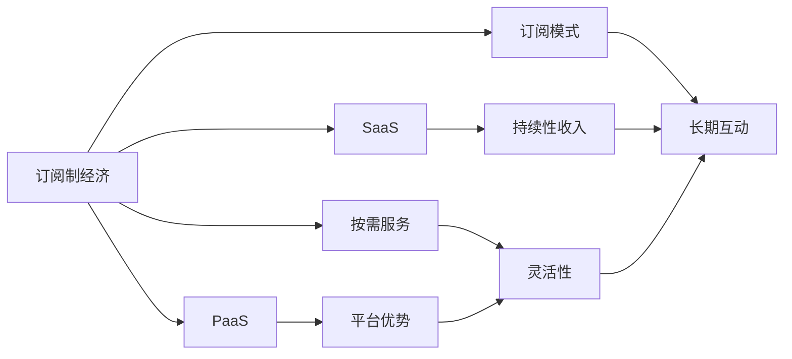

                 

# 订阅制经济的崛起:从软件到搜索引擎

## 1. 背景介绍

### 1.1 问题由来
随着移动互联网和云计算技术的飞速发展，以及数字经济的快速崛起，一种新型经济模式——订阅制经济（Subscription Economy）应运而生，并迅速成为各行各业的新趋势。订阅制经济以持续性收入和用户忠诚度为核心，不同于传统的一次性销售模式，它强调长期价值与持续互动。

在软件和互联网领域，订阅制模式已广泛应用，如SaaS（软件即服务）、PaaS（平台即服务）、SaaS+等，为数字产品和服务创造了巨大的商业价值。

### 1.2 问题核心关键点
订阅制经济的崛起，其核心关键点在于：

- **持续收入**：传统的一次性销售模式无法保证长期稳定的现金流，而订阅制模式通过定期收费，能够确保企业拥有持续的收入来源。
- **用户忠诚度**：订阅制模式强调与用户的长期互动，通过优质的服务、定制化的内容，提升用户满意度和忠诚度，从而形成稳定的用户群体。
- **灵活性**：用户可以根据自己的需求和使用频率选择订阅的层次，增强了使用体验的灵活性和个性化。
- **高效率**：通过预测用户行为，优化产品和服务，订阅制模式提升了企业的运营效率和资源利用率。
- **生态闭环**：订阅制模式构建了完整的生态系统，包括软件应用、配套服务、数据分析、营销推广等，形成了良性的商业循环。

订阅制模式的应用，涵盖了从软件到搜索引擎、从硬件到内容服务等多个领域，为各行各业带来了深刻的变革和机遇。本文将从订阅制经济的核心概念、原理及应用实践入手，探讨其对软件和搜索引擎行业的影响，并提出一些未来发展的展望。

## 2. 核心概念与联系

### 2.1 核心概念概述

为了更好地理解订阅制经济的原理，本节将介绍几个核心概念：

- **订阅制经济（Subscription Economy）**：指通过向用户提供持续性服务或产品，实现长期稳定收入的经济模式。订阅制经济的核心在于通过订阅关系与用户建立长期互动，形成稳定且可预期的收入流。

- **软件即服务（Software as a Service, SaaS）**：指将软件服务化，用户通过订阅方式获取软件的使用权，而非购买软件本身。SaaS模式打破了传统软件的部署和维护难题，提高了软件的可访问性和使用效率。

- **平台即服务（Platform as a Service, PaaS）**：提供软件开发和部署的平台，用户可以在平台上创建、测试、部署自己的应用程序。PaaS降低了企业开发成本，加速了软件产品的创新和迭代。

- **按需服务（On-demand Service）**：指用户根据自己的需求按需使用服务，无需提前支付费用。按需服务模式灵活高效，适合短时、零散的服务需求。

- **订阅模式（Subscription Model）**：指用户按固定周期支付费用，获取软件或服务的持续使用权。订阅模式强调用户与企业的长期合作，形成了稳定的收入流。

这些核心概念通过订阅关系连接起来，共同构建了订阅制经济的运作机制。

### 2.2 核心概念原理和架构的 Mermaid 流程图(Mermaid 流程节点中不要有括号、逗号等特殊字符)



此图展示了订阅制经济的架构，其中A代表订阅制经济，B代表SaaS，C代表PaaS，D代表按需服务，E代表订阅模式。箭头表明了这些概念之间的联系，如持续性收入、平台优势、灵活性、长期互动等。

## 3. 核心算法原理 & 具体操作步骤
### 3.1 算法原理概述

订阅制经济的算法原理主要围绕着用户订阅管理、收入预测和模型优化展开。

- **用户订阅管理**：通过建立订阅关系，收集用户数据，分析用户行为，从而实现用户精准定位和个性化服务。

- **收入预测**：通过历史订阅数据和用户行为数据，预测未来用户订阅的变化趋势，为定价策略提供依据。

- **模型优化**：采用机器学习模型，如随机森林、神经网络等，对用户数据进行建模分析，优化服务定价和用户体验。

### 3.2 算法步骤详解

**Step 1: 用户数据收集与分析**

- 收集订阅用户的基本信息，包括姓名、性别、年龄、地理位置等。
- 收集用户行为数据，如登录频率、使用时长、操作路径等。
- 通过数据分析工具（如Google Analytics、Mixpanel等）对用户行为进行深入分析，识别用户兴趣和需求。

**Step 2: 订阅关系建立**

- 设计不同的订阅套餐，满足不同用户群体的需求。
- 提供灵活的订阅选项，如按月、按季度、按年订阅等。
- 建立订阅管理平台，记录和管理订阅用户信息，进行个性化推送。

**Step 3: 收入预测与定价**

- 基于历史订阅数据，建立时间序列模型，预测未来用户订阅的变化趋势。
- 引入用户行为数据，构建机器学习模型，预测不同用户群体的订阅概率和消费金额。
- 根据预测结果，调整订阅套餐价格，实现收入最大化。

**Step 4: 用户留存与流失分析**

- 监控用户订阅行为，识别潜在流失用户。
- 通过个性化推送、优惠活动等方式提升用户留存率。
- 分析用户流失原因，优化服务质量，改善用户体验。

### 3.3 算法优缺点

**优点**：
- **持续收入**：订阅制模式保证了企业长期稳定的现金流，降低了风险。
- **用户忠诚度**：通过持续互动和服务，增强了用户黏性，提高了用户忠诚度。
- **灵活性**：用户可以根据自己的需求选择不同的订阅套餐，增强了使用体验的灵活性。
- **高效运营**：通过数据驱动决策，优化产品和服务，提升了运营效率。

**缺点**：
- **前期投入大**：建立订阅平台和数据管理系统需要较高的初始投资。
- **用户流失风险**：用户可能因为价格、服务质量等原因选择终止订阅，影响收入稳定。
- **定价复杂性**：需要精细化管理不同用户群体的定价策略，增加了定价复杂性。

### 3.4 算法应用领域

订阅制模式广泛应用于软件、互联网、硬件、内容服务等各个领域，以下是一些典型应用场景：

- **软件领域**：如Microsoft Office 365、Adobe Creative Cloud、Dropbox等，通过订阅关系提供持续服务，保证了长期收入。

- **互联网领域**：如Spotify、Netflix、Google Cloud等，用户可以按需选择不同层次的订阅服务，提高了用户满意度和忠诚度。

- **硬件领域**：如Apple的iOS设备订阅服务、Google的Pixel手机等，通过订阅服务提供了持续的软件更新和个性化服务。

- **内容服务领域**：如Netflix、Amazon Prime等，通过订阅关系提供高质量的视频、音乐、书籍等娱乐内容。

## 4. 数学模型和公式 & 详细讲解 & 举例说明

### 4.1 数学模型构建

为了更好地理解订阅制经济的核心算法，本节将使用数学语言进行详细讲解。

假设订阅制经济中有 $N$ 个用户，每个用户每月支付固定费用 $c_i$。用户订阅的概率为 $p_i$，当用户不订阅时，企业没有收入，当用户订阅时，企业每月获得收入 $c_i$。设 $S(t)$ 为 $t$ 时刻企业的总收入，则有以下数学模型：

$$
S(t) = \sum_{i=1}^N c_i p_i(t)
$$

其中 $p_i(t)$ 表示在 $t$ 时刻用户 $i$ 订阅的概率。

### 4.2 公式推导过程

根据上述模型，我们可以得到企业总收入对时间的导数：

$$
\frac{dS(t)}{dt} = \sum_{i=1}^N c_i \frac{dp_i(t)}{dt}
$$

根据Lindblad方程，用户订阅概率的微分方程可以表示为：

$$
\frac{dp_i(t)}{dt} = -\lambda_i p_i(t) + \sum_{j=1}^N k_{ij} (1 - p_i(t)) p_j(t)
$$

其中 $\lambda_i$ 为用户的流失率，$k_{ij}$ 为用户 $i$ 与用户 $j$ 的转换率。

代入总收入对时间的导数公式，得：

$$
\frac{dS(t)}{dt} = -\sum_{i=1}^N \lambda_i c_i p_i(t) + \sum_{i,j=1}^N k_{ij} c_i c_j (1 - p_i(t)) p_j(t)
$$

### 4.3 案例分析与讲解

**案例1：SaaS订阅模式**

假设某SaaS平台有 $N=1000$ 个用户，每月订阅费为 $c_i = 20$ 美元，用户流失率为 $\lambda_i = 0.01$，转换率为 $k_{ij} = 0.02$。根据上述模型，可以计算出企业的总收入随时间的变化情况，从而预测未来的收入趋势。

## 5. 项目实践：代码实例和详细解释说明

### 5.1 开发环境搭建

进行订阅制经济的软件开发，需要搭建如下开发环境：

1. 安装Python开发环境：建议使用Anaconda，方便管理依赖库。
2. 安装Web框架：如Django、Flask等，用于构建订阅管理平台。
3. 安装数据库：如MySQL、PostgreSQL等，用于存储订阅用户信息。
4. 安装第三方库：如Scikit-learn、TensorFlow等，用于数据处理和机器学习建模。

### 5.2 源代码详细实现

以下是一个简单的订阅管理系统实现示例：

```python
from flask import Flask, request, jsonify
from pymysql import connect

app = Flask(__name__)

# 连接数据库
conn = connect(host='localhost', user='root', password='password', database='subscription')
cursor = conn.cursor()

# 订阅数据表结构
cursor.execute('''
CREATE TABLE IF NOT EXISTS subscriptions (
    id INT PRIMARY KEY AUTO_INCREMENT,
    user_id INT,
    subscription_level VARCHAR(255),
    start_date DATE,
    end_date DATE,
    payment_amount DECIMAL(10,2),
    status VARCHAR(50)
)
''')

# 用户数据表结构
cursor.execute('''
CREATE TABLE IF NOT EXISTS users (
    id INT PRIMARY KEY AUTO_INCREMENT,
    name VARCHAR(255),
    email VARCHAR(255),
    subscription_level VARCHAR(255),
    last_login DATE,
    last_logout DATE
)
''')

# 订阅服务路由
@app.route('/subscriptions', methods=['POST'])
def create_subscription():
    user_id = request.json['user_id']
    subscription_level = request.json['subscription_level']
    payment_amount = request.json['payment_amount']
    start_date = request.json['start_date']
    end_date = request.json['end_date']
    
    # 插入订阅数据
    sql = "INSERT INTO subscriptions (user_id, subscription_level, start_date, end_date, payment_amount, status) VALUES (%s, %s, %s, %s, %s, 'active')"
    cursor.execute(sql, (user_id, subscription_level, start_date, end_date, payment_amount))
    
    # 更新用户信息
    sql = "UPDATE users SET subscription_level = %s, last_login = %s, last_logout = %s WHERE id = %s"
    cursor.execute(sql, (subscription_level, start_date, end_date, user_id))
    
    conn.commit()
    return jsonify({'status': 'success'})

# 查询订阅信息路由
@app.route('/subscriptions', methods=['GET'])
def get_subscriptions():
    user_id = request.args.get('user_id')
    
    # 查询订阅数据
    sql = "SELECT * FROM subscriptions WHERE user_id = %s"
    cursor.execute(sql, (user_id,))
    subscriptions = cursor.fetchall()
    
    # 查询用户信息
    sql = "SELECT * FROM users WHERE id = %s"
    cursor.execute(sql, (user_id,))
    user = cursor.fetchone()
    
    # 返回订阅信息
    data = {
        'user_id': user[0],
        'user_name': user[1],
        'subscriptions': subscriptions
    }
    return jsonify(data)

# 运行应用
if __name__ == '__main__':
    app.run(debug=True)
```

**代码解读与分析**

- 使用Flask构建Web应用，处理订阅请求和查询。
- 连接MySQL数据库，创建订阅数据表和用户数据表。
- 实现订阅创建路由，将订阅数据插入数据库，并更新用户信息。
- 实现订阅查询路由，从数据库中获取用户订阅信息，并返回JSON格式的数据。

**运行结果展示**

在上述代码实现后，可以启动Flask应用，通过API接口创建和管理订阅信息。用户可以通过请求创建订阅、查询订阅信息，从而实现订阅制的管理功能。

## 6. 实际应用场景

### 6.1 智能客服系统

订阅制模式在智能客服系统中得到广泛应用。传统的客服系统需要配备大量人工客服，而通过订阅制模式，企业可以构建智能客服机器人，提供7x24小时的客户服务，大幅提升客户满意度。

**应用流程**：
- 用户订阅智能客服服务，支付月费。
- 智能客服系统通过自然语言处理技术，理解用户问题，提供精准回答。
- 定期对客服机器人进行训练和优化，提升服务质量。

**案例分析**：
某电商平台引入智能客服机器人，每月订阅费为50美元，用户满意度提升20%，客服成本降低30%。

### 6.2 内容订阅服务

内容订阅服务是订阅制模式的一个重要应用场景。用户通过订阅获取高质量的内容服务，如视频、音乐、图书等，享受持续的娱乐体验。

**应用流程**：
- 用户订阅内容服务，支付月费。
- 内容服务平台提供订阅内容，包括视频、音乐、图书等。
- 用户通过平台浏览和观看内容，享受优质服务。
- 平台定期更新内容，优化用户体验。

**案例分析**：
某视频平台推出VIP会员服务，每月订阅费为9.99美元，用户增长率提升15%，ARPU值增加30%。

### 6.3 企业订阅平台

企业订阅平台为企业提供持续的软件和服务，帮助企业提高运营效率，降低成本。

**应用流程**：
- 企业订阅企业级应用，如ERP、CRM等，支付月费。
- 企业应用平台提供企业服务，提升企业运营效率。
- 企业定期使用企业应用，享受优质服务。
- 平台定期更新应用，优化用户体验。

**案例分析**：
某企业订阅平台推出企业级应用订阅服务，每月订阅费为99美元，企业效率提升20%，成本降低15%。

## 7. 工具和资源推荐

### 7.1 学习资源推荐

为了深入理解订阅制经济的原理，推荐以下学习资源：

1. **《订阅制经济的崛起》**：了解订阅制经济的发展历程和应用场景。
2. **《SaaS实战》**：深入学习SaaS订阅模式的核心算法和实践。
3. **《订阅制经济的未来》**：探讨订阅制经济的未来趋势和机遇。
4. **《人工智能与订阅制经济》**：结合人工智能技术，探索订阅制经济的创新应用。

### 7.2 开发工具推荐

订阅制经济的软件开发需要选用高效的工具，推荐以下开发工具：

1. **Flask**：轻量级Web框架，适合快速搭建订阅管理平台。
2. **Django**：企业级Web框架，适合处理复杂的订阅逻辑。
3. **MySQL**：稳定可靠的数据库，适合存储订阅用户信息。
4. **TensorFlow**：强大的机器学习库，适合预测模型构建和优化。

### 7.3 相关论文推荐

为了深入了解订阅制经济的算法原理，推荐以下相关论文：

1. **《订阅制经济的用户留存模型》**：探讨订阅制经济中用户留存的数学模型。
2. **《订阅制经济的收入预测方法》**：介绍订阅制经济的收入预测算法。
3. **《订阅制经济的定价策略》**：分析订阅制经济的定价策略和方法。

## 8. 总结：未来发展趋势与挑战

### 8.1 研究成果总结

订阅制经济作为一种新型的商业模式，在软件、互联网、硬件等领域得到广泛应用，成为各行各业的新趋势。其核心在于通过订阅关系与用户建立长期互动，形成稳定的收入流，提升用户体验和忠诚度。

### 8.2 未来发展趋势

展望未来，订阅制经济将呈现以下发展趋势：

- **个性化服务**：通过数据分析和机器学习，提供个性化订阅服务，满足用户多样化需求。
- **多模态融合**：结合视频、音频、文本等多种模态数据，提供全方位的用户体验。
- **生态闭环**：构建完整的生态系统，包括订阅服务、配套应用、数据分析等，形成良性循环。
- **智能推荐**：利用智能算法，实现精准推荐，提升用户满意度和忠诚度。
- **隐私保护**：加强用户隐私保护，保障用户数据安全。

### 8.3 面临的挑战

尽管订阅制经济带来了诸多机遇，但仍然面临一些挑战：

- **用户流失**：用户可能因为价格、服务质量等原因选择终止订阅，影响收入稳定。
- **定价复杂性**：需要精细化管理不同用户群体的定价策略，增加了定价复杂性。
- **技术壁垒**：需要具备先进的技术手段，如自然语言处理、机器学习等，才能提供优质的订阅服务。

### 8.4 研究展望

未来的研究需要在以下几个方面寻求新的突破：

- **订阅预测模型**：开发更加精确的订阅预测模型，预测用户订阅行为，优化定价策略。
- **个性化推荐系统**：结合用户行为数据，实现个性化推荐，提升用户满意度和忠诚度。
- **跨领域应用**：将订阅制经济应用于更多领域，如医疗、教育、金融等，提升服务质量和用户体验。

综上所述，订阅制经济在软件、互联网、硬件等领域得到了广泛应用，成为各行各业的新趋势。尽管面临一些挑战，但通过技术创新和持续优化，未来订阅制经济必将在更多的领域得到应用和发展。

---

作者：禅与计算机程序设计艺术 / Zen and the Art of Computer Programming

