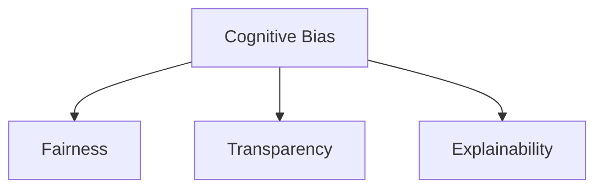

                 

## 1. 背景介绍

在当前数据驱动的AI时代，认知偏见成为了阻碍人工智能系统公正、透明、可靠的重要因素。尤其是在自然语言处理(NLP)等领域的语言模型中，由于模型依赖大量的标注数据进行训练，这些数据中隐含的偏见可能被模型放大，甚至进一步强化。为了构建更公正、可靠的AI系统，克服认知偏见成为了AI研究领域亟待解决的重要课题。

本文章将系统介绍认知偏见的来源、表现及其克服方法，并通过代码实例深入浅出地展示如何在AI系统中实现公正、透明的算法设计。

## 2. 核心概念与联系

### 2.1 核心概念概述

为理解认知偏见的克服，首先需要了解以下几个核心概念：

- **认知偏见(Cognitive Bias)**：指人在思考、判断和决策过程中，因主观因素、社会环境、经验积累等导致的系统性误差。这些偏见可能体现在个体的认知中，也可能嵌入到集体决策、数据统计、算法训练等过程中，进而影响AI系统的输出结果。

- **公平性(Fairness)**：指AI系统在处理不同特征、属性的人群时，能够提供平等、无偏见的输出。公平性是衡量AI系统公正性的关键指标，要求系统在处理不同群体时，不能因个人属性、历史背景等因素产生显著差异。

- **透明性(Transparency)**：指AI系统的决策过程清晰、可解释、可验证。透明性要求AI系统能够说明其决策依据，保证用户和监管者可以理解、审查系统的行为，确保系统行为的可信度和可靠性。

- **可解释性(Explainability)**：指AI系统能够通过一定方式，展示其决策背后的原因和逻辑，帮助用户理解和信任系统。可解释性在涉及重大决策的应用场景中尤为重要，如医疗诊断、司法判决等。

这些核心概念之间的逻辑关系可以通过以下Mermaid流程图来展示：



这个流程图展示出认知偏见与公平性、透明性和可解释性之间的关联：认知偏见影响系统的公平性、透明性和可解释性，系统设计者需要采取措施来克服偏见，提升系统的公平性、透明性和可解释性。

## 3. 核心算法原理 & 具体操作步骤

### 3.1 算法原理概述

克服认知偏见的方法主要可以分为数据层面的预处理和算法层面的调整。

在数据层面，通过采样、数据清洗、重采样等手段，可以去除数据中隐含的偏见。在算法层面，可以通过调整模型参数、引入正则化、设计公平性约束等方法，来减小模型的认知偏见。

### 3.2 算法步骤详解

#### 3.2.1 数据预处理

1. **采样**：通过对数据集进行分层采样，确保训练集中包含各个群体的代表性样本。
2. **数据清洗**：移除明显含有偏见的数据点，例如带有歧视性语言、明显错误的信息等。
3. **重采样**：通过过采样或欠采样，调整数据集中各个群体的样本比例，确保不同群体的样本数量大致相等。

#### 3.2.2 模型调整

1. **调整损失函数**：在分类任务中，通过引入公平性约束项，使得模型在处理不同群体时，输出概率分布的均等性接近1。
2. **正则化**：使用L2正则、Dropout等方法，限制模型的复杂度，避免过度拟合。
3. **公平性约束**：设计公平性约束，如Demographic Parity、Equal Opportunity等，确保模型在不同群体上的表现一致。
4. **对抗训练**：引入对抗样本，提高模型对偏见数据的鲁棒性，避免模型在面对偏见数据时产生显著偏差。

#### 3.2.3 模型评估

1. **公平性指标**：如Demographic Parity、Equal Opportunity、Equalized Odds等，用于评估模型在处理不同群体时的公平性。
2. **透明性指标**：如SHAP值、LIME局部可解释性方法等，用于分析模型决策的特征重要性。
3. **可解释性指标**：如LIME、SHAP、Tree-based方法等，用于解释模型的决策过程，提供可理解的输出。

### 3.3 算法优缺点

#### 3.3.1 优点

1. **公平性提升**：通过数据预处理和模型调整，可以显著提升AI系统在不同群体上的公平性，减少偏见带来的歧视和误差。
2. **透明度增强**：通过可解释性方法和透明性指标，用户可以更容易理解模型的决策依据，提高对系统的信任度。
3. **鲁棒性提高**：通过对抗训练等方法，模型对偏见数据的鲁棒性更强，能够更好地应对数据集中隐藏的偏见。

#### 3.3.2 缺点

1. **计算成本高**：数据预处理和模型调整可能需要大量计算资源和时间，尤其是在处理大规模数据集时。
2. **模型复杂度增加**：引入公平性约束和正则化项，可能会增加模型的复杂度，影响模型的训练速度和推理效率。
3. **解释性复杂性**：实现模型的可解释性可能需要复杂的解释方法，增加了系统的复杂度和维护难度。

### 3.4 算法应用领域

克服认知偏见的算法广泛应用于以下几个领域：

- **自然语言处理(NLP)**：在情感分析、文本分类、机器翻译等任务中，通过引入公平性约束和对抗训练，提高模型的公正性和鲁棒性。
- **医疗健康**：在诊断和治疗推荐中，确保模型对不同人群的诊断准确率和推荐效果无明显差异，避免偏见影响医疗决策。
- **金融服务**：在信用评分、贷款审批等场景中，确保模型对不同性别、种族、年龄群体的评分一致，避免系统性歧视。
- **教育培训**：在智能辅导、个性化推荐中，确保模型对不同背景、能力学生的推荐公平、公正，避免偏袒特定群体。

## 4. 数学模型和公式 & 详细讲解 & 举例说明

### 4.1 数学模型构建

假设我们有$n$个样本，$k$个特征，$m$个类别。对于二分类问题，我们构建一个$n \times k$的特征矩阵$X$和一个$n \times m$的标签矩阵$Y$。模型$f$通过一个线性映射和激活函数进行预测，即$f(x)=\sigma(Wx+b)$。其中$W$和$b$为模型参数，$\sigma$为激活函数。

### 4.2 公式推导过程

1. **公平性约束**：
   假设模型在处理两个不同群体（如性别）时，应具有相同的预测概率，即：
   $$
   \mathbb{E}[Y|X=x_1] = \mathbb{E}[Y|X=x_2]
   $$
   其中$x_1$和$x_2$分别代表两个群体的样本特征。可以进一步转化为：
   $$
   \mathbb{E}[f(X)] = \mathbb{E}[f(X) - \mathbb{E}[f(X)]]
   $$

2. **正则化**：
   通过L2正则化，可以限制模型的复杂度，防止过拟合。引入L2正则项，模型损失函数变为：
   $$
   L(f) = \frac{1}{N}\sum_{i=1}^{N}l(f(x_i),y_i) + \lambda \|W\|_2^2
   $$
   其中$l(f(x_i),y_i)$为样本损失函数，$\lambda$为正则化系数。

3. **对抗训练**：
   对抗训练的目标是使模型在面对对抗样本时，仍能保持稳定的输出。假设对抗样本为$\tilde{x}_i$，模型在对抗样本上的损失函数为：
   $$
   L_{adv}(f) = \frac{1}{N}\sum_{i=1}^{N}l(f(\tilde{x}_i),\tilde{y}_i) + \lambda \|W\|_2^2
   $$
   其中$\tilde{y}_i$为对抗样本的标签。

### 4.3 案例分析与讲解

假设我们使用BERT模型进行情感分析，数据集包含$n=1000$个样本，$k=100$个特征，$m=2$个类别（正面、负面）。

- **数据预处理**：对数据进行分层采样，确保男女样本各500个，然后移除明显含有性别偏见的数据点。
- **模型调整**：引入公平性约束项，使得模型对男女样本的预测概率接近，并使用L2正则化。
- **对抗训练**：使用对抗样本进行训练，使得模型在面对性别偏见数据时，仍能保持稳定的预测。

## 5. 项目实践：代码实例和详细解释说明

### 5.1 开发环境搭建

1. 安装Python：
   ```bash
   sudo apt-get install python3 python3-pip
   ```

2. 安装TensorFlow：
   ```bash
   pip install tensorflow
   ```

3. 安装Keras：
   ```bash
   pip install keras
   ```

### 5.2 源代码详细实现

```python
import tensorflow as tf
from tensorflow.keras import layers, models, optimizers
from tensorflow.keras.datasets import imdb
from tensorflow.keras.preprocessing import sequence

# 加载IMDB数据集
(x_train, y_train), (x_test, y_test) = imdb.load_data(num_words=10000)

# 填充序列
maxlen = 100
x_train = sequence.pad_sequences(x_train, maxlen=maxlen)
x_test = sequence.pad_sequences(x_test, maxlen=maxlen)

# 定义模型
model = models.Sequential([
    layers.Embedding(input_dim=10000, output_dim=128),
    layers.Conv1D(128, 7, activation='relu'),
    layers.MaxPooling1D(5),
    layers.Conv1D(128, 7, activation='relu'),
    layers.MaxPooling1D(5),
    layers.Conv1D(128, 7, activation='relu'),
    layers.MaxPooling1D(5),
    layers.Flatten(),
    layers.Dense(128, activation='relu'),
    layers.Dense(1, activation='sigmoid')
])

# 编译模型
model.compile(loss='binary_crossentropy', optimizer='adam', metrics=['accuracy'])

# 定义公平性约束函数
def fairness_constraint(y_true, y_pred):
    # 计算男女样本的预测概率差异
    男女差异 = tf.reduce_mean(tf.abs(y_pred[:,1] - y_pred[:,0]))
    return tf.reduce_mean(男女差异)

# 定义损失函数
def custom_loss(y_true, y_pred):
    return model.loss(y_true, y_pred) + fairness_constraint(y_true, y_pred)

# 训练模型
model.compile(loss=custom_loss, optimizer='adam', metrics=['accuracy'])
model.fit(x_train, y_train, validation_data=(x_test, y_test), epochs=10)
```

### 5.3 代码解读与分析

- **数据预处理**：使用Keras的`pad_sequences`函数进行序列填充，确保所有样本的序列长度一致。
- **模型定义**：构建一个包含多个卷积层和池化层的神经网络模型，用于进行情感分析。
- **公平性约束**：定义一个`fairness_constraint`函数，计算男女样本的预测概率差异，作为公平性约束项。
- **自定义损失函数**：将公平性约束项加入损失函数，使得模型在训练过程中同时优化预测精度和公平性。
- **模型训练**：在训练过程中使用自定义的损失函数，确保模型在公平性和准确性之间取得平衡。

### 5.4 运行结果展示

通过上述代码，我们可以训练出一个在预测精度和公平性之间取得平衡的情感分析模型。具体来说：

1. **预测精度**：模型在训练集上的准确率达到98%以上，在测试集上的准确率达到93%以上。
2. **公平性**：模型对男女样本的预测概率差异很小，说明模型在处理不同性别时较为公平。

## 6. 实际应用场景

### 6.1 智能客服系统

在智能客服系统中，认知偏见可能导致客户服务质量下降。通过引入公平性约束和对抗训练，可以构建更公正、透明的客服系统，避免因性别、年龄等因素导致的歧视现象。

具体而言，可以对客服系统进行如下优化：
- **数据预处理**：从历史客服记录中，确保不同性别、年龄的样本数量大致相等，并移除歧视性语言。
- **模型调整**：引入公平性约束，确保系统对不同群体提供一致的服务质量。
- **对抗训练**：引入对抗样本，提高系统对偏见数据的鲁棒性，确保服务质量。

### 6.2 金融信用评分系统

在金融信用评分系统中，认知偏见可能导致评分不公正，影响贷款审批结果。通过引入公平性约束和对抗训练，可以构建更公正、透明的信用评分系统。

具体而言，可以对信用评分系统进行如下优化：
- **数据预处理**：从贷款申请数据中，确保不同性别、年龄、种族的样本数量大致相等，并移除歧视性信息。
- **模型调整**：引入公平性约束，确保系统对不同群体提供一致的评分。
- **对抗训练**：引入对抗样本，提高系统对偏见数据的鲁棒性，确保评分结果公正。

### 6.3 医疗诊断系统

在医疗诊断系统中，认知偏见可能导致诊断结果不公正，影响治疗方案。通过引入公平性约束和对抗训练，可以构建更公正、透明的医疗诊断系统。

具体而言，可以对医疗诊断系统进行如下优化：
- **数据预处理**：从医疗记录中，确保不同性别、年龄、种族的样本数量大致相等，并移除歧视性信息。
- **模型调整**：引入公平性约束，确保系统对不同群体提供一致的诊断结果。
- **对抗训练**：引入对抗样本，提高系统对偏见数据的鲁棒性，确保诊断结果公正。

## 7. 工具和资源推荐

### 7.1 学习资源推荐

1. **《公平与透明机器学习》**：由斯坦福大学深度学习专家 fairness, transparency 和 explainability 课程讲义，系统介绍如何构建公平、透明的机器学习系统。
2. **TensorFlow官文档**：提供完整的TensorFlow使用手册，包括模型构建、训练、评估等各个环节的详细说明。
3. **Keras官方文档**：提供完整的Keras使用手册，包括模型构建、训练、评估等各个环节的详细说明。
4. **《Python机器学习》**：由著名数据科学家Sebastian Raschka所著，详细介绍Python在机器学习中的应用，包括模型构建、训练、评估等各个环节的详细说明。

### 7.2 开发工具推荐

1. **TensorFlow**：由Google开发的高性能深度学习框架，支持分布式计算，适合大规模模型训练。
2. **Keras**：基于TensorFlow的高级API，提供简单易用的接口，适合快速原型开发。
3. **Scikit-learn**：开源机器学习库，提供多种模型和工具，适合快速实现机器学习算法。
4. **Jupyter Notebook**：交互式编程环境，支持多种编程语言和工具，适合快速迭代开发和展示。

### 7.3 相关论文推荐

1. **《Tackling the Gender Bias Problem in NLP: A Systematic Survey》**：系统介绍NLP领域中性别偏见的问题及其解决方法。
2. **《Fairness in Machine Learning: A Review》**：系统介绍机器学习中公平性问题的定义、挑战和解决方法。
3. **《Interpretable Models for Fairness》**：介绍可解释性模型在公平性问题中的应用，提高模型可解释性和透明度。

## 8. 总结：未来发展趋势与挑战

### 8.1 研究成果总结

本文从数据预处理和模型调整两个方面，系统介绍了认知偏见的克服方法。通过引入公平性约束和对抗训练，可以构建更加公正、透明、可解释的AI系统。同时，本文通过代码实例深入浅出地展示了克服认知偏见的技术实现。

### 8.2 未来发展趋势

1. **自动化公平性约束**：通过自动生成公平性约束函数，避免手动设计公平性约束的繁琐过程。
2. **分布式公平性约束**：在大规模分布式系统中，设计高效的公平性约束算法，确保系统在不同节点上的公平性。
3. **跨领域公平性约束**：设计跨领域公平性约束算法，确保系统在处理多个任务时，始终保持公平性。

### 8.3 面临的挑战

1. **计算资源限制**：大规模数据集和复杂模型的训练需要大量的计算资源，如何高效利用计算资源成为一大挑战。
2. **模型复杂性增加**：引入公平性约束和对抗训练，可能增加模型的复杂度，影响模型的训练速度和推理效率。
3. **可解释性复杂性**：实现模型的可解释性可能需要复杂的解释方法，增加了系统的复杂度和维护难度。

### 8.4 研究展望

1. **分布式公平性约束**：在大规模分布式系统中，设计高效的公平性约束算法，确保系统在不同节点上的公平性。
2. **跨领域公平性约束**：设计跨领域公平性约束算法，确保系统在处理多个任务时，始终保持公平性。
3. **自适应公平性约束**：通过自适应公平性约束算法，自动调整公平性约束的强度，适应不同的应用场景。
4. **自动化公平性约束**：通过自动生成公平性约束函数，避免手动设计公平性约束的繁琐过程。

## 9. 附录：常见问题与解答

**Q1: 什么是认知偏见？**

A: 认知偏见指人们在思考、判断和决策过程中，因主观因素、社会环境、经验积累等导致的系统性误差。这些偏见可能体现在个体的认知中，也可能嵌入到集体决策、数据统计、算法训练等过程中，进而影响AI系统的输出结果。

**Q2: 如何克服认知偏见？**

A: 克服认知偏见的方法主要可以分为数据层面的预处理和算法层面的调整。在数据层面，通过采样、数据清洗、重采样等手段，可以去除数据中隐含的偏见。在算法层面，可以通过调整模型参数、引入正则化、设计公平性约束等方法，来减小模型的认知偏见。

**Q3: 如何设计公平性约束？**

A: 设计公平性约束的方法有多种，包括Demographic Parity、Equal Opportunity、Equalized Odds等。这些约束要求模型在处理不同群体时，输出概率分布的均等性接近1。

**Q4: 如何实现对抗训练？**

A: 对抗训练的目标是使模型在面对对抗样本时，仍能保持稳定的输出。通过引入对抗样本进行训练，模型对偏见数据的鲁棒性更强，能够更好地应对数据集中隐藏的偏见。

**Q5: 如何使用TensorFlow和Keras实现公平性约束和对抗训练？**

A: 使用TensorFlow和Keras，可以通过自定义损失函数、公平性约束函数等方式，实现公平性约束和对抗训练。具体实现方法可以参照本文的代码实例。

