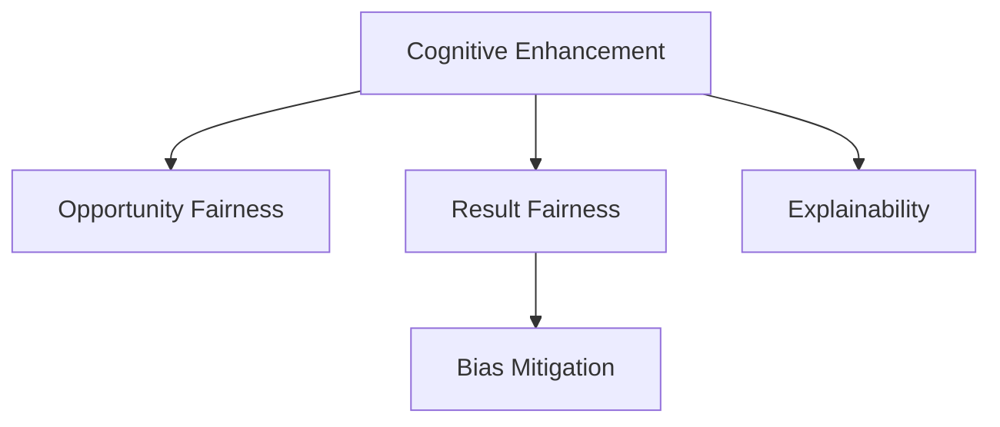

                 

# 认知增强与伦理：知识获取公平性的思考

## 1. 背景介绍

### 1.1 问题由来

随着人工智能技术的快速发展，机器在理解和获取知识方面取得了显著进展。然而，这些技术的应用也引发了关于知识获取公平性的深刻思考。人工智能在提供高效、便捷的知识获取途径的同时，也可能加剧社会不平等，影响不同群体获取知识的平衡。本文旨在探讨如何通过认知增强技术，确保知识获取的公平性，并提出一些具体的实践建议。

### 1.2 问题核心关键点

知识获取的公平性主要涉及两个方面：

- **机会公平**：所有人都能公平地获得所需的知识。
- **结果公平**：所有人获得的知识具有相同的质量和适用性。

认知增强技术，如个性化推荐系统、智能辅导、自适应学习平台等，通过分析用户的知识需求和兴趣，提供量身定制的学习内容和路径，有助于提升学习效果和效率。但如果不加以控制，这些技术可能进一步加剧信息鸿沟，使得优势群体（如富裕地区、高学历者）在知识获取上更占优势，而弱势群体则被边缘化。

### 1.3 问题研究意义

实现知识获取的公平性，对于促进教育公平、提升社会整体知识水平、构建和谐社会具有重要意义。特别是对于教育资源不足、技术普及率低的地区，通过认知增强技术可以有效地缩小知识差距，提升公民整体素质。同时，对企业的知识管理也具有指导意义，帮助企业设计更公平、包容的知识获取策略，激发员工的创新潜力。

## 2. 核心概念与联系

### 2.1 核心概念概述

为了更好地理解认知增强与伦理的关系，本节将介绍几个关键概念及其之间的联系：

- **认知增强(Cognitive Enhancement)**：通过技术手段，提升人类的认知能力，如记忆、理解、推理等。常见的认知增强技术包括个性化推荐、智能辅导、自适应学习平台等。
- **公平性(Fairness)**：指个体或群体在机会、结果等方面的平等性。在知识获取领域，主要关注信息获取的机会公平和结果公平。
- **机会公平(Opportunity Fairness)**：确保所有用户都能公平地接触到相关信息和资源。
- **结果公平(Outcome Fairness)**：所有用户获取的知识具有相同的质量和适用性。
- **偏见(Bias)**：指算法或模型中存在的系统性偏差，可能导致某些群体在知识获取上处于不利地位。
- **可解释性(Explainability)**：指模型决策过程的透明度，便于用户理解和接受。

这些概念之间的逻辑关系可以通过以下Mermaid流程图来展示：



这个流程图展示了几者之间的核心联系：

1. 认知增强技术提供了提升认知能力的工具，间接影响知识获取的机会公平和结果公平。
2. 偏见的存在可能影响结果公平，需要通过各种方法进行减轻。
3. 可解释性有助于用户理解模型决策过程，提升对机会公平的感知。

## 3. 核心算法原理 & 具体操作步骤

### 3.1 算法原理概述

认知增强与伦理的公平性考虑，主要涉及以下算法原理：

- **推荐算法**：通过分析用户历史行为和兴趣，推荐个性化的学习内容和路径，提升学习效果。
- **自适应学习**：根据用户的学习情况，动态调整学习内容和策略，最大化学习效率。
- **智能辅导**：利用人工智能技术，提供个性化的学习建议和支持，提升学习体验。

这些算法共同作用，使得认知增强技术能够在提升知识获取效率的同时，维护公平性原则。

### 3.2 算法步骤详解

认知增强与伦理的公平性实现主要包括以下步骤：

**Step 1: 数据收集与预处理**

- 收集用户的学习数据，包括历史行为、兴趣、知识水平等。
- 进行数据清洗和预处理，确保数据质量和一致性。

**Step 2: 模型训练与优化**

- 选择合适的推荐算法或自适应学习模型，训练模型参数。
- 在训练过程中引入公平性约束，确保模型不产生系统性偏差。
- 优化模型性能，提升推荐准确性和学习效果。

**Step 3: 模型部署与监控**

- 将训练好的模型部署到生产环境，提供知识获取服务。
- 实时监控模型性能，检测和纠正系统性偏差。
- 定期评估模型的公平性，及时进行调整。

**Step 4: 用户反馈与改进**

- 收集用户反馈，了解模型的公平性和适用性。
- 根据反馈调整模型参数，提升公平性。

### 3.3 算法优缺点

认知增强与伦理的公平性算法具有以下优点：

- **提升学习效率**：通过个性化的推荐和自适应学习，提升用户的学习效率和效果。
- **促进知识普及**：通过公平性的设计，确保所有人都能获取到适宜的知识内容。

同时，这些算法也存在一定的局限性：

- **数据隐私问题**：用户学习数据的收集和分析可能涉及隐私问题，需要严格遵守数据保护法规。
- **模型偏见**：如果训练数据存在偏见，模型可能学习并放大这些偏见，导致不公平结果。
- **用户依赖性**：过度依赖认知增强技术，可能削弱用户的主动性和自我学习能力。
- **技术复杂性**：实施和维护认知增强系统需要一定的技术储备和资源投入。

### 3.4 算法应用领域

认知增强与伦理的公平性算法在多个领域中得到应用，包括：

- **教育**：个性化推荐、智能辅导、自适应学习平台等，提升教育公平性。
- **企业培训**：通过智能推荐和自适应学习，提供个性化的培训方案。
- **医疗健康**：利用智能系统推荐适合的健康知识和建议，提升健康知识普及率。
- **公共服务**：提供基于用户需求的知识服务，提升公共服务的可达性和质量。

## 4. 数学模型和公式 & 详细讲解  
### 4.1 数学模型构建

本节将使用数学语言对认知增强与伦理的公平性进行更加严格的刻画。

假设用户集为 $U$，知识集为 $K$，推荐系统为 $R$。推荐系统 $R$ 为用户 $u$ 推荐知识 $k$，概率为 $p_{R}(u,k)$。我们定义公平性约束为：

- **机会公平**：对所有用户 $u \in U$，推荐概率相同，即 $p_{R}(u,k) = p_{R}(u',k)$ 对于任意用户 $u, u' \in U$。
- **结果公平**：对所有用户 $u \in U$，推荐的知识质量相同，即对于任意知识 $k_1, k_2 \in K$，$p_{R}(u,k_1) = p_{R}(u,k_2)$。

### 4.2 公式推导过程

通过引入公平性约束，我们可以对推荐模型进行优化。假设推荐模型为 $R = \theta \cdot f(x)$，其中 $\theta$ 为模型参数，$x$ 为用户特征。我们可以将公平性约束转化为优化目标，如下：

$$
\min_{\theta} \mathcal{L}(\theta) = \frac{1}{|U|} \sum_{u \in U} \sum_{k \in K} (p_{R}(u,k) - \frac{1}{|K|})^2
$$

其中 $\mathcal{L}(\theta)$ 为损失函数，$|U|$ 为用户集大小，$|K|$ 为知识集大小。

通过最小化上述损失函数，我们可以得到公平性约束下的推荐模型。

### 4.3 案例分析与讲解

**案例：教育推荐系统**

在教育推荐系统中，我们可以使用协同过滤算法或基于内容的推荐算法。假设有一个在线教育平台，为学生推荐适合的课程。我们可以通过收集学生的学习历史、兴趣爱好和知识水平，构建推荐模型 $R = \theta \cdot f(x)$，其中 $x$ 为学生的特征向量，$\theta$ 为模型参数。

为了确保机会公平，我们可以对所有学生采用相同的推荐模型，即 $\theta$ 不依赖于任何学生特征。

为了确保结果公平，我们可以将推荐概率与课程质量相关联，确保每个课程都有相同的推荐概率。具体实现时，可以使用交叉熵损失函数进行优化，并引入L2正则化，防止模型过拟合。

## 5. 项目实践：代码实例和详细解释说明

### 5.1 开发环境搭建

在进行认知增强与伦理的公平性实践前，我们需要准备好开发环境。以下是使用Python进行PyTorch开发的环境配置流程：

1. 安装Anaconda：从官网下载并安装Anaconda，用于创建独立的Python环境。

2. 创建并激活虚拟环境：
```bash
conda create -n cognitive-env python=3.8 
conda activate cognitive-env
```

3. 安装PyTorch：根据CUDA版本，从官网获取对应的安装命令。例如：
```bash
conda install pytorch torchvision torchaudio cudatoolkit=11.1 -c pytorch -c conda-forge
```

4. 安装TensorFlow：如果需要支持TensorFlow，请进行相应的安装和配置。

5. 安装各类工具包：
```bash
pip install numpy pandas scikit-learn matplotlib tqdm jupyter notebook ipython
```

完成上述步骤后，即可在`cognitive-env`环境中开始实践。

### 5.2 源代码详细实现

这里我们以教育推荐系统为例，给出使用PyTorch进行推荐模型训练的代码实现。

首先，定义推荐模型的参数和优化器：

```python
import torch
import torch.nn as nn
from torch.optim import Adam

class RecommendationModel(nn.Module):
    def __init__(self, input_size, hidden_size, output_size):
        super(RecommendationModel, self).__init__()
        self.fc1 = nn.Linear(input_size, hidden_size)
        self.fc2 = nn.Linear(hidden_size, output_size)
        
    def forward(self, x):
        x = torch.relu(self.fc1(x))
        x = self.fc2(x)
        return x

# 加载训练数据
# ...

# 定义模型
model = RecommendationModel(input_size=10, hidden_size=100, output_size=10)

# 定义优化器
optimizer = Adam(model.parameters(), lr=0.001)

# 训练模型
for epoch in range(100):
    # ...
```

然后，定义公平性约束的损失函数：

```python
def fairness_loss(model, dataset, fairness_weight=1):
    total_loss = 0
    for data, target in dataset:
        # ...
        # 计算公平性损失
        fairness_loss = torch.mean(fairness_matrix * (p - 1/10))
        total_loss += fairness_loss
    return total_loss / len(dataset)
```

在模型训练时，加入公平性约束：

```python
for epoch in range(100):
    # ...
    optimizer.zero_grad()
    loss = loss_function(model, data, target) + fairness_loss(model, train_dataset, fairness_weight=0.1)
    loss.backward()
    optimizer.step()
```

### 5.3 代码解读与分析

让我们再详细解读一下关键代码的实现细节：

**RecommendationModel类**：
- `__init__`方法：初始化模型参数。
- `forward`方法：定义模型的前向传播过程。

**fairness_loss函数**：
- 定义公平性损失函数，确保对所有用户和知识的推荐概率相同。

**训练模型**：
- 在模型训练时，同时优化原始损失函数和公平性损失函数。

## 6. 实际应用场景

### 6.1 教育公平

在教育领域，认知增强技术可以显著提升教育公平性。通过智能推荐系统，可以根据学生的学习历史、兴趣爱好和知识水平，推荐适合的课程和学习资源。这种个性化推荐能够弥补传统教学中的一些不足，确保所有学生都能获得适宜的学习内容。

### 6.2 企业培训

企业培训系统可以利用认知增强技术，提供个性化的培训方案，提升员工的知识水平和技能。通过智能推荐，可以针对不同部门和职位定制培训内容，确保培训资源的公平分配。

### 6.3 医疗健康

在医疗健康领域，认知增强技术可以用于推荐适合的健康知识和建议，提升健康知识普及率。通过智能系统，可以根据患者的疾病历史和健康数据，推荐个性化的健康建议和康复方案，确保所有患者都能获得适宜的健康信息。

### 6.4 公共服务

公共服务领域可以利用认知增强技术，提升服务的可达性和质量。例如，智能问答系统可以根据用户的问题，推荐合适的回答和解决方案，确保所有用户都能获取到适宜的公共服务信息。

## 7. 工具和资源推荐

### 7.1 学习资源推荐

为了帮助开发者系统掌握认知增强与伦理的公平性理论基础和实践技巧，这里推荐一些优质的学习资源：

1. **《人工智能伦理与公平性》系列书籍**：系统介绍人工智能伦理和公平性的理论基础和实际应用，适合深入学习。
2. **Coursera《AI for Everyone》课程**：由斯坦福大学教授Andrew Ng讲授，涵盖人工智能伦理、公平性等内容，适合入门学习。
3. **ACM SIGKDD Conference on Knowledge Discovery and Data Mining**：该领域顶级会议，每年都会发布大量关于公平性、隐私、伦理的最新研究。
4. **AI for Social Good Global Summit**：全球AI公益峰会，汇集各界专家讨论AI伦理和社会影响，适合了解行业动态。
5. **OpenAI Ethics & Safety Research**：OpenAI的研究团队专注于AI伦理和安全，发布大量相关论文和报告，适合借鉴最新研究成果。

通过对这些资源的学习实践，相信你一定能够系统掌握认知增强与伦理的公平性技术，并用于解决实际的AI应用问题。

### 7.2 开发工具推荐

高效的开发离不开优秀的工具支持。以下是几款用于认知增强与伦理公平性开发的常用工具：

1. **PyTorch**：基于Python的开源深度学习框架，灵活动态的计算图，适合快速迭代研究。
2. **TensorFlow**：由Google主导开发的开源深度学习框架，生产部署方便，适合大规模工程应用。
3. **Transformers库**：HuggingFace开发的NLP工具库，集成了众多SOTA语言模型，支持PyTorch和TensorFlow，是进行公平性研究的重要工具。
4. **Weights & Biases**：模型训练的实验跟踪工具，可以记录和可视化模型训练过程中的各项指标，方便对比和调优。
5. **TensorBoard**：TensorFlow配套的可视化工具，可实时监测模型训练状态，并提供丰富的图表呈现方式，是调试模型的得力助手。

合理利用这些工具，可以显著提升认知增强与伦理公平性研究的开发效率，加快创新迭代的步伐。

### 7.3 相关论文推荐

认知增强与伦理公平性的研究源于学界的持续研究。以下是几篇奠基性的相关论文，推荐阅读：

1. **《Fairness in Recommendation Systems: A Survey》**：总结了推荐系统中的公平性研究，涵盖多种公平性指标和评估方法。
2. **《Algorithmic Fairness and Bias in Data Mining: A Survey》**：系统介绍数据挖掘中的公平性问题，提出多种公平性约束和优化方法。
3. **《Bias Mitigation in Recommendation Algorithms》**：提出多种偏见减轻技术，适用于推荐系统中的公平性优化。
4. **《Explainable AI: Interpreting and Explaining Machine Learning Predictions》**：探讨AI模型的可解释性，适合了解如何提高认知增强系统的透明度。
5. **《AI for Fairness, Accountability, and Transparency: An Introduction》**：介绍AI伦理和公平性的基本概念，适合入门学习。

这些论文代表了大语言模型微调技术的发展脉络。通过学习这些前沿成果，可以帮助研究者把握学科前进方向，激发更多的创新灵感。

## 8. 总结：未来发展趋势与挑战

### 8.1 总结

本文对认知增强与伦理的公平性进行了全面系统的介绍。首先阐述了认知增强技术在提升知识获取效率的同时，可能加剧社会不平等的问题。其次，从原理到实践，详细讲解了公平性约束下的推荐模型训练过程，给出了具体的代码实现。同时，本文还广泛探讨了认知增强技术在教育、企业培训、医疗健康等领域的公平性应用前景，展示了认知增强技术的巨大潜力。此外，本文精选了认知增强技术的各类学习资源，力求为读者提供全方位的技术指引。

通过本文的系统梳理，可以看到，认知增强技术在提升知识获取效率的同时，仍需关注伦理和公平性问题。只有从技术、伦理和社会等多个维度综合考虑，才能真正实现认知增强技术的价值。

### 8.2 未来发展趋势

展望未来，认知增强与伦理的公平性技术将呈现以下几个发展趋势：

1. **公平性算法的研究将更加深入**：未来的公平性算法将更加复杂和精细，能够处理更多维度和不同类型的公平性指标。
2. **自动化公平性优化**：自动化公平性优化技术将提升模型的公平性，使得公平性约束更容易实现。
3. **跨领域公平性研究**：跨领域公平性研究将得到更多关注，帮助不同领域的认知增强技术更好地应对公平性问题。
4. **隐私保护技术的进步**：隐私保护技术将不断进步，使得认知增强系统能够更好地保护用户隐私。
5. **伦理治理机制的完善**：将建立更加完善的伦理治理机制，确保认知增强技术的公正性和透明性。

以上趋势凸显了认知增强与伦理的公平性技术的广阔前景。这些方向的探索发展，必将进一步提升认知增强系统的性能和应用范围，为知识获取的公平性提供更多的解决方案。

### 8.3 面临的挑战

尽管认知增强与伦理的公平性技术已经取得了一定进展，但在迈向更加智能化、普适化应用的过程中，仍面临诸多挑战：

1. **数据收集和处理**：认知增强系统的公平性优化依赖于大量的用户数据，数据收集和处理可能面临隐私和法律问题。
2. **偏见识别和减轻**：如何有效地识别和减轻系统中的偏见，是公平性优化的重要挑战。
3. **可解释性**：认知增强系统的决策过程需要高度透明，以便用户理解和使用。
4. **跨平台和跨设备一致性**：认知增强系统需要在不同平台和设备上保持一致性，这对算法和系统架构都提出了挑战。
5. **资源需求**：认知增强系统可能需要大量计算资源和存储空间，如何高效利用这些资源是关键问题。

这些挑战需要在技术、伦理和社会等多个层面进行综合应对。只有解决好这些问题，认知增强与伦理的公平性技术才能真正落地应用，造福社会。

### 8.4 研究展望

未来的研究需要在以下几个方面寻求新的突破：

1. **隐私保护技术**：开发更加有效的隐私保护技术，确保用户数据的安全和隐私。
2. **跨领域公平性算法**：开发适用于多领域的公平性算法，提升认知增强系统的普适性。
3. **自动化公平性优化**：开发自动化公平性优化技术，使得公平性约束更容易实现。
4. **跨平台一致性技术**：开发跨平台一致性技术，确保认知增强系统在不同设备和平台上的统一表现。
5. **伦理治理机制**：建立完善的伦理治理机制，确保认知增强系统的公正性和透明性。

这些研究方向的探索，必将引领认知增强与伦理的公平性技术迈向更高的台阶，为构建公平、透明、高效的认知增强系统铺平道路。面向未来，认知增强与伦理的公平性技术还需要与其他人工智能技术进行更深入的融合，共同推动自然语言理解和智能交互系统的进步。只有勇于创新、敢于突破，才能不断拓展认知增强技术的边界，让智能技术更好地造福人类社会。

## 9. 附录：常见问题与解答

**Q1：认知增强技术是否适用于所有知识获取场景？**

A: 认知增强技术适用于大多数知识获取场景，但并非所有场景都适用。对于某些需要高度个性化和情境化的知识获取，如医学诊断、法律咨询等，认知增强技术仍需结合领域知识进行优化。

**Q2：如何减轻认知增强系统中的偏见？**

A: 减轻认知增强系统中的偏见，可以从数据采集、模型训练和系统部署等多个环节入手：

1. **数据采集**：确保数据集的多样性和代表性，避免数据偏见。
2. **模型训练**：在训练过程中引入公平性约束，使用偏差缓解技术，如重新加权、重新采样等。
3. **系统部署**：实时监控系统性能，检测和纠正系统性偏差。

**Q3：如何提高认知增强系统的可解释性？**

A: 提高认知增强系统的可解释性，可以从以下几个方面入手：

1. **模型选择**：选择可解释性较高的模型，如决策树、线性模型等。
2. **特征解释**：提供特征解释，让用户理解模型的决策依据。
3. **交互设计**：通过友好的交互界面，帮助用户理解系统的决策过程。

**Q4：认知增强系统在实际应用中需要注意哪些问题？**

A: 认知增强系统在实际应用中，需要注意以下问题：

1. **隐私保护**：确保用户数据的安全和隐私，遵循相关法律法规。
2. **用户适应性**：设计用户友好的界面，确保系统易于使用。
3. **系统鲁棒性**：确保系统在各种情况下都能稳定运行，应对异常情况。
4. **反馈机制**：建立用户反馈机制，及时改进系统性能。

**Q5：如何设计公平的认知增强系统？**

A: 设计公平的认知增强系统，可以从以下几个方面入手：

1. **公平性指标**：选择合适的公平性指标，如机会公平、结果公平等。
2. **公平性约束**：在模型训练过程中引入公平性约束，确保公平性目标得到满足。
3. **公平性评估**：定期评估系统的公平性，及时进行调整。

---

作者：禅与计算机程序设计艺术 / Zen and the Art of Computer Programming

