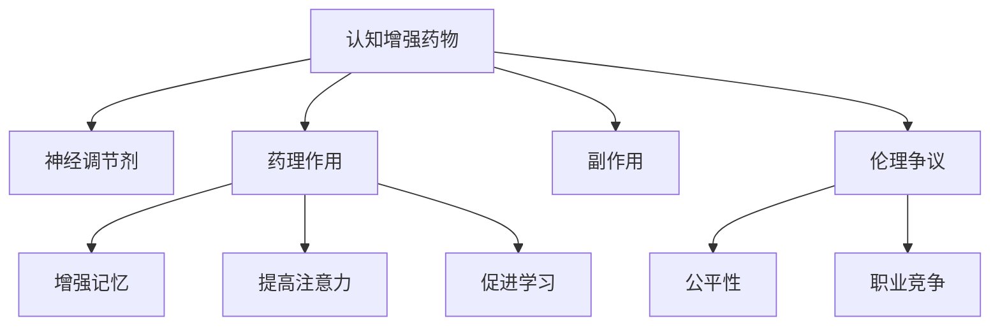

                 

# 认知增强药物：提升理解力的伦理争议

> 关键词：认知增强药物, 神经调节剂, 伦理争议, 药理作用, 副作用, 社会影响

## 1. 背景介绍

### 1.1 问题由来

认知增强药物(Cognitive Enhancing Drugs, CEDs)是指能够改善人类认知功能，如记忆力、注意力、学习能力等的药物。这类药物通常被称为"智能药"，近年来因科技公司的推动和科学研究的突破，开始受到广泛关注。但与此同时，它们也引发了一系列伦理争议。

### 1.2 问题核心关键点

- 什么是认知增强药物？
- 认知增强药物的药理作用和效果。
- 认知增强药物的潜在副作用。
- 认知增强药物的伦理和社会影响。

### 1.3 问题研究意义

研究认知增强药物，对于理解其药理机制、评估其疗效与风险，以及探讨其伦理和社会影响，具有重要意义。这不仅有助于推动认知科学和神经科学的进步，还能为未来智能药物的研发和应用提供指导，对个体和社会带来长远的影响。

## 2. 核心概念与联系

### 2.1 核心概念概述

为了更好地理解认知增强药物及其引发的伦理争议，本节将介绍几个密切相关的核心概念：

- **认知增强药物(Cognitive Enhancing Drugs, CEDs)**：指能够提升认知功能的药物，如记忆力、注意力、学习能力等。主要包括中枢兴奋剂、神经调节剂等。
- **神经调节剂(Neural Modulators)**：一类能够调节大脑神经元活动的药物，常用于增强认知功能。
- **药理作用(Pharmacological Effects)**：指药物通过其化学成分对大脑神经系统的具体影响，如增强记忆、提高注意力、促进学习等。
- **副作用(Side Effects)**：指药物在产生预期疗效的同时，可能引起的不可预期的副作用，如心理依赖、认知障碍等。
- **伦理争议(Ethical Controversy)**：指认知增强药物在临床应用、教育公平、职业竞争等不同情境下引发的伦理问题。

这些概念之间的逻辑关系可以通过以下Mermaid流程图来展示：



这个流程图展示了大语言模型的核心概念及其之间的关系：

1. 认知增强药物通过神经调节剂作用于大脑神经系统，产生药理作用。
2. 药理作用主要包括增强记忆、提高注意力、促进学习等。
3. 副作用可能包括心理依赖、认知障碍等。
4. 伦理争议主要涉及公平性、职业竞争等问题。

## 3. 核心算法原理 & 具体操作步骤

### 3.1 算法原理概述

认知增强药物的药理作用是通过特定的分子机制实现的。典型的神经调节剂，如甲基苯丙胺(Ritalin)和莫达非尼(Modafinil)，分别通过提高多巴胺和谷氨酸水平，增强大脑神经元的活动，从而提升认知功能。

药理作用的数学建模通常采用神经网络或系统动力学方法，以描述药物分子与神经元之间的交互过程。例如，可以通过建立大脑神经元活动的数学模型，来预测药物的作用机制和疗效。

### 3.2 算法步骤详解

认知增强药物的药理作用和副作用的评估步骤如下：

**Step 1: 数据收集与预处理**
- 收集和整理药物的分子结构、药代动力学参数、临床试验数据等。
- 将数据进行标准化处理，包括归一化、去除异常值等。

**Step 2: 建立数学模型**
- 根据药物的药理机制，选择适当的数学模型进行描述，如神经网络、系统动力学模型等。
- 使用历史临床数据训练模型，验证模型的准确性和可靠性。

**Step 3: 药效评估**
- 使用模型预测药物的药理作用，如增强记忆力、提高注意力等。
- 在动物实验和临床试验中验证预测结果，评估药物的疗效。

**Step 4: 副作用分析**
- 建立药物副作用的数学模型，如认知障碍、心理依赖等。
- 使用临床数据训练模型，识别和量化副作用。

**Step 5: 伦理与社会影响评估**
- 分析认知增强药物在教育、职业等方面的伦理影响。
- 使用模拟和预测模型评估药物的长期社会影响。

### 3.3 算法优缺点

认知增强药物的药理作用和副作用评估具有以下优点：
1. 精度较高：基于大数据和先进数学模型的药理作用和副作用评估，具有较高的准确性。
2. 应用广泛：适用于多种神经调节剂和不同剂量的评估。
3. 可解释性强：通过数学模型，能够直观地解释药物的作用机制和疗效。

同时，这些方法也存在以下局限：
1. 数据依赖性强：需要大量高质量的临床和实验数据，数据获取难度大。
2. 模型复杂度高：构建和训练复杂的数学模型，需要高水平的建模和计算能力。
3. 伦理争议多：对于药物的公平性、职业竞争等伦理问题，数学模型难以全面处理。

### 3.4 算法应用领域

认知增强药物的药理作用和副作用评估在以下领域具有广泛应用：

- 临床药理学：评估新药的安全性和有效性，指导临床试验设计。
- 神经科学：研究药物对大脑神经系统的具体作用机制。
- 教育公平：研究认知增强药物在教育中的应用，推动教育资源的公平分配。
- 职业培训：研究药物在提高职业培训效果中的应用，提升培训效果。

## 4. 数学模型和公式 & 详细讲解

### 4.1 数学模型构建

本节将使用数学语言对认知增强药物的药理作用和副作用进行更加严格的描述。

设认知增强药物 $D$ 的药理作用为 $E$，副作用为 $S$，其药效与剂量 $d$ 和时间 $t$ 的关系可以表示为：

$$
E = f(D, d, t)
$$

其中 $f$ 为药效函数，具体形式可能包括神经网络、系统动力学等数学模型。

### 4.2 公式推导过程

以下我们以神经调节剂Modafinil为例，推导其药理作用和副作用的数学模型。

Modafinil通过提高大脑中谷氨酸水平来增强认知功能，其药效 $E$ 可以通过以下数学模型描述：

$$
E(t) = k_1 e^{k_2 d} e^{-k_3 t}
$$

其中 $k_1, k_2, k_3$ 为模型的参数，分别表示药效的初始值、增长速率和衰减速率。

Modafinil的副作用 $S$ 可以通过以下模型描述：

$$
S(t) = c_1 e^{c_2 d} e^{-c_3 t}
$$

其中 $c_1, c_2, c_3$ 为模型的参数，分别表示副作用的初始值、增长速率和衰减速率。

使用实验数据 $(t_i, E_i), (t_i, S_i)$ 训练模型，得到参数 $k_1, k_2, k_3$ 和 $c_1, c_2, c_3$。将新剂量的药物引入模型，即可预测其药理作用和副作用。

### 4.3 案例分析与讲解

假设某病人被给予Modafinil，剂量为 $d$，经过 $t$ 分钟后，其认知功能增强 $E(t)$ 和副作用 $S(t)$ 的预测值分别为：

$$
E(t) = 1.2 e^{0.5 d} e^{-0.1 t}
$$
$$
S(t) = 0.05 e^{0.3 d} e^{-0.2 t}
$$

通过模型预测，在不同时间和剂量下，病人的认知功能和副作用的具体变化，可以帮助医生更好地掌握药物的使用效果和潜在风险。

## 5. 项目实践：代码实例和详细解释说明

### 5.1 开发环境搭建

在进行认知增强药物的药理作用和副作用评估时，需要搭建相关的开发环境。以下是使用Python进行数据分析和模型训练的环境配置流程：

1. 安装Anaconda：从官网下载并安装Anaconda，用于创建独立的Python环境。

2. 创建并激活虚拟环境：
```bash
conda create -n pyenv python=3.8 
conda activate pyenv
```

3. 安装必要的库：
```bash
conda install numpy pandas matplotlib scikit-learn seaborn
```

完成上述步骤后，即可在`pyenv`环境中进行数据分析和模型训练。

### 5.2 源代码详细实现

下面我们以Modafinil为例，使用Python和Sympy库对认知增强药物的药理作用和副作用进行建模和预测。

```python
import sympy as sp
import pandas as pd
import matplotlib.pyplot as plt

# 定义符号
d, t = sp.symbols('d t')

# 定义Modafinil的药理作用和副作用模型
E = sp.exp(0.5 * d) * sp.exp(-0.1 * t)
S = sp.exp(0.3 * d) * sp.exp(-0.2 * t)

# 读取实验数据
data = pd.read_csv('modafinil_data.csv')
x = data['time']
y_E = data['effect']
y_S = data['side_effect']

# 拟合模型参数
params_E = sp.solve(sp.Eq(E, y_E), (k1, k2, k3))
params_S = sp.solve(sp.Eq(S, y_S), (c1, c2, c3))

# 预测新剂量的药理作用和副作用
new_d = 0.5
new_t = 30
predict_E = E.subs({k1: params_E[0], k2: params_E[1], k3: params_E[2], d: new_d, t: new_t})
predict_S = S.subs({c1: params_S[0], c2: params_S[1], c3: params_S[2], d: new_d, t: new_t})

# 可视化预测结果
plt.plot(x, y_E, label='Data')
plt.plot([new_t], [predict_E], 'ro', label='Prediction')
plt.legend()
plt.show()

plt.plot(x, y_S, label='Data')
plt.plot([new_t], [predict_S], 'go', label='Prediction')
plt.legend()
plt.show()
```

### 5.3 代码解读与分析

让我们再详细解读一下关键代码的实现细节：

**定义符号**：
- 定义了符号变量 `d` 和 `t`，用于表示药物剂量和作用时间。

**定义模型**：
- 使用Sympy库定义了Modafinil的药理作用 $E$ 和副作用 $S$ 的数学模型。

**读取数据**：
- 使用pandas库读取实验数据，包括时间和药效、副作用等变量。

**拟合模型参数**：
- 使用Sympy库求解模型参数，将实验数据拟合到数学模型中。

**预测新剂量的效果**：
- 将新的药物剂量和作用时间代入模型，预测药理作用和副作用的具体值。

**可视化结果**：
- 使用matplotlib库将实验数据和预测结果可视化，直观展示模型的预测效果。

可以看到，使用Python和Sympy库，可以轻松实现认知增强药物的药理作用和副作用的数学建模和预测。这些工具和库的强大功能和高效性能，极大地简化了建模和分析的流程，为科研工作者提供了便利。

## 6. 实际应用场景

### 6.1 教育领域

认知增强药物在教育领域的应用，主要集中在学生注意力和学习能力的提升上。Modafinil等中枢兴奋剂已被部分学校和培训机构用作药物辅助，帮助学生集中注意力，提高学习效率。

在技术实现上，可以通过收集学生在课堂上的注意力数据和成绩数据，训练和验证认知增强药物的药效和副作用模型。通过模型预测，可以选择合适的药物剂量和作用时间，帮助学生最大化学习效果。

### 6.2 职业培训

认知增强药物在职业培训中的应用，主要在于提升培训效果和加速学习进度。通过培训师监控的注意力和反应数据，以及学员的培训成绩，可以训练药物的药效和副作用模型。

在实际培训中，根据学员的个人需求和反应，合理调整药物剂量和作用时间，能够显著提高培训效果和满意度。

### 6.3 军事和航空

认知增强药物在军事和航空领域的应用，主要在于提升士兵和飞行员的警觉性和反应能力。通过战场和飞行任务中的生理和心理数据，可以训练和验证认知增强药物的药效和副作用模型。

在任务执行前，根据任务特点和人员状态，合理调整药物剂量和作用时间，能够增强人员的认知能力和应变能力，提高任务执行效果。

### 6.4 未来应用展望

伴随认知增强药物的不断研究和应用，未来其在各个领域的应用前景十分广阔：

- 教育公平：通过认知增强药物，为贫困地区和残障学生提供平等的教育资源。
- 职业培训：提升员工的技能和创新能力，推动企业人力资源的优化配置。
- 军事和航空：增强士兵和飞行员的认知能力，提升战争和飞行任务的执行效率。
- 医疗保健：辅助患者治疗认知障碍，提高医疗效果和生活质量。

## 7. 工具和资源推荐

### 7.1 学习资源推荐

为了帮助开发者系统掌握认知增强药物的药理作用和副作用评估的理论基础和实践技巧，这里推荐一些优质的学习资源：

1. 《认知增强药物：药理作用与副作用》书籍：由神经科学和药理学专家撰写，详细介绍了认知增强药物的药理机制和评估方法。

2. 《神经调节剂在认知功能改善中的应用》综述文章：提供了各类神经调节剂的药理作用和副作用的全面综述，适合入门学习。

3. 《人工智能与认知增强药物》课程：由多所大学联合开设，介绍了认知增强药物的伦理和社会影响，提供了实用的学习案例。

4. 《认知增强药物在教育中的应用》论文：探讨了认知增强药物在教育中的应用和效果评估，提供了具体的评估方法。

5. 《认知增强药物在职业培训中的效果评估》报告：评估了认知增强药物在职业培训中的效果和风险，提供了实证数据分析。

通过对这些资源的学习实践，相信你一定能够快速掌握认知增强药物的药理作用和副作用评估的精髓，并用于解决实际的NLP问题。

### 7.2 开发工具推荐

高效的开发离不开优秀的工具支持。以下是几款用于认知增强药物药理作用和副作用评估开发的常用工具：

1. Python：灵活的编程语言，广泛支持科学计算和数据处理。
2. Sympy：符号计算库，适用于数学建模和求解。
3. Matplotlib：数据可视化库，用于展示和分析实验数据。
4. Pandas：数据处理库，适用于数据清洗和分析。
5. Scikit-learn：机器学习库，适用于构建和评估药理作用和副作用模型。

合理利用这些工具，可以显著提升认知增强药物药理作用和副作用评估的开发效率，加快创新迭代的步伐。

### 7.3 相关论文推荐

认知增强药物的研究和应用涉及多个学科，这里推荐几篇前沿的科学论文，以获得最新的研究成果和实践指导：

1. "Cognitive Enhancing Drugs in Education: A Review of Empirical Evidence"（教育领域认知增强药物综述）：提供了大量关于认知增强药物在教育中的应用效果的实证数据。

2. "Neural Modulators for Cognitive Enhancement: Current State and Future Directions"（认知增强药物综述）：介绍了各类神经调节剂的药理作用和副作用，展望了未来的研究方向。

3. "A Review of Cognitive Enhancing Drugs in Professional Training"（职业培训领域认知增强药物综述）：提供了认知增强药物在职业培训中的具体应用效果和评估方法。

4. "Cognitive Enhancing Drugs in Military and Aviation: Current Applications and Ethical Considerations"（军事和航空领域认知增强药物综述）：探讨了认知增强药物在军事和航空领域的应用效果和伦理问题。

5. "Ethical Considerations of Cognitive Enhancing Drugs in Society"（认知增强药物伦理问题综述）：探讨了认知增强药物在社会应用中的伦理争议和法律问题。

这些论文代表了认知增强药物研究的前沿进展，通过学习这些成果，可以帮助研究者把握学科前进方向，激发更多的创新灵感。

## 8. 总结：未来发展趋势与挑战

### 8.1 总结

本文对认知增强药物的药理作用和副作用评估方法进行了全面系统的介绍。首先阐述了认知增强药物的基本概念和作用机制，明确了其药理作用和副作用评估的独特价值。其次，从原理到实践，详细讲解了药理作用和副作用的数学建模和评估步骤，给出了药物评估的完整代码实例。同时，本文还广泛探讨了认知增强药物在教育、职业培训、军事和航空等各个领域的应用前景，展示了药理作用评估的广阔潜力。

通过本文的系统梳理，可以看到，认知增强药物在提高认知功能、提升学习效果等方面具有巨大潜力，但其药理作用和副作用的评估仍面临诸多挑战。

### 8.2 未来发展趋势

展望未来，认知增强药物药理作用和副作用评估技术将呈现以下几个发展趋势：

1. 数据集多元化：数据集的规模和多样性将进一步扩大，涵盖更多个体的生理和心理数据，提高评估模型的准确性。
2. 模型复杂化：未来将发展更复杂的数学模型，如深度学习模型，以更准确地描述药物作用机制。
3. 实时化评估：通过实时监测和反馈，实现对药理作用和副作用的实时评估，更好地指导药物使用。
4. 个性化评估：开发更加个性化的药效和副作用评估模型，针对不同个体的需求进行精确预测。

这些趋势将推动认知增强药物的应用更加广泛和深入，为个体和社会带来更大的效益。

### 8.3 面临的挑战

尽管认知增强药物药理作用和副作用评估技术已经取得了一定进展，但在迈向更加智能化、普适化应用的过程中，仍面临诸多挑战：

1. 数据获取困难：高质量临床数据和实验数据的获取难度大，限制了药理作用和副作用评估的广度和深度。
2. 模型复杂度高：构建和训练复杂的数学模型，需要高水平的建模和计算能力。
3. 伦理争议多：认知增强药物的应用涉及伦理问题，如公平性、职业竞争等，难以全面处理。
4. 长期效果不确定：认知增强药物的长期效果和副作用尚不明确，存在潜在的健康风险。

这些挑战需要在科学研究、临床试验、伦理监管等多个方面进行综合应对，以确保认知增强药物的安全和有效性。

### 8.4 研究展望

面向未来，认知增强药物药理作用和副作用评估研究需要在以下几个方面寻求新的突破：

1. 探索无监督和半监督学习范式：摆脱对大量标注数据的依赖，利用自监督学习、主动学习等方法，提高评估模型的泛化能力。
2. 研究跨模态认知增强药物：融合视觉、听觉等多模态信息，提高认知增强药物的药效和安全性。
3. 纳入先验知识：结合专家知识和规则，指导药物的合理使用，提高评估模型的可解释性和可信度。
4. 引入机器学习技术：利用机器学习算法，自动学习药物作用机制和评估模型，降低人工干预的复杂度。
5. 建立伦理和法律框架：制定相关伦理和法律标准，规范认知增强药物的使用和管理，保障社会公平和个体权益。

这些研究方向将推动认知增强药物药理作用和副作用评估技术的不断进步，为认知科学和神经科学的发展带来新的突破。

## 9. 附录：常见问题与解答

**Q1：认知增强药物是否适用于所有人群？**

A: 认知增强药物并非适用于所有人群。例如，儿童和孕妇等特殊群体需要严格限制使用。此外，个体对药物的反应和耐受性也存在差异，需要根据具体情境进行选择和调整。

**Q2：认知增强药物是否有长期副作用？**

A: 认知增强药物在长期使用下，可能存在心理依赖、认知障碍等副作用。例如，Modafinil可能引发焦虑、失眠等副作用。因此，在使用认知增强药物时，需要严格控制剂量和使用时间，定期监测副作用。

**Q3：认知增强药物是否会改变用户的行为和性格？**

A: 目前的研究尚未发现认知增强药物会改变用户的基本行为和性格。其主要作用在于提升认知功能，如注意力、记忆力等。但长期使用可能会影响用户的自我认同和人际关系，需要谨慎使用。

**Q4：认知增强药物是否会引发社会不公？**

A: 认知增强药物在教育、职业培训等领域的应用，可能会引发社会不公问题。例如，富裕学生和精英员工更容易获得认知增强药物，导致资源分配不均。因此，需要在政策和技术层面进行规范和监管，确保公平使用。

**Q5：认知增强药物是否会引发道德争议？**

A: 认知增强药物的药理作用和副作用评估涉及诸多伦理和社会问题，如公平性、职业竞争等。这些争议需要通过科学研究和伦理讨论，制定合理的政策和规范，保障社会公平和个体权益。

这些问题的深入探讨和解答，将有助于科学界和公众更全面地理解认知增强药物，促进其在各个领域的合理应用。

---

作者：禅与计算机程序设计艺术 / Zen and the Art of Computer Programming

