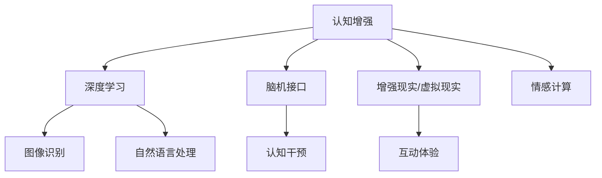

                 

# 认知增强：技术如何扩展人类的思维极限

在快速变化的世界中，人类思维能力的扩展成为了一个重要的议题。随着技术的发展，尤其是人工智能(AI)和增强现实(AR)技术的兴起，我们有了前所未有的机会来扩展我们的认知极限。本文将探讨这些技术如何帮助人类在认知、情感和决策方面取得突破，并展望未来AI在教育、健康和日常生活中的广泛应用。

## 1. 背景介绍

### 1.1 问题由来

人类思维能力的提升一直是一个持续探索的主题。从古至今，各种技术手段如教育、脑波调控、信息加工等都试图拓展人类的认知边界。但这些方法的效率和普及性往往受到物理和技术限制的制约。

近年来，人工智能和神经科学技术的突破，尤其是深度学习和脑机接口(Brain-Computer Interface, BCI)的进展，为认知增强提供了新的可能性。通过这些技术，我们有望直接与计算机交互，实现更为高效和精准的信息处理和情感调控，从而在学习和决策等方面获得新的突破。

### 1.2 问题核心关键点

- **深度学习**：深度学习是一种强大的机器学习技术，通过多层次的神经网络模型实现对数据的复杂抽象和分类。深度学习在图像识别、自然语言处理等领域的突破，表明其在认知增强中具有广阔的应用前景。
- **脑机接口(BCI)**：BCI技术通过读取和解码大脑信号，实现对人的直接操作，有望实现对人的认知过程的精准操控。
- **增强现实(AR)和虚拟现实(VR)**：AR和VR技术通过将数字信息与现实世界结合，提供了新的认知和互动方式。这些技术能够模拟复杂的场景，提供沉浸式学习体验。

这些技术的融合，将为人类认知能力的提升开辟新的道路，推动社会的进步和人类智慧的发展。

## 2. 核心概念与联系

### 2.1 核心概念概述

- **认知增强**：通过技术手段提升人类认知能力，包括感知、学习、记忆、决策等。
- **深度学习**：一种基于神经网络的机器学习技术，可以处理复杂数据模式。
- **脑机接口(BCI)**：通过记录和解码脑电信号实现对人的直接操作。
- **增强现实(AR)和虚拟现实(VR)**：将数字信息与现实世界结合，提供沉浸式交互体验。
- **情感计算**：通过计算技术对人类情感进行识别和调控。

这些概念之间的逻辑关系可以通过以下Mermaid流程图来展示：



这个流程图展示了一个由认知增强引导的多技术融合框架，深度学习、脑机接口、增强现实和情感计算都是实现认知增强的重要技术手段。

## 3. 核心算法原理 & 具体操作步骤

### 3.1 算法原理概述

认知增强的核心在于通过技术手段提升人类认知能力。这一过程主要依赖于深度学习、脑机接口、增强现实和情感计算等技术，实现对人类认知和行为的精准操控。

- **深度学习**：通过多层神经网络，实现对复杂数据的抽象和分类。深度学习模型在图像识别、语音识别、自然语言处理等领域的突破，使得计算机能够理解和处理复杂信息。
- **脑机接口(BCI)**：通过记录和解码脑电信号，实现对人的直接操作。BCI技术能够实时读取人的脑电波，并将这些信号转换为计算机可理解的数据，从而实现对人的认知过程的精准操控。
- **增强现实(AR)和虚拟现实(VR)**：通过将数字信息与现实世界结合，提供沉浸式交互体验。AR和VR技术可以模拟复杂环境，提供直观的学习和体验。
- **情感计算**：通过计算技术对人类情感进行识别和调控。情感计算可以识别人的情绪状态，并通过反馈机制调节情绪，从而优化认知过程。

### 3.2 算法步骤详解

基于深度学习和脑机接口的认知增强过程，一般包括以下几个关键步骤：

**Step 1: 数据收集与预处理**
- 使用深度学习模型收集和处理大量的感知数据，如图像、语音、文本等。
- 使用脑机接口技术采集脑电信号，并将其转换为可处理的数据格式。

**Step 2: 深度学习模型的训练与优化**
- 使用收集到的感知数据训练深度学习模型，实现对复杂数据的抽象和分类。
- 通过反向传播算法更新模型参数，优化模型性能。

**Step 3: 脑机接口信号的解码与控制**
- 使用BCI技术解码脑电信号，提取与认知相关的特征。
- 通过反馈机制，将控制信号转换为动作指令，实现对人的认知过程的精准操控。

**Step 4: 增强现实和虚拟现实的应用**
- 将训练好的深度学习模型应用到AR/VR环境中，实现实时交互和反馈。
- 使用AR/VR技术提供沉浸式体验，增强认知和学习的效率。

**Step 5: 情感计算与认知调控**
- 通过情感计算技术，识别用户情绪状态。
- 使用情感调控算法，调节情绪，优化认知过程。

### 3.3 算法优缺点

基于深度学习和脑机接口的认知增强方法具有以下优点：

- **高效性**：深度学习模型能够处理大规模数据，并在短时间内实现高效的信息处理和分类。
- **实时性**：脑机接口技术能够实时读取脑电信号，实现对人的精准操控。
- **沉浸式体验**：AR和VR技术提供沉浸式交互体验，增强学习和体验的效率。
- **多模态融合**：结合多种技术手段，实现多模态数据的融合，提升认知效果。

同时，这些方法也存在一些局限性：

- **隐私问题**：深度学习和脑机接口技术涉及大量的个人信息，存在隐私泄露风险。
- **伦理问题**：认知增强技术可能被滥用于控制和操控，引发伦理争议。
- **技术瓶颈**：深度学习模型的训练和优化需要大量的计算资源，脑机接口技术的实现仍存在技术挑战。

### 3.4 算法应用领域

基于深度学习和脑机接口的认知增强方法，已经在多个领域取得了显著的应用效果：

- **医疗健康**：使用深度学习技术进行医学影像分析，实现早期疾病检测。通过脑机接口技术，进行脑波调控，帮助患者恢复认知功能。
- **教育培训**：使用AR/VR技术提供沉浸式学习环境，增强学习效果。通过情感计算技术，识别学习者的情绪状态，优化教学策略。
- **军事训练**：使用AR/VR技术进行虚拟场景模拟，提升训练效果。通过脑机接口技术，进行任务操控，增强军事作战能力。
- **工业制造**：使用深度学习技术进行设备故障预测和诊断。通过增强现实技术，提供实时数据支持，提高生产效率。
- **社交娱乐**：使用AR/VR技术提供互动体验，增强游戏和社交的乐趣。通过情感计算技术，提供个性化服务，提升用户体验。

## 4. 数学模型和公式 & 详细讲解 & 举例说明

### 4.1 数学模型构建

本节将使用数学语言对基于深度学习和脑机接口的认知增强过程进行更加严格的刻画。

记深度学习模型为 $M_{\theta}(x)$，其中 $x$ 为输入数据，$\theta$ 为模型参数。假设脑电信号 $E$ 与认知任务 $T$ 相关，即 $E \rightarrow T$。脑机接口技术的解码模型为 $D_{\phi}(E)$，其中 $\phi$ 为解码模型参数。

认知增强的目标是最大化认知任务 $T$ 的表现，即：

$$
\max_{\theta, \phi} \mathbb{E}_{T}[\mathcal{L}(M_{\theta}(D_{\phi}(E)))]
$$

其中 $\mathcal{L}$ 为损失函数，$\mathbb{E}_{T}$ 表示在认知任务 $T$ 上期望值。

### 4.2 公式推导过程

以图像识别任务为例，推导深度学习模型的优化过程。假设输入图像为 $x$，深度学习模型的输出为 $y$，损失函数为交叉熵损失 $\mathcal{L}(y,\hat{y})$，其中 $\hat{y}$ 为模型预测结果。

定义损失函数为：

$$
\mathcal{L}(y,\hat{y}) = -\frac{1}{N} \sum_{i=1}^N [y_i\log \hat{y_i} + (1-y_i)\log (1-\hat{y_i})]
$$

其中 $y_i$ 为真实标签，$\hat{y_i}$ 为模型预测结果。

通过反向传播算法，求解损失函数对参数 $\theta$ 的梯度：

$$
\frac{\partial \mathcal{L}}{\partial \theta} = -\frac{1}{N} \sum_{i=1}^N (\frac{y_i}{\hat{y_i}}-\frac{1-y_i}{1-\hat{y_i}}) \frac{\partial M_{\theta}(x)}{\partial \theta}
$$

其中 $\frac{\partial M_{\theta}(x)}{\partial \theta}$ 可通过自动微分技术完成计算。

### 4.3 案例分析与讲解

以脑机接口技术为例，分析其解码模型的优化过程。假设脑电信号 $E$ 为 $E_1, E_2, ..., E_n$，解码模型 $D_{\phi}$ 的输出为 $y_1, y_2, ..., y_n$，损失函数为均方误差损失：

$$
\mathcal{L}(y,\hat{y}) = \frac{1}{N} \sum_{i=1}^N (y_i - \hat{y_i})^2
$$

通过反向传播算法，求解损失函数对参数 $\phi$ 的梯度：

$$
\frac{\partial \mathcal{L}}{\partial \phi} = -\frac{2}{N} \sum_{i=1}^N (y_i - \hat{y_i}) \frac{\partial D_{\phi}(E_i)}{\partial \phi}
$$

其中 $\frac{\partial D_{\phi}(E_i)}{\partial \phi}$ 可通过自动微分技术完成计算。

## 5. 项目实践：代码实例和详细解释说明

### 5.1 开发环境搭建

在进行认知增强项目实践前，我们需要准备好开发环境。以下是使用Python进行PyTorch开发的环境配置流程：

1. 安装Anaconda：从官网下载并安装Anaconda，用于创建独立的Python环境。

2. 创建并激活虚拟环境：
```bash
conda create -n pytorch-env python=3.8 
conda activate pytorch-env
```

3. 安装PyTorch：根据CUDA版本，从官网获取对应的安装命令。例如：
```bash
conda install pytorch torchvision torchaudio cudatoolkit=11.1 -c pytorch -c conda-forge
```

4. 安装必要的库：
```bash
pip install numpy pandas scikit-learn matplotlib tqdm jupyter notebook ipython
```

5. 安装必要的硬件设备：确保安装有支持深度学习训练的GPU设备，如NVIDIA GeForce RTX系列或Quadro系列。

完成上述步骤后，即可在`pytorch-env`环境中开始认知增强项目的开发。

### 5.2 源代码详细实现

这里以图像识别任务为例，给出使用PyTorch和TensorFlow实现深度学习模型的代码实现。

首先，定义深度学习模型：

```python
import torch
import torch.nn as nn
import torch.nn.functional as F
import torch.optim as optim

class CNNModel(nn.Module):
    def __init__(self):
        super(CNNModel, self).__init__()
        self.conv1 = nn.Conv2d(3, 32, 3, 1)
        self.conv2 = nn.Conv2d(32, 64, 3, 1)
        self.pool = nn.MaxPool2d(2, 2)
        self.fc1 = nn.Linear(64 * 28 * 28, 128)
        self.fc2 = nn.Linear(128, 10)

    def forward(self, x):
        x = self.pool(F.relu(self.conv1(x)))
        x = self.pool(F.relu(self.conv2(x)))
        x = x.view(-1, 64 * 28 * 28)
        x = F.relu(self.fc1(x))
        x = self.fc2(x)
        return F.log_softmax(x, dim=1)
```

接着，定义优化器和损失函数：

```python
learning_rate = 0.001
criterion = nn.CrossEntropyLoss()
optimizer = optim.Adam(model.parameters(), lr=learning_rate)
```

最后，启动训练流程：

```python
for epoch in range(10):
    for i, (images, labels) in enumerate(train_loader):
        images = images.reshape(-1, 28, 28, 3)
        labels = labels
        optimizer.zero_grad()
        outputs = model(images)
        loss = criterion(outputs, labels)
        loss.backward()
        optimizer.step()
```

以上就是使用PyTorch实现深度学习模型的完整代码实现。可以看到，利用PyTorch的强大封装，我们能够相对简洁地实现深度学习模型。

### 5.3 代码解读与分析

让我们再详细解读一下关键代码的实现细节：

**CNNModel类**：
- `__init__`方法：初始化模型中的卷积层、池化层和全连接层。
- `forward`方法：定义前向传播过程，输入图像经过卷积、池化和全连接层，输出预测结果。

**损失函数和优化器**：
- 使用交叉熵损失函数 `nn.CrossEntropyLoss`，适用于多分类问题。
- 使用Adam优化器 `optim.Adam`，能够高效地优化模型参数。

**训练流程**：
- 使用数据集 `train_loader`，通过遍历每个批次进行训练。
- 在每个批次上，计算损失函数并反向传播更新模型参数。
- 重复上述过程直至训练完成。

## 6. 实际应用场景

### 6.1 医疗健康

基于深度学习和脑机接口的认知增强方法，已经在医疗健康领域取得了显著的应用效果。

- **早期疾病检测**：使用深度学习模型对医学影像进行分类和识别，实现早期疾病检测。例如，使用卷积神经网络(CNN)对X光片和MRI图像进行分类，帮助医生快速发现疾病。
- **认知功能恢复**：通过脑机接口技术，对脑波进行解码和控制，帮助中风患者恢复认知功能。例如，使用BCI技术控制假肢运动，增强康复训练效果。

### 6.2 教育培训

教育培训领域是认知增强技术的另一个重要应用场景。

- **沉浸式学习**：使用AR和VR技术提供沉浸式学习环境，增强学习效果。例如，在虚拟实验室中模拟复杂实验过程，提供直观的互动体验。
- **个性化教学**：通过情感计算技术，识别学习者的情绪状态，优化教学策略。例如，根据学习者的情绪反馈调整教学内容，提高学习效果。

### 6.3 军事训练

军事训练领域对认知增强技术的需求尤为迫切。

- **虚拟场景模拟**：使用AR和VR技术进行虚拟场景模拟，提升训练效果。例如，在虚拟战场上进行战术演练，增强士兵的战斗技能。
- **任务操控**：通过脑机接口技术，进行任务操控，增强军事作战能力。例如，使用BCI技术控制无人机进行侦察和打击任务。

### 6.4 工业制造

在工业制造领域，认知增强技术也发挥着重要作用。

- **设备故障预测**：使用深度学习技术进行设备故障预测和诊断。例如，使用卷积神经网络对传感器数据进行分类，实现设备故障的早期预警。
- **生产效率提升**：通过增强现实技术，提供实时数据支持，提高生产效率。例如，在AR眼镜上显示生产线数据，帮助工人进行设备维护和生产调度。

### 6.5 社交娱乐

在社交娱乐领域，认知增强技术提供了丰富的互动体验。

- **游戏互动**：使用AR和VR技术提供互动体验，增强游戏的趣味性。例如，在虚拟世界中进行角色扮演和互动，提供沉浸式游戏体验。
- **个性化服务**：通过情感计算技术，提供个性化服务，提升用户体验。例如，根据用户的情绪状态推荐个性化的内容，增强社交互动。

## 7. 工具和资源推荐

### 7.1 学习资源推荐

为了帮助开发者系统掌握认知增强技术的理论基础和实践技巧，这里推荐一些优质的学习资源：

1. **《深度学习》书籍**：Ian Goodfellow、Yoshua Bengio和Aaron Courville合著的经典教材，全面介绍了深度学习的基本概念和算法。
2. **《Python深度学习》书籍**：François Chollet著的深度学习入门书籍，介绍了TensorFlow和Keras的使用方法。
3. **Coursera《深度学习》课程**：由Andrew Ng教授开设的深度学习入门课程，包括图像识别、自然语言处理等重要内容。
4. **DeepLearning.AI（DL.AI）课程**：由Geoffrey Hinton、Andrew Ng等人开设的深度学习高级课程，涵盖最新的深度学习理论和实践。
5. **Kaggle竞赛平台**：全球最大的数据科学竞赛平台，提供丰富的数据集和竞赛机会，帮助开发者提升实战能力。

通过对这些资源的学习实践，相信你一定能够快速掌握认知增强技术的精髓，并用于解决实际的认知增强问题。

### 7.2 开发工具推荐

高效的开发离不开优秀的工具支持。以下是几款用于认知增强开发的常用工具：

1. **PyTorch**：基于Python的开源深度学习框架，灵活动态的计算图，适合快速迭代研究。支持CUDA加速，适合大规模深度学习模型的训练。
2. **TensorFlow**：由Google主导开发的开源深度学习框架，生产部署方便，支持多GPU并行计算，适合大规模工程应用。
3. **MXNet**：由Apache开发的深度学习框架，支持多种语言和硬件平台，适合分布式深度学习模型的训练。
4. **OpenVINO**：英特尔推出的深度学习推理引擎，支持多种深度学习模型的优化和推理，适合边缘计算和嵌入式设备。
5. **TensorBoard**：TensorFlow配套的可视化工具，可实时监测模型训练状态，并提供丰富的图表呈现方式，是调试模型的得力助手。

合理利用这些工具，可以显著提升认知增强项目的开发效率，加快创新迭代的步伐。

### 7.3 相关论文推荐

认知增强技术的发展源于学界的持续研究。以下是几篇奠基性的相关论文，推荐阅读：

1. **ImageNet Classification with Deep Convolutional Neural Networks**：Alex Krizhevsky等人在2012年提出的深度学习模型AlexNet，奠定了深度学习在图像识别领域的基础。
2. **Deep Residual Learning for Image Recognition**：Kaiming He等人在2016年提出的残差网络（ResNet），实现了更深层次的深度学习模型的训练。
3. **Attention is All You Need**：Google Brain团队在2017年提出的Transformer模型，实现了自然语言处理任务的突破。
4. **BCI2000: A Grand Challenge for Brain-Computer Interfaces**：BCI2000是一个重要的脑机接口竞赛，推动了BCI技术的发展和应用。
5. **Cognitive Assistance Using Brain-Computer Interface Systems**：Eduardo Lopes等人在2019年提出了一种基于BCI的认知辅助系统，实现了对认知功能的实时调控。

这些论文代表了大规模深度学习和脑机接口技术的发展脉络，展示了这些技术的巨大潜力。通过学习这些前沿成果，可以帮助研究者把握学科前进方向，激发更多的创新灵感。

## 8. 总结：未来发展趋势与挑战

### 8.1 总结

本文对基于深度学习和脑机接口的认知增强方法进行了全面系统的介绍。首先阐述了认知增强技术的背景和意义，明确了深度学习和脑机接口技术在认知增强中的独特价值。其次，从原理到实践，详细讲解了深度学习模型的训练过程、脑机接口信号的解码与控制，以及认知增强的多技术融合框架。同时，本文还广泛探讨了认知增强方法在医疗健康、教育培训、军事训练等多个领域的应用前景，展示了认知增强技术的广阔应用空间。最后，本文精选了认知增强技术的各类学习资源，力求为读者提供全方位的技术指引。

通过本文的系统梳理，可以看到，认知增强技术在提升人类认知能力方面具有广阔的前景，其应用范围正在不断扩大，有望在医疗健康、教育培训、军事训练等诸多领域带来深远影响。

### 8.2 未来发展趋势

展望未来，认知增强技术将呈现以下几个发展趋势：

1. **更高效的学习算法**：随着深度学习模型的不断发展，新的学习算法和技术将不断涌现，提升认知增强模型的训练速度和精度。
2. **更强大的脑机接口**：BCI技术将不断突破，实现更精准、实时地解码和操控脑电信号。
3. **更智能的AR/VR体验**：AR和VR技术将不断提升，提供更沉浸、互动的认知增强体验。
4. **多模态数据融合**：结合视觉、听觉、触觉等多种模态的数据，提升认知增强系统的性能和鲁棒性。
5. **跨领域的认知增强**：认知增强技术将拓展到更多领域，如艺术创作、伦理决策等，带来更为广泛的认知提升。

以上趋势凸显了认知增强技术的广阔前景，这些方向的探索发展，必将进一步提升认知增强系统的性能和应用范围，为人类智慧的发展带来新的突破。

### 8.3 面临的挑战

尽管认知增强技术已经取得了瞩目成就，但在迈向更加智能化、普适化应用的过程中，它仍面临着诸多挑战：

1. **隐私问题**：深度学习和脑机接口技术涉及大量的个人信息，存在隐私泄露风险。
2. **伦理问题**：认知增强技术可能被滥用于控制和操控，引发伦理争议。
3. **技术瓶颈**：深度学习模型的训练和优化需要大量的计算资源，脑机接口技术的实现仍存在技术挑战。
4. **交互复杂性**：认知增强系统的交互界面和用户体验需要不断优化，提升易用性和可接受性。

### 8.4 研究展望

面对认知增强技术所面临的种种挑战，未来的研究需要在以下几个方面寻求新的突破：

1. **隐私保护技术**：开发更有效的隐私保护算法，保护用户数据的安全。
2. **伦理约束机制**：建立认知增强技术的伦理约束机制，确保技术的合理应用。
3. **高效推理技术**：优化推理算法，提高认知增强系统的实时性和效率。
4. **多模态融合技术**：开发多模态融合算法，提升认知增强系统的综合能力。
5. **可解释性技术**：开发可解释性算法，提升认知增强系统的透明度和可靠性。

这些研究方向的研究成果，必将推动认知增强技术的不断进步，实现更高效、更安全、更普适的认知增强系统。

## 9. 附录：常见问题与解答

**Q1: 深度学习在认知增强中的应用有哪些？**

A: 深度学习在认知增强中主要应用于图像识别、自然语言处理、语音识别等领域。这些技术可以帮助计算机理解复杂的感知信息，从而实现对认知过程的精准操控。

**Q2: 脑机接口(BCI)技术在认知增强中的应用有哪些？**

A: 脑机接口技术在认知增强中的应用包括实时解码和控制脑电信号，实现对人的精准操控。例如，BCI技术可以用于认知干预、疾病诊断和治疗、任务操控等。

**Q3: AR和VR技术在认知增强中的应用有哪些？**

A: AR和VR技术在认知增强中的应用包括提供沉浸式学习环境、互动体验、任务模拟等。例如，AR技术可以用于虚拟实验室和仿真训练，VR技术可以用于游戏和社交互动。

**Q4: 如何实现认知增强系统的可解释性？**

A: 认知增强系统的可解释性可以通过开发可解释性算法实现。例如，使用Attention机制、特征可视化等技术，将模型的内部工作机制和决策逻辑可视化，增强系统的透明度和可靠性。

**Q5: 认知增强技术在实际应用中存在哪些挑战？**

A: 认知增强技术在实际应用中面临的挑战包括隐私问题、伦理问题、技术瓶颈、交互复杂性等。需要从多个维度进行优化和改进，才能充分发挥认知增强技术的潜力。

---

作者：禅与计算机程序设计艺术 / Zen and the Art of Computer Programming

