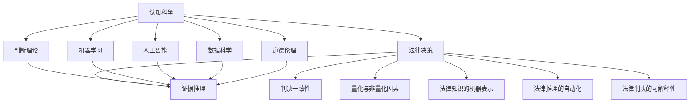

                 

# 认知科学与法律：理解决策与判断的机制

> 关键词：认知科学,法律,决策机制,判断理论,人工智能,机器学习,数据科学,道德伦理

## 1. 背景介绍

### 1.1 问题由来

法律决策与判断长期以来被认为是人类智力和理性的重要体现。但随着认知科学和人工智能技术的发展，人们开始怀疑其单纯依赖人类直觉和经验的判断过程是否完全可靠。特别是在现代法律环境中，判案的复杂性和证据的不确定性增加了对客观、公正、可重复性法律决策的迫切需求。

认知科学的研究表明，人类在决策和判断过程中，会受到一系列认知偏差的影响，如确认偏误、启发式、情绪干扰等。这些偏差使得法律决策存在一定的主观性和不可重复性。同时，法律实践中也存在诸如证据选择、证人证言、量刑标准等非量化因素，这些非量化因素难以通过传统机器学习方法进行准确建模。

面对这些问题，认知科学与法律的交叉研究应运而生，旨在通过认知科学的理论和方法，探索法律决策和判断的机制，寻找提升法律决策科学性和公正性的途径。

### 1.2 问题核心关键点

1. **认知偏差**：研究法律决策中人类的认知偏差，如确认偏误、启发式等。这些偏差如何影响法律判决，以及如何通过算法消除或缓解这些偏差。

2. **证据推理**：探索法律推理过程中的证据选择和关联性，以及如何使用数据科学和机器学习技术进行证据推理。

3. **判决一致性**：研究如何通过算法保证不同法官对同一案件的判决一致性，以及如何构建可解释、可重复的法律判决过程。

4. **量化与非量化因素**：研究如何量化证据和证言，同时考虑情感、道德等因素对判决的影响。

5. **法律知识的机器表示**：研究如何将法律知识、规则和案例编码为机器可处理的形式，以供机器学习使用。

6. **法律推理的自动化**：研究如何使用机器学习算法自动执行法律推理过程，提升法律决策的效率和准确性。

7. **法律判决的可解释性**：研究如何确保机器学习模型的输出能够被人类理解和解释，增强法律决策的透明性和可信度。

## 2. 核心概念与联系

### 2.1 核心概念概述

为更好地理解认知科学与法律的交叉研究，本节将介绍几个关键核心概念及其联系：

1. **认知科学**：研究人类认知过程的科学，包括感知、记忆、思维、情感等。认知科学致力于揭示人类认知行为背后的神经机制和心理过程。

2. **法律决策**：指法律专家或法官在审理案件过程中，依据法律条文、事实证据和判例等，对案件进行判断和决策的过程。

3. **判断理论**：研究人类判断行为规律的理论，包括启发式、偏见、不确定性处理等。判断理论试图建立量化模型，描述和预测人类的判断行为。

4. **机器学习**：通过数据驱动的算法，使机器能够学习并优化特定任务的技术。机器学习广泛应用于数据分析、模式识别等领域。

5. **人工智能**：旨在模拟人类智能行为，特别是学习、推理、感知等能力的计算机技术。人工智能在法律领域的应用，旨在提高法律决策的效率和准确性。

6. **数据科学**：使用数据挖掘、统计分析等方法，探索数据中的模式、关系和趋势的科学。数据科学在法律中的应用，如证据分析、案件预测等。

7. **道德伦理**：研究人类行为的道德规范和伦理准则，特别是在法律决策中如何平衡公正、效率、隐私等原则。

这些核心概念之间的逻辑关系可以通过以下Mermaid流程图来展示：



这个流程图展示了几大领域之间的联系：

1. 认知科学为理解法律决策提供理论基础。
2. 法律决策依赖于认知科学中判断理论的指导。
3. 机器学习和人工智能技术支持证据推理和法律推理的自动化。
4. 数据科学提供证据分析的手段，量化法律判决过程。
5. 道德伦理是法律决策中不可或缺的考量因素，保障决策的公正性和透明性。

这些概念共同构成了认知科学与法律交叉研究的基本框架，旨在通过科学方法提升法律决策的质量和一致性。

## 3. 核心算法原理 & 具体操作步骤
### 3.1 算法原理概述

认知科学与法律的交叉研究，核心在于探索人类认知偏差和法律决策之间的关系，并寻找通过算法优化法律决策的方法。基于此，我们可以将核心算法原理概括为以下几个步骤：

1. **认知偏差的量化与建模**：通过认知科学的方法，量化并模型化人类在决策和判断过程中的认知偏差，如确认偏误、启发式等。

2. **证据推理的算法化**：构建基于机器学习模型的证据推理框架，实现对证据的自动选择和关联分析。

3. **判决一致性的算法化**：设计算法确保不同法官对同一案件的判决一致性，提升法律判决的稳定性和可重复性。

4. **法律知识的机器表示**：将法律条文、案例、规则等编码为机器可处理的形式，供机器学习模型使用。

5. **法律推理的自动化**：利用机器学习算法，自动执行法律推理过程，生成判决结果。

6. **法律判决的可解释性**：构建可解释的机器学习模型，使判决结果可以被人类理解和解释。

### 3.2 算法步骤详解

#### 3.2.1 认知偏差的量化与建模

量化和建模认知偏差通常涉及以下几个步骤：

1. **数据收集**：通过实验或调查收集人类在决策和判断过程中的数据，如选择题的反应时间、判断准确率等。

2. **数据分析**：使用统计分析方法，识别和量化认知偏差，如使用ANOVA、t-test等进行假设检验。

3. **模型建立**：根据数据分析结果，建立数学或统计模型，描述认知偏差的行为模式。例如，使用回归模型预测人类在决策中的偏差。

#### 3.2.2 证据推理的算法化

证据推理的算法化通常包括以下步骤：

1. **数据预处理**：对证据数据进行清洗、归一化、标注等预处理，使其适合机器学习模型的输入。

2. **特征选择**：使用特征选择技术，如卡方检验、信息增益等，选择对判决最有影响的证据特征。

3. **模型选择**：根据问题特点选择合适的机器学习模型，如决策树、随机森林、神经网络等。

4. **模型训练**：使用标注数据训练机器学习模型，优化模型参数，使其能够准确推理证据关系。

5. **模型验证**：在验证集上评估模型性能，调整模型参数，避免过拟合。

#### 3.2.3 判决一致性的算法化

确保判决一致性的算法化通常包括以下步骤：

1. **数据标注**：为训练集和测试集中的案件标注判决结果，确保数据集的多样性和代表性。

2. **一致性评估**：使用一致性评估指标，如Cohen's Kappa系数、F1分数等，评估不同法官判决的一致性。

3. **算法设计**：设计算法，使模型在相同数据集上输出的判决一致性最大化。

4. **迭代优化**：通过交叉验证等方法，不断迭代优化算法，提升判决一致性。

#### 3.2.4 法律知识的机器表示

法律知识的机器表示通常涉及以下几个步骤：

1. **法律文本处理**：使用自然语言处理技术，如分词、命名实体识别、关系抽取等，将法律文本转化为结构化数据。

2. **知识图谱构建**：使用知识图谱技术，将法律文本中的法律条文、案例、规则等构建为图结构，便于机器学习模型处理。

3. **规则编码**：将法律条文和规则编码为机器可理解的形式，如决策树、规则集等。

#### 3.2.5 法律推理的自动化

法律推理的自动化通常包括以下步骤：

1. **规则提取**：使用规则学习算法，从法律条文和案例中提取决策规则。

2. **证据推理**：构建证据推理模型，自动分析案件证据，选择最相关的证据。

3. **规则应用**：根据提取的规则和选择的证据，使用推理算法生成判决结果。

4. **结果验证**：使用验证集评估推理模型的性能，调整模型参数。

#### 3.2.6 法律判决的可解释性

法律判决的可解释性通常涉及以下几个步骤：

1. **模型选择**：选择可解释性较高的机器学习模型，如决策树、线性回归等。

2. **特征重要性分析**：使用特征重要性分析技术，如SHAP、LIME等，解释模型对判决的影响。

3. **结果解释**：将模型决策结果转化为人类可理解的形式，如生成判决理由、解释关键证据等。

### 3.3 算法优缺点

认知科学与法律的交叉研究方法具有以下优点：

1. **科学性和客观性**：通过数据驱动的方法，减少主观偏见，提高决策的科学性和客观性。

2. **可重复性和可验证性**：通过算法实现决策过程，确保不同时间、地点、法官下的判决一致性。

3. **效率提升**：自动化证据推理和法律推理过程，提升法律决策的效率。

4. **知识整合**：将法律知识、规则和案例整合到机器学习模型中，提高判决的全面性和准确性。

5. **透明性和可解释性**：构建可解释的机器学习模型，确保法律决策的透明性和可解释性。

这些优点使得认知科学与法律的交叉研究具有广阔的应用前景，但同时也有其局限性：

1. **数据依赖**：算法依赖于高质量的标注数据，难以处理非结构化数据和复杂证据。

2. **复杂性**：法律决策涉及多因素、多维度，算法难以全面考虑所有因素，可能导致判决的偏差。

3. **模型解释**：复杂模型难以解释，特别是在涉及情感、道德等因素时，可能导致判决的争议和误解。

4. **法律知识更新**：法律条文和规则不断变化，算法需要及时更新以适应新的法律环境。

### 3.4 算法应用领域

认知科学与法律的交叉研究方法已在多个法律领域得到应用，例如：

1. **刑法**：通过量化认知偏差，如确认偏误、量刑过程中的情绪干扰，优化量刑判决。

2. **民法**：利用证据推理模型，自动分析合同条款、证人证言等，提高合同纠纷处理的准确性。

3. **知识产权法**：使用法律知识图谱，构建专利侵权判定的推理规则，提高专利侵权判决的一致性。

4. **劳动法**：利用决策树模型，自动处理劳动纠纷案件，提升劳动仲裁的效率和公正性。

5. **环境法**：通过证据推理模型，自动分析环境违法证据，优化环境保护判决。

6. **知识产权法**：构建知识产权侵权判定的推理规则，提高知识产权侵权判决的一致性。

除了上述这些领域，认知科学与法律的交叉研究还将在更多法律领域得到应用，推动法律决策的科学化和现代化。

## 4. 数学模型和公式 & 详细讲解  
### 4.1 数学模型构建

在认知科学与法律的交叉研究中，常见的数学模型包括决策树、支持向量机、神经网络等。这里以决策树为例，构建一个简化的证据推理模型。

假设我们有一组证据特征 $x_1, x_2, ..., x_n$，每个特征 $x_i$ 取值为 $x_{ij}$。设判决结果 $y$ 为 $0$ 或 $1$，即判决为有罪或无罪。设证据特征与判决结果之间的关系为：

$$
y = \begin{cases}
1, & \text{if } x_1 = x_{11} \land x_2 = x_{21} \land \ldots \land x_n = x_{n1} \\
0, & \text{otherwise}
\end{cases}
$$

我们可以使用决策树模型，表示这种证据推理关系。决策树模型可以表示为一系列的判断节点，每个节点表示对证据特征的判断，每个叶子节点表示一个判决结果。

### 4.2 公式推导过程

以二叉决策树为例，推导其生成过程。假设我们选择的特征为 $x_1$，将其值分为两个类别 $x_{11}, x_{12}$。根据证据数据，我们可以构建如下决策树：

```
            x_1
           /   \
          0     1
         / \   / \
        x_11 x_12 x_21 x_22
       /     \       /  \
      1       0      1    0
```

其中，每个叶节点表示一个判决结果。例如，当 $x_1 = x_{11}$ 且 $x_2 = x_{21}$ 时，判决结果为 $1$。

在决策树的生成过程中，需要根据训练数据计算每个证据特征的分类准确率和信息增益，选择最优的特征进行分裂。具体公式如下：

$$
\text{信息增益} = \sum_{i=1}^n p_i \log_2 \frac{1}{p_i}
$$

其中，$p_i$ 为第 $i$ 个特征的分类概率。选择信息增益最大的特征进行分裂，以最大化决策树的分类准确率。

### 4.3 案例分析与讲解

以一个简单的案件为例，假设我们有一个证据特征向量 $[x_1, x_2, x_3, x_4] = [有作案动机, 有作案时间, 有作案手段, 有作案现场]$，其中每个特征取值为 $0$ 或 $1$。我们希望构建一个决策树模型，自动推断案件的判决结果。

首先，我们需要对训练集进行数据预处理和特征选择。例如，可以使用卡方检验等方法，选择信息增益最大的特征进行分裂。假设我们选择 $x_1$ 进行分裂，得到两个子集：$x_1 = 0$ 和 $x_1 = 1$。对于 $x_1 = 0$ 的子集，我们再根据信息增益选择最优的特征进行分裂，得到两个叶节点。

假设最终得到的决策树如下：

```
            x_1
           /   \
          0     1
         / \   / \
        x_2 x_3 x_4 x_5
       /     \       /  \
      1       0      1    0
```

其中，$x_2, x_3, x_4, x_5$ 分别表示其他证据特征。对于每个叶子节点，我们根据其对应的判决规则，自动推断案件的判决结果。

## 5. 项目实践：代码实例和详细解释说明
### 5.1 开发环境搭建

在进行认知科学与法律交叉研究的实践前，我们需要准备好开发环境。以下是使用Python进行Scikit-learn开发的开发环境配置流程：

1. 安装Anaconda：从官网下载并安装Anaconda，用于创建独立的Python环境。

2. 创建并激活虚拟环境：
```bash
conda create -n sk-env python=3.8 
conda activate sk-env
```

3. 安装Scikit-learn：
```bash
pip install scikit-learn
```

4. 安装相关库：
```bash
pip install pandas numpy matplotlib seaborn jupyter notebook
```

完成上述步骤后，即可在`sk-env`环境中开始项目实践。

### 5.2 源代码详细实现

下面我们以一个简单的二分类任务为例，使用Scikit-learn构建一个基于决策树的证据推理模型。

首先，定义数据集和标签：

```python
import pandas as pd
from sklearn.model_selection import train_test_split
from sklearn.tree import DecisionTreeClassifier

data = pd.read_csv('data.csv')
features = ['feature1', 'feature2', 'feature3']
labels = data['label']

X_train, X_test, y_train, y_test = train_test_split(data[features], labels, test_size=0.3, random_state=42)
```

然后，构建和训练决策树模型：

```python
model = DecisionTreeClassifier(max_depth=3)
model.fit(X_train, y_train)
```

最后，评估模型性能：

```python
from sklearn.metrics import accuracy_score

y_pred = model.predict(X_test)
accuracy = accuracy_score(y_test, y_pred)
print(f"Accuracy: {accuracy:.2f}")
```

以上就是使用Scikit-learn构建基于决策树的证据推理模型的完整代码实现。可以看到，通过Scikit-learn，我们可以用相对简洁的代码实现决策树模型的训练和评估。

### 5.3 代码解读与分析

让我们再详细解读一下关键代码的实现细节：

**数据集和标签**：
- `pd.read_csv('data.csv')`：使用pandas库读取CSV格式的数据集。
- `train_test_split`：将数据集划分为训练集和测试集，测试集占30%。

**模型构建**：
- `DecisionTreeClassifier(max_depth=3)`：构建一个最大深度为3的决策树模型。
- `model.fit(X_train, y_train)`：使用训练集数据拟合模型。

**模型评估**：
- `y_pred = model.predict(X_test)`：在测试集上进行预测，得到预测标签。
- `accuracy_score(y_test, y_pred)`：计算预测结果与真实标签之间的准确率。

可以看到，Scikit-learn提供了丰富的机器学习模型和工具，可以快速实现认知科学与法律交叉研究的实践。开发者可以将更多精力放在数据处理、模型改进等高层逻辑上，而不必过多关注底层的实现细节。

当然，工业级的系统实现还需考虑更多因素，如模型的保存和部署、超参数的自动搜索、更灵活的任务适配层等。但核心的证据推理过程基本与此类似。

## 6. 实际应用场景
### 6.1 智能法律咨询

基于认知科学与法律的交叉研究，可以构建智能法律咨询系统，帮助用户快速获取法律建议和解决方案。

智能法律咨询系统通常包括以下几个关键模块：

1. **自然语言处理(NLP)**：通过NLP技术，将用户输入的咨询问题自动转换为结构化数据，供后续分析使用。

2. **证据推理**：构建证据推理模型，自动分析用户提供的信息，识别相关证据。

3. **法律知识图谱**：使用知识图谱技术，将法律条文、案例、规则等构建为图结构，便于推理模型处理。

4. **法律推理**：利用机器学习算法，自动执行法律推理过程，生成法律建议和解决方案。

5. **可解释性**：构建可解释的机器学习模型，使法律建议和解决方案可以被用户理解和解释。

智能法律咨询系统能够显著提升法律服务的效率和质量，为用户提供一站式的法律咨询解决方案。

### 6.2 法律判决辅助

在法律判决过程中，认知科学与法律的交叉研究可以帮助法官更全面、客观地分析案件证据和法律条文，辅助其做出更公正、准确的判决。

法律判决辅助系统通常包括以下几个关键模块：

1. **证据分析**：自动分析案件证据，识别关键证据和证据链条。

2. **法律推理**：利用机器学习算法，自动执行法律推理过程，生成判决建议。

3. **判决一致性**：确保不同法官对同一案件的判决一致性，提升判决的稳定性和可重复性。

4. **法律知识图谱**：构建法律知识图谱，为法律推理提供丰富的知识支持。

5. **判决可解释性**：构建可解释的机器学习模型，使判决建议可以被法官理解和解释。

法律判决辅助系统能够帮助法官在判决过程中快速获取关键证据和法律依据，提高判决的准确性和公正性。

### 6.3 法律教育与培训

认知科学与法律的交叉研究还可以应用于法律教育与培训，帮助法律专业人士提升决策和判断能力。

法律教育与培训系统通常包括以下几个关键模块：

1. **认知偏差分析**：通过认知偏差分析，帮助法律专业人士识别和理解自己的认知偏差。

2. **证据推理训练**：利用证据推理模型，进行证据推理的训练和模拟。

3. **法律推理模拟**：使用法律推理模型，进行法律推理的训练和模拟。

4. **判决一致性评估**：评估不同法官对同一案件的判决一致性，提升判决的稳定性和可重复性。

5. **知识图谱构建**：构建法律知识图谱，为法律推理提供知识支持。

6. **判决可解释性训练**：构建可解释的机器学习模型，提升判决的可解释性。

法律教育与培训系统能够帮助法律专业人士提升决策和判断能力，减少认知偏差对法律决策的影响，提升法律决策的科学性和公正性。

### 6.4 未来应用展望

随着认知科学与法律的交叉研究不断深入，未来将在更多领域得到应用，为法律决策和判断带来变革性影响。

在智慧法院系统中，基于认知科学与法律的交叉研究，可以实现案件的智能预判、智能调解等功能，提升司法效率和公信力。

在智慧法律服务中，基于认知科学与法律的交叉研究，可以实现法律咨询、法律文书生成、智能合约等应用，提升法律服务的智能化水平。

在智慧法治建设中，基于认知科学与法律的交叉研究，可以实现法律知识管理、法律决策评估、法律风险预警等应用，构建更安全、高效的法治体系。

此外，在智慧城市治理、智慧社区建设等众多领域，基于认知科学与法律的交叉研究也将不断涌现，为智慧法治建设提供新的技术路径。相信随着技术的日益成熟，认知科学与法律的交叉研究必将在构建人机协同的智能法治系统中扮演越来越重要的角色。

## 7. 工具和资源推荐
### 7.1 学习资源推荐

为了帮助开发者系统掌握认知科学与法律交叉研究的方法，这里推荐一些优质的学习资源：

1. **《认知心理学》**：介绍认知心理学的基本理论和研究方法的经典教材，有助于理解人类决策和判断的机制。

2. **《法律逻辑学》**：介绍法律推理和逻辑分析的经典教材，有助于理解法律条文和法律推理的逻辑关系。

3. **《机器学习基础》**：介绍机器学习的基本原理和算法的经典教材，有助于理解机器学习在法律决策中的应用。

4. **《认知科学导论》**：介绍认知科学基本理论和研究方法的经典教材，有助于理解认知偏差和证据推理的过程。

5. **《法律人工智能》**：介绍法律人工智能的最新进展和应用案例，有助于理解认知科学与法律交叉研究的实际应用。

通过对这些资源的学习实践，相信你一定能够快速掌握认知科学与法律交叉研究的核心方法和技术，并用于解决实际的法律问题。
###  7.2 开发工具推荐

高效的开发离不开优秀的工具支持。以下是几款用于认知科学与法律交叉研究开发的常用工具：

1. **Python**：主流的编程语言，拥有丰富的机器学习和自然语言处理库，如Scikit-learn、NLTK等。

2. **Scikit-learn**：开源的机器学习库，提供了丰富的算法和工具，适合进行证据推理和法律推理的建模。

3. **TensorFlow**：谷歌开源的深度学习框架，支持分布式计算和自动微分，适合进行复杂的证据推理和法律推理模型的训练。

4. **Keras**：高层次的神经网络API，简化了深度学习模型的构建和训练。

5. **Pandas**：数据分析库，提供了丰富的数据处理和分析工具，适合进行数据预处理和特征工程。

6. **Jupyter Notebook**：交互式的Python开发环境，支持代码单元格、图形界面等多种交互方式。

合理利用这些工具，可以显著提升认知科学与法律交叉研究的开发效率，加快创新迭代的步伐。

### 7.3 相关论文推荐

认知科学与法律的交叉研究源于学界的持续研究。以下是几篇奠基性的相关论文，推荐阅读：

1. **《认知偏差与法律决策》**：研究法律决策中认知偏差的影响，提出认知偏差的量化方法。

2. **《证据推理在法律中的应用》**：探讨证据推理模型在法律判决中的应用，提出证据推理的算法化方法。

3. **《法律知识图谱构建与法律推理》**：研究法律知识图谱的构建方法，提出法律推理的自动化模型。

4. **《法律决策的可解释性》**：探讨法律判决的可解释性问题，提出可解释性机器学习模型的方法。

5. **《机器学习在法律中的研究与应用》**：综述机器学习在法律领域的应用，提出未来研究的方向。

这些论文代表了大语言模型微调技术的发展脉络。通过学习这些前沿成果，可以帮助研究者把握学科前进方向，激发更多的创新灵感。

## 8. 总结：未来发展趋势与挑战

### 8.1 总结

本文对认知科学与法律的交叉研究方法进行了全面系统的介绍。首先阐述了认知科学和法律决策之间的联系，明确了认知科学在法律决策中的重要地位。其次，从原理到实践，详细讲解了认知偏差的量化与建模、证据推理的算法化、判决一致性的算法化、法律知识的机器表示、法律推理的自动化、法律判决的可解释性等核心步骤。最后，探讨了认知科学与法律交叉研究方法在智能法律咨询、法律判决辅助、法律教育与培训等实际应用场景中的潜力，展示了其广阔的应用前景。

通过本文的系统梳理，可以看到，认知科学与法律的交叉研究方法正在成为法律决策科学化的重要工具，为提升法律决策的科学性和公正性提供了新的途径。未来，随着认知科学与法律的深入融合，基于认知科学与法律交叉研究的方法必将在更多领域得到应用，为构建人机协同的智能法治系统提供新的技术路径。

### 8.2 未来发展趋势

展望未来，认知科学与法律的交叉研究将呈现以下几个发展趋势：

1. **数据驱动的证据推理**：通过大规模数据驱动的证据推理模型，提升证据分析和推理的准确性。

2. **认知偏差的量化和缓解**：利用认知科学的理论和方法，量化并缓解法律决策中的认知偏差。

3. **法律推理的自动化**：利用机器学习算法，自动执行法律推理过程，提升法律推理的效率和准确性。

4. **法律判决的可解释性**：构建可解释的机器学习模型，确保法律判决的透明性和可解释性。

5. **跨领域法律知识整合**：将不同领域的法律知识整合到机器学习模型中，提升法律推理的全面性和准确性。

6. **法律决策的个性化**：利用深度学习技术，实现法律决策的个性化，提升法律服务的定制化水平。

以上趋势凸显了认知科学与法律交叉研究的广阔前景。这些方向的探索发展，必将进一步提升法律决策的科学性和公正性，为构建安全、可靠、可解释、可控的智能法治系统铺平道路。

### 8.3 面临的挑战

尽管认知科学与法律的交叉研究已经取得了瞩目成就，但在迈向更加智能化、普适化应用的过程中，它仍面临着诸多挑战：

1. **数据质量和标注成本**：认知科学与法律交叉研究依赖高质量的标注数据，获取标注数据的成本较高。

2. **认知偏差的复杂性**：认知偏差类型多样，难以全面量化和缓解。

3. **法律知识图谱的构建**：法律知识复杂且多变，构建完整、准确的法律知识图谱难度较大。

4. **法律推理的复杂性**：法律推理涉及多因素、多维度，机器学习模型难以全面考虑。

5. **判决的可解释性**：复杂模型难以解释，特别是在涉及情感、道德等因素时，可能导致判决的争议和误解。

6. **技术适应性**：不同领域的法律需求各异，技术难以全面适应。

这些挑战需要学术界和产业界共同努力，不断探索和优化，以进一步提升认知科学与法律交叉研究的准确性和可靠性。

### 8.4 研究展望

未来，认知科学与法律交叉研究的重点在于以下几个方面：

1. **认知偏差的自动化识别**：开发自动化识别和缓解认知偏差的方法，提升法律决策的科学性和公正性。

2. **证据推理的深度学习化**：利用深度学习技术，提升证据推理的准确性和鲁棒性。

3. **法律知识的增强学习**：利用增强学习技术，构建自适应、自学习型的法律推理模型。

4. **法律决策的生成对抗网络**：利用生成对抗网络技术，生成符合法律规则和伦理道德的判决建议。

5. **跨领域法律推理的融合**：利用多模态学习技术，融合文本、图像、语音等多种模态信息，提升法律推理的全面性和准确性。

6. **法律决策的元学习**：利用元学习技术，构建可以持续学习和适应的法律决策模型，提升模型的通用性和适应性。

这些研究方向的探索，必将引领认知科学与法律交叉研究技术迈向更高的台阶，为构建安全、可靠、可解释、可控的智能法治系统提供新的技术路径。

