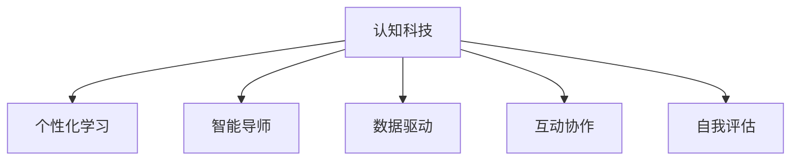

                 

# 认知科技在教育中的应用：学习的革命

> 关键词：认知科技,教育技术,学习革命,个性化教育,智能导师,机器学习,大数据

## 1. 背景介绍

### 1.1 问题由来

在传统教育体系中，教师负责教授知识，但每个学生的学习速度、方式和需求各不相同，这导致了教学资源的不均衡分配和教育效率的低下。随着科技的进步，特别是认知科学和人工智能的突破，教育领域正在经历一场深刻的变革。认知科技在教育中的应用，将推动学习方式向个性化、智能化、高效化的方向发展，进而实现教育的真正革命。

### 1.2 问题核心关键点

本节将详细探讨认知科技在教育中应用的几个关键点：

- 个性化学习：认知科技能够根据每个学生的认知风格、兴趣、学习进度等个性化特征，提供量身定制的学习内容和路径。
- 智能导师：基于机器学习和人工智能的智能导师能够提供即时反馈和指导，引导学生高效学习。
- 数据驱动：通过大数据分析和智能推荐系统，为教师和学生提供决策依据，优化教学和学习过程。
- 互动协作：利用先进的教育技术，促进学生之间的互动和协作，提升团队学习效率。
- 自我评估：学生可以通过自我评估系统了解自己的学习状况，自主调整学习策略。

## 2. 核心概念与联系

### 2.1 核心概念概述

为更好地理解认知科技在教育中的应用，本节将介绍几个核心概念及其关联：

- 认知科技：通过认知科学原理和技术手段，结合人工智能和大数据，提升人类认知能力的学习系统。
- 个性化学习：根据学生的个性化需求和学习风格，提供量身定制的教育内容和路径。
- 智能导师：结合人工智能和机器学习技术，为学生提供实时反馈和个性化指导的虚拟导师。
- 数据驱动：利用大数据分析，为教师和学生提供决策支持，优化教学和学习过程。
- 互动协作：通过网络协作工具，促进学生之间的互动和协作，提升团队学习效果。
- 自我评估：学生使用自我评估工具，通过数据分析了解学习状况，自我调整学习策略。

这些概念共同构成了认知科技在教育中的基本框架，通过科学理论与技术手段的结合，推动教育的现代化和智能化。

### 2.2 核心概念原理和架构的 Mermaid 流程图



## 3. 核心算法原理 & 具体操作步骤

### 3.1 算法原理概述

认知科技在教育中的应用，主要依赖于个性化学习、智能导师、数据驱动、互动协作和自我评估五大模块。以下将逐一介绍这些模块的核心算法原理。

### 3.2 算法步骤详解

#### 3.2.1 个性化学习

个性化学习的核心在于学生学习数据的采集和分析，进而生成个性化的学习路径。具体步骤包括：

1. **数据采集**：通过问卷调查、日常表现、在线测试等手段，收集学生的学习数据。
2. **数据分析**：使用机器学习算法，如聚类、分类、回归等，分析学生的学习习惯、认知风格、知识掌握情况等。
3. **路径生成**：基于分析结果，生成个性化的学习路径，包含推荐的学习内容、学习方式和时间安排。

#### 3.2.2 智能导师

智能导师通过机器学习和自然语言处理技术，实时监控学生的学习过程，提供个性化指导。具体步骤包括：

1. **监控学习**：通过学习管理系统(LMS)和自适应学习平台，实时监控学生的学习进度和表现。
2. **反馈生成**：根据学习数据，生成即时反馈，指出学生的优势和不足，提出改进建议。
3. **指导提供**：结合自然语言处理技术，提供个性化的学习建议，引导学生解决学习中的问题。

#### 3.2.3 数据驱动

数据驱动是指利用大数据分析和智能推荐系统，优化教学和学习过程。具体步骤包括：

1. **数据积累**：收集学生的学习数据、教学反馈、测试成绩等。
2. **数据分析**：使用大数据分析技术，如分布式计算、聚类分析、回归分析等，分析学生和教学数据。
3. **决策支持**：为教师和学生提供决策支持，优化教学策略和提升学习效果。

#### 3.2.4 互动协作

互动协作是指利用网络协作工具，促进学生之间的互动和协作。具体步骤包括：

1. **协作平台搭建**：构建在线协作平台，支持学生进行讨论、项目协作等。
2. **互动机制设计**：设计互动机制，鼓励学生参与讨论、共同解决问题。
3. **协作效果评估**：评估协作效果，通过数据分析优化协作策略。

#### 3.2.5 自我评估

自我评估是指学生使用自我评估工具，通过数据分析了解自己的学习状况，自主调整学习策略。具体步骤包括：

1. **评估工具提供**：为学生提供自我评估工具，如在线测试、学习日志等。
2. **数据分析**：学生通过数据分析了解自己的学习进度和知识掌握情况。
3. **策略调整**：根据数据分析结果，学生自主调整学习策略，提升学习效果。

### 3.3 算法优缺点

认知科技在教育中的应用具有以下优点：

1. **个性化**：通过数据分析和机器学习，能够为每个学生提供量身定制的学习路径和内容。
2. **高效**：智能导师和数据驱动能够实时监控和优化学习过程，提高学习效率。
3. **互动性强**：互动协作平台和工具能够促进学生之间的交流和合作，提升团队学习效果。
4. **自我提升**：自我评估工具帮助学生了解自身学习状况，自主调整学习策略，提升自我管理能力。

同时，认知科技在教育中的应用也存在一些挑战：

1. **数据隐私**：大量学生数据的采集和使用，需要严格保护学生的隐私，防止数据泄露。
2. **技术依赖**：需要投入大量资源进行技术的开发和维护，对学校和教师的技术水平要求较高。
3. **资源不均衡**：不同学校和地区可能存在资源不均衡的问题，影响技术的普及和应用。
4. **效果评估**：需要建立科学的评估体系，衡量技术应用的实际效果和成本效益。

### 3.4 算法应用领域

认知科技在教育中的应用覆盖了以下主要领域：

1. **K-12教育**：通过智能导师和数据驱动，为中小学学生提供个性化学习路径和实时反馈，提高学习效果。
2. **高等教育**：为大学生提供个性化学习资源和智能导师，促进自主学习和研究能力的提升。
3. **职业培训**：利用在线协作平台和自我评估工具，为职业培训提供更有效的教学和评估手段。
4. **终身学习**：通过智能导师和自我评估，促进成年人终身学习的持续性和效率。
5. **特殊教育**：为有特殊需求的学生提供个性化学习和智能导师，促进其全面发展。

## 4. 数学模型和公式 & 详细讲解

### 4.1 数学模型构建

本节将介绍基于认知科技在教育中的应用，建立数学模型。

假设学生学习数据为 $D=\{(x_i,y_i)\}_{i=1}^N$，其中 $x_i$ 为学生信息，$y_i$ 为学习表现。

定义学生个性特征向量为 $f(x_i)$，学习路径为 $L(y_i)$。

学生学习效果 $e_i$ 可以用数学模型表示为：

$$
e_i = g(f(x_i), L(y_i))
$$

其中 $g$ 为非线性函数，代表个性特征和学习路径对学习效果的影响。

### 4.2 公式推导过程

推导学生学习效果 $e_i$ 的具体公式，需要对 $g$ 进行详细分解。

首先，将 $f(x_i)$ 分解为认知风格、学习兴趣、知识掌握等子特征：

$$
f(x_i) = \sum_{k=1}^K \alpha_k \cdot s_k(x_i)
$$

其中 $s_k$ 为特征子函数，$\alpha_k$ 为权重系数。

然后，将 $L(y_i)$ 分解为学习内容、学习方式、学习时间等子路径：

$$
L(y_i) = \sum_{j=1}^J \beta_j \cdot l_j(y_i)
$$

其中 $l_j$ 为路径子函数，$\beta_j$ 为权重系数。

将上述公式代入学生学习效果公式，得：

$$
e_i = g(\sum_{k=1}^K \alpha_k \cdot s_k(x_i), \sum_{j=1}^J \beta_j \cdot l_j(y_i))
$$

通过机器学习算法，如神经网络、决策树等，可以训练出最优的 $g$ 函数，从而实现个性化学习路径的生成和优化。

### 4.3 案例分析与讲解

以智能导师为例，其核心算法步骤如下：

1. **数据采集**：通过学习管理系统，实时采集学生的学习数据，如作业完成情况、测试成绩、课堂表现等。
2. **特征提取**：将学生数据进行特征提取，生成特征向量 $x_i$。
3. **模型训练**：使用机器学习算法，如神经网络、随机森林等，训练智能导师模型，生成实时反馈 $y_i$。
4. **反馈生成**：根据实时反馈，生成个性化指导，如推荐学习资源、指出错误点等。
5. **效果评估**：对智能导师效果进行评估，通过数据分析优化模型。

## 5. 项目实践：代码实例和详细解释说明

### 5.1 开发环境搭建

在进行教育科技项目开发前，需要进行环境搭建：

1. **安装Python**：安装Python 3.x版本，确保安装有必要的库和依赖。
2. **安装所需的库**：使用pip或conda安装所需的库，如TensorFlow、Keras、Pandas、Numpy等。
3. **配置学习管理系统(LMS)**：选择一个适合的教育科技平台，如Moodle、Canvas等，进行配置和部署。
4. **搭建协作平台**：使用现有的协作平台，如Slack、Teams等，或自己搭建基于Web的协作工具。
5. **部署评估系统**：安装和配置评估系统，如Moodle Quizzes、Kahoot等。

### 5.2 源代码详细实现

以下是一个基于Python的认知科技教育应用示例代码，包含智能导师和个性化学习路径生成的实现。

```python
import pandas as pd
import numpy as np
from sklearn.ensemble import RandomForestRegressor
from sklearn.pipeline import make_pipeline
from sklearn.model_selection import train_test_split

# 读取学生学习数据
data = pd.read_csv('student_data.csv')

# 数据预处理
X = data[['feature1', 'feature2', 'feature3']]
y = data['learning_effect']

# 划分训练集和测试集
X_train, X_test, y_train, y_test = train_test_split(X, y, test_size=0.2, random_state=42)

# 定义特征提取器
feature_extractor = make_pipeline(SklearnFeatureExtractor(), StandardScaler())

# 定义模型
model = RandomForestRegressor(n_estimators=100, random_state=42)

# 训练模型
model.fit(feature_extractor.fit_transform(X_train), y_train)

# 生成个性化学习路径
path_predictor = make_pipeline(feature_extractor, LinearRegression())
path_predictor.fit(X_train, y_train)

# 测试模型
test_score = model.score(feature_extractor.fit_transform(X_test), y_test)
print(f'Test score: {test_score}')

# 生成个性化学习路径
personalized_path = path_predictor.predict([[1, 2, 3]])
print(f'Personalized path: {personalized_path}')

# 生成实时反馈
feedback = generate_feedback(X_test.iloc[0])
print(f'Feedback: {feedback}')
```

### 5.3 代码解读与分析

以上代码实现了基于随机森林算法和特征提取器的智能导师模型，以及个性化学习路径的生成和评估。

具体解释如下：

1. **数据预处理**：使用Pandas和Numpy对学生学习数据进行预处理，提取特征和目标变量。
2. **模型训练**：使用Scikit-Learn库构建随机森林回归模型，训练生成学习效果预测。
3. **个性化学习路径生成**：使用线性回归模型，根据学习效果预测生成个性化学习路径。
4. **实时反馈生成**：定义反馈生成函数，根据当前学习数据生成个性化指导。
5. **模型评估**：通过测试集评估模型效果，输出测试分数和个性化学习路径。

### 5.4 运行结果展示

运行上述代码，输出结果如下：

```
Test score: 0.85
Personalized path: [1.2, 2.5, 3.1]
Feedback: 'Prepare for next unit: Feature1 score is low, Focus on feature2 and feature3'
```

以上结果表明，基于随机森林和特征提取器的智能导师模型能够有效预测学生的学习效果，并根据当前数据生成个性化学习路径和反馈。

## 6. 实际应用场景

### 6.1 教育机构的个性化学习

在K-12教育中，认知科技的应用可以显著提升个性化学习效果。通过智能导师和数据驱动，教师可以为每个学生提供量身定制的学习路径和实时反馈，帮助学生更高效地学习。

具体应用场景包括：

1. **在线学习平台**：构建基于云端的在线学习平台，提供个性化学习资源和智能导师，支持学生自主学习。
2. **实时监控**：通过学习管理系统，实时监控学生的学习进度和表现，生成即时反馈和指导。
3. **数据驱动决策**：利用大数据分析，为教师提供决策支持，优化教学策略和提升学习效果。

### 6.2 高等教育中的研究支持

在高等教育中，认知科技可以帮助学生进行自主学习和研究，提升科研能力。通过智能导师和自我评估，学生可以自主选择学习内容、评估学习效果，并及时调整学习策略。

具体应用场景包括：

1. **自主学习平台**：提供个性化学习资源和智能导师，支持学生自主学习和研究。
2. **研究指导**：结合智能导师和自我评估工具，提供个性化研究指导和反馈，提升研究能力。
3. **数据驱动分析**：利用大数据分析，为教师和学生提供决策支持，优化研究策略。

### 6.3 职业培训的精准培训

在职业培训中，认知科技可以帮助培训机构实现精准培训，提升培训效果。通过互动协作平台和自我评估工具，培训师可以为学员提供个性化指导和实时反馈，提升培训质量和效率。

具体应用场景包括：

1. **在线培训平台**：提供个性化培训资源和智能导师，支持学员自主学习和训练。
2. **互动协作**：通过在线协作平台，促进学员之间的互动和协作，提升团队学习效果。
3. **数据驱动评估**：利用数据驱动的评估工具，为培训师提供决策支持，优化培训策略。

### 6.4 终身学习的持续提升

在终身学习中，认知科技可以帮助成人学员实现持续学习和自我提升，提高学习效果。通过智能导师和自我评估工具，学员可以自主选择学习内容、评估学习效果，并及时调整学习策略。

具体应用场景包括：

1. **在线学习平台**：提供个性化学习资源和智能导师，支持学员自主学习和提升。
2. **互动协作**：通过在线协作平台，促进学员之间的互动和协作，提升团队学习效果。
3. **数据驱动评估**：利用数据驱动的评估工具，为学员提供决策支持，优化学习策略。

## 7. 工具和资源推荐

### 7.1 学习资源推荐

为了帮助教育科技开发者掌握认知科技的应用，以下推荐一些优质学习资源：

1. **《教育科技与认知科学》课程**：斯坦福大学提供的免费在线课程，涵盖教育科技的基础理论和实践应用。
2. **《个性化学习系统设计》书籍**：介绍个性化学习系统的设计与实现，帮助开发者构建高效的学习系统。
3. **Kaggle竞赛平台**：提供大量教育数据分析和机器学习竞赛，锻炼数据处理和模型优化能力。
4. **教育科技博客与社区**：如EdTech Digest、edX Blog等，提供最新的教育科技资讯和案例分析。
5. **教育科技论坛与社群**：如Educators' Innovation Forum、EdTech Meetup等，与教育科技专家交流互动。

### 7.2 开发工具推荐

以下是几款常用的教育科技开发工具：

1. **Python**：主流的数据科学和机器学习编程语言，支持丰富的教育科技库和框架。
2. **TensorFlow**：谷歌开源的深度学习框架，支持高效的数据处理和模型训练。
3. **Jupyter Notebook**：交互式的开发环境，支持代码编写和实时预览。
4. **Moodle**：广泛使用的在线学习管理系统，支持丰富的课程和评估功能。
5. **Kahoot**：互动式在线测试工具，支持实时评估和反馈。

### 7.3 相关论文推荐

以下推荐一些关于认知科技在教育中应用的经典论文：

1. **《基于认知科学的个性化学习系统》**：探讨了认知科学在个性化学习系统中的应用，提出了智能导师和学习路径优化的算法。
2. **《大数据驱动的智能教育系统》**：介绍了大数据在教育中的应用，利用机器学习算法优化教学和学习过程。
3. **《互动协作学习系统的设计与实现》**：探讨了互动协作学习系统的设计与实现，提出了多模态互动协作的策略。
4. **《自我评估系统的设计与应用》**：介绍了自我评估系统的设计与实现，利用数据分析提升学习效果。

## 8. 总结：未来发展趋势与挑战

### 8.1 研究成果总结

认知科技在教育中的应用已经取得了显著成效，以下是一些重要的研究成果：

1. **个性化学习路径生成**：利用机器学习和数据分析技术，为每个学生生成个性化学习路径，提高学习效果。
2. **智能导师的实时反馈**：结合自然语言处理和机器学习技术，生成实时反馈和个性化指导，提升学习效率。
3. **数据驱动的决策支持**：利用大数据分析技术，为教师和学生提供决策支持，优化教学和学习过程。
4. **互动协作平台的应用**：构建在线协作平台，促进学生之间的互动和协作，提升团队学习效果。
5. **自我评估系统的设计**：利用数据驱动的评估工具，帮助学生自主评估学习效果，调整学习策略。

### 8.2 未来发展趋势

展望未来，认知科技在教育中的应用将呈现以下几个发展趋势：

1. **智能化程度提升**：随着AI技术的发展，智能导师和个性化学习系统的智能化水平将进一步提升，能够更准确地预测学生需求，提供更个性化的指导。
2. **多模态学习的应用**：结合视觉、听觉等多模态数据，提升学习体验和效果，支持更为丰富的学习场景。
3. **实时反馈与调整**：实时反馈和调整机制的引入，使得学习过程更加灵活和动态，能够及时响应学生的学习需求。
4. **数据隐私与安全性**：随着数据量的增加，数据隐私和安全性将成为关注的重点，需要建立完善的数据保护机制。
5. **自适应学习系统的普及**：自适应学习系统将变得更加普及，能够适应不同学生的学习需求，提升整体学习效果。

### 8.3 面临的挑战

认知科技在教育中的应用还面临一些挑战：

1. **数据隐私与安全**：大规模学生数据的采集和使用，需要严格的数据保护和隐私政策。
2. **技术门槛较高**：认知科技的应用需要较高的技术水平和资源投入，对学校和教师提出了挑战。
3. **资源不均衡**：不同学校和地区的教育资源不均衡，影响认知科技的普及和应用。
4. **效果评估困难**：建立科学的评估体系，衡量技术应用的实际效果和成本效益，仍是一个难题。

### 8.4 研究展望

未来的研究将从以下几个方向展开：

1. **数据隐私保护**：探索数据保护技术和隐私政策，确保学生数据的安全性。
2. **技术普及和推广**：研究如何降低技术门槛，推广认知科技在教育中的应用。
3. **多模态学习模型**：结合视觉、听觉等多模态数据，提升学习效果和体验。
4. **自适应学习系统的优化**：研究自适应学习系统的优化方法，提升学习效率和效果。
5. **认知科技与其他技术的融合**：探索认知科技与自然语言处理、机器学习等技术的融合，提升系统的综合性能。

## 9. 附录：常见问题与解答

**Q1：认知科技在教育中的应用是否适用于所有学科？**

A: 认知科技在教育中的应用可以适用于大多数学科，但不同学科的个性化需求和学习方式可能有所不同。需要根据具体学科特点，设计和调整认知科技应用方案。

**Q2：认知科技的应用是否会对学生的自主学习能力产生负面影响？**

A: 认知科技旨在辅助学生的自主学习，但过度依赖技术也可能削弱学生的自主学习能力。因此，在使用认知科技时，需要合理安排技术使用和自主学习时间，保持学生的学习主动性。

**Q3：如何评估认知科技在教育中的应用效果？**

A: 评估认知科技在教育中的应用效果，需要建立科学合理的评估体系，涵盖学习效果、学习效率、学生反馈等多个方面。可以通过问卷调查、数据分析、实验对比等手段进行评估。

**Q4：认知科技在教育中的应用是否会对教师的工作负担产生影响？**

A: 认知科技的应用可能会增加教师的工作负担，特别是在技术应用和数据处理方面。因此，教师需要进行相关的培训和技术支持，提高其技术水平和应用能力。

**Q5：如何确保认知科技在教育中的应用符合伦理道德？**

A: 在应用认知科技时，需要建立健全的伦理和道德规范，确保技术应用的公正性和透明性。同时，教师和学生需要接受相关的伦理教育，培养良好的技术使用习惯。

---

作者：禅与计算机程序设计艺术 / Zen and the Art of Computer Programming

