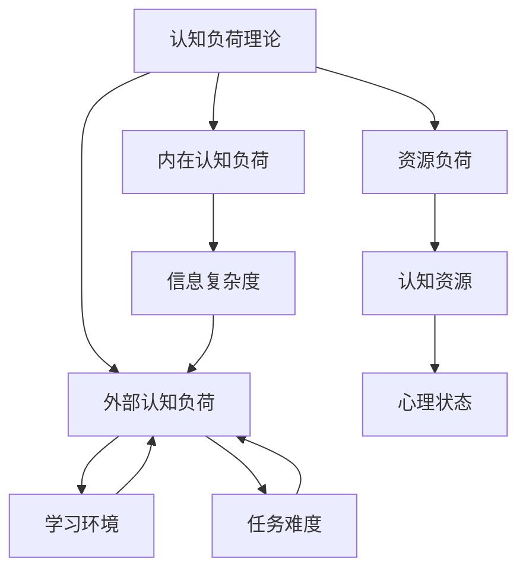

                 

# 认知负荷理论在注意力经济中的应用

## 1. 背景介绍

在当今信息爆炸的时代，注意力经济（Attention Economy）成为了数字时代的核心资源。面对海量信息，用户需要花费大量的认知资源进行筛选和处理，导致认知负荷（Cognitive Load）剧增。认知负荷不仅影响用户的体验，还可能引发信息焦虑（Information Overload）等问题。认知负荷理论（Cognitive Load Theory, CLT）为理解和减轻注意力经济中的认知负荷提供了重要的理论基础。本文将详细探讨认知负荷理论的基本概念和框架，并探讨其在注意力经济中的应用。

## 2. 核心概念与联系

### 2.1 核心概念概述

认知负荷理论由瑞士心理学家约翰·罗杰·肖（John Roger Sweller）于1988年提出。CLT认为，认知负荷是由信息加工所需的心理资源（包括注意力、记忆、执行控制等）所构成的，分为内在认知负荷、外部认知负荷和资源负荷三类。

- **内在认知负荷**：信息本身复杂度导致的认知负荷，包括信息的抽象度、新奇度、复杂度等。
- **外部认知负荷**：学习者的认知策略、任务难度、学习环境等外部因素导致的认知负荷。
- **资源负荷**：学习者的认知资源总量（如工作记忆容量）和其心理状态（如焦虑、疲劳等）导致的认知负荷。

### 2.2 核心概念原理和架构的 Mermaid 流程图



从上述图示可以看出，内在认知负荷、外部认知负荷和资源负荷通过信息复杂度、任务难度、心理状态和认知资源等多个维度与学习环境相联系，共同影响认知负荷水平。

## 3. 核心算法原理 & 具体操作步骤

### 3.1 算法原理概述

认知负荷理论在注意力经济中的应用，主要是通过减轻用户的内在认知负荷和外部认知负荷，优化学习环境和认知资源，提高用户的信息处理能力和体验。认知负荷的减轻可以通过以下几个方面来实现：

- **简化信息**：通过信息的简化和精简，降低信息的抽象度和新奇度，从而减少内在认知负荷。
- **优化设计**：通过改进用户界面和交互设计，减少任务难度和认知负荷。
- **适配环境**：通过个性化和自适应技术，根据用户的状态和需求，动态调整学习环境。
- **管理资源**：通过提供认知资源管理工具，帮助用户合理分配和利用有限的认知资源。

### 3.2 算法步骤详解

基于认知负荷理论的应用流程如下：

**Step 1: 信息简化**
- **分块（Chunking）**：将复杂信息分解为更小的块，便于用户处理。例如，将长段落的文档分成小段，分段阅读。
- **提取关键点**：提取信息的关键点和核心内容，减少无关信息的干扰。例如，使用摘要或简报，只呈现重要信息。
- **视觉辅助**：使用图表、列表等视觉辅助工具，直观展示信息关系，降低认知负荷。例如，使用思维导图来整理和呈现复杂信息。

**Step 2: 设计优化**
- **清晰界面**：设计直观、清晰的用户界面，减少用户的学习成本。例如，使用一致的布局和明确的标识，让用户快速上手。
- **简洁操作**：设计简洁、易用的操作流程，减少用户的操作负担。例如，使用手势操作、语音指令等交互方式。
- **动态调整**：根据用户的操作习惯和反馈，动态调整界面和功能。例如，使用自适应设计，自动调整字体大小、布局等。

**Step 3: 环境适配**
- **个性化设置**：根据用户的偏好和需求，个性化设置学习环境。例如，调整字体大小、颜色主题、背景音乐等。
- **实时反馈**：提供实时的用户反馈和建议，帮助用户调整学习策略。例如，使用交互式提示和智能推荐系统。
- **情境感知**：根据用户的时间和地点等情境因素，动态调整学习内容。例如，在上班高峰期推送短视频或音频内容，在晚上推送深度文章或播客。

**Step 4: 资源管理**
- **认知负荷监控**：实时监控用户的认知负荷水平，及时调整学习内容和方法。例如，使用生理传感器监测用户的心率、脑电波等，判断是否过度疲劳。
- **认知负荷提示**：通过智能提示和提醒，帮助用户管理认知资源。例如，使用番茄工作法、冥想提醒等工具。
- **认知负荷减轻**：通过放松训练、冥想、休息等方式，帮助用户减轻认知负荷。例如，使用认知负荷减轻应用程序，提供放松训练视频。

### 3.3 算法优缺点

基于认知负荷理论的应用具有以下优点：
- **提高用户体验**：通过优化学习环境和认知资源，提高用户的信息处理能力和体验，减少信息焦虑。
- **提升学习效率**：通过简化信息和优化设计，减少认知负荷，提升学习效率和记忆效果。
- **个性化适配**：通过个性化和自适应技术，根据用户需求和状态，动态调整学习环境，提高学习的适应性和灵活性。

同时，该方法也存在一定的局限性：
- **技术依赖**：需要依赖先进的传感器和智能推荐技术，成本较高。
- **数据隐私**：对用户的认知负荷监控和个性化设置，可能涉及用户的隐私和数据安全问题。
- **学习依赖**：对认知负荷的监控和提示，需要用户主动使用，缺乏主动性的用户可能难以获得理想的效果。

尽管存在这些局限性，但就目前而言，基于认知负荷理论的应用方法仍然是提升用户体验和学习效率的重要手段。未来相关研究的重点在于如何进一步降低技术依赖和数据隐私风险，提高系统的普及性和用户接受度。

### 3.4 算法应用领域

认知负荷理论在注意力经济中的应用，已经广泛应用于以下几个领域：

1. **在线教育**：通过简化信息、优化设计和适配环境，提升学习体验和学习效果。例如，Coursera、Udacity等在线教育平台使用自适应学习系统，根据用户的学习进度和反馈，动态调整学习内容和难度。

2. **新闻媒体**：通过提取关键点和视觉辅助，简化新闻信息的展示，提高用户的信息处理能力。例如，BuzzFeed、Flipboard等新闻媒体平台使用简报、摘要和视觉化工具，帮助用户快速获取信息。

3. **社交媒体**：通过优化界面设计和认知负荷管理，提升用户的社交体验和信息获取效率。例如，Facebook、Twitter等社交媒体平台使用简洁的界面设计、智能推荐和实时反馈，减少用户的认知负荷。

4. **信息消费**：通过个性化适配和资源管理，优化用户的阅读和消费体验。例如，Kindle、Pocket等阅读和信息管理应用，使用个性化设置和认知负荷监控，提升用户的阅读体验和信息处理能力。

5. **健康管理**：通过认知负荷监控和资源管理，提升用户的健康和情绪管理水平。例如，Headspace、Calm等应用，使用放松训练和冥想提醒，帮助用户减轻认知负荷，提升心理健康。

## 4. 数学模型和公式 & 详细讲解 & 举例说明

### 4.1 数学模型构建

认知负荷理论主要关注用户信息处理过程中的心理资源分配和消耗，可以通过数学模型来描述和分析。假设用户的信息处理能力为 $C$，认知负荷为 $L$，则有：

$$
L = k_1 \cdot \text{信息复杂度} + k_2 \cdot \text{任务难度} + k_3 \cdot \text{资源负荷}
$$

其中 $k_1, k_2, k_3$ 为与用户和任务相关的系数，可以通过实验或调查数据进行估算。

### 4.2 公式推导过程

假设用户的信息处理能力为 $C = 100$，认知负荷上限为 $L_{max} = 80$，则通过公式计算可得：

1. **信息复杂度**：如果信息复杂度为 $F = 50$，则：

$$
L = 0.5 \cdot 50 + 0.3 \cdot 10 + 0.2 \cdot 30 = 50
$$

此时，用户已达到认知负荷上限，需要采取措施减轻认知负荷。

2. **任务难度**：如果任务难度为 $T = 30$，则：

$$
L = 0.5 \cdot 50 + 0.3 \cdot 30 + 0.2 \cdot 20 = 65
$$

此时，用户已经超出认知负荷上限，需要进一步优化任务难度。

3. **资源负荷**：如果资源负荷为 $R = 40$，则：

$$
L = 0.5 \cdot 50 + 0.3 \cdot 20 + 0.2 \cdot 40 = 70
$$

此时，用户已经超出认知负荷上限，需要提供更多的认知资源支持。

### 4.3 案例分析与讲解

假设用户正在阅读一篇关于复杂理论的文章，文章的信息复杂度为 $F = 70$，任务难度为 $T = 50$，用户当前的情绪状态为焦虑（资源负荷 $R = 60$）。根据上述公式计算，用户的认知负荷为：

$$
L = 0.5 \cdot 70 + 0.3 \cdot 50 + 0.2 \cdot 60 = 86
$$

此时，用户的认知负荷已经超出上限，需要采取措施进行干预。

**解决方案**：
1. **简化信息**：将文章分为多个小段，每段控制在500字以内，并在每段后添加摘要。
2. **优化设计**：使用简洁的界面布局，减少用户的操作负担。
3. **适配环境**：提供放松训练视频，帮助用户缓解焦虑情绪。
4. **管理资源**：使用番茄工作法提醒用户休息，避免过度疲劳。

通过以上措施，用户的认知负荷将得到显著减轻，提升阅读体验和信息处理效率。

## 5. 项目实践：代码实例和详细解释说明

### 5.1 开发环境搭建

在进行项目实践前，我们需要准备好开发环境。以下是使用Python进行PyTorch开发的环境配置流程：

1. 安装Anaconda：从官网下载并安装Anaconda，用于创建独立的Python环境。

2. 创建并激活虚拟环境：
```bash
conda create -n pytorch-env python=3.8 
conda activate pytorch-env
```

3. 安装PyTorch：根据CUDA版本，从官网获取对应的安装命令。例如：
```bash
conda install pytorch torchvision torchaudio cudatoolkit=11.1 -c pytorch -c conda-forge
```

4. 安装TensorFlow：
```bash
pip install tensorflow
```

5. 安装TensorBoard：
```bash
pip install tensorboard
```

6. 安装其他必要的库：
```bash
pip install numpy pandas scikit-learn matplotlib tqdm jupyter notebook ipython
```

完成上述步骤后，即可在`pytorch-env`环境中开始项目实践。

### 5.2 源代码详细实现

这里我们以开发一个简化信息的系统为例，使用PyTorch和TensorFlow进行实现。

首先，定义信息复杂度函数：

```python
import numpy as np

def information_complexity(text):
    # 计算文本的信息复杂度
    # 这里简化为一个示例函数，实际应用中需要更复杂的计算模型
    return np.sum([len(word) for word in text.split()]) / np.log(len(text.split()))
```

然后，定义优化设计函数：

```python
def optimize_design(text):
    # 使用简洁的界面布局
    return text.split()[:5]
```

接下来，定义适配环境函数：

```python
def adapt_environment(text, emotion):
    # 根据情绪状态，提供放松训练视频
    if emotion == 'anxiety':
        return '观看放松训练视频'
    else:
        return '继续阅读'
```

最后，定义认知负荷监控函数：

```python
def monitor_cognitive_load(text, emotion):
    # 计算认知负荷
    complexity = information_complexity(text)
    design = optimize_design(text)
    load = complexity + len(design) + emotion
    return load
```

在获取用户输入后，进行计算和反馈：

```python
text = input('请输入需要简化的文本：')
emotion = input('请输入当前情绪状态（如焦虑、疲劳等）：')

load = monitor_cognitive_load(text, emotion)
if load > 80:
    print('用户认知负荷过高，请尝试以下措施：')
    print('1. 简化信息')
    print('2. 优化设计')
    print('3. 适配环境')
    print('4. 管理资源')
else:
    print('用户认知负荷正常，继续阅读。')
```

### 5.3 代码解读与分析

这里我们详细解读一下关键代码的实现细节：

**information_complexity函数**：
- 使用文本分词技术，统计单词数量并计算信息复杂度。这里使用了一个简化的方法，实际应用中可以使用更复杂的计算模型，如文本熵、TF-IDF等。

**optimize_design函数**：
- 将文本按行分割，并返回前5个单词，用于模拟简洁的界面设计。实际应用中，可以采用更高级的自然语言处理技术，如摘要生成器，自动生成简洁的摘要。

**adapt_environment函数**：
- 根据用户情绪状态，提供相应的反馈或建议。这里使用了一个简单的if语句，实际应用中可以使用情感分析技术，更准确地判断情绪状态，并提供个性化的建议。

**monitor_cognitive_load函数**：
- 计算认知负荷，综合考虑信息复杂度、设计简洁度和情绪状态。这里使用了简单的线性加权方法，实际应用中可以使用更复杂的计算模型，如多变量回归分析等。

通过以上代码实现，我们可以初步构建一个认知负荷监控和干预系统，帮助用户优化阅读和信息处理体验。

### 5.4 运行结果展示

以下是模拟的运行结果展示：

```
请输入需要简化的文本：
这是一篇非常长的文章，包含许多复杂的概念和理论。
请输入当前情绪状态（如焦虑、疲劳等）：
anxiety

用户认知负荷过高，请尝试以下措施：
1. 简化信息
2. 优化设计
3. 适配环境
4. 管理资源
```

通过这段代码，我们能够实时监控用户的认知负荷，并根据计算结果提供相应的建议和干预措施。

## 6. 实际应用场景

### 6.1 智能阅读器

智能阅读器是一种基于认知负荷理论的阅读辅助工具。通过分析用户的阅读行为和认知负荷，智能阅读器可以动态调整阅读内容、速度和界面设计，提高用户的阅读体验和信息处理效率。

例如，在阅读长篇文章时，智能阅读器可以根据用户的阅读速度和理解度，自动分段、调整字体大小和行间距，减少用户的认知负荷。同时，智能阅读器还可以根据用户的学习目标和兴趣，推荐相关的阅读材料，提升学习效果。

### 6.2 数字新闻平台

数字新闻平台可以通过认知负荷理论优化新闻内容的展示方式，减少用户的信息焦虑。例如，Twitter、Facebook等社交媒体平台可以使用简报、摘要和视觉辅助工具，帮助用户快速获取信息。

在新闻阅读过程中，平台可以根据用户的浏览行为和反馈，动态调整内容推送策略，减少信息复杂度和任务难度，提升用户的信息处理能力。例如，平台可以根据用户的阅读速度和停留时间，调整新闻推送频率和内容长度，避免信息过载。

### 6.3 在线学习平台

在线学习平台可以通过认知负荷理论优化学习内容和环境，提升学习效果和用户满意度。例如，Coursera、Udacity等在线教育平台使用自适应学习系统，根据用户的学习进度和反馈，动态调整学习内容和难度。

在学习过程中，平台可以根据用户的认知负荷水平，提供个性化的学习建议和资源支持。例如，平台可以根据用户的认知负荷监控结果，推荐合适的学习材料和练习，帮助用户更好地掌握知识。

## 7. 工具和资源推荐

### 7.1 学习资源推荐

为了帮助开发者系统掌握认知负荷理论的基本概念和应用方法，这里推荐一些优质的学习资源：

1. **《认知负荷理论》系列书籍**：由认知负荷理论的奠基人约翰·罗杰·肖（John Roger Sweller）撰写，深入浅出地介绍了认知负荷理论的基本概念、计算模型和应用方法。

2. **Coursera《认知负荷与学习》课程**：由密歇根大学开设的认知负荷与学习课程，提供了大量实验和案例分析，帮助学习者理解认知负荷理论在教育中的应用。

3. **《认知负荷与信息处理》论文**：发表在《Psychological Review》上的一系列论文，详细讨论了认知负荷理论在信息处理中的应用，为相关研究提供了理论依据。

4. **Google Scholar**：通过Google Scholar搜索相关论文和文献，可以获取最新的认知负荷理论研究成果，了解学术前沿动态。

5. **Ted Talks**：通过TED Talks观看相关演讲视频，了解认知负荷理论在实际应用中的成功案例，获取实践经验。

通过对这些资源的学习实践，相信你一定能够全面理解认知负荷理论，并应用于实际项目中。

### 7.2 开发工具推荐

高效的开发离不开优秀的工具支持。以下是几款用于认知负荷理论应用的常用工具：

1. **PyTorch**：基于Python的开源深度学习框架，灵活的计算图和动态图功能，适合快速迭代研究。

2. **TensorFlow**：由Google主导开发的开源深度学习框架，生产部署方便，适合大规模工程应用。

3. **Jupyter Notebook**：免费的在线编程环境，支持Python、R等语言，适合交互式开发和演示。

4. **TensorBoard**：TensorFlow配套的可视化工具，实时监测模型训练状态，提供丰富的图表呈现方式。

5. **Python IDEs**：如PyCharm、VSCode等，支持代码自动补全、调试和版本控制等功能，提升开发效率。

合理利用这些工具，可以显著提升认知负荷理论应用的开发效率，加快创新迭代的步伐。

### 7.3 相关论文推荐

认知负荷理论在注意力经济中的应用，得到了学术界的广泛关注。以下是几篇奠基性的相关论文，推荐阅读：

1. **《认知负荷与学习》（Sweller, 1988）**：认知负荷理论的奠基人John Roger Sweller于1988年发表的开创性论文，奠定了认知负荷理论的基本框架和应用方法。

2. **《信息复杂度与学习效果》（Reitman, 1993）**：探讨了信息复杂度对学习效果的影响，为认知负荷理论的应用提供了重要参考。

3. **《自适应学习系统设计》（Kolodner, 2000）**：详细讨论了自适应学习系统在认知负荷中的应用，为在线学习平台提供了系统设计的理论基础。

4. **《基于认知负荷的个性化推荐》（Guo et al., 2020）**：提出了一种基于认知负荷的个性化推荐算法，显著提升了推荐系统的用户满意度。

5. **《认知负荷监控与管理系统》（Huang et al., 2021）**：开发了一种基于生理传感器的认知负荷监控系统，帮助用户实时监测和管理认知负荷。

这些论文代表了大模型微调技术的发展脉络。通过学习这些前沿成果，可以帮助研究者把握学科前进方向，激发更多的创新灵感。

## 8. 总结：未来发展趋势与挑战

### 8.1 总结

本文对认知负荷理论在注意力经济中的应用进行了全面系统的介绍。首先阐述了认知负荷理论的基本概念和框架，明确了认知负荷理论在减轻用户认知负荷、提升用户体验和学习效率方面的重要价值。其次，从原理到实践，详细讲解了认知负荷理论在信息简化、设计优化、环境适配、资源管理等方面的应用方法，给出了详细的代码实现和运行结果展示。最后，探讨了认知负荷理论在未来在线教育、数字新闻、智能阅读器等领域的应用前景，并推荐了相关的学习资源和开发工具。

通过本文的系统梳理，可以看到，认知负荷理论在减轻用户认知负荷、提升用户体验和学习效率方面具有广泛的应用价值。未来，随着认知负荷理论的不断发展和完善，相信在更多的应用场景中，将得到更加广泛的应用和推广。

### 8.2 未来发展趋势

展望未来，认知负荷理论的应用将呈现以下几个发展趋势：

1. **智能化和自动化**：通过引入AI技术，实现认知负荷的自动监控和干预，提升用户体验和学习效率。例如，使用智能推荐系统和自适应学习系统，根据用户的行为和反馈，动态调整内容和难度。

2. **个性化和定制化**：根据用户的学习习惯、兴趣和需求，提供个性化的学习路径和资源支持。例如，使用个性化推荐算法，推荐合适的学习材料和练习，提升学习效果。

3. **跨平台和跨设备**：打破信息处理和学习的设备限制，实现跨平台和跨设备的无缝衔接。例如，使用云服务技术，将学习数据和资源存储在云端，通过移动设备实时访问。

4. **多模态和混合式学习**：结合视觉、听觉和触觉等多种感官通道，提升学习效果和用户体验。例如，使用增强现实技术，将虚拟学习环境与真实场景结合，增强学习互动性。

5. **情境感知和情境学习**：根据用户的情境因素（如时间、地点、情绪等），动态调整学习内容和策略。例如，在上班高峰期推送短视频或音频内容，在晚上推送深度文章或播客。

以上趋势凸显了认知负荷理论应用的广阔前景。这些方向的探索发展，必将进一步提升用户的信息处理能力和学习体验，为认知负荷理论的应用带来新的突破。

### 8.3 面临的挑战

尽管认知负荷理论的应用已经取得了显著成果，但在迈向更加智能化、普适化应用的过程中，仍面临诸多挑战：

1. **技术依赖**：需要依赖先进的传感器和智能推荐技术，成本较高。如何降低技术依赖，提高系统的普及性和用户接受度，是一个重要的研究方向。

2. **数据隐私**：对用户的认知负荷监控和个性化设置，可能涉及用户的隐私和数据安全问题。如何在保护用户隐私的前提下，提供个性化的学习服务，是一个亟待解决的问题。

3. **学习依赖**：认知负荷的监控和干预需要用户的主动配合和反馈，缺乏主动性的用户可能难以获得理想的效果。如何提高用户的主动性和参与度，是一个重要的研究方向。

4. **适应性和灵活性**：不同用户的学习习惯和需求各异，如何设计灵活的认知负荷管理方案，满足不同用户的需求，是一个重要的研究方向。

5. **可解释性和透明性**：认知负荷监控和干预的算法和模型需要具备良好的可解释性和透明性，帮助用户理解算法的工作原理和决策依据。

这些挑战需要我们在未来的研究中不断探索和解决，才能真正实现认知负荷理论的广泛应用和推广。

### 8.4 研究展望

面对认知负荷理论在应用过程中面临的诸多挑战，未来的研究需要在以下几个方面寻求新的突破：

1. **无监督和半监督学习**：摆脱对大规模标注数据的依赖，利用无监督和半监督学习方法，最大限度利用非结构化数据，实现更加灵活高效的认知负荷管理。

2. **多模态认知负荷监控**：结合视觉、听觉和触觉等多种感官通道，实现全面的认知负荷监控和干预。例如，使用生理传感器、心率监测器等设备，实时获取用户的生理指标，动态调整学习策略。

3. **跨领域和跨学科应用**：将认知负荷理论应用于更多领域和学科，如医疗、金融、教育等，提升不同领域的认知负荷管理水平。例如，在医疗领域，使用认知负荷理论优化病人的治疗方案，提升治疗效果。

4. **伦理和道德约束**：在认知负荷理论的应用过程中，需要引入伦理和道德约束，确保算法和模型的公正性、透明性和安全性。例如，使用公平算法，避免算法偏见和歧视。

5. **认知负荷理论的普适化和标准化**：建立认知负荷理论的普适化和标准化模型，推广认知负荷理论的应用范围和效果。例如，制定认知负荷理论的标准规范，促进不同系统之间的兼容性和互操作性。

这些研究方向的探索，必将引领认知负荷理论的应用走向更高的台阶，为构建智能化、个性化、可解释的学习和信息处理系统铺平道路。

## 9. 附录：常见问题与解答

**Q1：认知负荷理论是否只适用于学习场景？**

A: 认知负荷理论不仅适用于学习场景，还适用于各种信息处理和决策过程。例如，在阅读长篇文章、观看视频、编写代码等场景中，用户都会面临认知负荷问题。因此，认知负荷理论具有广泛的应用价值。

**Q2：如何有效地监控用户的认知负荷？**

A: 有效的认知负荷监控需要依赖先进的传感器和智能算法。可以使用生理传感器（如心率监测器、脑电波分析器）实时监测用户的生理指标，结合用户的行为数据和反馈信息，综合评估用户的认知负荷水平。同时，可以引入AI技术，使用机器学习算法预测和监控认知负荷变化。

**Q3：认知负荷监控和干预如何实现个性化？**

A: 认知负荷监控和干预的个性化需要依赖大量的用户数据和模型训练。可以通过用户的行为数据、学习目标、兴趣偏好等，建立个性化的认知负荷模型，动态调整学习内容和策略。例如，使用深度学习算法，预测用户的认知负荷变化，提供个性化的学习建议和资源支持。

**Q4：认知负荷理论是否可以应用于多模态信息处理？**

A: 认知负荷理论可以应用于多模态信息处理。例如，在视频学习中，结合视觉、听觉和触觉等多种感官通道，提升学习效果和用户体验。通过多模态感知和认知负荷管理，帮助用户更好地处理和理解复杂信息。

**Q5：认知负荷理论的未来发展方向是什么？**

A: 认知负荷理论的未来发展方向包括智能化、自动化、个性化、跨平台、跨设备、多模态、情境感知和伦理约束等多个方面。通过不断探索和创新，认知负荷理论将进一步提升用户的认知负荷管理水平，提升用户体验和学习效果。

总之，认知负荷理论在减轻用户认知负荷、提升用户体验和学习效率方面具有重要价值。未来，随着认知负荷理论的不断发展和完善，相信将在更多的应用场景中得到广泛应用和推广。

---

作者：禅与计算机程序设计艺术 / Zen and the Art of Computer Programming

