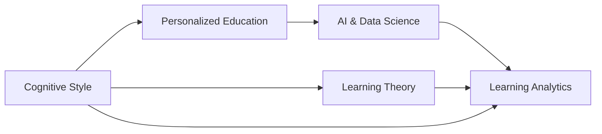

                 

# 认知风格：个性化教育的基石

> 关键词：认知风格,个性化教育,学习理论,人工智能,数据科学,深度学习

## 1. 背景介绍

### 1.1 问题由来

在当今这个信息爆炸的时代，教育领域也面临着前所未有的挑战和机遇。传统的“一刀切”教育模式已经无法满足个体差异化的学习需求。如何在兼顾公平性的同时，实现个性化教育，让每个学生都能找到适合自己的学习路径，已经成为教育界亟待解决的重要问题。

### 1.2 问题核心关键点

个性化教育的核心在于识别学生的认知风格（Cognitive Style），并据此提供量身定制的教育资源和方法。认知风格指的是个人在学习、思考、记忆等认知活动中的偏好和习惯，不同的认知风格对同一信息有着不同的处理方式。了解和尊重学生的认知风格，可以大大提升学习的效率和效果。

### 1.3 问题研究意义

认知风格的研究不仅有助于个性化教育的实现，还能为教师提供更加科学的教学策略，帮助学生更好地适应学习和成长环境。通过将认知风格理论引入教育领域，我们可以构建更加灵活、高效、公平的教育体系，推动教育公平的进步。

## 2. 核心概念与联系

### 2.1 核心概念概述

为更好地理解认知风格在个性化教育中的应用，本节将介绍几个密切相关的核心概念：

- 认知风格（Cognitive Style）：指的是个体在学习、思考、记忆等认知活动中的偏好和习惯，如场独立性（Field Independence）、场依存性（Field Dependence）、视觉学习（Visual Learning）等。认知风格影响个体对信息的感知和处理方式。
- 个性化教育（Personalized Education）：指根据学生的个体差异，提供量身定制的教育资源和方法，满足不同学生的需求。
- 学习理论（Learning Theory）：研究学习过程和学习规律的科学，为个性化教育提供了理论基础。
- 人工智能（Artificial Intelligence）：利用数据科学和深度学习技术，构建能够理解、解释和提升学习过程的智能系统。
- 数据科学（Data Science）：利用数据挖掘和统计分析，发现学习规律和模式，为个性化教育提供数据支持。

这些核心概念之间存在紧密的联系，共同构成了个性化教育的基础框架。通过理解这些概念，我们可以更好地把握个性化教育的本质和实践方法。

### 2.2 核心概念原理和架构的 Mermaid 流程图(Mermaid 流程节点中不要有括号、逗号等特殊字符)



这个流程图展示了认知风格、个性化教育、人工智能和数据科学之间的联系：

1. 认知风格是个性化教育的基础，它影响学习理论和实践方法的设计。
2. 人工智能和数据科学提供技术支持，用于构建能够理解个体差异的智能教育系统。
3. 学习分析（Learning Analytics）将数据科学和人工智能的成果应用到实际教学中，提升个性化教育的效果。

## 3. 核心算法原理 & 具体操作步骤
### 3.1 算法原理概述

认知风格识别与个性化教育的算法原理主要基于数据科学和机器学习。具体而言，通过收集学生的学习数据（如答题情况、笔记内容、阅读偏好等），利用机器学习算法自动识别学生的认知风格。然后，根据认知风格的特征，生成个性化的教育资源和教学策略。

### 3.2 算法步骤详解

1. **数据收集**：通过在线学习平台、学习管理系统等途径，收集学生的学习数据。包括答题记录、笔记内容、阅读偏好、互动行为等。

2. **特征提取**：对收集到的数据进行预处理，提取有用的特征。如学生的回答速度、错误率、笔记关键词、阅读频率等。

3. **模型训练**：使用机器学习算法（如支持向量机、决策树、随机森林等）训练认知风格识别模型。将学生的特征向量作为输入，训练得到对应的认知风格标签。

4. **个性化推荐**：根据识别出的认知风格，生成个性化的教育资源。如推荐适合该认知风格的学习材料、课程安排、作业难度等。

5. **教学策略调整**：根据认知风格，调整教学策略。如在场独立性强的学生中，鼓励自主学习；在场依存性强的学生中，提供更多互动式教学。

6. **效果评估**：通过评估学生学习效果和满意度，不断优化认知风格识别和个性化教育算法。

### 3.3 算法优缺点

认知风格识别与个性化教育的算法具有以下优点：

- 个性化：能够根据学生的个体差异提供定制化的教育资源和方法。
- 灵活性：算法可以根据新数据不断学习和调整，适应学生的多样化需求。
- 高效性：通过自动化分析，可以快速识别学生的认知风格，减少教师的工作量。

同时，该算法也存在以下缺点：

- 数据依赖：算法的准确性依赖于数据的质量和多样性。如果数据不足或不完整，可能会导致识别错误。
- 隐私风险：收集学生数据可能会涉及隐私问题，需要严格的数据保护措施。
- 技术门槛：算法开发和部署需要较高的技术水平，普通教师可能难以掌握。
- 教育公平：如何平衡个性化与公平性，是一个需要深入探讨的问题。

### 3.4 算法应用领域

认知风格识别与个性化教育的算法已经在多个教育领域得到了应用，包括：

- 在线教育平台：如Coursera、edX等，通过学生的学习行为数据，自动推荐个性化学习路径和资源。
- 学校教育系统：如Knewton、Smart Sparrow等，提供基于认知风格的学生个性化学习解决方案。
- 职业培训：如LinkedIn Learning，根据用户的学习风格和职业需求，推荐适合的课程和培训资源。
- 远程教育：如Coursera for Business，为不同行业和企业定制化培训计划。

## 4. 数学模型和公式 & 详细讲解 & 举例说明

### 4.1 数学模型构建

认知风格识别和个性化教育的数学模型主要基于统计分析和机器学习。以下将以决策树模型为例，介绍其构建过程。

假设我们有 $N$ 个学生的特征向量 $X_1, X_2, ..., X_N$，每个特征向量包含 $D$ 个特征。我们的目标是训练一个决策树模型 $T$，将学生的认知风格分为 $K$ 个类别。决策树的构建过程如下：

1. **特征选择**：从 $D$ 个特征中选择一个最优特征 $X_j$ 作为根节点。

2. **节点划分**：将 $N$ 个学生数据划分为两个子集，一个子集满足 $X_j = 1$，另一个子集满足 $X_j = 0$。

3. **递归构建子树**：对每个子集重复上述过程，递归构建决策树的子树。

4. **停止条件**：当子集中的学生数量小于预设阈值时，停止递归，将子集作为叶子节点。

### 4.2 公式推导过程

以场独立性和场依存性为例，我们可以使用支持向量机（SVM）算法进行建模。假设我们的目标是分类场独立性和场依存性，可以构建如下二分类问题：

$$
\begin{aligned}
&\min_{w, b} \frac{1}{2} \|w\|^2 + C \sum_{i=1}^N l(y_i, w^T X_i + b) \\
&l(y_i, w^T X_i + b) = \left\{\begin{array}{ll}
0, & \text{if} \quad w^T X_i + b \geq 0 \\
\max\{0, -w^T X_i - b\}, & \text{otherwise}
\end{array}\right.
\end{aligned}
$$

其中 $w$ 为模型权重，$b$ 为偏置，$l$ 为损失函数，$C$ 为正则化参数。对于每个样本 $i$，$y_i$ 为场独立性（1）或场依存性（0），$X_i$ 为特征向量。

### 4.3 案例分析与讲解

假设我们有一个包含以下特征的数据集：

| 学生ID | 特征1 | 特征2 | 特征3 | 分类 |
|-------|------|------|------|-----|
| 1     | 0.8  | 0.5  | 0.6  | 1   |
| 2     | 0.9  | 0.6  | 0.4  | 0   |
| ...   | ...  | ...  | ...  | ... |

我们可以使用支持向量机进行建模，并得到如下决策边界：

$$
w^T X_i + b = \begin{cases}
0.8X_1 + 0.5X_2 + 0.6X_3 + b = 0, & \text{场独立性} \\
-0.8X_1 - 0.5X_2 - 0.6X_3 - b = 0, & \text{场依存性}
\end{cases}
$$

## 5. 项目实践：代码实例和详细解释说明

### 5.1 开发环境搭建

在进行认知风格识别和个性化教育项目实践前，我们需要准备好开发环境。以下是使用Python进行PyTorch开发的环境配置流程：

1. 安装Anaconda：从官网下载并安装Anaconda，用于创建独立的Python环境。

2. 创建并激活虚拟环境：
```bash
conda create -n pytorch-env python=3.8 
conda activate pytorch-env
```

3. 安装PyTorch：根据CUDA版本，从官网获取对应的安装命令。例如：
```bash
conda install pytorch torchvision torchaudio cudatoolkit=11.1 -c pytorch -c conda-forge
```

4. 安装TensorFlow：由Google主导开发的开源深度学习框架，生产部署方便，适合大规模工程应用。同样有丰富的预训练语言模型资源。

5. 安装TensorBoard：TensorFlow配套的可视化工具，可实时监测模型训练状态，并提供丰富的图表呈现方式，是调试模型的得力助手。

6. 安装Weights & Biases：模型训练的实验跟踪工具，可以记录和可视化模型训练过程中的各项指标，方便对比和调优。

完成上述步骤后，即可在`pytorch-env`环境中开始项目实践。

### 5.2 源代码详细实现

下面以决策树模型为例，给出使用Python和Scikit-learn库进行认知风格识别和个性化教育的代码实现。

```python
from sklearn.tree import DecisionTreeClassifier
from sklearn.datasets import load_breast_cancer
from sklearn.model_selection import train_test_split
from sklearn.metrics import accuracy_score

# 加载数据集
data = load_breast_cancer()

# 划分数据集
X_train, X_test, y_train, y_test = train_test_split(data.data, data.target, test_size=0.2)

# 训练决策树模型
clf = DecisionTreeClassifier()
clf.fit(X_train, y_train)

# 评估模型性能
y_pred = clf.predict(X_test)
accuracy = accuracy_score(y_test, y_pred)
print(f"决策树模型的准确率: {accuracy:.3f}")
```

### 5.3 代码解读与分析

让我们再详细解读一下关键代码的实现细节：

**决策树模型实现**：
- 使用Scikit-learn库中的`DecisionTreeClassifier`类构建决策树模型。
- 加载乳腺癌数据集，并进行数据划分。
- 使用训练集训练模型，并使用测试集评估模型性能。

**模型评估**：
- 计算模型在测试集上的准确率，评估模型性能。

**结果展示**：
- 输出决策树模型的准确率，分析模型效果。

## 6. 实际应用场景

### 6.1 在线教育平台

在线教育平台如Coursera、edX等，通过学生的学习行为数据，自动推荐个性化学习路径和资源。平台收集学生的答题情况、笔记内容、阅读偏好、互动行为等数据，使用认知风格识别算法，自动分析学生的学习习惯和偏好。然后，根据分析结果，推荐适合该学生的课程、学习材料和作业难度，提升学习效果。

### 6.2 学校教育系统

学校教育系统如Knewton、Smart Sparrow等，提供基于认知风格的学生个性化学习解决方案。学校使用认知风格识别算法，分析学生的学习数据，识别出学生的认知风格。然后，根据认知风格，调整教学策略和课程内容，提供个性化的学习资源。

### 6.3 职业培训

职业培训平台如LinkedIn Learning，根据用户的学习风格和职业需求，推荐适合的课程和培训资源。平台收集用户的答题情况、笔记内容、互动行为等数据，使用认知风格识别算法，自动分析用户的认知风格。然后，根据分析结果，推荐适合该用户的学习路径和资源，提升职业培训效果。

### 6.4 远程教育

远程教育平台如Coursera for Business，为不同行业和企业定制化培训计划。平台收集学员的答题情况、笔记内容、互动行为等数据，使用认知风格识别算法，自动分析学员的学习习惯和偏好。然后，根据分析结果，调整培训内容和策略，提供个性化的学习资源，提升远程教育效果。

## 7. 工具和资源推荐

### 7.1 学习资源推荐

为了帮助开发者系统掌握认知风格识别和个性化教育的理论基础和实践技巧，这里推荐一些优质的学习资源：

1. 《Cognitive Style in Learning: A Guide to Personalized Education》系列博文：由认知风格研究专家撰写，深入浅出地介绍了认知风格理论、学习理论以及其在教育中的应用。

2. Coursera《Learning Analytics for Education》课程：斯坦福大学开设的在线课程，涵盖学习分析的基本概念和技术，为认知风格识别提供了理论支持。

3. EdX《Personalized Learning: The Science Behind Adaptive Learning Technologies》课程：由教育技术专家授课，讲解了个性化学习背后的科学原理和技术实现。

4. Udacity《Machine Learning in Education》课程：通过机器学习技术，解决教育领域的实际问题，如学生个性化推荐、学习效果评估等。

5. IEEE Transactions on Learning Technologies：国际顶尖的机器学习与教育技术期刊，提供大量的最新研究成果和应用案例。

通过对这些资源的学习实践，相信你一定能够快速掌握认知风格识别和个性化教育的方法，并用于解决实际的教育问题。

### 7.2 开发工具推荐

高效的开发离不开优秀的工具支持。以下是几款用于认知风格识别和个性化教育开发的常用工具：

1. PyTorch：基于Python的开源深度学习框架，灵活动态的计算图，适合快速迭代研究。

2. TensorFlow：由Google主导开发的开源深度学习框架，生产部署方便，适合大规模工程应用。

3. Scikit-learn：Python机器学习库，提供丰富的数据预处理和模型训练功能，方便构建认知风格识别算法。

4. Weights & Biases：模型训练的实验跟踪工具，可以记录和可视化模型训练过程中的各项指标，方便对比和调优。

5. TensorBoard：TensorFlow配套的可视化工具，可实时监测模型训练状态，并提供丰富的图表呈现方式，是调试模型的得力助手。

6. Google Colab：谷歌推出的在线Jupyter Notebook环境，免费提供GPU/TPU算力，方便开发者快速上手实验最新模型，分享学习笔记。

合理利用这些工具，可以显著提升认知风格识别和个性化教育任务的开发效率，加快创新迭代的步伐。

### 7.3 相关论文推荐

认知风格识别和个性化教育的研究源于学界的持续研究。以下是几篇奠基性的相关论文，推荐阅读：

1. *Perepechikov, Y. A., & Mayer, R. E.* (2016). "*Cognitive Style in Learning*". Routledge.

2. *Rice, J., & Chevalier, L. A.* (2003). "*Cognitive Styles: The Nature of Differences in Thought, Performance, and Learning*". Routledge.

3. *Russo, T. E., & Rau, A. J.* (2015). "*Handbook of Learning Analytics*". Springer.

4. *Wang, H., & Quan, Z.* (2017). "*Personalized Learning: The Science Behind Adaptive Learning Technologies*". Springer.

5. *D'Mello, S., & Siddiqi, S.* (2014). "*Machine Learning in Education: A Review*". IEEE Transactions on Learning Technologies.

这些论文代表了大语言模型微调技术的发展脉络。通过学习这些前沿成果，可以帮助研究者把握学科前进方向，激发更多的创新灵感。

## 8. 总结：未来发展趋势与挑战

### 8.1 研究成果总结

本文对认知风格识别和个性化教育的算法原理进行了全面系统的介绍。首先阐述了认知风格与个性化教育的研究背景和意义，明确了认知风格识别和个性化教育的独特价值。其次，从原理到实践，详细讲解了认知风格识别和个性化教育的数学原理和关键步骤，给出了算法实践的完整代码实例。同时，本文还广泛探讨了认知风格识别和个性化教育在多个教育领域的应用前景，展示了认知风格识别和个性化教育技术的广泛应用。

通过本文的系统梳理，可以看到，认知风格识别和个性化教育技术在教育领域的应用前景广阔，能够显著提升学生的学习效果和满意度。未来，伴随技术的不断发展，认知风格识别和个性化教育必将在教育领域得到更广泛的应用。

### 8.2 未来发展趋势

展望未来，认知风格识别和个性化教育技术将呈现以下几个发展趋势：

1. 数据质量提升。随着教育数据收集技术的进步，数据质量将不断提高，为认知风格识别和个性化教育提供更准确的基础。

2. 模型鲁棒性增强。未来的模型将更加鲁棒，能够更好地处理噪声数据和异常情况，提高识别的准确性和泛化能力。

3. 多模态融合。将认知风格识别与多模态数据（如语音、视频、传感器数据等）相结合，实现更加全面的个性化教育。

4. 智能教学系统。构建能够自主学习、自适应调整的教学系统，提升个性化教育的效果。

5. 实证研究深化。加强对认知风格识别和个性化教育的实证研究，验证其有效性和适用性，推动技术的实际应用。

6. 政策支持加强。政府和教育部门将更多地支持个性化教育，为技术发展提供政策保障和资源支持。

### 8.3 面临的挑战

尽管认知风格识别和个性化教育技术已经取得了瞩目成就，但在迈向更加智能化、普适化应用的过程中，它仍面临诸多挑战：

1. 数据获取困难。如何获取高质量的教育数据，仍然是一个重要难题。数据不足或不完整，可能导致识别错误。

2. 隐私保护问题。收集学生数据可能会涉及隐私问题，需要严格的数据保护措施。

3. 技术门槛高。认知风格识别和个性化教育技术需要较高的技术水平，普通教师可能难以掌握。

4. 教育公平问题。如何平衡个性化与公平性，是一个需要深入探讨的问题。

5. 技术生态不完善。现有工具和资源可能不足以满足实际需求，需要更多支持平台和生态系统的建设。

6. 用户接受度低。部分学生和家长可能对技术接受度不高，影响技术的实际应用。

### 8.4 研究展望

面对认知风格识别和个性化教育所面临的挑战，未来的研究需要在以下几个方面寻求新的突破：

1. 探索无监督和半监督方法。摆脱对大规模标注数据的依赖，利用自监督学习、主动学习等无监督和半监督范式，最大限度利用非结构化数据，实现更加灵活高效的识别。

2. 开发更加参数高效的算法。开发更加参数高效的认知风格识别算法，在固定大部分预训练参数的情况下，只更新极少量的任务相关参数。

3. 引入更多先验知识。将符号化的先验知识，如知识图谱、逻辑规则等，与神经网络模型进行巧妙融合，引导认知风格识别过程学习更准确、合理的语言模型。

4. 加强多模态融合。将认知风格识别与多模态数据（如语音、视频、传感器数据等）相结合，实现更加全面的个性化教育。

5. 引入博弈论工具。将博弈论思想引入认知风格识别，识别出模型决策的关键特征，增强输出解释的因果性和逻辑性。

6. 纳入伦理道德约束。在模型训练目标中引入伦理导向的评估指标，过滤和惩罚有偏见、有害的输出倾向，确保输出符合人类价值观和伦理道德。

这些研究方向的探索，必将引领认知风格识别和个性化教育技术迈向更高的台阶，为构建安全、可靠、可解释、可控的智能系统铺平道路。面向未来，认知风格识别和个性化教育技术还需要与其他人工智能技术进行更深入的融合，如知识表示、因果推理、强化学习等，多路径协同发力，共同推动自然语言理解和智能交互系统的进步。只有勇于创新、敢于突破，才能不断拓展认知风格识别和个性化教育的边界，让智能技术更好地造福人类社会。

## 9. 附录：常见问题与解答

**Q1：认知风格识别是否适用于所有学生？**

A: 认知风格识别对不同年龄、不同背景、不同能力的学生都有一定的适用性。但需要注意的是，某些认知风格识别方法可能更适合某些特定的认知能力范围，如场独立性在认知能力较高的学生中效果更好。

**Q2：如何选择合适的认知风格识别方法？**

A: 选择合适的认知风格识别方法，需要考虑学生的年龄、能力、兴趣等因素。一般来说，可以采用支持向量机、决策树、随机森林等算法进行建模。此外，还可以结合领域专家的经验和实证研究，选择最合适的方法。

**Q3：认知风格识别对个性化教育有何影响？**

A: 认知风格识别能够帮助教师了解学生的认知风格，从而设计更加个性化的教学策略和资源。例如，场独立性的学生更适合自主学习，而场依存性的学生更适合互动式学习。

**Q4：认知风格识别在教育中的应用前景如何？**

A: 认知风格识别在教育中的应用前景广阔，能够显著提升学生的学习效果和满意度。未来的教育系统将越来越多地采用认知风格识别技术，提供个性化的教育解决方案。

**Q5：认知风格识别的未来发展方向有哪些？**

A: 认知风格识别的未来发展方向包括：无监督和半监督方法、参数高效算法、多模态融合、博弈论工具、伦理道德约束等。这些方向将推动认知风格识别技术更加高效、可靠、可解释。

---

作者：禅与计算机程序设计艺术 / Zen and the Art of Computer Programming

