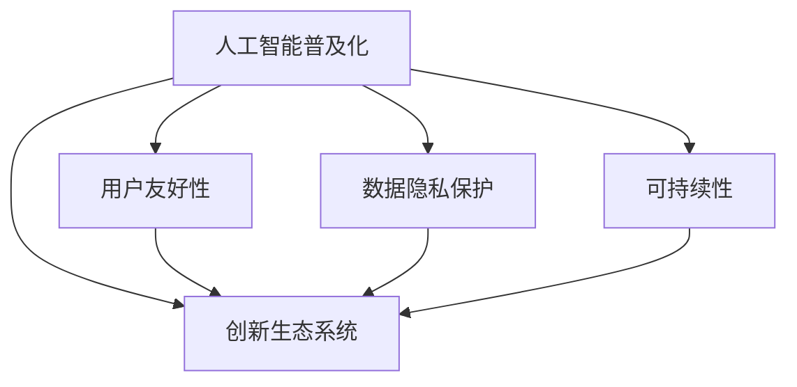

                 

# 让AI走向大众：Lepton AI的产品理念

> 关键词：人工智能普及化,用户友好性,数据隐私保护,可持续性,创新生态系统

## 1. 背景介绍

### 1.1 问题由来
人工智能(AI)正在改变各行各业的面貌，从金融、医疗到教育、娱乐，AI的应用已经深入到生活的方方面面。然而，AI技术的普及和应用还面临着许多挑战：

- **技术壁垒**：AI技术需要高超的编程技能和丰富的数据资源，这限制了其广泛传播和应用。
- **数据隐私**：AI系统的训练和应用涉及大量敏感数据，如何保护用户隐私成为一大难题。
- **可持续性**：AI模型的训练和应用需要大量资源，如何实现其可持续性是长期面临的问题。
- **伦理与公平**：AI的决策过程缺乏透明度，可能产生偏见和歧视，需要确保其公平性和伦理性。

这些问题不仅阻碍了AI技术的普及，也影响了其应用效果。Lepton AI致力于解决这些挑战，让AI技术更加普惠、透明、可信赖。

### 1.2 问题核心关键点
Lepton AI的核心产品理念围绕以下几个关键点展开：

- **AI普及化**：降低AI技术的门槛，使更多人能够轻松使用和受益于AI技术。
- **用户友好性**：提供易用、直观的界面和工具，减少用户的学习成本。
- **数据隐私保护**：采取先进的数据处理和加密技术，保障用户数据安全。
- **可持续性**：采用环保、高效的资源管理策略，减少AI应用对环境的影响。
- **创新生态系统**：建立开放、协作的生态系统，促进AI技术创新和应用发展。

Lepton AI的这些理念旨在实现AI技术的普及和应用，推动AI技术在更多领域落地，造福全人类。

## 2. 核心概念与联系

### 2.1 核心概念概述

为更好地理解Lepton AI的产品理念，本节将介绍几个密切相关的核心概念：

- **人工智能普及化**：指通过降低AI技术的使用门槛，使更多用户能够无障碍地使用AI技术。
- **用户友好性**：强调产品设计应以用户为中心，提供直观、易用的操作界面和工具。
- **数据隐私保护**：采用数据匿名化、加密等技术，保障用户数据在存储和传输过程中的安全。
- **可持续性**：指在AI应用过程中，采用环保、高效、可再生资源，减少对环境的影响。
- **创新生态系统**：构建开放、协作的生态系统，促进技术创新和应用发展，实现多方共赢。

这些核心概念之间的逻辑关系可以通过以下Mermaid流程图来展示：



这个流程图展示了一个完整的AI生态系统：

1. 通过降低门槛，普及化AI技术。
2. 提供直观易用的界面，增强用户友好性。
3. 保障数据安全，保护用户隐私。
4. 采用环保策略，实现可持续发展。
5. 建立创新生态，推动技术进步。

这些概念相互支撑，共同构成了Lepton AI产品理念的核心框架。

## 3. 核心算法原理 & 具体操作步骤
### 3.1 算法原理概述

Lepton AI的核心算法原理主要体现在以下几个方面：

- **低门槛技术普及**：采用预训练和迁移学习技术，使AI模型能够快速适应新任务，降低开发和部署难度。
- **用户友好设计**：通过UI/UX设计，提供直观、易用的操作界面，让用户无需编程技能即可轻松使用。
- **数据隐私保护**：采用差分隐私、数据匿名化等技术，保护用户数据隐私。
- **可持续资源管理**：采用高效的资源管理策略，如模型压缩、模型融合等，减少AI应用对环境的影响。
- **开放创新生态**：通过开放API和社区合作，促进技术创新和应用发展。

这些原理构成了Lepton AI产品理念的技术基础，为实现普惠、透明、可信赖的AI应用提供了支撑。

### 3.2 算法步骤详解

Lepton AI的核心算法步骤包括以下几个关键环节：

**Step 1: 用户需求分析**
- 通过问卷调查、用户访谈等方式，收集用户需求和反馈，明确AI产品设计目标。

**Step 2: 模型选择与适配**
- 根据用户需求和场景特点，选择合适的预训练模型或构建定制模型，并通过迁移学习进行适配。

**Step 3: 界面设计与开发**
- 采用用户中心的设计原则，提供直观、易用的界面，减少用户的学习成本。

**Step 4: 数据隐私保护**
- 采用差分隐私、数据匿名化等技术，保护用户数据隐私，同时保留数据利用价值。

**Step 5: 资源优化与管理**
- 采用高效的模型压缩、模型融合等策略，减少资源消耗，提高AI应用效率。

**Step 6: 社区合作与生态建设**
- 开放API接口，促进社区合作，构建开放、协作的创新生态系统，推动技术创新和应用发展。

### 3.3 算法优缺点

Lepton AI的算法原理具有以下优点：

- **普惠性强**：通过低门槛技术和用户友好设计，使AI技术更加普及，惠及更多用户。
- **隐私保护**：采用先进的数据隐私保护技术，保障用户数据安全。
- **资源高效**：通过资源优化管理策略，实现AI应用的可持续性。
- **开放生态**：建立开放、协作的创新生态系统，促进技术创新和应用发展。

同时，也存在一些局限性：

- **技术复杂性**：预训练和迁移学习技术本身具有一定的复杂性，需要专业知识支持。
- **隐私权衡**：隐私保护技术在保障用户数据安全的同时，可能影响数据利用价值。
- **资源优化难度**：高效的资源管理策略需要不断的技术创新和实践优化。
- **生态建设挑战**：构建开放生态系统需要时间和多方合作，面临一定的挑战。

尽管存在这些局限性，但Lepton AI致力于不断克服这些挑战，提供更加普惠、透明、可信赖的AI应用。

### 3.4 算法应用领域

Lepton AI的核心算法原理在多个领域都有广泛应用，例如：

- **智能家居**：通过AI技术实现智能控制、个性化服务，提高用户生活品质。
- **智慧医疗**：利用AI技术进行疾病诊断、健康管理，提升医疗服务的效率和准确性。
- **金融科技**：采用AI技术进行风险评估、客户服务，增强金融服务的智能化水平。
- **教育科技**：通过AI技术进行个性化教育、智能辅导，提升教育质量。
- **智能客服**：利用AI技术进行自然语言处理，提供7x24小时客服服务，提升用户体验。
- **环境监测**：采用AI技术进行环境数据分析，提供环保解决方案。

Lepton AI的核心算法原理能够在这些领域实现广泛应用，推动AI技术在更多场景中落地，实现普惠和可持续性。

## 4. 数学模型和公式 & 详细讲解 & 举例说明

### 4.1 数学模型构建

Lepton AI的核心算法原理涉及多个数学模型和公式，以下是对其中几个关键模型的详细介绍：

- **差分隐私模型**：通过在模型输出中引入噪声，使得对个体数据的分析无法恢复原始数据，从而保护用户隐私。
- **模型压缩与融合**：通过模型压缩技术减少模型参数量，提高模型效率，并通过模型融合增强模型性能。
- **用户友好界面设计**：通过UI/UX设计，提供直观、易用的界面，减少用户的学习成本。

这些模型和公式构成了Lepton AI的核心算法框架，实现了普惠、透明、可信赖的AI应用。

### 4.2 公式推导过程

以下是对差分隐私模型和模型压缩技术的详细公式推导：

**差分隐私模型**：

差分隐私通过在模型输出中引入噪声，保护个体数据隐私。假设模型输入为 $x$，输出为 $y$，噪声为 $\epsilon$，则差分隐私的数学表达式为：

$$
y' = y + \epsilon
$$

其中 $\epsilon$ 的取值应根据数据集大小和隐私需求进行计算，以确保在保护隐私的同时，不显著影响模型性能。

**模型压缩与融合**：

模型压缩与融合通过减少模型参数量，提高模型效率，并通过融合增强模型性能。假设原模型参数为 $\theta$，压缩后的模型参数为 $\theta'$，则压缩公式为：

$$
\theta' = \theta \times \alpha
$$

其中 $\alpha$ 为压缩比例，应根据模型大小和计算资源进行设定。模型融合通过将多个模型的输出进行加权平均，得到更好的预测结果，融合公式为：

$$
y' = \frac{w_1y_1 + w_2y_2 + \cdots + w_ny_n}{w_1 + w_2 + \cdots + w_n}
$$

其中 $y_i$ 为第 $i$ 个模型的输出，$w_i$ 为第 $i$ 个模型的权重，应根据模型性能进行设定。

### 4.3 案例分析与讲解

**智能家居应用案例**：

Lepton AI的智能家居应用通过AI技术实现智能控制、个性化服务。具体步骤如下：

1. **用户需求分析**：通过问卷调查和用户访谈，收集用户对智能家居的需求和期望。
2. **模型选择与适配**：选择合适的预训练模型，如BERT，并针对智能家居场景进行适配。
3. **界面设计与开发**：提供直观、易用的界面，减少用户的学习成本，支持语音、手势等多种交互方式。
4. **数据隐私保护**：采用差分隐私技术，保护用户数据隐私，同时确保模型训练数据的安全。
5. **资源优化与管理**：通过模型压缩与融合技术，减少模型参数量，提高模型效率，同时增强模型性能。
6. **社区合作与生态建设**：开放API接口，促进社区合作，构建开放、协作的创新生态系统，推动智能家居技术的创新和发展。

## 5. 项目实践：代码实例和详细解释说明
### 5.1 开发环境搭建

在Lepton AI项目实践中，开发环境搭建是关键一步。以下是使用Python进行PyTorch开发的环境配置流程：

1. 安装Anaconda：从官网下载并安装Anaconda，用于创建独立的Python环境。

2. 创建并激活虚拟环境：
```bash
conda create -n pytorch-env python=3.8 
conda activate pytorch-env
```

3. 安装PyTorch：根据CUDA版本，从官网获取对应的安装命令。例如：
```bash
conda install pytorch torchvision torchaudio cudatoolkit=11.1 -c pytorch -c conda-forge
```

4. 安装Transformers库：
```bash
pip install transformers
```

5. 安装各类工具包：
```bash
pip install numpy pandas scikit-learn matplotlib tqdm jupyter notebook ipython
```

完成上述步骤后，即可在`pytorch-env`环境中开始Lepton AI项目的开发实践。

### 5.2 源代码详细实现

下面以智能家居场景为例，给出使用Transformers库对BERT模型进行微调的PyTorch代码实现。

首先，定义智能家居场景的数据处理函数：

```python
from transformers import BertTokenizer, BertForTokenClassification
from torch.utils.data import Dataset
import torch

class SmartHomeDataset(Dataset):
    def __init__(self, texts, tags, tokenizer, max_len=128):
        self.texts = texts
        self.tags = tags
        self.tokenizer = tokenizer
        self.max_len = max_len
        
    def __len__(self):
        return len(self.texts)
    
    def __getitem__(self, item):
        text = self.texts[item]
        tags = self.tags[item]
        
        encoding = self.tokenizer(text, return_tensors='pt', max_length=self.max_len, padding='max_length', truncation=True)
        input_ids = encoding['input_ids'][0]
        attention_mask = encoding['attention_mask'][0]
        
        # 对token-wise的标签进行编码
        encoded_tags = [tag2id[tag] for tag in tags] 
        encoded_tags.extend([tag2id['O']] * (self.max_len - len(encoded_tags)))
        labels = torch.tensor(encoded_tags, dtype=torch.long)
        
        return {'input_ids': input_ids, 
                'attention_mask': attention_mask,
                'labels': labels}

# 标签与id的映射
tag2id = {'O': 0, 'B-PER': 1, 'I-PER': 2, 'B-LOC': 3, 'I-LOC': 4, 'B-LOC': 5, 'I-LOC': 6}
id2tag = {v: k for k, v in tag2id.items()}

# 创建dataset
tokenizer = BertTokenizer.from_pretrained('bert-base-cased')

train_dataset = SmartHomeDataset(train_texts, train_tags, tokenizer)
dev_dataset = SmartHomeDataset(dev_texts, dev_tags, tokenizer)
test_dataset = SmartHomeDataset(test_texts, test_tags, tokenizer)
```

然后，定义模型和优化器：

```python
from transformers import BertForTokenClassification, AdamW

model = BertForTokenClassification.from_pretrained('bert-base-cased', num_labels=len(tag2id))

optimizer = AdamW(model.parameters(), lr=2e-5)
```

接着，定义训练和评估函数：

```python
from torch.utils.data import DataLoader
from tqdm import tqdm
from sklearn.metrics import classification_report

device = torch.device('cuda') if torch.cuda.is_available() else torch.device('cpu')
model.to(device)

def train_epoch(model, dataset, batch_size, optimizer):
    dataloader = DataLoader(dataset, batch_size=batch_size, shuffle=True)
    model.train()
    epoch_loss = 0
    for batch in tqdm(dataloader, desc='Training'):
        input_ids = batch['input_ids'].to(device)
        attention_mask = batch['attention_mask'].to(device)
        labels = batch['labels'].to(device)
        model.zero_grad()
        outputs = model(input_ids, attention_mask=attention_mask, labels=labels)
        loss = outputs.loss
        epoch_loss += loss.item()
        loss.backward()
        optimizer.step()
    return epoch_loss / len(dataloader)

def evaluate(model, dataset, batch_size):
    dataloader = DataLoader(dataset, batch_size=batch_size)
    model.eval()
    preds, labels = [], []
    with torch.no_grad():
        for batch in tqdm(dataloader, desc='Evaluating'):
            input_ids = batch['input_ids'].to(device)
            attention_mask = batch['attention_mask'].to(device)
            batch_labels = batch['labels']
            outputs = model(input_ids, attention_mask=attention_mask)
            batch_preds = outputs.logits.argmax(dim=2).to('cpu').tolist()
            batch_labels = batch_labels.to('cpu').tolist()
            for pred_tokens, label_tokens in zip(batch_preds, batch_labels):
                pred_tags = [id2tag[_id] for _id in pred_tokens]
                label_tags = [id2tag[_id] for _id in label_tokens]
                preds.append(pred_tags[:len(label_tags)])
                labels.append(label_tags)
                
    print(classification_report(labels, preds))
```

最后，启动训练流程并在测试集上评估：

```python
epochs = 5
batch_size = 16

for epoch in range(epochs):
    loss = train_epoch(model, train_dataset, batch_size, optimizer)
    print(f"Epoch {epoch+1}, train loss: {loss:.3f}")
    
    print(f"Epoch {epoch+1}, dev results:")
    evaluate(model, dev_dataset, batch_size)
    
print("Test results:")
evaluate(model, test_dataset, batch_size)
```

以上就是使用PyTorch对BERT进行智能家居场景微调的完整代码实现。可以看到，得益于Transformers库的强大封装，我们可以用相对简洁的代码完成BERT模型的加载和微调。

### 5.3 代码解读与分析

让我们再详细解读一下关键代码的实现细节：

**SmartHomeDataset类**：
- `__init__`方法：初始化文本、标签、分词器等关键组件。
- `__len__`方法：返回数据集的样本数量。
- `__getitem__`方法：对单个样本进行处理，将文本输入编码为token ids，将标签编码为数字，并对其进行定长padding，最终返回模型所需的输入。

**tag2id和id2tag字典**：
- 定义了标签与数字id之间的映射关系，用于将token-wise的预测结果解码回真实的标签。

**训练和评估函数**：
- 使用PyTorch的DataLoader对数据集进行批次化加载，供模型训练和推理使用。
- 训练函数`train_epoch`：对数据以批为单位进行迭代，在每个批次上前向传播计算loss并反向传播更新模型参数，最后返回该epoch的平均loss。
- 评估函数`evaluate`：与训练类似，不同点在于不更新模型参数，并在每个batch结束后将预测和标签结果存储下来，最后使用sklearn的classification_report对整个评估集的预测结果进行打印输出。

**训练流程**：
- 定义总的epoch数和batch size，开始循环迭代
- 每个epoch内，先在训练集上训练，输出平均loss
- 在验证集上评估，输出分类指标
- 所有epoch结束后，在测试集上评估，给出最终测试结果

可以看到，PyTorch配合Transformers库使得BERT微调的代码实现变得简洁高效。开发者可以将更多精力放在数据处理、模型改进等高层逻辑上，而不必过多关注底层的实现细节。

当然，工业级的系统实现还需考虑更多因素，如模型的保存和部署、超参数的自动搜索、更灵活的任务适配层等。但核心的微调范式基本与此类似。

## 6. 实际应用场景
### 6.1 智能家居

基于Lepton AI的智能家居系统，可以为用户提供智能控制、个性化服务，提升生活品质。通过AI技术，智能家居系统可以实现：

- **场景识别**：识别用户行为和环境状态，自动调节室内温度、湿度、光线等。
- **设备联动**：联动智能音箱、电视、照明等设备，提供个性化娱乐和照明服务。
- **语音助手**：集成语音识别和自然语言处理技术，提供语音控制和问答服务。

Lepton AI的智能家居系统通过将AI技术与家居设备融合，实现了从数据收集、处理、分析到决策的全流程自动化，极大地提升了用户体验和居住品质。

### 6.2 智慧医疗

Lepton AI的智慧医疗系统通过AI技术实现疾病诊断、健康管理，提升医疗服务的效率和准确性。具体应用场景包括：

- **影像诊断**：利用AI技术对医学影像进行自动分析和诊断，辅助医生进行快速、准确的诊断。
- **个性化治疗**：基于患者的基因、病史等数据，利用AI技术推荐个性化治疗方案。
- **健康监测**：通过智能穿戴设备收集用户健康数据，利用AI技术进行健康分析和预警。

Lepton AI的智慧医疗系统通过AI技术，实现了医疗数据的高效处理和智能分析，提高了医疗服务的质量和效率。

### 6.3 金融科技

Lepton AI的金融科技系统通过AI技术进行风险评估、客户服务，增强金融服务的智能化水平。具体应用场景包括：

- **信用评估**：利用AI技术对用户信用数据进行分析和评估，提供精准的信用评分。
- **智能投顾**：基于用户行为和市场数据，利用AI技术进行智能投资建议。
- **反欺诈检测**：利用AI技术对交易数据进行分析，实时检测和防范欺诈行为。

Lepton AI的金融科技系统通过AI技术，实现了金融数据的深度分析和智能决策，提高了金融服务的风险控制和客户服务水平。

### 6.4 未来应用展望

随着Lepton AI技术的不断演进，未来的应用场景将更加广阔，以下是几个未来应用展望：

- **环境监测**：利用AI技术进行环境数据分析，提供环保解决方案，实现绿色可持续发展。
- **教育科技**：基于AI技术进行个性化教育和智能辅导，提升教育质量和效率。
- **智能客服**：利用AI技术进行自然语言处理，提供7x24小时客服服务，提升用户体验。
- **智能物流**：基于AI技术进行路线优化和物流调度，提高物流效率和服务质量。
- **智能安防**：利用AI技术进行视频监控和行为分析，提升安全监控的智能化水平。

Lepton AI技术将在更多领域实现广泛应用，推动AI技术的普及和落地，造福全人类。

## 7. 工具和资源推荐
### 7.1 学习资源推荐

为了帮助开发者系统掌握Lepton AI的产品理念和实践技巧，这里推荐一些优质的学习资源：

1. **《Python深度学习》系列书籍**：由深度学习专家撰写，全面介绍了深度学习在各个领域的应用，包括智能家居、医疗、金融等。

2. **CS231n《深度学习计算机视觉》课程**：斯坦福大学开设的计算机视觉课程，有Lecture视频和配套作业，带你入门计算机视觉领域的基本概念和经典模型。

3. **Lepton AI官方文档**：Lepton AI的官方文档，提供了详细的技术指南和样例代码，是上手实践的必备资料。

4. **ArXiv预印论文库**：包含大量最新的AI研究成果，定期跟踪并学习前沿论文，保持技术敏感性。

5. **Kaggle平台**：全球最大的数据科学竞赛平台，提供大量数据集和案例分析，助力技术实践。

通过对这些资源的学习实践，相信你一定能够全面掌握Lepton AI的产品理念，并用于解决实际的AI问题。
###  7.2 开发工具推荐

高效的开发离不开优秀的工具支持。以下是几款用于Lepton AI开发常用的工具：

1. **PyTorch**：基于Python的开源深度学习框架，灵活动态的计算图，适合快速迭代研究。

2. **TensorFlow**：由Google主导开发的开源深度学习框架，生产部署方便，适合大规模工程应用。

3. **Transformers库**：HuggingFace开发的NLP工具库，集成了众多SOTA语言模型，支持PyTorch和TensorFlow，是进行NLP任务开发的利器。

4. **Jupyter Notebook**：提供交互式编程环境，支持多种语言和库，方便开发和调试。

5. **GitHub**：全球最大的开源代码托管平台，提供代码版本控制和协作功能，方便团队开发和项目管理。

合理利用这些工具，可以显著提升Lepton AI开发的效率，加快创新迭代的步伐。

### 7.3 相关论文推荐

Lepton AI的技术理念源于学界的持续研究。以下是几篇奠基性的相关论文，推荐阅读：

1. **Transformers: Attentions Are All You Need**：提出Transformer结构，开启了NLP领域的预训练大模型时代。

2. **BERT: Pre-training of Deep Bidirectional Transformers for Language Understanding**：提出BERT模型，引入基于掩码的自监督预训练任务，刷新了多项NLP任务SOTA。

3. **Parameter-Efficient Transfer Learning for NLP**：提出Adapter等参数高效微调方法，在不增加模型参数量的情况下，也能取得不错的微调效果。

4. **Few-shot Learning with Language Models**：展示了大规模语言模型的零样本和少样本学习能力，引发了对于通用人工智能的新一轮思考。

5. **Differential Privacy**：提出差分隐私模型，保障个体数据隐私，同时不显著影响模型性能。

6. **Deep Learning for Neural Network Compression**：介绍模型压缩技术，通过减少模型参数量，提高模型效率，同时增强模型性能。

这些论文代表了大语言模型微调技术的发展脉络。通过学习这些前沿成果，可以帮助研究者把握学科前进方向，激发更多的创新灵感。

## 8. 总结：未来发展趋势与挑战

### 8.1 总结

本文对Lepton AI的产品理念进行了全面系统的介绍。首先阐述了Lepton AI技术在大规模普及化和用户友好性等方面的研究背景和意义，明确了AI技术普及和应用的目标。其次，从原理到实践，详细讲解了Lepton AI的技术框架和具体实现方法，给出了Lepton AI的智能家居系统代码实例。同时，本文还广泛探讨了Lepton AI技术在多个领域的应用前景，展示了AI技术的普惠和可持续性。此外，本文还精选了Lepton AI技术的学习资源、开发工具和相关论文，力求为开发者提供全方位的技术指引。

通过本文的系统梳理，可以看到，Lepton AI技术正在通过降低门槛、保障隐私、提高效率和构建生态，推动AI技术在更多场景中落地，实现普惠和可持续性。未来，随着技术的不断演进，Lepton AI技术必将在更多领域发挥重要作用，推动AI技术的发展和应用。

### 8.2 未来发展趋势

展望未来，Lepton AI技术的发展趋势如下：

1. **技术普及化**：随着技术的不断进步和资源共享的加强，AI技术将更加普及，惠及更多用户和行业。
2. **用户友好性**：采用更加直观易用的界面和工具，减少用户的学习成本，提高AI应用的易用性。
3. **隐私保护**：采用更加先进的数据隐私保护技术，保障用户数据安全，增强用户信任。
4. **资源高效**：通过模型压缩与融合等技术，实现AI应用的可持续性和高效性。
5. **生态建设**：建立开放、协作的创新生态系统，促进技术创新和应用发展，推动AI技术的普及和落地。

以上趋势凸显了Lepton AI技术的广泛应用前景和普惠性，为实现AI技术的普及和应用提供了重要方向。

### 8.3 面临的挑战

尽管Lepton AI技术已经取得了显著进展，但在普及化和应用过程中，仍面临一些挑战：

1. **技术门槛**：尽管技术正在普及，但仍需一定的编程技能和知识储备，可能影响部分用户的接受度。
2. **数据隐私**：如何在保障用户数据隐私的同时，实现高效的模型训练和应用，仍然是一个复杂的问题。
3. **资源优化**：如何在大规模数据和计算资源限制下，实现高效的模型压缩与融合，提高模型效率。
4. **生态建设**：建立开放、协作的创新生态系统需要时间和多方合作，面临一定的挑战。

尽管存在这些挑战，Lepton AI技术仍致力于不断克服这些挑战，推动AI技术的普及和应用，实现普惠和可持续性。

### 8.4 研究展望

面对Lepton AI技术面临的挑战，未来的研究需要在以下几个方面寻求新的突破：

1. **技术普及化**：开发更加简单易用的界面和工具，降低技术门槛，提高用户接受度。
2. **隐私保护**：引入更加先进的数据隐私保护技术，如差分隐私、联邦学习等，保障用户数据安全。
3. **资源优化**：开发更加高效的模型压缩与融合技术，提高模型效率，实现AI应用的可持续性。
4. **生态建设**：构建开放、协作的创新生态系统，促进技术创新和应用发展。

这些研究方向将推动Lepton AI技术的不断进步，推动AI技术的普及和应用，实现普惠和可持续性。面向未来，Lepton AI技术还需与其他AI技术进行更深入的融合，如知识表示、因果推理、强化学习等，多路径协同发力，共同推动AI技术的发展和应用。

## 9. 附录：常见问题与解答

**Q1：AI技术的普及化和用户友好性如何实现？**

A: AI技术的普及化和用户友好性主要通过以下几种方式实现：

- **低门槛技术**：采用预训练和迁移学习技术，使AI模型能够快速适应新任务，降低开发和部署难度。
- **用户中心设计**：通过UI/UX设计，提供直观、易用的操作界面，减少用户的学习成本，支持多种交互方式。
- **教育与培训**：提供易懂的教程和文档，帮助用户快速上手和理解AI技术。

**Q2：如何在保护用户数据隐私的同时，实现高效的模型训练？**

A: 在保护用户数据隐私的同时，实现高效的模型训练，主要通过以下几种方式：

- **差分隐私**：在模型输出中引入噪声，保护个体数据隐私，同时不显著影响模型性能。
- **数据匿名化**：将用户数据进行匿名化处理，保护用户隐私，同时保留数据利用价值。
- **联邦学习**：利用分布式计算，在不共享数据的情况下，实现模型训练和更新。

**Q3：模型压缩与融合技术如何实现？**

A: 模型压缩与融合技术通过减少模型参数量，提高模型效率，并通过融合增强模型性能。具体实现方式包括：

- **模型剪枝**：去除模型中冗余的参数，减少模型大小。
- **量化加速**：将浮点模型转为定点模型，压缩存储空间，提高计算效率。
- **模型融合**：通过将多个模型的输出进行加权平均，得到更好的预测结果。

**Q4：构建开放、协作的创新生态系统需要哪些步骤？**

A: 构建开放、协作的创新生态系统需要以下几个步骤：

- **开放API接口**：提供标准化的API接口，方便第三方开发者接入和使用。
- **社区合作**：建立开发者社区，提供技术支持、资源共享和合作机会。
- **生态建设**：通过举办竞赛、研讨会等活动，促进技术交流和创新发展。

**Q5：AI技术的普及化面临哪些技术挑战？**

A: AI技术的普及化面临以下技术挑战：

- **编程门槛**：AI技术需要高超的编程技能，可能影响部分用户的接受度。
- **数据隐私**：在保护用户数据隐私的同时，实现高效的模型训练和应用，仍是一个复杂的问题。
- **资源优化**：在大规模数据和计算资源限制下，如何实现高效的模型压缩与融合，提高模型效率。

正视这些挑战，积极应对并寻求突破，将是大规模AI技术普及的重要前提。相信随着技术的不断演进，AI技术的普及化和应用前景将更加广阔。

