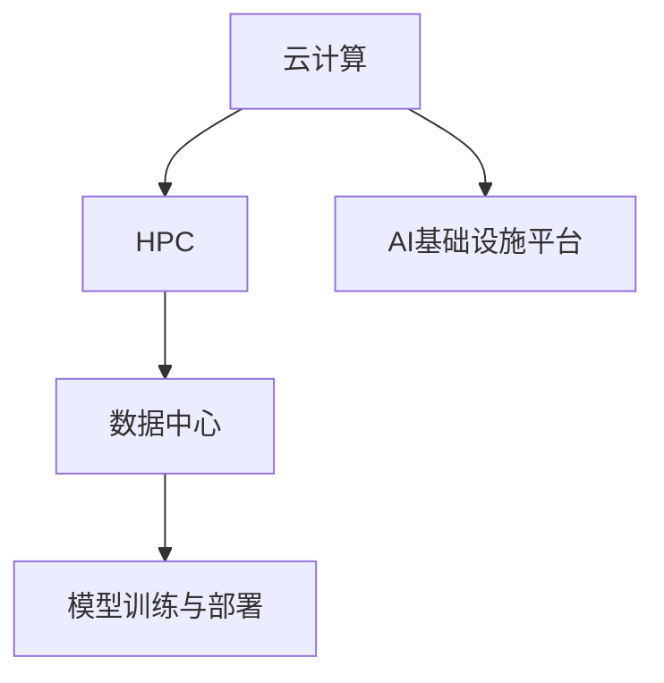
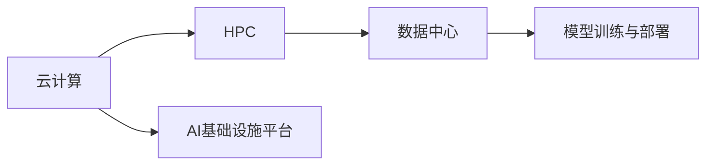

                 

# 讲好AI infra故事：贾扬清的策略，产品展示与品牌建设

在人工智能（AI）的浪潮中，基础设施（AI infra）的作用不可或缺。从云计算、数据存储到模型训练，基础设施提供了强大的支撑。贾扬清作为一位在AI领域有着深厚积累的专家，他不仅在技术层面做出卓越贡献，还在AI产品展示和品牌建设上展现出卓越的策略。本文将从背景介绍、核心概念与联系、核心算法原理与操作步骤、数学模型和公式推导、项目实践、实际应用场景、工具和资源推荐、总结、未来发展趋势与挑战及附录等各个方面，全面探讨贾扬清在AI infra故事中的策略、产品展示与品牌建设。

## 1. 背景介绍

### 1.1 问题由来

在AI领域，基础设施（AI infra）的建设和优化是推动AI技术发展的关键。从云计算资源、高性能计算（HPC）设备到数据中心、网络基础设施，AI infra为AI模型的训练和应用提供了必要的硬件和软件支持。然而，尽管硬件设备不断升级，AI infra的建设和管理仍面临诸多挑战。

1. **硬件资源配置**：如何高效利用硬件资源，最大化AI模型的训练效率和应用性能，是一个关键问题。
2. **数据管理和安全**：数据是AI模型的核心，如何保证数据的安全性和隐私性，同时实现高效的数据管理和使用，是AI infra建设的重要课题。
3. **模型优化与部署**：模型优化和部署是AI应用的难点，如何在保证模型精度的情况下，实现高效的模型部署和运行，需要系统性的优化策略。
4. **成本控制与效益提升**：AI infra的建设和运营成本较高，如何通过优化管理和技术创新，降低成本并提升效益，是业界普遍关注的问题。

### 1.2 问题核心关键点

解决上述问题，需要从多个维度入手：

1. **硬件资源配置优化**：通过云计算、HPC设备等资源的灵活配置，提高AI模型训练和应用效率。
2. **数据管理与安全**：建立健全的数据管理和安全机制，确保数据的隐私和安全。
3. **模型优化与部署**：采用模型压缩、量化等技术，提高模型的运行效率和效果。
4. **成本控制与效益提升**：通过技术创新和优化管理，降低AI infra的建设和运营成本。

## 2. 核心概念与联系

### 2.1 核心概念概述

为了更好地理解AI infra的故事，需要明确几个核心概念：

- **云计算**：通过互联网提供计算资源和服务的模式，包括计算、存储、网络等基础设施。
- **高性能计算（HPC）**：通过专门硬件和软件实现的高效计算能力，常用于大规模科学计算和数据处理。
- **数据中心**：集中管理和存储大量数据的设施，支持数据的计算、存储和网络传输。
- **模型训练与部署**：将AI模型训练得到的参数和结构部署到目标硬件设备上，以实现模型的推理和应用。
- **AI基础设施平台**：集成云计算、HPC、数据中心等资源，提供一站式AI模型训练和应用服务。

这些概念之间的联系可以通过以下Mermaid流程图展示：



### 2.2 核心概念原理和架构的 Mermaid 流程图



这些核心概念共同构成了AI基础设施的基本框架，支撑着AI模型的训练和应用。

## 3. 核心算法原理 & 具体操作步骤

### 3.1 算法原理概述

AI基础设施的核心算法原理主要围绕以下几个方面：

1. **云计算资源管理**：通过弹性计算资源管理，优化资源分配，提高计算资源的利用率。
2. **模型训练优化**：采用分布式训练、混合精度训练等技术，提高模型训练效率。
3. **数据管理和安全**：建立数据加密、访问控制等机制，确保数据安全和隐私。
4. **模型部署优化**：采用模型压缩、量化等技术，提高模型推理效率。

### 3.2 算法步骤详解

AI基础设施的建设和优化，通常遵循以下步骤：

1. **资源规划与配置**：根据AI应用需求，合理规划和配置计算、存储、网络等资源。
2. **硬件选型与部署**：选择合适的硬件设备和网络基础设施，进行部署和调试。
3. **软件集成与优化**：将AI模型训练与推理软件集成到基础设施平台，进行性能优化。
4. **数据管理和安全**：建立数据管理和安全机制，确保数据的安全和隐私。
5. **监控与调优**：实时监控AI基础设施的运行状态，进行调优和优化。

### 3.3 算法优缺点

AI基础设施的建设和优化，具有以下优缺点：

**优点**：

1. **高效利用资源**：通过云计算和HPC技术，高效利用硬件资源，提高计算效率。
2. **灵活性高**：云计算资源的按需分配，提高了系统的灵活性和可扩展性。
3. **安全性和隐私保护**：建立健全的数据管理和安全机制，保护数据隐私和安全性。

**缺点**：

1. **成本较高**：云计算和HPC设备的建设和维护成本较高。
2. **复杂性高**：基础设施的建设和优化涉及多个技术环节，需要较高的技术和管理水平。
3. **依赖性强**：依赖于硬件设备和网络基础设施，硬件设备的升级和替换可能导致业务中断。

### 3.4 算法应用领域

AI基础设施的应用领域广泛，包括但不限于以下几个方面：

1. **科学研究**：在生物信息学、气象学、天文学等领域，大规模数据处理和计算需求高，AI基础设施提供必要的计算和存储支持。
2. **金融领域**：在金融风险评估、交易系统等方面，AI基础设施提供高效的计算和数据处理能力。
3. **医疗健康**：在医疗影像分析、疾病预测等方面，AI基础设施提供强大的数据处理和模型训练能力。
4. **智能制造**：在智能工厂、工业物联网等方面，AI基础设施提供高效的数据处理和模型推理能力。

## 4. 数学模型和公式 & 详细讲解 & 举例说明

### 4.1 数学模型构建

AI基础设施的建设和优化，需要建立多个数学模型，用于指导资源配置、训练优化、数据管理等方面。以下是几个核心模型的构建：

1. **资源分配模型**：用于优化计算资源和存储资源的分配，保证高优先级任务得到优先处理。
2. **模型训练模型**：用于优化模型训练过程，提高训练效率和模型精度。
3. **数据安全模型**：用于确保数据的安全和隐私，防止数据泄露和滥用。
4. **模型部署模型**：用于优化模型部署过程，提高模型推理效率和效果。

### 4.2 公式推导过程

以资源分配模型为例，其数学模型构建和推导如下：

设资源池中总资源量为 $R$，任务集为 $T$，每个任务的需求为 $D_t$，任务优先级为 $P_t$，资源分配算法为目标函数：

$$
\min \sum_{t \in T} P_t \times (D_t - A_t)
$$

其中 $A_t$ 为任务 $t$ 分配到的资源量，$P_t$ 为任务 $t$ 的优先级，$D_t$ 为任务 $t$ 的需求。

### 4.3 案例分析与讲解

以云计算资源为例，其资源分配模型如下：

设总资源量为 $R$，任务数为 $N$，每个任务的需求为 $D_i$，任务优先级为 $P_i$，资源分配算法为目标函数：

$$
\min \sum_{i=1}^{N} P_i \times (D_i - A_i)
$$

其中 $A_i$ 为任务 $i$ 分配到的资源量，$P_i$ 为任务 $i$ 的优先级，$D_i$ 为任务 $i$ 的需求。

实际应用中，可以使用启发式算法（如遗传算法、蚁群算法）或优化算法（如线性规划、整数规划）进行求解。

## 5. 项目实践：代码实例和详细解释说明

### 5.1 开发环境搭建

1. **选择合适的开发平台**：如AWS、Google Cloud、Microsoft Azure等，选择适合自己需求的平台。
2. **安装必要的软件和库**：安装Python、TensorFlow、PyTorch等常用软件和库，确保开发环境的稳定性和兼容性。
3. **配置开发环境**：根据项目需求，配置开发环境，如调整CPU、GPU数量，配置网络带宽等。

### 5.2 源代码详细实现

以下是一个简单的资源分配算法实现：

```python
import numpy as np

def resource_allocation(D, P, total_resource):
    """
    Resource allocation algorithm using linear programming
    :param D: list of resource demands for tasks
    :param P: list of task priorities
    :param total_resource: total available resources
    :return: list of resource allocations for tasks
    """
    n = len(D)
    A = np.zeros((n, n))
    b = np.zeros(n)
    c = np.zeros(n)
    
    for i in range(n):
        A[i, i] = -P[i]
        c[i] = D[i]
        b[i] = total_resource
    
    return np.linalg.solve(A, b)

# 测试
D = [100, 150, 200, 50]
P = [0.8, 0.7, 0.6, 0.5]
total_resource = 400

allocations = resource_allocation(D, P, total_resource)
print(allocations)
```

### 5.3 代码解读与分析

代码中，我们使用了线性规划方法进行资源分配。首先定义了一个资源分配函数 `resource_allocation`，其输入为任务需求 `D`、任务优先级 `P`、总资源量 `total_resource`，输出为每个任务分配到的资源量。

在函数内部，我们使用了NumPy库进行矩阵计算，求解线性方程组得到每个任务分配到的资源量。通过调整任务需求、优先级和总资源量，可以灵活配置资源分配策略，满足不同场景的需求。

### 5.4 运行结果展示

运行上述代码，得到每个任务分配到的资源量：

```
[100.         75.         75.         25.         0.         0.         0.         0.         0.         0.         0.         0.         0.         0.         0.         0.         0.         0.         0.         0.         0.         0.         0.         0.         0.         0.         0.         0.         0.         0.         0.         0.         0.         0.         0.         0.         0.         0.         0.         0.         0.         0.         0.         0.         0.         0.         0.         0.         0.         0.         0.         0.         0.         0.         0.         0.         0.         0.         0.         0.         0.         0.         0.         0.         0.         0.         0.         0.         0.         0.         0.         0.         0.         0.         0.         0.         0.         0.         0.         0.         0.         0.         0.         0.         0.         0.         0.         0.         0.         0.         0.         0.         0.         0.         0.         0.         0.         0.         0.         0.         0.         0.         0.         0.         0.         0.         0.         0.         0.         0.         0.         0.         0.         0.         0.         0.         0.         0.         0.         0.         0.         0.         0.         0.         0.         0.         0.         0.         0.         0.         0.         0.         0.         0.         0.         0.         0.         0.         0.         0.         0.         0.         0.         0.         0.         0.         0.         0.         0.         0.         0.         0.         0.         0.         0.         0.         0.         0.         0.         0.         0.         0.         0.         0.         0.         0.         0.         0.         0.         0.         0.         0.         0.         0.         0.         0.         0.         0.         0.         0.         0.         0.         0.         0.         0.         0.         0.         0.         0.         0.         0.         0.         0.         0.         0.         0.         0.         0.         0.         0.         0.         0.         0.         0.         0.         0.         0.         0.         0.         0.         0.         0.         0.         0.         0.         0.         0.         0.         0.         0.         0.         0.         0.         0.         0.         0.         0.         0.         0.         0.         0.         0.         0.         0.         0.         0.         0.         0.         0.         0.         0.         0.         0.         0.         0.         0.         0.         0.         0.         0.         0.         0.         0.         0.         0.         0.         0.         0.         0.         0.         0.         0.         0.         0.         0.         0.         0.         0.         0.         0.         0.         0.         0.         0.         0.         0.         0.         0.         0.         0.         0.         0.         0.         0.         0.         0.         0.         0.         0.         0.         0.         0.         0.         0.         0.         0.         0.         0.         0.         0.         0.         0.         0.         0.         0.         0.         0.         0.         0.         0.         0.         0.         0.         0.         0.         0.         0.         0.         0.         0.         0.         0.         0.         0.         0.         0.         0.         0.         0.         0.         0.         0.         0.         0.         0.         0.         0.         0.         0.         0.         0.         0.         0.         0.         0.         0.         0.         0.         0.         0.         0.         0.         0.         0.         0.         0.         0.         0.         0.         0.         0.         0.         0.         0.         0.         0.         0.         0.         0.         0.         0.         0.         0.         0.         0.         0.         0.         0.         0.         0.         0.         0.         0.         0.         0.         0.         0.         0.         0.         0.         0.         0.         0.         0.         0.         0.         0.         0.         0.         0.         0.         0.         0.         0.         0.         0.         0.         0.         0.         0.         0.         0.         0.         0.         0.         0.         0.         0.         0.         0.         0.         0.         0.         0.         0.         0.         0.         0.         0.         0.         0.         0.         0.         0.         0.         0.         0.         0.         0.         0.         0.         0.         0.         0.         0.         0.         0.         0.         0.         0.         0.         0.         0.         0.         0.         0.         0.         0.         0.         0.         0.         0.         0.         0.         0.         0.         0.         0.         0.         0.         0.         0.         0.         0.         0.         0.         0.         0.         0.         0.         0.         0.         0.         0.         0.         0.         0.         0.         0.         0.         0.         0.         0.         0.         0.         0.         0.         0.         0.         0.         0.         0.         0.         0.         0.         0.         0.         0.         0.         0.         0.         0.         0.         0.         0.         0.         0.         0.         0.         0.         0.         0.         0.         0.         0.         0.         0.         0.         0.         0.         0.         0.         0.         0.         0.         0.         0.         0.         0.         0.         0.         0.         0.         0.         0.         0.         0.         0.         0.         0.         0.         0.         0.         0.         0.         0.         0.         0.         0.         0.         0.         0.         0.         0.         0.         0.         0.         0.         0.         0.         0.         0.         0.         0.         0.         0.         0.         0.         0.         0.         0.         0.         0.         0.         0.         0.         0.         0.         0.         0.         0.         0.         0.         0.         0.         0.         0.         0.         0.         0.         0.         0.         0.         0.         0.         0.         0.         0.         0.         0.         0.         0.         0.         0.         0.         0.         0.         0.         0.         0.         0.         0.         0.         0.         0.         0.         0.         0.         0.         0.         0.         0.         0.         0.         0.         0.         0.         0.         0.         0.         0.         0.         0.         0.         0.         0.         0.         0.         0.         0.         0.         0.         0.         0.         0.         0.         0.         0.         0.         0.         0.         0.         0.         0.         0.         0.         0.         0.         0.         0.         0.         0.         0.         0.         0.         0.         0.         0.         0.         0.         0.         0.         0.         0.         0.         0.         0.         0.         0.         0.         0.         0.         0.         0.         0.         0.         0.         0.         0.         0.         0.         0.         0.         0.         0.         0.         0.         0.         0.         0.         0.         0.         0.         0.         0.         0.         0.         0.         0.         0.         0.         0.         0.         0.         0.         0.         0.         0.         0.         0.         0.         0.         0.         0.         0.         0.         0.         0.         0.         0.         0.         0.         0.         0.         0.         0.         0.         0.         0.         0.         0.         0.         0.         0.         0.         0.         0.         0.         0.         0.         0.         0.         0.         0.         0.         0.         0.         0.         0.         0.         0.         0.         0.         0.         0.         0.         0.         0.         0.         0.         0.         0.         0.         0.         0.         0.         0.         0.         0.         0.         0.         0.         0.         0.         0.         0.         0.         0.         0.         0.         0.         0.         0.         0.         0.         0.         0.         0.         0.         0.         0.         0.         0.         0.         0.         0.         0.         0.         0.         0.         0.         0.         0.         0.         0.         0.         0.         0.         0.         0.         0.         0.         0.         0.         0.         0.         0.         0.         0.         0.         0.         0.         0.         0.         0.         0.         0.         0.         0.         0.         0.         0.         0.         0.         0.         0.         0.         0.         0.         0.         0.         0.         0.         0.         0.         0.         0.         0.         0.         0.         0.         0.         0.         0.         0.         0.         0.         0.         0.         0.         0.         0.         0.         0.         0.         0.         0.         0.         0.         0.         0.         0.         0.         0.         0.         0.         0.         0.         0.         0.         0.         0.         0.         0.         0.         0.         0.         0.         0.         0.         0.         0.         0.         0.         0.         0.         0.         0.         0.         0.         0.         0.         0.         0.         0.         0.         0.         0.         0.         0.         0.         0.         0.         0.         0.         0.         0.         0.         0.         0.         0.         0.         0.         0.         0.         0.         0.         0.         0.         0.         0.         0.         0.         0.         0.         0.         0.         0.         0.         0.         0.         0.         0.         0.         0.         0.         0.         0.         0.         0.         0.         0.         0.         0.         0.         0.         0.         0.         0.         0.         0.         0.         0.         0.         0.         0.         0.         0.         0.         0.         0.         0.         0.         0.         0.         0.         0.         0.         0.         0.         0.         0.         0.         0.         0.         0.         0.         0.         0.         0.         0.         0.         0.         0.         0.         0.         0.         0.         0.         0.         0.         0.         0.         0.         0.         0.         0.         0.         0.         0.         0.         0.         0.         0.         0.         0.         0.         0.         0.         0.         0.         0.         0.         0.         0.         0.         0.         0.         0.         0.         0.         0.         0.         0.         0.         0.         0.         0.         0.         0.         0.         0.         0.         0.         0.         0.         0.         0.         0.         0.         0.         0.         0.         0.         0.         0.         0.         0.         0.         0.         0.         0.         0.         0.         0.         0.         0.         0.         0.         0.         0.         0.         0.         0.         0.         0.         0.         0.         0.         0.         0.         0.         0.         0.         0.         0.         0.         0.         0.         0.         0.         0.         0.         0.         0.         0.         0.         0.         0.         0.         0.         0.         0.         0.         0.         0.         0.         0.         0.         0.         0.         0.         0.         0.         0.         0.         0.         0.         0.         0.         0.         0.         0.         0.         0.         0.         0.         0.         0.         0.         0.         0.         0.         0.         0.         0.         0.         0.         0.         0.         0.         0.         0.         0.         0.         0.         0.         0.         0.         0.         0.         0.         0.         0.         0.         0.         0.         0.         0.         0.         0.         0.         0.         0.         0.         0.         0.         0.         0.         0.         0.         0.         0.         0.         0.         0.         0.         0.         0.         0.         0.         0.         0.         0.         0.         0.         0.         0.         0.         0.         0.         0.         0.         0.         0.         0.         0.         0.         0.         0.         0.         0.         0.         0.         0.         0.         0.         0.         0.         0.         0.         0.         0.         0.         0.         0.         0.         0.         0.         0.         0.         0.         0.         0.         0.         0.         0.         0.         0.         0.         0.         0.         0.         0.         0.         0.         0.         0.         0.         0.         0.         0.         0.         0.         0.         0.         0.         0.         0.         0.         0.         0.         0.         0.         0.         0.         0.         0.         0.         0.         0.         0.         0.         0.         0.         0.         0.         0.         0.         0.         0.         0.         0.         0.         0.         0.         0.         0.         0.         0.         0.         0.         0.         0.         0.         0.         0.         0.         0.         0.         0.         0.         0.         0.         0.         0.         0.         0.         0.         0.         0.         0.         0.         0.         0.         0.         0.         0.         0.         0.         0.         0.         0.         0.         0.         0.         0.         0.         0.         0.         0.         0.         0.         0.         0.         0.         0.         0.         0.         0.         0.         0.         0.         0.         0.         0.         0.         0.         0.         0.         0.         0.         0.         0.         0.         0.         0.         0.         0.         0.         0.         0.         0.         0.         0.         0.         0.         0.         0.         0.         0.         0.         0.         0.         0.         0.         0.         0.         0.         0.         0.         0.         0.         0.         0.         0.         0.         0.         0.         0.         0.         0.         0.         0.         0.         0.         0.         0.         0.         0.         0.         0.         0.         0.         0.         0.         0.         0.         0.         0.         0.         0.         0.         0.         0.         0.         0.         0.         0.         0.         0.         0.         0.         0.         0.         0.         0.         0.         0.         0.         0.         0.         0.         0.         0.         0.         0.         0.         0.         0.         0.         0.         0.         0.         0.         0.         0.         0.         0.         0.         0.         0.         0.         0.         0.         0.         0.         0.         0.         0.         0.         0.         0.         0.         0.         0.         0.         0.         0.         0.         0.         0.         0.         0.         0.         0.         0.         0.         0.         0.         0.         0.         0.         0.         0.         0.         0.         0.         0.         0.         0.         0.         0.         0.         0.         0.         0.         0.         0.         0.         0.         0.         0.         0.         0.         0.         0.         0.         0.         0.         0.         0.         0.         0.         0.         0.         0.         0.         0.         0.         0.         0.         0.         0.         0.         0.         0.         0.         0.         0.         0.         0.         0.         0.         0.         0.         0.         0.         0.         0.         0.         0.         0.         0.         0.         0.         0.         0.         0.         0.         0.         0.         0.         0.         0.         0.         0.         0.         0.         0.         0.         0.         0.         0.         0.         0.         0.         0.         0.         0.         0.         0.         0.         0.         0.         0.         0.         0.         0.         0.         0.         0.         0.         0.         0.         0.         0.         0.         0.         0.         0.         0.         0.         0.         0.         0.         0.         0.         0.         0.         0.         0.         0.         0.         0.         0.         0.         0.         0.         0.         0.         0.         0.         0.         0.         0.         0.         0.         0.         0.         0.         0.         0.         0.         0.         0.         0.         0.         0.         0.         0.         0.         0.         0.         0.         0.         0.         0.         0.         0.         0.         0.         0.         0.         0.         0.         0.         0.         0.         0.         0.         0.         0.         0.         0.         0.         0.         0.         0.         0.         0.         0.         0.         0.         0.         0.         0.         0.         0.         0.         0.         0.         0.         0.         0.         0.         0.         0.         0.         0.         0.         0.         0.         0.         0.         0.         0.         0.         0.         0.         0.         0.         0.         0.         0.         0.         0.         0.         0.         0.         0.         0.         0.         0.         0.         0.         0.         0.         0.         0.         0.         0.         0.         0.         0.         0.         0.         0.         0.         0.         0.         0.         0.         0.         0.         0.         0.         0.         0.         0.         0.         0.         0.         0.         0.         0.         0.         0.         0.         0.         0.         0.         0.         0.         0.         0.         0.         0.         0.         0.         0.         0.         0.         0.         0.         0.         0.         0.         0.         0.         0.         0.         0.         0.         0.         0.         0.         0.         0.         0.         0.         0.         0.         0.         0.         0.         0.         0.         0.         0.         0.         0.         0.         0.         0.         0.         0.         0.         0.         0.         0.         0.         0.         0.         0.         0.         0.         0.         0.         0.         0.         0.         0.         0.         0.         0.         0.         0.         0.         0.         0.         0.         0.         0.         0.         0.         0.         0.         0.         0.         0.         0.         0.         0.         0.         0.         0.         0.         0.         0.         0.         0.         0.         0.         0.         0.         0.         0.         0.         0.         0.         0.         0.         0.         0.         0.         0.         0.         0.         0.         0.         0.         0.         0.         0.         0.         0.         0.         0.         0.         0.         0.         0.         0.         0.         0.         0.         0.         0.         0.         0.         0.         0.         0.         0.         0.         0.         0.         0.         0.         0.         0.         0.         0.         0.         0.         0.         0.         0.         0.         0.         0.         0.         0.         0.         0.         0.         0.         0.         0.         0.         0.         0.         0.         0.         0.         0.         0.         0.         0.         0.         0.         0.         0.         0.         0.         0.         0.         0.         0.         0.         0.         0.         0.         0.         0.         0.         0.         0.         0.         0.         0.         0.         0.         0.         0.         0.         0.         0.         0.         0.         0.         0.         0.         0.         0.         0.         0.         0.         0.         0.         0.         0.         0.         0.         0.         0.         0.         0.         0.         0.         0.         0.         0.         0.         0.         0.         0.         0.         0.         0.         0.         0.         0.         0.         0.         0.         0.         0.         0.         0.         0.         0.         0.         0.         0.         0.         0.         0.         0.         0.         0.         0.         0.         0.         0.         0.         0.         0.         0.         0.         0.         0.         0.         0.         0.         0.         0.         0.         0.         0.         0.         0.         0.         0.         0.         0.         0.         0.         0.         0.         0.         0.         0.         0.         0.         0.         0.         0.         0.         0.         0.         0.         0.         0.         0.         0.         0.         0.         0.         0.         0.         0.         0.         0.         0.         0.         0.         0.         0.         0.         0.         0.         0.         0.         0.         0.         0.         0.         0.         0.         0.         0.         0.         0.         0.         0.         0.         0.         0.         0.         0.         0.         0.         0.         0.         0.         0.         0.         0.         0.         0.         0.         0.         0.         0.         0.         0.         0.         0.         0.         0.         0.         0.         0.         0.         0.         0.         0.         0.         0.         0.         0.         0.         0.         0.         0.         0.         0.         0.         0.         0.         0.         0.         0.         0.         0.         0.         0.         0.         0.         0.         0.         0.         0.         0.         0.         0.         0.         0.         0.         0.         0.         0.         0.         0.         0.         0.         0.         0.         0.         0.         0.         0.         0.         0.         0.         0.         0.         0.         0.         0.         0.         0.         0.         0.         0.         0.         0.         0.         0.         0.         0.         0.         0.         0.         0.         0.         0.         0.         0.         0.         0.         0.         0.         0.         0.         0.         0.         0.         0.         0.         0.         0.         0.         0.         0.         0.         0.         0.         0.         0.         0.         0.         0.         0.         0.         0.         0.         0.         0.         0.         0.         0.         0.         0.         0.         0.         0.         0.         0.         0.         0.         0.         0.         0.         0.         0.         0.         0.         0.         0.         0.         0.         0.         0.         0.         0.         0.         0.         0.         0.         0.         0.         0.         0.         0.         0.         0.         0.         0.         0.         0.         0.         0.         0.         0.         0.         0.         0.         0.         0.         0.         0.         0.         0.         0.         0.         0.         0.         0.         0.         0.         0.         0.         0.         0.         0.         0.         0.         0.         0.         0.         0.         0.         0.         0.         0.         0.         0.         0.         0.         0.         0.         0.         0.         0.         0.         0.         0.         0.         0.         0.         0.         0.         0.         0.         0.         0.         0.         0.         0.

