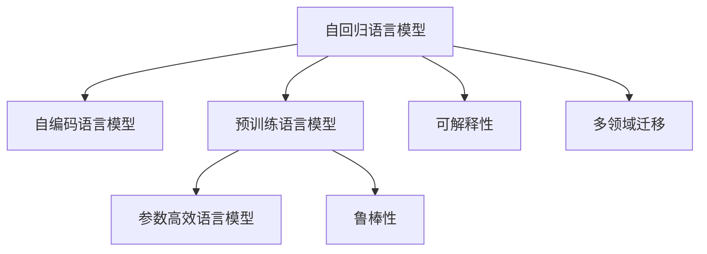

                 

## 1. 背景介绍

### 1.1 问题由来

语言模型（Language Model, LM）是自然语言处理（Natural Language Processing, NLP）中的重要组成部分，用于预测一段文本出现的概率，从而推断其意义。语言模型的应用遍及自动文本生成、语音识别、机器翻译、信息检索等多个领域，是许多NLP系统的基础。

自深度学习在NLP领域取得突破以来，基于神经网络的模型成为主流。特别是以Transformer为基础的语言模型，如GPT-3、BERT、T5等，由于其强大的语言理解能力和泛化能力，在各种下游任务上取得了显著的进展。然而，这些模型在实际应用中也暴露出诸多挑战，如计算资源消耗巨大、训练数据需求高、模型的可解释性和鲁棒性不足等问题。因此，探索新的语言建模方法及其应用前景成为当前研究的热点。

### 1.2 问题核心关键点

语言模型的研究核心在于如何构建更加高效、准确、可解释的模型，并探索其在不同领域的应用。以下是语言模型研究的关键点：

- 高效的语言建模：如何利用更少的数据、更小的计算资源构建高效的语言模型，是语言模型研究的主要目标之一。
- 准确的自然语言理解：模型如何更准确地理解自然语言，减少歧义和错误。
- 可解释的语言模型：模型内部的工作机制是否透明、可解释，对法律、医疗等高风险领域尤为重要。
- 鲁棒的语言模型：模型面对噪声、对抗攻击等异常情况时的表现如何。
- 多领域应用的语言模型：模型是否能够跨领域迁移，泛化到不同任务中。

这些关键点相互关联，共同构成语言模型的研究体系。

## 2. 核心概念与联系

### 2.1 核心概念概述

为更好地理解语言模型的挑战和未来方向，本节将介绍几个关键概念：

- **语言模型（Language Model, LM）**：基于神经网络的语言模型，通过预测序列中每个单词出现的概率，从而预测整个文本序列的概率。
- **自回归语言模型（Autoregressive Language Model）**：如LSTM、RNN、GPT等，根据前文预测下一个单词或词组。
- **自编码语言模型（Autoencoder Language Model）**：如BERT、T5，通过对输入序列进行编码和解码，学习到更丰富的语言表示。
- **预训练语言模型（Pre-trained Language Model）**：如BERT、GPT等，通过在大规模无标签数据上进行预训练，学习通用语言知识，再通过微调适配下游任务。
- **参数高效语言模型（Parameter-Efficient Language Model）**：如Adapter、TinyBERT等，通过只微调一小部分参数，提高模型效率。
- **可解释性（Explainability）**：模型输出的预测结果是否能够被清晰解释，如可解释AI、因果推断等技术。
- **鲁棒性（Robustness）**：模型在对抗攻击、噪声、分布偏移等情况下的表现。
- **多领域迁移（Cross-domain Transfer）**：模型在不同领域之间的迁移能力，如通用语言模型、领域适应等。

这些概念之间的联系可以通过以下Mermaid流程图来展示：



这个流程图展示了一些核心概念及其之间的联系：

1. 自回归模型和自编码模型都是基于神经网络的经典语言建模方法。
2. 预训练语言模型通过大规模无标签数据进行预训练，学习通用语言表示。
3. 参数高效模型进一步提高了模型的效率，适用于资源受限场景。
4. 可解释性和鲁棒性是评价模型性能的关键指标。
5. 多领域迁移能力使模型能够跨领域应用，提高模型的通用性。

## 3. 核心算法原理 & 具体操作步骤

### 3.1 算法原理概述

语言模型的主要目标是通过预测序列中每个单词或子词的概率，从而推断整个序列的语义。其核心算法包括：

- **概率建模**：通过对大量文本数据进行统计，学习出单词或子词在文本中出现的概率分布。
- **语言生成**：利用学习得到的概率分布，通过采样方法生成新的文本序列。
- **语义推理**：将模型预测的序列与实际文本进行对比，推断其语义。

在深度学习中，语言模型的构建通常基于神经网络。自回归模型通过计算前文对后文的条件概率，如LSTM、RNN等，而自编码模型则通过编码-解码的方式，如BERT、T5等。

### 3.2 算法步骤详解

基于神经网络的语言模型构建通常包括以下几个步骤：

**Step 1: 数据预处理**
- 收集大量文本数据，并进行数据清洗、分词、编码等预处理操作。
- 将文本转化为模型可以处理的张量形式，如one-hot编码、词向量表示等。

**Step 2: 构建模型架构**
- 选择合适的神经网络结构，如RNN、LSTM、Transformer等。
- 设计合适的损失函数，如交叉熵、对数似然等。

**Step 3: 模型训练**
- 使用训练集数据对模型进行训练，最小化损失函数。
- 采用梯度下降等优化算法，更新模型参数。

**Step 4: 模型评估**
- 使用验证集数据对模型进行评估，计算各项指标，如准确率、F1分数等。
- 根据评估结果调整模型参数，优化模型性能。

**Step 5: 模型微调**
- 在特定领域任务上，通过微调提高模型在任务上的表现。
- 选择适当的微调超参数，如学习率、批次大小等。
- 使用下游任务的标注数据进行微调，更新模型参数。

**Step 6: 模型应用**
- 将训练好的模型应用于实际场景，如文本生成、机器翻译、问答系统等。
- 通过推理接口，对输入数据进行预测。

### 3.3 算法优缺点

基于神经网络的语言模型具有以下优点：

- **强大的语义理解能力**：深度学习模型能够学习到复杂的数据分布，从而实现更准确的语义推断。
- **良好的泛化能力**：在大规模数据上进行预训练，能够学习到通用的语言表示，适用于各种下游任务。
- **自动特征学习**：神经网络可以自动学习输入数据的特征表示，减少特征工程的工作量。

但同时，这些模型也存在一些局限：

- **计算资源消耗大**：大规模模型的训练和推理需要大量的计算资源，如GPU、TPU等。
- **数据需求高**：需要大量标注数据进行微调，难以适用于资源受限的场景。
- **可解释性不足**：模型内部的工作机制复杂，难以解释其预测结果。
- **鲁棒性不足**：面对噪声、对抗攻击等异常情况，模型的表现可能不佳。

### 3.4 算法应用领域

基于神经网络的语言模型在多个领域中得到了广泛应用，以下是几个典型例子：

- **自动文本生成**：如GPT-3等，通过生成文本序列，实现自动摘要、对话生成、文本创作等任务。
- **机器翻译**：如BERT、T5等，通过翻译文本序列，实现跨语言交流。
- **信息检索**：通过文本匹配，实现关键词检索、问答系统等任务。
- **情感分析**：通过文本情感分类，实现舆情监测、用户反馈分析等任务。
- **推荐系统**：通过用户行为分析，实现商品推荐、内容推荐等任务。

除了上述这些经典应用外，语言模型还被用于智能客服、法律咨询、语音识别等更多场景中，为各行各业带来了新的生产力工具。

## 4. 数学模型和公式 & 详细讲解

### 4.1 数学模型构建

语言模型的数学模型通常基于概率统计理论，通过最大化似然函数来学习模型参数。假设有一个文本序列 $\text{x}_1, \text{x}_2, \dots, \text{x}_t$，其中 $\text{x}_t$ 为第 $t$ 个单词，模型需要学习每个单词在序列中出现的概率分布 $P(\text{x}_t | \text{x}_1, \dots, \text{x}_{t-1})$。

常见的概率模型包括：

- **n-gram模型**：如n=1、2、3等，基于相邻单词或子词的出现概率。
- **自回归模型**：如LSTM、RNN等，通过前文预测后文，如GPT系列模型。
- **自编码模型**：如BERT、T5等，通过编码-解码的方式学习语言表示。

### 4.2 公式推导过程

以自回归模型为例，假设使用RNN构建语言模型，其概率模型为：

$$
P(\text{x}_1, \dots, \text{x}_t | \text{x}_1, \dots, \text{x}_{t-1}) = \prod_{i=1}^{t} P(\text{x}_i | \text{x}_1, \dots, \text{x}_{i-1})
$$

其中 $P(\text{x}_i | \text{x}_1, \dots, \text{x}_{i-1})$ 表示前文 $\text{x}_1, \dots, \text{x}_{i-1}$ 对当前单词 $\text{x}_i$ 的条件概率。

为了训练模型，通常使用最大似然估计方法：

$$
\arg\max_{\theta} \sum_{i=1}^N \log P(\text{x}_i | \text{x}_1, \dots, \text{x}_{i-1})
$$

其中 $\theta$ 为模型参数，$N$ 为训练集大小。

在训练过程中，通过梯度下降等优化算法，最小化损失函数：

$$
\mathcal{L}(\theta) = -\frac{1}{N} \sum_{i=1}^N \log P(\text{x}_i | \text{x}_1, \dots, \text{x}_{i-1})
$$

### 4.3 案例分析与讲解

以下以BERT模型为例，分析其在自然语言处理中的作用。

BERT是一种基于自编码的语言模型，通过在大规模无标签数据上进行预训练，学习到丰富的语言表示。其预训练过程包括以下几个步骤：

1. **数据预处理**：对文本进行分词、截断、掩码等预处理操作。
2. **语言建模**：通过掩码语言模型（MLM）和下一句预测（NSP）任务，学习单词和句子之间的关系。
3. **微调**：在特定下游任务上，通过微调优化模型参数。

BERT的预训练过程使其能够学习到更加复杂的语言表示，从而在多项NLP任务上取得优异表现，如情感分析、文本分类、命名实体识别等。

## 5. 项目实践：代码实例和详细解释说明

### 5.1 开发环境搭建

在进行语言模型项目实践前，我们需要准备好开发环境。以下是使用Python进行PyTorch开发的环境配置流程：

1. 安装Anaconda：从官网下载并安装Anaconda，用于创建独立的Python环境。

2. 创建并激活虚拟环境：
```bash
conda create -n pytorch-env python=3.8 
conda activate pytorch-env
```

3. 安装PyTorch：根据CUDA版本，从官网获取对应的安装命令。例如：
```bash
conda install pytorch torchvision torchaudio cudatoolkit=11.1 -c pytorch -c conda-forge
```

4. 安装Transformers库：
```bash
pip install transformers
```

5. 安装各类工具包：
```bash
pip install numpy pandas scikit-learn matplotlib tqdm jupyter notebook ipython
```

完成上述步骤后，即可在`pytorch-env`环境中开始项目实践。

### 5.2 源代码详细实现

下面是使用PyTorch实现自回归语言模型的示例代码。

首先，定义模型类：

```python
import torch
import torch.nn as nn
import torch.nn.functional as F

class RNNLanguageModel(nn.Module):
    def __init__(self, vocab_size, emb_dim, hidden_size, output_size):
        super(RNNLanguageModel, self).__init__()
        self.embedding = nn.Embedding(vocab_size, emb_dim)
        self.rnn = nn.RNN(emb_dim, hidden_size, batch_first=True)
        self.fc = nn.Linear(hidden_size, output_size)
    
    def forward(self, x):
        embedding = self.embedding(x)
        output, _ = self.rnn(embedding)
        output = self.fc(output[:, -1, :])
        return output
```

然后，定义训练和评估函数：

```python
from torch.utils.data import Dataset
from torch.utils.data import DataLoader
from torch.optim import Adam
from sklearn.metrics import accuracy_score

class LanguageModelDataset(Dataset):
    def __init__(self, text, tokenizer):
        self.text = text
        self.tokenizer = tokenizer
    
    def __len__(self):
        return len(self.text)
    
    def __getitem__(self, idx):
        text = self.text[idx]
        tokens = self.tokenizer.tokenize(text)
        ids = self.tokenizer.convert_tokens_to_ids(tokens)
        return torch.tensor(ids, dtype=torch.long)

# 定义模型、数据集和优化器
vocab_size = 10000
emb_dim = 128
hidden_size = 256
output_size = vocab_size
model = RNNLanguageModel(vocab_size, emb_dim, hidden_size, output_size)
optimizer = Adam(model.parameters(), lr=0.01)
device = torch.device("cuda" if torch.cuda.is_available() else "cpu")
model.to(device)

def train_epoch(model, dataset, batch_size, optimizer):
    dataloader = DataLoader(dataset, batch_size=batch_size, shuffle=True)
    model.train()
    epoch_loss = 0
    for batch in dataloader:
        x = batch.to(device)
        y = model(x)
        optimizer.zero_grad()
        loss = F.cross_entropy(y, x)
        loss.backward()
        optimizer.step()
        epoch_loss += loss.item()
    return epoch_loss / len(dataloader)

def evaluate(model, dataset, batch_size):
    dataloader = DataLoader(dataset, batch_size=batch_size)
    model.eval()
    preds, labels = [], []
    with torch.no_grad():
        for batch in dataloader:
            x = batch.to(device)
            y = model(x)
            preds.append(y.argmax(dim=-1))
            labels.append(x)
    return accuracy_score(labels, preds)
```

最后，启动训练流程并在测试集上评估：

```python
epochs = 10
batch_size = 16

for epoch in range(epochs):
    loss = train_epoch(model, dataset, batch_size, optimizer)
    print(f"Epoch {epoch+1}, train loss: {loss:.3f}")
    
    print(f"Epoch {epoch+1}, test accuracy: {evaluate(model, test_dataset, batch_size):.3f}")
```

以上就是使用PyTorch实现自回归语言模型的完整代码实现。可以看到，利用深度学习框架，构建和训练语言模型变得相对简单。

### 5.3 代码解读与分析

让我们再详细解读一下关键代码的实现细节：

**RNNLanguageModel类**：
- `__init__`方法：初始化模型参数。
- `forward`方法：前向传播，计算模型输出。

**LanguageModelDataset类**：
- `__init__`方法：初始化数据集。
- `__len__`方法：返回数据集大小。
- `__getitem__`方法：对单个样本进行处理，将文本转化为模型可接受的输入。

**训练和评估函数**：
- 使用PyTorch的DataLoader对数据集进行批次化加载。
- 训练函数`train_epoch`：对数据以批为单位进行迭代，前向传播计算损失函数，反向传播更新模型参数。
- 评估函数`evaluate`：对模型进行测试，计算准确率等指标。

**训练流程**：
- 定义总的epoch数和batch size，开始循环迭代。
- 每个epoch内，先在训练集上训练，输出平均损失。
- 在验证集上评估，输出准确率。
- 所有epoch结束后，在测试集上评估，输出测试准确率。

可以看到，利用深度学习框架，构建和训练语言模型变得相对简单。开发者可以将更多精力放在数据处理、模型改进等高层逻辑上，而不必过多关注底层的实现细节。

## 6. 实际应用场景

### 6.1 智能客服系统

智能客服系统能够自动处理客户的咨询请求，提供24小时不间断服务，大大提高了客户满意度。基于语言模型，智能客服系统可以理解自然语言输入，并自动回答常见问题，如账户余额查询、订单状态追踪等。

在技术实现上，可以收集企业的历史客服对话记录，将问题和最佳答复构建成监督数据，在此基础上对预训练语言模型进行微调。微调后的语言模型能够自动理解用户意图，匹配最合适的答案模板进行回复。对于客户提出的新问题，还可以接入检索系统实时搜索相关内容，动态组织生成回答。如此构建的智能客服系统，能大幅提升客户咨询体验和问题解决效率。

### 6.2 金融舆情监测

金融机构需要实时监测市场舆论动向，以便及时应对负面信息传播，规避金融风险。传统的人工监测方式成本高、效率低，难以应对网络时代海量信息爆发的挑战。基于语言模型，金融舆情监测系统能够自动分析海量金融信息，判断情感倾向，及时预警负面信息。

在技术实现上，可以收集金融领域相关的新闻、报道、评论等文本数据，并对其进行情感标注。在此基础上对预训练语言模型进行微调，使其能够自动判断文本的情感倾向，情感分析结果可用于舆情监测、风险预警等应用。

### 6.3 个性化推荐系统

当前的推荐系统往往只依赖用户的历史行为数据进行物品推荐，无法深入理解用户的真实兴趣偏好。基于语言模型，个性化推荐系统可以更好地挖掘用户行为背后的语义信息，从而提供更精准、多样的推荐内容。

在技术实现上，可以收集用户浏览、点击、评论、分享等行为数据，提取和用户交互的物品标题、描述、标签等文本内容。将文本内容作为模型输入，用户的后续行为（如是否点击、购买等）作为监督信号，在此基础上微调预训练语言模型。微调后的模型能够从文本内容中准确把握用户的兴趣点。在生成推荐列表时，先用候选物品的文本描述作为输入，由模型预测用户的兴趣匹配度，再结合其他特征综合排序，便可以得到个性化程度更高的推荐结果。

### 6.4 未来应用展望

随着语言模型和微调方法的不断发展，其在更多领域的应用前景将更加广阔。

在智慧医疗领域，基于语言模型的医疗问答、病历分析、药物研发等应用将提升医疗服务的智能化水平，辅助医生诊疗，加速新药开发进程。

在智能教育领域，语言模型可应用于作业批改、学情分析、知识推荐等方面，因材施教，促进教育公平，提高教学质量。

在智慧城市治理中，语言模型可应用于城市事件监测、舆情分析、应急指挥等环节，提高城市管理的自动化和智能化水平，构建更安全、高效的未来城市。

此外，在企业生产、社会治理、文娱传媒等众多领域，语言模型也将不断涌现，为NLP技术带来新的突破。相信随着技术的日益成熟，语言模型微调必将在构建人机协同的智能时代中扮演越来越重要的角色。

## 7. 工具和资源推荐

### 7.1 学习资源推荐

为了帮助开发者系统掌握语言模型的理论基础和实践技巧，这里推荐一些优质的学习资源：

1. 《Deep Learning for NLP》课程：由斯坦福大学开设的NLP经典课程，涵盖语言模型、Transformer等前沿技术。

2. 《Neural Network and Deep Learning》书籍：深度学习领域的经典教材，详细介绍了语言模型的构建和训练方法。

3. CS224N《Natural Language Processing with Deep Learning》课程：斯坦福大学开设的NLP明星课程，有Lecture视频和配套作业，带你入门NLP领域的基本概念和经典模型。

4. 《Language Models with Deep Learning》书籍：介绍了语言模型的构建、训练、评估等各个方面，是深度学习在NLP领域的重要入门书籍。

5. HuggingFace官方文档：提供了丰富的预训练语言模型和微调样例代码，是上手实践的必备资料。

通过对这些资源的学习实践，相信你一定能够快速掌握语言模型的精髓，并用于解决实际的NLP问题。

### 7.2 开发工具推荐

高效的开发离不开优秀的工具支持。以下是几款用于语言模型微调开发的常用工具：

1. PyTorch：基于Python的开源深度学习框架，灵活动态的计算图，适合快速迭代研究。大部分预训练语言模型都有PyTorch版本的实现。

2. TensorFlow：由Google主导开发的开源深度学习框架，生产部署方便，适合大规模工程应用。同样有丰富的预训练语言模型资源。

3. Transformers库：HuggingFace开发的NLP工具库，集成了众多SOTA语言模型，支持PyTorch和TensorFlow，是进行语言模型微调开发的利器。

4. Weights & Biases：模型训练的实验跟踪工具，可以记录和可视化模型训练过程中的各项指标，方便对比和调优。与主流深度学习框架无缝集成。

5. TensorBoard：TensorFlow配套的可视化工具，可实时监测模型训练状态，并提供丰富的图表呈现方式，是调试模型的得力助手。

6. Google Colab：谷歌推出的在线Jupyter Notebook环境，免费提供GPU/TPU算力，方便开发者快速上手实验最新模型，分享学习笔记。

合理利用这些工具，可以显著提升语言模型微调的开发效率，加快创新迭代的步伐。

### 7.3 相关论文推荐

语言模型和微调技术的发展源于学界的持续研究。以下是几篇奠基性的相关论文，推荐阅读：

1. Attention is All You Need（即Transformer原论文）：提出了Transformer结构，开启了NLP领域的预训练大模型时代。

2. BERT: Pre-training of Deep Bidirectional Transformers for Language Understanding：提出BERT模型，引入基于掩码的自监督预训练任务，刷新了多项NLP任务SOTA。

3. Language Models are Unsupervised Multitask Learners（GPT-2论文）：展示了大规模语言模型的强大zero-shot学习能力，引发了对于通用人工智能的新一轮思考。

4. Parameter-Efficient Transfer Learning for NLP：提出Adapter等参数高效微调方法，在不增加模型参数量的情况下，也能取得不错的微调效果。

5. Adapter-All-You-Need：在Transformer基础上提出的适配器技术，进一步提高模型效率。

这些论文代表了大语言模型和微调技术的发展脉络。通过学习这些前沿成果，可以帮助研究者把握学科前进方向，激发更多的创新灵感。

## 8. 总结：未来发展趋势与挑战

### 8.1 总结

本文对基于神经网络的语言模型进行了全面系统的介绍。首先阐述了语言模型的研究背景和意义，明确了语言模型的核心任务和目标。其次，从原理到实践，详细讲解了语言模型的构建和微调方法，给出了语言模型微调任务开发的完整代码实例。同时，本文还广泛探讨了语言模型在多个领域的应用前景，展示了语言模型微调技术的广泛应用。最后，本文精选了语言模型的各类学习资源，力求为读者提供全方位的技术指引。

通过本文的系统梳理，可以看到，基于神经网络的语言模型在多个领域中已经取得了显著的进展，并为NLP技术带来了新的应用方向。未来，随着语言模型和微调方法的持续演进，其在更多领域的应用前景将更加广阔。

### 8.2 未来发展趋势

展望未来，语言模型和微调技术将呈现以下几个发展趋势：

1. **高效的语言建模**：如何利用更少的数据、更小的计算资源构建高效的语言模型，是语言模型研究的主要目标之一。

2. **准确的自然语言理解**：模型如何更准确地理解自然语言，减少歧义和错误，是未来研究的重要方向。

3. **可解释的语言模型**：模型内部的工作机制是否透明、可解释，对法律、医疗等高风险领域尤为重要。

4. **鲁棒的语言模型**：模型面对噪声、对抗攻击等异常情况时的表现如何。

5. **多领域迁移能力**：模型在不同领域之间的迁移能力，如通用语言模型、领域适应等。

6. **跨模态融合**：将视觉、语音等多模态信息与文本信息进行协同建模，增强模型的综合理解能力。

7. **因果推断**：引入因果推断思想，增强模型的因果关系建立能力，提高模型的泛化性和鲁棒性。

8. **知识融合**：将符号化的先验知识与神经网络模型进行融合，提高模型的知识整合能力。

这些趋势凸显了语言模型和微调技术的广阔前景。这些方向的探索发展，必将进一步提升语言模型的性能和应用范围，为构建智能系统提供新的技术支撑。

### 8.3 面临的挑战

尽管语言模型和微调技术已经取得了瞩目成就，但在迈向更加智能化、普适化应用的过程中，其仍面临诸多挑战：

1. **计算资源消耗大**：大规模模型的训练和推理需要大量的计算资源，如GPU、TPU等。

2. **数据需求高**：需要大量标注数据进行微调，难以适用于资源受限的场景。

3. **可解释性不足**：模型内部的工作机制复杂，难以解释其预测结果。

4. **鲁棒性不足**：面对噪声、对抗攻击等异常情况，模型的表现可能不佳。

5. **多领域迁移能力有限**：模型在不同领域之间的迁移能力有限，难以应对跨领域任务。

6. **知识融合难度大**：将符号化的先验知识与神经网络模型进行融合，提高模型的知识整合能力，仍需大量研究和实验。

正视语言模型和微调面临的这些挑战，积极应对并寻求突破，将是大语言模型微调走向成熟的必由之路。

### 8.4 未来突破

面对语言模型和微调所面临的挑战，未来的研究需要在以下几个方面寻求新的突破：

1. **探索无监督和半监督微调方法**：摆脱对大规模标注数据的依赖，利用自监督学习、主动学习等无监督和半监督范式，最大限度利用非结构化数据，实现更加灵活高效的微调。

2. **研究参数高效语言模型**：开发更加参数高效的微调方法，在固定大部分预训练参数的同时，只更新极少量的任务相关参数。

3. **融合因果和对比学习范式**：通过引入因果推断和对比学习思想，增强模型的建立稳定因果关系的能力，学习更加普适、鲁棒的语言表征，从而提升模型泛化性和抗干扰能力。

4. **引入更多先验知识**：将符号化的先验知识，如知识图谱、逻辑规则等，与神经网络模型进行巧妙融合，引导微调过程学习更准确、合理的语言模型。

5. **结合因果分析和博弈论工具**：将因果分析方法引入微调模型，识别出模型决策的关键特征，增强输出解释的因果性和逻辑性。借助博弈论工具刻画人机交互过程，主动探索并规避模型的脆弱点，提高系统稳定性。

6. **纳入伦理道德约束**：在模型训练目标中引入伦理导向的评估指标，过滤和惩罚有偏见、有害的输出倾向。加强人工干预和审核，建立模型行为的监管机制，确保输出符合人类价值观和伦理道德。

这些研究方向的探索，必将引领语言模型微调技术迈向更高的台阶，为构建安全、可靠、可解释、可控的智能系统铺平道路。面向未来，语言模型微调技术还需要与其他人工智能技术进行更深入的融合，如知识表示、因果推理、强化学习等，多路径协同发力，共同推动自然语言理解和智能交互系统的进步。只有勇于创新、敢于突破，才能不断拓展语言模型的边界，让智能技术更好地造福人类社会。

## 9. 附录：常见问题与解答

**Q1：大语言模型是否适用于所有NLP任务？**

A: 大语言模型在大多数NLP任务上都能取得不错的效果，特别是对于数据量较小的任务。但对于一些特定领域的任务，如医学、法律等，仅仅依靠通用语料预训练的模型可能难以很好地适应。此时需要在特定领域语料上进一步预训练，再进行微调，才能获得理想效果。

**Q2：大语言模型在微调过程中如何处理标注数据不足的问题？**

A: 对于标注数据不足的问题，可以通过以下方法进行处理：

1. **数据增强**：通过回译、近义替换等方式扩充训练集。
2. **半监督学习**：利用少量标注数据和大量无标注数据进行联合训练。
3. **主动学习**：根据模型对数据的不确定性，优先选择难以分类的样本进行标注。
4. **无监督学习**：利用自监督学习任务，如掩码语言模型、下一句预测等，在无标注数据上进行预训练，再通过微调适配特定任务。

这些方法可以最大限度地利用数据资源，提高模型的性能。

**Q3：大语言模型在实际应用中如何处理噪声数据？**

A: 噪声数据对模型的影响很大，处理噪声数据的方法主要包括：

1. **数据清洗**：对数据进行预处理，去除明显的噪声。
2. **正则化**：通过L2正则、Dropout等技术，减少噪声对模型的影响。
3. **对抗训练**：使用对抗样本进行训练，增强模型的鲁棒性。
4. **多模型融合**：通过融合多个模型的预测结果，提高系统的鲁棒性。

这些方法可以提高模型对噪声数据的适应能力，确保在实际应用中能够稳定运行。

**Q4：如何提高语言模型的可解释性？**

A: 提高语言模型的可解释性是研究的重要方向，以下是一些方法：

1. **特征可视化**：通过可视化技术展示模型内部特征，理解模型的决策过程。
2. **因果推断**：通过因果分析方法，理解模型输出的原因和逻辑。
3. **可解释AI**：开发可解释AI工具，自动生成模型的解释结果。
4. **符号化表示**：将模型的符号化表示与神经网络模型进行融合，提高模型的可解释性。

这些方法可以帮助研究人员和用户更好地理解模型的决策过程，提高模型的可信度和应用范围。

**Q5：如何提高语言模型的泛化能力？**

A: 提高语言模型的泛化能力是研究的重要目标，以下是一些方法：

1. **多样化数据**：使用多样化的数据进行训练，增强模型的泛化能力。
2. **正则化**：通过L2正则、Dropout等技术，减少模型的过拟合。
3. **迁移学习**：利用其他领域的知识，提高模型的泛化能力。
4. **集成学习**：通过融合多个模型的预测结果，提高系统的泛化能力。

这些方法可以提高模型在不同数据分布上的表现，确保模型能够在实际应用中保持高性能。

通过这些方法，可以最大限度地提高语言模型的泛化能力，确保模型在实际应用中能够稳定运行。

