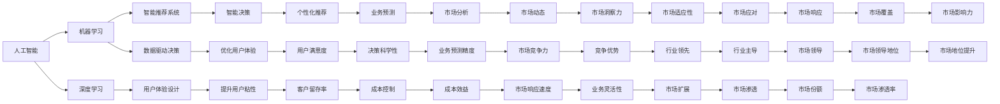

                 

# 贾扬清的期待：更多产品经理加入AI领域，创新产品形态与应用方式

在当前科技发展迅猛、人工智能(AI)技术快速演进的今天，产品经理的角色正迎来前所未有的变革与挑战。Jay Yen Qing，一位计算机科学界的翘楚，提出了他对未来产品经理在AI领域的期待，以及AI如何赋能产品经理创新产品形态与应用方式。本文将围绕这些主题展开深入探讨，并展望未来AI技术对产品经理角色与工作的深刻影响。

## 1. 背景介绍

### 1.1 人工智能与产品经理的缘起

在AI技术飞速发展的今天，AI对各行各业的影响愈加显著，尤其在游戏、教育、金融、医疗等关键领域。传统产品经理主要负责用户需求分析、产品功能设计、市场推广、用户体验等，这些工作在AI技术加持下，将被赋予新的内涵和形式。

AI技术，特别是机器学习、深度学习等，已逐渐成为产品经理不可或缺的技能之一。AI可以帮助产品经理更准确地进行需求分析、智能推荐、数据分析、用户画像构建，以及优化用户体验。此外，AI还推动了产品经理更多地参与到产品策略制定、业务预测、成本控制等环节中，从而提升整个团队的创新能力与竞争优势。

### 1.2 AI对产品经理工作的深远影响

AI技术的介入，使产品经理的工作重点从传统的产品功能开发、市场推广转向数据驱动、智能决策。产品经理需具备更强的数据处理与分析能力，以及跨学科的知识结构，以更好地理解和应用AI技术。AI不仅能提升产品经理的工作效率，还能拓展其工作视野，增强决策的科学性与前瞻性。

## 2. 核心概念与联系

### 2.1 核心概念概述

在探讨AI与产品经理的关联之前，需先理解以下几个核心概念：

- **人工智能(AI)**：指模拟人类智能过程，使计算机系统能够理解、学习和推理的技术，包括机器学习、深度学习、自然语言处理等。
- **机器学习(ML)**：一种使计算机系统通过数据训练获得学习能力的技术，广泛应用于数据分析、模式识别、预测建模等领域。
- **深度学习(Deep Learning)**：机器学习的一个分支，通过多层次的神经网络模型，模拟人脑的神经元网络，实现高级数据分析与决策。
- **产品经理(Product Manager)**：负责产品的全生命周期管理，包括市场调研、需求分析、产品设计、用户体验优化、团队协作、项目执行等，是连接用户与技术团队的核心角色。
- **智能推荐系统**：利用AI技术对用户行为数据进行建模，实现个性化推荐，提升用户体验和用户粘性。
- **用户体验设计(UX Design)**：通过心理学、人机交互等方法，设计符合用户心理和行为习惯的产品界面和交互流程，提升用户满意度。
- **数据驱动决策**：基于数据统计和分析，做出科学合理的业务决策，提升决策的准确性与前瞻性。

这些概念间的联系，可通过以下Mermaid流程图来展示：



通过以上流程图，我们可以看到，AI技术通过多个途径赋能产品经理，不仅提升产品功能和用户体验，还助力产品经理做出更加科学、高效的决策。

### 2.2 AI产品经理的工作内容

AI产品经理的工作内容主要包括：

- **需求收集与分析**：利用AI技术分析用户反馈数据，精准捕捉用户需求，进行市场细分和用户画像构建。
- **产品设计**：运用AI算法优化产品功能设计，提升用户体验，实现个性化推荐。
- **市场预测**：利用AI进行市场趋势预测，帮助制定精准的产品策略与业务规划。
- **数据分析**：借助AI进行数据分析，优化产品迭代，提升用户满意度。
- **团队协作**：在产品开发过程中，协调各部门工作，确保项目按时按质完成。

### 2.3 AI产品经理的必备技能

具备以下技能的AI产品经理更能胜任未来工作：

- **数据处理与分析能力**：能够使用SQL、Python等工具进行数据清洗、处理、分析。
- **机器学习知识**：理解机器学习原理与算法，能够运用其进行产品功能优化。
- **自然语言处理(NLP)**：掌握NLP技术，能进行文本挖掘、情感分析、智能对话等。
- **用户体验设计**：掌握UX设计原则，能够设计高效、易用的用户界面和交互流程。
- **跨学科知识**：具备计算机科学、心理学、市场营销、经济学等多领域知识。
- **团队协作**：良好的沟通能力，能够与技术团队、市场团队、销售团队紧密合作。

## 3. 核心算法原理 & 具体操作步骤

### 3.1 算法原理概述

AI与产品经理的结合，通常涉及以下几个核心算法：

- **聚类算法(Clustering Algorithm)**：通过聚类技术，对用户行为数据进行分类，了解用户群体特征，实现精准推荐。
- **协同过滤(Collaborative Filtering)**：通过分析用户行为数据，推荐相似用户喜欢的内容。
- **深度学习模型(Deep Learning Models)**：如RNN、LSTM、GRU等，用于分析用户序列数据，预测用户行为。
- **自然语言处理(NLP)**：如词嵌入、文本分类、情感分析等，用于处理和分析用户文本数据。
- **强化学习(Reinforcement Learning)**：通过模拟用户与系统的交互，优化推荐策略，提升用户体验。

### 3.2 算法步骤详解

AI产品经理通常遵循以下步骤进行工作：

1. **需求收集与分析**：
   - 收集用户反馈和行为数据。
   - 利用聚类算法和协同过滤技术，对用户进行分群。
   - 分析用户群体特征和行为模式。

2. **产品设计**：
   - 根据用户画像和行为模式，设计产品功能。
   - 使用NLP技术分析用户文本数据，进行情感分析。
   - 运用深度学习模型预测用户行为，优化推荐系统。

3. **市场预测与策略制定**：
   - 利用AI进行市场趋势预测。
   - 制定产品策略和业务规划。
   - 进行市场预测，优化产品迭代。

4. **数据分析与优化**：
   - 利用数据分析工具，优化产品功能和用户体验。
   - 进行A/B测试，评估产品效果。
   - 运用强化学习优化推荐策略，提升用户满意度。

5. **团队协作与项目管理**：
   - 与技术团队、市场团队、销售团队紧密合作。
   - 协调各部门工作，确保项目按时按质完成。
   - 进行项目管理，监控项目进展。

### 3.3 算法优缺点

AI产品经理的优势在于：

- **提升决策准确性**：借助数据驱动决策，提升业务预测和市场策略的科学性。
- **优化用户体验**：通过个性化推荐和数据分析，提升用户满意度和留存率。
- **加速产品迭代**：利用AI进行数据分析和市场预测，快速响应市场变化，加速产品迭代。
- **拓展市场空间**：通过精准推荐和市场预测，拓展市场空间，提升市场份额。

其缺点包括：

- **数据隐私与伦理**：用户数据隐私问题需得到妥善处理，避免数据滥用。
- **技术门槛较高**：需要具备一定的AI技术知识，技术门槛较高。
- **依赖数据质量**：数据质量直接影响AI模型效果，数据收集与清洗工作量较大。
- **模型解释性不足**：某些AI模型（如深度学习）的黑箱特性，导致决策过程难以解释。

### 3.4 算法应用领域

AI产品经理的应用领域广泛，主要包括：

- **电商推荐系统**：通过分析用户行为数据，实现个性化推荐。
- **金融风控系统**：利用AI进行风险预测，优化风险控制策略。
- **教育培训平台**：通过数据分析，推荐适合用户的学习资源。
- **医疗健康平台**：利用AI进行疾病预测和个性化治疗方案推荐。
- **智能家居系统**：通过数据分析和智能推荐，提升家居智能化水平。
- **智能客服系统**：通过自然语言处理和机器学习，实现智能客服。

## 4. 数学模型和公式 & 详细讲解 & 举例说明

### 4.1 数学模型构建

以电商推荐系统为例，构建推荐模型的数学模型：

假设用户行为数据为 $X$，产品信息为 $Y$，推荐系统为 $R$，目标是最大化用户满意度和产品推荐效果。推荐模型的目标函数为：

$$
\max_{R} \int (\alpha \log \hat{P}(y|x) + \beta R(x,y)) P(x,y) dx dy
$$

其中 $\hat{P}(y|x)$ 为用户在给定产品 $x$ 的情况下，推荐产品 $y$ 的概率，$R(x,y)$ 为推荐系统的效用函数。

### 4.2 公式推导过程

推荐系统的核心公式为协同过滤：

$$
\hat{P}(y|x) = \frac{e^{\sum_{i=1}^n \alpha_i \cdot \hat{P}(x_i,y)}}
{\sum_{i=1}^n e^{\sum_{i=1}^n \alpha_i \cdot \hat{P}(x_i,y)}}
$$

其中 $\alpha_i$ 为协同过滤的权重，$\hat{P}(x_i,y)$ 为相似度矩阵，通过余弦相似度或皮尔逊相关系数计算。

### 4.3 案例分析与讲解

电商推荐系统案例分析：

- **用户画像构建**：通过协同过滤算法，分析用户行为数据，构建用户画像。
- **产品推荐优化**：利用深度学习模型，对用户行为数据进行建模，预测用户偏好。
- **数据驱动决策**：根据用户行为数据和产品推荐效果，调整推荐策略，优化用户体验。

## 5. 项目实践：代码实例和详细解释说明

### 5.1 开发环境搭建

- **安装Python**：使用Anaconda安装Python 3.8版本。
- **安装数据处理库**：安装pandas、numpy、scikit-learn等库。
- **安装机器学习库**：安装scikit-learn、tensorflow等库。
- **安装自然语言处理库**：安装nltk、spaCy、transformers等库。
- **配置环境**：使用Jupyter Notebook作为开发工具。

### 5.2 源代码详细实现

以下是使用pandas和scikit-learn库实现协同过滤推荐系统的代码实现：

```python
import pandas as pd
import numpy as np
from sklearn.metrics.pairwise import cosine_similarity

# 数据加载
user_data = pd.read_csv('user_data.csv')
product_data = pd.read_csv('product_data.csv')

# 构建相似度矩阵
similarity_matrix = cosine_similarity(product_data['features'], product_data['features'])

# 计算推荐结果
def recommend_product(user_id, n_recommendations=5):
    user_profile = user_data[user_data['user_id'] == user_id]['features']
    user_similarity = similarity_matrix[user_id]
    sorted_similarity = np.argsort(user_similarity)[-n_recommendations:]
    recommendations = product_data.iloc[sorted_similarity]['product_id'].tolist()
    return recommendations

# 测试
recommendations = recommend_product(12345)
print(recommendations)
```

### 5.3 代码解读与分析

上述代码中，首先使用pandas加载用户数据和产品数据。然后，通过余弦相似度计算产品之间的相似度矩阵。最后，定义一个推荐函数，通过相似度矩阵计算用户推荐结果。

## 6. 实际应用场景

### 6.1 电商推荐系统

电商推荐系统是AI产品经理最典型的应用场景之一。通过分析用户行为数据，电商平台可以实现个性化推荐，提升用户满意度和购买率。例如，亚马逊通过协同过滤算法，为每位用户推荐其可能感兴趣的商品。用户点击推荐商品的概率，被用来调整推荐算法，进一步提升推荐效果。

### 6.2 金融风控系统

金融领域同样需要AI产品经理的参与。金融机构可以利用AI进行风险预测，优化风险控制策略。例如，某银行利用协同过滤算法，分析客户行为数据，预测客户的违约风险，优化信贷审批流程。

### 6.3 教育培训平台

在线教育平台通过AI产品经理，进行课程推荐和学习效果评估。例如，Coursera利用协同过滤算法，推荐用户感兴趣的课程。通过数据分析，平台还可以评估学习效果，优化课程推荐策略。

### 6.4 医疗健康平台

医疗健康平台通过AI产品经理，进行疾病预测和个性化治疗方案推荐。例如，某医疗平台利用深度学习模型，分析患者历史病历，预测疾病风险，并推荐个性化的治疗方案。

### 6.5 智能家居系统

智能家居系统通过AI产品经理，实现智能推荐和智能控制。例如，某智能家居平台利用协同过滤算法，推荐用户可能感兴趣的产品，并实现智能控制，提升家居体验。

### 6.6 智能客服系统

智能客服系统通过AI产品经理，实现智能推荐和智能对话。例如，某电商平台利用自然语言处理技术，实现智能客服，提升客户满意度。

## 7. 工具和资源推荐

### 7.1 学习资源推荐

- **《Python数据科学手册》**：涵盖Python、pandas、numpy等数据处理与分析工具的全面介绍。
- **《机器学习实战》**：详细介绍机器学习算法及其应用，适合产品经理快速上手。
- **《TensorFlow实战指南》**：介绍TensorFlow框架及其应用，适合产品经理学习深度学习技术。
- **《自然语言处理入门与实战》**：详细介绍自然语言处理技术及其应用，适合产品经理掌握NLP技能。
- **Coursera《数据科学与机器学习》课程**：涵盖数据科学、机器学习、深度学习等内容，适合产品经理系统学习。

### 7.2 开发工具推荐

- **Jupyter Notebook**：适用于数据处理、模型训练、模型评估等。
- **PyCharm**：适用于Python开发，集成性强，功能丰富。
- **Google Colab**：免费提供GPU/TPU算力，适合实验最新模型，分享学习笔记。

### 7.3 相关论文推荐

- **《深度学习入门与实战》**：介绍深度学习基础知识及其应用。
- **《机器学习基础与应用》**：详细介绍机器学习算法及其应用，适合产品经理学习。
- **《自然语言处理原理与实践》**：详细介绍自然语言处理技术及其应用，适合产品经理掌握NLP技能。

## 8. 总结：未来发展趋势与挑战

### 8.1 研究成果总结

AI与产品经理的结合，将极大提升产品创新的速度和质量。AI技术不仅能提升产品经理的决策科学性，还能拓展其工作视野，提高工作效率。未来，AI产品经理将成为各领域创新的重要力量。

### 8.2 未来发展趋势

未来AI产品经理的发展趋势包括：

- **跨领域融合**：AI产品经理将与更多领域的专业知识结合，提升产品的创新性和竞争力。
- **智能决策**：借助数据驱动，AI产品经理将实现更加科学、高效的决策。
- **用户体验优化**：通过个性化推荐和数据分析，AI产品经理将进一步提升用户体验。
- **资源优化**：利用AI技术，AI产品经理将实现资源的高效利用。
- **风险控制**：通过AI进行风险预测和控制，AI产品经理将提升产品安全性。

### 8.3 面临的挑战

AI产品经理面临的挑战包括：

- **技术门槛较高**：需要具备一定的AI技术知识，技术门槛较高。
- **数据隐私与伦理**：用户数据隐私问题需得到妥善处理，避免数据滥用。
- **依赖数据质量**：数据质量直接影响AI模型效果，数据收集与清洗工作量较大。
- **模型解释性不足**：某些AI模型（如深度学习）的黑箱特性，导致决策过程难以解释。
- **模型鲁棒性**：AI模型在实际应用中，面对复杂的现实世界，鲁棒性可能不足。

### 8.4 研究展望

未来的研究需要关注以下几个方向：

- **技术普及**：如何降低AI技术门槛，使更多产品经理能够掌握并应用AI技术。
- **数据隐私保护**：如何保护用户数据隐私，避免数据滥用。
- **模型解释性**：如何提升AI模型的可解释性，使其决策过程透明。
- **模型鲁棒性**：如何提高AI模型的鲁棒性，应对复杂现实世界的挑战。

## 9. 附录：常见问题与解答

**Q1：如何理解AI与产品经理的结合？**

A: AI与产品经理的结合，是指通过AI技术，提升产品经理的工作效率和决策科学性，使其能够更好地理解和应用AI技术，提升产品创新性和用户体验。AI技术不仅能够帮助产品经理进行数据分析和市场预测，还能实现个性化推荐和智能对话，提升产品竞争力和用户满意度。

**Q2：AI产品经理的工作流程包括哪些步骤？**

A: AI产品经理的工作流程通常包括以下步骤：

1. 需求收集与分析：收集用户反馈和行为数据，利用AI技术分析用户需求，构建用户画像。
2. 产品设计：运用AI算法优化产品功能设计，提升用户体验。
3. 市场预测与策略制定：利用AI进行市场趋势预测，制定精准的产品策略和业务规划。
4. 数据分析与优化：通过数据分析，优化产品功能和用户体验。
5. 团队协作与项目管理：协调各部门工作，确保项目按时按质完成。

**Q3：AI产品经理面临的主要挑战有哪些？**

A: AI产品经理面临的主要挑战包括：

1. 技术门槛较高：需要具备一定的AI技术知识，技术门槛较高。
2. 数据隐私与伦理：用户数据隐私问题需得到妥善处理，避免数据滥用。
3. 依赖数据质量：数据质量直接影响AI模型效果，数据收集与清洗工作量较大。
4. 模型解释性不足：某些AI模型（如深度学习）的黑箱特性，导致决策过程难以解释。
5. 模型鲁棒性：AI模型在实际应用中，面对复杂的现实世界，鲁棒性可能不足。

**Q4：AI产品经理的未来发展趋势有哪些？**

A: AI产品经理的未来发展趋势包括：

1. 跨领域融合：AI产品经理将与更多领域的专业知识结合，提升产品的创新性和竞争力。
2. 智能决策：借助数据驱动，AI产品经理将实现更加科学、高效的决策。
3. 用户体验优化：通过个性化推荐和数据分析，AI产品经理将进一步提升用户体验。
4. 资源优化：利用AI技术，AI产品经理将实现资源的高效利用。
5. 风险控制：通过AI进行风险预测和控制，AI产品经理将提升产品安全性。

**Q5：如何提升AI模型的可解释性？**

A: 提升AI模型的可解释性可以从以下几个方面入手：

1. 使用可解释的算法：如决策树、线性回归等，可解释性较高。
2. 可视化模型结构：使用模型可视化工具，展示模型决策路径。
3. 记录模型训练过程：记录模型训练过程中的关键指标，解释模型行为。
4. 提供决策依据：提供模型决策的依据，解释模型预测过程。
5. 引入因果推断：通过因果推断方法，解释模型因果关系。

总之，未来AI产品经理将成为各领域创新的重要力量，AI技术将进一步提升产品创新的速度和质量，赋能产品经理实现更高层次的决策与创新。

