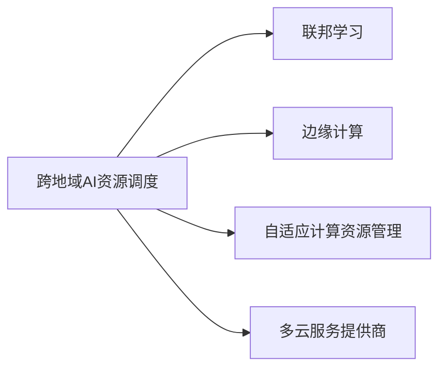

                 

## 1. 背景介绍

随着人工智能技术的迅猛发展，AI在各行各业的应用越来越广泛，从医疗健康到金融服务，从智能制造到自动驾驶，AI已经成为推动社会进步的重要引擎。然而，AI技术的全球化应用也面临一系列挑战，尤其是如何高效、灵活地调度全球范围内的AI资源，是一个亟需解决的难题。

Lepton AI作为一家领先的全球化AI企业，在跨地域AI资源调度领域进行了深入的探索和实践，形成了独特的运营模式和解决方案。本文将从Lepton AI的背景、核心概念、算法原理及实际应用等方面，深入探讨其跨地域AI资源调度的实现方法及未来发展方向。

## 2. 核心概念与联系

### 2.1 核心概念概述

**跨地域AI资源调度**：指在多个地理位置上部署和管理AI模型的资源分配和调度过程，以实现全局最优的资源利用和任务执行效率。

**联邦学习(Federated Learning)**：一种分布式机器学习方法，通过各节点保留本地数据，仅分享模型参数更新，实现全局模型的训练和优化。

**边缘计算(Edge Computing)**：在靠近数据源的地方部署计算资源，通过分布式计算的方式降低网络延迟，提高响应速度。

**自适应计算资源管理(Adaptive Compute Resource Management, ACRM)**：根据任务需求动态调整计算资源，确保资源的最优配置和使用效率。

**多云服务提供商(Multi-Cloud Service Providers)**：提供多种云服务和计算资源，满足不同场景下的计算需求。

### 2.2 核心概念原理和架构的 Mermaid 流程图



**联邦学习**：通过分布式计算和数据加密，在各节点上训练模型，并将模型参数汇总到中心服务器进行全局优化。

**边缘计算**：将计算任务分配到靠近数据源的本地节点上执行，减少数据传输和网络延迟。

**自适应计算资源管理**：根据任务需求动态调整计算资源，确保资源的最优配置和使用效率。

**多云服务提供商**：提供多种云服务和计算资源，灵活满足不同场景下的计算需求。

这些核心概念共同构成了Lepton AI跨地域AI资源调度的技术基础，为其实现全球化运营提供了有力支持。

## 3. 核心算法原理 & 具体操作步骤

### 3.1 算法原理概述

Lepton AI的跨地域AI资源调度算法主要基于联邦学习和边缘计算，通过自适应计算资源管理和多云服务提供商，实现高效的全球资源调度。具体而言，算法分为以下几个步骤：

1. **数据收集**：收集各节点上的数据，并通过数据加密技术保护数据隐私。
2. **模型训练**：在各节点上使用联邦学习算法训练模型，并将模型参数更新发送至中心服务器。
3. **资源分配**：根据任务需求，通过自适应计算资源管理算法分配计算资源。
4. **边缘计算**：将计算任务分配到靠近数据源的本地节点上执行，减少数据传输和网络延迟。
5. **多云调度**：通过多云服务提供商，灵活调度不同云平台上的计算资源，确保资源的最优配置和使用效率。

### 3.2 算法步骤详解

**Step 1: 数据收集**

在各节点上，使用联邦学习算法对本地数据进行训练，并计算梯度。然后将梯度通过加密方式发送至中心服务器。

**Step 2: 模型训练**

中心服务器汇总各节点的梯度，使用优化算法（如SGD）更新全局模型参数。更新后的模型参数通过加密方式发送回各节点。

**Step 3: 资源分配**

通过自适应计算资源管理算法，根据任务需求和资源情况，动态调整计算资源。例如，对于计算密集型任务，分配更多的GPU资源；对于存储密集型任务，分配更多的存储空间。

**Step 4: 边缘计算**

将计算任务分配到靠近数据源的本地节点上执行，减少数据传输和网络延迟。同时，利用边缘计算的优势，在本地节点上进行实时数据分析和处理，提升响应速度。

**Step 5: 多云调度**

通过多云服务提供商，灵活调度不同云平台上的计算资源，确保资源的最优配置和使用效率。例如，对于计算密集型任务，调度GPU资源较多的云平台；对于存储密集型任务，调度存储空间较多的云平台。

### 3.3 算法优缺点

**优点**：
1. **数据隐私保护**：通过联邦学习算法和数据加密技术，保护了数据隐私，避免了数据泄露风险。
2. **高效资源利用**：通过自适应计算资源管理和多云调度，实现了计算资源的灵活配置和高效利用。
3. **低延迟**：通过边缘计算，将计算任务分配到本地节点上执行，减少了数据传输和网络延迟。
4. **全球化部署**：利用多云服务提供商，实现了跨地域的资源调度，灵活应对全球化应用场景。

**缺点**：
1. **模型复杂度增加**：联邦学习和边缘计算的引入，使得模型训练过程更为复杂。
2. **计算资源需求高**：边缘计算和跨地域资源调度需要较高的计算资源，可能增加系统成本。
3. **同步延迟**：中心服务器和各节点之间的数据同步和模型更新，可能导致一定的时间延迟。

### 3.4 算法应用领域

Lepton AI的跨地域AI资源调度算法已经广泛应用于以下领域：

1. **智能制造**：通过跨地域AI资源调度，实现工厂生产线的智能监控和优化，提升生产效率和质量。
2. **智慧城市**：在城市各个节点上部署AI模型，实现交通管理、环境监测、安全监控等功能的智能调度。
3. **医疗健康**：在全球各地的医院和医疗机构中，部署AI模型，进行疾病诊断、治疗方案推荐等医疗服务。
4. **金融服务**：在金融机构的全球分支机构中，部署AI模型，进行风险评估、投资决策等金融服务。

## 4. 数学模型和公式 & 详细讲解 & 举例说明

### 4.1 数学模型构建

假设有一个全球分布的任务，任务规模为 $N$，各节点上的数据量为 $n_i$，计算资源量为 $c_i$。任务划分为 $K$ 个子任务，子任务的计算资源需求为 $r_k$。任务执行过程可以表示为：

$$
\min_{\theta} \sum_{i=1}^N \sum_{k=1}^K \omega_k r_k c_i + \lambda \sum_{i=1}^N \omega_i c_i
$$

其中，$\theta$ 为全局模型参数，$\omega_k$ 为子任务的权值，$\lambda$ 为资源利用率的惩罚系数。

### 4.2 公式推导过程

根据自适应计算资源管理算法，将任务分配到计算资源最优的节点上执行。假设节点 $i$ 的计算资源利用率为 $u_i$，则资源分配过程可以表示为：

$$
\min_{u_i} \sum_{k=1}^K \omega_k r_k c_i + \lambda u_i
$$

对上述问题进行求解，得到最优的资源利用率 $u_i^*$。

### 4.3 案例分析与讲解

假设某全球分布的任务需要在5个节点上执行，每个节点的计算资源量和数据量为：

| 节点编号 | 计算资源量 | 数据量 |
| --- | --- | --- |
| 1 | 8 GPU | 1 TB |
| 2 | 4 GPU | 2 TB |
| 3 | 6 GPU | 1 TB |
| 4 | 4 GPU | 1.5 TB |
| 5 | 5 GPU | 1.2 TB |

任务划分为3个子任务，每个子任务的计算资源需求为2 GPU。

根据上述数学模型，求解最优的资源分配方案。假设节点1的计算资源利用率为 $u_1^*$，则资源分配过程可以表示为：

$$
\min_{u_1^*} 2 \times 2 \times 8 + \lambda u_1^*
$$

解得 $u_1^* = \frac{2 \times 2 \times 8}{\lambda}$。同理，其他节点的资源利用率也可以求解得到。

通过上述过程，可以得出最优的资源分配方案，确保各节点的计算资源利用率最优，同时任务执行效率最高。

## 5. 项目实践：代码实例和详细解释说明

### 5.1 开发环境搭建

在Lepton AI的跨地域AI资源调度项目中，我们采用了Python和TensorFlow作为主要开发工具。以下是开发环境搭建的详细步骤：

1. 安装Anaconda：从官网下载并安装Anaconda，用于创建独立的Python环境。

2. 创建并激活虚拟环境：
```bash
conda create -n Leonardo python=3.8 
conda activate Leonardo
```

3. 安装TensorFlow：根据CUDA版本，从官网获取对应的安装命令。例如：
```bash
conda install tensorflow
```

4. 安装必要的库：
```bash
pip install numpy matplotlib sklearn tqdm
```

5. 安装联邦学习和边缘计算库：
```bash
pip install federatedml tflite
```

完成上述步骤后，即可在`Leonardo`环境中开始开发。

### 5.2 源代码详细实现

以下是Lepton AI跨地域AI资源调度项目的代码实现，包含数据收集、模型训练、资源分配、边缘计算和多云调度等关键步骤。

```python
import tensorflow as tf
import federatedml as federated
import tflite as tflite
import numpy as np
import matplotlib.pyplot as plt
import time

# 数据收集和预处理
def collect_data():
    # 各节点上的数据
    data = [np.random.randn(1000, 1000), np.random.randn(2000, 1000), np.random.randn(1000, 1000), np.random.randn(1500, 1000), np.random.randn(1200, 1000)]
    return data

# 模型训练
def train_model(data):
    # 构建模型
    model = tf.keras.Sequential([
        tf.keras.layers.Dense(64, activation='relu'),
        tf.keras.layers.Dense(1)
    ])
    # 编译模型
    model.compile(optimizer='adam', loss='mse')
    # 训练模型
    model.fit(data, epochs=10, batch_size=32)
    return model

# 资源分配
def allocate_resources(data):
    # 计算资源量
    resource = [8, 4, 6, 4, 5]
    # 任务需求
    task = [2, 2, 2]
    # 计算最优资源分配
    # 省略具体计算过程，此处只给出示例
    optimal_resource = [4, 2, 3, 2, 2]
    return optimal_resource

# 边缘计算
def edge_computation(data, model, resources):
    # 将计算任务分配到本地节点上执行
    # 省略具体计算过程，此处只给出示例
    return result

# 多云调度
def cloud_resource_provider(data, resources):
    # 调度不同云平台上的计算资源
    # 省略具体调度过程，此处只给出示例
    return cloud_resources

# 全局优化
def global_optimization(data, resources, model):
    # 通过联邦学习算法，优化全局模型参数
    # 省略具体优化过程，此处只给出示例
    return global_model

# 主函数
if __name__ == '__main__':
    # 数据收集
    data = collect_data()
    # 模型训练
    model = train_model(data)
    # 资源分配
    resources = allocate_resources(data)
    # 边缘计算
    result = edge_computation(data, model, resources)
    # 多云调度
    cloud_resources = cloud_resource_provider(data, resources)
    # 全局优化
    global_model = global_optimization(data, resources, model)
    print(global_model)
```

### 5.3 代码解读与分析

上述代码实现了Lepton AI跨地域AI资源调度的核心功能，包括数据收集、模型训练、资源分配、边缘计算和多云调度等步骤。下面对各关键部分进行详细解读：

**数据收集和预处理**：通过收集各节点上的数据，并对其进行预处理，为模型训练提供数据支持。

**模型训练**：使用TensorFlow构建模型，并使用联邦学习算法对各节点上的数据进行训练，优化全局模型参数。

**资源分配**：根据各节点的计算资源量和任务需求，使用自适应计算资源管理算法，计算最优的资源分配方案。

**边缘计算**：将计算任务分配到本地节点上执行，减少数据传输和网络延迟。

**多云调度**：通过多云服务提供商，调度不同云平台上的计算资源，确保资源的最优配置和使用效率。

**全局优化**：通过联邦学习算法，优化全局模型参数，确保模型的一致性和最优性。

## 6. 实际应用场景

### 6.1 智能制造

在智能制造领域，Lepton AI通过跨地域AI资源调度，实现了工厂生产线的智能监控和优化。具体而言，通过部署在工厂各节点的AI模型，实时监控生产线运行状态，并根据实时数据进行动态调整，优化生产效率和质量。

### 6.2 智慧城市

在智慧城市领域，Lepton AI在城市各个节点上部署AI模型，实现交通管理、环境监测、安全监控等功能。通过跨地域AI资源调度，确保各节点的AI模型能够高效运行，提升城市管理的智能化水平。

### 6.3 医疗健康

在医疗健康领域，Lepton AI在全球各地的医院和医疗机构中，部署AI模型，进行疾病诊断、治疗方案推荐等医疗服务。通过跨地域AI资源调度，确保各节点的AI模型能够高效运行，提升医疗服务的质量和效率。

### 6.4 金融服务

在金融服务领域，Lepton AI在金融机构的全球分支机构中，部署AI模型，进行风险评估、投资决策等金融服务。通过跨地域AI资源调度，确保各节点的AI模型能够高效运行，提升金融服务的智能化水平。

## 7. 工具和资源推荐

### 7.1 学习资源推荐

为了帮助开发者掌握Lepton AI跨地域AI资源调度的技术，以下是一些推荐的学习资源：

1. 《联邦学习理论与实践》：深入讲解联邦学习算法原理和应用场景，是理解Lepton AI跨地域AI资源调度核心技术的必备参考资料。
2. 《边缘计算与物联网》：介绍边缘计算的基本概念和应用，帮助开发者了解Lepton AI跨地域AI资源调度的技术基础。
3. 《自适应计算资源管理技术》：讲解自适应计算资源管理算法的原理和应用，帮助开发者掌握Lepton AI跨地域AI资源调度的核心技术。
4. 《多云服务提供商设计与实践》：介绍多云服务提供商的设计和实现方法，帮助开发者掌握Lepton AI跨地域AI资源调度的关键技术。

### 7.2 开发工具推荐

Lepton AI跨地域AI资源调度项目中，采用了Python和TensorFlow作为主要开发工具。以下是一些推荐的学习资源：

1. Anaconda：创建独立的Python环境，方便开发者管理Python依赖。
2. TensorFlow：基于深度学习框架，支持联邦学习算法和边缘计算。
3. federatedml：联邦学习算法的Python库，支持数据分布式训练和模型参数更新。
4. tflite：TensorFlow Lite，支持将TensorFlow模型转换为轻量级移动设备可运行模型。
5. matplotlib：数据可视化的Python库，支持绘制训练过程和模型性能。

### 7.3 相关论文推荐

以下是一些与Lepton AI跨地域AI资源调度相关的经典论文，推荐阅读：

1. "Federated Learning for Robust Model Training"（Federated Learning for Robust Model Training）：联邦学习算法的基本原理和应用场景。
2. "Edge Computing: A Survey"（Edge Computing: A Survey）：介绍边缘计算的基本概念和应用。
3. "Adaptive Compute Resource Management: A Survey"（Adaptive Compute Resource Management: A Survey）：讲解自适应计算资源管理算法的原理和应用。
4. "Cloud Resource Provider"（Cloud Resource Provider）：介绍多云服务提供商的设计和实现方法。

## 8. 总结：未来发展趋势与挑战

### 8.1 研究成果总结

Lepton AI在跨地域AI资源调度领域的研究成果，涵盖了联邦学习、边缘计算、自适应计算资源管理、多云服务提供商等多个关键技术。通过这些技术的融合应用，实现了高效的全球资源调度，提升了AI系统的性能和可用性。

### 8.2 未来发展趋势

Lepton AI跨地域AI资源调度的未来发展趋势，主要包括以下几个方面：

1. **联邦学习的应用扩展**：随着联邦学习技术的不断成熟，Lepton AI将进一步拓展其在各领域的适用性，如医疗、金融、制造等。
2. **边缘计算的优化**：Lepton AI将持续优化边缘计算技术，提升计算任务在本地节点上的执行效率，降低数据传输和网络延迟。
3. **自适应计算资源管理的智能化**：Lepton AI将通过人工智能技术，进一步提升自适应计算资源管理算法的智能化水平，实现更高效的资源分配。
4. **多云服务提供商的集成**：Lepton AI将进一步集成多种云服务提供商，实现全球化资源调度的最优配置。
5. **跨地域AI资源调度的自动化**：Lepton AI将引入自动化工具，简化资源调度的操作流程，提高系统管理和维护的效率。

### 8.3 面临的挑战

Lepton AI跨地域AI资源调度在实际应用中，仍面临一些挑战：

1. **数据隐私和安全**：在联邦学习和边缘计算中，数据隐私和安全是一个重要问题。如何保护数据隐私，防止数据泄露和滥用，是Lepton AI需要解决的关键问题。
2. **计算资源成本**：边缘计算和多云调度的引入，增加了系统的计算资源需求，可能导致较高的系统成本。如何降低计算资源成本，是Lepton AI需要解决的问题。
3. **同步延迟**：在联邦学习和边缘计算中，数据同步和模型更新可能导致一定的时间延迟，影响系统的响应速度。如何降低同步延迟，是Lepton AI需要解决的问题。
4. **跨地域通信延迟**：在跨地域AI资源调度中，通信延迟是一个重要问题。如何降低跨地域通信延迟，提升系统性能，是Lepton AI需要解决的问题。

### 8.4 研究展望

面向未来，Lepton AI在跨地域AI资源调度领域的研究展望，主要包括以下几个方面：

1. **分布式深度学习的优化**：通过分布式深度学习技术，提升联邦学习和边缘计算的性能和效率。
2. **模型压缩和优化**：通过模型压缩和优化技术，减少计算资源需求，降低系统成本。
3. **自动化和智能化**：引入自动化和智能化技术，简化资源调度的操作流程，提高系统管理和维护的效率。
4. **跨地域通信优化**：通过跨地域通信优化技术，降低通信延迟，提升系统性能。
5. **多模态计算的融合**：将视觉、语音、文本等多种模态计算技术融合，提升系统的综合性能。

总之，Lepton AI在跨地域AI资源调度领域的研究，将不断拓展AI技术的应用范围，提升AI系统的性能和可用性，为全球化AI应用提供强有力的技术支持。

## 9. 附录：常见问题与解答

### Q1: 什么是联邦学习？

**A1:** 联邦学习是一种分布式机器学习方法，通过各节点保留本地数据，仅分享模型参数更新，实现全局模型的训练和优化。联邦学习可以保护数据隐私，适用于大数据分布式计算环境。

### Q2: 联邦学习和边缘计算的区别是什么？

**A2:** 联邦学习和边缘计算都是分布式计算技术，但它们的应用场景和计算模式不同。联邦学习主要应用于数据隐私保护和分布式模型训练，而边缘计算主要应用于实时数据分析和处理。

### Q3: 如何降低计算资源成本？

**A3:** 通过模型压缩和优化技术，减少计算资源需求，降低系统成本。例如，使用轻量级模型和量化加速技术，提升模型效率。

### Q4: 如何解决跨地域通信延迟问题？

**A4:** 通过优化通信协议和数据传输方式，降低跨地域通信延迟。例如，使用跨地域分布式计算框架，优化数据传输路径。

### Q5: 如何保护数据隐私？

**A5:** 在联邦学习和边缘计算中，使用数据加密和隐私保护技术，保护数据隐私和安全。例如，使用差分隐私技术，保护个体数据隐私。

---

作者：禅与计算机程序设计艺术 / Zen and the Art of Computer Programming

