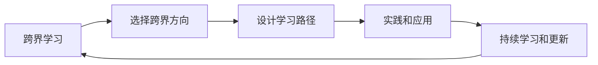

                 

# 跨界学习：拓宽职业发展空间

## 1. 背景介绍

### 1.1 问题由来
随着技术的发展和社会的进步，职业领域的边界不断模糊，跨界学习成为提升职业竞争力和适应新环境的关键手段。特别是对于信息技术领域的从业者而言，人工智能、大数据、云计算、物联网等技术的应用无处不在，需要从业者具备跨学科的知识体系和技能框架，才能满足日益复杂和多样化的工作需求。跨界学习不仅仅是技能和知识的简单叠加，而是通过系统化的学习路径，整合多学科知识，提升综合解决问题的能力。本文将系统介绍跨界学习的概念、原理、实践以及未来的发展趋势，帮助读者掌握跨界学习的核心技能和方法。

### 1.2 问题核心关键点
跨界学习作为一种新兴的学习范式，其核心在于如何系统性地整合和应用不同领域的知识和技能。关键点包括：
- 选择跨界方向：确定需要学习的多学科领域，如信息技术和生物学、数据科学和心理学等。
- 设计学习路径：根据所选方向，设计合理的学习路径和课程，确保知识点的系统性和逻辑性。
- 实践和应用：通过项目实践和实际应用，将学到的知识转化为解决问题的能力。
- 持续学习和更新：随着新技术的出现和领域的变迁，需要持续学习和更新知识体系。

### 1.3 问题研究意义
跨界学习在提升职业竞争力、推动技术创新、促进多学科融合等方面具有重要意义：
1. 提升职业竞争力：跨界学习使从业者具备更广泛的知识和技能，增强解决复杂问题的能力，提高在多变职业环境中的适应性。
2. 推动技术创新：跨界学习促进不同领域知识的融合，激发出新的技术创新点和应用场景，推动技术发展。
3. 促进多学科融合：跨界学习使各学科之间的知识边界更加模糊，有助于促进跨学科研究和合作，加速知识的传播和应用。

## 2. 核心概念与联系

### 2.1 核心概念概述

为了更好地理解跨界学习的概念和实践，本文将介绍几个核心概念：

- **跨界学习**：通过系统化地整合和应用不同领域的知识和技能，提升综合解决问题的能力。
- **多学科融合**：将多个学科的知识和技能进行有机整合，形成更加综合和灵活的解决方案。
- **交叉技能**：指在不同领域间具备的应用能力，如编程、数据分析、人工智能等。
- **持续学习**：随着技术和知识不断更新，从业者需要不断学习和更新知识体系，保持技术的前沿性。
- **项目驱动学习**：通过实际项目驱动学习，将理论知识转化为实际应用能力。

这些核心概念构成了跨界学习的理论基础和实践指南，帮助从业者系统性地掌握跨界学习的精髓。

### 2.2 核心概念原理和架构的 Mermaid 流程图(Mermaid 流程节点中不要有括号、逗号等特殊字符)



这个流程图展示了跨界学习的核心流程：
1. 从多学科中选择一个或多个跨界方向。
2. 根据选择的跨界方向，设计合理的学习路径和课程。
3. 通过实际项目将学到的知识转化为解决实际问题的能力。
4. 持续学习和更新知识体系，保持技术的先进性。

## 3. 核心算法原理 & 具体操作步骤
### 3.1 算法原理概述

跨界学习的核心算法原理是系统化、模块化和迭代化的学习路径设计，旨在通过多学科知识的学习和整合，提升综合解决问题的能力。具体来说，包括以下几个步骤：

1. **选择跨界方向**：根据自身职业需求和兴趣，选择具有交叉性的学科方向。
2. **设计学习路径**：将不同学科的知识和技能进行整合，形成模块化的学习课程。
3. **实践和应用**：通过实际项目和应用，将理论知识转化为解决实际问题的能力。
4. **持续学习和更新**：定期更新和优化知识体系，保持技术的前沿性。

### 3.2 算法步骤详解

以下是跨界学习的具体操作步骤：

**Step 1: 选择跨界方向**
- 评估自身职业需求和兴趣，确定需要学习的跨界方向。如信息技术与生物学、数据科学与心理学等。
- 调研市场趋势和行业需求，确保选择的方向具有实际应用价值。

**Step 2: 设计学习路径**
- 根据所选方向，设计系统化的学习路径和课程。包括理论课程和实践项目。
- 确定学习时间框架，合理分配各学科的学习比例和时间。

**Step 3: 实践和应用**
- 通过实际项目将学到的知识转化为解决实际问题的能力。
- 参与开源项目、企业项目或学术研究，积累实际经验。

**Step 4: 持续学习和更新**
- 定期参加行业会议、阅读专业文献，了解最新技术和趋势。
- 不断更新和优化知识体系，保持技术的前沿性。

### 3.3 算法优缺点

跨界学习具有以下优点：
1. 系统性：通过模块化和系统化的学习路径，确保知识的全面性和系统性。
2. 实践性：通过实际项目和应用，将理论知识转化为实际解决问题的能力。
3. 适应性：跨界学习使从业者具备更广泛的知识和技能，增强适应多变职业环境的能力。

同时，也存在以下局限性：
1. 时间和资源投入大：跨界学习需要时间和资源的投入，可能会对日常工作产生影响。
2. 学习难度高：跨界学习涉及多个学科的知识和技能，学习难度较大。
3. 实际应用挑战：跨界学习需要将理论知识转化为实际应用能力，可能需要一段时间的适应和实践。

### 3.4 算法应用领域

跨界学习在信息技术、数据科学、人工智能、医学等多个领域具有广泛的应用前景。以下是几个典型应用案例：

1. **数据科学与人工智能**：将数据科学和人工智能的知识整合，应用于机器学习、深度学习、自然语言处理等领域，提升模型性能和应用效果。
2. **医学与信息技术**：将医学和信息技术融合，应用于医疗数据分析、医学影像处理、个性化医疗等领域，提升医疗服务的智能化水平。
3. **物联网与云计算**：将物联网和云计算的知识整合，应用于智能家居、智能城市、工业互联网等领域，提升系统的互联互通和智能化水平。

## 4. 数学模型和公式 & 详细讲解 & 举例说明

### 4.1 数学模型构建

跨界学习的数学模型主要涉及多学科知识体系的整合和应用。以下以数据科学与人工智能为例，构建数学模型：

- **数据科学**：包括数据收集、数据清洗、数据分析、数据可视化等步骤。
- **人工智能**：包括模型训练、模型优化、模型评估等步骤。

### 4.2 公式推导过程

以线性回归模型为例，推导其公式和优化算法：

设 $y_i$ 为第 $i$ 个样本的输出值，$x_{ij}$ 为第 $i$ 个样本的第 $j$ 个特征值，$\theta_j$ 为线性回归模型的参数。则线性回归模型的目标函数为：

$$
L(\theta) = \frac{1}{2m} \sum_{i=1}^m (y_i - \theta^T x_i)^2
$$

其中 $m$ 为样本数量。梯度下降算法的更新公式为：

$$
\theta_j \leftarrow \theta_j - \eta \frac{1}{m} \sum_{i=1}^m (y_i - \theta^T x_i) x_{ij}
$$

其中 $\eta$ 为学习率。

### 4.3 案例分析与讲解

以机器学习在医疗影像分析中的应用为例，分析其数学模型和算法实现：

- **问题描述**：给定医疗影像数据集，设计一个机器学习模型，自动检测和分类影像中的病变区域。
- **数学模型**：使用卷积神经网络(CNN)模型，对影像进行特征提取和分类。
- **算法实现**：
  - **数据预处理**：对影像数据进行归一化、缩放等处理。
  - **模型设计**：设计多层的卷积神经网络，包括卷积层、池化层、全连接层等。
  - **模型训练**：使用交叉熵损失函数，结合随机梯度下降算法，对模型进行训练和优化。
  - **模型评估**：在测试集上评估模型性能，如准确率、召回率、F1值等。

## 5. 项目实践：代码实例和详细解释说明

### 5.1 开发环境搭建

在进行跨界学习项目实践前，需要准备好开发环境。以下是使用Python进行深度学习开发的环境配置流程：

1. 安装Anaconda：从官网下载并安装Anaconda，用于创建独立的Python环境。
2. 创建并激活虚拟环境：
```bash
conda create -n pytorch-env python=3.8 
conda activate pytorch-env
```
3. 安装PyTorch：根据CUDA版本，从官网获取对应的安装命令。例如：
```bash
conda install pytorch torchvision torchaudio cudatoolkit=11.1 -c pytorch -c conda-forge
```
4. 安装TensorFlow：
```bash
pip install tensorflow
```
5. 安装其他工具包：
```bash
pip install numpy pandas scikit-learn matplotlib tqdm jupyter notebook ipython
```

完成上述步骤后，即可在`pytorch-env`环境中开始项目实践。

### 5.2 源代码详细实现

以下是使用PyTorch进行数据科学与人工智能项目实践的代码实现：

```python
import torch
import torch.nn as nn
import torch.optim as optim
from torch.utils.data import DataLoader
from torchvision import datasets, transforms

# 定义数据预处理步骤
transform = transforms.Compose([
    transforms.ToTensor(),
    transforms.Normalize((0.5,), (0.5,))
])

# 加载数据集
train_dataset = datasets.MNIST(root='./data', train=True, download=True, transform=transform)
test_dataset = datasets.MNIST(root='./data', train=False, download=True, transform=transform)
train_loader = DataLoader(train_dataset, batch_size=64, shuffle=True)
test_loader = DataLoader(test_dataset, batch_size=64, shuffle=False)

# 定义模型结构
class Net(nn.Module):
    def __init__(self):
        super(Net, self).__init__()
        self.conv1 = nn.Conv2d(1, 32, kernel_size=3, stride=1, padding=1)
        self.conv2 = nn.Conv2d(32, 64, kernel_size=3, stride=1, padding=1)
        self.fc1 = nn.Linear(64 * 7 * 7, 128)
        self.fc2 = nn.Linear(128, 10)
        self.dropout = nn.Dropout(p=0.2)
    
    def forward(self, x):
        x = torch.relu(self.conv1(x))
        x = nn.MaxPool2d(kernel_size=2, stride=2)(x)
        x = torch.relu(self.conv2(x))
        x = nn.MaxPool2d(kernel_size=2, stride=2)(x)
        x = x.view(-1, 64 * 7 * 7)
        x = self.dropout(x)
        x = torch.relu(self.fc1(x))
        x = self.fc2(x)
        return x

# 定义模型训练过程
model = Net()
criterion = nn.CrossEntropyLoss()
optimizer = optim.Adam(model.parameters(), lr=0.001)

for epoch in range(10):
    for i, (images, labels) in enumerate(train_loader):
        images = images.view(-1, 1, 28, 28)
        optimizer.zero_grad()
        outputs = model(images)
        loss = criterion(outputs, labels)
        loss.backward()
        optimizer.step()
    
    if (i+1) % 100 == 0:
        print('Epoch [{}/{}], Step [{}/{}], Loss: {:.4f}'
              .format(epoch+1, 10, i+1, len(train_loader), loss.item()))

# 模型评估
correct = 0
total = 0
with torch.no_grad():
    for images, labels in test_loader:
        images = images.view(-1, 1, 28, 28)
        outputs = model(images)
        _, predicted = torch.max(outputs.data, 1)
        total += labels.size(0)
        correct += (predicted == labels).sum().item()

print('Accuracy of the model on the 10000 test images: {} %'.format(100 * correct / total))
```

### 5.3 代码解读与分析

让我们再详细解读一下关键代码的实现细节：

**数据预处理步骤**：
- `transforms.Compose`：定义了数据预处理步骤，包括将影像数据转换为Tensor，并进行归一化。
- `transforms.ToTensor`：将影像数据转换为Tensor格式。
- `transforms.Normalize`：对影像数据进行归一化，使像素值在[0, 1]之间。

**模型结构定义**：
- `nn.Conv2d`：定义卷积层，用于提取影像特征。
- `nn.MaxPool2d`：定义池化层，用于降维和提取特征。
- `nn.Linear`：定义全连接层，用于分类。
- `nn.Dropout`：定义Dropout层，防止过拟合。

**模型训练过程**：
- `torch.no_grad`：定义无梯度计算，加快计算速度。
- `torch.max`：获取预测结果中的最大值，对应正确的类别。
- `torch.mean`：计算损失函数，使用交叉熵损失函数。

**模型评估过程**：
- `torch.no_grad`：定义无梯度计算，加快计算速度。
- `torch.max`：获取预测结果中的最大值，对应正确的类别。
- `torch.mean`：计算损失函数，使用交叉熵损失函数。

## 6. 实际应用场景

### 6.1 智慧医疗

跨界学习在智慧医疗领域具有广泛的应用前景。通过对数据科学和人工智能的整合，医疗影像分析、患者诊断、个性化医疗等应用将大幅提升医疗服务的智能化水平。

具体而言，可以结合医学知识库和数据集，设计机器学习模型，自动分析医疗影像中的病变区域，辅助医生进行诊断和治疗决策。同时，通过患者历史数据和实时监测数据，使用数据科学方法进行个性化医疗推荐，提高医疗服务的质量和效率。

### 6.2 金融科技

金融科技是跨界学习的重要应用场景之一。通过将数据科学和人工智能的知识整合，可以实现金融数据分析、风险评估、智能投顾等功能。

具体而言，可以整合金融领域的数据集和算法，设计机器学习模型，对市场数据进行分析和预测，生成投资策略。同时，通过自然语言处理技术，实现智能投顾，提供个性化的投资建议和风险管理。

### 6.3 智慧城市

智慧城市是跨界学习的典型应用场景。通过对物联网和云计算的整合，可以实现城市管理的智能化和高效化。

具体而言，可以整合城市数据和传感器数据，设计机器学习模型，进行交通流量分析、环境监测、公共安全预警等应用。同时，通过云计算平台，实现数据的集中管理和计算，提升城市管理的效率和精度。

## 7. 工具和资源推荐

### 7.1 学习资源推荐

为了帮助读者系统掌握跨界学习的理论基础和实践技巧，以下是一些优质的学习资源：

1. **《Python深度学习》**：由Francois Chollet所著，系统介绍了深度学习的理论基础和实践技巧。
2. **《深度学习入门》**：由斋藤康毅所著，适合初学者学习深度学习的基础知识和实践技巧。
3. **Coursera《深度学习专项课程》**：由吴恩达教授主讲，涵盖深度学习的理论基础和实践技巧。
4. **Kaggle**：数据科学和机器学习的在线竞赛平台，提供丰富的数据集和案例分析。
5. **Udacity《人工智能纳米学位》**：涵盖深度学习、自然语言处理、计算机视觉等领域的课程，适合系统化学习。

### 7.2 开发工具推荐

高效的开发离不开优秀的工具支持。以下是几款用于跨界学习开发的常用工具：

1. **Jupyter Notebook**：免费的在线编辑器，支持Python、R等语言，适合进行数据分析和模型训练。
2. **TensorFlow**：由Google主导开发的深度学习框架，生产部署方便，适合大规模工程应用。
3. **PyTorch**：基于Python的开源深度学习框架，灵活动态的计算图，适合快速迭代研究。
4. **Scikit-learn**：Python数据科学库，提供丰富的机器学习算法和工具。
5. **Pandas**：Python数据分析库，支持数据清洗、处理和分析。

### 7.3 相关论文推荐

跨界学习作为新兴的学习范式，其理论和实践研究还在不断深入。以下是几篇奠基性的相关论文，推荐阅读：

1. **《深度学习》**：由Ian Goodfellow、Yoshua Bengio和Aaron Courville所著，系统介绍了深度学习的理论基础和实践技巧。
2. **《数据科学导论》**：由Christopher Brooks和Stephen G. Walker所著，涵盖数据科学的基础知识和实践技巧。
3. **《多学科学习：融合科学与工程》**：由Bent Flyvbjerg和Willemien Maes所著，探讨多学科学习的理论基础和实践技巧。

## 8. 总结：未来发展趋势与挑战

### 8.1 总结

本文系统介绍了跨界学习的概念、原理和实践，从系统性、实践性、适应性等角度，详细阐述了跨界学习的核心思想和操作步骤。通过理论分析与案例讲解，展示了跨界学习在数据科学、人工智能、医疗、金融、智慧城市等多个领域的应用前景。通过学习资源和开发工具的推荐，为读者提供了系统化的学习路径和实践指南。

### 8.2 未来发展趋势

展望未来，跨界学习将呈现以下几个发展趋势：

1. **数据驱动的智能化**：随着数据量的不断增加，跨界学习将更加依赖于数据驱动的方法，实现更加智能化和自动化的应用。
2. **多模态融合**：跨界学习将进一步拓展到多模态数据融合领域，如视觉、语音、文本等，实现多模态信息的协同建模和应用。
3. **交互式学习**：跨界学习将更加注重人机交互，实现更加智能和灵活的学习和应用。
4. **跨学科融合**：跨界学习将更加注重跨学科融合，实现更广泛的知识整合和应用。
5. **持续学习**：跨界学习将更加注重持续学习，保持技术的先进性和创新性。

### 8.3 面临的挑战

尽管跨界学习具有广阔的应用前景，但在实施过程中仍面临诸多挑战：

1. **时间成本高**：跨界学习需要大量时间和精力的投入，可能会对日常工作产生影响。
2. **学习难度大**：跨界学习涉及多个学科的知识和技能，学习难度较大。
3. **实际应用挑战**：跨界学习需要将理论知识转化为实际应用能力，可能需要一段时间的适应和实践。
4. **数据质量和隐私**：跨界学习需要高质量的数据支持，同时需要关注数据隐私和安全问题。

### 8.4 研究展望

面对跨界学习面临的挑战，未来的研究需要在以下几个方面寻求新的突破：

1. **自动化学习路径设计**：通过自动化学习路径设计，降低学习成本，提高学习效率。
2. **数据高效获取和处理**：探索高效的数据获取和处理技术，减少学习时间。
3. **多模态数据融合**：探索多模态数据融合技术，实现更广泛的知识整合和应用。
4. **交互式学习系统**：探索交互式学习系统，实现更加智能和灵活的学习和应用。

这些研究方向的探索，必将引领跨界学习技术迈向更高的台阶，为人工智能技术的发展提供更广阔的空间。

## 9. 附录：常见问题与解答

**Q1：跨界学习的核心是什么？**

A: 跨界学习的核心是通过系统化的学习路径，整合和应用不同学科的知识和技能，提升综合解决问题的能力。

**Q2：如何选择跨界方向？**

A: 选择跨界方向需要评估自身职业需求和兴趣，调研市场趋势和行业需求，确保选择的方向具有实际应用价值。

**Q3：如何设计学习路径？**

A: 设计学习路径需要根据选择的跨界方向，确定系统化的学习课程和步骤，确保知识的全面性和逻辑性。

**Q4：如何进行实际项目实践？**

A: 通过参与开源项目、企业项目或学术研究，将学到的知识转化为解决实际问题的能力。

**Q5：如何保持技术的前沿性？**

A: 定期参加行业会议、阅读专业文献，了解最新技术和趋势，不断更新和优化知识体系。

---

作者：禅与计算机程序设计艺术 / Zen and the Art of Computer Programming

