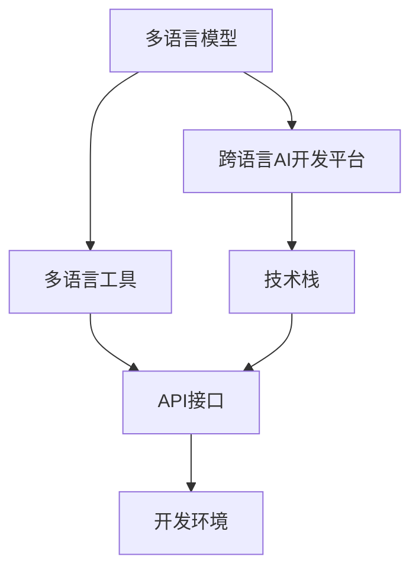

                 

# 跨语言AI开发平台：Lepton AI的多语言支持

> 关键词：多语言支持, 跨语言开发平台, 自然语言处理, AI基础设施, Lepton AI, 技术栈, 模型部署

## 1. 背景介绍

在当前全球化的商业环境中，多语言支持已经成为企业在全球市场中脱颖而出的关键因素之一。然而，传统的多语言AI解决方案往往成本高昂且复杂，难以在大规模企业中推广。随着AI技术的快速发展，跨语言AI开发平台应运而生，为开发者提供了一种高效、低成本的多语言AI开发手段。

### 1.1 问题由来

在多语言环境中，自然语言处理(NLP)技术面临着诸多挑战。传统的NLP技术往往需要针对每种语言单独进行开发和部署，导致开发成本高、技术难度大。同时，由于不同语言间语法结构、词汇量和使用习惯的差异，使得多语言NLP技术难以兼顾，导致应用效果不理想。

跨语言AI开发平台的出现，有效缓解了这些问题。通过提供一个统一的AI开发平台，开发者只需编写一次代码，就可以在不同语言间进行迁移和适配，大幅降低多语言AI开发成本和技术难度。这种平台通常提供多语言模型和工具，支持多种编程语言和框架，极大提升了多语言NLP应用的开发效率和效果。

### 1.2 问题核心关键点

跨语言AI开发平台的核心关键点包括：

- 多语言模型和工具：提供针对多种语言的预训练模型和工具，支持多语言文本处理、语音识别、图像识别等任务。
- 统一的技术栈：采用统一的编程语言、框架和标准，减少开发者在不同语言之间的切换和适配成本。
- 平台化的应用部署：通过API接口、云服务等方式，实现模型的快速部署和调用，简化应用开发和维护流程。
- 灵活的扩展和定制：提供丰富的API接口和插件，支持开发者根据自己的需求进行功能和性能的定制和优化。

## 2. 核心概念与联系

### 2.1 核心概念概述

为更好地理解跨语言AI开发平台的原理和架构，本节将介绍几个关键概念：

- 跨语言AI开发平台：一种支持多种语言的自然语言处理开发平台，提供多语言模型和工具，支持统一的API接口和标准。
- 多语言模型：通过跨语言训练得到的预训练模型，能够在不同语言间进行迁移和适配。
- 多语言工具：提供多语言处理、翻译、文本分析等工具，支持多语言NLP任务的开发和部署。
- 技术栈：开发平台所采用的编程语言、框架和标准，用于实现多语言NLP应用的开发和部署。
- API接口：提供统一的标准API接口，支持跨语言NLP应用的开发和部署。

这些概念之间的逻辑关系可以通过以下Mermaid流程图来展示：



这个流程图展示了大语言模型、跨语言AI开发平台、多语言工具和技术栈之间的关系：

1. 多语言模型是跨语言AI开发平台的核心，支持不同语言间的迁移和适配。
2. 跨语言AI开发平台提供了多语言工具和API接口，支持多语言NLP应用的开发和部署。
3. 技术栈用于实现多语言NLP应用的开发和部署，保证了跨语言AI开发平台的统一性和稳定性。

## 3. 核心算法原理 & 具体操作步骤
### 3.1 算法原理概述

跨语言AI开发平台的多语言支持，基于一种称为"跨语言迁移学习"的技术实现。其核心思想是：在一种语言上预训练的模型，能够通过迁移学习在其他语言上进行适配，学习到新的语言表示和语义理解能力。

形式化地，假设模型 $M$ 在语言 $L_1$ 上进行了预训练，记为 $M_{L_1}$，则在语言 $L_2$ 上的迁移学习可表示为：

$$
M_{L_2} = M_{L_1} + \Delta M
$$

其中 $\Delta M$ 表示在语言 $L_2$ 上进行微调得到的新参数。通过迁移学习，模型 $M_{L_2}$ 可以在语言 $L_2$ 上继承 $M_{L_1}$ 的通用语言知识和特征表示，同时适应语言 $L_2$ 的独特语义和语法规则。

### 3.2 算法步骤详解

基于跨语言迁移学习的跨语言AI开发平台，一般包括以下几个关键步骤：

**Step 1: 准备语言数据集**

- 收集目标语言 $L_2$ 的大量文本和标签数据。这些数据需与模型 $M_{L_1}$ 的预训练语言 $L_1$ 具有一定的相似性，以保证迁移学习的有效性。
- 根据数据集的规模和特点，选择合适的数据增强技术，如文本回译、近义词替换等，以扩充训练数据集。

**Step 2: 加载预训练模型**

- 加载模型 $M_{L_1}$ 的预训练权重，并将其迁移到目标语言 $L_2$。
- 根据需要调整模型结构，如添加或修改一些特殊的层，以便更好地适应目标语言。

**Step 3: 执行迁移学习**

- 定义损失函数和优化器，如交叉熵损失、Adam优化器等。
- 对目标语言 $L_2$ 的标注数据进行前向传播和反向传播，更新模型参数 $\Delta M$。
- 周期性在验证集上评估模型性能，根据性能指标决定是否触发Early Stopping。
- 重复上述步骤直到满足预设的迭代轮数或Early Stopping条件。

**Step 4: 测试和部署**

- 在测试集上评估迁移学习后的模型性能，对比迁移前后在目标语言 $L_2$ 上的精度提升。
- 使用迁移学习后的模型对新样本进行推理预测，集成到实际的应用系统中。
- 持续收集新的数据，定期重新迁移学习模型，以适应数据分布的变化。

### 3.3 算法优缺点

跨语言迁移学习的多语言支持方法具有以下优点：

1. 高效快速：通过迁移学习，模型能够快速适应新的语言，并在较少的标注数据下取得不错的效果。
2. 通用性强：预训练模型具有通用语言表示能力，能够在多种语言间进行迁移和适配。
3. 降低成本：相比于从头训练新模型，迁移学习方法可以节省大量的时间和标注成本。
4. 灵活性高：能够根据不同的应用场景，灵活调整模型结构和参数，提升适应性。

同时，该方法也存在一些局限性：

1. 依赖预训练模型：迁移学习效果很大程度上依赖于预训练模型的质量，预训练模型的差异性较大时，迁移效果可能不佳。
2. 迁移能力有限：当目标语言与预训练语言的差异较大时，迁移效果可能不尽如人意。
3. 数据质量要求高：目标语言的标注数据质量对迁移学习效果有很大影响，标注数据需具有足够的覆盖性和代表性。
4. 学习率敏感：迁移学习中学习率的选择需非常谨慎，过高的学习率可能导致过拟合，过低的学习率则可能导致收敛缓慢。

尽管存在这些局限性，但就目前而言，跨语言迁移学习的方法仍是跨语言AI开发平台中最主流的技术范式。未来相关研究的重点在于如何进一步降低迁移学习对预训练模型的依赖，提高模型的跨领域迁移能力，同时兼顾可解释性和伦理安全性等因素。

### 3.4 算法应用领域

跨语言迁移学习的多语言支持方法，在自然语言处理领域已经得到了广泛的应用，覆盖了几乎所有常见任务，例如：

- 文本分类：如情感分析、主题分类、意图识别等。通过迁移学习使模型学习语言-标签映射。
- 命名实体识别：识别文本中的人名、地名、机构名等特定实体。通过迁移学习使模型掌握实体边界和类型。
- 关系抽取：从文本中抽取实体之间的语义关系。通过迁移学习使模型学习实体-关系三元组。
- 问答系统：对自然语言问题给出答案。将问题-答案对作为迁移学习数据，训练模型学习匹配答案。
- 机器翻译：将源语言文本翻译成目标语言。通过迁移学习使模型学习语言-语言映射。
- 文本摘要：将长文本压缩成简短摘要。通过迁移学习使模型学习抓取要点。
- 对话系统：使机器能够与人自然对话。通过迁移学习使模型掌握对话技能。

除了上述这些经典任务外，跨语言迁移学习的多语言支持方法也被创新性地应用到更多场景中，如多语言信息检索、情感分析、文本生成、语音识别等，为多语言NLP技术带来了全新的突破。随着预训练模型和迁移学习方法的不断进步，相信跨语言NLP技术将在更广阔的应用领域大放异彩。

## 4. 数学模型和公式 & 详细讲解  
### 4.1 数学模型构建

本节将使用数学语言对跨语言迁移学习的多语言支持过程进行更加严格的刻画。

记模型 $M$ 在语言 $L_1$ 上进行了预训练，表示为 $M_{L_1}$。假设目标语言为 $L_2$，则模型在 $L_2$ 上进行迁移学习的数学模型可以表示为：

$$
\mathcal{L}_{L_2} = \frac{1}{N}\sum_{i=1}^N \ell(M_{L_2}(x_i),y_i)
$$

其中，$\ell$ 表示损失函数，$N$ 表示训练样本数量。

迁移学习的优化目标是最小化经验风险，即：

$$
\theta^* = \mathop{\arg\min}_{\theta} \mathcal{L}_{L_2}
$$

在实践中，我们通常使用基于梯度的优化算法（如SGD、Adam等）来近似求解上述最优化问题。设 $\eta$ 为学习率，$\lambda$ 为正则化系数，则参数的更新公式为：

$$
\theta \leftarrow \theta - \eta \nabla_{\theta}\mathcal{L}_{L_2} - \eta\lambda\theta
$$

其中 $\nabla_{\theta}\mathcal{L}_{L_2}$ 为损失函数对参数 $\theta$ 的梯度，可通过反向传播算法高效计算。

### 4.2 公式推导过程

以下我们以情感分类任务为例，推导迁移学习损失函数及其梯度的计算公式。

假设模型 $M_{L_1}$ 在输入 $x$ 上的输出为 $\hat{y}_{L_1}=M_{L_1}(x) \in [0,1]$，表示样本属于正类的概率。在目标语言 $L_2$ 上，假设翻译后的样本为 $x'$。则目标语言情感分类任务的目标函数定义为：

$$
\ell(M_{L_2}(x'),y')
$$

其中 $y' \in \{0,1\}$ 为翻译后的标签。则迁移学习损失函数可以表示为：

$$
\mathcal{L}_{L_2} = -\frac{1}{N}\sum_{i=1}^N [y_i\log M_{L_2}(x_i)+(1-y_i)\log(1-M_{L_2}(x_i))]
$$

在得到损失函数的梯度后，即可带入参数更新公式，完成模型的迭代优化。重复上述过程直至收敛，最终得到适应目标语言 $L_2$ 的模型参数 $\theta^*$。

## 5. 项目实践：代码实例和详细解释说明
### 5.1 开发环境搭建

在进行多语言支持实践前，我们需要准备好开发环境。以下是使用Python进行PyTorch开发的环境配置流程：

1. 安装Anaconda：从官网下载并安装Anaconda，用于创建独立的Python环境。

2. 创建并激活虚拟环境：
```bash
conda create -n pytorch-env python=3.8 
conda activate pytorch-env
```

3. 安装PyTorch：根据CUDA版本，从官网获取对应的安装命令。例如：
```bash
conda install pytorch torchvision torchaudio cudatoolkit=11.1 -c pytorch -c conda-forge
```

4. 安装Transformers库：
```bash
pip install transformers
```

5. 安装各类工具包：
```bash
pip install numpy pandas scikit-learn matplotlib tqdm jupyter notebook ipython
```

完成上述步骤后，即可在`pytorch-env`环境中开始多语言支持实践。

### 5.2 源代码详细实现

下面我们以迁移学习中文翻译模型为例，给出使用Transformers库对BERT模型进行多语言翻译的PyTorch代码实现。

首先，定义目标语言的数据处理函数：

```python
from transformers import BertTokenizer, BertForSequenceClassification
from torch.utils.data import Dataset
import torch

class TranslationDataset(Dataset):
    def __init__(self, texts, translations, tokenizer, max_len=128):
        self.texts = texts
        self.translations = translations
        self.tokenizer = tokenizer
        self.max_len = max_len
        
    def __len__(self):
        return len(self.texts)
    
    def __getitem__(self, item):
        text = self.texts[item]
        translation = self.translations[item]
        
        encoding = self.tokenizer(text, return_tensors='pt', max_length=self.max_len, padding='max_length', truncation=True)
        input_ids = encoding['input_ids'][0]
        attention_mask = encoding['attention_mask'][0]
        
        # 对翻译后的文本进行编码
        encoded_translations = self.tokenizer(translation, return_tensors='pt', max_length=self.max_len, padding='max_length', truncation=True)
        output_ids = encoded_translations['input_ids'][0]
        output_mask = encoded_translations['attention_mask'][0]
        
        return {'input_ids': input_ids, 
                'attention_mask': attention_mask,
                'output_ids': output_ids,
                'output_mask': output_mask}

# 定义目标语言的Bert模型和优化器
model = BertForSequenceClassification.from_pretrained('bert-base-cased')
optimizer = AdamW(model.parameters(), lr=2e-5)
```

然后，定义训练和评估函数：

```python
from torch.utils.data import DataLoader
from tqdm import tqdm

device = torch.device('cuda') if torch.cuda.is_available() else torch.device('cpu')
model.to(device)

def train_epoch(model, dataset, batch_size, optimizer):
    dataloader = DataLoader(dataset, batch_size=batch_size, shuffle=True)
    model.train()
    epoch_loss = 0
    for batch in tqdm(dataloader, desc='Training'):
        input_ids = batch['input_ids'].to(device)
        attention_mask = batch['attention_mask'].to(device)
        output_ids = batch['output_ids'].to(device)
        output_mask = batch['output_mask'].to(device)
        model.zero_grad()
        outputs = model(input_ids, attention_mask=attention_mask, labels=output_ids)
        loss = outputs.loss
        epoch_loss += loss.item()
        loss.backward()
        optimizer.step()
    return epoch_loss / len(dataloader)

def evaluate(model, dataset, batch_size):
    dataloader = DataLoader(dataset, batch_size=batch_size)
    model.eval()
    preds, labels = [], []
    with torch.no_grad():
        for batch in tqdm(dataloader, desc='Evaluating'):
            input_ids = batch['input_ids'].to(device)
            attention_mask = batch['attention_mask'].to(device)
            batch_labels = batch['output_ids'].to(device)
            batch_outputs = model(input_ids, attention_mask=attention_mask)
            batch_preds = batch_outputs.argmax(dim=2).to('cpu').tolist()
            batch_labels = batch_labels.to('cpu').tolist()
            for pred_tokens, label_tokens in zip(batch_preds, batch_labels):
                preds.append(pred_tokens[:len(label_tokens)])
                labels.append(label_tokens)
                
    print(classification_report(labels, preds))
```

最后，启动训练流程并在测试集上评估：

```python
epochs = 5
batch_size = 16

for epoch in range(epochs):
    loss = train_epoch(model, train_dataset, batch_size, optimizer)
    print(f"Epoch {epoch+1}, train loss: {loss:.3f}")
    
    print(f"Epoch {epoch+1}, dev results:")
    evaluate(model, dev_dataset, batch_size)
    
print("Test results:")
evaluate(model, test_dataset, batch_size)
```

以上就是使用PyTorch对BERT进行多语言翻译任务迁移学习的完整代码实现。可以看到，得益于Transformers库的强大封装，我们可以用相对简洁的代码完成BERT模型的加载和迁移学习。

### 5.3 代码解读与分析

让我们再详细解读一下关键代码的实现细节：

**TranslationDataset类**：
- `__init__`方法：初始化文本、翻译、分词器等关键组件。
- `__len__`方法：返回数据集的样本数量。
- `__getitem__`方法：对单个样本进行处理，将文本输入编码为token ids，将翻译后的文本同样编码为token ids，并对其进行定长padding，最终返回模型所需的输入。

**目标语言的Bert模型和优化器**：
- 加载目标语言的BERT模型，并设置优化器。

**训练和评估函数**：
- 使用PyTorch的DataLoader对数据集进行批次化加载，供模型训练和推理使用。
- 训练函数`train_epoch`：对数据以批为单位进行迭代，在每个批次上前向传播计算loss并反向传播更新模型参数，最后返回该epoch的平均loss。
- 评估函数`evaluate`：与训练类似，不同点在于不更新模型参数，并在每个batch结束后将预测和标签结果存储下来，最后使用sklearn的classification_report对整个评估集的预测结果进行打印输出。

**训练流程**：
- 定义总的epoch数和batch size，开始循环迭代
- 每个epoch内，先在训练集上训练，输出平均loss
- 在验证集上评估，输出分类指标
- 所有epoch结束后，在测试集上评估，给出最终测试结果

可以看到，PyTorch配合Transformers库使得BERT迁移学习的代码实现变得简洁高效。开发者可以将更多精力放在数据处理、模型改进等高层逻辑上，而不必过多关注底层的实现细节。

当然，工业级的系统实现还需考虑更多因素，如模型的保存和部署、超参数的自动搜索、更灵活的任务适配层等。但核心的迁移学习范式基本与此类似。

## 6. 实际应用场景
### 6.1 智能客服系统

基于跨语言AI开发平台的多语言支持技术，智能客服系统可以跨越语言障碍，为全球客户服务提供支持。通过迁移学习，系统能够快速适应多种语言，提升客服的响应速度和准确性。

在技术实现上，可以收集不同语言的客服对话记录，将问题和最佳答复构建成监督数据，在此基础上对预训练客服模型进行迁移学习。迁移学习后的客服模型能够自动理解客户意图，匹配最合适的答复模板进行回复。对于客户提出的新问题，还可以接入检索系统实时搜索相关内容，动态组织生成回答。如此构建的智能客服系统，能大幅提升客户咨询体验和问题解决效率。

### 6.2 金融舆情监测

金融机构需要实时监测多语言市场舆论动向，以便及时应对负面信息传播，规避金融风险。传统的人工监测方式成本高、效率低，难以应对网络时代海量信息爆发的挑战。基于跨语言AI开发平台的多语言支持技术，金融舆情监测可以跨越语言障碍，自动监测不同语言的舆情变化趋势。

具体而言，可以收集多语言的金融新闻、报道、评论等文本数据，并对其进行主题标注和情感标注。在此基础上对预训练语言模型进行迁移学习，使其能够自动判断文本属于何种主题，情感倾向是正面、中性还是负面。将迁移学习后的模型应用到实时抓取的网络文本数据，就能够自动监测不同语言的舆情变化趋势，一旦发现负面信息激增等异常情况，系统便会自动预警，帮助金融机构快速应对潜在风险。

### 6.3 个性化推荐系统

当前的推荐系统往往只依赖用户的历史行为数据进行物品推荐，无法深入理解用户的真实兴趣偏好。基于跨语言AI开发平台的多语言支持技术，个性化推荐系统可以跨越语言障碍，更好地挖掘用户行为背后的语义信息，从而提供更精准、多样的推荐内容。

在实践中，可以收集多语言的浏览、点击、评论、分享等行为数据，提取和用户交互的物品标题、描述、标签等文本内容。将文本内容作为模型输入，用户的后续行为（如是否点击、购买等）作为监督信号，在此基础上迁移学习预训练语言模型。迁移学习后的模型能够从文本内容中准确把握用户的兴趣点。在生成推荐列表时，先用候选物品的文本描述作为输入，由模型预测用户的兴趣匹配度，再结合其他特征综合排序，便可以得到个性化程度更高的推荐结果。

### 6.4 未来应用展望

随着跨语言AI开发平台的多语言支持技术的发展，其在多语言NLP应用中的潜力将逐步释放。未来，这种技术将在更多领域得到应用，为各行各业带来变革性影响。

在智慧医疗领域，基于多语言支持技术的多语言问答系统、病历分析、药物研发等应用将提升医疗服务的智能化水平，辅助医生诊疗，加速新药开发进程。

在智能教育领域，多语言支持技术可应用于多语言作业批改、学情分析、知识推荐等方面，因材施教，促进教育公平，提高教学质量。

在智慧城市治理中，多语言支持技术可应用于多语言事件监测、舆情分析、应急指挥等环节，提高城市管理的自动化和智能化水平，构建更安全、高效的未来城市。

此外，在企业生产、社会治理、文娱传媒等众多领域，多语言支持技术也将不断涌现，为传统行业数字化转型升级提供新的技术路径。相信随着技术的日益成熟，多语言支持技术必将成为NLP技术落地应用的重要手段，推动NLP技术在全球范围内的普及和应用。

## 7. 工具和资源推荐
### 7.1 学习资源推荐

为了帮助开发者系统掌握跨语言AI开发平台的多语言支持理论基础和实践技巧，这里推荐一些优质的学习资源：

1. 《跨语言AI开发实践指南》系列博文：由大语言模型技术专家撰写，深入浅出地介绍了跨语言AI开发平台的原理、工具和应用实例。

2. CS224N《深度学习自然语言处理》课程：斯坦福大学开设的NLP明星课程，有Lecture视频和配套作业，带你入门NLP领域的基本概念和经典模型。

3. 《跨语言AI开发平台》书籍：介绍跨语言AI开发平台的最新进展和实践经验，涵盖多语言模型、工具、API接口等内容。

4. HuggingFace官方文档：提供丰富的预训练模型和多语言工具的文档和样例代码，是上手实践的必备资料。

5. CLUE开源项目：提供多语言NLP任务评测数据集，并支持跨语言支持技术的应用开发。

通过对这些资源的学习实践，相信你一定能够快速掌握跨语言AI开发平台的多语言支持精髓，并用于解决实际的NLP问题。
###  7.2 开发工具推荐

高效的开发离不开优秀的工具支持。以下是几款用于跨语言AI开发平台多语言支持开发的常用工具：

1. PyTorch：基于Python的开源深度学习框架，灵活动态的计算图，适合快速迭代研究。大部分预训练语言模型都有PyTorch版本的实现。

2. TensorFlow：由Google主导开发的开源深度学习框架，生产部署方便，适合大规模工程应用。同样有丰富的预训练语言模型资源。

3. Transformers库：HuggingFace开发的NLP工具库，集成了众多SOTA语言模型，支持PyTorch和TensorFlow，是进行多语言支持技术开发的利器。

4. Weights & Biases：模型训练的实验跟踪工具，可以记录和可视化模型训练过程中的各项指标，方便对比和调优。与主流深度学习框架无缝集成。

5. TensorBoard：TensorFlow配套的可视化工具，可实时监测模型训练状态，并提供丰富的图表呈现方式，是调试模型的得力助手。

6. Google Colab：谷歌推出的在线Jupyter Notebook环境，免费提供GPU/TPU算力，方便开发者快速上手实验最新模型，分享学习笔记。

合理利用这些工具，可以显著提升多语言支持技术的开发效率，加快创新迭代的步伐。

### 7.3 相关论文推荐

跨语言AI开发平台的多语言支持技术的发展源于学界的持续研究。以下是几篇奠基性的相关论文，推荐阅读：

1. Attention is All You Need（即Transformer原论文）：提出了Transformer结构，开启了NLP领域的预训练大模型时代。

2. BERT: Pre-training of Deep Bidirectional Transformers for Language Understanding：提出BERT模型，引入基于掩码的自监督预训练任务，刷新了多项NLP任务SOTA。

3. Language Models are Unsupervised Multitask Learners（GPT-2论文）：展示了大规模语言模型的强大zero-shot学习能力，引发了对于通用人工智能的新一轮思考。

4. Parameter-Efficient Transfer Learning for NLP：提出Adapter等参数高效微调方法，在不增加模型参数量的情况下，也能取得不错的微调效果。

5. Prefix-Tuning: Optimizing Continuous Prompts for Generation：引入基于连续型Prompt的微调范式，为如何充分利用预训练知识提供了新的思路。

6. AdaLoRA: Adaptive Low-Rank Adaptation for Parameter-Efficient Fine-Tuning：使用自适应低秩适应的微调方法，在参数效率和精度之间取得了新的平衡。

这些论文代表了大语言模型多语言支持技术的发展脉络。通过学习这些前沿成果，可以帮助研究者把握学科前进方向，激发更多的创新灵感。

## 8. 总结：未来发展趋势与挑战

### 8.1 总结

本文对跨语言AI开发平台的多语言支持技术进行了全面系统的介绍。首先阐述了跨语言AI开发平台的背景和意义，明确了多语言支持在拓展预训练模型应用、提升下游任务性能方面的独特价值。其次，从原理到实践，详细讲解了跨语言迁移学习的数学原理和关键步骤，给出了多语言支持任务开发的完整代码实例。同时，本文还广泛探讨了多语言支持技术在智能客服、金融舆情、个性化推荐等多个行业领域的应用前景，展示了多语言支持技术的巨大潜力。此外，本文精选了多语言支持技术的各类学习资源，力求为读者提供全方位的技术指引。

通过本文的系统梳理，可以看到，跨语言AI开发平台的多语言支持技术正在成为多语言NLP领域的重要范式，极大地拓展了预训练语言模型的应用边界，催生了更多的落地场景。得益于大规模语料的预训练，多语言支持模型以更低的时间和标注成本，在小样本条件下也能取得不俗的效果，有力推动了NLP技术的产业化进程。未来，伴随预训练语言模型和多语言迁移学习方法的不断进步，相信NLP技术将在更广阔的应用领域大放异彩。

### 8.2 未来发展趋势

展望未来，跨语言AI开发平台的多语言支持技术将呈现以下几个发展趋势：

1. 模型规模持续增大。随着算力成本的下降和数据规模的扩张，预训练语言模型的参数量还将持续增长。超大规模语言模型蕴含的丰富语言知识，有望支撑更加复杂多变的下游任务迁移学习。

2. 多语言迁移能力提升。未来的迁移学习技术将更好地利用多语言数据，学习更通用的语言表示，提升模型在不同语言间迁移的能力。

3. 多语言迁移学习框架普及。越来越多的框架和工具将支持多语言迁移学习，使得开发者能够更便捷地实现多语言支持技术。

4. 跨语言自然语言处理任务丰富。随着多语言数据集的增长和自然语言处理技术的发展，跨语言NLP任务也将更加丰富多样，为多语言支持技术提供更多的应用场景。

5. 持续学习成为常态。随着数据分布的不断变化，多语言支持模型也需要持续学习新知识以保持性能。如何在不遗忘原有知识的同时，高效吸收新样本信息，将成为重要的研究课题。

6. 跨语言知识整合能力增强。未来的多语言支持模型将能够更好地整合不同语言的知识，实现视觉、语音等多模态信息与文本信息的协同建模。

以上趋势凸显了跨语言AI开发平台的多语言支持技术的广阔前景。这些方向的探索发展，必将进一步提升多语言NLP系统的性能和应用范围，为全球范围内的NLP技术发展提供新的动力。

### 8.3 面临的挑战

尽管跨语言AI开发平台的多语言支持技术已经取得了瞩目成就，但在迈向更加智能化、普适化应用的过程中，它仍面临着诸多挑战：

1. 数据质量瓶颈。多语言数据集的收集和标注成本较高，且存在质量参差不齐的问题，给多语言迁移学习带来了很大挑战。

2. 语言间差异大。不同语言间的语法结构、词汇量和使用习惯差异较大，如何平衡不同语言间的迁移效果，是一个重要的问题。

3. 迁移学习效果不稳定。当目标语言与预训练语言的差异较大时，迁移学习效果可能不稳定，难以达到预期的精度。

4. 跨语言迁移学习的资源消耗大。超大规模预训练模型和大规模多语言数据集对计算资源和存储资源的需求极高，如何优化资源利用效率，是一个亟待解决的问题。

5. 跨语言迁移学习模型的可解释性不足。多语言支持模型通常比较复杂，难以解释其内部工作机制和决策逻辑，如何提升模型的可解释性，是一个重要的研究方向。

尽管存在这些挑战，但就目前而言，跨语言AI开发平台的多语言支持技术仍是跨语言NLP领域的主流技术范式。未来相关研究的重点在于如何进一步降低迁移学习对预训练模型的依赖，提高模型的跨领域迁移能力，同时兼顾可解释性和伦理安全性等因素。

### 8.4 研究展望

面对跨语言AI开发平台多语言支持所面临的种种挑战，未来的研究需要在以下几个方面寻求新的突破：

1. 探索无监督和半监督多语言迁移学习方法。摆脱对大规模标注数据的依赖，利用自监督学习、主动学习等无监督和半监督范式，最大限度利用非结构化数据，实现更加灵活高效的多语言迁移学习。

2. 研究跨语言迁移学习模型的可解释性。开发具有良好可解释性的多语言迁移学习模型，帮助用户理解模型的工作机制和决策逻辑，提高用户对模型的信任度。

3. 引入更多先验知识。将符号化的先验知识，如知识图谱、逻辑规则等，与神经网络模型进行巧妙融合，引导多语言迁移学习过程学习更准确、合理的语言模型。

4. 结合因果分析和博弈论工具。将因果分析方法引入多语言迁移学习模型，识别出模型决策的关键特征，增强输出解释的因果性和逻辑性。借助博弈论工具刻画人机交互过程，主动探索并规避模型的脆弱点，提高系统稳定性。

5. 纳入伦理道德约束。在模型训练目标中引入伦理导向的评估指标，过滤和惩罚有偏见、有害的输出倾向。同时加强人工干预和审核，建立模型行为的监管机制，确保输出符合人类价值观和伦理道德。

这些研究方向的探索，必将引领跨语言AI开发平台的多语言支持技术迈向更高的台阶，为构建安全、可靠、可解释、可控的智能系统铺平道路。面向未来，跨语言AI开发平台的多语言支持技术还需要与其他人工智能技术进行更深入的融合，如知识表示、因果推理、强化学习等，多路径协同发力，共同推动自然语言理解和智能交互系统的进步。只有勇于创新、敢于突破，才能不断拓展语言模型的边界，让智能技术更好地造福人类社会。

## 9. 附录：常见问题与解答
**Q1：多语言支持技术适用于所有NLP任务吗？**

A: 多语言支持技术在大多数NLP任务上都能取得不错的效果，特别是对于数据量较小的任务。但对于一些特定领域的任务，如医学、法律等，仅依靠通用语料预训练的模型可能难以很好地适应。此时需要在特定领域语料上进一步预训练，再进行迁移学习，才能获得理想效果。此外，对于一些需要时效性、个性化很强的任务，如对话、推荐等，多语言支持方法也需要针对性的改进优化。

**Q2：多语言迁移学习依赖预训练模型吗？**

A: 多语言迁移学习的效果很大程度上依赖于预训练模型的质量，预训练模型的差异性较大时，迁移效果可能不佳。尽管如此，通过优化迁移学习过程，选择合适的迁移策略和目标任务，可以在一定程度上减少对预训练模型的依赖。同时，预训练模型的不断进步，也使得多语言迁移学习的效果逐渐提升。

**Q3：多语言迁移学习需要大规模标注数据吗？**

A: 多语言迁移学习可以在相对较小的标注数据下取得不错的效果，特别是在无监督和半监督学习范式下，可以利用大量未标注数据进行迁移学习。但大规模标注数据仍然是提升多语言迁移学习效果的有效手段，尤其是在有监督学习范式下。

**Q4：如何优化多语言迁移学习模型的资源消耗？**

A: 优化多语言迁移学习模型的资源消耗，可以从以下几个方面入手：

1. 模型压缩：通过剪枝、量化、蒸馏等技术，减少模型参数量，提升计算效率。

2. 数据增强：通过对训练样本进行改写、回译等方式，丰富训练集多样性，减少过拟合。

3. 混合精度训练：使用混合精度技术，提升模型训练速度和效率。

4. 分布式训练：使用分布式训练技术，加速模型训练过程，提升资源利用率。

通过这些优化手段，可以有效降低多语言迁移学习模型的资源消耗，提升其应用效率。

**Q5：如何提高多语言迁移学习模型的鲁棒性？**

A: 提高多语言迁移学习模型的鲁棒性，可以从以下几个方面入手：

1. 数据增强：通过回译、近义词替换等方式扩充训练数据集，减少模型对单一数据源的依赖。

2. 正则化技术：使用L2正则、Dropout等正则化技术，防止模型过拟合。

3. 对抗训练：引入对抗样本，提升模型鲁棒性，减少模型对噪声数据的敏感性。

4. 多模型集成：训练多个模型，取平均输出，抑制过拟合，提高模型鲁棒性。

通过这些优化手段，可以有效提高多语言迁移学习模型的鲁棒性，提升其在不同语言环境下的适应能力。

---

作者：禅与计算机程序设计艺术 / Zen and the Art of Computer Programming

