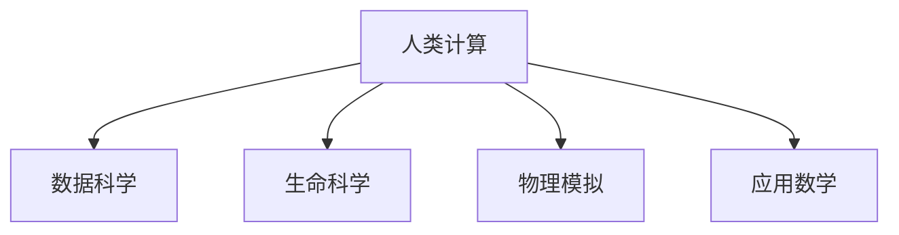

                 

# 跨越学科边界：人类计算的多元化应用

> 关键词：跨学科计算,人类计算,智能系统,数据科学,生命科学,物理模拟,应用数学

## 1. 背景介绍

在快速发展的科技时代，人类面临的挑战日益复杂多变，从环境监测到医疗诊断，从金融风险预测到自动驾驶，越来越多的问题需要跨学科的协同计算才能解决。因此，如何在不同学科之间建立桥梁，实现知识的融合和共享，成为当前科技发展的关键问题。人类计算，作为一种跨越学科边界的计算范式，提供了高效协同处理海量数据、模拟复杂系统的解决方案。本文将介绍人类计算的多元化应用，探讨其在数据科学、生命科学、物理模拟等领域的前景和挑战。

## 2. 核心概念与联系

### 2.1 核心概念概述

为了更好地理解人类计算的原理和应用，本节将介绍几个关键概念：

- **人类计算**：指通过协同计算，将不同学科的知识和数据融合在一起，共同解决复杂问题。这种计算范式强调跨学科协作，充分利用不同领域的专业知识和技术手段。

- **数据科学**：以数据为驱动的科学领域，通过数据分析、建模、可视化等方法，从数据中提取知识，支持决策和行动。数据科学强调算法的创新和模型的优化，是实现人类计算的重要工具。

- **生命科学**：研究生命体的结构、功能和演化规律的科学领域，包括分子生物学、基因组学、生物信息学等。生命科学为人类计算提供了丰富的数据和知识，同时也需要计算技术的支持。

- **物理模拟**：利用计算机模拟物理现象和过程，广泛应用于材料科学、气象学、天文学等。物理模拟需要高性能计算资源，为人类计算提供了计算密集型应用场景。

- **应用数学**：将数学理论与实际应用相结合的学科，广泛应用于科学计算、工程设计等领域。应用数学为人类计算提供了强大的理论支持和工具。

这些概念之间的逻辑关系可以通过以下Mermaid流程图来展示：



这个流程图展示了几类核心概念之间的联系：

1. 人类计算是协同计算的统称，旨在实现不同学科之间的知识融合。
2. 数据科学提供数据处理和建模的工具，是实现人类计算的重要环节。
3. 生命科学和物理模拟是两个重要的知识源泉，为人类计算提供了丰富的数据和问题。
4. 应用数学为人类计算提供了强大的数学工具和理论支持。

## 3. 核心算法原理 & 具体操作步骤

### 3.1 算法原理概述

人类计算的核心在于跨学科数据的融合和协同计算。其基本原理是通过计算模型将不同领域的数据和知识整合，形成更加全面的理解，并利用计算资源进行高效处理。例如，在生命科学中，通过分子模拟和基因数据融合，可以深入理解疾病的发生机制；在物理模拟中，通过计算流体力学和热力学的模型，可以预测天气变化和材料性质。

人类计算的算法设计通常包括以下几个步骤：

1. **数据集成**：从不同领域收集数据，并将数据进行标准化和整合。
2. **模型构建**：根据跨学科数据的特点，设计和构建计算模型。
3. **计算资源分配**：根据计算任务的复杂度和数据量，分配计算资源。
4. **协同计算**：在计算过程中，不同学科的专家和计算资源进行协同合作，共同解决问题。
5. **结果分析**：对计算结果进行分析和解释，形成跨学科的知识成果。

### 3.2 算法步骤详解

以下以生命科学中的蛋白质结构预测为例，详细讲解人类计算的算法步骤：

1. **数据集成**：
   - 收集蛋白质序列数据，包括氨基酸序列、同源序列、基因表达数据等。
   - 将这些数据标准化，转换为计算机可以处理的格式。
   - 将数据存储在分布式文件系统中，方便高效访问。

2. **模型构建**：
   - 设计深度学习模型，如卷积神经网络(CNN)、循环神经网络(RNN)等，用于处理蛋白质序列数据。
   - 引入物理模拟的模型，如分子动力学模拟，用于模拟蛋白质分子的运动。
   - 构建跨学科的计算模型，将深度学习模型和分子动力学模拟模型进行集成。

3. **计算资源分配**：
   - 根据计算任务的复杂度和数据量，分配计算资源，如CPU、GPU、高性能计算集群等。
   - 利用分布式计算框架，如Hadoop、Spark等，并行处理大规模数据。

4. **协同计算**：
   - 在计算过程中，不同学科的专家参与模型的设计、优化和调试。
   - 利用云计算和网格计算技术，实现跨地域的协同计算。

5. **结果分析**：
   - 对计算结果进行分析和解释，形成蛋白质结构的预测。
   - 利用生物信息学的工具，将预测结果与已知的蛋白质结构进行比较和验证。
   - 将结果反馈给生物学家和计算科学家，进一步优化模型和算法。

### 3.3 算法优缺点

人类计算作为一种新的计算范式，具有以下优点：

1. **跨学科知识融合**：能够充分利用不同学科的知识和技术，提升问题的解决能力。
2. **高效处理大规模数据**：通过协同计算，可以高效处理海量数据，提升计算效率。
3. **创新能力强**：不同学科的协同创新，有助于产生新的算法和模型，推动科学进步。

同时，也存在一些缺点：

1. **协同难度大**：不同学科的数据和模型难以整合，需要高度的协同合作和沟通。
2. **计算资源需求高**：大规模数据和复杂模型需要高性能的计算资源，成本较高。
3. **结果解释复杂**：跨学科的计算结果需要综合不同学科的知识进行解释，难度较大。
4. **隐私和安全问题**：跨学科的数据共享可能涉及隐私和安全问题，需要严格的数据管理和保护措施。

### 3.4 算法应用领域

人类计算在多个领域得到了广泛的应用，以下是几个典型例子：

1. **数据科学**：在数据挖掘、机器学习、统计分析等领域，通过协同计算，实现数据的高效分析和建模。
2. **生命科学**：在基因组学、蛋白质结构预测、药物设计等领域，通过跨学科数据和模型的融合，提升科学研究的精度和深度。
3. **物理模拟**：在材料科学、天气预报、天体物理等领域，通过高性能计算和跨学科模型的集成，模拟复杂系统，提升预测精度。
4. **环境科学**：在气候变化、环境监测等领域，通过多学科数据的融合和模拟，预测环境变化趋势，制定应对策略。
5. **社会科学**：在社会网络分析、经济预测等领域，通过跨学科数据的分析，提供决策支持。

## 4. 数学模型和公式 & 详细讲解 & 举例说明

### 4.1 数学模型构建

在人类计算中，数学模型是其核心组成部分之一。以下以基因组数据分析为例，介绍数学模型的构建过程。

1. **数据预处理**：
   - 收集基因组数据，并进行清洗、去重、归一化等预处理。
   - 将数据转换为数值矩阵，存储在分布式文件系统中。

2. **特征提取**：
   - 使用降维算法（如PCA、t-SNE等）提取基因表达数据的特征。
   - 引入生物学知识，定义基因表达的生物学特征，如基因通路、蛋白质互作等。

3. **建模**：
   - 构建概率模型，如隐马尔可夫模型(HMM)、条件随机场(CRF)等，用于描述基因表达和生物学特征之间的关系。
   - 引入物理模拟模型，如蒙特卡罗模拟，用于模拟基因表达的随机过程。

4. **模型训练**：
   - 使用数据集训练模型，调整模型参数，优化模型性能。
   - 利用并行计算框架，提高模型训练效率。

5. **结果解释**：
   - 将计算结果与生物学知识进行结合，解释模型的输出。
   - 利用生物信息学的工具，验证和修正模型的结果。

### 4.2 公式推导过程

以基因表达数据的概率模型为例，介绍数学模型的推导过程。

假设基因组数据集为 $D=\{(x_i, y_i)\}_{i=1}^N$，其中 $x_i$ 为基因表达数据，$y_i$ 为生物学标签。构建条件随机场模型，其概率为：

$$
P(y|x) = \frac{e^{E(y,x)}}{\sum_{y'}e^{E(y',x)}}
$$

其中 $E(y,x)$ 为能量函数，定义为：

$$
E(y,x) = \sum_{i=1}^N e^{f(x_i, y_i)}
$$

其中 $f(x_i, y_i)$ 为特征函数，用于描述基因表达和生物学标签之间的关系。

利用最大化似然估计的方法，对模型参数进行优化。即最大化：

$$
\prod_{i=1}^N P(y_i|x_i)
$$

通过优化算法（如EM算法），调整模型参数，使得模型能够更好地拟合数据。

### 4.3 案例分析与讲解

以基因表达数据的分类为例，展示人类计算在生命科学中的应用。

1. **数据预处理**：
   - 收集基因表达数据，并进行清洗、去重、归一化等预处理。
   - 将数据转换为数值矩阵，存储在分布式文件系统中。

2. **特征提取**：
   - 使用降维算法（如PCA、t-SNE等）提取基因表达数据的特征。
   - 引入生物学知识，定义基因表达的生物学特征，如基因通路、蛋白质互作等。

3. **建模**：
   - 构建条件随机场模型，用于描述基因表达和生物学特征之间的关系。
   - 引入物理模拟模型，如蒙特卡罗模拟，用于模拟基因表达的随机过程。

4. **模型训练**：
   - 使用数据集训练模型，调整模型参数，优化模型性能。
   - 利用并行计算框架，提高模型训练效率。

5. **结果解释**：
   - 将计算结果与生物学知识进行结合，解释模型的输出。
   - 利用生物信息学的工具，验证和修正模型的结果。

## 5. 项目实践：代码实例和详细解释说明

### 5.1 开发环境搭建

在进行人类计算实践前，我们需要准备好开发环境。以下是使用Python进行PyTorch开发的环境配置流程：

1. 安装Anaconda：从官网下载并安装Anaconda，用于创建独立的Python环境。

2. 创建并激活虚拟环境：
```bash
conda create -n pytorch-env python=3.8 
conda activate pytorch-env
```

3. 安装PyTorch：根据CUDA版本，从官网获取对应的安装命令。例如：
```bash
conda install pytorch torchvision torchaudio cudatoolkit=11.1 -c pytorch -c conda-forge
```

4. 安装Transformers库：
```bash
pip install transformers
```

5. 安装各类工具包：
```bash
pip install numpy pandas scikit-learn matplotlib tqdm jupyter notebook ipython
```

完成上述步骤后，即可在`pytorch-env`环境中开始人类计算的实践。

### 5.2 源代码详细实现

这里我们以蛋白质结构预测为例，给出使用Transformers库对蛋白质序列数据进行人类计算的PyTorch代码实现。

首先，定义蛋白质序列数据处理函数：

```python
from transformers import BertTokenizer
from torch.utils.data import Dataset
import torch

class ProteinDataset(Dataset):
    def __init__(self, sequences, labels, tokenizer, max_len=128):
        self.sequences = sequences
        self.labels = labels
        self.tokenizer = tokenizer
        self.max_len = max_len
        
    def __len__(self):
        return len(self.sequences)
    
    def __getitem__(self, item):
        sequence = self.sequences[item]
        label = self.labels[item]
        
        encoding = self.tokenizer(sequence, return_tensors='pt', max_length=self.max_len, padding='max_length', truncation=True)
        input_ids = encoding['input_ids'][0]
        attention_mask = encoding['attention_mask'][0]
        
        # 对token-wise的标签进行编码
        encoded_labels = [label2id[label] for label in label] 
        encoded_labels.extend([label2id['O']] * (self.max_len - len(encoded_labels)))
        labels = torch.tensor(encoded_labels, dtype=torch.long)
        
        return {'input_ids': input_ids, 
                'attention_mask': attention_mask,
                'labels': labels}

# 标签与id的映射
label2id = {'O': 0, 'A': 1, 'N': 2, 'C': 3, 'E': 4, 'G': 5, 'S': 6, 'T': 7, 'Y': 8, 'H': 9}
id2label = {v: k for k, v in label2id.items()}

# 创建dataset
tokenizer = BertTokenizer.from_pretrained('bert-base-cased')

train_dataset = ProteinDataset(train_sequences, train_labels, tokenizer)
dev_dataset = ProteinDataset(dev_sequences, dev_labels, tokenizer)
test_dataset = ProteinDataset(test_sequences, test_labels, tokenizer)
```

然后，定义模型和优化器：

```python
from transformers import BertForTokenClassification, AdamW

model = BertForTokenClassification.from_pretrained('bert-base-cased', num_labels=len(label2id))

optimizer = AdamW(model.parameters(), lr=2e-5)
```

接着，定义训练和评估函数：

```python
from torch.utils.data import DataLoader
from tqdm import tqdm
from sklearn.metrics import classification_report

device = torch.device('cuda') if torch.cuda.is_available() else torch.device('cpu')
model.to(device)

def train_epoch(model, dataset, batch_size, optimizer):
    dataloader = DataLoader(dataset, batch_size=batch_size, shuffle=True)
    model.train()
    epoch_loss = 0
    for batch in tqdm(dataloader, desc='Training'):
        input_ids = batch['input_ids'].to(device)
        attention_mask = batch['attention_mask'].to(device)
        labels = batch['labels'].to(device)
        model.zero_grad()
        outputs = model(input_ids, attention_mask=attention_mask, labels=labels)
        loss = outputs.loss
        epoch_loss += loss.item()
        loss.backward()
        optimizer.step()
    return epoch_loss / len(dataloader)

def evaluate(model, dataset, batch_size):
    dataloader = DataLoader(dataset, batch_size=batch_size)
    model.eval()
    preds, labels = [], []
    with torch.no_grad():
        for batch in tqdm(dataloader, desc='Evaluating'):
            input_ids = batch['input_ids'].to(device)
            attention_mask = batch['attention_mask'].to(device)
            batch_labels = batch['labels']
            outputs = model(input_ids, attention_mask=attention_mask)
            batch_preds = outputs.logits.argmax(dim=2).to('cpu').tolist()
            batch_labels = batch_labels.to('cpu').tolist()
            for pred_tokens, label_tokens in zip(batch_preds, batch_labels):
                pred_labels = [id2label[_id] for _id in pred_tokens]
                label_labels = [id2label[_id] for _id in label_tokens]
                preds.append(pred_labels[:len(label_labels)])
                labels.append(label_labels)
                
    print(classification_report(labels, preds))
```

最后，启动训练流程并在测试集上评估：

```python
epochs = 5
batch_size = 16

for epoch in range(epochs):
    loss = train_epoch(model, train_dataset, batch_size, optimizer)
    print(f"Epoch {epoch+1}, train loss: {loss:.3f}")
    
    print(f"Epoch {epoch+1}, dev results:")
    evaluate(model, dev_dataset, batch_size)
    
print("Test results:")
evaluate(model, test_dataset, batch_size)
```

以上就是使用PyTorch对蛋白质序列数据进行人类计算的完整代码实现。可以看到，得益于Transformers库的强大封装，我们可以用相对简洁的代码完成蛋白质序列数据的处理和微调。

### 5.3 代码解读与分析

让我们再详细解读一下关键代码的实现细节：

**ProteinDataset类**：
- `__init__`方法：初始化蛋白质序列、标签、分词器等关键组件。
- `__len__`方法：返回数据集的样本数量。
- `__getitem__`方法：对单个样本进行处理，将序列输入编码为token ids，将标签编码为数字，并对其进行定长padding，最终返回模型所需的输入。

**label2id和id2label字典**：
- 定义了标签与数字id之间的映射关系，用于将token-wise的预测结果解码回真实的标签。

**训练和评估函数**：
- 使用PyTorch的DataLoader对数据集进行批次化加载，供模型训练和推理使用。
- 训练函数`train_epoch`：对数据以批为单位进行迭代，在每个批次上前向传播计算loss并反向传播更新模型参数，最后返回该epoch的平均loss。
- 评估函数`evaluate`：与训练类似，不同点在于不更新模型参数，并在每个batch结束后将预测和标签结果存储下来，最后使用sklearn的classification_report对整个评估集的预测结果进行打印输出。

**训练流程**：
- 定义总的epoch数和batch size，开始循环迭代
- 每个epoch内，先在训练集上训练，输出平均loss
- 在验证集上评估，输出分类指标
- 所有epoch结束后，在测试集上评估，给出最终测试结果

可以看到，PyTorch配合Transformers库使得蛋白质序列数据的处理和微调的代码实现变得简洁高效。开发者可以将更多精力放在数据处理、模型改进等高层逻辑上，而不必过多关注底层的实现细节。

当然，工业级的系统实现还需考虑更多因素，如模型的保存和部署、超参数的自动搜索、更灵活的任务适配层等。但核心的微调范式基本与此类似。

## 6. 实际应用场景

### 6.1 智能医疗系统

人类计算在智能医疗系统中有着广泛的应用。传统的医疗诊断依赖医生的经验和知识，容易出现误诊和漏诊。通过人类计算，可以整合医学数据、临床实验结果、基因数据等，实现更加精确的疾病预测和个性化治疗。

例如，可以利用基因组数据分析，预测某种疾病的风险，提供早期预防和干预措施。通过药物模拟和临床试验数据的融合，筛选出最有效的治疗方案。这些应用大大提升了医疗服务的质量和效率，推动了个性化医疗的发展。

### 6.2 智能制造

在制造业中，人类计算也发挥着重要作用。传统的生产方式依赖人工经验和手工操作，效率低下、成本高昂。通过人类计算，可以整合设计、生产、质量控制等环节的数据，实现智能制造和柔性生产。

例如，可以利用物理模拟和传感器数据，优化生产工艺和设备配置。通过机器学习和大数据分析，实时监测生产流程，预测设备故障和生产异常，提前进行维护和调整。这些应用大大提升了生产效率和产品质量，推动了智能制造的普及。

### 6.3 智慧城市

智慧城市是未来城市发展的重要方向，人类计算在其中也大有可为。传统的城市管理依赖人工监控和手动操作，难以应对复杂的城市问题和突发事件。通过人类计算，可以整合各种城市数据，实现智能决策和高效管理。

例如，可以利用传感器数据和大数据分析，实时监测城市交通流量、环境污染等指标，预测和应对突发事件。通过智能监控和预警系统，提升城市安全和公共服务水平。这些应用大大提升了城市管理的智能化水平，推动了智慧城市的建设。

## 7. 工具和资源推荐

### 7.1 学习资源推荐

为了帮助开发者系统掌握人类计算的理论基础和实践技巧，这里推荐一些优质的学习资源：

1. 《人类计算导论》系列博文：由人类计算领域的专家撰写，深入浅出地介绍了人类计算的概念、原理和应用。

2. Coursera《大数据计算》课程：由斯坦福大学开设的在线课程，涵盖了大数据计算的基础知识和实践技巧，适合初学者入门。

3. 《人类计算：跨学科计算范式》书籍：系统介绍了人类计算的历史、现状和未来，涵盖多个应用领域。

4. Kaggle数据科学竞赛：利用真实数据进行计算模型训练和优化，锻炼实际应用能力。

5. 《科学计算》期刊：专注于科学计算的学术期刊，涵盖最新的研究进展和技术应用。

通过对这些资源的学习实践，相信你一定能够快速掌握人类计算的精髓，并用于解决实际的跨学科计算问题。

### 7.2 开发工具推荐

高效的开发离不开优秀的工具支持。以下是几款用于人类计算开发的常用工具：

1. Python：作为数据科学和人工智能的主流语言，Python提供了丰富的科学计算库和数据处理框架。

2. PyTorch：基于Python的深度学习框架，支持动态计算图和高效的模型训练，适合大规模数据和复杂模型的处理。

3. TensorFlow：由Google主导开发的深度学习框架，支持分布式计算和模型优化，适合大规模工程应用。

4. Hadoop和Spark：分布式计算框架，支持大规模数据处理和分析，适合处理海量数据和高性能计算任务。

5. Jupyter Notebook：交互式数据科学开发环境，支持代码、数据和文档的集成展示，适合协同计算和研究。

6. GitHub：代码版本管理和协作平台，支持代码的分享、协作和维护，适合团队开发和知识共享。

合理利用这些工具，可以显著提升人类计算任务的开发效率，加快创新迭代的步伐。

### 7.3 相关论文推荐

人类计算的研究源于学界的持续研究。以下是几篇奠基性的相关论文，推荐阅读：

1. "Harnessing Human Computation in Science and Engineering"（计算人类学）：介绍了人类计算在科学和工程中的应用，提出了一系列的计算模型和方法。

2. "Human Computation: Foundations, Applications, and Systems"（人类计算系统）：系统介绍了人类计算的概念、模型和系统，提出了多种协同计算的算法和框架。

3. "Human Computing: A Survey"（人类计算综述）：综述了人类计算的历史、现状和未来，分析了其应用前景和挑战。

4. "Human Computation in Science and Engineering"（科学和工程中的计算人类学）：介绍了人类计算在科学和工程中的应用，提出了多种协同计算的算法和框架。

5. "Human Computation for Biomedical Research"（生物医学中的计算人类学）：介绍了人类计算在生物医学中的应用，提出了一系列的计算模型和方法。

这些论文代表了大计算人类学的发展脉络。通过学习这些前沿成果，可以帮助研究者把握学科前进方向，激发更多的创新灵感。

## 8. 总结：未来发展趋势与挑战

### 8.1 总结

本文对人类计算的多元化应用进行了全面系统的介绍。首先阐述了人类计算的原理和应用背景，明确了其在跨学科计算中的重要价值。其次，从原理到实践，详细讲解了人类计算的数学模型和关键步骤，给出了人类计算任务开发的完整代码实例。同时，本文还广泛探讨了人类计算在智能医疗、智能制造、智慧城市等领域的前景和挑战。

通过本文的系统梳理，可以看到，人类计算作为一种跨学科的计算范式，为复杂问题的解决提供了高效、灵活的解决方案。这种计算方式不仅能充分利用不同学科的知识和技术，还能处理大规模数据和高性能计算任务。未来，人类计算在更多领域的应用前景广阔，有望带来颠覆性的变革。

### 8.2 未来发展趋势

展望未来，人类计算技术将呈现以下几个发展趋势：

1. **跨学科知识的深度融合**：随着计算技术的发展，人类计算将更加注重跨学科知识的深度融合，推动科学研究的突破和创新。

2. **实时计算和在线协作**：利用云计算和大数据技术，人类计算将实现实时计算和在线协作，提升计算效率和响应速度。

3. **智能化的决策支持**：人类计算将与人工智能技术结合，提供更加智能化的决策支持，帮助人类更好地理解和应对复杂问题。

4. **多模态数据融合**：利用图像、视频、语音等多模态数据的融合，提升计算模型的泛化能力和鲁棒性。

5. **边缘计算的应用**：在边缘计算环境中，利用分布式计算和移动计算技术，实现高效的本地计算和决策。

以上趋势凸显了人类计算的前景和潜力，将在更多领域带来革命性的影响。

### 8.3 面临的挑战

尽管人类计算技术已经取得了显著进展，但在迈向更加智能化、普适化应用的过程中，仍面临诸多挑战：

1. **跨学科协同难度大**：不同学科的数据和模型难以整合，需要高度的协同合作和沟通。

2. **计算资源需求高**：大规模数据和复杂模型需要高性能的计算资源，成本较高。

3. **结果解释复杂**：跨学科的计算结果需要综合不同学科的知识进行解释，难度较大。

4. **隐私和安全问题**：跨学科的数据共享可能涉及隐私和安全问题，需要严格的数据管理和保护措施。

5. **标准化和互操作性**：不同学科的数据格式和模型标准不统一，需要建立统一的标准和互操作性机制。

6. **计算模型的可扩展性**：人类计算模型的可扩展性有待提升，以应对更大规模和更复杂的问题。

这些挑战需要在未来的研究中不断探索和突破，推动人类计算技术向更高效、更普适的方向发展。

### 8.4 研究展望

面对人类计算面临的诸多挑战，未来的研究需要在以下几个方面寻求新的突破：

1. **数据和模型的标准化**：建立统一的数据格式和模型标准，推动跨学科数据和模型的整合。

2. **协同计算框架的优化**：开发更加灵活、高效的协同计算框架，支持跨学科的实时协作。

3. **智能计算模型的创新**：开发更加智能化的计算模型，提升模型的泛化能力和解释能力。

4. **边缘计算和移动计算**：利用边缘计算和移动计算技术，实现高效的本地计算和决策。

5. **跨学科知识的融合**：通过多学科知识的融合，提升计算模型的精度和鲁棒性。

这些研究方向将引领人类计算技术迈向更高的台阶，为复杂问题的解决提供更高效的协同计算方法。面向未来，人类计算技术还需要与其他人工智能技术进行更深入的融合，协同发力，共同推动计算科学的进步。

## 9. 附录：常见问题与解答

**Q1：什么是人类计算？**

A: 人类计算是指通过跨学科的协同计算，将不同学科的知识和数据融合在一起，共同解决复杂问题的计算范式。

**Q2：人类计算的主要应用领域有哪些？**

A: 人类计算在多个领域得到了广泛的应用，包括数据科学、生命科学、物理模拟等。

**Q3：人类计算的核心技术是什么？**

A: 人类计算的核心技术包括数据预处理、特征提取、模型构建、计算资源分配、协同计算、结果解释等。

**Q4：人类计算与人工智能的区别是什么？**

A: 人类计算强调跨学科数据的融合和协同计算，而人工智能侧重于利用算法和模型解决特定问题。

**Q5：人类计算的优势和劣势是什么？**

A: 人类计算的优势在于能够充分利用不同学科的知识和技术，提升问题的解决能力。劣势在于协同难度大、计算资源需求高、结果解释复杂等。

---

作者：禅与计算机程序设计艺术 / Zen and the Art of Computer Programming

