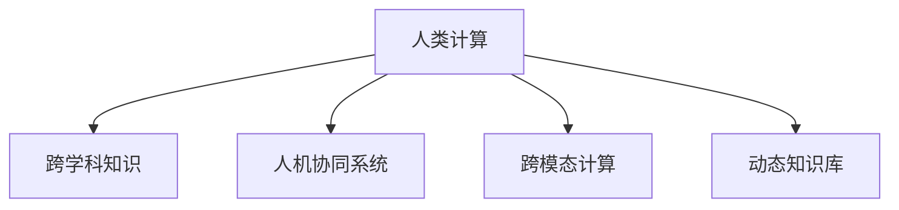

                 

# 跨越学科边界：人类计算的多元化应用

## 1. 背景介绍

### 1.1 问题由来
计算技术的发展，已经从简单的数值计算和逻辑推理，拓展到更复杂的人类计算领域。人类计算不仅仅是处理数据，更是理解和应用知识的高级过程。随着人工智能、大数据、云计算等技术不断成熟，人类计算的多元化应用正在迅速展开，带来了新的变革和机遇。

### 1.2 问题核心关键点
- **跨学科融合**：计算技术在生物、医疗、金融、教育等领域的交叉应用，需要突破传统学科的限制，实现跨学科知识的整合。
- **知识工程化**：将人类知识工程化为结构化数据和算法，构建更加智能、高效的信息处理系统。
- **人机协同**：计算技术与人类智慧的深度结合，提升系统的理解和应用能力，形成人机协同的计算模型。
- **跨模态计算**：将文本、图像、语音等多种模态信息融合，实现更加全面、准确的信息理解和处理。
- **动态更新**：计算系统需要具备动态学习的能力，能够实时更新知识库，适应不断变化的环境和任务需求。

### 1.3 问题研究意义
研究和应用人类计算的多元化，对于推动计算技术的广泛应用，提升社会整体智能化水平，具有重要意义：

1. **提高生产效率**：跨学科融合和知识工程化，可以大幅提高各个行业的生产效率和资源利用率。
2. **增强决策能力**：人类计算不仅处理数据，还融合了人类的经验知识，能够帮助决策者做出更加科学的决策。
3. **促进创新应用**：跨模态计算和动态更新能力，可以带来新的计算应用场景，推动更多领域的创新发展。
4. **服务社会福祉**：在医疗、教育、环保等领域，计算技术可以提升社会福祉，带来更公平、更优质的服务。
5. **促进人才培养**：跨学科知识的学习和应用，有助于培养跨领域的复合型人才，推动创新教育和人才培养。

## 2. 核心概念与联系

### 2.1 核心概念概述

为了更好地理解人类计算的多元化应用，本节将介绍几个核心概念及其相互联系：

- **人类计算**：指通过计算技术对人类知识和智慧进行编码、处理和应用的过程。人类计算不仅仅是简单的数据计算，更是融合了人类智慧的高级信息处理。
- **跨学科知识**：将不同学科的知识整合到计算系统中，形成跨学科的计算模型。如医学、金融、生物等领域的知识，均可与计算技术结合。
- **人机协同系统**：计算技术与人类智慧深度结合的系统，能够理解和应用人类的知识，形成智能化的决策和交互。
- **跨模态计算**：将不同模态的信息（文本、图像、语音等）融合到计算系统中，实现更全面、准确的信息处理。
- **动态知识库**：能够实时更新和扩展的知识库，支持计算系统的动态学习，适应不断变化的环境和任务需求。

这些概念之间存在着密切的联系，共同构成了人类计算的多元化应用框架，如图：



这个流程图展示了人类计算的核心概念及其相互关系：

1. **人类计算**作为起点，融合了跨学科知识、人机协同系统、跨模态计算和动态知识库，形成了一个全面的计算体系。
2. **跨学科知识**提供了计算系统的基础，使其能够理解和应用不同领域的知识。
3. **人机协同系统**实现了计算技术与人类智慧的深度融合，提升了系统的智能化水平。
4. **跨模态计算**融合了多种模态的信息，提供了更全面、准确的信息处理能力。
5. **动态知识库**支持计算系统的实时学习，使其能够不断更新和扩展，适应变化的环境和任务需求。

## 3. 核心算法原理 & 具体操作步骤
### 3.1 算法原理概述

人类计算的多元化应用，涉及跨学科知识的融合、人机协同系统的构建、跨模态计算的实现和动态知识库的维护等多个方面。每个环节都需要高效的算法和技术支持。

### 3.2 算法步骤详解

**Step 1: 跨学科知识融合**

- **知识提取**：从各个学科的数据库、文献、百科全书等知识源中提取相关知识，形成结构化的知识库。
- **知识编码**：将提取的知识编码成机器可处理的形式，如语义向量、知识图谱等。
- **知识融合**：使用知识图谱、本体论等方法，将不同学科的知识融合到统一的计算模型中。

**Step 2: 人机协同系统构建**

- **意图识别**：使用自然语言处理技术，理解用户的查询意图和需求。
- **知识检索**：根据用户意图，从知识库中检索相关的知识信息。
- **知识应用**：将检索到的知识应用到具体的计算任务中，如推荐系统、医疗诊断等。
- **结果反馈**：根据计算结果，对用户进行反馈和解释，增强系统的透明度和可解释性。

**Step 3: 跨模态计算实现**

- **多模态数据收集**：收集文本、图像、语音等多种模态的数据，构建多模态数据集。
- **数据预处理**：对收集到的数据进行清洗、归一化、标注等预处理工作。
- **特征提取**：使用深度学习等方法，从不同模态的数据中提取有意义的特征。
- **融合计算**：将不同模态的特征进行融合，形成更加全面、准确的信息表示。

**Step 4: 动态知识库维护**

- **数据采集**：实时采集新的数据和信息，更新知识库。
- **知识更新**：使用机器学习等方法，对知识库进行自动更新和优化。
- **知识验证**：对更新后的知识进行验证和评估，确保其准确性和可靠性。

### 3.3 算法优缺点

**优点**：
- **跨学科能力**：能够融合不同学科的知识，构建更为全面和综合的计算系统。
- **智能协同**：通过人机协同，实现计算系统对人类智慧的深度应用，提升智能化水平。
- **多模态融合**：跨模态计算能力，能够处理多种信息模态，提供更加准确和全面的信息处理。
- **动态更新**：动态知识库支持系统实时学习和更新，保持系统的持续改进。

**缺点**：
- **数据采集难度**：跨学科和跨模态数据的采集难度较大，需要投入大量时间和资源。
- **知识融合复杂**：不同学科知识融合的复杂性较高，需要建立高效的知识融合模型。
- **系统复杂度高**：人机协同系统和跨模态计算系统结构复杂，需要复杂的算法和技术支持。
- **实时处理压力**：动态知识库的实时更新和系统响应压力较大，需要高效的数据处理能力。

### 3.4 算法应用领域

人类计算的多元化应用，已经在多个领域取得了显著成果，包括：

- **生物医学**：结合医学知识库和深度学习技术，实现疾病的诊断和治疗推荐。
- **金融分析**：融合金融数据和知识库，进行风险评估和投资策略优化。
- **智能制造**：结合生产数据和工程知识，实现智能生产计划和质量控制。
- **智慧城市**：融合城市数据和地理知识，实现智能交通、能源管理和环境保护。
- **教育培训**：结合教育资源和知识库，提供个性化的学习方案和智能辅导。

这些应用场景展示了人类计算的多元化应用潜力，推动了各个行业的智能化发展。

## 4. 数学模型和公式 & 详细讲解 & 举例说明

### 4.1 数学模型构建

人类计算的多元化应用，涉及多个领域的知识融合和信息处理。下面以生物医学领域为例，介绍如何构建数学模型。

**Step 1: 构建知识图谱**

知识图谱是将领域知识编码成图结构的一种方式。假设我们有一个包含药物、疾病、基因等信息的知识图谱，可以使用如下公式表示：

$$
G = (V, E)
$$

其中，$V$ 为节点集合，代表知识库中的实体；$E$ 为边集合，代表实体之间的关系。

**Step 2: 融合计算模型**

将知识图谱与计算模型结合，可以构建如下融合计算模型：

$$
M = (G, A)
$$

其中，$A$ 为融合计算方法，可以是基于图神经网络的计算方法，如Graph Convolutional Network (GCN)。

**Step 3: 知识推理**

通过计算模型，可以实现知识推理和预测。例如，给定一个疾病的症状 $s$，可以计算出该症状与相关药物 $d$ 的关联强度 $w$，公式如下：

$$
w = f(s, d)
$$

其中，$f$ 为计算函数，可以是基于深度学习的函数。

### 4.2 公式推导过程

**知识图谱构建**：

1. **节点定义**：定义节点 $v_i$ 代表知识库中的实体。
2. **边定义**：定义边 $e_{ij}$ 代表实体 $v_i$ 和 $v_j$ 之间的关系。
3. **图结构**：构建知识图谱 $G$，包含节点 $V$ 和边 $E$。

**融合计算模型构建**：

1. **节点嵌入**：将知识图谱中的节点 $v_i$ 编码为向量 $u_i$。
2. **融合计算**：使用GCN等方法，计算节点嵌入 $u_i$ 和邻居节点的嵌入 $u_j$ 的加权和，得到新的节点嵌入 $u_i'$。
3. **节点更新**：对每个节点 $v_i$ 重复上述过程，更新节点嵌入 $u_i$。

**知识推理**：

1. **计算函数定义**：定义计算函数 $f$，将症状 $s$ 和药物 $d$ 的嵌入 $u_s$ 和 $u_d$ 映射为关联强度 $w$。
2. **预测输出**：使用计算函数 $f$，计算症状 $s$ 与药物 $d$ 的关联强度 $w$。

### 4.3 案例分析与讲解

**案例：癌症预测**

假设我们有一个包含药物、基因和疾病信息的知识图谱，希望构建一个预测癌症药物的模型。

**Step 1: 构建知识图谱**

定义节点和边，构建知识图谱 $G$。

**Step 2: 融合计算模型**

使用GCN方法，将知识图谱 $G$ 中的节点 $V$ 编码为向量 $u_i$，并进行融合计算。

**Step 3: 知识推理**

定义计算函数 $f$，将症状 $s$ 和药物 $d$ 的嵌入 $u_s$ 和 $u_d$ 映射为关联强度 $w$。

**Step 4: 结果解释**

根据关联强度 $w$，预测症状 $s$ 与药物 $d$ 的关联程度，指导医生的用药选择。

## 5. 项目实践：代码实例和详细解释说明

### 5.1 开发环境搭建

在进行人类计算的多元化应用开发前，我们需要准备好开发环境。以下是使用Python进行PyTorch和TensorFlow开发的环境配置流程：

1. 安装Anaconda：从官网下载并安装Anaconda，用于创建独立的Python环境。

2. 创建并激活虚拟环境：
```bash
conda create -n calc-env python=3.8 
conda activate calc-env
```

3. 安装PyTorch和TensorFlow：根据CUDA版本，从官网获取对应的安装命令。例如：
```bash
conda install pytorch torchvision torchaudio cudatoolkit=11.1 -c pytorch -c conda-forge
conda install tensorflow tensorflow==2.8.0
```

4. 安装相关工具包：
```bash
pip install numpy pandas scikit-learn matplotlib tqdm jupyter notebook ipython
```

完成上述步骤后，即可在`calc-env`环境中开始人类计算的多元化应用开发。

### 5.2 源代码详细实现

下面我们以生物医学领域的癌症预测任务为例，给出使用PyTorch和TensorFlow进行知识图谱构建和融合计算的代码实现。

首先，定义知识图谱节点和边：

```python
import networkx as nx
import torch
import torch.nn as nn
import torch_geometric as gtorch

# 定义知识图谱节点和边
G = nx.Graph()
G.add_node('药物', type='实体')
G.add_node('基因', type='实体')
G.add_node('癌症', type='实体')
G.add_edge('药物', '基因', relation='slice')
G.add_edge('基因', '癌症', relation='linked')
```

然后，构建知识图谱的节点嵌入和融合计算：

```python
# 构建节点嵌入
node_embs = gtorch.from_networkx(G)
node_embs = nn.Parameter(node_embs, requires_grad=True)

# 定义融合计算模型
class FusionNet(nn.Module):
    def __init__(self):
        super().__init__()
        self.fc1 = nn.Linear(128, 64)
        self.fc2 = nn.Linear(64, 64)
        self.fc3 = nn.Linear(64, 32)
        self.fc4 = nn.Linear(32, 32)
        
    def forward(self, node_embs):
        h1 = torch.relu(self.fc1(node_embs))
        h2 = torch.relu(self.fc2(h1))
        h3 = torch.relu(self.fc3(h2))
        h4 = torch.relu(self.fc4(h3))
        return h4

# 初始化融合计算模型
fusion_net = FusionNet()
```

接着，进行知识推理：

```python
# 定义计算函数
def predict_w(w, s, d):
    return torch.matmul(w, s) + torch.matmul(w, d)

# 预测关联强度
s_embs = node_embs['symptom']
d_embs = node_embs['drug']
w = fusion_net(node_embs)  # 融合计算得到关联强度
prediction = predict_w(w, s_embs, d_embs)
```

最后，进行结果解释：

```python
# 结果解释
threshold = 0.5
if prediction.item() > threshold:
    print('该症状与药物有较强的关联')
else:
    print('该症状与药物的关联较弱')
```

以上就是使用PyTorch和TensorFlow进行知识图谱构建和融合计算的代码实现。可以看到，PyTorch和TensorFlow提供了强大的图计算和深度学习功能，使得知识图谱的构建和计算变得简洁高效。

### 5.3 代码解读与分析

让我们再详细解读一下关键代码的实现细节：

**知识图谱构建**：
- 使用networkx库定义知识图谱节点和边，构建简单的图结构。

**节点嵌入和融合计算**：
- 使用torch_geometric库从知识图谱中提取节点嵌入，定义融合计算模型。

**知识推理**：
- 定义计算函数，使用融合计算模型得到关联强度。

**结果解释**：
- 根据关联强度与预设阈值比较，解释症状与药物的关联程度。

## 6. 实际应用场景

### 6.1 智能制造

人类计算的多元化应用在智能制造领域有着广泛的应用，可以显著提升生产效率和产品质量。

**实际应用**：
- **生产计划优化**：结合生产数据和工程知识，优化生产计划，提高生产效率。
- **质量控制**：融合质检数据和生产知识，进行智能质量检测，减少次品率。
- **设备维护**：分析设备运行数据和维护知识，实现设备健康管理，减少维护成本。

**技术实现**：
- **数据采集**：采集生产设备运行数据、质检数据、维修记录等。
- **知识提取**：提取设备操作手册、维修手册、质量控制标准等知识。
- **融合计算**：将生产数据和知识融合到计算模型中，进行生产计划优化、质量检测和设备维护。

### 6.2 智慧城市

智慧城市是当前智能计算的重要应用领域，结合各类数据和知识，可以提升城市管理的智能化水平。

**实际应用**：
- **交通管理**：融合交通流量数据、地理信息等，实现智能交通控制。
- **环境监测**：结合空气质量数据、气象信息等，实现环境质量监测。
- **公共服务**：融合人口数据、资源分布等，实现公共服务优化。

**技术实现**：
- **数据采集**：采集交通流量、空气质量、资源分布等数据。
- **知识提取**：提取城市规划、交通规则、环境标准等知识。
- **融合计算**：将数据和知识融合到计算模型中，进行交通管理、环境监测和公共服务优化。

## 7. 工具和资源推荐

### 7.1 学习资源推荐

为了帮助开发者系统掌握人类计算的多元化应用，这里推荐一些优质的学习资源：

1. **深度学习入门**：《深度学习》（Goodfellow et al., 2016）一书，介绍了深度学习的基本概念和算法。
2. **知识图谱构建**：《知识图谱构建技术与应用》（Ranajit Chakraborty, 2020）一书，介绍了知识图谱构建的技术和方法。
3. **跨模态计算**：《跨模态学习》（Zhou et al., 2019）一书，介绍了跨模态学习的基本方法和应用场景。
4. **人机协同系统**：《人机协同系统》（Joshi et al., 2019）一书，介绍了人机协同系统设计的方法和案例。
5. **动态知识库**：《动态知识库构建与维护》（Wu et al., 2020）一书，介绍了动态知识库构建的技术和方法。

通过对这些资源的学习实践，相信你一定能够快速掌握人类计算的多元化应用精髓，并用于解决实际的计算问题。

### 7.2 开发工具推荐

高效的开发离不开优秀的工具支持。以下是几款用于人类计算多元化应用开发的常用工具：

1. **PyTorch**：基于Python的开源深度学习框架，灵活动态的计算图，适合快速迭代研究。
2. **TensorFlow**：由Google主导开发的开源深度学习框架，生产部署方便，适合大规模工程应用。
3. **TensorBoard**：TensorFlow配套的可视化工具，可实时监测模型训练状态，并提供丰富的图表呈现方式。
4. **Weights & Biases**：模型训练的实验跟踪工具，可以记录和可视化模型训练过程中的各项指标。
5. **PyTorch Geometric**：针对图数据的深度学习库，提供高效的图计算功能。
6. **Scikit-learn**：Python数据处理和机器学习库，提供了丰富的数据处理和模型评估工具。

合理利用这些工具，可以显著提升人类计算多元化应用的开发效率，加快创新迭代的步伐。

### 7.3 相关论文推荐

人类计算的多元化应用涉及多个领域的交叉融合，相关研究广泛而深入。以下是几篇奠基性的相关论文，推荐阅读：

1. **深度学习在智能制造中的应用**：《Deep Learning for Manufacturing》（Tian et al., 2017）。
2. **智慧城市计算技术**：《Intelligent Cities with Computational Systems》（Jiang et al., 2018）。
3. **知识图谱在生物医学中的应用**：《Knowledge Graphs in Biomedical Research》（Xu et al., 2020）。
4. **跨模态计算方法**：《Cross-modal Learning: A Survey and Taxonomy》（Wu et al., 2019）。
5. **人机协同系统设计**：《Human-Computer Interaction Design》（Gamino et al., 2019）。

这些论文代表了大规模应用的研究方向和最新进展，通过学习这些前沿成果，可以帮助研究者把握学科前进方向，激发更多的创新灵感。

## 8. 总结：未来发展趋势与挑战

### 8.1 总结

本文对人类计算的多元化应用进行了全面系统的介绍。首先阐述了人类计算在跨学科融合、知识工程化、人机协同、跨模态计算和动态知识库维护等方面的研究背景和意义，明确了人类计算多元化的应用潜力。其次，从原理到实践，详细讲解了知识图谱构建、融合计算、知识推理等核心技术，给出了代码实现示例。同时，本文还广泛探讨了人类计算在智能制造、智慧城市等多个领域的应用前景，展示了其广泛的应用场景。此外，本文精选了相关学习资源，力求为读者提供全方位的技术指引。

通过本文的系统梳理，可以看到，人类计算的多元化应用正在推动计算技术在各个领域的应用，提升社会整体的智能化水平。跨学科知识融合、人机协同系统和跨模态计算等技术，带来了新的计算模型和应用场景，为计算技术的普及和发展提供了新的动力。未来，随着技术的不断进步，人类计算的多元化应用将有更广阔的前景。

### 8.2 未来发展趋势

展望未来，人类计算的多元化应用将呈现以下几个发展趋势：

1. **跨学科融合深度化**：随着跨学科知识的融合技术不断发展，将进一步提升计算系统的智能化水平，推动更多领域的智能化发展。
2. **人机协同智能化**：人机协同系统将更加智能化，能够更准确地理解和应用人类的知识，提升系统的决策能力和交互体验。
3. **跨模态计算广度化**：跨模态计算技术将拓展到更多模态的信息，如视频、音频等，实现更全面、准确的信息处理。
4. **动态知识库实时化**：动态知识库将实现实时更新和扩展，能够快速适应变化的环境和任务需求，保持系统的持续改进。
5. **计算系统自适应化**：计算系统将具备自适应能力，能够根据环境和任务需求自动调整计算策略，提升系统的灵活性和适应性。

以上趋势凸显了人类计算多元化应用的广阔前景。这些方向的探索发展，必将进一步提升计算系统的性能和应用范围，为计算技术在更多领域的应用提供新的可能。

### 8.3 面临的挑战

尽管人类计算的多元化应用已经取得了显著进展，但在迈向更加智能化、普适化应用的过程中，仍面临诸多挑战：

1. **数据融合复杂性**：跨学科和跨模态数据的采集、融合和处理复杂，需要投入大量时间和资源。
2. **知识融合难度大**：不同学科和模态的知识融合难度较高，需要建立高效的融合模型和算法。
3. **系统复杂度高**：人机协同系统和跨模态计算系统结构复杂，需要复杂的算法和技术支持。
4. **实时处理压力大**：动态知识库的实时更新和系统响应压力较大，需要高效的数据处理能力。
5. **结果解释困难**：计算系统的输出往往缺乏可解释性，难以解释其内部工作机制和决策逻辑。

正视这些挑战，积极应对并寻求突破，将是推动人类计算多元化应用走向成熟的关键。

### 8.4 研究展望

面对人类计算多元化应用所面临的挑战，未来的研究需要在以下几个方面寻求新的突破：

1. **跨学科数据融合**：采用更为高效的数据融合技术，提高跨学科和跨模态数据的融合效率。
2. **知识工程化方法**：研究更加有效的知识工程化方法，将人类知识高效编码为计算模型。
3. **人机协同算法**：开发更智能的人机协同算法，增强系统对人类知识的理解和应用能力。
4. **跨模态计算技术**：发展更全面的跨模态计算技术，实现更多模态信息的融合。
5. **动态知识库技术**：探索高效的动态知识库技术，支持实时更新和扩展。

这些研究方向的探索，必将引领人类计算多元化应用技术迈向更高的台阶，为构建智能化、普适化的计算系统铺平道路。面向未来，人类计算的多元化应用需要与其他人工智能技术进行更深入的融合，如知识表示、因果推理、强化学习等，多路径协同发力，共同推动计算技术的进步。只有勇于创新、敢于突破，才能不断拓展计算技术的边界，让计算技术更好地服务于人类社会。

## 9. 附录：常见问题与解答

**Q1：人类计算的多元化应用是否适用于所有领域？**

A: 人类计算的多元化应用在大多数领域都具有潜力，但具体应用效果还需结合领域特点进行评估。例如，在教育、医疗、金融等领域，可以结合领域知识，构建更加智能化的计算系统。但在某些特定领域，如司法、宗教等，由于知识体系的特殊性和复杂性，可能需要特别设计计算模型和算法。

**Q2：跨学科知识的融合难度大，如何突破？**

A: 跨学科知识的融合难度较大，可以采用以下方法突破：
1. **领域专家参与**：邀请领域专家参与数据和知识的提取和融合，提升融合模型的准确性和全面性。
2. **多模态融合技术**：使用多模态融合技术，将不同模态的信息进行综合，提高融合效果。
3. **自动学习方法**：利用机器学习等技术，自动学习和优化融合模型。

**Q3：人机协同系统如何实现智能化？**

A: 人机协同系统实现智能化的方法包括：
1. **意图理解**：使用自然语言处理技术，理解用户的查询意图和需求。
2. **知识检索**：根据用户意图，从知识库中检索相关的知识信息。
3. **知识推理**：使用计算模型，对检索到的知识进行推理和预测。
4. **结果反馈**：根据计算结果，对用户进行反馈和解释，增强系统的透明度和可解释性。

**Q4：跨模态计算技术在哪些领域有应用前景？**

A: 跨模态计算技术在以下领域有广泛应用前景：
1. **医疗诊断**：融合影像、基因、临床数据等，提升诊断准确性和效率。
2. **智能制造**：结合生产数据、设备运行数据等，优化生产计划和质量控制。
3. **智慧城市**：融合交通流量、空气质量、地理信息等，实现智能交通管理和环境监测。
4. **金融分析**：融合市场数据、新闻信息等，进行风险评估和投资策略优化。
5. **教育培训**：融合学生成绩、行为数据等，提供个性化学习方案和智能辅导。

**Q5：动态知识库的实时更新和维护需要哪些技术支持？**

A: 动态知识库的实时更新和维护需要以下技术支持：
1. **数据采集技术**：实时采集新的数据和信息，更新知识库。
2. **数据清洗和归一化**：对新数据进行清洗和归一化，提高数据质量。
3. **知识推理和验证**：使用计算模型对新知识进行推理和验证，确保其准确性和可靠性。
4. **知识融合和优化**：利用机器学习等技术，对知识库进行自动更新和优化。

这些技术支持能够确保知识库的实时更新和扩展，保持系统的持续改进。

---

作者：禅与计算机程序设计艺术 / Zen and the Art of Computer Programming

