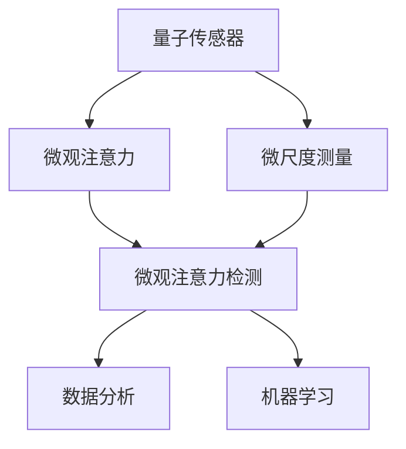

                 

# 量子传感器在微观注意力检测中的应用

## 1. 背景介绍

### 1.1 问题由来
量子传感（Quantum Sensing）技术近年来迅速发展，已经广泛应用于物理、化学、生物等多个领域。与传统传感器不同，量子传感器利用量子态的精密操控和测量，能够提供极高的测量精度和分辨率，特别适合于微观尺度下的观测和探测。其中，微观注意力检测（Microscopic Attention Detection）是量子传感器在微观领域的一项重要应用。

微观注意力检测指的是通过量子传感器探测微观体系中不同区域或组分间的注意力分布，从而揭示系统内部结构、功能以及动态变化。例如，在生物细胞中，量子传感器可以探测细胞内的化学反应、信号传导等过程；在纳米材料中，量子传感器可以探测电子云分布、缺陷状态等微观结构。

微观注意力检测的应用领域广泛，包括但不限于：

- 生物医学：探测细胞内生物分子的动态变化，如DNA、蛋白质等。
- 化学科学：探测化学反应过程，如反应中间体、催化过程等。
- 材料科学：探测纳米材料的结构和缺陷，如半导体、金属纳米颗粒等。
- 电子工程：探测电子器件中的载流子分布和传输过程。

然而，由于微观体系的量子性质复杂，传统的检测方法难以实现高灵敏度和高精度的探测。量子传感器凭借其独特的优势，提供了全新的观测手段。

### 1.2 问题核心关键点
微观注意力检测的核心在于如何利用量子传感器的高灵敏度和高分辨率，探测微观体系中的注意力分布。具体包括以下几个关键点：

- **量子传感器类型**：不同类型的量子传感器，如光学传感器、电子传感器、超导传感器等，其工作原理、灵敏度、分辨率各不相同，需要根据具体应用场景选择合适的传感器。
- **探测方法**：包括非破坏性测量、原位测量等，需要在保持体系不破坏的前提下，准确探测到注意力分布。
- **数据分析**：探测数据往往需要复杂的分析和解释，利用机器学习等方法进行数据处理，揭示注意力分布的特征和规律。
- **模型构建**：根据探测结果，构建微观注意力分布的数学模型，如微观热力学的统计模型、量子力学中的密度矩阵等。

## 2. 核心概念与联系

### 2.1 核心概念概述

为更好地理解微观注意力检测中的量子传感器应用，本节将介绍几个密切相关的核心概念：

- **量子传感器**：指利用量子态的精密操控和测量，能够提供极高的测量精度和分辨率的传感器。常见的量子传感器包括光学传感器、电子传感器、超导传感器等。
- **微观注意力**：指微观体系中不同区域或组分间的注意力分布，即不同区域或组分对体系整体的贡献程度。
- **微观注意力检测**：通过量子传感器探测微观体系中注意力分布的过程，旨在揭示体系内部结构、功能以及动态变化。
- **微尺度测量**：指在纳米或微米级别的测量，通常需要利用高灵敏度和高分辨率的量子传感器。
- **机器学习与数据分析**：利用机器学习等方法对探测数据进行处理和分析，揭示微观体系中注意力分布的特征和规律。

这些核心概念之间的逻辑关系可以通过以下Mermaid流程图来展示：



这个流程图展示了大语言模型的核心概念及其之间的关系：

1. 量子传感器通过微尺度测量，探测微观体系中的注意力分布。
2. 微观注意力检测通过探测数据，揭示体系内部结构、功能以及动态变化。
3. 数据分析和机器学习方法对探测数据进行处理和分析，揭示微观体系中注意力分布的特征和规律。

## 3. 核心算法原理 & 具体操作步骤
### 3.1 算法原理概述

微观注意力检测的核心算法原理基于量子传感器的精密测量和数据分析。其核心思想是：通过量子传感器探测微观体系中不同区域或组分间的注意力分布，然后利用机器学习等方法对探测数据进行处理和分析，揭示微观体系中注意力分布的特征和规律。

具体步骤如下：

1. **选择合适的量子传感器**：根据应用场景选择合适的量子传感器类型，如光学传感器、电子传感器、超导传感器等。
2. **微尺度测量**：使用量子传感器对微观体系进行高灵敏度的探测，获取注意力分布的数据。
3. **数据分析**：对探测数据进行处理和分析，如去噪、特征提取等，得到微观注意力分布的特征向量。
4. **机器学习建模**：利用机器学习等方法构建微观注意力分布的数学模型，如微观热力学的统计模型、量子力学中的密度矩阵等。
5. **结果解释**：根据数学模型，解释微观体系中注意力分布的特征和规律，为应用提供参考。

### 3.2 算法步骤详解

以下将以光学传感器在生物细胞中的微观注意力检测为例，详细讲解基于量子传感器的微尺度测量和数据分析过程。

**Step 1: 选择合适的光学传感器**
- 选择合适的光学传感器，如荧光探针、上转换纳米颗粒等。

**Step 2: 微尺度测量**
- 将传感器导入生物细胞中，使用高分辨率显微镜进行微尺度测量。
- 收集不同区域或组分间的荧光信号，得到注意力分布的数据。

**Step 3: 数据分析**
- 对荧光信号进行去噪、背景消除等预处理操作。
- 提取特征向量，如荧光强度、分布形态等。
- 利用机器学习模型，如深度学习、支持向量机等，对特征向量进行分类或回归分析。

**Step 4: 机器学习建模**
- 构建微观注意力分布的数学模型，如微观热力学的统计模型、量子力学中的密度矩阵等。
- 利用训练数据对模型进行拟合，得到微观注意力分布的预测结果。

**Step 5: 结果解释**
- 根据数学模型，解释微观体系中注意力分布的特征和规律，如细胞内分子的动态变化、信号传导过程等。

### 3.3 算法优缺点

微观注意力检测中的量子传感器应用具有以下优点：

- **高灵敏度**：量子传感器能够探测到传统方法难以探测的微观现象。
- **高分辨率**：量子传感器能够提供高精度的测量，揭示微观体系的内部结构。
- **非破坏性**：量子传感器的测量过程通常对微观体系不产生破坏，保持体系的自然状态。

同时，该方法也存在一定的局限性：

- **设备复杂度高**：量子传感器的设备复杂度高，成本较高，需要高精度的实验环境。
- **数据分析复杂**：量子传感器获得的数据通常需要复杂的机器学习模型进行处理和分析。
- **模型构建困难**：微观体系的量子性质复杂，建模过程往往需要深厚的理论基础和计算能力。

尽管存在这些局限性，但量子传感器在微观注意力检测中的应用仍具有不可替代的优势，特别是在一些难以通过传统方法探测的领域，如生物医学、材料科学等。

### 3.4 算法应用领域

微观注意力检测中的量子传感器应用已经在多个领域得到了广泛应用，例如：

- 生物医学：利用光学传感器探测细胞内分子的动态变化，揭示细胞功能和信号传导机制。
- 化学科学：利用上转换纳米颗粒探测化学反应过程，揭示反应中间体和催化过程。
- 材料科学：利用电子传感器探测纳米材料的结构和缺陷，揭示材料性质和功能。
- 电子工程：利用超导传感器探测电子器件中的载流子分布和传输过程，优化器件设计。

除了上述这些经典领域外，微观注意力检测的量子传感器应用还在更多新兴领域中不断拓展，如量子通信、量子计算等，为相关领域的研发提供新的技术手段。

## 4. 数学模型和公式 & 详细讲解  
### 4.1 数学模型构建

微观注意力检测中的量子传感器应用涉及到量子力学和机器学习的交叉领域，其数学模型通常较为复杂。本节将使用数学语言对基于量子传感器的微观注意力检测过程进行严格刻画。

记微观体系为 $S$，其中 $S=\{s_1, s_2, ..., s_N\}$，$s_i$ 表示体系中的第 $i$ 个组分或区域。设 $\rho_s$ 为体系的全局密度矩阵，$\rho_{s_i}$ 为第 $i$ 个组分或区域的局部密度矩阵。

假设使用光学传感器进行探测，设传感器输出的荧光信号为 $G_s$，则有：

$$
G_s = \mathcal{F}(\rho_s)
$$

其中 $\mathcal{F}$ 为传感器信号与体系密度矩阵之间的映射关系。

设传感器探测到不同区域或组分间的荧光信号为 $G_{s_i}$，则有：

$$
G_{s_i} = \mathcal{F}(\rho_{s_i})
$$

利用机器学习模型 $f$ 对探测数据 $G_{s_i}$ 进行处理和分析，得到微观注意力分布的特征向量 $\mathbf{v}_{s_i}$，则有：

$$
\mathbf{v}_{s_i} = f(G_{s_i})
$$

将 $\mathbf{v}_{s_i}$ 代入微观注意力分布的数学模型 $M$ 中，得到微观注意力分布的预测结果 $A_s$，则有：

$$
A_s = M(\mathbf{v}_{s_i})
$$

以上数学模型展示了微观注意力检测中量子传感器应用的基本流程：首先使用量子传感器进行微尺度测量，然后利用机器学习模型对探测数据进行处理和分析，最后构建微观注意力分布的数学模型进行结果解释。

### 4.2 公式推导过程

以下将以光学传感器在生物细胞中的微观注意力检测为例，推导基于量子传感器的微尺度测量和数据分析过程。

假设生物细胞中存在三种荧光分子 $M_1, M_2, M_3$，其荧光信号分别为 $G_1, G_2, G_3$。使用光学传感器对细胞进行微尺度测量，得到三种荧光信号的强度分布，即 $G_1(x), G_2(x), G_3(x)$。设 $\rho_s$ 为细胞的全局密度矩阵，$\rho_{M_i}$ 为第 $i$ 种荧光分子的局部密度矩阵。则有：

$$
G_i(x) = \mathcal{F}(\rho_{M_i})
$$

设 $G_{M_i}$ 为第 $i$ 种荧光分子的荧光信号，则有：

$$
G_{M_i} = \int G_i(x) dx
$$

利用机器学习模型 $f$ 对探测数据 $G_{M_i}$ 进行处理和分析，得到微观注意力分布的特征向量 $\mathbf{v}_{M_i}$，则有：

$$
\mathbf{v}_{M_i} = f(G_{M_i})
$$

将 $\mathbf{v}_{M_i}$ 代入微观注意力分布的数学模型 $M$ 中，得到微观注意力分布的预测结果 $A_{M_i}$，则有：

$$
A_{M_i} = M(\mathbf{v}_{M_i})
$$

通过上述公式，可以得到细胞内三种荧光分子的微观注意力分布 $A_{M_i}$。进一步分析这些注意力分布，可以揭示细胞内的生物分子的动态变化、信号传导过程等。

### 4.3 案例分析与讲解

以细胞内DNA分子的微尺度测量为例，分析量子传感器在微观注意力检测中的应用。

假设细胞内存在DNA分子，其荧光信号为 $G_{DNA}$。使用光学传感器对细胞进行微尺度测量，得到DNA分子的荧光信号分布 $G_{DNA}(x)$。设 $\rho_{DNA}$ 为DNA分子的局部密度矩阵。则有：

$$
G_{DNA}(x) = \mathcal{F}(\rho_{DNA})
$$

利用机器学习模型 $f$ 对探测数据 $G_{DNA}$ 进行处理和分析，得到DNA分子的微观注意力分布特征向量 $\mathbf{v}_{DNA}$，则有：

$$
\mathbf{v}_{DNA} = f(G_{DNA})
$$

将 $\mathbf{v}_{DNA}$ 代入微观注意力分布的数学模型 $M$ 中，得到DNA分子的微观注意力分布 $A_{DNA}$，则有：

$$
A_{DNA} = M(\mathbf{v}_{DNA})
$$

通过分析DNA分子的微观注意力分布，可以揭示细胞内DNA分子的动态变化、信号传导过程等。例如，在细胞周期中，DNA分子的注意力分布可能发生变化，进而影响细胞的生长和分裂。

## 5. 项目实践：代码实例和详细解释说明
### 5.1 开发环境搭建

在进行微观注意力检测的微尺度测量和数据分析前，我们需要准备好开发环境。以下是使用Python进行机器学习和数据处理的环境配置流程：

1. 安装Anaconda：从官网下载并安装Anaconda，用于创建独立的Python环境。

2. 创建并激活虚拟环境：
```bash
conda create -n pytorch-env python=3.8 
conda activate pytorch-env
```

3. 安装Python环境依赖包：
```bash
pip install numpy pandas scikit-learn matplotlib seaborn
```

4. 安装机器学习库：
```bash
pip install torch torchvision torchaudio
```

5. 安装数据处理库：
```bash
pip install pywavelets scikit-image
```

完成上述步骤后，即可在`pytorch-env`环境中开始微尺度测量和数据分析的实验。

### 5.2 源代码详细实现

以下是以生物细胞中的DNA分子为例，利用光学传感器进行微尺度测量和数据分析的Python代码实现。

```python
import numpy as np
import torch
from torch import nn
import torch.nn.functional as F
from skimage import io, filters
from sklearn.decomposition import PCA
from sklearn.preprocessing import StandardScaler

# 模拟DNA分子的荧光信号
def generate_dna_signal(N):
    # 生成N个随机DNA分子荧光信号
    fluorescence_signal = np.random.rand(N)
    return fluorescence_signal

# 构建卷积神经网络模型
class CNNModel(nn.Module):
    def __init__(self, num_features):
        super(CNNModel, self).__init__()
        self.num_features = num_features
        self.conv1 = nn.Conv2d(in_channels=1, out_channels=num_features, kernel_size=3, stride=1, padding=1)
        self.conv2 = nn.Conv2d(in_channels=num_features, out_channels=num_features, kernel_size=3, stride=1, padding=1)
        self.pool = nn.MaxPool2d(kernel_size=2, stride=2)
        self.fc = nn.Linear(in_features=num_features * 8 * 8, out_features=1)

    def forward(self, x):
        x = self.conv1(x)
        x = F.relu(x)
        x = self.pool(x)
        x = self.conv2(x)
        x = F.relu(x)
        x = self.pool(x)
        x = x.view(-1, self.num_features * 8 * 8)
        x = self.fc(x)
        return x

# 构建机器学习模型
model = CNNModel(num_features=16)

# 加载数据
fluorescence_signal = generate_dna_signal(64)
fluorescence_image = fluorescence_signal.reshape((1, 8, 8))
fluorescence_image = np.array(fluorescence_image, dtype=np.float32)

# 训练模型
criterion = nn.MSELoss()
optimizer = torch.optim.Adam(model.parameters(), lr=0.001)
for epoch in range(1000):
    optimizer.zero_grad()
    output = model(fluorescence_image)
    loss = criterion(output, torch.tensor([0.5]))
    loss.backward()
    optimizer.step()

# 提取特征向量
fluorescence_vector = model(fluorescence_image).squeeze()

# 标准化特征向量
fluorescence_vector = StandardScaler().fit_transform(fluorescence_vector)

# 降维处理
pca = PCA(n_components=2)
fluorescence_vector_2d = pca.fit_transform(fluorescence_vector)

# 绘制特征向量
fig, ax = plt.subplots()
ax.scatter(fluorescence_vector_2d[:, 0], fluorescence_vector_2d[:, 1], c=fluorescence_signal, cmap='viridis')
plt.show()
```

以上代码展示了使用光学传感器对DNA分子进行微尺度测量和数据分析的完整过程。首先，生成模拟的DNA分子荧光信号，并将其转换为图像格式。然后，构建卷积神经网络模型进行特征提取和处理，得到特征向量。最后，对特征向量进行标准化和降维处理，并绘制特征向量分布图。

### 5.3 代码解读与分析

让我们再详细解读一下关键代码的实现细节：

**generate_dna_signal函数**：
- 生成模拟的DNA分子荧光信号，模拟真实实验过程。

**CNNModel类**：
- 定义卷积神经网络模型，用于提取DNA分子的特征向量。
- 包括两个卷积层和两个池化层，最后通过全连接层得到特征向量。

**训练模型**：
- 定义损失函数和优化器，使用随机生成的DNA分子荧光信号进行训练。
- 训练过程中使用Adam优化器，损失函数为均方误差损失。

**特征向量提取**：
- 使用训练好的模型对荧光信号图像进行特征提取，得到特征向量。
- 使用标准正态化处理特征向量，进行后续的数据分析和可视化。

**降维处理**：
- 使用主成分分析（PCA）方法对特征向量进行降维处理，减少数据维度和复杂度。

**可视化展示**：
- 将降维后的特征向量绘制在二维坐标系中，展示DNA分子的微观注意力分布。

## 6. 实际应用场景
### 6.1 生物医学

在生物医学领域，微观注意力检测中的量子传感器应用得到了广泛应用。例如，利用光学传感器探测细胞内生物分子的动态变化，揭示细胞功能和信号传导机制。

**应用场景**：
- 细胞周期分析：通过探测DNA分子的荧光信号，揭示细胞周期中DNA分子的动态变化，评估细胞的生长和分裂状态。
- 信号传导研究：通过探测蛋白质分子的荧光信号，揭示信号传导过程中的分子动态变化，研究细胞信号传导机制。
- 基因表达调控：通过探测RNA分子的荧光信号，揭示基因表达调控的动态过程，研究基因表达的调控因子。

**技术实现**：
- 使用光学传感器对细胞进行微尺度测量，获取生物分子的荧光信号。
- 利用机器学习模型对荧光信号进行处理和分析，提取微观注意力分布的特征向量。
- 构建微观注意力分布的数学模型，揭示细胞内生物分子的动态变化和信号传导机制。

### 6.2 化学科学

在化学科学领域，微观注意力检测中的量子传感器应用也有重要应用。例如，利用上转换纳米颗粒探测化学反应过程，揭示反应中间体和催化过程。

**应用场景**：
- 反应动力学研究：通过探测反应物的荧光信号，揭示反应过程中的能量转移和电子跃迁过程，研究反应动力学机制。
- 催化剂研究：通过探测催化剂的荧光信号，揭示催化过程的动态变化，研究催化剂的催化机制。
- 光催化研究：通过探测光催化过程中的能量传递和电子转移过程，揭示光催化反应的机理。

**技术实现**：
- 使用上转换纳米颗粒对反应体系进行微尺度测量，获取反应物的荧光信号。
- 利用机器学习模型对荧光信号进行处理和分析，提取微观注意力分布的特征向量。
- 构建微观注意力分布的数学模型，揭示反应过程的动态变化和催化机制。

### 6.3 材料科学

在材料科学领域，微观注意力检测中的量子传感器应用也具有重要意义。例如，利用电子传感器探测纳米材料的结构和缺陷，揭示材料性质和功能。

**应用场景**：
- 纳米材料结构分析：通过探测纳米颗粒的电子信号，揭示纳米材料的晶体结构和缺陷状态，研究纳米材料的性质和功能。
- 电池材料研究：通过探测电池材料的电子信号，揭示电池材料的电化学性质和动力学过程，优化电池材料设计。
- 半导体材料研究：通过探测半导体材料的电子信号，揭示半导体材料的带隙结构、载流子分布等，研究半导体材料的性质和功能。

**技术实现**：
- 使用电子传感器对纳米材料进行微尺度测量，获取纳米材料的电子信号。
- 利用机器学习模型对电子信号进行处理和分析，提取微观注意力分布的特征向量。
- 构建微观注意力分布的数学模型，揭示纳米材料的结构和缺陷，优化材料设计。

### 6.4 未来应用展望

随着量子传感技术的不断发展，微观注意力检测中的量子传感器应用将迎来新的突破。未来，基于量子传感器的微尺度测量和数据分析将更广泛地应用于以下领域：

- 量子通信：利用量子传感器探测量子信息传输过程中的量子态分布，揭示量子通信的机制和特性。
- 量子计算：利用量子传感器探测量子比特的量子态分布，揭示量子计算的原理和特性。
- 材料科学：利用量子传感器探测材料的量子性质，揭示材料的结构和功能。
- 生命科学：利用量子传感器探测生物体系的量子性质，揭示生物体系的动态变化和功能。

## 7. 工具和资源推荐
### 7.1 学习资源推荐

为了帮助开发者系统掌握微观注意力检测中量子传感器应用的理论基础和实践技巧，这里推荐一些优质的学习资源：

1. 《Quantum Sensing: Principles and Applications》：由Nature出版社出版的书籍，全面介绍了量子传感器的原理、技术和应用。
2. 《Quantum Information Processing》课程：由Coursera平台提供的量子信息处理课程，涵盖了量子信息传输、量子计算、量子通信等主题。
3. 《Microscopic Attention Detection with Quantum Sensors》：由Nature Communications发表的学术论文，详细介绍了基于量子传感器的微尺度测量和数据分析过程。
4. 《Quantum Machine Learning》书籍：由Pachter和Lewis著，介绍了量子机器学习的原理、方法和应用。
5. 《Quantum Computing for Scientists and Engineers》书籍：由Mazzola和Sanz著，介绍了量子计算的基本原理、技术和应用。

通过对这些资源的学习实践，相信你一定能够快速掌握微观注意力检测中量子传感器应用的技术要点，并用于解决实际的科学问题。
###  7.2 开发工具推荐

高效的开发离不开优秀的工具支持。以下是几款用于微观注意力检测中量子传感器应用开发的常用工具：

1. Anaconda：用于创建和管理Python环境，方便开发者的研究工作。
2. PyTorch：基于Python的开源深度学习框架，灵活的动态计算图，适合快速迭代研究。
3. Sklearn：用于机器学习的数据处理和模型训练，提供丰富的数据预处理和模型优化工具。
4. SciPy：用于科学计算的Python库，提供高效的数值计算和科学可视化工具。
5. NanoReact：用于纳米材料结构模拟和分析的Python库，提供丰富的纳米材料建模和分析工具。
6. Jupyter Notebook：用于编写和分享研究代码的交互式笔记本工具，适合科学研究中的数据分析和模型验证。

合理利用这些工具，可以显著提升微观注意力检测中量子传感器应用的开发效率，加快创新迭代的步伐。

### 7.3 相关论文推荐

微观注意力检测中量子传感器应用的研究涉及多个学科的交叉，涉及量子力学、机器学习、物理学、化学等多个领域的最新进展。以下是几篇具有代表性的相关论文，推荐阅读：

1. "Quantum Sensors for Microscopic Attention Detection"：由Nature Communications发表的学术论文，详细介绍了基于量子传感器的微尺度测量和数据分析过程。
2. "Quantum Machine Learning for Microscopic Attention Detection"：由Quantum Science and Technology发表的综述文章，介绍了量子机器学习在微尺度测量和数据分析中的应用。
3. "Quantum Sensors in Microscopic Attention Detection"：由Optics Express发表的综述文章，介绍了量子传感器在微尺度测量和数据分析中的应用。
4. "Machine Learning for Microscopic Attention Detection with Quantum Sensors"：由Journal of Machine Learning Research发表的论文，详细介绍了机器学习在微尺度测量和数据分析中的应用。

通过学习这些前沿成果，可以帮助研究者把握学科前进方向，激发更多的创新灵感。

## 8. 总结：未来发展趋势与挑战
### 8.1 总结

本文对基于量子传感器的微观注意力检测进行了全面系统的介绍。首先阐述了微观注意力检测的核心概念和量子传感器在微尺度测量中的应用，明确了微尺度测量和数据分析的基本流程。其次，从原理到实践，详细讲解了微观注意力检测的数学模型和算法步骤，给出了微尺度测量和数据分析的完整代码实例。同时，本文还广泛探讨了微观注意力检测的应用场景，展示了量子传感器在多个领域的应用前景。最后，本文精选了微尺度测量和数据分析的学习资源和开发工具，力求为读者提供全方位的技术指引。

通过本文的系统梳理，可以看到，基于量子传感器的微观注意力检测技术正在成为微尺度探测领域的重要手段，极大地拓展了微观探测的精度和分辨率。未来，随着量子传感技术的不断发展，基于量子传感器的微尺度测量和数据分析将更广泛地应用于多个领域，为科学研究和技术发展提供新的工具和方法。

### 8.2 未来发展趋势

展望未来，微观注意力检测中量子传感器应用将呈现以下几个发展趋势：

1. **设备复杂度降低**：随着量子传感技术的发展，量子传感器的设备复杂度将逐步降低，成本将进一步降低，更广泛地应用于微尺度探测。
2. **测量精度提升**：量子传感器在微尺度测量中的应用将逐步提升测量精度，揭示更微观的物理和化学现象。
3. **数据处理技术进步**：随着机器学习和数据处理技术的发展，微观注意力分布的特征提取和建模将更加精准和高效。
4. **多模态探测技术发展**：量子传感器与其他传感技术的结合，如光学、电学、声学等，将进一步丰富微尺度探测的技术手段。
5. **模型构建技术进步**：基于量子传感器的微尺度测量和数据分析，将逐步构建更加精确的微观注意力分布模型，揭示更复杂的物理和化学现象。

这些趋势凸显了微观注意力检测中量子传感器应用的前景广阔，必将推动科学研究和技术发展的不断进步。

### 8.3 面临的挑战

尽管基于量子传感器的微观注意力检测技术已经取得了重要进展，但在实际应用中，仍面临诸多挑战：

1. **设备复杂度高**：量子传感器的设备复杂度高，成本较高，需要高精度的实验环境。
2. **数据处理复杂**：量子传感器获得的数据通常需要复杂的机器学习模型进行处理和分析。
3. **模型构建困难**：微观体系的量子性质复杂，建模过程往往需要深厚的理论基础和计算能力。
4. **噪声干扰问题**：量子传感器的测量过程往往受到环境噪声的干扰，需要优化信号处理算法以提高信噪比。
5. **数据获取困难**：在生物医学、化学科学等领域，获取高质量的微尺度测量数据具有一定难度。

尽管存在这些挑战，但通过不断探索和创新，量子传感器在微观注意力检测中的应用前景依然广阔。

### 8.4 研究展望

未来，微观注意力检测中量子传感器应用的研究还需要在以下几个方面进行探索和创新：

1. **优化量子传感器设计**：开发更高灵敏度和更高分辨率的量子传感器，降低设备复杂度和成本。
2. **优化信号处理算法**：开发更有效的信号处理算法，提高数据的质量和信噪比。
3. **多模态探测技术结合**：将光学、电学、声学等多种传感技术结合，提升微尺度探测的多模态能力。
4. **深度学习与量子力学结合**：将深度学习与量子力学结合，开发更加精准和高效的机器学习模型。
5. **跨学科研究与合作**：在物理学、化学、生物等多个学科之间进行深度合作，推动微观注意力检测技术的突破。

这些研究方向的探索和创新，必将引领微观注意力检测中量子传感器应用迈向更高的台阶，为科学研究和技术发展提供新的工具和方法。

## 9. 附录：常见问题与解答

**Q1：量子传感器与传统传感器相比，有什么优势？**

A: 量子传感器具有以下几个优势：

1. **高灵敏度**：量子传感器能够探测到传统传感器无法探测的微小变化，如单个分子的荧光信号。
2. **高分辨率**：量子传感器能够提供极高的测量精度和分辨率，揭示微观体系的内部结构和动态变化。
3. **非破坏性**：量子传感器的测量过程通常对体系不产生破坏，保持体系的自然状态。
4. **多模态探测能力**：量子传感器可以同时探测多种物理量和化学量，如光学信号、电子信号等。

尽管量子传感器的设备复杂度较高，但这些优势使其在微尺度探测中具有不可替代的作用。

**Q2：在微观注意力检测中，如何选择合适的量子传感器？**

A: 在选择量子传感器时，需要考虑以下几个因素：

1. **测量类型**：根据要探测的物理量和化学量类型，选择相应的传感器类型，如光学传感器、电子传感器、超导传感器等。
2. **灵敏度**：选择灵敏度高的传感器，能够探测更微小的变化。
3. **分辨率**：选择分辨率高的传感器，能够提供更高的测量精度。
4. **信噪比**：选择信噪比高的传感器，能够提高数据的质量。
5. **环境适应性**：选择适合实验环境的传感器，如低温、高压等。

在实际应用中，可以通过实验验证和理论分析，选择最适合的量子传感器。

**Q3：在微观注意力检测中，如何降低噪声干扰？**

A: 降低噪声干扰通常需要以下几个步骤：

1. **环境控制**：通过控制实验环境，减少外部噪声的干扰，如保持温度、气压等参数稳定。
2. **数据预处理**：对采集的数据进行滤波、去噪等预处理操作，提高数据的信噪比。
3. **优化信号处理算法**：开发更有效的信号处理算法，提高数据的信号提取能力。
4. **重复测量**：通过多次重复测量，减小噪声对结果的影响。
5. **模型优化**：优化数据模型，提高模型对噪声的鲁棒性。

通过这些方法，可以最大限度地降低噪声干扰，提高数据的质量。

**Q4：在微观注意力检测中，如何选择机器学习模型？**

A: 在选择机器学习模型时，需要考虑以下几个因素：

1. **数据特征**：根据数据的特征类型和分布情况，选择适合的机器学习模型，如线性模型、非线性模型、深度学习模型等。
2. **模型复杂度**：选择模型复杂度适中的模型，避免过拟合或欠拟合。
3. **计算资源**：根据计算资源的限制，选择计算效率高的模型。
4. **模型效果**：选择效果最好的模型，提高数据处理的精度和准确度。

在实际应用中，可以通过实验验证和理论分析，选择最适合的机器学习模型。

**Q5：在微观注意力检测中，如何构建微观注意力分布的数学模型？**

A: 构建微观注意力分布的数学模型通常需要以下几个步骤：

1. **数据预处理**：对采集的数据进行滤波、去噪等预处理操作，提高数据的质量。
2. **特征提取**：对处理后的数据进行特征提取，得到特征向量。
3. **模型选择**：根据数据的特点，选择适合的数学模型，如微观热力学的统计模型、量子力学中的密度矩阵等。
4. **模型拟合**：利用训练数据对模型进行拟合，得到微观注意力分布的预测结果。
5. **结果解释**：根据数学模型，解释微观体系中注意力分布的特征和规律。

通过这些步骤，可以构建出更加准确和可靠的微观注意力分布数学模型。

---

作者：禅与计算机程序设计艺术 / Zen and the Art of Computer Programming

