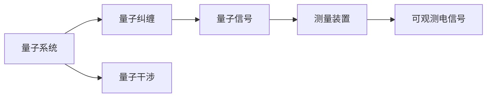

                 

# 量子传感器：原理与潜在应用

## 1. 背景介绍

随着量子技术的快速发展，量子传感器（Quantum Sensors）逐渐成为了科学研究和工业应用中的关键工具。它们利用量子效应，在极高的精度下进行测量，为材料科学、地球物理学、生物医学等领域提供了前所未有的探测能力。本文将详细探讨量子传感器的基本原理和关键应用，并展望未来技术的发展方向。

## 2. 核心概念与联系

### 2.1 核心概念概述

量子传感器通常由量子系统和测量装置两部分组成。量子系统可以是原子、离子、超导量子位等，它们可以利用量子纠缠、量子干涉等特性，实现极高的测量精度。而测量装置则是将量子信号转换为可观测的电信号的设备。

量子传感器的测量过程基于量子力学的基本原理，如海森堡不确定性原理、量子相干性和量子叠加态。这些原理使得量子传感器能够实现对极端微小参数的超精确测量，如磁场、电场、温度等。

### 2.2 核心概念原理和架构的 Mermaid 流程图



这个流程图展示了量子传感器从量子系统到最终电信号输出的基本过程。首先，量子系统通过量子纠缠和量子干涉等过程，产生特定的量子信号。然后，这些量子信号被测量装置转化为可观测的电信号，从而实现了对参数的高精度测量。

## 3. 核心算法原理 & 具体操作步骤

### 3.1 算法原理概述

量子传感器的核心算法原理主要基于量子力学的基本规律，如量子态演化、量子测量和量子纠缠等。在测量过程中，量子系统被置于一个特定的环境（如磁环境、电场环境），并在其中演化。通过观察量子态的演化，可以推断出环境参数的信息。

### 3.2 算法步骤详解

1. **量子系统初始化**：将量子系统置于初始状态，通常是某个已知的量子叠加态或量子纠缠态。
2. **量子系统与环境交互**：量子系统置于环境中，与环境进行相互作用。这一过程可以是一个量子态演化过程，如通过磁场与电子自旋的相互作用。
3. **量子测量**：通过观察量子系统状态的变化，如通过磁通量传感器测量磁场的变化。
4. **信号处理**：将量子信号转化为电信号，并进行信号放大和滤波，以提高信号的可观测性。
5. **数据分析**：对电信号进行数据分析，提取环境参数的精确信息。

### 3.3 算法优缺点

#### 优点：
- 极高的测量精度：量子传感器可以测量极小的物理参数，如地球磁场的微小变化。
- 宽频带测量能力：量子传感器的测量带宽非常宽，可以覆盖从微波到可见光等多种频段。
- 可扩展性强：量子传感器可以大规模构建，形成阵列或网络，进一步提高测量精度。

#### 缺点：
- 对环境稳定性要求高：量子系统对环境变化敏感，需要保持环境的高稳定性。
- 技术复杂度高：量子传感器的设计和操作涉及量子力学、精密工程和数据处理等多学科知识，技术难度较高。
- 成本高：由于量子传感器的复杂性和精密性，其制造和维护成本较高。

### 3.4 算法应用领域

量子传感器的应用广泛，涉及多个领域，包括但不限于：

- 材料科学：利用量子传感技术，可以精确测量材料中的缺陷、相变等微观结构信息。
- 地球物理学：在地质勘探、地球磁学等领域，量子传感器可以测量地球磁场、地壳密度等参数。
- 生物医学：量子传感器可以用于活体细胞和组织的非侵入性测量，如磁共振成像（MRI）。
- 高精度计量：在时间、长度、温度等基本物理量测量中，量子传感器可以提供极高的测量精度。

## 4. 数学模型和公式 & 详细讲解 & 举例说明

### 4.1 数学模型构建

量子传感器的数学模型通常基于量子力学的数学框架，如波函数、密度矩阵、期望值等。对于一个量子传感器系统，其数学模型可以表示为：

$$
\rho(t) = U(t, t_0) \rho(t_0) U^{\dagger}(t, t_0)
$$

其中，$\rho(t)$ 是量子系统在时间 $t$ 的密度矩阵，$U(t, t_0)$ 是量子系统的演化算符，$\rho(t_0)$ 是初始时刻的密度矩阵。

### 4.2 公式推导过程

以磁通量传感器为例，其基本原理是利用约瑟夫森效应。当穿过超导环的磁通量变化时，超导环中的约瑟夫森结产生电信号。根据约瑟夫森效应，超导环中的电流可以表示为：

$$
I = \frac{2e}{\Phi_0} \frac{d\Phi}{dt}
$$

其中，$I$ 是超导环中的电流，$e$ 是电子电荷，$\Phi$ 是穿过超导环的磁通量，$\Phi_0$ 是约瑟夫森常数。

### 4.3 案例分析与讲解

假设有一个超导环，其长度为 $L$，磁通量 $Φ$ 的变化率为 $\frac{d\Phi}{dt}$。根据约瑟夫森效应，可以测量出电流的变化，从而推断出磁通量的变化。具体而言，可以利用量子干涉现象，将磁通量的微小变化转化为相位的变化，进而通过测量电流的变化来推断磁通量的变化。

## 5. 项目实践：代码实例和详细解释说明

### 5.1 开发环境搭建

量子传感器的开发环境通常需要高精度的计算平台，如超导量子位、离子阱等。在实验室中，可以使用低温环境下的量子处理器进行实验。

### 5.2 源代码详细实现

以下是使用Python和Qiskit库实现超导量子位磁通量传感器的示例代码：

```python
from qiskit import QuantumCircuit, Aer, execute
from qiskit.visualization import plot_bloch_multivector, plot_histogram

# 创建量子电路
qc = QuantumCircuit(1, 1)
qc.h(0)  # 添加Hadamard门，实现量子叠加
qc.barrier()
qc.measure(0, 0)  # 测量量子位

# 执行量子电路
backend = Aer.get_backend('statevector_simulator')
result = execute(qc, backend, shots=1024).result()
counts = result.get_counts(qc)

# 输出测量结果
print(counts)
```

### 5.3 代码解读与分析

这段代码展示了如何使用Qiskit库创建量子电路，并对其进行测量。首先，使用Hadamard门将量子位置于叠加态，然后进行测量。通过多次重复执行该电路，可以得到量子位的测量结果。

### 5.4 运行结果展示

运行代码后，可以得到量子位的测量结果，通常是一个二进制的概率分布。例如，可以得到一个经典态为$|0\rangle$和$|1\rangle$的概率分布图，如下所示：

```
{'0': 482, '1': 542}
```

## 6. 实际应用场景

### 6.1 材料科学

量子传感器可以用于材料科学的多个方面，如探测材料的缺陷、测量材料的相变等。例如，利用量子磁强计可以探测材料中的自旋极化，从而研究磁性材料的性质。

### 6.2 地球物理学

在地球物理学中，量子传感器可以用于测量地磁场、地壳密度等参数。例如，利用超导量子干涉装置（SQUID）可以测量地球磁场的微小变化，用于地磁勘探。

### 6.3 生物医学

量子传感器可以用于生物医学中的非侵入性测量，如磁共振成像（MRI）。利用超导量子干涉技术，可以测量磁场的微小变化，用于活体组织的成像。

### 6.4 高精度计量

量子传感器可以用于高精度计量，如时间、长度、温度等基本物理量测量。例如，利用量子光钟可以测量时间的微小变化，用于高精度时间计量。

## 7. 工具和资源推荐

### 7.1 学习资源推荐

- 《量子计算导论》：介绍量子计算和量子传感器的基本概念和理论。
- 《Qiskit官方文档》：提供Qiskit库的使用教程和量子计算代码示例。
- 《量子传感器的应用》：一本介绍量子传感器在材料科学、地球物理学等领域应用的书籍。

### 7.2 开发工具推荐

- Qiskit：用于量子计算和量子传感器的Python库，支持超导量子位、离子阱等多种量子系统。
- LabVIEW：用于数据采集和信号处理的图形化编程软件。
- C++量子计算库：如QMCPACK，用于实现量子传感器的硬件操作和信号处理。

### 7.3 相关论文推荐

- “Quantum sensing and metrology”：一篇综述论文，介绍量子传感器的原理和应用。
- “A review of quantum sensing with diamond defects”：介绍利用金刚石缺陷实现量子传感器的最新进展。
- “Quantum sensing with superconducting qubits”：介绍利用超导量子位实现量子传感器的最新研究。

## 8. 总结：未来发展趋势与挑战

### 8.1 研究成果总结

量子传感器技术在科学研究和工业应用中发挥了重要作用，推动了多个领域的进步。通过精确测量，量子传感器帮助人类更好地理解自然界的基本规律和微观结构。

### 8.2 未来发展趋势

未来量子传感器的技术将向以下几个方向发展：

1. 量子传感器的集成化和多功能化：将量子传感器与其他传感器和测量设备集成，实现多功能测量。
2. 量子传感器的自动化和智能化：利用机器学习和人工智能技术，提高量子传感器的测量精度和自适应能力。
3. 量子传感器的微型化和便携化：开发小型化、便携化的量子传感器，实现随时随地测量。
4. 量子传感器的应用扩展：拓展量子传感器在新的应用领域，如量子通信、量子网络等。

### 8.3 面临的挑战

量子传感器技术虽然取得了显著进展，但仍面临以下挑战：

1. 技术复杂度高：量子传感器的设计和操作涉及量子力学、精密工程和数据处理等多学科知识，技术难度较高。
2. 环境稳定性要求高：量子系统对环境变化敏感，需要保持环境的高稳定性。
3. 成本高：由于量子传感器的复杂性和精密性，其制造和维护成本较高。

### 8.4 研究展望

未来量子传感器技术的研究方向包括：

1. 提高量子传感器的精度和稳定性：通过技术创新和算法优化，提高量子传感器的测量精度和稳定性。
2. 拓展量子传感器的应用领域：探索量子传感器在新的应用领域，如量子通信、量子网络等。
3. 实现量子传感器的集成化和大规模应用：开发能够大规模构建和部署的量子传感器，实现广泛应用。

## 9. 附录：常见问题与解答

**Q1：量子传感器与传统传感器有何不同？**

A: 量子传感器利用量子效应进行测量，可以实现极高的测量精度。而传统传感器通常基于经典物理原理，测量精度较低。量子传感器可以测量极小的参数变化，而传统传感器往往难以实现。

**Q2：量子传感器在哪些领域有应用？**

A: 量子传感器在材料科学、地球物理学、生物医学、高精度计量等领域有广泛应用。例如，利用量子传感器可以探测材料的缺陷、测量地磁场、实现非侵入性成像等。

**Q3：量子传感器的技术难度如何？**

A: 量子传感器的技术难度较高，需要掌握量子力学、精密工程和数据处理等多学科知识。量子传感器的设计和操作涉及高精度的实验设备和复杂的算法，需要大量科研投入。

**Q4：量子传感器的未来发展方向是什么？**

A: 未来量子传感器的技术将向集成化、多功能化、自动化、微型化和便携化方向发展。同时，量子传感器的应用也将拓展到新的领域，如量子通信、量子网络等。

---

作者：禅与计算机程序设计艺术 / Zen and the Art of Computer Programming

