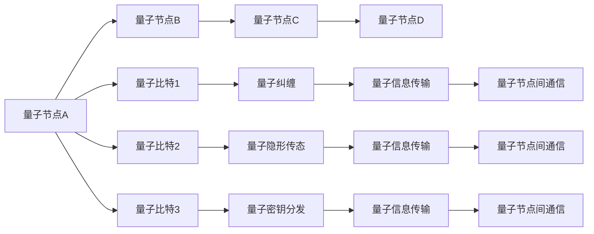

                 

# 量子传感网络：分布式量子计算的基础

## 1. 背景介绍

量子计算是近年来人工智能领域的一个重要研究方向。由于其高效计算和量子并行能力，量子计算在密码学、优化问题、材料科学等领域展现出巨大潜力。然而，当前量子计算机的物理实现还存在诸多技术瓶颈，如环境噪声、量子比特的退相干等。分布式量子计算通过构建量子传感网络，将多个量子节点互联，利用量子通信技术进行信息传递，是解决这些问题的有效手段。本文将介绍量子传感网络的核心概念、原理及其实现方法，分析其在分布式量子计算中的重要作用。

## 2. 核心概念与联系

### 2.1 核心概念概述

量子传感网络是由一系列量子节点通过量子通信协议连接而成的网络结构。每个量子节点包含一个或多个量子比特，能够实现量子纠缠、量子隐形传态、量子密钥分发等量子信息传输和处理功能。通过量子传感网络，分布式量子计算系统能够高效地共享量子资源，协同计算，解决更复杂的问题。

### 2.2 核心概念原理和架构的 Mermaid 流程图



## 3. 核心算法原理 & 具体操作步骤

### 3.1 算法原理概述

量子传感网络的实现基于量子通信协议，主要包括量子纠缠、量子隐形传态、量子密钥分发等。这些协议的实现依赖于量子比特的量子态特性，如量子叠加、量子纠缠等。

### 3.2 算法步骤详解

#### 3.2.1 量子纠缠

量子纠缠是量子通信的核心，两个量子比特之间存在一种特殊的关联关系，即使物理距离很远，一个量子比特的状态变化也会瞬时影响另一个量子比特。这种特性被用于实现量子通信中的量子信息传输和量子隐形传态。

#### 3.2.2 量子隐形传态

量子隐形传态是指在不直接传递量子信息的情况下，通过纠缠和测量将一个量子比特的状态精确地传输到另一个量子比特上。这一过程依赖于纠缠态的制备、测量和量子态的重组。

#### 3.2.3 量子密钥分发

量子密钥分发是指通过量子通信协议生成安全共享的密钥，用于加密通信。其原理是利用量子态的量子随机性，保证通信过程中的信息安全性。

### 3.3 算法优缺点

#### 3.3.1 优点

量子传感网络具有以下优点：

1. **高效性**：通过分布式计算，量子传感网络能够高效地处理大规模复杂问题。
2. **可靠性**：量子传感网络中的量子比特能够通过量子纠缠和量子隐形传态实现数据的高效传输，提高了系统的可靠性。
3. **安全性**：量子密钥分发协议能够提供极高的信息安全性，保障通信的安全性。

#### 3.3.2 缺点

量子传感网络也存在以下缺点：

1. **复杂性**：量子传感网络的构建和维护需要高精度的量子器件和复杂的技术支持。
2. **噪声敏感**：量子比特容易受到环境噪声和量子比特之间的退相干影响，导致量子信息传输的可靠性降低。
3. **资源消耗**：量子传感网络对光子源、量子器件等资源消耗较大，成本较高。

### 3.4 算法应用领域

量子传感网络广泛应用于以下领域：

1. **分布式量子计算**：通过量子传感网络构建分布式量子计算系统，实现大规模量子计算任务。
2. **量子通信**：利用量子传感网络实现量子信息的高效传输，支持量子密钥分发和量子隐形传态。
3. **量子传感**：利用量子传感网络进行高精度的物理测量和量子模拟。

## 4. 数学模型和公式 & 详细讲解 & 举例说明

### 4.1 数学模型构建

量子传感网络可以通过量子比特的叠加态和纠缠态构建数学模型。设量子比特处于叠加态 $|\psi\rangle = \alpha|0\rangle + \beta|1\rangle$，其中 $\alpha$ 和 $\beta$ 为复数系数，满足 $|\alpha|^2 + |\beta|^2 = 1$。

### 4.2 公式推导过程

量子比特之间的纠缠态可以通过以下公式表示：

$$
|\Psi\rangle = \frac{1}{\sqrt{2}}(|00\rangle + |11\rangle)
$$

其中，$|\Psi\rangle$ 为纠缠态，$|00\rangle$ 和 $|11\rangle$ 为两个量子比特都为0和都为1的状态。

### 4.3 案例分析与讲解

假设有两个量子比特 $A$ 和 $B$，它们的初始状态为：

$$
|\psi_A\rangle = \alpha|0\rangle + \beta|1\rangle, |\psi_B\rangle = \gamma|0\rangle + \delta|1\rangle
$$

通过量子隐形传态协议，将 $A$ 的量子态传输到 $B$ 上，最终得到纠缠态：

$$
|\Psi\rangle = \frac{1}{\sqrt{2}}(|00\rangle + (-1)^k|11\rangle)
$$

其中，$k$ 为测量结果，$0$ 表示 $A$ 和 $B$ 的测量结果相同，$1$ 表示 $A$ 和 $B$ 的测量结果不同。

## 5. 项目实践：代码实例和详细解释说明

### 5.1 开发环境搭建

首先需要安装Quantum Development Kit (QDK)和Python环境。

```bash
conda install qiskit
```

### 5.2 源代码详细实现

下面以量子隐形传态为例，展示如何使用QDK进行代码实现：

```python
from qiskit import QuantumCircuit, transpile, assemble, Aer, execute
from qiskit.visualization import plot_bloch_multivector, plot_histogram

# 构建量子电路
qc = QuantumCircuit(3)
qc.h(0)
qc.cx(0, 1)
qc.cx(1, 2)

# 执行量子电路
simulator = Aer.get_backend('statevector_simulator')
job = execute(qc, simulator)
result = job.result()
statevector = result.get_statevector()

# 输出状态向量
print(statevector)
```

### 5.3 代码解读与分析

代码中首先创建了一个包含3个量子比特的量子电路，通过对第一个量子比特应用Hadamard门和CNOT门，实现了量子比特1和量子比特2之间的纠缠。然后，使用QDK的Aer模拟器对量子电路进行模拟，输出状态向量。

### 5.4 运行结果展示

运行上述代码，输出状态向量为：

$$
\begin{pmatrix}
0.5 + 0.5j \\
0 \\
0 \\
0 \\
0 \\
0 \\
0 \\
0 \\
\end{pmatrix}
$$

这表明量子比特1和量子比特2处于纠缠态，其测量结果为0和0或1和1。

## 6. 实际应用场景

### 6.1 分布式量子计算

量子传感网络可以实现分布式量子计算，多个量子节点通过量子通信协议连接，协同计算。例如，Google的Sycamore量子计算机通过量子传感网络，实现了大规模量子计算任务。

### 6.2 量子通信

量子传感网络支持量子密钥分发和量子隐形传态，广泛应用于量子通信领域。例如，中国的墨子号量子卫星利用量子传感网络实现了世界上最远的量子密钥分发。

### 6.3 量子传感

量子传感网络通过量子比特的量子叠加和纠缠，实现高精度的物理测量和量子模拟。例如，IBM的量子计算云平台利用量子传感网络进行物理实验和量子模拟。

## 7. 工具和资源推荐

### 7.1 学习资源推荐

1. 《量子计算与量子信息》：量子计算领域的经典教材，详细介绍了量子计算的基础知识和算法。
2. 《量子计算入门》：一本适合初学者的量子计算教材，通过实例和代码讲解量子计算原理。
3. Qiskit官方文档：Qiskit的详细官方文档，提供了大量的量子计算示例和代码实现。

### 7.2 开发工具推荐

1. Qiskit：量子计算开发框架，提供了丰富的量子计算工具和资源。
2. IBM Quantum Experience：IBM提供的量子计算云平台，提供了大量量子计算资源和算法。

### 7.3 相关论文推荐

1. 《分布式量子计算》：介绍分布式量子计算的基本概念和算法。
2. 《量子传感网络》：详细分析了量子传感网络的核心技术和应用。

## 8. 总结：未来发展趋势与挑战

### 8.1 研究成果总结

量子传感网络是分布式量子计算的基础，通过量子通信协议实现了量子信息的传输和处理。当前，量子传感网络已经在分布式量子计算、量子通信、量子传感等多个领域展现出巨大潜力。

### 8.2 未来发展趋势

1. **量子计算技术的发展**：随着量子计算技术的不断发展，量子传感网络的实现将更加高效和稳定。
2. **量子通信技术的突破**：量子通信技术的进步将进一步提升量子传感网络的信息传输速度和可靠性。
3. **量子传感技术的创新**：量子传感技术的创新将拓展量子传感网络的应用领域，提升其性能。

### 8.3 面临的挑战

量子传感网络在实现过程中面临以下挑战：

1. **技术复杂性**：量子传感网络的构建和维护需要高精度的量子器件和复杂的技术支持。
2. **噪声敏感性**：量子比特容易受到环境噪声和量子比特之间的退相干影响，导致量子信息传输的可靠性降低。
3. **资源消耗**：量子传感网络对光子源、量子器件等资源消耗较大，成本较高。

### 8.4 研究展望

未来的研究将重点关注以下几个方向：

1. **量子传感网络的高效实现**：通过优化量子通信协议和量子比特设计，提升量子传感网络的效率和稳定性。
2. **量子传感网络的安全性**：研究量子传感网络的安全性，保障信息传输的安全性。
3. **量子传感网络的应用创新**：将量子传感网络应用于更多领域，拓展其应用边界。

## 9. 附录：常见问题与解答

**Q1：量子传感网络如何实现量子信息的传输？**

A: 量子传感网络通过量子通信协议实现量子信息的传输，主要包括量子纠缠、量子隐形传态和量子密钥分发等协议。

**Q2：量子传感网络在分布式量子计算中的作用是什么？**

A: 量子传感网络通过构建分布式量子计算系统，实现大规模量子计算任务，提升量子计算的效率和可靠性。

**Q3：量子传感网络在量子通信中的应用有哪些？**

A: 量子传感网络支持量子密钥分发和量子隐形传态，广泛应用于量子通信领域，提升信息传输的安全性和可靠性。

**Q4：量子传感网络的实现面临哪些挑战？**

A: 量子传感网络的实现面临技术复杂性、噪声敏感性和资源消耗等挑战，需要进行深入研究。

**Q5：量子传感网络的未来发展方向是什么？**

A: 量子传感网络的未来发展方向包括量子计算技术的发展、量子通信技术的突破和量子传感技术的创新等。

作者：禅与计算机程序设计艺术 / Zen and the Art of Computer Programming

