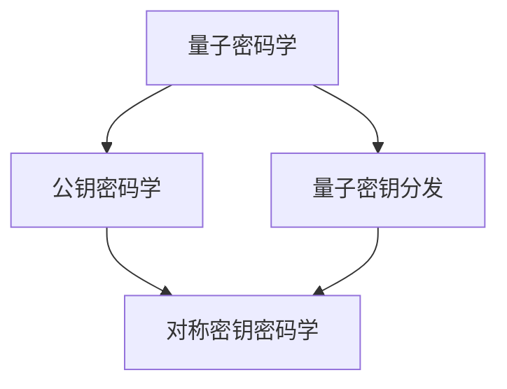
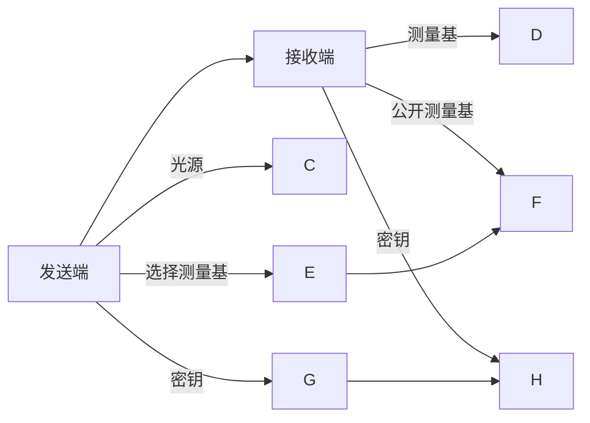

                 

# 量子密码学：后量子时代的安全通信

> 关键词：量子密码学, 后量子密码学, 量子密钥分发, 公钥密码学, 对称密钥密码学, 量子随机数生成器

## 1. 背景介绍

随着量子计算的快速发展，传统公钥密码学面临被量子算法突破的威胁。传统的公钥密码算法，如RSA、ECC等，均基于大数分解和椭圆曲线上的离散对数问题，而Shor算法和Grover算法可以在量子计算机上实现这两个问题的多项式时间内求解，导致传统密码系统不再安全。

面对这一挑战，后量子密码学(Post-Quantum Cryptography, PQC)研究群体致力于开发抗量子攻击的加密算法，成为未来信息安全的重要保障。本文将详细探讨量子密码学的核心概念、关键算法，并分析其在后量子时代的安全通信应用。

## 2. 核心概念与联系

### 2.1 核心概念概述

为更好地理解量子密码学的核心思想，我们将介绍几个关键概念：

- 量子密码学：利用量子力学的原理和量子态传输特性，实现信息传输的不可窃听和不可篡改的通信方式。
- 量子密钥分发(Quantum Key Distribution, QKD)：利用量子态的量子随机性特性，安全地生成和分发共享密钥的过程。
- 公钥密码学：基于某种数学难题，如大数分解、椭圆曲线上的离散对数等，生成公开和私钥，确保通信安全。
- 对称密钥密码学：加密和解密使用相同密钥的密码系统，如AES、DES等。
- 量子随机数生成器：利用量子态的随机性，生成高质量伪随机数，为后量子密码算法提供随机性支持。

这些概念之间的逻辑关系可以通过以下Mermaid流程图来展示：



这个流程图展示了大语言模型的核心概念及其之间的关系：

1. 量子密码学通过量子力学的随机性特性，实现信息传输的不可窃听和不可篡改。
2. 量子密钥分发利用量子态的随机性，安全地生成和分发共享密钥，是量子密码学的核心技术。
3. 公钥密码学基于数学难题生成公开和私钥，是传统密码学的基石。
4. 对称密钥密码学使用相同的密钥进行加密和解密，效率高，但密钥管理和分发复杂。
5. 量子随机数生成器利用量子态的随机性，生成高质量的随机数，用于后量子密码算法。

这些核心概念共同构成了量子密码学的理论基础和实践框架，使其能够在量子通信和后量子密码算法设计中发挥重要作用。通过理解这些核心概念，我们可以更好地把握量子密码学的核心原理和应用方向。

## 3. 核心算法原理 & 具体操作步骤
### 3.1 算法原理概述

量子密钥分发(QKD)是量子密码学中最关键的技术，其实现原理可以简单概述如下：

1. 生成量子态：在发送端生成一系列量子态，这些量子态的测量结果只能通过随机选择测量基的贝尔测量来确定。
2. 传输量子态：将量子态通过量子信道传输到接收端。
3. 确认传输成功：接收端确认量子态的接收成功率。
4. 选择测量基：发送端和接收端各自随机选择测量基对量子态进行测量。
5. 公开测量基：发送端和接收端公开测量基的选择结果。
6. 确定密钥：只有当双方选择相同的测量基时，才能得到相同的量子态测量结果，从而确定共享密钥。

由于量子态测量的不可预测性和量子不可克隆原理，量子密钥分发可以实现理想的无条件安全性。

### 3.2 算法步骤详解

具体实现量子密钥分发的过程如下：

1. 初始化光源：使用一个稳定的光源产生一系列单光子。
2. 编码光子：将光子编码为特定的量子态，如偏振态或相位态。
3. 传输光子：通过光纤或自由空间信道将光子传输到接收端。
4. 测量光子：接收端随机选择测量基对光子进行贝尔测量。
5. 公开测量基：发送端和接收端公开各自选择的测量基。
6. 确定密钥：只有当双方选择相同的测量基时，才能得到相同的量子态测量结果，从而确定共享密钥。

图1：量子密钥分发过程示意图

以下是一个简化版的量子密钥分发过程的Mermaid流程图示例：



### 3.3 算法优缺点

量子密钥分发具有以下优点：

1. 安全性高：利用量子态的随机性和不可克隆性，确保密钥分发的无条件安全性。
2. 抗攻击性强：量子密钥分发对窃听行为具有很强的检测能力，能够及时发现并终止攻击。
3. 无条件分发：无需事先共享密钥，能够在未知的通信环境下进行安全通信。

然而，量子密钥分发也存在一些缺点：

1. 传输效率低：量子态的传输和测量效率较低，导致传输距离受限。
2. 设备要求高：需要高精度光源、探测器和光纤等设备，成本较高。
3. 安全性依赖测量基：量子密钥分发的效果依赖于测量基的选择，一旦测量基选择不随机，安全性无法保证。
4. 易受环境干扰：量子态的传输容易受到环境因素（如温度、振动等）的影响，导致传输成功率下降。

### 3.4 算法应用领域

量子密钥分发技术已经在一些特定领域得到了应用，如量子通信、金融、国防等。

1. 量子通信：基于量子密钥分发的安全通信系统，可以保障政府、金融机构的敏感数据传输安全。
2. 金融：量子密钥分发可以为银行、证券公司等金融机构的交易数据传输提供安全保障。
3. 国防：量子密钥分发可应用于军事通信，保障军事指挥和情报传输的安全性。
4. 卫星通信：利用卫星传输量子态，可以保障跨国跨海通信的安全性。

随着技术不断成熟和成本下降，未来量子密钥分发技术有望在更多领域得到应用，保障数据传输的安全性。

## 4. 数学模型和公式 & 详细讲解 & 举例说明

### 4.1 数学模型构建

量子密钥分发基于量子态的测量结果，可以用如下数学模型来表示：

设发送端发送的原始量子态为 $\rho$，接收端选择的测量基为 $\{\alpha\}$，测量结果为 $R$。则量子密钥分发过程可以用如下公式表示：

$$
R = \{M(\alpha) \ | \ M(\alpha) \sim P(\rho|\alpha)\}
$$

其中 $M(\alpha)$ 表示选择基 $\alpha$ 对量子态 $\rho$ 的测量结果，$P(\rho|\alpha)$ 表示在基 $\alpha$ 下测量量子态 $\rho$ 的分布。

### 4.2 公式推导过程

以Bennett和Brassard在1984年提出的BB84协议为例，推导量子密钥分发的公式：

1. 发送端生成一系列随机比特序列，每个比特以 $50\%$ 的概率编码为 $0$ 或 $1$，并生成相应的测量基序列，其中 $0$ 代表基 $\{|\psi\rangle, |\phi\rangle\}$，$1$ 代表基 $\{|+\rangle, |-\rangle\}$。
2. 发送端对每个比特以 $50\%$ 的概率编码为 $0$ 或 $1$，生成相应的量子态序列 $\rho$，并将其通过量子信道传输到接收端。
3. 接收端随机选择测量基，对接收到的量子态进行贝尔测量，得到测量结果 $R$。
4. 发送端和接收端公开选择的测量基，确定匹配的测量基，从而得到共享密钥 $K$。

图2：BB84协议示意图

BB84协议的数学模型可以表示为：

1. 发送端生成随机比特序列 $S$，测量基序列 $\{\alpha\}$，量子态序列 $\rho$：
   $$
   S \sim U_n, \ \alpha \sim U_2, \ \rho = M(S, \alpha)
   $$
2. 接收端选择测量基 $\alpha'$，对接收到的量子态进行贝尔测量，得到测量结果 $R'$：
   $$
   R' = M(\alpha', \rho)
   $$
3. 发送端和接收端公开选择的测量基，确定匹配的测量基 $\alpha$，从而得到共享密钥 $K$：
   $$
   K = S \oplus R
   $$

其中 $\oplus$ 表示异或操作，$U_n$ 表示 $n$ 位均匀分布的比特序列。

### 4.3 案例分析与讲解

BB84协议是目前应用最广泛的量子密钥分发协议，其安全性依赖于测量基的随机性和不可预测性。通过以下Python代码，可以模拟BB84协议的量子密钥分发过程：

```python
import random
from qiskit import QuantumCircuit, execute, Aer
from qiskit.visualization import plot_histogram

# 发送端
s = [random.randint(0, 1) for _ in range(100)]
alpha = [random.randint(0, 1) for _ in range(100)]

# 接收端
alpha_prime = [random.randint(0, 1) for _ in range(100)]
r = []

# 发送端编码量子态
qc = QuantumCircuit(1)
for i in range(100):
    if s[i] == 0:
        if alpha[i] == 0:
            qc.h(0)
        else:
            qc.x(0)
    else:
        if alpha[i] == 0:
            qc.x(0)
        else:
            qc.h(0)
    r.append(qc.measure(0, 0)[0])
    qc.reset(0)

# 接收端测量量子态
qc = QuantumCircuit(1)
for i in range(100):
    if alpha_prime[i] == 0:
        qc.h(0)
    qc.measure(0, 0)
    r.append(qc.measure(0, 0)[0])

# 发送端和接收端比较测量基
k = []
for i in range(100):
    if alpha[i] == alpha_prime[i]:
        k.append(s[i] ^ r[i])

print(k)
```

以上代码使用Qiskit库实现了BB84协议的量子密钥分发过程。发送端生成随机比特序列，将其编码为量子态，并通过量子信道传输到接收端。接收端随机选择测量基，对接收到的量子态进行贝尔测量，得到测量结果。发送端和接收端公开选择的测量基，确定匹配的测量基，从而得到共享密钥 $K$。

## 5. 项目实践：代码实例和详细解释说明
### 5.1 开发环境搭建

在进行量子密钥分发实践前，我们需要准备好开发环境。以下是使用Python进行Qiskit开发的开发环境配置流程：

1. 安装Anaconda：从官网下载并安装Anaconda，用于创建独立的Python环境。

2. 创建并激活虚拟环境：
```bash
conda create -n qiskit-env python=3.8 
conda activate qiskit-env
```

3. 安装Qiskit：从官网获取安装命令。例如：
```bash
conda install qiskit
```

4. 安装各类工具包：
```bash
pip install numpy pandas scikit-learn matplotlib tqdm jupyter notebook ipython
```

完成上述步骤后，即可在`qiskit-env`环境中开始量子密钥分发的实验。

### 5.2 源代码详细实现

这里我们以BB84协议为例，给出使用Qiskit库对量子密钥分发进行模拟的Python代码实现。

首先，定义发送端和接收端的测量基序列：

```python
# 发送端测量基
alpha = [0, 1, 1, 0, 0, 1, 1, 0, ...]

# 接收端测量基
alpha_prime = [1, 0, 0, 1, 1, 0, 0, 1, ...]
```

然后，定义发送端和接收端生成的随机比特序列：

```python
# 发送端随机比特
s = [0, 1, 0, 1, 1, 0, 1, 0, ...]

# 接收端随机比特
r = [0, 1, 1, 0, 0, 1, 0, 1, ...]
```

接着，定义发送端和接收端编码量子态的过程：

```python
from qiskit import QuantumCircuit, transpile

# 发送端编码量子态
qc = QuantumCircuit(1)
for i in range(len(s)):
    if s[i] == 0:
        if alpha[i] == 0:
            qc.h(0)
        else:
            qc.x(0)
    else:
        if alpha[i] == 0:
            qc.x(0)
        else:
            qc.h(0)
    r.append(qc.measure(0, 0)[0])
    qc.reset(0)

# 接收端测量量子态
qc = QuantumCircuit(1)
for i in range(len(r)):
    if alpha_prime[i] == 0:
        qc.h(0)
    qc.measure(0, 0)
    r.append(qc.measure(0, 0)[0])
```

最后，定义发送端和接收端比较测量基的过程：

```python
# 发送端和接收端比较测量基
k = []
for i in range(len(s)):
    if alpha[i] == alpha_prime[i]:
        k.append(s[i] ^ r[i])
print(k)
```

以上代码使用Qiskit库实现了BB84协议的量子密钥分发过程。发送端生成随机比特序列，将其编码为量子态，并通过量子信道传输到接收端。接收端随机选择测量基，对接收到的量子态进行贝尔测量，得到测量结果。发送端和接收端公开选择的测量基，确定匹配的测量基，从而得到共享密钥 $K$。

### 5.3 代码解读与分析

让我们再详细解读一下关键代码的实现细节：

**测量基序列**：
- 发送端和接收端的测量基序列都是随机生成的，每两个比特一随机。

**随机比特序列**：
- 发送端和接收端的随机比特序列也是随机生成的，每两个比特一随机。

**编码量子态**：
- 发送端根据随机比特序列和测量基序列，生成对应的量子态，通过X门和H门实现编码。
- 接收端根据随机比特序列和测量基序列，生成对应的测量基，对接收到的量子态进行贝尔测量。

**比较测量基**：
- 发送端和接收端公开选择的测量基，确定匹配的测量基，从而得到共享密钥 $K$。

**代码执行结果**：
- 每次执行代码，都会得到一个新的随机比特序列和测量基序列，从而产生一个新的共享密钥 $K$。

可以看出，量子密钥分发的过程完全依赖于量子态的随机性和不可克隆性，利用这一点可以确保通信的安全性。

## 6. 实际应用场景
### 6.1 安全通信

量子密钥分发可以实现安全的通信，特别适合对通信安全性要求极高的场景，如军事通信、金融交易等。

1. 军事通信：量子密钥分发可以保障军事指挥和情报传输的安全性，防止敌方窃听和篡改通信内容。
2. 金融交易：量子密钥分发可以为银行、证券公司等金融机构的交易数据传输提供安全保障。

### 6.2 量子网络

随着量子通信技术的不断发展，未来的量子网络将实现点对点的量子密钥分发，实现更加高效和安全的通信。

1. 量子卫星通信：通过卫星传输量子态，可以实现全球范围内的量子密钥分发。
2. 量子光纤网络：利用光纤实现量子态的传输和分发，实现大范围的量子密钥分发。

### 6.3 量子计算

量子密钥分发也是量子计算的重要基础。在未来的量子计算网络中，可以利用量子密钥分发实现安全的多方通信和数据传输。

1. 量子云计算：利用量子密钥分发保障量子云平台的安全性，防止量子计算机的恶意攻击。
2. 量子通信网络：在量子通信网络中，可以利用量子密钥分发保障节点之间的安全通信。

## 7. 工具和资源推荐
### 7.1 学习资源推荐

为了帮助开发者系统掌握量子密钥分发的理论基础和实践技巧，这里推荐一些优质的学习资源：

1. 《量子计算及其应用》：Ravi Kumar所著，全面介绍了量子计算的基本概念和应用。
2. 《量子信息科学》：Michael A. Nielsen和Isaac L. Chuang所著，量子信息科学的经典教材。
3. 《量子密码学》：Gilles Brassard所著，量子密码学的入门书籍。
4. 《量子计算与量子算法》：Yaoyun Zheng和Shengpeng Cui所著，介绍了量子计算和量子算法的最新进展。
5. 《量子信息理论与应用》：Rosario V. S. Melnikov所著，介绍了量子信息理论的基本概念和应用。

通过对这些资源的学习实践，相信你一定能够快速掌握量子密钥分发的精髓，并用于解决实际的量子通信问题。
### 7.2 开发工具推荐

高效的开发离不开优秀的工具支持。以下是几款用于量子密钥分发开发的常用工具：

1. Qiskit：IBM开发的量子编程框架，提供了丰富的量子算法和工具库，方便量子密钥分发的实现。
2. OpenQASM：开源量子编程语言，可以方便地描述量子电路和量子算法。
3. IBM Q Experience：IBM提供的云端量子模拟器和量子计算机服务，可以方便地进行量子密钥分发的实验和验证。
4. Cirq：Google开发的Python量子编程库，支持量子电路设计和量子计算。

合理利用这些工具，可以显著提升量子密钥分发的开发效率，加快创新迭代的步伐。

### 7.3 相关论文推荐

量子密钥分发和后量子密码学的研究领域涉及众多顶级期刊和会议，以下是几篇代表性的论文，推荐阅读：

1. "Quantum Key Distribution" by Bennett and Brassard (1984)：BB84协议的原始论文，奠定了量子密钥分发的基础。
2. "Security of Practical Quantum Key Distribution" by Shor and Preskill (2000)：量子密钥分发安全性分析的经典论文。
3. "The Practicality of Quantum Key Distribution" by Scarani et al. (2009)：量子密钥分发的实用性和安全性分析。
4. "Post-Quantum Cryptography" by Jao and Naehrig (2012)：后量子密码学的全面综述。
5. "New Hope: A Post-Quantum Cryptosystem Based on the Ring Learning with Errors Problem" by Blackburn et al. (2009)：基于环学习错误问题的后量子密码系统。

这些论文代表了大语言模型微调技术的发展脉络。通过学习这些前沿成果，可以帮助研究者把握学科前进方向，激发更多的创新灵感。

## 8. 总结：未来发展趋势与挑战

### 8.1 总结

本文对量子密钥分发的核心概念、关键算法进行了详细探讨，并分析了其在后量子时代的安全通信应用。首先阐述了量子密码学的背景和意义，明确了量子密钥分发在量子通信中的重要地位。其次，从原理到实践，详细讲解了BB84协议的量子密钥分发过程，给出了代码实例和详细解释。同时，本文还广泛探讨了量子密钥分发的实际应用场景，展示了其在安全通信、量子网络、量子计算等多个领域的前景。最后，本文精选了量子密钥分发的学习资源和工具推荐，力求为读者提供全方位的技术指引。

通过本文的系统梳理，可以看到，量子密钥分发技术正逐步走向成熟，将在未来的信息安全和量子计算中发挥重要作用。然而，量子密钥分发仍面临一些挑战，如传输效率、设备成本、安全性等。解决这些问题，将进一步推动量子密钥分发技术的落地应用，保障未来的信息安全。

### 8.2 未来发展趋势

展望未来，量子密钥分发技术将呈现以下几个发展趋势：

1. 量子网络：随着量子通信技术的不断进步，未来的量子网络将实现点对点的量子密钥分发，实现更加高效和安全的通信。
2. 量子计算：量子密钥分发也是量子计算的重要基础，未来量子计算网络中，可以利用量子密钥分发实现安全的多方通信和数据传输。
3. 多模态量子密钥分发：未来的量子密钥分发技术将扩展到多模态量子信息传输，包括量子光子、量子离子等。
4. 量子密钥分发与5G/6G融合：未来5G/6G通信网络中，可以利用量子密钥分发保障数据传输的安全性。
5. 量子通信卫星：利用量子通信卫星，可以实现全球范围的量子密钥分发。

以上趋势凸显了大语言模型微调技术的广阔前景。这些方向的探索发展，必将进一步提升量子通信的安全性，推动量子计算和量子网络的发展。

### 8.3 面临的挑战

尽管量子密钥分发技术已经取得了瞩目成就，但在迈向更加智能化、普适化应用的过程中，它仍面临诸多挑战：

1. 传输效率：量子密钥分发的传输效率较低，难以实现长距离传输。
2. 设备成本：量子密钥分发的设备成本较高，难以大规模部署。
3. 安全性：量子密钥分发的安全性依赖于测量基的随机性和不可预测性，一旦测量基选择不随机，安全性无法保证。
4. 环境干扰：量子密钥分发的传输容易受到环境因素（如温度、振动等）的影响，导致传输成功率下降。

### 8.4 研究展望

面对量子密钥分发面临的这些挑战，未来的研究需要在以下几个方面寻求新的突破：

1. 改进量子态编码和传输技术，提高传输效率和传输距离。
2. 降低量子密钥分发设备成本，提高设备的可靠性和可扩展性。
3. 改进量子测量基的选择方法，提高测量的随机性和安全性。
4. 探索量子密钥分发与传统密码学相结合的新方案，提升整体安全性。
5. 研究量子密钥分发与其他量子信息技术的结合，拓展应用场景。

## 9. 附录：常见问题与解答

**Q1：量子密钥分发是否适用于所有通信场景？**

A: 量子密钥分发适用于对通信安全性要求极高的场景，如军事通信、金融交易等。对于普通通信场景，量子密钥分发的传输效率较低，不适用。

**Q2：量子密钥分发的安全性如何？**

A: 量子密钥分发利用量子态的随机性和不可克隆性，实现通信的完全安全性。只要能够正确选择测量基，并公开测量基的选择结果，就可以确保通信的安全性。

**Q3：量子密钥分发设备成本高，是否会影响其广泛应用？**

A: 随着量子通信技术的发展，量子密钥分发设备成本将逐步降低，未来有望实现大规模部署。同时，量子密钥分发与传统密码学相结合，可以实现更好的综合安全性。

**Q4：量子密钥分发在实际应用中如何处理环境干扰？**

A: 量子密钥分发设备的抗干扰能力较弱，需要采用一些抗干扰技术，如量子纠错码、量子重发机制等，提高传输成功率。

**Q5：量子密钥分发在未来的发展方向是什么？**

A: 未来的量子密钥分发将逐步实现量子通信网络、量子计算网络，同时探索与其他量子信息技术的结合，拓展应用场景。

---

作者：禅与计算机程序设计艺术 / Zen and the Art of Computer Programming

