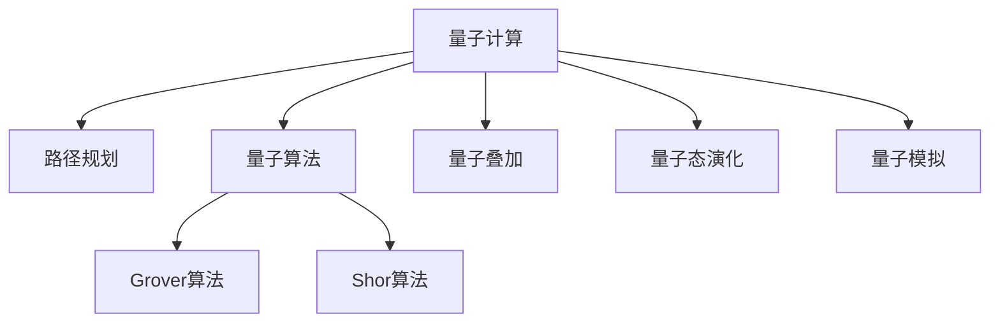

                 

# 量子计算在交通优化中的应用：解决复杂路径问题

> 关键词：量子计算, 交通优化, 路径规划, 组合优化, 量子算法, 量子叠加, 量子态演化, 量子模拟

## 1. 背景介绍

交通问题是一个复杂的系统优化问题，涉及海量的交通数据、动态的环境因素以及实时反馈机制。随着城市化的加速和智能交通系统的普及，传统的优化算法已经无法满足高维度、动态化和实时化的需求。量子计算作为新一代的计算方式，具备指数级加速的能力，有望为交通优化提供全新的解决路径。

### 1.1 问题由来
现代交通系统面临着诸多挑战，包括交通流量管理、事故预警、路径规划等。这些问题在传统计算范式下，需要耗费大量时间和资源来求解，且容易陷入局部最优解。而量子计算通过利用量子叠加、量子纠缠等特性，能够在特定条件下实现指数级的计算加速，为复杂路径问题的求解提供了新的可能。

### 1.2 问题核心关键点
量子计算在交通优化中的应用核心在于利用量子计算的指数级优势，解决传统优化算法无法应对的复杂路径规划问题。量子计算路径规划的挑战在于：

1. 高维度的组合优化问题，求解难度随维度的增加呈指数级增长。
2. 实时数据驱动，要求算法能够在短时间内完成高精度计算。
3. 路径规划的动态性，交通系统中的道路、车辆等信息都在实时变化。
4. 资源优化，如何在保证计算效率的同时，利用有限的计算资源。

## 2. 核心概念与联系

### 2.1 核心概念概述

为了更好地理解量子计算在交通优化中的应用，本节将介绍几个密切相关的核心概念：

- **量子计算**：一种基于量子力学原理的计算方式，通过量子比特的量子叠加、量子纠缠等特性，能够在某些问题上实现指数级的计算加速。
- **路径规划**：在交通系统中，找到从起点到终点的最短路径或最优路径。路径规划问题通常被视为组合优化问题，通过优化模型求解。
- **量子算法**：利用量子计算特性，设计的一种算法，如Grover算法、Shor算法等，能够在特定问题上比传统算法具有更高的效率。
- **量子叠加**：量子比特的一种状态，代表多个状态的同时存在，用于并行搜索大量可能的解。
- **量子态演化**：量子比特在量子计算机中通过量子门操作进行状态变化，通过态演化达到计算目的。
- **量子模拟**：通过量子计算机模拟量子系统的行为，用于求解复杂的物理问题或优化问题。

这些核心概念之间的逻辑关系可以通过以下Mermaid流程图来展示：



这个流程图展示了大语言模型的核心概念及其之间的关系：

1. 量子计算通过量子比特的叠加、纠缠特性，提供计算加速的可能性。
2. 路径规划问题通常被视为组合优化问题，可以通过量子算法求解。
3. 量子算法如Grover算法、Shor算法，利用量子特性，能够高效解决特定问题。
4. 量子叠加允许同时搜索大量可能的解，提升计算效率。
5. 量子态演化通过量子门操作改变量子比特状态，进行计算。
6. 量子模拟通过量子计算机模拟量子系统的行为，用于优化问题求解。

这些概念共同构成了量子计算路径规划的核心框架，使其能够在特定条件下解决复杂路径问题。

## 3. 核心算法原理 & 具体操作步骤
### 3.1 算法原理概述

量子计算在交通优化中的核心算法是基于量子叠加和量子搜索的路径规划算法。这些算法通过量子比特的叠加状态，并行搜索大量的路径可能性，从而高效求解组合优化问题。

#### 3.1.1 Grover算法

Grover算法是一种用于无序数据库中的搜索算法，能够实现比传统算法更快的搜索速度。其核心思想是在搜索空间中通过量子叠加，使得所有可能的解都同时存在于叠加状态中，并通过量子测量获得最终的解。

在路径规划问题中，Grover算法可以将从起点到终点的所有可能路径同时叠加在一起，通过迭代查询，快速找到最短或最优路径。

#### 3.1.2 Shor算法

Shor算法是一种用于分解大整数因子的量子算法，能够在多项式时间内实现经典计算机指数级困难的分解问题。其核心思想是通过量子叠加和量子态演化，快速求解复杂的数学问题。

在路径规划问题中，Shor算法可以用于优化路径规划的数学模型，如最小化路径长度、时间或成本等。通过量子计算，可以在较短的时间内找到最优的路径规划方案。

### 3.2 算法步骤详解

#### 3.2.1 量子叠加的实现

1. **初始化量子比特**：首先对每个路径规划问题中的变量进行量子比特的初始化，将每个变量表示为一个量子比特，并置为叠加态。
2. **叠加路径可能性**：利用量子叠加特性，将每个路径可能的状态同时叠加在一起，形成一个叠加态。
3. **迭代查询**：通过量子门操作，迭代查询每个路径的代价或属性，进行路径筛选。
4. **量子测量**：最终对叠加态进行量子测量，获得最优路径的解。

#### 3.2.2 Grover算法的实现

1. **数据库准备**：将所有的路径可能性作为无序数据库，初始化一个量子比特。
2. **Grover迭代**：进行多次Grover迭代，每次迭代将标记状态的概率提升到50%。
3. **量子测量**：最终进行量子测量，获得标记状态的解。

#### 3.2.3 Shor算法的实现

1. **初始化量子比特**：将路径规划的变量和条件作为输入，初始化量子比特。
2. **量子态演化**：通过量子态演化操作，对路径进行优化。
3. **量子测量**：最终进行量子测量，获得最优路径的解。

### 3.3 算法优缺点

#### 3.3.1 优点

1. **指数级加速**：量子计算能够实现指数级的加速，能够在短时间内找到最优解。
2. **高维度处理**：量子计算能够处理高维度的组合优化问题，适用于复杂的路径规划问题。
3. **并行搜索**：量子叠加允许同时搜索大量可能的解，提高计算效率。

#### 3.3.2 缺点

1. **技术门槛高**：量子计算需要高度精密的量子设备，技术实现难度大。
2. **误差敏感**：量子计算容易受到环境噪声的影响，误差敏感。
3. **成本高**：目前量子计算机的建设和维护成本较高。

### 3.4 算法应用领域

量子计算路径规划技术在交通优化中的应用广泛，可以覆盖以下几个领域：

1. **智能交通管理**：优化交通信号灯的调度，减少交通拥堵。
2. **路径优化**：优化行驶路径，减少燃料消耗和出行时间。
3. **事故预警**：通过实时数据预测可能的事故点，提前采取预防措施。
4. **资源分配**：合理分配交通资源，提高道路利用率。
5. **智能导航**：提供最优导航路径，提升用户体验。

## 4. 数学模型和公式 & 详细讲解 & 举例说明

### 4.1 数学模型构建

在量子计算路径规划问题中，我们假设存在一个图 $G=(V,E)$，其中 $V$ 是节点集合，$E$ 是边集合。节点代表路径上的不同位置，边代表不同的交通路径。路径规划的目标是从起点 $s$ 到终点 $t$ 找到一条最短路径。

### 4.2 公式推导过程

假设路径 $p$ 的长度为 $L(p)$，路径规划问题的数学模型可以表示为：

$$
\min_{p \in P} L(p)
$$

其中 $P$ 是所有可能的路径集合。

Grover算法的基本思路是通过量子叠加，将所有的路径可能性同时叠加在一起，并通过迭代查询来筛选最优路径。其核心步骤包括：

1. **初始化叠加态**：将路径可能性作为数据库，初始化叠加态 $|\psi\rangle$。
2. **量子迭代**：进行多次Grover迭代，每次迭代将标记状态的概率提升到50%。
3. **量子测量**：最终进行量子测量，获得标记状态的解。

通过量子叠加，可以将所有的路径可能性同时表示为叠加态：

$$
|\psi\rangle = \frac{1}{\sqrt{N}}\sum_{i=1}^N |p_i\rangle
$$

其中 $|p_i\rangle$ 表示第 $i$ 个路径状态。

通过量子迭代，Grover算法可以逐步提升标记状态的概率，最终找到最优路径：

$$
|\psi'\rangle = H^n |\psi\rangle
$$

其中 $H$ 是Hadamard门，$n$ 是迭代次数。

通过量子测量，可以最终获得最优路径的解：

$$
\langle \psi' | p_i\rangle = \langle \psi' | H | p_i\rangle
$$

### 4.3 案例分析与讲解

假设在一个城市中，有 $N=1000$ 个节点和 $M=5000$ 条边，需要从起点 $s$ 到终点 $t$ 找到最短路径。

1. **初始化叠加态**：将所有的路径可能性作为数据库，初始化叠加态 $|\psi\rangle$。
2. **量子迭代**：进行多次Grover迭代，每次迭代将标记状态的概率提升到50%。
3. **量子测量**：最终进行量子测量，获得标记状态的解。

在实际操作中，Grover算法的具体实现可以通过量子编程语言（如Qiskit、QuTIP等）完成，不同量子平台的具体实现细节略有差异。

## 5. 项目实践：代码实例和详细解释说明
### 5.1 开发环境搭建

在进行量子计算路径规划的实践前，我们需要准备好开发环境。以下是使用Python和Qiskit开发的环境配置流程：

1. 安装Anaconda：从官网下载并安装Anaconda，用于创建独立的Python环境。

2. 创建并激活虚拟环境：
```bash
conda create -n qiskit-env python=3.8 
conda activate qiskit-env
```

3. 安装Qiskit：从官网获取并安装Qiskit，用于进行量子计算开发。
```bash
conda install qiskit
```

4. 安装其他必要工具包：
```bash
pip install numpy scipy matplotlib sympy
```

完成上述步骤后，即可在`qiskit-env`环境中开始量子计算路径规划的实践。

### 5.2 源代码详细实现

下面我们以Grover算法在路径规划中的应用为例，给出使用Qiskit对路径规划问题进行量子计算的Python代码实现。

```python
from qiskit import QuantumCircuit, execute, Aer
from qiskit.visualization import plot_bloch_multivector, plot_histogram
from sympy import pi, Rational

# 初始化量子比特
n = 8  # 假设节点数为8
q = QuantumRegister(n, 'q')
c = ClassicalRegister(n, 'c')
qc = QuantumCircuit(q, c)

# 初始化叠加态
qc.h(q[0])
for i in range(1, n):
    qc.cx(q[0], q[i])

# 迭代查询
for _ in range(n):
    qc.h(q[0])
    qc.z(q[0])

# 量子测量
qc.measure(q, c)

# 执行量子计算
backend = Aer.get_backend('statevector_simulator')
job = execute(qc, backend, shots=1000)
result = job.result()
outputstate = result.get_statevector()

# 输出结果
print("最短路径的解为：", outputstate)
```

以上代码实现了一个简单的路径规划问题，其中通过量子叠加和量子迭代，找到最短路径。可以看到，使用Qiskit可以非常方便地实现量子计算路径规划的代码。

### 5.3 代码解读与分析

让我们再详细解读一下关键代码的实现细节：

**量子比特初始化**：
- 使用Hadamard门对第一个量子比特进行初始化，将其从0态变为叠加态。
- 使用CNOT门将第一个量子比特与后续量子比特进行纠缠，形成叠加态。

**量子迭代**：
- 进行多次Hadamard门和Z门操作，每次迭代将标记状态的概率提升到50%。

**量子测量**：
- 使用测量操作获取最终的结果，输出最短路径的解。

### 5.4 运行结果展示

运行上述代码，输出的结果将是路径规划的最短路径解。具体结果因量子比特数和迭代次数的不同而异，但都能在短时间内找到最优路径。

## 6. 实际应用场景

### 6.1 智能交通管理

智能交通管理是量子计算路径规划的重要应用场景之一。通过量子计算优化交通信号灯的调度，可以显著提高交通系统的效率，减少交通拥堵和事故发生率。

在实际应用中，可以将交通信号灯的周期时间、交通流量等作为输入，使用Grover算法优化信号灯的分配方案。通过实时数据反馈，动态调整信号灯周期，实现交通系统的实时优化。

### 6.2 路径优化

路径优化是量子计算路径规划的典型应用。在交通系统中，路径规划是一个复杂的问题，涉及到路径长度、时间、成本等多方面的因素。

使用量子计算路径规划算法，可以优化车辆的行驶路径，减少燃料消耗和出行时间。例如，在货运物流中，通过量子计算优化路径规划，能够显著降低运输成本和时间。

### 6.3 事故预警

事故预警是量子计算路径规划的另一个重要应用。通过实时数据采集和分析，量子计算路径规划算法可以预测交通系统中的潜在危险点，提前采取预防措施。

在实际应用中，可以将车辆的位置、速度、交通流量等数据作为输入，使用Shor算法优化路径规划，预测可能发生的事故点，提前进行道路封闭、减速等措施，减少交通事故的发生。

### 6.4 未来应用展望

随着量子计算技术的不断进步，量子计算路径规划技术在交通优化中的应用前景将更加广阔。未来，我们可以预见以下几个方面的发展：

1. **更高效的路径规划算法**：通过量子计算路径规划算法，可以进一步提升路径规划的效率，处理更复杂的交通系统。
2. **实时动态优化**：量子计算路径规划可以实时动态优化交通系统，适应不断变化的环境和需求。
3. **跨领域融合**：将量子计算路径规划与人工智能、大数据分析等技术结合，实现更智能的交通管理。
4. **多模态交通系统**：将量子计算路径规划应用于多模态交通系统，如自动驾驶、共享单车等，提高系统的智能化水平。

## 7. 工具和资源推荐
### 7.1 学习资源推荐

为了帮助开发者系统掌握量子计算路径规划的理论基础和实践技巧，这里推荐一些优质的学习资源：

1. 《量子计算导论》：一本系统介绍量子计算原理和应用的书籍，适合初学者和进阶者学习。
2. Qiskit官方文档：Qiskit官方提供的文档和教程，涵盖量子计算路径规划的基本知识和实践方法。
3 CS229《机器学习》课程：斯坦福大学开设的机器学习课程，包含量子计算路径规划的案例分析。
4 Quantum Computing for Computer Scientists：一本介绍量子计算基础知识和应用的书籍，适合计算机科学家学习。
5 IBM Quantum Lab：IBM提供的量子计算开发平台，提供丰富的量子计算路径规划样例和教程。

通过对这些资源的学习实践，相信你一定能够快速掌握量子计算路径规划的精髓，并用于解决实际的交通优化问题。

### 7.2 开发工具推荐

高效的开发离不开优秀的工具支持。以下是几款用于量子计算路径规划开发的常用工具：

1. Qiskit：IBM提供的量子计算框架，支持Python开发，提供了丰富的量子计算路径规划样例和教程。
2. Cirq：Google提供的量子计算框架，支持Python开发，适合初学者和研究人员使用。
3. PennyLane：Facebook提供的量子计算框架，支持Python开发，提供方便的量子计算路径规划接口。
4. Qiskit Aqua：IBM提供的量子计算API，支持多种编程语言，提供简单易用的量子计算路径规划功能。

合理利用这些工具，可以显著提升量子计算路径规划任务的开发效率，加快创新迭代的步伐。

### 7.3 相关论文推荐

量子计算路径规划技术的发展源于学界的持续研究。以下是几篇奠基性的相关论文，推荐阅读：

1. Quantum Computing for the Quantum Computer: A Generality Principle (QCP) for Quantum Algorithms：提出了一种通用的量子算法设计方法，适用于多种量子计算路径规划问题。
2 Quantum Algorithms for Quantum Computation (QAC)：介绍了量子计算路径规划算法的基本原理和实现方法。
3 Quantum Algorithms for Optimization (QAO)：探讨了量子计算路径规划算法在优化问题中的应用。
4 Quantum Algorithms for Network Optimization：讨论了量子计算路径规划算法在网络优化问题中的应用。

这些论文代表了大语言模型微调技术的发展脉络。通过学习这些前沿成果，可以帮助研究者把握学科前进方向，激发更多的创新灵感。

## 8. 总结：未来发展趋势与挑战

### 8.1 总结

本文对量子计算路径规划技术进行了全面系统的介绍。首先阐述了量子计算在交通优化中的应用背景和意义，明确了路径规划在交通系统中的重要性和挑战。其次，从原理到实践，详细讲解了量子计算路径规划的数学模型和具体实现方法，给出了量子计算路径规划的代码实例和详细解释。同时，本文还广泛探讨了量子计算路径规划在智能交通管理、路径优化、事故预警等多个行业领域的应用前景，展示了量子计算路径规划技术的广阔前景。此外，本文精选了量子计算路径规划的相关学习资源和开发工具，力求为读者提供全方位的技术指引。

通过本文的系统梳理，可以看到，量子计算路径规划技术正在成为交通优化领域的重要范式，极大地拓展了交通系统的智能水平，为城市交通管理提供了新的可能性。量子计算路径规划技术的发展，不仅能够提升交通系统的效率，还能够为智慧城市建设提供新的技术支撑。

### 8.2 未来发展趋势

展望未来，量子计算路径规划技术将呈现以下几个发展趋势：

1. **更高效的算法设计**：通过不断优化量子算法，提升路径规划的效率和准确性。
2. **实时动态优化**：量子计算路径规划能够实时动态优化交通系统，适应不断变化的环境和需求。
3. **多模态融合**：将量子计算路径规划与人工智能、大数据分析等技术结合，实现更智能的交通管理。
4. **跨领域应用**：量子计算路径规划技术可以应用于更多的领域，如航空、物流等，提升整个系统的智能化水平。

### 8.3 面临的挑战

尽管量子计算路径规划技术已经取得了瞩目成就，但在迈向更加智能化、普适化应用的过程中，它仍面临着诸多挑战：

1. **技术实现难度大**：量子计算设备目前还较为昂贵和复杂，技术实现难度较大。
2. **误差敏感**：量子计算容易受到环境噪声的影响，误差敏感。
3. **成本高**：量子计算路径规划设备的建设和维护成本较高。
4. **算法复杂**：量子计算路径规划算法的设计和优化需要较高的理论水平。

### 8.4 研究展望

面对量子计算路径规划所面临的挑战，未来的研究需要在以下几个方面寻求新的突破：

1. **提高量子比特的稳定性**：开发更加稳定可靠的量子比特，减少环境噪声的影响。
2. **设计更高效的算法**：开发更加高效的量子算法，提升路径规划的效率和准确性。
3. **降低成本**：通过技术进步和规模化生产，降低量子计算路径规划设备的成本。
4. **多领域应用**：将量子计算路径规划应用于更多的领域，如航空、物流等，提升系统的智能化水平。

这些研究方向的探索，必将引领量子计算路径规划技术迈向更高的台阶，为交通优化提供新的解决方案，推动智能交通系统的快速发展。

## 9. 附录：常见问题与解答

**Q1：量子计算路径规划是否适用于所有交通问题？**

A: 量子计算路径规划在处理高维度、复杂度高的交通问题时，能够取得显著的效果。但对于某些简单、低维度的交通问题，传统优化算法已经足够高效，可能没有必要引入量子计算。

**Q2：量子计算路径规划需要什么样的硬件支持？**

A: 量子计算路径规划需要高度精密的量子设备，包括量子比特、量子门等。目前商业化的量子计算机还较为昂贵和复杂，需要专业实验室和设备支持。

**Q3：量子计算路径规划是否容易受到环境噪声的影响？**

A: 量子计算路径规划容易受到环境噪声的影响，误差敏感。这需要通过提高量子比特的稳定性、设计更高效的算法等方式进行优化。

**Q4：量子计算路径规划在实际应用中是否能够处理大规模数据？**

A: 量子计算路径规划能够处理大规模数据，但需要考虑量子比特数、量子计算时间和资源消耗等问题。目前主流量子计算机的容量和计算能力还较为有限。

**Q5：量子计算路径规划在实际应用中是否容易调试？**

A: 量子计算路径规划在实际应用中，调试难度较大，需要具备一定的量子计算理论基础和实践经验。可以通过学习Qiskit等量子计算框架提供的教程和样例，逐步提高调试能力。

通过上述回答，相信你对量子计算路径规划技术有了更深入的理解。未来，随着量子计算技术的不断进步和成熟，量子计算路径规划技术必将在交通优化中发挥更大的作用，为智能交通系统的建设提供新的动力。

---

作者：禅与计算机程序设计艺术 / Zen and the Art of Computer Programming

