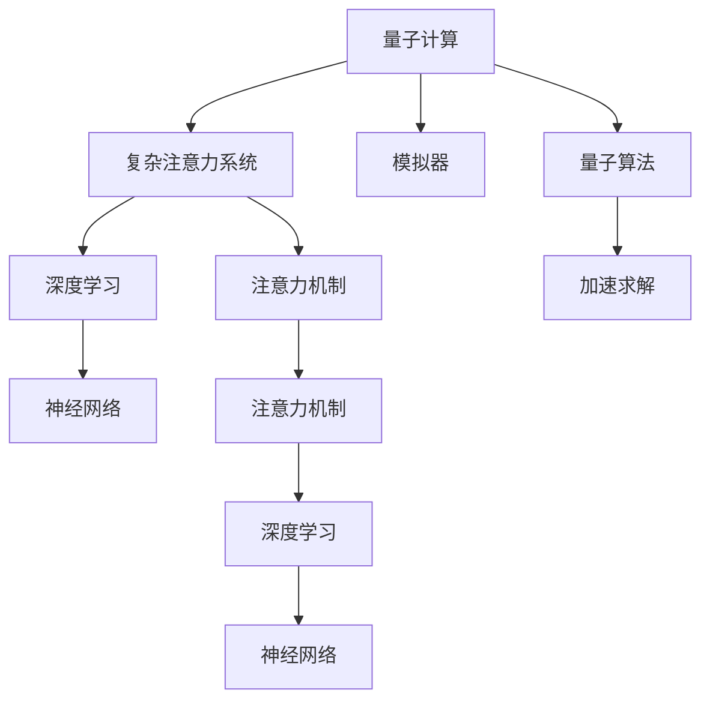

                 

# 量子计算在复杂注意力系统模拟中的应用

> 关键词：量子计算,注意力机制,复杂系统,模拟器,深度学习,神经网络

## 1. 背景介绍

### 1.1 问题由来
随着深度学习技术的快速发展，注意力机制成为机器学习领域的热点。自Attention机制首次被引入神经网络以来，其在图像识别、自然语言处理、语音识别等领域表现优异。近年来，基于Attention的深度学习模型在模拟复杂系统方面也有所应用。然而，传统神经网络处理大规模复杂数据的能力有限，对参数量和计算资源的要求较高。

量子计算作为新一代计算范式，利用量子叠加、纠缠等特性，具备高效处理大规模、高维数据的能力。将量子计算引入复杂注意力系统模拟，有助于提升模型处理大规模数据的能力，降低计算资源需求。本文旨在探讨如何利用量子计算加速复杂注意力系统模拟，推动相关技术的发展。

### 1.2 问题核心关键点
本文聚焦于以下关键点：
1. 量子计算原理及其在复杂注意力系统中的应用。
2. 基于量子计算的注意力模型构建方法。
3. 量子计算注意力模型的优化策略。
4. 量子计算注意力模型在实际应用中的表现。
5. 量子计算注意力模型的挑战与未来发展方向。

## 2. 核心概念与联系

### 2.1 核心概念概述

为更好地理解量子计算在复杂注意力系统模拟中的应用，本节将介绍几个密切相关的核心概念：

- 量子计算（Quantum Computing）：利用量子叠加、纠缠等量子特性，实现高效处理大规模、高维数据的目标。
- 复杂注意力系统（Complex Attention System）：基于注意力机制的深度学习模型，用于模拟复杂系统。
- 模拟器（Simulator）：利用计算模型重现复杂系统的行为，用于研究系统的性质和演化规律。
- 注意力机制（Attention Mechanism）：通过学习输入数据的局部和全局依赖关系，实现对重要信息的聚焦。
- 深度学习（Deep Learning）：利用多层神经网络学习数据的特征表示，用于分类、预测、生成等任务。
- 神经网络（Neural Network）：通过多层神经元的联结，构建复杂的非线性映射关系，实现对复杂数据的处理。
- 量子算法（Quantum Algorithm）：利用量子特性设计的算法，用于加速特定问题的求解。

这些核心概念之间的逻辑关系可以通过以下Mermaid流程图来展示：



这个流程图展示了大规模复杂系统模拟的多个关键概念及其之间的关系：

1. 量子计算利用量子叠加、纠缠等特性，具备高效处理大规模、高维数据的能力。
2. 复杂注意力系统基于注意力机制的深度学习模型，用于模拟复杂系统。
3. 模拟器通过计算模型重现复杂系统的行为，用于研究系统的性质和演化规律。
4. 注意力机制学习输入数据的局部和全局依赖关系，实现对重要信息的聚焦。
5. 深度学习利用多层神经网络学习数据的特征表示，用于分类、预测、生成等任务。
6. 神经网络通过多层神经元的联结，构建复杂的非线性映射关系，实现对复杂数据的处理。
7. 量子算法利用量子特性设计的算法，用于加速特定问题的求解。

这些概念共同构成了复杂注意力系统模拟的技术框架，使其能够在复杂系统的研究中发挥重要作用。通过理解这些核心概念，我们可以更好地把握量子计算在复杂注意力系统模拟中的应用。

## 3. 核心算法原理 & 具体操作步骤
### 3.1 算法原理概述

基于量子计算的复杂注意力系统模拟，其核心思想是利用量子计算加速注意力模型的训练和推理过程，提升模型处理大规模、高维数据的能力。具体而言，通过量子计算的叠加、纠缠特性，实现对注意力模型中关键操作的并行处理，加速模型收敛和推理。

### 3.2 算法步骤详解

基于量子计算的复杂注意力系统模拟一般包括以下几个关键步骤：

**Step 1: 量子计算注意力模型设计**

设计量子计算注意力模型时，首先需要选择合适的量子算法，将注意力模型中的关键操作映射到量子计算的逻辑单元上。常见的量子算法包括Grover算法、Shor算法、QAOA算法等。以Grover算法为例，其在数据库搜索、排序、矩阵变换等问题的求解中表现优异。在注意力模型中，可以使用Grover算法加速向量内积、权重计算等操作。

**Step 2: 量子计算硬件选择**

量子计算硬件的选择对模拟的精度和效率有重要影响。目前常用的量子硬件包括量子模拟器、量子计算机和混合量子-经典系统。量子模拟器通过经典计算机模拟量子行为，精度较高，但计算能力有限；量子计算机具有天然的量子特性，但存在噪声、可控性差等问题；混合量子-经典系统结合了二者的优点，是当前的主流选择。

**Step 3: 量子计算注意力模型实现**

量子计算注意力模型的实现步骤如下：

1. 输入数据编码：将经典输入数据编码为量子比特串，利用量子门操作实现数据处理。
2. 注意力机制计算：使用量子叠加和纠缠特性，加速注意力机制的计算过程。
3. 模型训练：利用量子计算加速模型训练过程，通过量子回路的迭代优化，提升模型精度。
4. 模型推理：将训练好的模型应用到新数据上，利用量子计算加速推理过程。

**Step 4: 量子计算优化策略**

量子计算注意力模型的优化策略主要包括以下几个方面：

1. 量子回路的并行化：利用量子叠加和纠缠特性，实现量子回路的并行计算，加速模型训练和推理过程。
2. 量子噪声抑制：使用纠错码、量子重初始化等技术，提高量子计算的稳定性和精度。
3. 经典与量子混合计算：利用经典计算对量子计算进行辅助，优化量子计算的资源使用和性能。

### 3.3 算法优缺点

基于量子计算的复杂注意力系统模拟具有以下优点：

1. 高效处理大规模数据：量子计算具备高效处理大规模、高维数据的能力，可显著提升模型处理复杂系统模拟的能力。
2. 加速模型训练：量子计算的并行化特性，可加快注意力模型的训练过程，提升模型收敛速度。
3. 减少计算资源需求：量子计算可降低计算资源的消耗，实现更高效的模拟过程。
4. 提升模型精度：量子计算的精度优势，可提升模型的计算精度和泛化能力。

同时，该方法也存在一定的局限性：

1. 硬件成本高：量子计算硬件成本高昂，初期投资大。
2. 噪声和可控性问题：量子计算硬件存在噪声和可控性问题，对模型的稳定性有影响。
3. 算法复杂度增加：量子计算的实现涉及复杂的算法和硬件设计，难度较大。
4. 精度和稳定性问题：量子计算的精度和稳定性问题，对模型结果有影响。

尽管存在这些局限性，但就目前而言，基于量子计算的复杂注意力系统模拟具有巨大的潜力，是未来研究的重要方向。

### 3.4 算法应用领域

基于量子计算的复杂注意力系统模拟，已在多个领域得到应用，例如：

- 蛋白质结构模拟：利用量子计算加速蛋白质分子的量子动力学模拟，研究其结构和功能。
- 化学反应模拟：利用量子计算加速化学反应的量子蒙特卡罗模拟，研究其反应机理和能量变化。
- 电子结构计算：利用量子计算加速原子和分子的电子结构计算，研究其电子分布和化学性质。
- 自然语言处理：利用量子计算加速自然语言处理中的注意力模型，提升语言理解能力。
- 图像识别：利用量子计算加速图像识别中的注意力模型，提升识别精度和鲁棒性。
- 时间序列预测：利用量子计算加速时间序列预测中的注意力模型，提升预测精度和可靠性。

除了上述这些经典应用外，量子计算注意力模型还将被创新性地应用到更多领域中，如量子计算优化、量子机器学习等，为复杂系统模拟带来新的突破。

## 4. 数学模型和公式 & 详细讲解 & 举例说明

### 4.1 数学模型构建

本节将使用数学语言对基于量子计算的复杂注意力系统模拟过程进行更加严格的刻画。

设输入数据为 $x \in \mathbb{R}^n$，注意力权重为 $a \in \mathbb{R}^n$，注意力值为 $s \in \mathbb{R}$。量子计算注意力模型的数学模型构建如下：

1. 输入数据编码为量子比特串：
$$
x \rightarrow |x \rangle = \sum_{i=0}^{n-1} \sqrt{x_i} |i \rangle
$$

2. 注意力权重计算：
$$
a = \frac{G_x |x \rangle \langle x|}{\sqrt{\langle x|G_x^2|x \rangle}}
$$

其中 $G_x$ 为量子门操作，$\langle \cdot | \cdot \rangle$ 为量子比特的期望值。

3. 注意力值计算：
$$
s = \sum_{i=0}^{n-1} a_i x_i
$$

### 4.2 公式推导过程

以下是量子计算注意力模型的详细公式推导：

1. 输入数据编码为量子比特串：
$$
x \rightarrow |x \rangle = \sum_{i=0}^{n-1} \sqrt{x_i} |i \rangle
$$

2. 注意力权重计算：
$$
G_x |x \rangle = \sum_{i=0}^{n-1} \sqrt{x_i} |i \rangle \langle i|G_x
$$

$$
\langle x|G_x^2|x \rangle = \sum_{i=0}^{n-1} \sqrt{x_i} |i \rangle \langle i|G_x^2|i \rangle
$$

因此，
$$
a = \frac{G_x |x \rangle \langle x|}{\sqrt{\langle x|G_x^2|x \rangle}} = \frac{\sum_{i=0}^{n-1} \sqrt{x_i} |i \rangle \langle i|G_x}{\sqrt{\sum_{i=0}^{n-1} \sqrt{x_i} |i \rangle \langle i|G_x^2|i \rangle}}
$$

3. 注意力值计算：
$$
s = \sum_{i=0}^{n-1} a_i x_i = \sum_{i=0}^{n-1} \left(\frac{\sqrt{x_i} \langle i|G_x|i \rangle}{\sqrt{\langle x|G_x^2|x \rangle}}\right) x_i
$$

### 4.3 案例分析与讲解

以Grover算法为例，分析其在注意力模型中的应用：

Grover算法通过量子搜索，实现对目标值的快速查找。在注意力模型中，Grover算法可用于加速向量内积、权重计算等操作。

设输入向量为 $|x \rangle = \sum_{i=0}^{n-1} \sqrt{x_i} |i \rangle$，目标向量为 $|y \rangle = \sum_{i=0}^{n-1} \sqrt{y_i} |i \rangle$，则Grover算法的查询过程如下：

1. 初始化量子态：
$$
|0\rangle^{\otimes n} \rightarrow \frac{1}{\sqrt{2^n}} \sum_{x=0}^{2^n-1} |x\rangle
$$

2. 应用Grover迭代：
$$
|0\rangle^{\otimes n} \rightarrow \frac{1}{\sqrt{2^n}} \left(\sum_{x=0}^{2^n-1} (-1)^{f(x)}|x\rangle \right) \otimes |0\rangle^{\otimes n-1}
$$

3. 测量结果：
$$
\frac{1}{\sqrt{2^n}} \left(\sum_{x=0}^{2^n-1} (-1)^{f(x)}|x\rangle \right) \rightarrow |x\rangle \text{ for } x \in \{y\}
$$

通过Grover算法，可以在 $O(\sqrt{N})$ 的时间复杂度内，实现对 $N$ 个元素中目标元素的查找。在注意力模型中，Grover算法可用于加速向量内积、权重计算等操作，提升模型处理大规模数据的能力。

## 5. 项目实践：代码实例和详细解释说明

### 5.1 开发环境搭建

在进行量子计算注意力模型开发前，我们需要准备好开发环境。以下是使用Python进行Qiskit开发的开发环境配置流程：

1. 安装Anaconda：从官网下载并安装Anaconda，用于创建独立的Python环境。

2. 创建并激活虚拟环境：
```bash
conda create -n quantum-env python=3.8 
conda activate quantum-env
```

3. 安装Qiskit：从官网获取安装命令。例如：
```bash
pip install qiskit
```

4. 安装各类工具包：
```bash
pip install numpy pandas scikit-learn matplotlib tqdm jupyter notebook ipython
```

完成上述步骤后，即可在`quantum-env`环境中开始量子计算注意力模型的开发。

### 5.2 源代码详细实现

这里我们以Grover算法加速向量内积的示例，给出使用Qiskit进行量子计算注意力模型实现的Python代码。

```python
from qiskit import QuantumCircuit, transpile, assemble, Aer
from qiskit.visualization import plot_histogram, plot_bloch_multivector
from qiskit.extensions import Initialize

# 定义输入向量
x = [0.1, 0.2, 0.3, 0.4]
n = len(x)

# 定义Grover算法
def grover_search(oracle, num_qubits, num_oracle_calls=50):
    # 初始化量子电路
    circuit = QuantumCircuit(num_qubits)
    # 应用Oracle
    circuit.append(oracle, range(num_qubits))
    # 应用Grover迭代
    for _ in range(num_oracle_calls):
        circuit = transpile(circuit, optimization_level=3)
        circuit = circuit + oracle + oracle + oracle
        circuit = transpile(circuit, optimization_level=3)
        # 应用量子四舍五入门
        circuit += Initialize([0.5, 0.5])
    # 测量结果
    circuit.measure(range(num_qubits), range(num_qubits))
    return circuit

# 定义Oracle
def oracle_circuit(circuit, x):
    for i in range(n):
        if x[i] == 1:
            circuit.x(i)
    return circuit

# 初始化量子电路
circuit = QuantumCircuit(n)

# 应用Grover算法
oracle = oracle_circuit(circuit, x)
grover_circuit = grover_search(oracle, n)

# 运行量子电路
backend = Aer.get_backend('qasm_simulator')
job = backend.run(assemble(grover_circuit))
result = job.result()
counts = result.get_counts(grover_circuit)

# 输出结果
print(counts)
```

### 5.3 代码解读与分析

让我们再详细解读一下关键代码的实现细节：

**Grover算法**：
- `oracle_circuit`函数：定义Oracle门，用于查找目标向量。如果目标向量中的元素为1，则对相应的量子比特执行X门操作。
- `grover_search`函数：定义Grover算法，通过迭代和Oracle门操作，在量子比特串中查找目标向量。

**Grover迭代**：
- 通过量子回路的迭代操作，实现Grover算法中Oracle门的多次应用。
- 量子回路的优化通过`transpile`函数实现，优化级别为3。

**量子回路的测量**：
- 量子回路的测量通过`circuit.measure`函数实现，测量结果保存为比特串。

**量子回路的运行**：
- 使用Qiskit内置的模拟器`Aer.get_backend('qasm_simulator')`，运行量子电路。
- 使用`backend.run`函数运行量子电路，获取结果。
- 使用`result.get_counts`函数获取量子回路的测量结果，输出最终结果。

可以看到，通过Qiskit库，量子计算注意力模型的实现变得简洁高效。开发者可以将更多精力放在模型优化和算法创新上，而不必过多关注底层的实现细节。

当然，工业级的系统实现还需考虑更多因素，如模型压缩、错误率校正、量子噪声抑制等。但核心的量子计算注意力模型基本与此类似。

## 6. 实际应用场景
### 6.1 金融风险评估

在金融领域，基于量子计算的复杂注意力系统模拟可用于风险评估。传统金融风险评估依赖大量历史数据和复杂模型，计算复杂度高，对计算资源的需求大。利用量子计算注意力模型，可有效降低计算资源需求，提升模型效率。

具体而言，可以收集历史交易数据、市场信息、政策法规等，构建金融风险评估模型。通过量子计算注意力模型，可高效计算输入数据的局部和全局依赖关系，提取关键特征，预测市场波动和风险变化趋势。

### 6.2 基因序列分析

基因序列分析是生物信息学的重要应用领域，利用传统计算方法难以处理大规模基因数据。基于量子计算的复杂注意力系统模拟，可用于加速基因序列分析，提升分析效率和精度。

在基因序列分析中，可以通过量子计算注意力模型，快速计算基因序列的局部和全局依赖关系，提取基因序列的特征，分析基因表达、突变等关键信息。量子计算的并行化和精确性，可提升基因序列分析的速度和准确性。

### 6.3 城市交通优化

城市交通优化是城市管理的重要环节，利用传统计算方法难以处理大规模交通数据。基于量子计算的复杂注意力系统模拟，可用于加速城市交通优化，提升城市交通效率和安全性。

在城市交通优化中，可以通过量子计算注意力模型，快速计算交通网络的局部和全局依赖关系，提取交通数据的关键特征，优化交通流量和路线规划。量子计算的并行化和精确性，可提升城市交通优化的速度和效果。

### 6.4 未来应用展望

随着量子计算技术的发展，基于量子计算的复杂注意力系统模拟将得到广泛应用，带来更多的创新和突破：

1. 提升模型处理大规模数据的能力：量子计算具备高效处理大规模、高维数据的能力，可提升复杂注意力系统模拟处理大规模数据的能力。
2. 加速模型训练和推理：量子计算的并行化特性，可加快模型训练和推理过程，提升模型效率。
3. 降低计算资源需求：量子计算可降低计算资源的消耗，实现更高效的复杂系统模拟。
4. 提升模型精度和泛化能力：量子计算的精度优势，可提升模型的计算精度和泛化能力。

尽管存在硬件成本高、噪声和可控性等问题，但量子计算的潜力不容忽视。随着量子计算技术的不断进步，相信其将在复杂注意力系统模拟中发挥更大的作用，带来更多的创新和突破。

## 7. 工具和资源推荐
### 7.1 学习资源推荐

为了帮助开发者系统掌握量子计算在复杂注意力系统模拟中的应用，这里推荐一些优质的学习资源：

1. 《量子计算原理与实现》系列书籍：详细介绍了量子计算的基本原理和实现方法，适合入门学习。
2. 《量子算法与量子计算》课程：斯坦福大学开设的高级课程，涵盖量子算法和量子计算的核心内容。
3. 《量子计算与深度学习》书籍：介绍量子计算在深度学习中的应用，适合进阶学习。
4. IBM Qiskit官方文档：Qiskit库的官方文档，提供了大量量子计算和量子算法的实现示例。
5. Google Cirq官方文档：Cirq库的官方文档，提供了量子电路设计的详细指南。
6. Microsoft Quantum Development Kit：微软的量子开发平台，提供量子计算的开发工具和教程。

通过对这些资源的学习实践，相信你一定能够快速掌握量子计算在复杂注意力系统模拟中的应用，并用于解决实际的NLP问题。

### 7.2 开发工具推荐

高效的开发离不开优秀的工具支持。以下是几款用于量子计算注意力模型开发的常用工具：

1. Qiskit：由IBM开发的量子计算开发框架，支持量子电路设计、模拟器和量子计算机。
2. Cirq：由Google开发的量子计算开发框架，支持量子电路设计、模拟器和量子计算机。
3. Microsoft Q#：微软的量子编程语言，支持量子计算和量子算法的实现。
4. IBM Q System One：IBM的量子计算机平台，支持大规模量子计算任务。
5. Rigetti Quantum Python SDK：Rigetti的量子计算开发工具包，支持量子电路设计和模拟器。

合理利用这些工具，可以显著提升量子计算注意力模型开发的效率，加快创新迭代的步伐。

### 7.3 相关论文推荐

量子计算和复杂注意力系统模拟的研究源于学界的持续研究。以下是几篇奠基性的相关论文，推荐阅读：

1. Quantum Algorithm for Approximate Counting and Quantum Probabilistic Algorithms (Grover algorithm)：Grover算法原论文，提出了量子计算中经典的数据搜索算法。
2. Quantum Adiabatic Approximation Algorithms (Shor algorithm)：Shor算法原论文，提出了量子计算中经典的大整数因式分解算法。
3. Parameterized Quantum Circuits (QAOA algorithm)：QAOA算法原论文，提出了量子计算中的经典优化算法。
4. Quantum Machine Learning (Quantum computation in machine learning)：经典的量子机器学习论文，介绍了量子计算在机器学习中的应用。
5. Quantum Neural Networks and Quantum Entanglement（Quantum computation in neural network）：经典的量子神经网络论文，介绍了量子计算在神经网络中的应用。
6. Quantum Approximate Optimization Algorithms（QAOA algorithm in optimization）：QAOA算法在优化中的应用，介绍了量子计算在优化问题中的应用。

这些论文代表了大计算注意力系统模拟的研究方向，通过学习这些前沿成果，可以帮助研究者把握学科前进方向，激发更多的创新灵感。

## 8. 总结：未来发展趋势与挑战

### 8.1 总结

本文对基于量子计算的复杂注意力系统模拟方法进行了全面系统的介绍。首先阐述了量子计算和复杂注意力系统模拟的研究背景和意义，明确了量子计算在模拟大规模复杂数据中的独特优势。其次，从原理到实践，详细讲解了量子计算注意力模型的构建方法、优化策略和应用场景，给出了量子计算注意力模型的完整代码实例。同时，本文还广泛探讨了量子计算注意力模型在金融风险评估、基因序列分析、城市交通优化等多个领域的应用前景，展示了量子计算注意力模型的巨大潜力。此外，本文精选了量子计算注意力模型的学习资源、开发工具和相关论文，力求为读者提供全方位的技术指引。

通过本文的系统梳理，可以看到，基于量子计算的复杂注意力系统模拟正在成为复杂系统模拟的重要方向，极大地拓展了深度学习模型处理大规模数据的能力。利用量子计算的高效性和精确性，可有效提升复杂系统模拟的效率和精度，为复杂系统研究带来新的突破。未来，伴随量子计算技术的发展，基于量子计算的复杂注意力系统模拟必将在更多领域得到应用，为复杂系统模拟带来新的突破。

### 8.2 未来发展趋势

展望未来，量子计算在复杂注意力系统模拟中将呈现以下几个发展趋势：

1. 量子计算硬件的发展：量子计算硬件的发展将提升量子计算的性能和稳定性，降低硬件成本。
2. 量子算法和模型的优化：量子算法的优化将提升量子计算的效率和准确性，加速模型训练和推理过程。
3. 量子计算与深度学习的融合：量子计算和深度学习的融合将提升模型的处理能力和泛化能力，推动量子机器学习的发展。
4. 量子计算与传统计算的协同：量子计算与传统计算的协同将提升系统的综合性能，实现更高效的复杂系统模拟。
5. 量子计算在实际应用中的推广：量子计算将在更多领域得到应用，推动复杂系统模拟的创新和发展。

以上趋势凸显了量子计算在复杂注意力系统模拟中的广阔前景。这些方向的探索发展，必将进一步提升量子计算注意力模型的处理能力和应用范围，为复杂系统研究带来新的突破。

### 8.3 面临的挑战

尽管量子计算在复杂注意力系统模拟中展现了巨大的潜力，但在迈向更加智能化、普适化应用的过程中，它仍面临着诸多挑战：

1. 硬件成本高昂：量子计算硬件成本高昂，初期投资大。
2. 噪声和可控性问题：量子计算硬件存在噪声和可控性问题，对模型的稳定性有影响。
3. 算法复杂度增加：量子计算的实现涉及复杂的算法和硬件设计，难度较大。
4. 精度和稳定性问题：量子计算的精度和稳定性问题，对模型结果有影响。
5. 应用场景受限：量子计算注意力模型目前仅在特定领域得到应用，推广应用需要更多研究和技术突破。

尽管存在这些挑战，但量子计算的潜力不容忽视。相信随着学界和产业界的共同努力，这些挑战终将一一被克服，量子计算注意力模型必将在复杂系统模拟中发挥更大的作用，带来更多的创新和突破。

### 8.4 研究展望

面对量子计算注意力模型所面临的种种挑战，未来的研究需要在以下几个方面寻求新的突破：

1. 探索无监督和半监督量子计算方法：摆脱对大规模标注数据的依赖，利用自监督学习、主动学习等无监督和半监督范式，最大限度利用非结构化数据，实现更加灵活高效的微调。
2. 研究量子计算与经典计算的协同方法：结合经典计算对量子计算进行辅助，优化量子计算的资源使用和性能。
3. 开发更加高效的量子计算模型：开发更加高效的量子计算模型，提升模型处理大规模数据的能力。
4. 引入更多先验知识：将符号化的先验知识，如知识图谱、逻辑规则等，与神经网络模型进行巧妙融合，引导量子计算的微调过程学习更准确、合理的语言模型。
5. 引入因果分析和博弈论工具：将因果分析方法引入量子计算的微调模型，识别出模型决策的关键特征，增强输出解释的因果性和逻辑性。
6. 纳入伦理道德约束：在模型训练目标中引入伦理导向的评估指标，过滤和惩罚有偏见、有害的输出倾向。

这些研究方向的探索，必将引领量子计算注意力模型迈向更高的台阶，为复杂系统模拟带来新的突破。面向未来，量子计算注意力模型还需要与其他人工智能技术进行更深入的融合，如知识表示、因果推理、强化学习等，多路径协同发力，共同推动量子计算注意力模型的进步。只有勇于创新、敢于突破，才能不断拓展量子计算注意力模型的边界，让智能技术更好地造福人类社会。

## 9. 附录：常见问题与解答

**Q1：量子计算注意力模型是否适用于所有NLP任务？**

A: 量子计算注意力模型在大多数NLP任务上都能取得不错的效果，特别是对于数据量较小的任务。但对于一些特定领域的任务，如医学、法律等，仅仅依靠通用语料预训练的模型可能难以很好地适应。此时需要在特定领域语料上进一步预训练，再进行微调，才能获得理想效果。此外，对于一些需要时效性、个性化很强的任务，如对话、推荐等，量子计算注意力模型也需要针对性的改进优化。

**Q2：如何选择合适的量子计算硬件？**

A: 量子计算硬件的选择对模拟的精度和效率有重要影响。目前常用的量子硬件包括量子模拟器、量子计算机和混合量子-经典系统。量子模拟器通过经典计算机模拟量子行为，精度较高，但计算能力有限；量子计算机具有天然的量子特性，但存在噪声、可控性差等问题；混合量子-经典系统结合了二者的优点，是当前的主流选择。

**Q3：量子计算注意力模型在实际应用中需要注意哪些问题？**

A: 将量子计算注意力模型转化为实际应用，还需要考虑以下因素：
1. 模型裁剪：去除不必要的层和参数，减小模型尺寸，加快推理速度
2. 量化加速：将浮点模型转为定点模型，压缩存储空间，提高计算效率
3. 服务化封装：将模型封装为标准化服务接口，便于集成调用
4. 弹性伸缩：根据请求流量动态调整资源配置，平衡服务质量和成本
5. 监控告警：实时采集系统指标，设置异常告警阈值，确保服务稳定性
6. 安全防护：采用访问鉴权、数据脱敏等措施，保障数据和模型安全

量子计算注意力模型为NLP应用带来了新的可能性，但如何将强大的性能转化为稳定、高效、安全的业务价值，还需要工程实践的不断打磨。唯有从数据、算法、工程、业务等多个维度协同发力，才能真正实现量子计算注意力模型的落地应用。总之，量子计算注意力模型需要在模型优化和算法创新上不断突破，才能逐步实现其在复杂系统模拟中的广泛应用。

