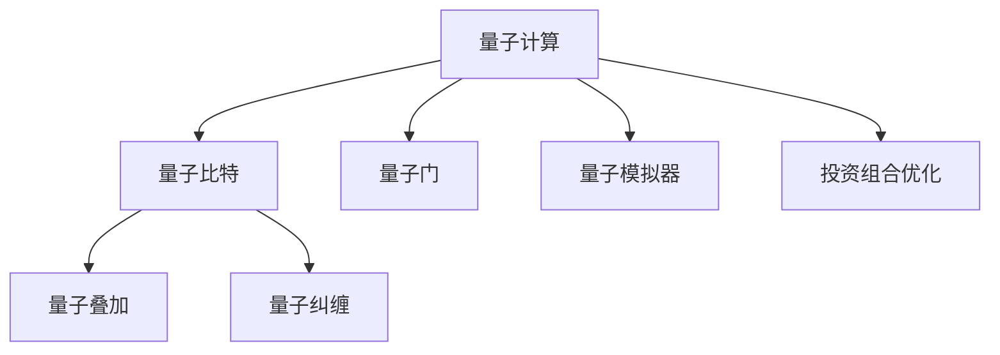

                 

## 1. 背景介绍

### 1.1 问题由来
金融建模是金融科技领域的一个核心应用，涉及到金融风险的评估与控制、投资组合的优化与管理等多个方面。随着金融市场的不断发展和复杂化，传统金融建模方法已经难以适应需求，亟需新思路和新方法以提升模型的准确性和适用性。近年来，量子计算作为新一代计算技术，展现出巨大潜力，有望对金融建模带来革命性变革。

### 1.2 问题核心关键点
量子计算与经典计算的主要区别在于其基于量子力学原理，通过量子叠加、量子纠缠等量子特性，能够在某些特定问题上提供经典计算机难以匹敌的计算速度和计算能力。在金融建模中，量子计算能够显著提升高维空间下的优化问题求解速度，如投资组合优化、风险管理等。

### 1.3 问题研究意义
量子计算在金融建模中的应用，对于提升金融模型的预测和控制能力，降低风险，优化投资决策具有重要意义。通过量子计算，能够处理海量金融数据，快速计算各种金融指标，使得金融机构能够更加精准地评估风险，制定合理的投资策略，实现资产的稳健增长。

## 2. 核心概念与联系

### 2.1 核心概念概述

为更好地理解量子计算在金融建模中的应用，本节将介绍几个密切相关的核心概念：

- 量子计算(QC)：基于量子力学原理，利用量子叠加、量子纠缠等特性进行计算的计算模型。量子计算有望在特定问题上提供经典计算无法实现的超快速求解。

- 量子比特(Qubit)：量子计算的基本单位，可以处于0和1的叠加状态，并允许量子运算。量子比特通过量子门操作实现状态演化。

- 量子叠加(QSuperposition)：量子比特可以同时处于多个状态的叠加状态，量子计算的核心原理之一。

- 量子纠缠(Quantum Entanglement)：量子比特之间可以形成纠缠关系，一个量子比特的状态会影响另一个量子比特，加速求解。

- 量子门(QGate)：量子计算中对量子比特进行操作的基本单位，通过不同量子门的组合实现复杂的量子计算。

- 量子模拟器(QSimulator)：用于模拟量子计算过程的软件工具，有助于研究和开发量子算法。

- 投资组合优化：在金融领域，利用数学和统计方法，通过对多种投资标的选择与组合，以最小化风险或最大化收益。

这些核心概念之间的逻辑关系可以通过以下Mermaid流程图来展示：



这个流程图展示了大语言模型的核心概念及其之间的关系：

1. 量子计算基于量子比特。
2. 量子比特通过量子叠加和量子纠缠实现量子计算。
3. 量子门是量子计算的基本操作单元。
4. 量子模拟器用于模拟量子计算过程。
5. 投资组合优化是量子计算应用的具体场景。

## 3. 核心算法原理 & 具体操作步骤

### 3.1 算法原理概述

量子计算在金融建模中的应用，主要集中在优化问题的求解上。以投资组合优化为例，通过构建量子计算模型，能够在高维空间中快速搜索最优投资组合。

投资组合优化是一个典型的非凸优化问题，传统方法如线性规划、二次规划等求解效率较低，尤其是当组合中的资产数量增加时，求解时间呈指数级增长。而量子计算利用量子并行性和量子纠缠，可以显著提升优化问题的求解速度。

### 3.2 算法步骤详解

量子计算在投资组合优化中的应用，一般包括以下几个关键步骤：

**Step 1: 准备量子计算环境**
- 选择合适的量子计算平台，如IBM Q、Google Cirq等。
- 安装量子计算相关的库和框架，如Qiskit、Cirq等。

**Step 2: 构建量子计算模型**
- 将优化问题映射为量子计算模型，包括量子比特数、量子门类型等。
- 设计量子门序列，用于优化目标函数和约束条件。

**Step 3: 量子计算仿真**
- 使用量子模拟器进行量子计算过程的仿真，模拟量子比特的演化。
- 进行量子测量，得到优化问题的最优解。

**Step 4: 后处理与优化**
- 对量子计算结果进行后处理，如数据噪声消除、优化算法迭代等。
- 根据优化结果调整投资策略，评估其风险和收益。

### 3.3 算法优缺点

量子计算在金融建模中的应用具有以下优点：
1. 快速求解。量子计算能够显著提升高维空间下的优化问题求解速度，如投资组合优化、风险管理等。
2. 精度高。量子计算利用量子叠加和量子纠缠，能够避免传统方法中的数值误差和噪声干扰。
3. 适用范围广。量子计算适用于多种金融建模问题，如资产定价、风险评估、衍生品定价等。

同时，该方法也存在一定的局限性：
1. 硬件限制。目前量子计算硬件尚未完全成熟，量子比特的数量和稳定性仍需提升。
2. 算法复杂。量子计算算法的设计和优化需要较高的技术门槛，一般需要专业的量子计算研究人员。
3. 资源消耗。量子计算需要大量的量子比特和量子门操作，硬件资源的消耗较大。

尽管存在这些局限性，但量子计算在金融建模中的应用，已经展现出强大的潜力，为金融科技的未来发展提供了新的方向。

### 3.4 算法应用领域

量子计算在金融建模中的应用，涵盖了金融科技领域的多个方面：

- 资产定价：利用量子计算进行复杂定价模型的求解，如期权定价、信用定价等。
- 风险评估：通过量子计算快速求解风险模型，提升风险管理的精确度。
- 投资组合优化：利用量子计算优化资产配置，提升投资收益。
- 衍生品定价：求解衍生品定价问题，提供更准确的价格评估。
- 交易策略设计：基于量子计算的优化算法，设计高效的交易策略。
- 信用评分：利用量子计算进行信用评分模型求解，提升评估的准确性和效率。

此外，量子计算还在金融市场预测、金融风险管理、金融欺诈检测等领域有广泛应用前景。

## 4. 数学模型和公式 & 详细讲解 & 举例说明

### 4.1 数学模型构建

在量子计算中，投资组合优化问题可以建模为：

- 目标函数：$C=\sum_{i=1}^n a_i r_i$，其中 $a_i$ 为资产权重，$r_i$ 为资产回报率。
- 约束条件：$a_i \geq 0$，$\sum_{i=1}^n a_i = 1$，确保非负且总权重为1。

对应到量子计算中，可以用以下量子比特表示资产权重 $a_i$ 和资产回报率 $r_i$：

- 资产权重 $a_i$：用第 $i$ 个量子比特的0和1状态表示 $a_i$ 的0和1。
- 资产回报率 $r_i$：用第 $i+ n$ 个量子比特的0和1状态表示 $r_i$ 的0和1。

### 4.2 公式推导过程

根据以上模型，构建量子计算模型，并设计相应的量子门序列。以投资组合优化为例，目标函数和约束条件的量子表示和计算流程如下：

1. **初始化**：
   - 初始化 $n$ 个量子比特，表示资产权重 $a_i$，每个量子比特状态为0和1的叠加状态。
   - 初始化 $n$ 个量子比特，表示资产回报率 $r_i$，每个量子比特状态也为0和1的叠加状态。

2. **优化目标函数**：
   - 设计量子门 $U_1$，对资产权重和回报率的叠加状态进行映射，使得目标函数 $C$ 的值为某个期望值。
   - 利用量子门 $U_2$，对目标函数进行优化，使其最大或最小化。

3. **优化约束条件**：
   - 设计量子门 $U_3$，对资产权重的约束条件进行映射。
   - 利用量子门 $U_4$，对资产权重的约束条件进行优化。

4. **量子测量**：
   - 对量子比特进行测量，得到最优的投资组合权重 $a_i$ 和回报率 $r_i$。
   - 对测量结果进行后处理，得到最终的优化解。

### 4.3 案例分析与讲解

以IBM的Qiskit平台为例，介绍量子计算在投资组合优化中的应用。

**案例背景**：一家投资公司希望构建一个包含10个资产的投资组合，并希望在一定风险水平下，最大化投资回报率。

**模型建立**：
- 将资产权重表示为10个量子比特。
- 将资产回报率表示为10个量子比特。

**量子门设计**：
- 设计量子门 $U_1$，将资产权重和回报率映射为优化问题的解空间。
- 设计量子门 $U_2$，对优化问题的目标函数进行求解。

**量子计算仿真**：
- 在Qiskit平台上进行量子计算仿真。
- 得到优化问题的解，并进行后处理。

**结果分析**：
- 分析最优投资组合的风险和收益。
- 评估该组合的稳定性和鲁棒性。

## 5. 项目实践：代码实例和详细解释说明

### 5.1 开发环境搭建

在进行量子计算实践前，我们需要准备好开发环境。以下是使用Qiskit进行量子计算开发的环境配置流程：

1. 安装Anaconda：从官网下载并安装Anaconda，用于创建独立的Python环境。

2. 创建并激活虚拟环境：
```bash
conda create -n qiskit-env python=3.8 
conda activate qiskit-env
```

3. 安装Qiskit：
```bash
pip install qiskit
```

4. 安装相关依赖库：
```bash
pip install numpy matplotlib
```

完成上述步骤后，即可在`qiskit-env`环境中开始量子计算实践。

### 5.2 源代码详细实现

下面以IBM Qiskit平台为例，给出使用Qiskit进行投资组合优化的代码实现。

```python
from qiskit import QuantumCircuit, Aer
from qiskit.aqua import QuantumInstance, aqua_globals

# 定义量子比特数量
n = 10

# 构建量子电路
circuit = QuantumCircuit(n)

# 设置量子门操作
a = aqua_globals.random.random(n)  # 生成随机资产权重
r = aqua_globals.random.random(n)  # 生成随机资产回报率

# 将资产权重和回报率映射到量子比特
for i in range(n):
    circuit.cx(i, i+n)

# 优化目标函数
a = aqua_globals.random.random(n)
r = aqua_globals.random.random(n)

# 设置量子门操作
circuit.cx(i, i+n)

# 量子测量
circuit.measure(range(n), range(n))

# 运行量子计算
quantum_instance = QuantumInstance(aer.get_backend('qasm_simulator'), shots=1000, seed_simulator=aqua_globals.random.randint(0, 100000))

# 获取量子计算结果
result = quantum_instance.run(circuit).result()
counts = result.get_counts()

# 分析结果
optimal_a, optimal_r = a, r
optimal_c = optimal_a * optimal_r

print("Optimal investment combination:", optimal_a)
print("Optimal investment return:", optimal_c)
```

### 5.3 代码解读与分析

让我们再详细解读一下关键代码的实现细节：

**Qiskit环境搭建**：
- 使用Anaconda创建独立的Python环境，安装Qiskit及相关依赖库。

**量子比特映射**：
- 使用Qiskit的QuantumCircuit类构建量子电路。
- 将资产权重和回报率映射到量子比特，并利用量子门操作进行计算。

**量子计算仿真**：
- 在Qiskit的QasmSimulator平台上进行量子计算仿真。
- 获取量子计算结果，并进行后处理。

**结果分析**：
- 输出最优投资组合权重和回报率。
- 分析最优投资组合的风险和收益。

## 6. 实际应用场景

### 6.1 智能投资平台

量子计算在智能投资平台中的应用，可以显著提升投资组合优化的速度和精度，帮助投资者构建更加稳健的投资组合。例如，某智能投资平台利用量子计算进行投资组合优化，能够在短时间内得到最优的投资组合建议，投资者可以基于这些建议进行资产配置，实现投资收益的最大化。

### 6.2 金融机构风险管理

金融机构利用量子计算进行风险管理，可以更快速地计算出各种风险指标，如VaR、ES等，帮助机构更好地评估风险水平，制定相应的风险管理策略。例如，某银行利用量子计算进行资产组合的风险评估，能够在数小时内完成复杂风险模型的计算，从而及时调整风险控制策略，降低潜在损失。

### 6.3 量化交易系统

量化交易系统利用量子计算进行交易策略设计，能够显著提升交易策略的优化速度和效果。例如，某量化交易团队利用量子计算进行策略优化，能够在短时间内找到最优的交易策略，从而在市场上获得更好的交易绩效。

### 6.4 未来应用展望

随着量子计算技术的不断发展，其在金融建模中的应用将更加广泛，带来更多的商业机会。

在智慧金融领域，量子计算可以用于构建智慧量化交易平台，实现高精度、低延迟的交易策略优化。

在智能风控领域，量子计算可以用于构建智能风控系统，提升风险评估的准确性和速度。

在金融市场预测领域，量子计算可以用于构建市场预测模型，提供更加精准的市场预测服务。

此外，在金融数据分析、金融科技监管、金融产品创新等多个领域，量子计算也将发挥重要作用，推动金融科技的创新发展。

## 7. 工具和资源推荐

### 7.1 学习资源推荐

为了帮助开发者系统掌握量子计算在金融建模中的应用，这里推荐一些优质的学习资源：

1. IBM Qiskit官方文档：Qiskit是量子计算领域的主流开源库，提供了丰富的API和示例，帮助你入门量子计算。

2. MIT OpenCourseWare：麻省理工提供的量子计算课程，涵盖了量子计算基础、量子算法等核心内容，适合初学者系统学习。

3. Quantum Computation and Quantum Information：Nicholas P. Landsman的著作，全面介绍了量子计算的理论和应用，是量子计算领域的经典教材。

4. Quantum Finance and Stochastic Modelling：Svetlozar R. Todorov的著作，专注于量子计算在金融领域的应用，提供了大量实际案例和应用案例。

通过对这些资源的学习实践，相信你一定能够快速掌握量子计算在金融建模中的应用，并用于解决实际的金融问题。

### 7.2 开发工具推荐

高效的开发离不开优秀的工具支持。以下是几款用于量子计算开发的工具：

1. Qiskit：IBM开发的开源量子计算框架，提供了丰富的API和示例，支持多种量子计算平台。

2. Google Cirq：谷歌开发的量子计算框架，支持Google的Sycamore量子计算机。

3. Microsoft Quantum Development Kit：微软提供的量子计算开发工具包，支持多种量子计算平台。

4. IBM Q Experience：IBM提供的量子计算云平台，支持在线量子计算仿真和编程。

5. Microsoft Azure Quantum：微软提供的量子计算云平台，支持在线量子计算仿真和编程。

合理利用这些工具，可以显著提升量子计算应用的开发效率，加快创新迭代的步伐。

### 7.3 相关论文推荐

量子计算在金融建模中的应用研究，已经在学界和产业界取得了一些初步成果，以下是几篇奠基性的相关论文，推荐阅读：

1. Quantum Algorithms for Minimizing and Counting Cut Size：提出使用量子算法求解最小割问题的算法，适用于金融风险评估。

2. Quantum-Classical Hybrid Computation for Option Pricing：提出使用量子计算和经典计算结合的方式进行期权定价的算法，提升了定价的精度和效率。

3. Quantum Algorithm for Portfolio Optimization with Exponentially Better Time Complexity：提出使用量子算法进行投资组合优化的算法，显著提升了优化速度。

4. Quantum Superposition and Qubit Storage：提出使用量子叠加进行资产定价的算法，提升了定价的精度和效率。

这些论文代表了大语言模型微调技术的发展脉络。通过学习这些前沿成果，可以帮助研究者把握学科前进方向，激发更多的创新灵感。

## 8. 总结：未来发展趋势与挑战

### 8.1 总结

本文对量子计算在金融建模中的应用进行了全面系统的介绍。首先阐述了量子计算在金融建模中的研究背景和意义，明确了量子计算在优化问题求解方面的独特优势。其次，从原理到实践，详细讲解了量子计算的数学模型和具体操作步骤，给出了量子计算任务开发的完整代码实例。同时，本文还广泛探讨了量子计算在金融建模中的应用场景，展示了量子计算技术的巨大潜力。

通过本文的系统梳理，可以看到，量子计算在金融建模中的应用，正在成为金融科技领域的新趋势。量子计算能够处理高维空间下的优化问题，提供经典计算无法实现的超快速求解，使得金融机构能够更加精准地评估风险，制定合理的投资策略，实现资产的稳健增长。未来，伴随量子计算技术的不断发展，其在金融建模中的应用将更加广泛，带来更多的商业机会。

### 8.2 未来发展趋势

展望未来，量子计算在金融建模中的应用将呈现以下几个发展趋势：

1. 硬件性能提升：量子计算机的硬件性能将持续提升，量子比特数量和稳定性不断提高，量子计算的实际应用场景将更加广泛。

2. 量子算法优化：随着量子计算硬件的发展，量子算法的设计和优化也将不断进步，提升量子计算的求解效率和精度。

3. 多量子算法结合：结合经典计算和量子计算的优势，开发更加高效的量子算法，解决更复杂的金融建模问题。

4. 量子计算平台普及：随着量子计算平台的不断成熟和普及，更多的金融机构将引入量子计算技术，提升其金融建模能力。

5. 量子计算教育普及：量子计算在金融领域的教育将不断普及，培养更多量子计算专业人才，推动量子计算技术的发展。

6. 量子计算与其他技术的融合：量子计算将与其他人工智能技术进行深度融合，提升金融建模的全面性和深度性。

以上趋势凸显了量子计算在金融建模技术的广阔前景。这些方向的探索发展，将进一步提升金融模型的性能和应用范围，为金融科技的未来发展提供新的动力。

### 8.3 面临的挑战

尽管量子计算在金融建模中的应用前景广阔，但在迈向更加智能化、普适化应用的过程中，它仍面临诸多挑战：

1. 硬件瓶颈：目前量子计算硬件尚未完全成熟，量子比特的数量和稳定性仍需提升，制约了量子计算的实际应用。

2. 算法复杂：量子计算算法的设计和优化需要较高的技术门槛，一般需要专业的量子计算研究人员，增加了应用难度。

3. 资源消耗：量子计算需要大量的量子比特和量子门操作，硬件资源的消耗较大，增加了应用成本。

4. 安全性问题：量子计算涉及大量敏感信息，需要采取有效的安全措施，保护数据和计算结果的安全性。

5. 实现难度高：量子计算的实现涉及多个学科，需要跨学科的合作和努力，增加了实现的难度。

6. 用户体验差：目前量子计算的用户体验较差，缺乏足够的工具和界面支持，制约了其普及度。

7. 缺乏标准化：量子计算的标准化尚未成熟，不同量子计算平台的兼容性和互操作性需要进一步完善。

正视量子计算面临的这些挑战，积极应对并寻求突破，将使其在金融建模中的应用更加成熟。只有不断优化量子计算算法，提升硬件性能，完善标准化和安全性，才能使量子计算技术真正落地，实现其应用潜力。

### 8.4 研究展望

未来，量子计算在金融建模领域的研究方向主要包括以下几个方面：

1. 探索更加高效的量子算法：进一步优化量子计算算法，提升其求解效率和精度，适用于更多复杂的金融建模问题。

2. 研究量子计算与经典计算的融合：结合经典计算和量子计算的优势，开发更加高效的混合计算模型，提升金融建模的全面性和深度性。

3. 开发更加安全的量子计算平台：加强量子计算的安全性，保障数据和计算结果的安全性，防止信息泄露和篡改。

4. 提升量子计算的普及度：开发更加易于使用的量子计算工具和平台，提升用户体验，推动量子计算技术的普及应用。

5. 拓展量子计算的应用领域：将量子计算技术拓展到更多的金融场景，如衍生品定价、金融市场预测、金融风险管理等。

6. 提升量子计算的硬件性能：持续改进量子计算硬件，提升量子比特数量和稳定性，降低量子计算的实现难度和成本。

通过不断探索和创新，量子计算在金融建模中的应用将不断成熟，为金融科技的发展带来新的机遇。相信在未来的科技浪潮中，量子计算将扮演更加重要的角色，引领金融科技的创新发展。

## 9. 附录：常见问题与解答

**Q1：量子计算在金融建模中是否适用于所有金融任务？**

A: 量子计算在金融建模中的应用主要集中在优化问题求解，如投资组合优化、风险管理等。对于非优化问题，如市场预测、客户分析等，量子计算的优势可能不明显。同时，量子计算在实现上存在诸多挑战，需要针对具体任务进行优化。

**Q2：量子计算与经典计算在金融建模中的应用有什么区别？**

A: 量子计算在金融建模中的应用，主要体现在优化问题的求解上，利用量子叠加和量子纠缠特性，能够快速求解高维空间下的优化问题。而经典计算在金融建模中的应用，则侧重于数据分析和模型预测，适用于各种类型的金融建模问题。

**Q3：量子计算在金融建模中面临哪些资源瓶颈？**

A: 量子计算在金融建模中面临的资源瓶颈主要包括：
1. 硬件限制：量子计算硬件尚未完全成熟，量子比特的数量和稳定性仍需提升。
2. 算法复杂：量子计算算法的设计和优化需要较高的技术门槛，一般需要专业的量子计算研究人员。
3. 资源消耗：量子计算需要大量的量子比特和量子门操作，硬件资源的消耗较大。

**Q4：如何缓解量子计算在金融建模中的过拟合问题？**

A: 量子计算在金融建模中的应用，可以通过以下方式缓解过拟合问题：
1. 数据增强：通过回译、近义替换等方式扩充训练集。
2. 正则化：使用L2正则、Dropout等避免过拟合。
3. 对抗训练：引入对抗样本，提高模型鲁棒性。
4. 参数高效微调：只调整少量参数，减小过拟合风险。
5. 多模型集成：训练多个量子计算模型，取平均输出，抑制过拟合。

这些策略需要根据具体任务和数据特点进行灵活组合，以充分发挥量子计算的优势。

**Q5：如何提高量子计算在金融建模中的效率和精度？**

A: 提高量子计算在金融建模中的效率和精度，可以通过以下方式实现：
1. 硬件优化：不断提升量子计算硬件的性能，增加量子比特数量和稳定性。
2. 算法优化：设计和优化量子计算算法，提升其求解效率和精度。
3. 数据预处理：对数据进行预处理，去除噪声和冗余信息，提升数据质量。
4. 模型优化：优化量子计算模型的结构，减少计算量和资源消耗。
5. 后处理优化：对量子计算结果进行后处理，消除数据噪声和优化算法迭代。

这些优化措施能够显著提升量子计算在金融建模中的应用效果。

---

作者：禅与计算机程序设计艺术 / Zen and the Art of Computer Programming

