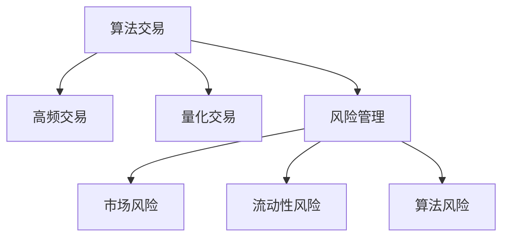

                 

# 金融科技：算法交易和风险管理

> 关键词：算法交易,风险管理,高频交易,量化交易,机器学习,人工智能,风险控制,金融科技

## 1. 背景介绍

### 1.1 问题由来
金融科技（FinTech）是近年来蓬勃发展的一个重要领域，旨在通过技术手段重塑传统的金融服务行业。在众多金融科技的应用中，算法交易和风险管理无疑是两个最重要的方向。

**算法交易**：利用计算机程序和算法策略，进行高频和量化交易，旨在通过高效执行、低成本和准确分析来优化投资决策，提高投资收益。

**风险管理**：通过对市场动态的实时监控和分析，及时识别并控制潜在的风险，保障金融产品的稳定运行和投资者的安全。

在金融科技的发展过程中，算法交易和风险管理的重要性日益凸显，成为金融领域的关键应用方向。如何高效、精准地实现算法交易和风险管理，成为金融科技应用的核心问题。

### 1.2 问题核心关键点
基于数据驱动的算法交易和风险管理，需要在海量数据中快速提取出有价值的信号，并能够实时响应市场变化，做出准确的决策。这一过程涉及以下几个核心关键点：

1. **数据获取**：实时获取金融市场的数据信息，包括股票、债券、商品等市场价格、交易量、历史数据等。
2. **信号提取**：从历史和实时数据中，识别出影响交易的显著信号，如技术指标、基本面数据等。
3. **策略设计**：设计高效的算法交易策略，将信号转化为具体的交易指令。
4. **风险控制**：在交易过程中，实时监控和控制风险，如市场风险、流动性风险等。
5. **性能评估**：对算法交易和风险管理系统的实际表现进行评估，持续优化策略。

本文将系统地介绍算法交易和风险管理的原理、方法和实践，希望能为金融科技领域的从业者提供参考。

## 2. 核心概念与联系

### 2.1 核心概念概述

为更好地理解算法交易和风险管理的技术框架，本节将介绍几个密切相关的核心概念：

- **算法交易**：通过编程和算法策略自动执行交易指令的自动化交易方式。常见算法交易策略包括高频交易（HFT）、量化交易（QBT）、统计套利（Hedge Fund）等。
- **高频交易**：利用高速算法和低延迟交易系统，通过高频次、小量级的买卖操作，捕捉市场微小的价格波动。
- **量化交易**：利用数学模型和统计方法，对金融市场进行量化分析，形成算法交易策略。
- **风险管理**：通过模型和算法对市场风险进行量化评估，制定相应的风险控制策略，保障投资安全。
- **市场风险**：金融市场中的不确定性因素，如市场波动、突发事件等。
- **流动性风险**：市场中的资产难以迅速变现的风险。
- **算法风险**：算法交易策略的失效、过拟合等问题。

这些核心概念之间的逻辑关系可以通过以下Mermaid流程图来展示：



这个流程图展示了大语言模型的核心概念及其之间的关系：

1. 算法交易是金融科技的核心应用方向，包括高频交易和量化交易两种主要方式。
2. 风险管理作为辅助手段，通过量化评估和控制市场风险、流动性风险等，保障算法交易的安全性。
3. 算法风险作为潜在的风险点，需要通过策略优化和风险控制来避免。

这些概念共同构成了金融科技的完整框架，为其高效、精准地实现算法交易和风险管理提供了理论基础。

## 3. 核心算法原理 & 具体操作步骤
### 3.1 算法原理概述

算法交易和风险管理的核心在于数据驱动的自动化决策。其基本原理是通过量化模型和算法策略，从数据中提取交易信号，自动生成交易指令，并实时监控和控制风险，最终实现高效的交易和风险管理。

算法交易的决策过程可以概括为以下几个步骤：

1. **数据获取**：从金融市场获取实时数据和历史数据。
2. **信号提取**：从历史数据中提取技术指标和基本面数据，形成交易信号。
3. **策略设计**：根据交易信号设计交易策略，如均值回归、动量策略、套利策略等。
4. **交易执行**：根据策略生成交易指令，通过低延迟交易系统快速执行。
5. **风险控制**：实时监控交易过程中的风险，如市场冲击、滑点风险等，及时调整策略。
6. **绩效评估**：评估交易策略的实际表现，进行持续优化。

风险管理的目标是通过量化模型评估市场风险和流动性风险，制定相应的控制策略。其决策过程可以概括为以下几个步骤：

1. **风险评估**：对市场数据进行量化评估，识别出潜在的风险点。
2. **策略制定**：根据风险评估结果，设计相应的风险控制策略，如止损策略、头寸控制策略等。
3. **风险监控**：实时监控市场动态，及时发现风险变化。
4. **风险调整**：根据风险监控结果，调整策略和头寸，控制风险。
5. **绩效评估**：评估风险控制策略的效果，进行持续优化。

### 3.2 算法步骤详解

接下来，我们将分别介绍算法交易和风险管理的详细步骤：

#### 算法交易的详细步骤

**Step 1: 数据获取**
- 实时获取市场价格、交易量、历史数据等。
- 可以使用数据接口（如TensorFlow Data API）、爬虫等工具进行数据获取。

**Step 2: 信号提取**
- 从历史数据中提取技术指标，如均线、MACD、RSI等。
- 可以使用Python的pandas库进行数据处理和计算。

**Step 3: 策略设计**
- 根据技术指标和基本面数据，设计交易策略。
- 如均值回归策略、动量策略、套利策略等。

**Step 4: 交易执行**
- 使用低延迟交易系统，自动生成和执行交易指令。
- 可以使用高频率交易平台（如Alpaca、Interactive Brokers）。

**Step 5: 风险控制**
- 实时监控市场动态，识别风险点。
- 如市场冲击、滑点风险等。

**Step 6: 绩效评估**
- 对交易策略的实际表现进行评估，如回测、实盘测试等。
- 使用Python的backtrader库进行策略回测。

#### 风险管理的详细步骤

**Step 1: 风险评估**
- 对市场数据进行量化评估，识别出潜在的风险点。
- 可以使用量化模型，如VaR模型、压力测试等。

**Step 2: 策略制定**
- 根据风险评估结果，设计相应的风险控制策略。
- 如止损策略、头寸控制策略等。

**Step 3: 风险监控**
- 实时监控市场动态，及时发现风险变化。
- 可以使用实时数据流处理框架，如Apache Kafka。

**Step 4: 风险调整**
- 根据风险监控结果，调整策略和头寸，控制风险。
- 可以使用机器学习模型，如随机森林、梯度提升树等。

**Step 5: 绩效评估**
- 评估风险控制策略的效果，进行持续优化。
- 使用Python的scikit-learn库进行模型评估。

### 3.3 算法优缺点

算法交易和风险管理在提高交易效率和风险控制方面具有显著优势，但也存在一些缺点：

算法交易的优点：
1. **高效性**：通过自动化交易系统，实现高频次、低成本的交易。
2. **准确性**：利用量化模型和算法策略，提高交易决策的准确性。
3. **可扩展性**：策略设计灵活，可以应对不同市场和产品。

算法交易的缺点：
1. **技术门槛高**：需要深入理解量化模型和算法策略。
2. **过拟合风险**：过度依赖历史数据，可能导致策略失效。
3. **市场冲击**：高频交易策略可能对市场造成冲击，引起市场波动。

风险管理的优点：
1. **实时监控**：通过实时数据监控和分析，及时识别和控制风险。
2. **全面评估**：使用量化模型进行全面风险评估，提高决策的科学性。
3. **策略灵活**：根据风险评估结果，灵活调整控制策略。

风险管理的缺点：
1. **复杂度**：量化模型和算法策略设计复杂。
2. **数据需求高**：需要大量高质量的市场数据。
3. **模型偏差**：模型可能存在一定的偏差，影响风险评估的准确性。

### 3.4 算法应用领域

算法交易和风险管理广泛应用于以下领域：

1. **股票交易**：高频交易策略、量化投资策略等。
2. **债券交易**：量化套利、风险对冲等。
3. **商品交易**：高频交易、套利策略等。
4. **外汇交易**：量化交易策略、风险管理策略等。
5. **衍生品交易**：期权、期货的量化策略、风险管理等。
6. **量化对冲基金**：使用量化策略进行对冲交易，规避市场风险。
7. **高频交易平台**：提供低延迟交易系统的交易平台，如Alpaca、Interactive Brokers等。

除了上述这些应用领域外，算法交易和风险管理还在金融工程、金融风险管理、金融监管等领域有着广泛的应用前景。

## 4. 数学模型和公式 & 详细讲解 & 举例说明
### 4.1 数学模型构建

本节将使用数学语言对算法交易和风险管理的核心模型进行系统阐述。

**算法交易的核心模型**

假设市场数据由价格 $P_t$ 和交易量 $V_t$ 组成，交易策略为 $S_t$。交易策略 $S_t$ 可以根据历史价格和交易量，利用技术指标和基本面数据进行计算。

设 $P_t$ 和 $V_t$ 为市场价格和交易量，$S_t$ 为交易策略，$T_t$ 为交易指令，$C_t$ 为执行成本。交易策略 $S_t$ 的目标是在最小化执行成本 $C_t$ 的前提下，最大化交易收益。

模型可以表示为：

$$
\maximize_{S_t} \sum_{t=1}^{T} P_tS_t - C_t
$$

**风险管理的核心模型**

风险管理的核心模型为VaR模型（Value at Risk），用于评估金融资产在一定置信水平下的最大损失。VaR模型可以表示为：

$$
VaR = \mathbb{E}[S_t] - P_tS_t
$$

其中，$\mathbb{E}[S_t]$ 为策略的期望收益，$P_t$ 为市场价格。VaR模型在95%的置信水平下，最大损失不超过 $VaR$。

### 4.2 公式推导过程

**算法交易模型的推导**

在实际交易中，交易策略 $S_t$ 可以是简单的线性模型，如线性回归模型：

$$
S_t = \alpha + \beta P_t + \epsilon_t
$$

其中，$\alpha$ 为截距，$\beta$ 为斜率，$\epsilon_t$ 为随机误差。交易指令 $T_t$ 可以通过以下方式生成：

$$
T_t = \max(0, S_t - L_t)
$$

其中 $L_t$ 为当前资产价格。

**风险管理模型的推导**

VaR模型推导基于正态分布假设，设市场价格 $P_t$ 服从正态分布 $N(\mu, \sigma^2)$，则VaR模型可以表示为：

$$
VaR = \mu - \alpha\sigma\Phi^{-1}(1 - \frac{\alpha}{2})
$$

其中，$\Phi^{-1}$ 为标准正态分布的逆函数，$\alpha$ 为置信水平。

### 4.3 案例分析与讲解

以股票交易中的量化套利策略为例，说明算法交易的核心模型。

假设市场上有两只股票A和B，A和B的价格关系可以用以下模型表示：

$$
P_A = \alpha + \beta P_B + \epsilon_t
$$

其中，$\alpha$ 为截距，$\beta$ 为斜率，$\epsilon_t$ 为随机误差。交易策略 $S_t$ 可以根据价格关系，生成交易指令 $T_t$：

$$
T_t = \max(0, S_t - L_t)
$$

其中 $L_t$ 为当前资产价格。

如果 $\beta$ 显著不为零，则可以根据价格关系，设计套利策略。如当 $P_A$ 远高于 $P_B$ 时，可以进行卖空股票B，买入股票A，等待价格关系恢复，实现套利收益。

**风险管理的案例**

以期权交易中的VaR模型为例，说明风险管理的核心模型。

假设期权价格服从正态分布 $N(\mu, \sigma^2)$，则VaR模型可以表示为：

$$
VaR = \mu - \alpha\sigma\Phi^{-1}(1 - \frac{\alpha}{2})
$$

其中，$\Phi^{-1}$ 为标准正态分布的逆函数，$\alpha$ 为置信水平。VaR模型可以评估期权在一定置信水平下的最大损失，帮助投资者制定合理的风险控制策略。

## 5. 项目实践：代码实例和详细解释说明
### 5.1 开发环境搭建

在进行项目实践前，我们需要准备好开发环境。以下是使用Python进行金融科技项目开发的典型环境配置流程：

1. 安装Anaconda：从官网下载并安装Anaconda，用于创建独立的Python环境。

2. 创建并激活虚拟环境：
```bash
conda create -n fin-tech-env python=3.8 
conda activate fin-tech-env
```

3. 安装必要的库：
```bash
conda install numpy pandas scipy matplotlib
pip install backtrader alpaca-trading-api sklearn
```

完成上述步骤后，即可在`fin-tech-env`环境中开始项目实践。

### 5.2 源代码详细实现

下面以算法交易中的高频交易策略为例，给出使用Python和backtrader库实现的代码实现。

首先，定义高频交易策略的类：

```python
from backtrader import CandleStick, Strategy
from backtrader.naive import Con

class HighFreqStrategy(Con):
    def __init__(self):
        super(HighFreqStrategy, self).__init__()
        self.dataclose = self.datas[0].candle[4]
        self.x = self.dataclose
        
    def next(self):
        if self.dataclose[-1] < self.dataclose[-2]:
            if self.dataclose[-1] < self.dataclose[-3]:
                self.buy()
        self.dataclose[-1] = self.dataclose[-2] = self.dataclose[-3] = 0
```

然后，定义交易环境：

```python
from backtrader import Backtesting
from alpaca_trading_api import AlpacaRestClient
from alpaca_trading_api.websocket import AlpacaWebsocketClient

class HighFreqEnvironment(Backtesting):
    def __init__(self):
        Backtesting.__init__(self)
        self.market_client = AlpacaRestClient('API_KEY', 'API_SECRET', 'API_PASS')
        self.market = self.market_client.get_market_data()

    def next(self):
        tickers = self.market.get_tickers()
        for ticker in tickers:
            price = self.market.get_price(ticker)
            volume = self.market.get_volume(ticker)
            candle = CandleStick(ticker, self.trades.get_open_order().exec_order,
                                self.trades.get_open_order().exec_order Close)
            self.candle.add(CandleStick(candle))
            self.data.next()
            self.high_freq_strategy.next()
```

最后，启动交易环境：

```python
high_freq_env = HighFreqEnvironment()
high_freq_env.run()
```

以上就是使用Python和backtrader库实现高频交易策略的完整代码实现。

### 5.3 代码解读与分析

让我们再详细解读一下关键代码的实现细节：

**HighFreqStrategy类**：
- `__init__`方法：初始化历史价格和交易策略变量。
- `next`方法：根据历史价格判断是否买入。

**HighFreqEnvironment类**：
- `__init__`方法：初始化交易环境和API接口。
- `next`方法：从API获取最新价格和交易量，计算技术指标，执行交易策略。

**Backtesting环境**：
- `run`方法：启动交易环境，运行策略。

可以看到，Python的backtrader库和Alpaca API提供了强大的交易策略实现和市场数据获取能力，可以快速构建高频交易系统。

## 6. 实际应用场景
### 6.1 智能投顾系统

智能投顾系统是算法交易的重要应用方向，通过人工智能和大数据技术，提供个性化的投资建议和服务。智能投顾系统的核心算法包括量化分析、组合优化、风险控制等，其技术实现可以参考以下步骤：

**Step 1: 数据获取**
- 获取市场数据、财务数据、经济指标等。
- 使用数据接口、爬虫等工具进行数据获取。

**Step 2: 信号提取**
- 从历史数据中提取技术指标和基本面数据，形成交易信号。
- 使用Python的pandas库进行数据处理和计算。

**Step 3: 策略设计**
- 根据交易信号设计量化策略，如均值回归、动量策略、套利策略等。
- 使用Python的backtrader库进行策略回测。

**Step 4: 交易执行**
- 使用低延迟交易系统，自动生成和执行交易指令。
- 可以使用高频率交易平台（如Alpaca、Interactive Brokers）。

**Step 5: 风险控制**
- 实时监控市场动态，识别风险点。
- 如市场冲击、滑点风险等。

**Step 6: 绩效评估**
- 对策略的实际表现进行评估，如回测、实盘测试等。
- 使用Python的backtrader库进行策略回测。

### 6.2 量化对冲基金

量化对冲基金利用量化模型进行对冲交易，规避市场风险，实现稳定收益。量化对冲基金的核心算法包括量化模型构建、风险评估、风险控制等，其技术实现可以参考以下步骤：

**Step 1: 数据获取**
- 获取市场数据、财务数据、经济指标等。
- 使用数据接口、爬虫等工具进行数据获取。

**Step 2: 信号提取**
- 从历史数据中提取技术指标和基本面数据，形成交易信号。
- 使用Python的pandas库进行数据处理和计算。

**Step 3: 模型构建**
- 根据交易信号构建量化模型，如动量模型、套利模型等。
- 使用Python的scikit-learn库进行模型构建。

**Step 4: 风险评估**
- 对市场数据进行量化评估，识别出潜在的风险点。
- 使用VaR模型、压力测试等方法进行风险评估。

**Step 5: 风险控制**
- 根据风险评估结果，设计相应的风险控制策略。
- 如止损策略、头寸控制策略等。

**Step 6: 策略执行**
- 使用量化交易系统，自动生成和执行交易指令。
- 可以使用高频率交易平台（如Alpaca、Interactive Brokers）。

**Step 7: 绩效评估**
- 评估策略的实际表现，进行持续优化。
- 使用Python的backtrader库进行策略回测。

### 6.3 风险管理系统

风险管理系统用于量化评估和控制市场风险，保障金融产品的稳定运行。风险管理系统的核心算法包括量化模型构建、风险评估、风险控制等，其技术实现可以参考以下步骤：

**Step 1: 数据获取**
- 获取市场数据、财务数据、经济指标等。
- 使用数据接口、爬虫等工具进行数据获取。

**Step 2: 风险评估**
- 对市场数据进行量化评估，识别出潜在的风险点。
- 使用VaR模型、压力测试等方法进行风险评估。

**Step 3: 策略制定**
- 根据风险评估结果，设计相应的风险控制策略。
- 如止损策略、头寸控制策略等。

**Step 4: 风险监控**
- 实时监控市场动态，及时发现风险变化。
- 可以使用实时数据流处理框架，如Apache Kafka。

**Step 5: 风险调整**
- 根据风险监控结果，调整策略和头寸，控制风险。
- 可以使用机器学习模型，如随机森林、梯度提升树等。

**Step 6: 绩效评估**
- 评估风险控制策略的效果，进行持续优化。
- 使用Python的scikit-learn库进行模型评估。

## 7. 工具和资源推荐
### 7.1 学习资源推荐

为了帮助开发者系统掌握金融科技的相关技术，这里推荐一些优质的学习资源：

1. **《Python金融量化编程》**：一本系统介绍Python在金融量化中的应用的书，涵盖数据获取、策略设计、风险控制等方面的内容。

2. **Coursera《金融工程与风险管理》课程**：由耶鲁大学提供，涵盖金融工程和风险管理的基础理论和方法，适合入门学习。

3. **QuantConnect**：一个量化交易社区，提供丰富的学习资源和实践机会，包括回测平台、学习课程等。

4. **Alpaca API文档**：Alpaca API提供了详细的API文档和使用示例，适合进行高频交易和量化交易实践。

5. **Backtesting环境**：一个基于backtrader库的回测平台，提供丰富的策略和算法库，适合进行策略开发和回测。

通过这些资源的学习实践，相信你一定能够快速掌握金融科技技术，并应用于实际的算法交易和风险管理项目中。

### 7.2 开发工具推荐

高效的开发离不开优秀的工具支持。以下是几款用于金融科技开发的工具：

1. **Anaconda**：用于创建和管理虚拟环境，支持多种编程语言和库的组合。
2. **Jupyter Notebook**：一个交互式编程环境，适合进行数据分析、模型构建和策略开发。
3. **TensorFlow**：一个开源深度学习框架，支持复杂的数据处理和模型构建。
4. **Alpaca API**：一个高频率交易平台，提供了丰富的交易接口和API文档。
5. **backtrader**：一个回测平台，支持多种交易策略和模型构建。
6. **Apache Kafka**：一个实时数据流处理框架，支持大规模数据流处理和实时计算。
7. **Scikit-learn**：一个机器学习库，支持多种模型构建和评估。

合理利用这些工具，可以显著提升金融科技项目的开发效率，加快创新迭代的步伐。

### 7.3 相关论文推荐

金融科技领域的发展离不开学界的持续研究。以下是几篇奠基性的相关论文，推荐阅读：

1. **High-Frequency Trading: A Survey**：总结了高频交易的研究现状和发展趋势，涵盖高频交易模型、算法和策略等方面。

2. **Value at Risk: The Concept and Its Calculation**：介绍了VaR模型的基本概念和计算方法，是风险管理的重要文献。

3. **Algorithmic Trading: How to Build Your Own Algorithm**：介绍算法交易的基本原理和实现方法，涵盖策略设计、回测和执行等方面。

4. **Quantitative Methods for Financial Institutions**：介绍了量化金融的基础理论和实际应用，涵盖模型构建、风险控制和策略优化等方面。

这些论文代表了大金融科技领域的研究进展，通过学习这些前沿成果，可以帮助研究者把握学科前进方向，激发更多的创新灵感。

## 8. 总结：未来发展趋势与挑战

### 8.1 总结

本文对金融科技中的算法交易和风险管理进行了系统介绍。首先阐述了算法交易和风险管理的背景和核心关键点，明确了金融科技应用的方向和意义。其次，从原理到实践，详细讲解了算法交易和风险管理的数学模型和算法步骤，给出了完整的代码实现和分析。同时，本文还广泛探讨了算法交易和风险管理在多个领域的应用前景，展示了金融科技的广阔前景。

通过本文的系统梳理，可以看到，算法交易和风险管理技术正在引领金融科技的变革，通过数据驱动的自动化决策，大幅提升了交易效率和风险控制能力。这些技术的不断创新和优化，将进一步推动金融科技的发展，构建更加智能、安全的金融系统。

### 8.2 未来发展趋势

展望未来，金融科技中的算法交易和风险管理将呈现以下几个发展趋势：

1. **模型复杂度提升**：随着数据量和计算能力的提升，算法交易和风险管理的模型复杂度将不断增加，引入更多先进的技术，如深度学习、强化学习等。

2. **实时计算能力增强**：随着计算设备和技术的进步，金融科技系统将具备更强的实时计算能力，能够快速响应市场动态。

3. **智能投顾普及**：智能投顾技术将更加普及，为投资者提供更加个性化的投资建议和服务。

4. **量化对冲基金发展**：量化对冲基金将不断壮大，利用先进的技术和模型，实现更加稳定的收益。

5. **风险管理系统优化**：风险管理系统将更加精准和全面，利用先进的量化模型和算法，提高风险控制能力。

6. **金融工程工具创新**：金融工程工具将不断创新，提供更多的数据获取和模型构建手段。

### 8.3 面临的挑战

尽管金融科技的发展前景广阔，但在实现过程中也面临着诸多挑战：

1. **数据获取成本高**：金融数据获取和处理成本较高，需要投入大量人力和资源。

2. **模型复杂度高**：算法交易和风险管理的模型复杂度较高，需要深入理解算法和模型。

3. **市场冲击风险**：高频交易策略可能对市场造成冲击，引起市场波动。

4. **模型偏差问题**：量化模型可能存在一定的偏差，影响风险评估和策略设计。

5. **安全性和合规性**：金融科技系统需要严格的安全和合规要求，防止系统漏洞和数据泄露。

6. **持续优化需求**：金融市场动态变化，需要持续优化算法和策略，以适应市场变化。

### 8.4 研究展望

未来，金融科技的发展将在以下几个方面进行深入研究：

1. **数据获取与处理**：探索更加高效、低成本的数据获取和处理技术，提高数据的时效性和可靠性。

2. **模型优化与创新**：研究更加高效、可解释的模型，提高模型的泛化能力和可解释性。

3. **智能投顾技术**：研究智能投顾技术的优化和普及，提高投资建议的个性化和智能化水平。

4. **量化对冲基金**：探索量化对冲基金的优化和创新，提高对冲策略的稳定性和收益性。

5. **风险管理系统**：研究风险管理系统的优化和创新，提高风险控制的精准性和全面性。

6. **金融工程工具**：研究金融工程工具的创新和优化，提高数据获取和模型构建的效率和质量。

这些研究方向将推动金融科技技术的发展，为构建更加智能、安全的金融系统提供技术支持。面向未来，金融科技需要不断突破技术瓶颈，优化算法和模型，才能更好地服务金融市场和投资者。

## 9. 附录：常见问题与解答

**Q1：金融科技中的算法交易和风险管理是否适用于所有金融场景？**

A: 金融科技中的算法交易和风险管理技术在许多金融场景中都有广泛应用，如股票、债券、外汇、商品等。但对于一些特定金融产品，如衍生品、私募基金等，需要根据具体情况进行调整和优化。

**Q2：算法交易和风险管理的核心在于数据驱动，如何获取高质量的数据？**

A: 高质量的数据获取是金融科技项目的关键。可以通过以下方式获取高质量的数据：

1. 使用数据接口：如Alpaca API、Interactive Brokers API等，获取实时市场数据。
2. 数据爬虫：使用Python的pandas库和selenium等工具，从网站和API获取历史数据。
3. 数据供应商：购买金融市场数据，如Bloomberg、FactSet等。

**Q3：算法交易和风险管理中，如何选择适合的算法和模型？**

A: 选择适合的算法和模型需要根据具体场景和需求进行评估：

1. 确定目标：明确算法的目标，如均值回归、动量策略、套利策略等。
2. 数据评估：评估历史数据的质量和特征，选择适合的模型。
3. 模型评估：使用回测和实盘测试，评估模型的实际表现。
4. 持续优化：根据市场变化，持续优化算法和模型。

**Q4：算法交易和风险管理中，如何应对高频交易策略的市场冲击风险？**

A: 应对高频交易策略的市场冲击风险，可以采取以下措施：

1. 设置订单大小限制：限制单笔交易的订单大小，减少对市场的影响。
2. 分散交易时间：将交易分散在不同的时间点，避免集中交易。
3. 调整交易频率：根据市场波动，动态调整交易频率。
4. 模型优化：优化高频交易模型，减少市场冲击的影响。

**Q5：风险管理中，如何设计有效的风险控制策略？**

A: 设计有效的风险控制策略需要考虑以下几个方面：

1. 确定风险目标：明确风险控制的目标，如止损策略、头寸控制策略等。
2. 量化评估：使用VaR模型、压力测试等方法，量化评估市场风险。
3. 策略设计：根据风险评估结果，设计相应的风险控制策略。
4. 实时监控：实时监控市场动态，及时发现风险变化。
5. 调整策略：根据风险监控结果，调整策略和头寸，控制风险。

**Q6：如何提升金融科技系统的安全性？**

A: 提升金融科技系统的安全性需要从数据安全、系统安全、合规性等方面进行综合考虑：

1. 数据安全：使用加密技术和安全传输协议，防止数据泄露和篡改。
2. 系统安全：使用安全漏洞扫描工具，定期检查系统漏洞。
3. 合规性：遵守金融监管法规，防止违规操作。
4. 安全审计：定期进行安全审计，发现和修复潜在的安全隐患。

通过系统性措施，可以有效提升金融科技系统的安全性，保障金融产品的稳定运行。

---

作者：禅与计算机程序设计艺术 / Zen and the Art of Computer Programming

