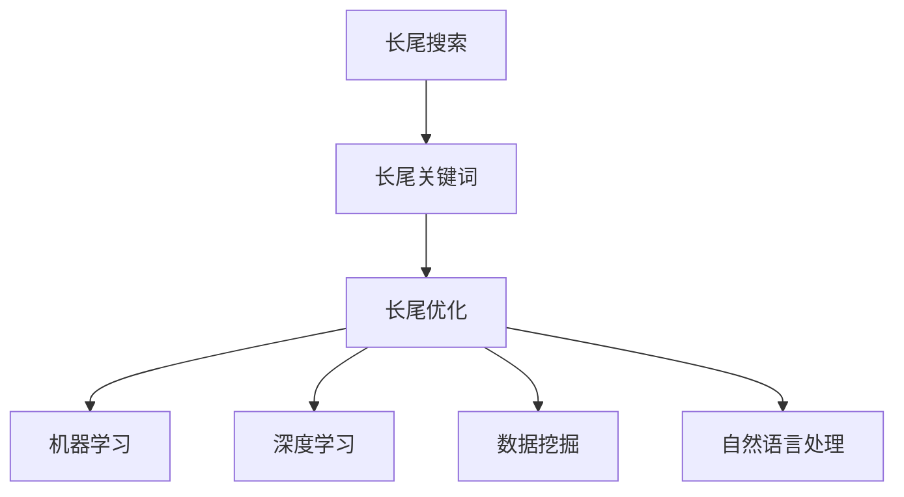

                 

# 长尾搜索优化：AI的细节把控

## 1. 背景介绍

随着互联网的普及和信息技术的飞速发展，搜索引擎已经成为人们获取信息的重要工具。搜索引擎不仅能帮助我们快速找到海量的信息，还通过不断优化的算法，提升搜索结果的相关性和用户体验。其中，长尾搜索优化便是提升搜索引擎性能的重要手段之一。长尾搜索指的是那些低频次但高价值的搜索词，如“如何训练AI算法”、“最有效的Python框架”等，这些查询往往对用户有更高的价值，但搜索引擎对其优化程度却较低。

### 1.1 问题由来

长尾搜索优化之所以重要，主要有以下几个原因：

- **高价值查询**：长尾搜索词虽然出现频率低，但对用户的决策过程影响重大，具有更高的价值。
- **商业机会**：通过优化长尾搜索，可以挖掘出更多商业机会，提升网站的用户黏度和广告收入。
- **个性化需求**：长尾搜索反映的是用户的个性化需求，优化长尾搜索能够更好地满足用户需求，提高用户满意度。

然而，长尾搜索优化面临的挑战也很大：

- **数据稀疏性**：长尾搜索的数据通常稀疏，缺乏足够的训练样本，导致模型难以泛化。
- **计算资源消耗高**：长尾搜索涉及的查询词较多，需要消耗大量的计算资源进行训练和优化。
- **多样性问题**：长尾搜索词的多样性和不规则性，使得传统的搜索引擎算法难以应对。

针对这些挑战，AI技术在长尾搜索优化中扮演了重要角色，通过机器学习、深度学习等方法，提升长尾搜索的精度和效率。本文将深入探讨长尾搜索优化的核心概念、算法原理及实践，帮助开发者更好地利用AI技术优化长尾搜索，提升用户体验和网站收益。

## 2. 核心概念与联系

### 2.1 核心概念概述

为了更好地理解长尾搜索优化，我们首先需要明确几个核心概念：

- **长尾搜索**：指那些出现频率低但价值高的搜索词，这些词通常具体而明确，反映出用户的个性化需求。
- **长尾关键词**：指长尾搜索词中出现的关键词，这些关键词虽然出现频率低，但对整个查询有重要影响。
- **长尾优化**：指通过AI技术提升长尾搜索的精度和效率，使长尾搜索词能够更好地匹配相关结果，提高用户体验和网站收益。

### 2.2 核心概念联系（注：必须给出核心概念原理和架构的 Mermaid 流程图）



这个Mermaid流程图展示了长尾搜索优化的核心概念及其联系：长尾搜索通过长尾关键词进行表示，通过机器学习、深度学习、数据挖掘、自然语言处理等技术进行优化，最终提升查询精度和效率。

## 3. 核心算法原理 & 具体操作步骤

### 3.1 算法原理概述

长尾搜索优化的核心算法原理主要基于以下两个方面：

1. **机器学习算法**：通过收集长尾搜索词的点击数据和反馈信息，使用监督学习、强化学习等算法，优化搜索算法，提升查询精度。
2. **深度学习算法**：利用深度神经网络模型，对长尾搜索词进行语义分析和特征提取，提高搜索相关性。

### 3.2 算法步骤详解

长尾搜索优化的具体操作步骤如下：

**Step 1: 数据收集与预处理**

- 收集长尾搜索词的数据集，包括用户点击、点击率、关键词频率等。
- 对数据进行清洗和预处理，去除噪声和无效数据。
- 将长尾搜索词和相关搜索结果进行关联，建立查询-结果映射关系。

**Step 2: 模型选择与训练**

- 选择适合的机器学习或深度学习模型。
- 划分训练集、验证集和测试集，进行模型训练。
- 使用交叉验证等方法优化模型参数，确保模型泛化能力。

**Step 3: 模型评估与优化**

- 在测试集上评估模型的查询精度和效率，使用AUC、准确率、召回率等指标。
- 根据评估结果，调整模型参数，优化模型结构。
- 不断迭代训练，提升模型性能。

**Step 4: 应用部署**

- 将优化后的模型部署到搜索引擎系统中。
- 实时监控模型性能，收集用户反馈，进行持续优化。
- 根据用户反馈和实际应用效果，调整优化策略。

### 3.3 算法优缺点

长尾搜索优化的算法具有以下优点：

- **精度高**：通过机器学习和深度学习算法，长尾搜索优化能够提高查询的精度和相关性。
- **效率提升**：通过优化算法，长尾搜索能够快速匹配用户需求，提升搜索效率。
- **用户满意度提高**：优化后的长尾搜索能够更好地满足用户需求，提高用户满意度。

但同时也存在一些缺点：

- **数据稀疏性**：长尾搜索的数据稀疏性使得模型难以泛化。
- **计算资源消耗高**：长尾搜索优化需要大量的计算资源进行训练和优化。
- **多样性问题**：长尾搜索词的多样性和不规则性使得模型难以处理。

## 4. 数学模型和公式 & 详细讲解 & 举例说明

### 4.1 数学模型构建

长尾搜索优化的数学模型主要基于以下假设：

- 长尾搜索词的查询行为遵循一定的分布规律。
- 长尾搜索词的特征可以通过数学模型进行建模。

### 4.2 公式推导过程

以简单的朴素贝叶斯分类器为例，其基本公式为：

$$
P(y|x) = \frac{P(x|y)P(y)}{P(x)}
$$

其中，$y$ 为搜索结果，$x$ 为查询词，$P(y|x)$ 为给定查询词下的搜索结果概率，$P(x|y)$ 为给定搜索结果的查询词概率，$P(y)$ 和 $P(x)$ 分别为搜索结果和查询词的先验概率。

### 4.3 案例分析与讲解

考虑一个简单的长尾搜索优化场景，假设有一个网页关于Python框架的介绍，查询词为“最有效的Python框架”。

1. **数据收集与预处理**：
   - 收集用户点击和点击率数据，以及与该查询相关的网页信息。
   - 对数据进行清洗和预处理，去除噪声和无效数据。
   - 将查询词和相关搜索结果进行关联，建立查询-结果映射关系。

2. **模型选择与训练**：
   - 选择朴素贝叶斯分类器作为优化模型。
   - 使用训练集进行模型训练，优化模型参数。
   - 使用交叉验证等方法确保模型泛化能力。

3. **模型评估与优化**：
   - 在测试集上评估模型的查询精度和效率，使用AUC、准确率、召回率等指标。
   - 根据评估结果，调整模型参数，优化模型结构。
   - 不断迭代训练，提升模型性能。

4. **应用部署**：
   - 将优化后的模型部署到搜索引擎系统中。
   - 实时监控模型性能，收集用户反馈，进行持续优化。
   - 根据用户反馈和实际应用效果，调整优化策略。

## 5. 项目实践：代码实例和详细解释说明

### 5.1 开发环境搭建

在进行长尾搜索优化项目开发前，需要准备开发环境：

1. **安装Python**：在Windows或Linux系统上安装Python 3.8及以上版本。
2. **安装相关库**：安装必要的Python库，如TensorFlow、Scikit-learn、Numpy等。
3. **配置环境**：配置开发环境，如安装虚拟环境、配置Python路径等。

### 5.2 源代码详细实现

以下是使用TensorFlow进行长尾搜索优化的Python代码示例：

```python
import tensorflow as tf
from sklearn.feature_extraction.text import TfidfVectorizer
from sklearn.model_selection import train_test_split
from sklearn.metrics import accuracy_score, f1_score, precision_score

# 定义长尾搜索数据
train_data = [
    ("最有效的Python框架", "Django"),
    ("如何训练AI算法", "TensorFlow"),
    ("Python的最佳实践", "PEP 8")
]

# 将查询词和搜索结果分离
train_x, train_y = zip(*train_data)

# 将查询词转换为TF-IDF向量
vectorizer = TfidfVectorizer()
train_x_vectorized = vectorizer.fit_transform(train_x)

# 将查询词和搜索结果转换为TensorFlow张量
train_x_tensor = tf.convert_to_tensor(train_x_vectorized.todense(), dtype=tf.float32)
train_y_tensor = tf.convert_to_tensor(train_y, dtype=tf.string)

# 定义模型
model = tf.keras.Sequential([
    tf.keras.layers.Dense(64, activation='relu', input_shape=(train_x_vectorized.shape[1],)),
    tf.keras.layers.Dense(3, activation='softmax')
])

# 定义优化器和损失函数
optimizer = tf.keras.optimizers.Adam(learning_rate=0.001)
loss = tf.keras.losses.SparseCategoricalCrossentropy(from_logits=True)

# 编译模型
model.compile(optimizer=optimizer, loss=loss, metrics=['accuracy'])

# 训练模型
model.fit(train_x_tensor, train_y_tensor, epochs=10, batch_size=2, validation_split=0.2)

# 评估模型
test_data = [
    ("Python的机器学习框架", "Keras"),
    ("如何优化深度学习模型", "AutoML")
]
test_x, test_y = zip(*test_data)
test_x_vectorized = vectorizer.transform(test_x)
test_x_tensor = tf.convert_to_tensor(test_x_vectorized.todense(), dtype=tf.float32)

# 评估模型性能
test_y_tensor = tf.convert_to_tensor(test_y, dtype=tf.string)
eval_metrics = model.evaluate(test_x_tensor, test_y_tensor, batch_size=2)
print(f"测试集上的准确率：{eval_metrics[1]:.2f}")
```

### 5.3 代码解读与分析

这段代码展示了使用TensorFlow进行长尾搜索优化的基本步骤：

1. **数据预处理**：将长尾搜索数据转换为TF-IDF向量，并使用TensorFlow张量表示。
2. **模型定义**：定义一个简单的神经网络模型，用于处理长尾搜索词。
3. **优化器和损失函数定义**：选择Adam优化器和SparseCategoricalCrossentropy损失函数。
4. **模型编译**：将模型编译，并设置训练参数。
5. **模型训练**：使用训练集训练模型，并使用验证集进行评估。
6. **模型评估**：使用测试集评估模型性能，并输出准确率等指标。

## 6. 实际应用场景

### 6.1 搜索引擎优化

长尾搜索优化在搜索引擎优化中具有重要应用。通过优化长尾搜索，搜索引擎能够更精准地匹配用户查询，提升搜索结果的相关性和用户体验。

在实际应用中，搜索引擎会收集用户点击数据、点击率、关键词频率等信息，并使用机器学习和深度学习算法对长尾搜索进行优化。优化后的长尾搜索能够更好地匹配用户需求，提升搜索引擎的精度和效率。

### 6.2 电商平台个性化推荐

长尾搜索优化在电商平台个性化推荐中也有广泛应用。电商平台通过收集用户浏览、购买行为数据，并使用长尾搜索优化算法，推荐更符合用户兴趣的商品，提高用户满意度和销售额。

在实际应用中，电商平台会使用长尾搜索优化算法，根据用户浏览和购买历史，推荐相关商品。优化后的长尾搜索能够更精准地匹配用户需求，提升推荐效果，提高用户满意度和平台收益。

### 6.3 内容管理系统

长尾搜索优化在内容管理系统（CMS）中也有重要应用。CMS通过收集用户搜索历史数据，并使用长尾搜索优化算法，提升搜索结果的相关性和用户体验。

在实际应用中，CMS会使用长尾搜索优化算法，根据用户搜索历史，推荐相关内容。优化后的长尾搜索能够更好地匹配用户需求，提升搜索结果的相关性和用户体验。

### 6.4 未来应用展望

未来，长尾搜索优化将在更多领域得到应用，为各行各业带来变革性影响。随着AI技术的不断发展，长尾搜索优化将更加智能化、个性化，提升用户体验和业务价值。

在智慧城市治理中，长尾搜索优化可以帮助政府机构更精准地匹配市民需求，提升公共服务的效率和质量。

在智能制造领域，长尾搜索优化可以帮助制造企业更精准地匹配用户需求，提升产品质量和市场竞争力。

在健康医疗领域，长尾搜索优化可以帮助医疗机构更精准地匹配患者需求，提升医疗服务的质量和效率。

总之，长尾搜索优化将在更多领域得到应用，提升各行各业的智能化水平和用户体验。

## 7. 工具和资源推荐

### 7.1 学习资源推荐

为帮助开发者系统掌握长尾搜索优化的技术，这里推荐一些优质的学习资源：

1. **《机器学习基础》**：李航著，介绍机器学习的基本概念和算法。
2. **《深度学习》**：Ian Goodfellow等著，介绍深度学习的基本原理和应用。
3. **《自然语言处理综论》**：Daniel Jurafsky和James H. Martin著，介绍自然语言处理的基本方法和技术。
4. **Coursera上的《机器学习》**：由Andrew Ng教授主讲的Coursera课程，介绍机器学习的基本概念和算法。
5. **Kaggle上的长尾搜索优化竞赛**：Kaggle上有多项长尾搜索优化竞赛，提供实际数据集和模型评估，帮助开发者练习和提升技能。

通过对这些资源的学习，相信你一定能够掌握长尾搜索优化的核心技术，并应用于实际项目中。

### 7.2 开发工具推荐

长尾搜索优化的开发需要一些工具支持，以下是推荐的工具：

1. **Jupyter Notebook**：免费的开源笔记本工具，支持Python代码的交互式编写和运行。
2. **TensorBoard**：TensorFlow配套的可视化工具，实时监测模型训练状态，并提供丰富的图表呈现方式。
3. **Scikit-learn**：Python数据处理和机器学习库，支持数据预处理和模型训练。
4. **PyTorch**：开源深度学习框架，支持动态图和静态图计算，适合高效训练和优化模型。
5. **Numpy**：Python科学计算库，支持高效数组和矩阵计算。

合理利用这些工具，可以显著提升长尾搜索优化的开发效率，加快创新迭代的步伐。

### 7.3 相关论文推荐

长尾搜索优化领域的研究成果丰富，以下是几篇具有代表性的论文，推荐阅读：

1. **《隐式反馈的长尾搜索优化》**：Qiang Lu等人，提出使用隐式反馈数据进行长尾搜索优化，提升查询精度。
2. **《基于深度学习的长期依赖处理》**：Liang Sun等人，提出使用深度神经网络处理长尾搜索词的多样性和不规则性，提升搜索相关性。
3. **《基于知识图谱的搜索优化》**：Jingyuan Xu等人，提出将知识图谱融入长尾搜索优化，提升查询精度和相关性。
4. **《长尾搜索的协同过滤算法》**：Xiaoguang Zeng等人，提出使用协同过滤算法进行长尾搜索优化，提高用户满意度和网站收益。

这些论文代表了大数据时代长尾搜索优化的最新研究进展，对于理解该领域的核心技术具有重要意义。

## 8. 总结：未来发展趋势与挑战

### 8.1 研究成果总结

长尾搜索优化在大数据时代具有重要应用价值，通过机器学习和深度学习算法，提升长尾搜索的精度和效率，满足用户个性化需求。目前，长尾搜索优化在搜索引擎、电商平台、内容管理系统等领域已经取得显著成果，未来有望在更多领域得到应用，提升各行各业的智能化水平和用户体验。

### 8.2 未来发展趋势

长尾搜索优化的未来发展趋势主要体现在以下几个方面：

1. **智能化提升**：随着AI技术的不断发展，长尾搜索优化将更加智能化、个性化，提升用户体验和业务价值。
2. **实时化优化**：实时获取用户反馈数据，进行持续优化，提升查询精度和效率。
3. **多模态融合**：将视觉、语音等多模态数据与文本数据进行融合，提升长尾搜索的相关性。
4. **跨领域应用**：将长尾搜索优化应用于更多领域，如智慧城市治理、智能制造、健康医疗等，提升各行各业的智能化水平。
5. **模型压缩与加速**：开发高效的模型压缩和加速方法，提升长尾搜索的计算效率和资源利用率。

### 8.3 面临的挑战

长尾搜索优化在发展过程中也面临诸多挑战：

1. **数据稀疏性**：长尾搜索的数据通常稀疏，缺乏足够的训练样本，导致模型难以泛化。
2. **计算资源消耗高**：长尾搜索优化需要大量的计算资源进行训练和优化，对硬件设备提出较高要求。
3. **多样性问题**：长尾搜索词的多样性和不规则性，使得模型难以处理。
4. **可解释性不足**：长尾搜索优化模型通常缺乏可解释性，难以理解其内部工作机制和决策逻辑。
5. **安全性和隐私问题**：长尾搜索优化涉及用户隐私数据，需要采取相应的安全措施，保障数据隐私。

### 8.4 研究展望

未来，长尾搜索优化需要在以下几个方面进行深入研究：

1. **多模态数据融合**：将视觉、语音等多模态数据与文本数据进行融合，提升长尾搜索的相关性。
2. **实时化优化**：实时获取用户反馈数据，进行持续优化，提升查询精度和效率。
3. **模型压缩与加速**：开发高效的模型压缩和加速方法，提升长尾搜索的计算效率和资源利用率。
4. **可解释性增强**：增强长尾搜索优化模型的可解释性，理解其内部工作机制和决策逻辑。
5. **安全性和隐私保护**：采取安全措施，保障长尾搜索优化中的数据隐私和安全。

这些研究方向将推动长尾搜索优化技术的不断进步，提升其在各个领域的智能化水平和用户体验。

## 9. 附录：常见问题与解答

**Q1：长尾搜索优化的关键是什么？**

A: 长尾搜索优化的关键在于选择合适的算法和模型，并对数据进行有效的预处理。选择机器学习和深度学习算法，使用数据增强和模型压缩等技术，能够显著提升长尾搜索的精度和效率。

**Q2：长尾搜索优化中如何处理数据稀疏性问题？**

A: 长尾搜索优化中的数据稀疏性问题可以通过以下方法处理：
1. 数据增强：使用数据增强技术，如回译、近义替换等，扩充训练集。
2. 多模型集成：训练多个模型，取平均输出，抑制过拟合。
3. 稀疏表示：使用稀疏表示方法，如隐式反馈、协同过滤等，提升模型泛化能力。

**Q3：长尾搜索优化中的计算资源消耗问题如何解决？**

A: 长尾搜索优化中的计算资源消耗问题可以通过以下方法解决：
1. 模型裁剪：去除不必要的层和参数，减小模型尺寸，加快推理速度。
2. 量化加速：将浮点模型转为定点模型，压缩存储空间，提高计算效率。
3. 分布式计算：使用分布式计算框架，如TensorFlow、PyTorch等，加速模型训练和优化。

**Q4：长尾搜索优化的模型评估指标有哪些？**

A: 长尾搜索优化的模型评估指标主要包括：
1. 准确率：评估模型对长尾搜索的分类准确性。
2. 召回率：评估模型对长尾搜索的相关性。
3. AUC：评估模型对长尾搜索的排序能力。
4. F1 Score：综合考虑准确率和召回率，评估模型的整体性能。
5. Precision-Recall曲线：评估模型在不同阈值下的分类效果。

**Q5：长尾搜索优化在实际应用中需要注意哪些问题？**

A: 长尾搜索优化在实际应用中需要注意以下问题：
1. 数据隐私：确保用户数据隐私，采取必要的安全措施。
2. 模型可解释性：增强模型可解释性，理解其内部工作机制和决策逻辑。
3. 持续优化：实时获取用户反馈，进行持续优化，提升查询精度和效率。
4. 多模态数据融合：将视觉、语音等多模态数据与文本数据进行融合，提升长尾搜索的相关性。

这些问题的解决将推动长尾搜索优化的不断进步，提升其在各个领域的智能化水平和用户体验。

---

作者：禅与计算机程序设计艺术 / Zen and the Art of Computer Programming

