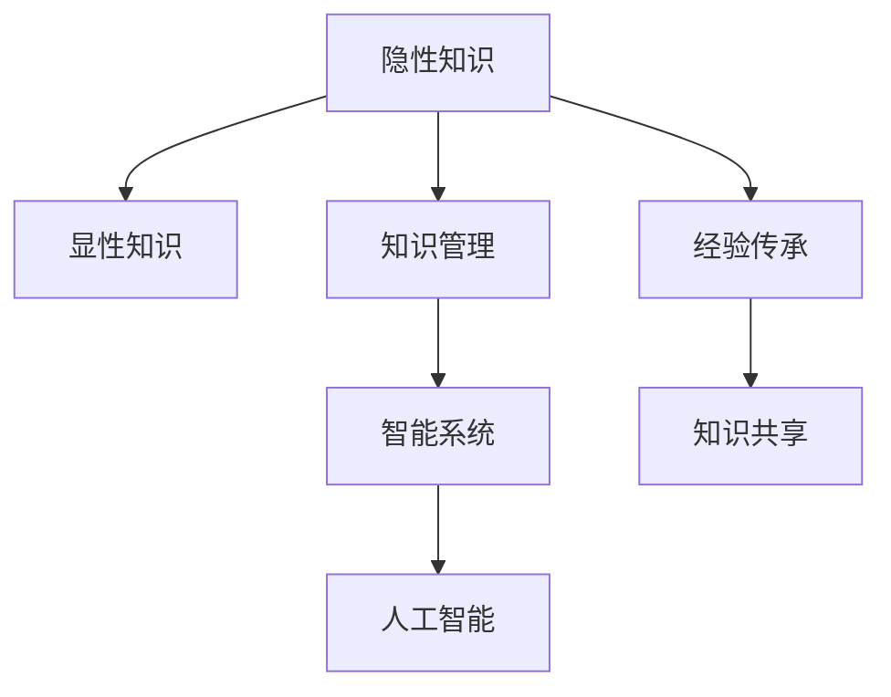

                 

# 隐性知识显性化：经验传承的关键

> 关键词：隐性知识,显性化,经验传承,知识管理,智能系统

## 1. 背景介绍

### 1.1 问题由来
在当今信息爆炸的时代，组织和个体需要处理的信息量急剧增长。在瞬息万变的复杂环境中，如何高效地捕获、整合和利用知识，成为每个组织和个人面临的重大挑战。长期以来，知识被分为显性知识和隐性知识两大类，前者容易编码记录，后者通常蕴含在个人经验和行为中，难以直接获取。

隐性知识是个人、团队或组织中最为宝贵的资产之一，但它往往以非结构化或半结构化的形式存在，难以标准化、系统化，制约了知识传播和共享的效率。企业中，老员工积累的宝贵经验往往因离职而流失，新员工在面临复杂任务时，因缺乏有效指导而事倍功半。在开源社区中，有经验的开发者将自己的实践心得分享出来，但这些信息往往以代码片段、经验贴等形式存在，缺乏结构化的梳理和应用指导。

### 1.2 问题核心关键点
如何高效地将隐性知识显性化，转化为易于传播、易于应用的形式，是知识管理领域长期以来的挑战。本文聚焦于利用计算机技术将隐性知识转换为显性知识的实践与思考，希望通过系统的理论阐述与实践示范，为这一问题的解决提供新的视角。

### 1.3 问题研究意义
将隐性知识显性化，不仅可以降低知识获取的门槛，加速知识传播，还能通过系统化的方式，提升知识的重用性和创造性。对于企业而言，这意味着能够更好地传承经验和智慧，提升组织的创新能力。对于个人而言，则意味着可以更加高效地学习和应用知识，促进职业成长。在知识驱动的经济中，这一问题的解决将深刻影响组织和个人的竞争力。

## 2. 核心概念与联系

### 2.1 核心概念概述

为了更好地理解如何利用计算机技术将隐性知识显性化，本文将介绍几个核心概念：

- 隐性知识（Tacit Knowledge）：无法通过语言、文字、数字等符号形式明确表达的知识，通常体现在个人经验、技能、直觉等方面。
- 显性知识（Explicit Knowledge）：可以明确表达和记录的知识，如书籍、论文、规范、制度等。
- 知识管理（Knowledge Management）：系统化、结构化地获取、整理、传播和应用知识的过程。
- 智能系统（Intelligent Systems）：通过知识管理实现自动化的决策、推理、学习等功能的系统，如专家系统、决策支持系统等。
- 人工智能（AI）：利用计算机技术模拟人类智能的科学，包括机器学习、自然语言处理、计算机视觉等领域。
- 经验传承（Knowledge Transfer）：将个人或团体的经验知识传授给其他个体或团体，实现知识共享和复制的过程。

这些核心概念之间的关系可以通过以下Mermaid流程图来展示：



这个流程图展示了几类知识之间的转换关系：

1. 隐性知识通过知识管理转化为显性知识，形成系统的知识库。
2. 显性知识通过智能系统进行自动化处理，实现智能化决策和推理。
3. 智能系统利用人工智能技术进行深度学习和推理，提升知识应用效率。
4. 经验传承通过知识共享将隐性知识传递给其他个体，实现知识复制。

这些概念共同构成了知识管理与智能系统相结合的框架，促进了知识的获取、传播和应用，最终推动了人工智能的发展。

## 3. 核心算法原理 & 具体操作步骤
### 3.1 算法原理概述

将隐性知识显性化，其核心在于通过系统化的技术手段，将难以言传的经验和技能转换为易于理解和操作的形式，供其他人学习和应用。这一过程通常包括以下几个关键步骤：

1. **知识提取与编码**：从个人经验或案例中提取关键要素，以结构化的形式编码。
2. **知识整合与验证**：将提取的隐性知识与已有显性知识整合，并通过数据验证其有效性。
3. **知识应用与反馈**：将整合后的显性知识应用于实际场景，并通过反馈进一步优化和迭代。

### 3.2 算法步骤详解

具体来说，将隐性知识显性化的步骤可以概括为以下四步：

1. **知识提取与编码**
   - **步骤1**：通过访谈、观察、记录等方式，获取个体的隐性知识。
   - **步骤2**：利用自然语言处理（NLP）技术对获取的知识进行文本分析和结构化编码，形成结构化的文档或数据库。

2. **知识整合与验证**
   - **步骤3**：将结构化的隐性知识与现有的显性知识体系进行整合，通过逻辑推理、数据验证等方式验证其正确性和完备性。
   - **步骤4**：利用机器学习技术，自动发现和抽取隐性知识中的关键要素，并通过预测模型的验证，确认其有效性。

3. **知识应用与反馈**
   - **步骤5**：将验证通过的显性知识应用于实际问题解决中，如客户服务、产品开发、业务运营等。
   - **步骤6**：通过监测和反馈机制，收集实际应用效果的数据，进一步优化和迭代知识库。

### 3.3 算法优缺点

将隐性知识显性化的技术手段具有以下优点：

1. **知识复用性增强**：通过编码和整合，显性知识可以被反复使用，降低了获取知识的成本。
2. **传播效率提升**：显性知识易于标准化和系统化，便于大规模传播和应用。
3. **知识迭代优化**：通过反馈机制，显性知识可以不断迭代优化，保持其时效性和准确性。

然而，这一过程也存在一定的局限性：

1. **知识获取成本高**：高质量隐性知识的获取需要大量时间和资源，特别是在复杂和高风险领域。
2. **编码难度大**：隐性知识往往难以用语言精确表达，编码工作复杂且耗时。
3. **知识应用复杂**：显性知识的应用需要结合具体场景进行定制化设计，复杂度较高。
4. **知识更新慢**：显性知识更新和迭代速度相对较慢，难以跟上快速变化的业务需求。

### 3.4 算法应用领域

将隐性知识显性化的技术手段广泛应用于多个领域：

1. **企业知识管理**：通过知识管理平台，将员工的经验和知识编码和整合，形成企业知识库，供全员共享和复用。
2. **医疗诊断支持**：医生通过记录病历和诊疗经验，利用自然语言处理技术进行编码，形成诊断知识库，提升诊疗效率。
3. **金融风险控制**：通过记录分析师的经验和洞察，利用机器学习技术进行知识整合和验证，构建风险预警模型。
4. **制造业流程优化**：工程师将操作经验和技术要点编码，形成工艺知识库，优化生产流程。
5. **教育培训体系**：将优秀教师的教学经验和案例整理成教学资源库，供其他教师和学生学习。

以上领域展示了将隐性知识显性化的广泛应用场景，说明其对于提升知识传播和应用效率的重要价值。

## 4. 数学模型和公式 & 详细讲解 & 举例说明

### 4.1 数学模型构建

为了将隐性知识进行形式化描述，我们可以建立一个简单的数学模型：

- **输入**：隐性知识 $K$，包含若干个隐性要素 $k_1, k_2, ..., k_n$。
- **编码器**：一个映射函数 $f$，将隐性要素映射为显性要素 $d_1, d_2, ..., d_n$。
- **输出**：显性知识库 $D$，包含显性要素 $d_1, d_2, ..., d_n$。

显性知识库 $D$ 通常由若干个数据表组成，每个数据表包含一个或多个显性要素。例如，一个医疗诊断知识库可以包含症状、诊断结果、治疗方案等显性要素。

### 4.2 公式推导过程

假设有 $m$ 个隐性要素 $k_i$ 和 $n$ 个显性要素 $d_j$，编码器 $f$ 可以通过以下公式进行映射：

$$
d_j = f(k_i)
$$

其中 $i \in [1, m]$，$j \in [1, n]$。编码器 $f$ 可以通过训练神经网络来实现，具体形式为：

$$
d_j = \sum_{i=1}^{m} w_{ij}k_i + b_j
$$

其中 $w_{ij}$ 是权重矩阵，$b_j$ 是偏置向量。训练神经网络的过程包括前向传播和反向传播，可以优化权重矩阵和偏置向量，使得显性要素 $d_j$ 更准确地映射隐性要素 $k_i$。

### 4.3 案例分析与讲解

以一个简单的医疗诊断案例为例：

假设有一个资深医生 $A$，其丰富的诊断经验包含以下隐性知识：

- 症状 $k_1 = \{\text{发烧}, \text{咳嗽}, \text{咽痛}\}$
- 诊断 $k_2 = \{\text{感冒}, \text{肺炎}, \text{流感}\}$
- 治疗方案 $k_3 = \{\text{休息}, \text{用药}, \text{观察}\}$

医生 $A$ 将这些知识记录成隐性知识文档 $K$：

```
症状：发烧，咳嗽，咽痛
诊断：感冒，肺炎，流感
治疗方案：休息，用药，观察
```

通过自然语言处理技术，我们可以将上述隐性知识进行编码，形成显性知识库 $D$：

```
症状：
- 发烧
- 咳嗽
- 咽痛

诊断：
- 感冒
- 肺炎
- 流感

治疗方案：
- 休息
- 用药
- 观察
```

显性知识库 $D$ 可以进一步整合到医院的诊断知识库中，供其他医生查询和应用。这样，即使医生 $A$ 离开医院，其丰富的诊断经验依然可以通过显性知识库进行复用和传递。

## 5. 项目实践：代码实例和详细解释说明

### 5.1 开发环境搭建

要进行隐性知识的编码和整合，我们需要准备好相应的开发环境。以下是使用Python进行自然语言处理和知识管理开发的常见环境配置：

1. 安装Anaconda：从官网下载并安装Anaconda，用于创建独立的Python环境。

2. 创建并激活虚拟环境：
```bash
conda create -n knowledge-management python=3.8 
conda activate knowledge-management
```

3. 安装相关依赖包：
```bash
pip install pandas numpy transformers sklearn
```

4. 安装TextBlob：用于自然语言处理，方便进行文本分析和编码。

```bash
pip install textblob
```

5. 安装NLTK：自然语言工具包，提供了丰富的NLP功能。

```bash
pip install nltk
```

6. 安装PyTorch：深度学习框架，用于构建知识编码的神经网络模型。

```bash
pip install torch
```

完成上述步骤后，即可在`knowledge-management`环境中开始编码实践。

### 5.2 源代码详细实现

下面以一个简单的医疗诊断案例为例，展示如何使用Python对隐性知识进行编码和整合。

首先，定义隐性知识的结构：

```python
from textblob import TextBlob

# 定义隐性知识结构
symptoms = ["发烧", "咳嗽", "咽痛"]
diagnosis = ["感冒", "肺炎", "流感"]
treatment = ["休息", "用药", "观察"]

# 创建隐性知识文档
knowledge_doc = {
    "症状": symptoms,
    "诊断": diagnosis,
    "治疗方案": treatment
}
```

接着，使用自然语言处理技术进行编码：

```python
# 使用TextBlob进行自然语言处理
blob = TextBlob(str(knowledge_doc))
```

然后，将编码后的显性知识整合到知识库中：

```python
# 定义知识库结构
knowledge_base = {
    "症状": [],
    "诊断": [],
    "治疗方案": []
}

# 将显性知识添加到知识库中
for key, value in knowledge_doc.items():
    knowledge_base[key].extend(value)

# 输出知识库
print(knowledge_base)
```

最后，构建显性知识库的表格，方便后续查询和应用：

```python
# 构建知识库表格
import pandas as pd

knowledge_df = pd.DataFrame(knowledge_base)

# 输出表格
print(knowledge_df)
```

### 5.3 代码解读与分析

让我们再详细解读一下关键代码的实现细节：

**隐性知识结构**：
- 定义了隐性知识的结构，包括症状、诊断和治疗方案。

**自然语言处理**：
- 使用TextBlob对隐性知识进行自然语言处理，获取文本的语义信息。

**知识库整合**：
- 定义了知识库的结构，将编码后的显性知识整合到知识库中。

**知识库表格**：
- 使用Pandas构建知识库的表格，方便后续查询和应用。

通过上述代码，我们展示了如何将隐性知识编码成显性知识，并整合到知识库中。在实际应用中，可以进一步扩展知识库的功能，如添加搜索功能、实现查询优化等，提升知识管理的效率。

## 6. 实际应用场景

### 6.1 企业知识管理

企业知识管理是隐性知识显性化应用的典型场景。企业内部积累了大量的经验知识，如流程优化、项目管理、客户服务等，但这些知识往往分散在员工的头脑中，难以系统化管理和复用。

企业知识管理平台可以采用以下步骤进行实践：

1. **知识提取与编码**：通过访谈、问卷调查等方式，获取员工的经验和知识。
2. **知识整合与验证**：将获取的知识进行编码和整合，形成知识库。
3. **知识应用与反馈**：将知识库中的知识应用于实际工作流程，通过绩效评估和反馈机制进一步优化和迭代。

### 6.2 医疗诊断支持

医疗领域积累了大量的诊断经验和案例，但这些经验通常以个人经验的形式存在，难以系统化管理和应用。通过隐性知识显性化，可以将这些经验编码成显性知识，供医生和患者参考。

医疗诊断支持系统可以采用以下步骤进行实践：

1. **知识提取与编码**：通过访谈和记录，获取医生的诊断经验。
2. **知识整合与验证**：将经验进行编码和整合，形成诊断知识库。
3. **知识应用与反馈**：将知识库应用于诊断流程中，通过数据分析和反馈机制优化诊断效果。

### 6.3 金融风险控制

金融分析师和专家积累了丰富的市场分析和风险控制经验，但这些经验往往以非结构化的形式存在，难以系统化管理和应用。通过隐性知识显性化，可以将这些经验编码成显性知识，供风险控制模型参考。

金融风险控制系统可以采用以下步骤进行实践：

1. **知识提取与编码**：通过访谈和记录，获取分析师的经验和洞察。
2. **知识整合与验证**：将经验进行编码和整合，形成风险知识库。
3. **知识应用与反馈**：将知识库应用于风险控制模型中，通过数据分析和反馈机制优化风险控制效果。

### 6.4 未来应用展望

随着技术的进步，隐性知识显性化将在更多领域得到应用，为组织和个人带来新的发展机遇。

1. **智能客服系统**：基于隐性知识显性化，构建智能客服系统，提升客户服务的智能化水平。
2. **教育培训体系**：将教师的经验和案例整理成教学资源库，提升教学效果。
3. **智慧医疗系统**：将医生的诊断经验和案例编码成显性知识，提升诊疗效率。
4. **金融决策支持**：将分析师的经验和洞察编码成显性知识，优化风险控制和投资决策。
5. **制造业生产优化**：将工程师的操作经验和优化方案编码成显性知识，提升生产效率。

## 7. 工具和资源推荐

### 7.1 学习资源推荐

为了帮助开发者系统掌握隐性知识显性化的理论基础和实践技巧，这里推荐一些优质的学习资源：

1. 《Python自然语言处理》书籍：详细介绍了自然语言处理的基本原理和实现方法，包括分词、词性标注、句法分析等。
2. 《深度学习实战》书籍：介绍了深度学习的基本原理和实践技巧，包括神经网络、卷积神经网络、循环神经网络等。
3. 《自然语言处理与深度学习》课程：斯坦福大学开设的NLP课程，涵盖NLP的基本概念和经典模型，适合初学者入门。
4. 《知识管理与组织学习》书籍：介绍了知识管理的基本原理和实践方法，包括知识提取、知识整合、知识应用等。
5. 《知识管理工具和技术》课程：Coursera上的知识管理课程，介绍常用的知识管理工具和技术，适合从业人员学习。

通过对这些资源的学习实践，相信你一定能够快速掌握隐性知识显性化的精髓，并用于解决实际的NLP问题。

### 7.2 开发工具推荐

高效的开发离不开优秀的工具支持。以下是几款用于隐性知识显性化开发的常用工具：

1. PyTorch：深度学习框架，支持自动微分，方便构建和优化神经网络模型。
2. TensorFlow：由Google主导的深度学习框架，支持分布式计算，适合大规模工程应用。
3. NLTK：自然语言工具包，提供丰富的NLP功能，包括分词、词性标注、句法分析等。
4. TextBlob：基于NLTK的自然语言处理库，提供简单易用的API，方便进行文本分析和编码。
5. Scikit-learn：机器学习库，支持分类、回归、聚类等算法，方便进行知识验证和优化。
6. Pandas：数据分析库，支持数据清洗、转换、统计等操作，方便进行知识库的构建和管理。

合理利用这些工具，可以显著提升隐性知识显性化的开发效率，加快创新迭代的步伐。

### 7.3 相关论文推荐

隐性知识显性化领域的研究源于学界的持续探索。以下是几篇奠基性的相关论文，推荐阅读：

1. "Tacit Knowledge to Explicit Knowledge Conversion: A Survey"（隐性知识显性化综述）：综述了隐性知识显性化的主要方法和应用，指出了未来的研究方向。
2. "Knowledge Mining: An Overview"（知识挖掘综述）：介绍了知识挖掘的基本原理和实践方法，包括数据挖掘、文本挖掘、关系挖掘等。
3. "Explicit and Tacit Knowledge in Organizations"（组织中的显性和隐性知识）：分析了组织中显性知识和隐性知识的差异及其管理策略。
4. "Smart Computing in Healthcare"（智能计算在医疗中的应用）：介绍了智能计算在医疗领域的应用，包括专家系统、决策支持系统等。
5. "A Survey on Knowledge Extraction and Discovery"（知识提取与发现综述）：综述了知识提取和发现的主要方法和应用，包括文本挖掘、语义分析等。

这些论文代表了大语言模型微调技术的发展脉络。通过学习这些前沿成果，可以帮助研究者把握学科前进方向，激发更多的创新灵感。

## 8. 总结：未来发展趋势与挑战

### 8.1 总结

本文对隐性知识显性化的概念、原理和实践进行了全面系统的介绍。首先阐述了隐性知识的概念及其在知识管理中的重要性，明确了隐性知识显性化在知识管理领域的关键地位。其次，从原理到实践，详细讲解了隐性知识显性化的数学模型和操作步骤，给出了具体的代码实现。同时，本文还广泛探讨了隐性知识显性化在多个行业领域的应用前景，展示了其广阔的发展潜力。此外，本文精选了隐性知识显性化的各类学习资源，力求为读者提供全方位的技术指引。

通过本文的系统梳理，可以看到，隐性知识显性化在知识管理与智能系统中扮演着重要的角色。将难以言传的经验和技能转换为易于传播和应用的形式，极大地提升了知识的传播效率和应用价值。未来，随着技术的不断进步，隐性知识显性化的应用将进一步拓展，为组织和个人带来更广阔的发展机遇。

### 8.2 未来发展趋势

展望未来，隐性知识显性化技术将呈现以下几个发展趋势：

1. **自动化程度提升**：随着自然语言处理和机器学习技术的发展，隐性知识显性化的自动化程度将进一步提升，降低人工成本，提高效率。
2. **多模态融合**：隐性知识显性化将不仅仅局限于文本，还可能拓展到图像、视频、音频等多模态数据，实现更全面、丰富的知识表达。
3. **智能推荐系统**：通过隐性知识显性化，构建智能推荐系统，实现个性化知识推送，提升用户的学习效率和满意度。
4. **实时更新机制**：隐性知识显性化系统将具备实时更新机制，及时捕捉最新的知识和趋势，保持知识的时效性和创新性。
5. **知识关联网络**：构建知识关联网络，将显性知识与隐性知识进行深度融合，形成知识图谱，提升知识管理的层次和深度。

以上趋势凸显了隐性知识显性化技术的广阔前景。这些方向的探索发展，将进一步提升知识的传播和应用效率，推动知识驱动的社会进步。

### 8.3 面临的挑战

尽管隐性知识显性化技术已经取得了显著进展，但在迈向更加智能化、普适化应用的过程中，仍面临诸多挑战：

1. **知识获取难度大**：高质量隐性知识的获取需要大量时间和资源，特别是在复杂和高风险领域。
2. **知识编码复杂**：隐性知识往往难以用语言精确表达，编码工作复杂且耗时。
3. **知识应用复杂**：显性知识的应用需要结合具体场景进行定制化设计，复杂度较高。
4. **知识更新慢**：显性知识更新和迭代速度相对较慢，难以跟上快速变化的业务需求。
5. **知识质量参差不齐**：隐性知识显性化的质量很大程度上取决于编码和整合的方式，可能会出现不准确或过时的知识。

### 8.4 研究展望

面对隐性知识显性化面临的挑战，未来的研究需要在以下几个方面寻求新的突破：

1. **自动编码技术**：开发更高效的自动编码算法，降低人工干预的复杂度和成本。
2. **多模态融合技术**：探索多模态融合方法，提升知识表达的全面性和丰富性。
3. **实时知识管理系统**：构建实时更新的知识管理系统，提升知识的时效性和创新性。
4. **知识图谱构建**：开发知识图谱构建算法，实现知识之间的深度关联和融合。
5. **知识质量保证**：引入知识质量评估机制，确保隐性知识显性化的准确性和时效性。

这些研究方向的探索，必将引领隐性知识显性化技术迈向更高的台阶，为组织和个人带来更全面的知识管理和智能应用。面向未来，隐性知识显性化技术还需要与其他人工智能技术进行更深入的融合，如知识表示、因果推理、强化学习等，多路径协同发力，共同推动知识驱动的社会进步。总之，隐性知识显性化需要持续优化和创新，才能真正实现知识的高效传播和应用。

## 9. 附录：常见问题与解答

**Q1：隐性知识显性化是否适用于所有领域？**

A: 隐性知识显性化在大多数领域都可以得到应用，但对于一些特定领域，如艺术创作、哲学思辨等，其核心知识和智慧难以用语言精确表达，可能难以实现有效的显性化。

**Q2：隐性知识显性化过程中如何确保知识的质量？**

A: 确保隐性知识显性化的质量需要多方面的努力：
1. 选择合适的知识提取和编码方法，保证编码的准确性和全面性。
2. 通过数据验证和专家评审，确认显性知识的有效性和完备性。
3. 建立知识质量评估机制，定期检查和更新知识库中的知识。

**Q3：隐性知识显性化如何应用于实际场景？**

A: 隐性知识显性化在实际场景中的应用通常需要以下步骤：
1. 知识提取：通过访谈、问卷调查等方式，获取个体的隐性知识。
2. 知识编码：使用自然语言处理技术，将隐性知识进行编码和整合。
3. 知识应用：将显性知识应用于实际工作流程中，通过绩效评估和反馈机制优化和迭代。

**Q4：隐性知识显性化是否会失去其原有的灵性和创造性？**

A: 隐性知识显性化虽然以结构化的形式呈现，但其灵性和创造性可以通过合理的设计和应用得以保留。通过系统的隐性知识显性化，可以将个体的智慧和经验提炼成具有普适性和可复制性的知识，为更多的个体提供指导和启发，从而提升整体的知识水平和创新能力。

通过本文的系统梳理，可以看到，隐性知识显性化在知识管理与智能系统中扮演着重要的角色。将难以言传的经验和技能转换为易于传播和应用的形式，极大地提升了知识的传播效率和应用价值。未来，随着技术的不断进步，隐性知识显性化的应用将进一步拓展，为组织和个人带来更广阔的发展机遇。

